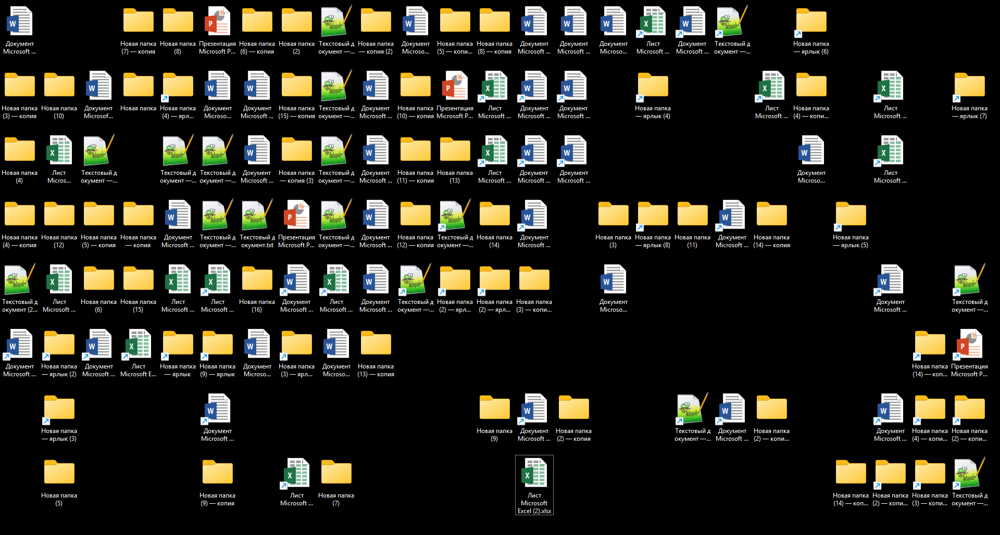

---
title: Советы для начинающего пользователя ПК
tags: [beginner, notrequired, all]
description: Практические рекомендации по настройке и оптимизации рабочего места.
---

# Советы для начинающего пользователя ПК

  ДЛЯ НОВИЧКОВ
  НЕ ОБЯЗАТЕЛЬНО
  В РАЗРАБОТКЕ

Всем

  
Внимание! Легкотня

  Скорее всего, вы уже знакомы со всем, что здесь перечислено, и вряд ли подчеркнёте для себя что-то новое. Но если найдёте новинки – значит, читали не зря!

## Советы для новичка

Компьютер - мощный инструмент, но любой пользователь, так или иначе, совершает ошибки. Какие-то широко распространены, какие-то встречаются реже. Важно соблюдать некоторые правила, чтобы эффективно использовать своё устройство.

---

### Безопасность

Безопасность прежде всего. Главная задача любого пользователя - защитить свои данные и устройство от угроз. Никогда не скачивайте программы с непроверенных источников, таких как торрент-трекеры или подозрительные сайты (наверняка встречали сайты с десятками кнопок «Скачать», где нажатие на любую вызывает скачивание всего, но только не нужного файла?). 

Официальные сайты разработчиков — это гарантия того, что вы получите безопасную версию программы. Кроме того, будьте внимательны при установке программ - часто в установщиках скрывается «дополнительный софт», который может замедлить работу системы или даже оказаться вредоносным. Всегда отказывайтесь от предложений установить ненужные утилиты. 

- *Не устанавливать «всё подряд»*:
	- скачивать программы только с официальных сайтов (не с торрент-трекеров или подозрительных страниц);
	- внимательно читать установщики – часто там скрыт «дополнительный софт»;
	
- *Резервное копирование*:
	- хранить важные файлы в облаке (Google, Яндекс) или на внешнем диске;
	- не забывать использовать автосохранение (да и в целом почаще сохраняться);

- *Не отключать Windows Defender и антивирусы*.

Если сохранять всё на один диск, то в случае поломки устройства - данные будут потеряны. Резервные копии можно сделать, используя другие (запасные) устройства и облачные сервисы (Google Drive, Яндекс.Диск). Помните, что потерять файлы гораздо проще, чем кажется.

---

### Браузеры

**Браузеры** — это наши основные инструменты для работы в интернете, и важно использовать их правильно. Установите блокировщик рекламы, чтобы защититься от надоедливой и потенциально опасно рекламы (кстати, браузеры будут сопротивляться - такова политика корпораций - они зарабатывают на рекламе). Регулярно очищайте кэш браузера, чтобы освободить место и улучшить производительность. Старайтесь не оставлять открытые вкладки, если они вам не нужны — это замедляет работу браузера и может привести к перегрузке оперативной памяти. Вместо этого добавляйте часто посещаемые страницы в закладки. И помните - сохранение паролей в браузере — это плохая идея, так как в случае взлома злоумышленники получат доступ ко всем вашим аккаунтам.

- *Работа с браузером*:
	- использовать блокировщик рекламы – это может ускорить загрузку страниц и защитить от вредоносной рекламы;
	- очищать кэш раз в месяц;
	- не сохранять пароли в браузере, лучше использовать менеджер паролей;
	- закрывать за собой вкладки в браузере и использовать закладки.

Многие пользователи халатно относятся к вкладкам, и их браузеры выглядят так:

Они не закрывают вкладки - так делать не нужно. Люди так делают, потому что не хотят «терять» или записывать ссылку на сайт. Но есть специальный механизм закладок в любом браузере, позволяющий группировать сохранённые сайты (и файлы) по папкам,что может позволить вам навести порядок в браузере. Важно создавать папки вроде «Учёба», «Инструменты», «Работа» и прочее - и группировать всё там в порядке иерархии.

---

### Беспорядок

Частая проблема начинающих пользователей - беспорядок на рабочем столе. Складывать все файлы на рабочий стол - привычка, схожая с «открытыми вкладками», но это удобно лишь первое время, потом найти нужный документ становится настоящим испытанием. Согласитесь, тяжеловато будет работать с замусоренным рабочим столом.

Лучше организовать свои файлы в логические папки и давать им потом осмысленные названия, например «2025» и внутри «Работа», «Отпуск». А в Windows, например, и вовсе есть специальные коллекции - готовые директории для размещения файлов - «Изображения», «Музыка», «Видео», «Документы» - почему бы не использовать их? Поэтому в этой ОС нет необходимости создавать такие же дубликаты. А если проблема в диске, когда есть диск с меткой «D», к примеру, на котором 4 ТБ, и диск «C», на котором 256 ГБ. В Windows можно изменить место хранения коллекций, допустим, переместив папку «Загрузки» или «Изображения» на другой диск.

---

### Замедление работы

Многие пользователи также сталкиваются с тем, что их компьютер начинает работать медленнее после нескольких месяцев использования. Часто это связано с программами, которые автоматически запускаются при старте системы. Чтобы ускорить загрузку компьютера, проверьте автозагрузку через «Диспетчер задач» и отключите ненужные приложения. Также важно помнить, что не стоит использовать «оптимизатор» вроде CCleaner или Advanced SystemCare, если вы не понимаете, как они работают. Эти программы могут нанести больше вреда, чем пользы, особенно если чистят реестр без вашего контроля. Лучше сосредоточьтесь на регулярной проверке устройств (дисков) на ошибки и мониторинге температуры компонентов. Если процессор слабый, а ОЗУ маловато, то бесполезно «оптимизировать систему».

А порой причина медленной работы в пыли. Да, пыль засоряет компоненты, к примеру, систему охлаждения (вентиляторы), из-за чего количество воздуха уменьшается, устройства греются и замедляются. Процессор имеет такое характерное свойство, как тротлинг - когда при высокой температуре выполнение процессов «приостанавливается» для понижения температуры, а при достигнутом лимите - и вовсе отключение. Будьте внимательны и не забывайте ухаживать за устройством! Но вернёмся к файлам.

Таким образом, при работе с файлами лучше придерживаться советов:

- *Не сохранять файлы на рабочий стол* (лучше самостоятельно найти место через проводник);
- *Проверять автозагрузку* и отключать ненужные программы из автозапуска.
- *Подписывать папки* и не оставлять их как «Новая папка»;
- *Не использовать оптимизаторы* (CCleaner, Advanced SystemCare, Auslogics BoostSpeed).

---

Не забывайте также о базовых мерах защиты - не отключайте установленные антивирусы, регулярно обновляйте систему и используйте сложные пароли. Для удобства управления паролями лучше воспользоваться специальным менеджером, чем хранить их в браузере.
- *Управление паролями*:
	- Использование сложных, уникальных паролей;
	- Регулярная смена паролей;
	- Двухфакторная аутентификация.

- *Профилактические меры*:
	- Создание точек восстановления системы;
	- Периодическая проверка дисков на ошибки;
	- Мониторинг температуры компонентов компьютера.

---