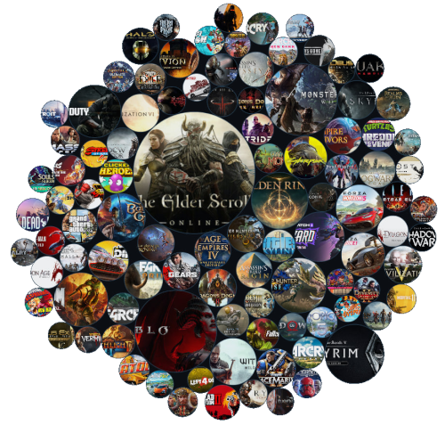

---
title: 1.18. Классификация игр
---

# 1.18. Классификация игр

  ДЛЯ НОВИЧКОВ
  НЕ ДЛЯ НОВИЧКОВ
  НЕ ОБЯЗАТЕЛЬНО
  В РАЗРАБОТКЕ

Всем

## Классификация игр

Классификация компьютерных игр представляет собой одну из центральных проблем в теории игровых медиа. В отличие от традиционных форм искусства — литературы, кинематографа, музыки — у видеоигр отсутствует устоявшаяся, канонизированная система жанров. Это обусловлено рядом факторов: высокой динамикой технологического развития, постоянным появлением гибридных форм, отсутствием единого методологического подхода к описанию игрового опыта, а также фундаментальным свойством интерактивности, которое делает любое жанровое обобщение условным и временным.

Систематизация игровых форм началась практически одновременно с массовым распространением электронных игр в 1970–1980-х годах. Уже тогда исследователи столкнулись с дилеммой: на каком основании проводить границы — по механике взаимодействия, по характеру повествования, по визуальному стилю, по целевой аудитории, по типу платформы? Эта проблема сохраняет свою актуальность и по сей день: любая современная попытка классификации неизбежно содержит зоны неопределённости, пересечения и внутренних противоречий.

В данной главе последовательно рассматриваются основные подходы к классификации компьютерных игр, начиная с ранних работ и заканчивая многомерными моделями XXI века. Особое внимание уделяется научно обоснованным системам — моделям, выстроенным на основе теоретического анализа интерактивного опыта.

Рассматриваемый материал опирается на труды Криса Кроуфорда, Александра Шмелева, Марка Вольфа, Эспена Аарсета, Томаса Эпперли и ряда других исследователей. Важно подчеркнуть, что ни одна из представленных ниже классификаций не претендует на исчерпывающую полноту. Все они обладают исторической обусловленностью, отражая состояние индустрии и научной мысли на момент публикации. Тем не менее, каждая из них вносит вклад в общее понимание структуры игрового поля, выявляя устойчивые паттерны, которые сохраняют значение даже тогда, когда конкретные реализации — устаревают.

---

### **Игра и видеоигра — соотношение понятий**

Прежде чем перейти к классификациям, необходимо внести терминологическую ясность. В рамках настоящей главы под **игрой** понимается любая целенаправленная, правилами регламентированная, интерактивная деятельность, имеющая ограниченную во времени и пространстве реализацию и не направленная на достижение материальной выгоды. Это определение включает в себя как традиционные настольные, спортивные и ролевые игры, так и их цифровые реализации.

**Видеоигра** — подмножество игр, реализуемое с использованием электронного вычислительного устройства, визуального вывода (на экран, проектор, HMD и т. п.) и интерфейса ввода (клавиатура, джойстик, контроллер и др.). Ключевое отличие видеоигры от других форм — наличие программной среды, которая выступает одновременно как посредник взаимодействия, как ограничитель возможностей (по правилам), и как генератор игровых событий (через алгоритмы и данные).

Некоторые классификации, представленные ниже, изначально разрабатывались для электронных игр вообще (включая текстовые, векторные, аркадные автоматы), и лишь позже были применены к современным видеоиграм. Поэтому в анализе сохраняется различие между *архаичными* и *современными* признаками классификации.

---

### **Классификация Криса Кроуфорда (1984)**

Одной из первых попыток осмысленной типологии компьютерных игр является работа Криса Кроуфорда *«The Art of Computer Game Design»* (1982, опубликована в 1984 году). Кроуфорд — геймдизайнер, работавший в Atari — подходил к задаче с позиций проектирования: его интересовала не столько маркировка готовых продуктов, сколько выявление устойчивых паттернов взаимодействия, пригодных для проектирования новых игр.

Кроуфорд предложил двухуровневую структуру. На **первом уровне** все игры были разделены на две фундаментальные категории по доминирующему типу когнитивной или моторной нагрузки:

1. **Skill-and-action games (S&A)** — игры, в которых ключевым требованием к игроку является точность и скорость физической реакции: управление движением, координация, реакция на визуальные стимулы. Здесь доминирует перцептивно-моторный компонент.
2. **Strategy games** — игры, в которых доминирует когнитивная деятельность: планирование, оценка рисков, прогнозирование поведения системы или противника, логическое вывод.

Такое деление имело глубокое основание в психологии: Кроуфорд отталкивался от модели человеческого восприятия, в которой различаются *рефлекторные* и *рефлексивные* реакции. Игры первого типа активируют преимущественно сенсомоторную кору, второго — префронтальные области.

На **втором уровне** внутри каждой категории выделялись шесть классов — по общности игровой механики и *исторической преемственности*. Под «исторической связью» Кроуфорд понимал, что определённый класс игр возник из конкретного прототипа (например, *Pong* → *Paddle games*), и последующие игры в рамках класса сохраняют его базовые структурные свойства, даже при смене сеттинга или визуального оформления.

#### **Skill-and-action games**

- **Combat games** — игры, построенные на прямом обмене уроном: одна сторона атакует, другая защищается или уклоняется. Примеры: *Space Invaders*, *Missile Command*. Механика базируется на оценке траекторий и принятии решений в условиях ограничения времени.

- **Maze games** — игры, происходящие в топологически сложной среде (лабиринте), где цель — выживание через избегание или нейтрализацию угроз. Ключевой параметр — неполнота информации: игрок видит только часть пространства. *Pac-Man* является архетипом этого класса.

- **Sports games** — имитация реальных спортивных дисциплин, но с упрощённой физикой и акцентом на динамическое взаимодействие с объектами (мяч, трек, соперник). По Кроуфорду, речь о *структурной аналогии* — правила спорта транслируются в упрощённую игровую механику.

- **Paddle games** — игры, основанные на принципе отражения объекта от управляемой поверхности в замкнутом пространстве. Архетип — *Pong*. Отличительная черта: отсутствие движения по оси Z, двумерная плоскость, простая физика столкновений.

- **Race games** — игры, в которых цель — пройти дистанцию быстрее соперника или за минимальное время. Механика включает управление ускорением/торможением, ориентировку в пространстве и, часто, обгон. Ключевой параметр — временной интервал между стартом и финишем.

- **Miscellaneous games** — всё, что не укладывается в пять предыдущих классов: *Tetris*, *Q*bert, *Tempest*. Этот класс — диагностический: он указывает на появление новых механик, не охваченных существующей типологией.

#### **Strategy games**

- **Adventure** — игры, в которых прогресс достигается через последовательное решение задач, сбор инструментов и применение их в новых контекстах. Архетип — текстовый *Colossal Cave Adventure*. Доминирует логика условий («если есть предмет А, то можно активировать объект Б»).

- **D&D games** — игры, основанные на механике Dungeons & Dragons: статистические характеристики персонажа, пошаговые бои, уровни, квесты. Здесь формализована абстрактная модель развития через накопление опыта.

- **War games** — игры, моделирующие военные конфликты с акцентом на тактическое позиционирование, численное превосходство и логистику. Часто — пошаговые, с гексагональной сеткой. Отличаются от Combat games тем, что фокус на стратегическом расчёте.

- **Games of Chance** — игры, в которых ключевую роль играет случай: покер, рулетка, кости. Механика построена на теории вероятностей, а навык проявляется в управлении рисками, а не в физическом контроле.

- **Educational and children’s games** — игры с явной обучающей функцией: обучение счёту, чтению, логике. Механика подчинена дидактической цели, а не развлекательной.

- **Interpersonal games** — игры, требующие прямого взаимодействия между игроками (не через ИИ), часто с элементами переговоров, обмана, коалиций. Архетип — *Diplomacy*. Здесь центральный элемент — социальное моделирование.

Кроуфорд прямо указывал: его классификация — инструмент для проектировщика, а не для каталогизатора. Она теряет силу, когда игры начинают гибридизироваться — например, когда в стратегию внедряют элементы экшена (real-time strategy), или когда приключенческие игры получают 3D-движок с динамическим боем.

---

### **Классификация Александра Шмелева (1988)**

Если работа Кроуфорда представляла интерес для инженеров и дизайнеров, то *«Мир поправимых ошибок»* (1987, опубликовано в 1988) Александра Григорьевича Шмелева — психолога, сотрудника Института психологии АН СССР — была направлена на анализ когнитивных и мотивационных аспектов игровой деятельности. Шмелев рассматривал компьютерные игры как инструмент развития познавательных функций, а не как развлечение.

Он предложил **две независимые классификации**, не сводимые друг к другу:

1. **Сюжетно-тематическая классификация** — по содержанию задач, стоящих перед игроком.
2. **Функционально-психологическая классификация** — по направленности деятельности игрока, его внутренним целям.

#### **Сюжетно-тематическая классификация**

Шмелев выделил 13 классов, каждый из которых соответствует определённой *когнитивной операции*:

- **Головоломки** — требуют перебора вариантов, проверки гипотез, выявления скрытых закономерностей. Игровая среда абстрактна, семантика нейтральна (например, *Sokoban*). Ключевой процесс — дедукция.

- **Настольные интеллектуальные игры в компьютерном варианте** — шахматы, шашки, рэндзю и др. Здесь задача — просчёт вариантов на конечном дискретном пространстве. В отличие от головоломок, правила фиксированы и известны заранее.

- **Азартные шансовые игры** — задача — оптимизация стратегии при наличии стохастических факторов. Игрок учится работать с вероятностями, но не может полностью контролировать исход.

- **Управленческо-экономические игры** — моделирование принятия решений в условиях ограниченных ресурсов и неопределённости. Часто — текстовые интерфейсы, диалоговые меню. Цель — минимизация потерь и максимизация эффективности.

- **Спортивные игры** подразделяются на:
  - *Локомоторные* — управление транспортом (гонки, полёты), где важна кинестетическая координация.
  - *Баллистические* — расчёт траекторий (гольф, боулинг), где важна физическая интуиция.

- **Военные игры** также дифференцируются по модальности восприятия:
  - *Диарамные* — вид от первого лица (flight simulators ранних лет).
  - *Локомоторные* — управление техникой в 2D/3D.
  - *Баллистические* — расчёт огневых решений (артиллерийские симуляторы).

- **Единоборства** — фокус на пространственно-временном позиционировании: дистанция, уклонение, контратака. Противник — автономная система с простой ИИ-логикой.

- **Игры преследования-избегания** — архетип *Pac-Man*: задача разделения на два типа агентов (сильные/слабые), где игрок должен манипулировать состоянием системы через движение.

- **Авантюрные игры** (термин Шмелева) делятся по способу представления пространства:
  - *Зрительный лабиринт* — вид сверху, частичная видимость (например, *Gauntlet*).
  - *Диарамный лабиринт* — вид от первого лица, необходимость построения ментальной карты (например, *Dungeon Master*).
  - *Логико-пространственный лабиринт* — текстовое описание, требующее пространственного воображения.
  - *Детектив* — текстовое расследование с ветвлением сюжета, где прогресс зависит от логического вывода.

- **Конвейерные игры** — реакция на повторяющиеся стимулы в фиксированной последовательности (например, *Tapper*). Тренирует автоматизацию реакций.

- **Конструктивно-динамические игры** — сочетают конвейер с поиском оптимального решения (например, *Pipe Dream*). Здесь требуется как скорость, так и планирование.

- **Диалоговые познавательные игры** — симуляция общения, где игрок выбирает реплики, влияющие на развитие ситуации. Может включать элементы самоанализа (например, *Eliza*-подобные системы).

- **Учебно-технологические игры** — моделирование производственных процессов (станки, сборочные линии), где цель — освоение алгоритма действия.

Шмелев подчёркивал: сюжет и визуальное оформление — вторичны. Один и тот же класс может реализовываться в любом сеттинге — космическом, средневековом, абстрактном — без изменения когнитивной сути.

#### **Функционально-психологическая классификация**

Эта система отвечает на вопрос: *зачем* человек играет? Шмелев выделил девять функций, каждая из которых выражается в целевой формуле:

| Функция | Целевая формула | Комментарий |
|--------|------------------|-------------|
| Социально-приспособительная | «Все играют, и я не хуже других» | Игра как способ включения в группу, демонстрации компетентности |
| Рекреативная | «Играю, чтобы отдохнуть, переключиться…» | Снятие напряжения, смена вида деятельности |
| Самоиспытания | «Играю, чтобы познать и испытать себя» | Проверка границ возможного, преодоление страха неудачи |
| Психотренинга | «Играю, чтобы развить у себя…» | Целенаправленное формирование навыков (внимания, памяти и др.) |
| Соревнования | «Играю, чтобы быть первым в таблице рекордов» | Стремление к превосходству, фиксация достижений |
| Образования | «Играя, познаю свойства и связи предметов в мире» | Расширение знаний через интерактивное моделирование |
| Мотивационное управление | «Выучишь урок — сможешь поиграть» | Игра как внешнее поощрение в учебной/трудовой деятельности |
| Объекта конструктивной деятельности | «Играю, чтобы понять как сделать игру лучше» | Интерес к самой структуре игры, её архитектуре |
| Имитационный тренинг | «Играю, чтобы проимитировать свои действия в реальности» | Подготовка к реальным задачам: пилотирование, хирургия, управление |

Эта классификация важна тем, что смещает фокус с *формы* игры на *субъективный опыт* игрока. Одна и та же игра может выполнять разные функции для разных пользователей — и для одного пользователя — в разные моменты времени.

---

### **Классификация Марка Вольфа (2001)**

Если Кроуфорд и Шмелев строили свои системы на основе наблюдаемого поведения и когнитивных процессов, то Марк Вольф в работе *«The Medium of the Video Game»* (2001) предложил фундаментальный сдвиг: в качестве базового признака классификации он выбрал **интерактивность** как совокупность конкретных параметров, определяющих способ взаимодействия игрока с игровой системой.

Вольф отвергает три традиционных, но, по его мнению, несостоятельных основания:

- **Тематика** (средневековье, космос, современность) — вторична по отношению к механике.
- **Визуальный стиль** (пиксель-арт, реализм, стилизация под мультфильм) — не влияет на структуру взаимодействия.
- **Авторский замысел или повествовательная структура** — не определяет, *как* игрок взаимодействует с системой.

Вместо этого Вольф выделяет **четыре ключевых измерения интерактивности**, внутри которых формируются жанровые различия:

1. **Пространственная структура** — как организовано игровое пространство и как игрок в нём перемещается. Важны: топология (линейная, ветвящаяся, открытая), перспектива (первое/третье лицо, изометрия), степень свободы движения.

2. **Временная структура** — как организовано игровое время: real-time, turn-based, пауза, остановка времени, временные петли. От этого зависит ритм и тип принятия решений.

3. **Структура цели** — характер целеполагания: конечная (достичь финала), бесконечная (набрать максимум очков), открытая (самоопределение цели), динамическая (цель меняется в процессе).

4. **Структура управления** — как реализован контроль: прямой (каждое действие — от игрока), косвенный (управление через параметры, ИИ-агентов), гибридный.

На основе этих измерений Вольф выделяет **42 жанра**, каждый из которых определяется уникальной комбинацией параметров. Например:

- *Platformer* — трёхмерное или псевдотрёхмерное пространство с гравитацией, линейное или ветвящееся прохождение, real-time, конечная цель, прямое управление персонажем.
- *Turn-based strategy* — дискретное (часто гексагональное) пространство, пошаговое время, конечная цель (уничтожение противника), косвенное управление (выбор действий для юнитов).
- *Roguelike* — процедурно генерируемое пространство, real-time или turn-based, конечная цель, высокая смертность, прямое управление, но с элементами косвенного (инвентарь, статистика).

Сильная сторона модели Вольфа — её *конструтивность*: она позволяет описывать существующие игры и проектировать новые, комбинируя параметры. Например, гибрид *turn-based* и *real-time* — не абсурд, а осознанный выбор (как в *XCOM: Enemy Within*, где перемещение — пошаговое, а реакция на врага — в real-time).

Однако Вольф признаёт ограничения: его модель не учитывает *социальный* аспект (кооперация, конкуренция, переговоры), *аффективный* (вызов эмоций: страх, удивление, удовлетворение) и *культурный* (связь с мифологией, историей, этикой). Поэтому классификация остаётся инструментом анализа **формы**, а не **содержания**.

---

### **Многомерная типология Аарсета, Сметстада и Суннано (2003)**

Работа *«A Multidimensional Typology of Games»* (2003) представляет собой попытку выйти за пределы эмпирического описания и построить **генеративную модель** — такую, которая не просто систематизирует существующее, но позволяет предсказывать *возможные*, но ещё не реализованные игры.

Авторы исходят из принципа: любая игра может быть смоделирована как конфигурация значений в наборе независимых параметров («измерений»). Число измерений — 13, сгруппированных в 5 блоков:

#### **1. Пространство (3 измерения)**

- **Perspective** — характер точки обзора:
  - *Omni-present* — игрок видит всё пространство целиком (например, *Civilization* в карте мира).
  - *Vagrant* — точка обзора привязана к персонажу (первое/третье лицо).
- **Topography** — структура перемещения:
  - *Geometrical* — непрерывное пространство, свобода движения в любую точку.
  - *Topological* — дискретные узлы (комнаты, локации), соединённые переходами.
- **Environment** — динамика окружения:
  - *Dynamic* — мир изменяется: растения растут, здания рушатся, погода меняется.
  - *Static* — окружение фиксировано; изменения касаются только персонажей и объектов.

#### **2. Время (3 измерения)**

- **Pace** — характер течения времени:
  - *Realtime* — события происходят независимо от действий игрока.
  - *Turn-based* — время делится на ходы; действия выполняются последовательно.
- **Representation** — степень имитации реальности:
  - *Mimetic* — стремление к физической и временной достоверности.
  - *Arbitrary* — условная, символическая временная шкала (например, «ход» = день, неделя, год).
- **Teleology** — характер цели:
  - *Finite* — игра имеет чёткий финал (победа/поражение).
  - *Infinite* — цель отсутствует или недостижима (например, *Minecraft* в креативе, *Flight Simulator*).

#### **3. Игрок (1 измерение — с двумя подпараметрами)**

- **Player structure** — конфигурация участников:
  - *Singleplayer* — один игрок.
  - *Singleteam* — несколько игроков в одной команде.
  - *Twoplayer* — два игрока-соперника.
  - *Twoteam* — две команды.
  - *Multiplayer* — каждый за себя.
  - *Multiteam* — более двух команд.

#### **4. Управление (3 измерения)**

- **Mutability** — влияние наград на параметры:
  - *Static* — награда не меняет систему (очки, достижения).
  - *Powerups* — временные улучшения (увеличение скорости, неуязвимость).
  - *Experience-leveling* — постоянное накопление характеристик (уровни, навыки).
- **Savability** — возможность сохранения:
  - *Non-saving* — без сохранения (аркады).
  - *Conditional* — сохранение только в определённых точках (чекпоинты).
  - *Unlimited* — полная свобода сохранения/загрузки.
- **Determinism** — воспроизводимость:
  - *Deterministic* — одинаковый ввод → одинаковый результат.
  - *Non-deterministic* — стохастические элементы (рандом-генерация, критические удары).

#### **5. Правила (3 измерения)**

- **Topological rules** — наличие правил, привязанных к местоположению (например, «нельзя строить на воде»).
- **Time-based rules** — ограничения по времени (таймеры, дедлайны).
- **Objective-based rules** — наличие чёткого прогресса (очки, уровни, квесты).

Каждая игра — точка в 13-мерном пространстве. Например, *The Legend of Zelda: Breath of the Wild*:

- Perspective: Vagrant  
- Topography: Geometrical  
- Environment: Dynamic  
- Pace: Realtime  
- Representation: Mimetic (с условностями)  
- Teleology: Finite (но с сильной открытостью)  
- Player structure: Singleplayer  
- Mutability: Experience-leveling + Powerups  
- Savability: Unlimited  
- Determinism: Non-deterministic (погода, ИИ)  
- Topological rules: Yes  
- Time-based rules: Partially (ограничения в подземельях)  
- Objective-based rules: Yes (Main Quest + Shrines + Side Quests)

Сильная сторона модели — её **аналитическая мощность**: она позволяет точно локализовать любую игру и выявить, какие комбинации параметров ещё не реализованы. Например, игра с *omni-present* перспективой, *topological* пространством и *infinite* целью — редкость (почти не встречается), хотя технически возможна.

Слабая сторона — избыточность: не все измерения одинаково значимы для восприятия игроком. Например, различие между *mimetic* и *arbitrary* временем может быть незаметно в геймплее.

---

### **Характерологическая классификация Сибирякова (2005)**

В работе *«Характеры и жанры видеоэкранных игр»* (2005) Андрей Сибиряков предложил сместить акцент с внешних признаков на **внутреннюю направленность игровой деятельности**. Его подход близок к психологии: он рассматривает игру как проявление доминирующего *характера* — устойчивого способа взаимодействия с миром.

Выделено шесть «характеров», каждый из которых соответствует определённому типу когнитивной и поведенческой активности:

| Характер | Основная операция | Примеры жанров |
|----------|-------------------|----------------|
| **Активность** | Моторная координация, скорость реакции, точность движений | Аркады, шутеры, файтинги |
| **Поиск** | Исследование пространства, сбор информации, обнаружение скрытых объектов | Метроидвании, open-world RPG, хорроры выживания |
| **Имитация** | Воспроизведение реальных процессов, соблюдение протоколов | Симуляторы (полёта, вождения, хирургии) |
| **Планирование** | Разработка стратегии, расчёт рисков, распределение ресурсов | Пошаговые стратегии, экономические симуляторы |
| **Идентификация** | Отождествление с персонажем, принятие его мотивов и ценностей | Ролевые игры, интерактивные драмы, visual novel |
| **Логика** | Решение абстрактных задач, работа с правилами, вывод следствий | Головоломки, настольные игры, card-based strategy |

Сибиряков подчёркивает: одна игра может включать несколько характеров, но один — доминирует. Например, *Dark Souls* — в первую очередь *Активность* (требования к точности ударов и уклонений), но с сильным компонентом *Идентификации* (погружение в мрачный мир, принятие его этики выживания). *Stardew Valley* — *Имитация* (фермерские циклы) и *Планирование* (управление ресурсами), но почти без *Активности*.

Эта модель полезна в педагогике и геймдизайне: она позволяет подбирать игры под когнитивные предпочтения пользователя и проектировать игры с заданным «характерным акцентом».

---

### **Подход Эпперли (2006)**

Томас Эпперли в статье *«Genre and Game Studies»* (2006) не предлагает новой классификации, но проводит важный *методологический анализ* существующих подходов.

Он выделяет два противостоящих парадигмы:

1. **Лудология** (от *ludus* — игра) — фокус на **механике**: правила, взаимодействие, баланс, системы вознаграждения. С точки зрения лудологов, повествование — декоративный слой, который можно заменить без потери сути. Пример: *Tetris* останется *Tetris*, даже если фигуры назвать «космическими кораблями».

2. **Нарратология** (от *narrare* — рассказывать) — фокус на **повествовании**: сюжет, персонажи, темы, эмоциональная дуга. Для нарратологов игра — форма интерактивного рассказа, где механика служит нарративу. Пример: *The Last of Us* теряет смысл без связи Джоэла и Элли.

Эпперли показывает, что большинство классификаций неявно примыкают к одной из парадигм:

- Кроуфорд, Вольф, Аарсет — **лудологи**.
- Югай, Орланд — **нарратологи**.
- Шмелев, Сибиряков — **интеграторы**, пытаются объединить оба подхода.

Он призывает к **диалогу**: видеоигра — это не «игра + рассказ», а третья форма, где механика и нарратив *взаимообусловлены*. Например, в *Undertale* механика «избегания боя» напрямую реализует нарративную тему «альтернативы насилию». В *Papers, Please* бюрократическая механика (проверка документов) создаёт этическую дилемму — нарратив возникает *из* геймплея.

Эпперли предлагает использовать оба подхода как **аналитические линзы**:
- Лудологическая — для оценки баланса, глубины, реиграбельности.
- Нарратологическая — для оценки эмоционального воздействия, тематической целостности.

---

### **Жанровая классификация Орланда, Стейнберга и Томаса (2007)**

Работа *«Video Game Style Guide and Reference Manual»* (2007) — **практический инструмент** для журналистов, маркетологов и локализаторов. Её цель — унифицировать термины, избежать разночтений в описании игр.

Авторы предлагают трёхуровневую структуру:

1. **Базовый жанр** — ядро геймплея (например, *RPG*, *Strategy*).
2. **Поджанр** — уточнение (например, *Tactical RPG*, *4X*).
3. **Модификаторы** — технические или перспективные уточнения, применимые к любому жанру.

#### **Модификаторы (универсальные префиксы/суффиксы)**

| Модификатор | Применение | Пример |
|-------------|------------|--------|
| *First-person* | Перспектива от первого лица | *First-person shooter*, *First-person RPG* |
| *Third-person* | Перспектива от третьего лица | *Third-person adventure* |
| *Real-time* | Игра в реальном времени | *Real-time strategy* |
| *Turn-based* | Пошаговый режим | *Turn-based tactics* |
| *Text-based* | Основной ввод/вывод — текст | *Text-based adventure* |
| *Massively multiplayer online (MMO)* | Поддержка тысяч одновременных игроков | *MMORPG*, *MMORTS* |
| *Simulator (Sim)* | Акцент на имитацию, а не на цель | *Flight sim*, *Life sim* |

Авторы подчёркивают: модификаторы **не складываются арифметически**. Например, *Real-time* и *Turn-based* исключают друг друга. *First-person* и *Third-person* — тоже. Но *MMO* и *RPG* — совместимы.

Ключевой принцип: **жанр определяется геймплеем, а не сеттингом**. Игра про средневековье с развитием персонажа — *RPG*, даже если там нет магии. Игра про космос с управлением флотом — *Strategy*, даже если визуально похожа на *Shmup*.

---

### **Классификация Инге Югай (2008)**

Инге Югай в диссертации *«Компьютерная игра как жанр художественной литературы»* (2008) рассматривает игры через призму **литературоведения**. Её главный тезис: игра — самостоятельный жанр повествования, где интерактивность — новая форма авторского высказывания.

Она делит все игры на две группы по наличию **нарративной структуры**:

1. **Повествовательные игры** — имеют сюжетную дугу, персонажей, конфликт, развязку. Игрок — соавтор повествования.
   - *Экшн*: субъективное, эмоционально насыщенное повествование (например, *Call of Duty* — история солдата).
   - *Квест*: рациональное, дедуктивное повествование (например, *Myst* — раскрытие тайны через логику).
   - *Ролевая игра*: эпическое повествование с развитием героя и мира (*The Witcher 3*).

2. **Неповествовательные игры** — не имеют сюжета; фокус на навыках, знаниях, тактике (*Chess*, *Tetris*, *StarCraft* в режиме 1v1).

Югай вводит понятие **нарративной глубины**:  
- В *экшене* — минимальная: события воспринимаются как личный опыт.  
- В *квесте* — средняя: игрок раскрывает историю, но не влияет на её исход.  
- В *RPG* — максимальная: игрок формирует идентичность героя и влияет на ход истории.

Эта модель особенно важна при анализе игр, стремящихся к художественной выразительности (*Gris*, *Journey*, *Disco Elysium*), где механика и нарратив неразделимы.

---

### **Традиционная жанровая типология и её эволюция**

К середине 1990-х годов в игровой индустрии сложилась *практическая* жанровая система, не основанная на научных моделях, но устойчиво используемая разработчиками, издателями и прессой. Её формирование происходило эмпирически — через копирование успешных решений и маркетинговую необходимость краткого обозначения «типа игры».

Как отмечал Тимур Кутлалиев в диссертации *«Жанровая типология компьютерных игр»* (2014), ключевую роль сыграл феномен **клонирования**: после успеха архетипической игры (*Doom*, *Civilization*, *Diablo*, *Final Fantasy VII*) возникали десятки проектов, сохранявших её ядро, но вносящих вариации. Со временем такие проекты обретали собственное название — поджанр.

#### **Шесть базовых жанров (по Кутлалиеву)**

1. **Действие (Action / Экшен)**  
   Ядро — физическая реакция игрока: точность, скорость, координация. Поджанры возникают за счёт:
   - Перспективы (*first-person*, *third-person*),
   - Типа конфликта (*shooter*, *beat ’em up*, *platformer*),
   - Темпа (*rail shooter*, *arena shooter*),
   - Наличия ритма (*rhythm games*).
   Характерная черта: минимальная задержка между стимулом и реакцией. Ошибки караются немедленно.

2. **Симулятор (Simulation)**  
   Ядро — воспроизведение реального процесса с сохранением его логики, но без требования полного реализма. Классификация идёт по области имитации:
   - *Авиа-* / *авто-* / *космо-* / *танко-* симуляторы — управление техникой,
   - *Жизненные* симуляторы — социальные и биологические циклы (*The Sims*),
   - *Экономические* симуляторы — управление ресурсами (*Railway Empire*),
   - *Ходьбы* (*walking sim*) — акцент на восприятии пространства, а не на задачах.
   Важно: симулятор не обязан быть «скучным»; *Microsoft Flight Simulator* и *Euro Truck Simulator 2* демонстрируют, что точность и увлекательность совместимы.

3. **Стратегия (Strategy)**  
   Ядро — принятие решений в условиях ограниченных ресурсов и неопределённости. Разделение на:
   - *Пошаговые (TBS)* — время дискретно, решения взвешенные (*Civilization*, *XCOM*),
   - *Реального времени (RTS)* — время непрерывно, решения под давлением (*StarCraft*, *Age of Empires*),
   - *Тактические* — фокус на позиционировании отдельных юнитов (*Wargame*, *Combat Mission*),
   - *4X* (eXplore, eXpand, eXploit, eXterminate) — глобальные стратегии с акцентом на рост (*Endless Legend*).
   Общее: игрок управляет *системой*, а не отдельным агентом.

4. **Ролевая игра (RPG)**  
   Ядро — развитие персонажа через накопление опыта, навыков, снаряжения и влияние на мир. Ключевые признаки:
   - Статистическая модель персонажа (характеристики, уровни, классы),
   - Нелинейность сюжета (ветвления, моральный выбор),
   - Длительность игрового цикла (десятки часов).
   Поджанры:
   - *JRPG* — линейные сюжеты, аниме-стилистика, пошаговые бои (*Final Fantasy*),
   - *Western RPG* — открытость, системность, последствия выбора (*Fallout*, *The Elder Scrolls*),
   - *Action RPG* — реалтаймовый бой с элементами RPG (*Diablo*, *Dark Souls*),
   - *Roguelike / Roguelite* — процедурная генерация, перманентная смерть, перманентный прогресс (*Hades*, *Slay the Spire*).

5. **Приключения (Adventure)**  
   Ядро — преодоление препятствий через решение головоломок, диалогов, исследование. Эволюция:
   - *Text adventure* (1970–80-е) — интерфейс: текст (*Zork*),
   - *Point-and-click* (1990-е) — графический интерфейс, инвентарь (*Monkey Island*),
   - *3D-приключения* — интеграция экшен-механик (*Uncharted*, *Tomb Raider*),
   - *Visual novel* — минимизация геймплея, максимизация повествования (*Steins;Gate*).
   Общее: прогресс определяется *пониманием*.

6. **Головоломка (Puzzle)**  
   Ядро — решение абстрактной задачи по фиксированным правилам. Типы:
   - *Логические* — вывод следствий (*The Witness*, *Baba Is You*),
   - *Физические* — моделирование законов физики (*World of Goo*, *Portal*),
   - *Визуальные* — работа с восприятием (*Monument Valley*),
   - *Ассоциативные* — поиск скрытых связей (*Return of the Obra Dinn*).
   Отличие от приключений: отсутствие сюжета и персонажей как обязательных элементов.

#### **Гибридные жанры**

С конца 1990-х наблюдается устойчивая тенденция к **гибридизации**. Чистые жанры встречаются редко; большинство игр — комбинации. Примеры:

- **Stealth-action** (*Metal Gear Solid*, *Dishonored*) — экшен с приоритетом скрытности.
- **Survival horror** (*Resident Evil*, *Dead Space*) — приключения + ограниченные ресурсы + психологическое давление.
- **Tower defense** (*Plants vs. Zombies*, *Kingdom Rush*) — стратегия + позиционирование + волны врагов.
- **Metroidvania** (*Hollow Knight*, *Ori*) — платформер + исследование + постепенное расширение возможностей.
- **Soulslike** (*Elden Ring*, *Lies of P*) — Action RPG + повышенная сложность + экологический нарратив.

Гибридизация не хаотична: она подчиняется логике **доминантного и субдоминантного жанров**. Например, в *Mass Effect* доминант — RPG (развитие персонажа, выбор диалогов), субдоминант — third-person shooter (боевая механика). В *Stardew Valley* — life sim (ферма) + RPG (уровни, квесты) + social sim (отношения).

---

