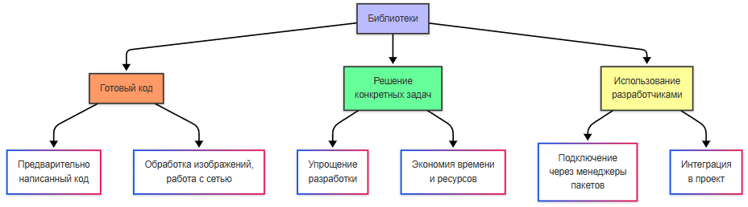
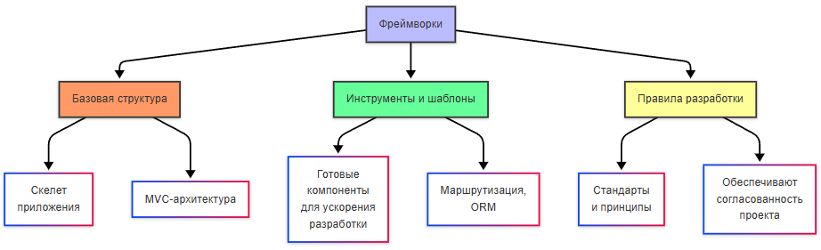
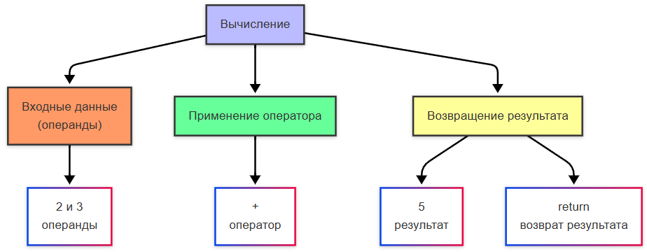

---
title: 1.19. Что такое программа?
---

# 1.19. Что такое программа?

<div class="article-tags">
  <span class="tag tag-required">ОБЯЗАТЕЛЬНО</span>
  <span class="tag tag-beginner">ДЛЯ НОВИЧКОВ</span>
  <span class="tag tag-advanced">НЕ ДЛЯ НОВИЧКОВ</span>
  <span class="tag tag-inprogress">В РАЗРАБОТКЕ</span>
</div>
<span class="complexity-badge">Всем</span>

## Программа

★ **Программа** – просто набор инструкций, написанных на языке, понятном компьютеру, которые выполняют определённую задачу. Без программ компьютер был бы просто набором электронных компонентов, не способных ни на что полезное.

<div class="callout callout--tip">
  <div class="callout-title">Внимание</div>
  Приготовьтесь!
Страшные слова	Сейчас будет очень, очень много сложных терминов. В дальнейшем мы будем их неоднократно упоминать, а многие из них раскроем более широко. Пока просто прочитайте и постарайтесь понять особенности.
</div>

## Как работает программа?

1. Написание кода. Программист пишет код на соответствующем языке программирования (к примеру, Java). Этот код состоит из набора команд, которые компьютер в конечном итоге должен выполнить.
2. Компиляция или интерпретация. Код первоначально – человекочитаемый набор текста, состоящий из ключевых слов, которые исторически были определены создателями языков программирования, и нужно перевести текст в набор машинных инструкций:

**Компиляция (C#, Java)** – код преобразуется в машинные инструкции заранее, создавая исполняемый файл. Такие языки называют компилируемыми.

**Интерпретация (Python, JavaScript)** – код выполняется построчно специальной программой (интерпретатором). Такие языки называют интерпретируемыми.

3. Выполнение процессором. Программа загружается в оперативную память, и процессов выполняет все указанные инструкции шаг за шагом.
4. Взаимодействие со средой. Программа каким-то образом может влиять на окружающую компонентную среду – читать и записывать файлы, отправлять данные в сеть, выводить изображение на экран или принимать ввод от пользователя.


★ **Программа** – последовательность команд, которые заставляют компьютер делать то, что нужно пользователю. И как раз процесс подготовки и составления таких команд называется программированием, а людей, занимающихся этим, называют программистами.

Сейчас мы с вами пробежимся по ключевым понятиям, которые нужно знать. Но непосредственно учиться программированию будем в следующем томе, к примеру, там же и изучим особенности термина «алгоритм». Сейчас же следует запомнить, что программа выполняет алгоритмы - серию команд.

★ **Программное обеспечение (ПО)** – совокупность программ, библиотек и данных для решения задач. Если программа лишь набор инструкций, то ПО может быть пакетом, к примеру:
	- Системное ПО: ОС (Windows, Linux), драйверы;
	- Прикладное ПО: Microsoft Office;
	- Инструментальное ПО: IDE (Visual Studio).

★ **Система** — это не просто набор компонентов, а целостный организм, где каждый элемент взаимодействует с другими для достижения общей цели. В отличие от ПО, система включает в себя не только технические составляющие, но и людей, процессы, и даже физическую инфраструктуру. Примером может служить банковская система, которая объединяет ПО (например, системы кредитного конвейера, учёта транзакций), аппаратное обеспечение (серверы, терминалы), сотрудников (операторов, аналитиков) и регламенты (правила безопасности, протоколы работы). Таким образом, ПО - лишь часть системы, а программа - ещё более мелкий элемент, который выполняет задачу:

```
Система > ПО > программа.
```

★ **Информационная система** – система для сбора, хранения и обработки данных. В отличие от простого вычисления, здесь будет целый процесс работы с информацией. Самый простой пример – Госуслуги, крупная информационная система, включающая в себя огромную совокупность элементов, упорядоченных в инфраструктуре. Это частный случай системы, ориентированный на работу с информацией, охватывающая все этапы её жизненного цикла: сбор, хранение, обработку, анализ и распространение.

Среди программ, которые в совокупности образуют систему, можно выделить:
	- утилиты;
	- модули;
	- плагины и расширения;
	- скрипты;
	- службы.

★ **Утилита** – небольшая программа для узкой задачи. Пример – архиватор, или программа для проверки сети. Часто ограничиваются узким набором функций, и могут даже не иметь графического интерфейса. Они используются системными администраторами и продвинутыми пользователями для обслуживания и оптимизации работы компьютера. Например, архиваторы помогают сжимать и разархивировать файлы, а сетевые утилиты позволяют диагностировать проблемы с подключением. Многие утилиты работают через командную строку, что делает их быстрыми и эффективными, но требует определённых знаний. Утилиты редко имеют графический интерфейс, так как их основная задача - выполнять конкретные действия без лишних затрат ресурсов.

★ **Модулем** называют отдельную часть программы или системы, которую можно заменить или обновить – будь то дополнение или библиотека. Модуль - самостоятельная часть, которая может функционировать независимо или взаимодействовать с другими модулями. Модульность позволяет разрабатывать сложные системы поэтапно, упрощая их поддержку и развитие. Например, текстовый редактор может состоять из модулей для работы с шрифтами, форматирования текста и проверки орфографии. Каждый модуль можно обновлять или заменять без изменения всей программы. Это особенно важно для больших проектов, таких как операционные системы или корпоративные приложения.

★ **Расширение / Плагин** – дополнение к основной программе. Часто от сторонних разработчиков. Расширение добавляет (буквально – расширяя возможности) функции, а плагин подключается к API программы. Примеры плагинов – VST для Audacity, плагины WordPress. Примеры расширений – расширения для браузера Google Chrome. Плагины обычно интегрируются в программы через интерфейс программирования приложений (это и есть API), и становятся её частью, а расширения чаще всего встречаются в браузерах, и работают как дополнительные инструменты, которые можно включать и выключать по желанию пользователя. Оба типа дополнений позволяют адаптировать программы под свои нужды, не изменяя их исходный код.

★ **Скрипт** – программа, которая не компилируется, а выполняется построчно, это быстро написанный код, который нужен для небольшой задачи, допустим, для копирования или проверки сети. Можно на практике встретить в процессах резервного копирования. Это программа, которая пишется на языках программирования, и используется для автоматизации рутинных задач, как и утилита, но может быть ещё более узким. Вплоть до одного файла. Это менее производительно, чем скомпилированные программы, поэтому подходят для небольших задач. К примеру, скрипт, которые будет отправлять запросы, таким образом проверяя доступность сервера.

★ **Служба** – программа, работающая в фоне без участия пользователя, к примеру служба печати или веб-сервер nginx. Они обеспечивают бесперебойную работу системы и часто являются её ключевыми компонентами. Например, служба печати управляет отправкой документов на принтер, а веб-сервер обрабатывает запросы пользователей к сайту. Службы могут запускаться автоматически при старте системы и продолжать работать даже тогда, когда пользователь неактивен. Они отличаются от утилит и скриптов своим фоновым и зачастую постоянным процессом.

★ **Исполняемый файл** – файл, который компьютер может запустить напрямую. Их мы разберём в отдельной главе. Это машинный код, понятный процессору компьютера, бинарные файлы.

Программы не могут работать в вакууме – им всегда нужна какая-то базовая инструкция, содержащая базовые правила – настройки (параметры) или конфигурация.


★ **Конфигурация** – файлы (например, формата .config или .json), или переменные среды, определяющие поведение программы. Конфигурация состоит из конфигурационных единиц. Есть ещё понятие конфигурации как набора комплектующих – компонентов компьютера, но это значение мы не рассматриваем. Для нас конфигурация сейчас это набор правил, настроек или параметров, которые определяют поведение программы. Она позволяет адаптировать программное обеспечение под конкретные задачи без необходимости изменения его исходного кода. Конфигурационные файлы (например, .config, .json, .ini, .yaml) содержат ключевые значения, которые программа считывает призапуске. Например, веб-сервер может использовать конфигурацию для определения порта, на котором он будет работать, или пути к файлам логов.

Главное преимущество конфигурации - возможность легко изменить поведение программы без пересборки или переписывания кода.

Например, если нужно перевести интерфейс программы на другой язык, достаточно изменить значение соответствующего параметра в конфигурационном файле. 
 
★ **Настройка программы** – формирование конкретного варианта программы под свои задачи. Настройка — это процесс адаптации под конкретные требования, включая изменение языка интерфейса, выбор темы оформления, настройку производительности, определение путей к файлам. Часто выводятся в графический интерфейс, чтобы пользователи могли легко изменять их без углубления в технические детали, лишь выбирая значения в выпадающих списках, расставляя флаги (галочки).

★ **Параметры** – аргументы командной строки (дополнительные выражения к команде), к примеру, --debug. Они позволяют управлять поведением командной строки непосредственно при запуске. Параметры особенно полезны для системных администраторов и разработчиков, но также используется и ещё одно понятие. Иногда под параметрами подразумевают какой-то флаг, аргумент, ключ, который что-то определяет. Допустим, включение или выключение какого-то свойства или поведения программы. Их можно назвать всеми этими значениями - флаг, параметр, галочка. Именно поэтому часто разделы настроек называются «Параметры» - потому что это какой-то набор аргументов, где пользователь может расставить соответствующие значения.

И всё это - настройка, параметр - есть конфигурация - определение поведения.

Без конфигурации пришлось бы переписывать код для каждого изменения, допустим, смена языка интерфейса. А благодаря конфигурации всё хранится в легко редактируемом файле, зачастую даже вынесенного на интерфейс.

Конфигурация может быть также представлена переменными среды, которые задают глобальные настройки для ОС или конкретных программ. Например, переменная LANG в Linux определяет язык системы, а %APPDATA% в Windows указывает путь к данным пользовательских приложений.

★ **Переменная среды** – текстовая переменная ОС, которая хранит какую-либо информацию, допустим, данные о настройках системы. Они задаются, к примеру, в реестре Windows. 

Вот пример некоторых переменных среды в Windows:

| Имя переменной | Суть и назначение |
| :--- | :---: |
|`%APPDATA%`	|Настройки программ текущего пользователя. Пример: `C:\Users\Admin\AppData`
|`%WINDIR%`	|Место установленной Windows. Пример: `C:\Windows`
|`%PROGRAMFILES%`	|Стандартная папка установки приложений. Пример: `C:\Program Files`

Примеры в Linux
| Имя переменной | Суть и назначение |
| :--- | :---: |
|USER	|Имя текущего пользователя
|HOME	|Домашний каталог
|LANG	|Кодировка языка системы

**Переменные среды** представляют собой набор системных настроек, которые используются в адресной строке проводника в Windows и в терминалах. Технически, это просто «ключ» (имя переменной) и «значение», и, если обратиться к имени, получим значение.

Программы не всегда являются независимыми. Часто, для «построения» и запуска программы, требуется некие «строительные материалы» и ресурсы, которые бы позволили в полном объеме функционировать. Это зависимости и необходимые компоненты. 
Типы зависимостей:

	- Библиотеки;
	- Фреймворки;
	- Системные библиотеки.

В проекте приложения описывается набор зависимостей (список), который формируется благодаря менеджерам пакетов.

 Представим, что перед вами высококвалифицированный специалист, который решит вашу задачу – это будет программа. И этому специалисту для решения нужна стройплощадка (фреймворк) и ресурсы (библиотеки). Обладая площадкой и ресурсами, по чертежу (инструкциям) специалист всё выполнит, и вы получите результат. Но если какого-то ресурса нет, то специалист не возьмётся за работу – так и программа откажется работать.
 
**Библиотеки** - наборы предварительно написанного кода, которые решают конкретные задачи. Вместо того, чтобы писать код заново для обработки изображений, работы с сетью или математических вычислений, можно использовать готовые библиотеки. Они экономят время разработчиков и делают программы более надёжными, так как эти компоненты тщательно протестированы и поддерживаются сообществом.

**Системные библиотеки** — это компоненты, которые обеспечивают взаимодействие программы с операционной системой, предоставляя доступ к базовым функциям, таким как работа с файловой системой, управление памятью или сетевые подключения.



**Фреймворки** — это всегда набор инструментов, шаблонов и правил, которые помогают разработчикам создавать приложения быстрее и эффективнее. Они представляют собой базовую структуру, в которой предстоит работать. Это может быть как набор библиотек и утилит для разработки, так и подход к разработке (алгоритмы, порядок и принципы).



Чтобы управлять зависимостями, разработчики используют менеджеры пакетов - специальные инструменты, которые автоматически загружают, устанавливают и обновляют необходимые компоненты. Каждый язык программирования или платформа обычно имеют собственные менеджеры пакетов:
	- npm для JavaScript (Node.js);
	- pip для Python;
	- Maven или Gradle для Java;
	- NuGet для .NET;
	- Composer для PHP.

В проекте приложения создаётся файл, который описывает все необходимые зависимости. Это позволяет другим разработчикам воспроизвести среду разработки или развернуть приложение на другом компьютере. Менеджеры пакетов также следят за совместимостью версий зависимостей, что снижает риск конфликтов между компонентами.

★ **Вычисление** – процесс получения входных данных (допустим, чисел 2 и 3), применения операторов (+, -, * или /), и возвращения результата – допустим, 5 после операции 2+3.


Таким образом, если мы разберем «2 + 3 = 5», мы получим:
	- 2 и 3 – операнды;
	- + - оператор;
	- 5 – возвращаемый результат.

★ Слово «возвращать» (англ. return) встречается в программировании очень часто, поэтому важно привыкнуть. Это как отправить задачу с исходными данными специалистами, чтобы он вам вернул результат.



### Задачи и многозадачность. 

Компьютеры делают много дел «одновременно». Как это работает? 

На самом деле, процессор выполняет в одном ядре выполняет только одну инструкцию за раз, но благодаря тому, как он переключается миллионы раз в секунды, создаётся эффект параллельной работы. Представьте, что вы одновременно читаете эту книгу, готовите ужин и слушаете музыку. Вот как раз это три разных задачи, которые выполняются одновременно, обеспечивая многозадачность (мультизадачность, мультитаск). Но в терминологии мы можем путать многозадачность и многопоточность. Технически, они не одинаковы.


К задаче мы можем отнести процесс. 

**Процессы** – изолированные задачи (допустим, программы – браузер, текстовый редактор), и это зачастую отдельная и независимая программа, которая имеет свою выделенную память и ресурсы.

★ **Потоки** – нити внутри одного процесса, по которым они движутся (например, загрузка файла). Своего рода часть процесса, потому зависима от него целиком. Самый простой пример – вкладки браузера. Браузер – отдельный процесс, а вкладки – некие «подпроцесс», которые запускаются как отдельные потоки, не блокируя друг друга, а работающие параллельно.

У многозадачности есть риски. К примеру, если два потока будут работать с одной и той же переменной, будут ошибки, поэтому используются блокировки, где один поток блокируется и ждёт, пока закончит первый. Для решения проблем одновременной работы потоков, используется многопроцессорность (несколько ядер CPU), и асинхронность (что это такое, изучим чуть позже).

★ **Операционная система** управляет всем этим при помощи специальных планировщиков (Scheduler), которые решают, какой процесс или поток получит процессор, используя алгоритмы «по очереди» или по «приоритетности». Но для переключения современным процессорам нужно меньше 1мс, так что мы не замечает всего контекстного переключения, включающего в себя сохранение текущего процесса и загрузку состояния нового. При необходимости оптимизировать свою программу, программист может акцентировать своё внимание на работе потоков и использования всех вышеуказанных особенностей, добавляя искуственные блокировки, коллбэки и прочее.

Программы не всегда постоянны, они регулярно изменяются и улучшаются. Каждое изменение порождает новую программу по схеме:

```
Программа + изменение = Изменённая программа.
```

**Изменение** — это любая модификация исходного кода, архитектуры, интерфейса или поведения программы.

★ **Модификация** – изменение программы, для добавления новых функций или исправления ошибок. Она может быть как силами разработчика, так и силами сторонних лиц. Модификация может быть путём ручного редактирования кода, либо путём подготовки программы, которая автоматически внесёт изменения в код – патч.

Изменение может быть нескольких видов:
	- функциональное - добавили кнопку «скачать»;
	- исправление ошибки (багфиксы);
	- оптимизация - ускорили загрузку;
	- рефакторинг - переписали код для лучшей читаемости;
	- косметическое - изменение внешнего интерфейса;
	- удаление функций.

Каждое такое изменение порождает новую версию программы, даже если оно кажется мелким. 

**Версия** — это уникальный идентификатор состояния программы на определённый момент времени. Пример - v1.0.0.

**Версионность** — это принцип, согласно которому каждое состояние программы получает уникальный номер (версию), чтобы можно было отслеживать, что изменилось, возвращаться к предыдущему состоянию, координировать работу команды и обеспечивать совместимость между компонентами.

Самый распространённый стандарт — *семантическое версионирование* (SemVer, Semantic Versioning). 

Формат:
```
MAJOR.MINOR.PATCH
```

- **MAJOR (мажор)** - основная версия, при несовместимых изменениях (ломающие обновления);
- **MINOR (минор)** - дополнительная функциональность, при обратно совместимых улучшениях;
- **PATCH** - поправки, при исправлениях ошибок, без новых фич.

К примеру, 2.0.0 — полностью переписали интерфейс, старые плагины больше не работают. Но часто в современности можно встретить, что мажорные версии меняют для маркетинговых целей, чтобы показать «масштабность» обновления.

Чтобы управлять изменениями, используются системы контроля версий — например, Git. Мы ещё о них много будем говорить. Такая система хранит все версии кода, позволяет сравнивать изменения, поддерживать работу нескольких разработчиков, позволяет откатиться к любой версии и вести историю изменений - когда, кто и что изменил.

Пользователи обычно не видят таких деталей - они нужны лишь разработчикам. Системы учитывают следующие типы изменений:
	- Добавление - что-то новое;
	- Изменение - модификация существующего;
	- Удаление - убираем существующее;
	- Переименование или рефакторинг - изменение структуры;
	- Исправление - устранение ошибок.

Каждое из этих действий фиксируется как коммит в системе контроля версий и вносит вклад в следующую версию.

★ **Патч** – маленькое обновление, которое может относиться как к модификации, так и к обновлению.

★ **Обновление** – термин близкий к модификации, но отличается, в основном, масштабом и самим процессом. К примеру, процесс обновления ПО может включать в себя изменение существующей версии ПО путем установки поверх неё модифицированной версии. Пример – обновление Windows, Chrome – когда разработчики подготовили изменения, выгрузили в виде пакета (патча), а мы загружаем и устанавливаем новую версию программы поверх предыдущей.

★ **Установка** – процесс копирования файлов на жёсткий диск, добавления настроек в реестр и создания ярлыков – словом, всех действий, требуемых для обеспечения запуска. Часто установка происходит автоматически, через специальную программу – установщик, которая производит и копирование, и настройку согласно своему алгоритму.

Так, программирование — это процесс создания программы, написания кода. Как же пишут код?

Код пишут по определённому порядку, и в зависимости от особенностей подхода, различают виды программирования:
	- Императивное (шаг за шагом) – C, Python – программист даёт чёткие команды – «Сделай раз, сделай два»;
	- Функциональное (через функции) – набор формул (функций), можно к ним отнести чистые вычисления, арифметику и тому подобное. Здесь нет циклов, а функции не меняют внешние данные. Используется в математике и является наиболее сложным.
	- ООП (объекты и классы) – Java, C# - современное программирование, когда всё представлено в виде объектов со свойствами и действиями. ООП мы посвятим отдельную главу и очень много будем о нём говорить – это важнейшая часть.

**Функциональное программирование** – стиль программирования, где программа строится из функций, не изменяющих исходные данные, а возвращающих новые. Представим, что программа – конвейер, где функции – станки, которые берут входные данные (сырье) и выдают результат (продукт), но при этом сырьё не испортится (исходные данные не изменяются, так как работа велась с их копиями). ФП применяется в обработке данных (анализ логов, Big Data), фронтенде (React, Redux), бэкенде (Elixir, Haskell), и в научных вычислениях, математических моделях. В повседневности примеры чистых функций – в Excel, формулы вроде =СУММ(A1:A10) – не меняют данные, но дают результат.

Вышеуказанные виды программирования также называют **парадигмами программирования**. Мы их рассмотрим подробно отдельно.
Но программирование не всегда связано с компьютером в классическом понимании. Все электронные устройства программируются, в том числе – стиральные машины, микроволновки, роутеры, медицинские приборы. Оно может происходить через встроенное ПО (Firmware), вшитое в устройство, либо через внутрисхемное программирование (ISP), когда программа загружается в микросхему прямо в устройстве через специальные контакты. Для таких процедур используется специальное оборудование – программатор и отладочная плата. Именно так подключают устройство к микроконтроллеру и загружают прошивку через специальное ПО. Но погружаться в это мы не будем, фактически, это уже глубокая техническая инженерия, а не «айти» в том понимании, в котором мы к нему идём.

В некоторых ситуациях программа должна работать автоматически, сама запускать определённые процедуры, в соответствии с алгоритмом или расписанием – это бот. Ботом называют виртуального робота или искусственный интеллект, который функционирует на основе специальных алгоритмов. Это помогает автоматизировать рутинные, однообразные и повторяемые задачи, избежав ручного труда, а зачастую и применимы для ситуаций, когда требуется более быстрая реакция (игровые боты, аукционные боты). Бот – тот же робот, а робот не всегда «механическое устройство», ботом является именно программа или функция программы.


