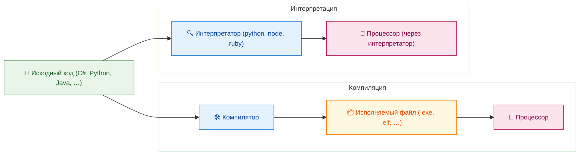
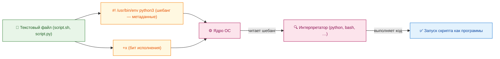
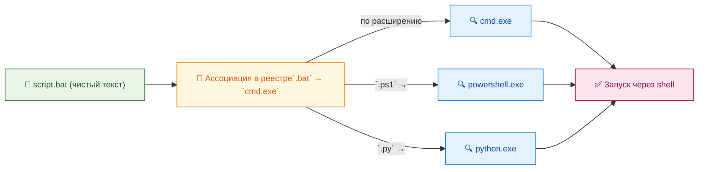
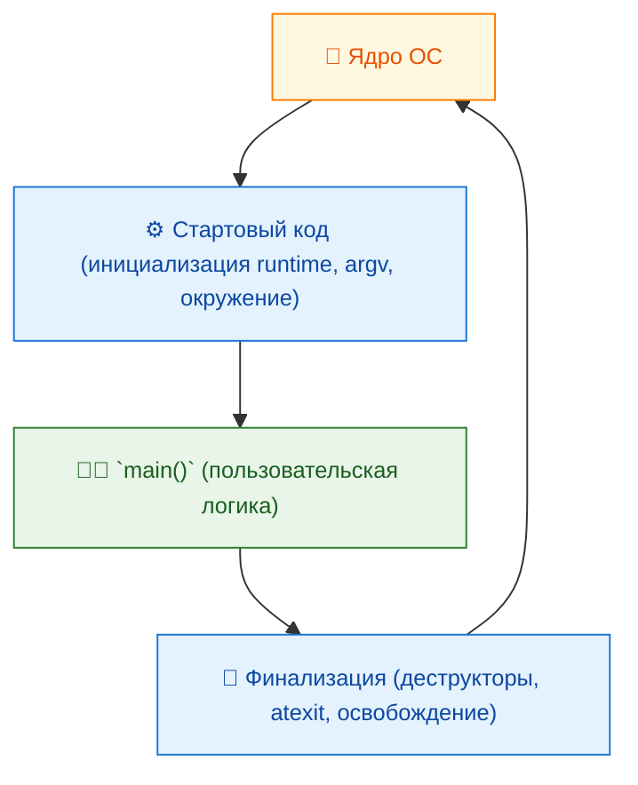

---
title: Исполняемые файлы
tags: [beginner, advanced, required, all]
description: Структура и особенности запуска программ (.exe, .app, .bin).
---

# Исполняемые файлы

<div class="article-tags">
  <span class="tag tag-required">ОБЯЗАТЕЛЬНО</span>
  <span class="tag tag-beginner">ДЛЯ НОВИЧКОВ</span>
  <span class="tag tag-advanced">НЕ ДЛЯ НОВИЧКОВ</span>
  <span class="tag tag-inprogress">В РАЗРАБОТКЕ</span>
</div>
<span class="complexity-badge">Всем</span>

## Исполняемые файлы

### Что такое исполняемый файл?

Когда человек задумывает выполнить какую-либо задачу на компьютере — будь то написание текста, расчёт траектории движения объекта или воспроизведение видеозаписи, — он не может напрямую обратиться к процессору. 

Процессор, как и любое электронное устройство, способен воспринимать только строго определённые команды, закодированные в виде двоичных последовательностей. Чтобы преодолеть разрыв между абстрактной *задачей* и конкретной *последовательностью машинных инструкций*, требуется посредник — программа. 

А чтобы программа могла быть запущена, она должна быть представлена в виде особого рода файла — **исполняемого файла**.

**Исполняемый файл** — это объект, в который операционная система вкладывает доверие: при получении команды на запуск она загружает содержимое этого файла в оперативную память, выделяет под него ресурсы (память, потоки выполнения, дескрипторы устройств), и передаёт управление первой инструкции, находящейся в нём. 

Это материальная форма программы, готовой к непосредственному взаимодействию с аппаратным обеспечением через посредство операционной системы.

---

### Программа, код и файл

Важно не отождествлять понятия *программа*, *исходный код* и *исполняемый файл*. 

**Программа** — это идея, совокупность алгоритмов и логики. 

**Исходный код** — её запись на языке программирования, понятном человеку. 

**Исполняемый файл** — результат преобразования этой записи в форму, пригодную для прямого выполнения процессором или интерпретатором. 


Между кодом и исполняемым файлом может стоять один или несколько этапов: компиляция, сборка, упаковка, линковка. Каждый из них вносит в структуру и содержание конечного файла определённые особенности.

---

### Конфигурация

Независимо от того, как именно реализована программа, она редко работает в полностью изолированном режиме. Почти любое приложение обладает набором параметров, определяющих его поведение в конкретной среде: путь к временным файлам, уровень детализации логирования, предпочтительный язык интерфейса, настройки подключения к базе данных. 

Совокупность таких параметров называется **конфигурацией**.

Конфигурация не является частью исполняемого файла в строгом смысле — хотя в некоторых случаях может быть встроена в него статически (например, в виде ресурсов в Windows-приложениях или в манифесте JAR-файла), чаще она хранится отдельно: в текстовых файлах (`.ini`, `.json`, `.yaml`, `.xml`), в реестре (Windows), в переменных окружения или в специализированных системах (например, `gsettings` в GNOME). Отделение конфигурации от исполняемого кода повышает гибкость: одна и та же программа может вести себя по-разному при запуске в разных окружениях, не требуя перекомпиляции или изменения самого исполняемого файла.

Многие исполняемые файлы при первом запуске создают конфигурационные файлы по умолчанию, а при последующих — считывают их. Это позволяет сохранять состояние между сеансами. Ключевой принцип здесь — *идемпотентность запуска*: повторный запуск программы без изменения конфигурации должен приводить к предсказуемому и воспроизводимому поведению.

---

### Код, скрипты и граница исполнения

Не всякий файл, содержащий инструкции, является исполняемым в том смысле, в каком его понимает ядро операционной системы. Здесь возникает важное различие между **исходным кодом**, **скриптом** и **машинным кодом**.

**Исходный код** — это текст на языке программирования высокого уровня (например, C#, Python, Java). Сам по себе он не может быть выполнен процессором: он требует предварительной обработки. В случае компилируемых языков (C, C++, Rust, Go) эта обработка выполняется *компилятором*, который транслирует исходный код в машинный код, упакованный в исполняемый файл (`.exe`, `.elf`). В случае интерпретируемых языков (Python, JavaScript, Ruby, Bash) исходный код не компилируется в автономный исполняемый образ; вместо этого он передаётся *интерпретатору* — отдельной программе, которая читает код построчно (или блоками) и выполняет соответствующие действия.



**Скрипт** — это особый вид файла исходного кода, предназначенный для прямой передачи интерпретатору. Технически, скрипт — это обычный текстовый файл (`.bat`, `.sh`, `.ps1`, `.py`), но он становится *исполняемым* в контексте системы благодаря двум условиям:  
1. Наличию *шебанга* (shebang, `#!`) в Unix-подобных системах — специальной строки в начале файла, указывающей путь к интерпретатору (`#!/bin/bash`, `#!/usr/bin/env python3`).  
2. Установке битa исполнения (`+x`) через команду `chmod`.  



В Windows поддержка скриптов устроена иначе: здесь нет универсального бита исполнения, и запуск текстового файла как программы определяется ассоциацией расширения с определённым приложением (например, `.bat` — с `cmd.exe`, `.ps1` — с `powershell.exe`). При этом сам файл не содержит встроенного указания на интерпретатор — эта связь задаётся глобально в реестре.



Следует подчеркнуть: файл `.py` сам по себе *не является* исполняемым файлом в терминах загрузчика ОС. Это лишь удобная форма записи; настоящим исполняемым компонентом остаётся интерпретатор Python (`python.exe` или `python3`). Только если Python-скрипт упакован в автономный исполняемый образ (например, при помощи `PyInstaller` или `Nuitka`), он получает статус полноценного исполняемого файла, содержащего и интерпретатор, и байт-код, и зависимости — всё в одном двоичном файле.

---

### Исполняемый файл

Любой исполняемый файл, независимо от платформы, содержит **служебную метаинформацию**, необходимую операционной системе для правильной загрузки и запуска. Эта структура стандартна внутри каждой ОС и определяется её *форматом исполняемого файла*.

Наиболее распространённые форматы:

- **PE (Portable Executable)** — используется в Windows для файлов `.exe`, `.dll`, `.sys`. Несмотря на название *Portable*, формат не кроссплатформенный: он ориентирован строго на архитектуру x86/x64 и Windows API. Внутри PE-файла содержится заголовок DOS (для совместимости), заголовок PE, таблица секций (`text`, `data`, `rsrc`, `reloc`), таблица импорта (список внешних DLL и функций, которые программа будет вызывать), таблица экспорта (если это библиотека), а также отладочная и цифровая подпись.

- **ELF (Executable and Linkable Format)** — стандарт де-факто для Unix-подобных систем (Linux, BSD, Solaris). Используется для исполняемых файлов, динамических библиотек (`.so`) и объектных файлов (`.o`). ELF-файл состоит из заголовка, таблицы программных заголовков (описывает, как файл отображать в память при запуске) и таблицы секций (описывает логическую структуру: код, данные, символы, отладка). Эффективная структура ELF позволяет одному файлу использоваться и как программа, и как библиотека, и как объектный модуль — в зависимости от флагов.

- **Mach-O (Mach Object)** — специфический формат, применяемый в macOS и iOS. Имеет модульную структуру: заголовок, список загрузчиков (load commands), и сами сегменты данных. Поддерживает *fat binaries* (universal binaries) — один файл, содержащий код для нескольких архитектур (например, x86_64 и arm64), что особенно актуально при переходе на Apple Silicon.

Эти форматы — не просто соглашения; они являются частью контракта между разработчиком и операционной системой. Загрузчик ОС строго следует спецификации: он проверяет сигнатуру файла (например, `MZ` для PE, `7F 45 4C 46` для ELF), читает заголовки, выделяет виртуальное адресное пространство, копирует секции кода и данных, разрешает символы в динамических библиотеках (процесс *динамической линковки*), применяет релокации, и только после этого передаёт управление точке входа (`EntryPoint`).



**Точка входа** — это адрес первой инструкции, с которой начинается выполнение. В большинстве случаев это *стартовый код* (startup code), поставляемый компилятором — он инициализирует стандартную библиотеку, готовит аргументы командной строки, устанавливает обработчики сигналов, и лишь затем вызывает `main`. При завершении `main` стартовый код выполняет финализацию (освобождение ресурсов, вызов деструкторов глобальных объектов) и возвращает код завершения в ядро.

---

### Динамические библиотеки

Исполняемые файлы редко являются полностью автономными. Даже простейшая программа «Hello, World!» использует системные вызовы для вывода на экран — а значит, зависит от библиотек ОС. Чтобы избежать дублирования кода (и, соответственно, излишнего потребления памяти и дискового пространства), применяется механизм **динамической линковки**.

Динамическая библиотека — это исполняемый файл особого рода: он не предназначен для прямого запуска пользователем, но содержит код и данные, предназначенные для совместного использования несколькими процессами. В Windows это `.dll` (Dynamic Link Library), в Linux и других Unix-системах — `.so` (Shared Object), в macOS — `.dylib` (Dynamic Library). Python использует `.pyd` — это, по сути, обычные DLL, скомпилированные из C-расширений и совместимые с интерфейсом Python/C API.

Преимущества динамических библиотек:
- **Экономия памяти**: один экземпляр кода библиотеки загружается в физическую память и отображается в виртуальное адресное пространство нескольких процессов.
- **Обновляемость**: исправление ошибки или улучшение безопасности в библиотеке не требует перекомпиляции всех зависящих от неё программ — достаточно заменить саму библиотеку (при условии сохранения ABI — Application Binary Interface).
- **Модульность**: программы могут быть собраны из независимо разрабатываемых компонентов, что упрощает сопровождение и тестирование.

Процесс загрузки динамической библиотеки происходит либо *на этапе запуска* (load-time dynamic linking), когда загрузчик ОС автоматически подгружает все необходимые зависимости, либо *по требованию* (run-time dynamic linking), когда программа сама вызывает системные функции (`LoadLibrary`/`GetProcAddress` в Windows, `dlopen`/`dlsym` в Unix), чтобы загрузить библиотеку и получить доступ к её функциям динамически.

Современные системы используют *привязку по имени*: исполняемый файл хранит имена требуемых библиотек (например, `kernel32.dll`, `libc.so.6`), но не их полные пути. Поиск осуществляется в предопределённых каталогах: текущий каталог (в Windows — с ограничениями из соображений безопасности), системные директории (`System32`, `SysWOW64`), пути из переменной `PATH` (Windows) или `LD_LIBRARY_PATH` (Linux). Это обеспечивает гибкость, но создаёт потенциальную уязвимость — *DLL hijacking*, когда злонамеренная библиотека с тем же именем подменяет легитимную.

---

### Установочные пакеты

Многие исполняемые файлы не поставляются «голыми» — они требуют подготовки среды: создания каталогов, копирования ресурсов (изображений, шрифтов, локализаций), настройки прав доступа, регистрации в системе. Для автоматизации этого процесса используются **установочные пакеты**.

`.msi` (Microsoft Installer) — это полноценная база данных (в формате SQL-подобной структуры), описывающая:  
- компоненты программы (файлы, реестр, ярлыки, службы);  
- условия их установки (архитектура, версия ОС, наличие зависимостей);  
- последовательность действий (custom actions — скрипты на C++/C#/VBScript);  
- процедуры отката при ошибке (транзакционность).  

Система Windows Installer (`msiexec.exe`) читает эту базу, строит план установки и выполняет его в строго определённом порядке, обеспечивая целостность системы. Преимущество MSI перед простыми `.exe`-установщиками — единообразие, поддержка централизованного развёртывания (через Group Policy), и возможность безболезненного удаления.

Аналогичные подходы существуют и в других ОС:  
- В Linux пакеты `.deb` (Debian/Ubuntu) и `.rpm` (RHEL/Fedora) содержат метаданные, файлы и скрипты пред/пост-установки.  
- В macOS — формат `.pkg`, основанный на XAR-архиве с XML-манифестами и JavaScript-скриптами.

Интересно, что сам установочный пакет тоже является исполняемым файлом — через специализированную программу (инсталлятор), входящую в состав ОС или поставляемую вместе с пакетом.

---

### Платформонезависимость

Некоторые форматы исполняемых файлов избегают привязки к конкретной архитектуре процессора и операционной системе, делегируя выполнение промежуточному уровню — **виртуальной машине** (VM) или **среде выполнения** (runtime).

Наиболее яркий пример — **JAR** (Java Archive). Это ZIP-архив, содержащий:  
- скомпилированный *байт-код* (файлы `.class`), а не машинный код;  
- манифест (`META-INF/MANIFEST.MF`) с указанием главного класса (`Main-Class`) и зависимостей;  
- ресурсы (изображения, конфигурации);  
- иногда — подписи и сертификаты.

Байт-код разрабатывался как *платформонезависимый машинный язык* для виртуальной машины Java (JVM). JVM, в свою очередь, реализована отдельно для каждой ОС и архитектуры — и её задача — загрузить JAR, валидировать байт-код, выполнить верификацию безопасности и, при необходимости, скомпилировать критические участки в нативный код (JIT-компиляция). Таким образом, один и тот же `.jar` работает везде, где есть JVM — и это следствие строгого разделения слоёв: *код*, *представление кода*, *среда выполнения*.

Похожие подходы используются в .NET (`*.dll`/`*.exe` содержат *CIL* — Common Intermediate Language, выполняемый CLR), в Android (`.apk` содержит байт-код Dalvik/ART), и даже в WebAssembly (`*.wasm` — бинарный формат для браузерной VM).

---

### MacOS

В macOS сложилось другое представление об исполняемом файле. Пользователь привык видеть программу как один объект в Finder — папку с расширением `.app`. На самом деле это **bundle** — директория, структура которой строго регламентирована. Внутри неё находятся:
- `Contents/MacOS/` — сам исполняемый Mach-O файл (без расширения, часто с именем, совпадающим с названием приложения);
- `Contents/Resources/` — все ресурсы: локализации (`.lproj`), иконки (`.icns`), звуки, NIB/XIB-файлы интерфейса;
- `Contents/Info.plist` — XML-файл с метаданными: версия, идентификатор, типы документов, зависимости;
- `Contents/Frameworks/` — встроенные динамические библиотеки (часто копируются для изоляции от системных);
- `Contents/_CodeSignature/` — цифровая подпись для Gatekeeper.

Такая структура обеспечивает *изоляцию приложения* — оно не «размазывается» по системе при установке (в отличие от традиционных Unix-установок через `make install`). Удаление сводится к перемещению пакета в корзину. Поддержка bundles заложена в API Cocoa и в ядре Darwin: функции вроде `NSBundle` позволяют программе обращаться к своим ресурсам по относительным путям, не зная абсолютного расположения на диске.

---

### Загрузка и инициализация

Момент, когда пользователь дважды щёлкает по `.exe` или вводит имя в терминале, — лишь внешний спусковой крючок. Под капотом запускается многоступенчатая процедура, реализованная в ядре ОС и её подсистемах. Эта процедура одинаково важна как для нативных программ, так и для сред выполнения вроде JVM или CLR — различаются лишь детали реализации.

В общем виде последовательность такова:

1. **Валидация и проверка сигнатуры**.  
   Перед тем как что-либо загружать в память, система проверяет, является ли файл *действительно* исполняемым. Для этого читаются первые 2–4 байта — *магическое число*: `MZ` (0x5A4D) для PE, `7F 45 4C 46` для ELF, `CF FA ED FE` или `CE FA ED FE` для Mach-O (в зависимости от байтового порядка). Если сигнатура отсутствует или повреждена, загрузка прерывается с ошибкой. Современные ОС дополнительно проверяют цифровую подпись: в Windows — через API `WinVerifyTrust`, в macOS — через `codesign -v`, в Linux — через интеграцию с IMA/EVM или внешние инструменты (например, `rpm --checksig`). Отсутствие подписи не всегда блокирует запуск, но может запретить выполнение в защищённых режимах (например, на macOS с включённым Gatekeeper при загрузке из интернета).

2. **Создание процесса и выделение виртуального адресного пространства**.  
   Ядро создаёт новый объект *процесса* — изолированную среду выполнения с собственным адресным пространством, дескрипторами, таблицей потоков и состоянием. Виртуальная память процесса пока пуста — она представляет собой карту регионов: код, данные, стек, куча, отображаемые файлы, разделяемая память. Ни один байт из файла пока не попал в ОЗУ.

3. **Отображение (mapping) исполняемого файла в память**.  
   На этом этапе происходит *отображение секций* на виртуальные адреса с помощью механизма *memory-mapped I/O*. Ядро использует информацию из заголовков (например, *program headers* в ELF или *section headers* в PE), чтобы определить:
   - какие части файла должны быть загружены в память (обычно не весь файл — например, отладочная информация может оставаться на диске);
   - какие регионы должны быть доступны только для чтения (`R`), только для выполнения (`X`), или для чтения и записи (`RW`);
   - какие адреса являются предпочтительными (в PE — `ImageBase`, в ELF — `p_vaddr`), и что делать, если они заняты (релокация).

   Ключевой момент: даже если файл физически не прочитан, процесс уже «владеет» виртуальными страницами, отображёнными на его секции. Реальное чтение с диска происходит *по требованию* — при первом обращении к странице (page fault), что ускоряет запуск и экономит память.

4. **Обработка зависимостей и динамическая линковка**.  
   Большинство программ зависят от внешних библиотек. Загрузчик (в Windows — часть `ntdll.dll`, в Linux — `ld-linux.so`, в macOS — `dyld`) отвечает за их разрешение:
   - читает таблицу импорта (`.idata` в PE, `.dynsym`/.`dynstr` в ELF, `LC_LOAD_DYLIB` в Mach-O);
   - находит каждую библиотеку по имени в предопределённых путях;
   - рекурсивно загружает её — включая *её* зависимости;
   - обновляет таблицу адресов (IAT — Import Address Table в Windows, GOT/PLT в ELF), заменяя заглушки на реальные адреса функций.

   Если какая-либо библиотека не найдена, загрузка прерывается. Важно: линковка происходит *до передачи управления в программу* — поэтому ошибка «отсутствует VCRUNTIME140.dll» возникает мгновенно, ещё до появления окна.

5. **Передача управления и стартовый код**.  
   После завершения загрузки и линковки ядро создаёт *главный поток* и передаёт ему управление на точку входа — `AddressOfEntryPoint` в PE, `e_entry` в ELF, `LC_UNIXTHREAD` в Mach-O. На этом этапе в памяти уже есть:
   - машинный код секции `.text`;
   - проинициализированные (или заполненные нулями) глобальные и статические данные (`.data`, `.bss`);
   - таблица импорта с актуальными адресами;
   - стек с аргументами командной строки и переменными окружения.

   Однако точка входа — редко `main`. Как правило, это *стартовая функция*, вшитая компилятором:
   - В MSVC — `mainCRTStartup` или `WinMainCRTStartup`;
   - В GCC — `_start`, вызывающая `__libc_start_main`.

   Эта функция выполняет критически важные действия:
   - устанавливает обработчики исключений и сигналов;
   - инициализирует потокобезопасные структуры (TLS — Thread Local Storage);
   - вызывает глобальные конструкторы (в C++ — инициализация статических объектов);
   - устанавливает локаль и кодировку;
   - передаёт управление пользовательской `main`.

   Только после завершения `main` стартовый код:
   - вызывает глобальные деструкторы;
   - финализирует стандартную библиотеку (например, сбрасывает буферы `stdout`);
   - возвращает код завершения ядру через системный вызов (`ExitProcess` в Windows, `_exit` в Unix).

---

### Структурные элементы исполняемого файла

Хотя ядро ОС взаимодействует с исполняемым файлом как с блобом данных с заголовками, для разработчика и инженера по сопровождению важны внутренние компоненты. Рассмотрим их в контексте формата PE (Windows), как наиболее подробно документированного, с параллельными отсылками к ELF и Mach-O.

#### Заголовки

- **DOS-заголовок** (`IMAGE_DOS_HEADER`).  
  Первые 64 байта любого PE-файла. Сохранён для обратной совместимости с MS-DOS. Содержит сигнатуру `MZ` и смещение к PE-заголовку (`e_lfanew`). В DOS-эпоху остаток файла содержал реальный DOS-исполняемый код — «заглушку» с сообщением *«This program cannot be run in DOS mode»*. Сегодня эта область часто используется для хранения цифровых подписей или служебных данных.

- **PE-заголовок** (`IMAGE_NT_HEADERS`).  
  Начинается с сигнатуры `PE\0\0`, за которой следует:
  - *File Header* (`IMAGE_FILE_HEADER`) — метаинформация: архитектура (x86, x64, ARM), количество секций, временная метка компиляции, характеристики («исполняемый», «не содержит отладки», «32-битный»).
  - *Optional Header* (`IMAGE_OPTIONAL_HEADER`) — необязательный лишь по историческим причинам; у исполняемых файлов он всегда присутствует. Здесь содержится:
    - `AddressOfEntryPoint` — RVA (Relative Virtual Address) точки входа;
    - `ImageBase` — предпочтительный базовый адрес загрузки (обычно `0x00400000` для x86, `0x0000000140000000` для x64);
    - `SectionAlignment`, `FileAlignment` — выравнивание в памяти и в файле;
    - `SizeOfImage` — общий размер образа в памяти;
    - `DataDirectory` — массив из 16 записей, указывающих на ключевые структуры: экспорт, импорт, ресурсы, отладка, TLS, таблица загрузки .NET и т.п.

Аналоги:
- В ELF — `ELF Header` (16-байтная сигнатура + 36/48 байт данных) и `Program Header Table` (описывает segments — «сегменты загрузки»).
- В Mach-O — `mach_header`/`mach_header_64` и список *load commands* (каждая команда описывает одну операцию: загрузить сегмент, связать библиотеку, задать точку входа).

#### Секции

Секция — это именованный блок данных с едиными правами доступа и назначением. Имена секций — соглашение, но большинство компиляторов придерживаются стандартов:

- `.text` — машинный код. Права: `RX` (Read + eXecute). Содержит инструкции, константы, строки литералов (иногда выносятся в `.rdata`). В ELF называется `.text`, в Mach-O — `__TEXT,__text`.

- `.data` — инициализированные глобальные и статические переменные. Права: `RW`. Значения хранятся прямо в файле.

- `.bss` (Block Started by Symbol) — *неинициализированные* глобальные и статические переменные. В файле не занимает места (только метаданные — размер), но при загрузке выделяется блок памяти, заполненный нулями. Экономит место на диске.

- `.rdata` / `.rodata` — только для чтения: строки, константные таблицы, GUID, RTTI (в C++). Права: `R`. В Windows к этой секции часто относят *ресурсы только для чтения*, хотя формально ресурсы могут быть и в `.rsrc`.

- `.rsrc` — *ресурсы Windows*: иконки, меню, диалоги, строки локализации, манифест (включая `requestedExecutionLevel` — требуемый уровень привилегий). Хранятся в древовидной структуре, доступной через API `FindResource`, `LoadString`. В macOS аналогичная роль у `Resources/` внутри bundle.

- `.reloc` — информация о *базовой релокации*. Нужна, если файл загружается не по `ImageBase`. Содержит список RVA и смещений, которые загрузчик должен скорректировать при перебазировке. В Linux/MacOS релокации хранятся в секциях `.rel.plt`, `.rel.dyn` (ELF) или в load command `LC_DYLD_INFO` (Mach-O).

- `.pdata` (x64/ARM) — таблица раскрутки стека для исключений (SEH — Structured Exception Handling). Критична для отладки и обработки ошибок.

- `.pdata` и `.xdata` (ARM64) — аналогично, но с расширенной информацией.

- `.debug$S`, `.debug$T` и др. — отладочная информация в формате CodeView (Windows) или DWARF (Unix). Может быть вынесена в отдельный `.pdb`-файл.

- `.tls` — данные для *Thread Local Storage*: переменные, уникальные для каждого потока. Загрузчик выделяет под них блок при создании потока.

- `.gfids` (Guarded Flow ID Table) — часть механизма CFG (Control Flow Guard), используемого для защиты от переполнения буфера.

Секции объединяются в *сегменты* (segments) на этапе загрузки. Например, `.text` и `.rdata` могут быть отображены в один сегмент с правами `RX`, а `.data` и `.bss` — в сегмент `RW`. ELF явно разделяет *секции* (для линковщика) и *сегменты* (для загрузчика); PE делает это неявно через выравнивание и флаги.

#### Ресурсы

Ресурс — это структурированный элемент данных, встроенный в исполняемый файл и доступный во время выполнения через стандартные API. Каждый ресурс имеет:
- *тип* (predefined: `RT_ICON`, `RT_MENU`, `RT_STRING`, `RT_MANIFEST`; или кастомный числовой идентификатор);
- *имя* (строка или целое число);
- *язык* (LCID — Locale ID, позволяет хранить локализации в одном файле).

Наиболее важный ресурс — **манифест** (`RT_MANIFEST`, ID=1). Это XML-файл, вшитый в `.rsrc`, управляющий поведением программы в современных версиях Windows:
- `assemblyIdentity` — уникальный идентификатор;
- `description` — отображается в свойствах файла;
- `dependency` — указание на требуемые side-by-side assembly (например, Visual C++ Redistributable);
- `trustInfo` — уровень привилегий (`asInvoker`, `highestAvailable`, `requireAdministrator`);
- `dpiAware` — поддержка DPI scaling.

Отсутствие манифеста или его некорректность может привести к включению *эмуляции DPI*, *отключению UAC-диалогов* или *неправильной загрузке библиотек* (из-за отсутствия указания зависимостей).

В Linux и macOS ресурсы не встраиваются в исполняемый файл. Вместо этого:
- В Linux — конфигурации и локализации кладутся в `/usr/share/appname/`;
- В macOS — всё, что не является кодом, размещается в `Resources/` внутри bundle.

---

### Безопасность выполнения

Современные ОС рассматривают исполняемый файл как потенциальную угрозу. Поэтому вокруг процесса запуска построена многоуровневая система сдержек:

1. **Цифровая подпись**.  
   Гарантирует целостность файла и аутентичность издателя. Подписывается хеш содержимого (обычно SHA-256) закрытым ключом. Публичный ключ проверяется по цепочке сертификатов до доверенного корневого центра. В Windows поддерживается *timestamp-подпись* — даже после истечения срока действия сертификата файл остаётся валидным, если был подписан, когда сертификат действовал.

2. **Контроль целостности кода (Code Integrity)**.  
   В Windows — механизм, предотвращающий загрузку неподписанных или неправильно подписанных драйверов и, начиная с Windows 10, приложений (в режиме HVCI — Hypervisor-Protected Code Integrity). В macOS — Gatekeeper и System Integrity Protection (SIP), запрещающие модификацию системных исполняемых файлов даже от root.

3. **Изоляция памяти**.  
   - *ASLR (Address Space Layout Randomization)* — рандомизация базовых адресов исполняемого файла, стека, кучи и библиотек. Затрудняет эксплуатацию уязвимостей, требующих знания точных адресов.
   - *DEP/NX (Data Execution Prevention / No-eXecute)* — маркировка страниц памяти как «непригодных для исполнения». Код может выполняться только из `.text`, данные — только читаться/записываться. Реализуется на уровне CPU (бит NX в x86-64).
   - *Stack Canaries* — случайное значение, помещаемое перед возвратным адресом на стеке. При переполнении буфера оно повреждается раньше адреса — и проверка перед `ret` приводит к аварийному завершению.

4. **Песочницы (Sandboxing)**.  
   Процесс запускается с ограниченными привилегиями: без доступа к файловой системе (кроме временных директорий), сети, устройствам. Используется в браузерах (Chrome, Firefox), мобильных ОС (iOS, Android) и современных десктопных приложениях (Electron-приложения через `app Sandbox` в macOS).

5. **Control Flow Integrity (CFI)**.  
   Компилятор (MSVC с `/guard:cf`, Clang с `-fsanitize=cfi`) встраивает проверки перед каждым *непрямым* вызовом (`call eax`, `jmp [edx+4]`). Сравнивается целевой адрес с белым списком допустимых адресов для этого места в коде. Эффективно против ROP/JOP-атак.

Эти механизмы работают совместно. Например, подписанное приложение может быть запущено, но его память будет рандомизирована (ASLR), стек защищён (canary), куча неисполняема (DEP), а косвенные переходы — проверены (CFI).

---

### Завершение и очистка

Завершение процесса — не просто освобождение памяти. Это контролируемый процесс, обеспечивающий:
- сохранение состояния (если требуется);
- освобождение системных ресурсов (файловые дескрипторы, сокеты, семафоры);
- уведомление родительского процесса (через сигнал `SIGCHLD` в Unix или `WaitForSingleObject` в Windows);
- выполнение финализации (деструкторы, `atexit`-хуки, finalizers в GC-языках).

В Windows:
- `ExitProcess` вызывает все зарегистрированные функции через `atexit` или `DllMain` с `DLL_PROCESS_DETACH`;
- отправляет `WM_QUERYENDSESSION`, если процесс — GUI-приложение, что даёт шанс на graceful shutdown;
- закрывает все открытие дескрипторы ядра;
- освобождает виртуальное адресное пространство;
- уведомляет диспетчер задач и родительский процесс.

В Unix:
- `exit()` вызывает `atexit`-хуки и `_exit()` — системный вызов;
- ядро отправляет `SIGCHLD` родителю;
- ресурсы процесса (файлы, сокеты) закрываются автоматически при уничтожении PCB (Process Control Block);
- *зомби-процесс* существует, пока родитель не вызовет `wait()` — чтобы получить код завершения.

Некорректное завершение (например, через `TerminateProcess` или `SIGKILL`) обходит все этапы финализации — это аварийная остановка, применяемая только при зависании.

---

### Анализ и диагностика

При грамотном подходе исполняемый файл раскрывает свою структуру, зависимости, происхождение и потенциальные риски. Анализ проводится в три слоя:  
1. **Метауровень** — определение типа, архитектуры, подписи;  
2. **Структурный уровень** — исследование заголовков, секций, таблиц импорта/экспорта;  
3. **Семантический уровень** — извлечение строк, выявление алгоритмов, реконструкция логики.

Все инструменты, описанные ниже, доступны в стандартных дистрибутивах или как open-source проекты. Их использование не требует запуска анализируемого файла — что критично при работе с ненадёжным ПО.

#### 1. Метауровень

Первый вопрос: *является ли файл вообще исполняемым, и для какой платформы?*  
Ответ даёт команда `file` — стандарт Unix-инструмент, основанный на сигнатурах и эвристиках:

```bash
$ file notepad.exe
notepad.exe: PE32+ executable (GUI) x86-64, for MS Windows

$ file /bin/ls
/bin/ls: ELF 64-bit LSB pie executable, x86-64, version 1 (SYSV), ...
```

`file` читает магические числа, проверяет сигнатуры, анализирует заголовки. Он может распознать:
- PE, ELF, Mach-O;
- архитектуру (x86, x64, ARM, MIPS);
- тип (исполняемый, shared object, core dump);
- даже сжатие (UPX, gzip) и наличие цифровой подписи («signed file»).

Аналог в Windows — `sigcheck` из Sysinternals:
```cmd
> sigcheck notepad.exe
...
Verified:       Signed
Signing date:   5:12 AM 10/12/2024
Publisher:      Microsoft Windows
...
```
Он дополнительно проверяет цепочку сертификатов, timestamp, и наличие уязвимостей в известных версиях.

Важно: отсутствие подписи не означает вредоносность — многие open-source проекты распространяются без неё. Но *наличие подписи ненадёжного издателя* — тревожный сигнал.

#### 2. Структурный уровень

Здесь вступают специализированные утилиты, работающие с форматами напрямую.

##### PE-файлы (Windows)

- **`dumpbin`** (поставляется с Visual Studio):
  ```cmd
  > dumpbin /headers notepad.exe
  ```
  Выводит все заголовки: DOS, PE, Optional Header, Section Headers — в человекочитаемом виде. Особенно полезны:
  - `machine`: `8664` = x64, `14C` = x86;
  - `characteristics`: `executable`, `large address aware`;
  - `subsystem`: `Windows GUI`, `Windows CUI` (консоль);
  - `address of entry point`;
  - `image base`.

  ```cmd
  > dumpbin /imports notepad.exe
  ```
  Показывает *все* импортируемые DLL и функции. По наличию `kernel32.dll!CreateFileW`, `user32.dll!MessageBoxW`, `advapi32.dll!RegOpenKeyEx` можно косвенно судить о поведении программы: работа с файлами, GUI, реестром.

  ```cmd
  > dumpbin /exports some.dll
  ```
  Выводит таблицу экспорта — функции, доступные для вызова извне. Критично при разработке плагинов или reverse-engineering API.

- **`pedump`** (от Matt Pietrek, open-source) — более компактный и детальный аналог.

- **`Resource Hacker`** или **`Restorator`** — графические утилиты для просмотра и извлечения ресурсов: иконок, строк, манифестов, диалогов. Позволяют убедиться, что встроенный манифест требует `requireAdministrator`, или что локализация содержит неожиданные строки.

##### ELF-файлы (Linux)

- **`readelf`** — эталонный инструмент:
  ```bash
  $ readelf -h /bin/ls          # ELF header
  $ readelf -l /bin/ls          # program headers (segments)
  $ readelf -S /bin/ls          # section headers
  $ readelf -d /bin/ls          # dynamic section (dependencies)
  $ readelf -s /bin/ls          # symbol table
  ```

  Пример вывода `-d`:
  ```
  0x0000000000000001 (NEEDED)  Shared library: [libc.so.6]
  0x0000000000000001 (NEEDED)  Shared library: [ld-linux-x86-64.so.2]
  ```
  Показывает, какие `.so` требуются.

- **`objdump`** — более универсален:
  ```bash
  $ objdump -x /bin/ls          # полная информация (как readelf +)
  $ objdump -t /bin/ls          # таблица символов
  $ objdump -T /bin/ls          # динамические символы (импортируемые/экспортируемые)
  ```

  Особенно ценен в режиме дизассемблирования:
  ```bash
  $ objdump -d /bin/ls | head -20
  ```
  Показывает машинный код в виде ассемблера — без запуска, без отладчика.

##### Mach-O (macOS)

- **`otool`** — аналог `objdump`:
  ```bash
  $ otool -hv /bin/ls           # заголовок
  $ otool -l /bin/ls            # load commands
  $ otool -L /bin/ls            # зависимости (библиотеки)
  $ otool -tV /bin/ls           # дизассемблирование
  ```

- **`codesign`** — проверка подписи и разрешений:
  ```bash
  $ codesign -d --entitlements :- /Applications/Safari.app
  ```
  Выводит *entitlements* — список привилегий, запрошенных приложением (доступ к камере, локации, keychain).

#### 3. Семантический уровень

Даже без дизассемблирования можно получить много информации.

- **`strings`** — извлекает все печатаемые строки длиной ≥4 символов:
  ```bash
  $ strings malware.exe | grep -i "http\|ftp\|password\|c2"
  ```
  Часто в вредоносах встречаются захардкоженные URL командных серверов, шаблоны путей, имена функций WinAPI. В легитимных программах — строки локализации, пути к конфигурациям, сообщения об ошибках.

- **`nm`** (Unix) — выводит символы из объектных файлов и статических библиотек:
  ```bash
  $ nm -D /lib/x86_64-linux-gnu/libc.so.6 | grep "malloc\|free"
  ```
  Позволяет убедиться, что нужные функции присутствуют.

- **`ldd`** — показывает *фактические* пути к загружаемым библиотекам (в отличие от `readelf -d`, который даёт лишь имена):
  ```bash
  $ ldd /bin/ls
  linux-vdso.so.1 (0x00007fff...)
  libc.so.6 => /lib/x86_64-linux-gnu/libc.so.6
  /lib64/ld-linux-x86-64.so.2 => /lib/x86_64-linux-gnu/ld-2.35.so
  ```
  Полезно при диагностике «библиотечного ада» — когда программа ищет `libfoo.so.1`, а в системе только `libfoo.so.2`.

- **`strace`/`ltrace`** (Linux) и **`Process Monitor`** (Windows) — анализ *поведения* при запуске (но это уже динамический анализ). Позволяют увидеть:
  - какие файлы открываются (`CreateFile`, `open`);
  - какие реестры читаются/пишутся;
  - какие сетевые соединения устанавливаются;
  - какие DLL загружаются через `LoadLibrary`.

Ключевой принцип: **статический анализ (без запуска) безопасен и информативен; динамический — точен, но рискован**. В продакшене их комбинируют.

---

### Упаковка и обфускация

Не все исполняемые файлы хранят код в открытом виде. Есть легитимные и злонамеренные причины модифицировать структуру.

#### Самораспаковывающиеся архивы (SFX)

Это гибрид установочного пакета и исполняемого файла. Состоит из:
- загрузчика (небольшой нативный код);
- сжатого архива (ZIP, 7z, CAB);
- скрипта развёртывания (часто встроенный).

При запуске загрузчик распаковывает содержимое во временную папку и запускает `setup.exe`. Пример: многие дистрибутивы Python или Node.js для Windows — SFX-архивы.

Анализ:
- `7z l installer.exe` — если это 7z-SFX, утилита `7-Zip` покажет содержимое;
- `binwalk -e installer.exe` — ищет встроенные файлы по сигнатурам;
- дизассемблирование загрузчика — чтобы найти точку распаковки.

#### UPX и другие упаковщики

**UPX (Ultimate Packer for eXecutables)** — open-source инструмент для сжатия PE/ELF/Mach-O без потери функциональности. Сжатие достигается за счёт:
- алгоритмов LZMA/DEFLATE;
- объединения секций;
- удаления отладочной информации.

После сжатия файл становится меньше (на 50–70%), но при запуске распаковывается *в памяти* — на диск ничего не пишется. Это легитимно: многие open-source проекты используют UPX для уменьшения размера дистрибутива.

Однако вредоносные программы тоже применяют UPX — для обхода сигнатурных антивирусов (изменяется хеш файла). Поэтому:
- наличие UPX — не признак вредоносности;
- но *модифицированная версия UPX* или *многослойная упаковка* — тревожный сигнал.

Распаковка:
```bash
$ upx -d packed.exe
```
Если файл не повреждён и не защищён от распаковки — получим оригинал.

Другие упаковщики:  
- **ASPack**, **MPRESS** — проприетарные, часто используются в crack-софте;  
- **Themida**, **VMProtect** — коммерческие решения с виртуализацией кода (см. ниже).

#### Виртуализация и обфускация кода

Это уже *преобразование логики*. Цель — затруднить reverse-engineering.

- **Виртуализация** (Themida, Code Virtualizer):  
  Часть кода (часто критические функции — проверка лицензии, шифрование) заменяется на байт-код, исполняемый встроенной виртуальной машиной. Вместо `call check_license` появляется `call vm_dispatch`, а в `.rdata` — таблица опкодов. Дизассемблирование даёт лишь «мусор».

- **Контроль потока (Control Flow Flattening)**:  
  Исходный линейный код преобразуется в switch-цикл:  
  ```c
  int state = 0;
  while (true) {
      switch (state) {
          case 0: …; state = 3; break;
          case 3: …; state = 1; break;
          case 1: …; return;
      }
  }
  ```
  Статический анализ теряет связность — нужно восстанавливать граф вручную или с помощью инструментов (angr, Binary Ninja).

- **Антиотладочные приёмы**:  
  - Проверка `IsDebuggerPresent` (Windows), `ptrace(PTRACE_TRACEME, ...)` (Linux);  
  - Вызов `int 3` (точка останова), перехват исключения;  
  - Таймеры (`rdtsc`), чтобы обнаружить замедление при отладке.

Эти техники используются как в DRM-системах (игры, ПО), так и в троянах. Их наличие требует применения *динамического анализа* (отладка в виртуальной машине) и *декомпиляции* (Ghidra, IDA Pro).

---

### Кросс-платформенные форматы

Идея «написал один раз — запускается везде» породила форматы, абстрагирующиеся от ОС и архитектуры.

#### WebAssembly (`.wasm`)

Это *бинарный формат для веб-виртуальной машины*.  
- Содержит стековый байт-код, оптимизированный для быстрой компиляции в нативный код (AOT/JIT);  
- Работает в браузерах (через JavaScript API) и вне их (`wasmtime`, `wasmer`);  
- Не имеет прямого доступа к ОС — только через *imported functions* (хост предоставляет API: `console.log`, `fetch`, `fs.readFile`).

Файл `.wasm` может быть:
- автономным (все функции внутри);
- частичным (требует JS-обвязки для вызова системных функций).

Анализ:  
- `wasm-objdump -x module.wasm` — структура модуля, экспорты/импорты;  
- `wasm2wat module.wasm` — конвертация в текстовый формат (WAT), читаемый человеком.

#### Упакованные Python-приложения (`.exe`, `.bin`)

Инструменты вроде **PyInstaller**, **Nuitka**, **cx_Freeze** создают:
- автономный исполняемый файл (для Windows — `.exe`, для Linux — ELF без расширения);
- внутри — встроенный интерпретатор Python, скомпилированный байт-код (`.pyc`), зависимости (`.pyd`, `.so`), ресурсы.

Структура PyInstaller-файла:
- загрузчик (нативный код, распаковывает архив в `%TEMP%`);
- зашифрованный/сжатый архив с `.pyc` и `.pyd`;
- таблица путей (`PYZ`-архив).

Извлечение исходного кода:
- `pyinstxtractor.py packed.exe` — распаковывает архив;
- `uncompyle6 module.pyc` — декомпиляция в `.py` (если не обфусцирован).

#### AppImage, Flatpak, Snap (Linux)

Эти форматы решают проблему *зависимостей*:
- **AppImage** — один исполняемый файл, содержащий всё: бинарник, библиотеки, ресурсы. При запуске монтируется как squashfs-образ в `/tmp/.mount_...` и выполняется из него. Не требует установки.
- **Flatpak** — песочница с явным указанием разрешений (`--filesystem=home`, `--device=all`). Приложения изолированы через `bubblewrap`.
- **Snap** — аналогично, но с контролем со стороны Canonical (app store).

Все они — *надстройки над ELF*, а не замена. Внутри AppImage — обычный ELF-файл, просто упакованный в squashfs с загрузчиком.

---

### Ответственность за исполняемый код

Создание исполняемого файла влечёт за собой также и правовые обязательства.

#### Лицензирование и статическая линковка

- **GPL (GNU General Public License)** требует, чтобы *любое производное произведение* распространялось под той же лицензией. Если программа статически линкуется с библиотекой под GPL, весь исполняемый файл становится GPL-ным — и исходный код должен быть доступен.  
  Исключение: LGPL — позволяет динамическую линковку без раскрытия кода.

- **MIT/BSD/Apache** — разрешают статическую линковку без ограничений, но требуют сохранения уведомления об авторских правах (часто встраивается в ресурсы или выводится при запуске с `--version`).

#### Цифровые права (DRM)

- Некоторые исполняемые файлы содержат механизмы *привязки к оборудованию* (HWID), *онлайн-активации*, *таймеров жизни*.  
- В России и ЕС использование DRM регулируется законами об авторском праве: обход DRM может быть незаконным, даже для личного использования (ст. 1299 ГК РФ, DMCA в США).

#### Этические нормы

- Встраивание трекеров, скрытых майнеров, backdoor-ов — нарушение доверия, даже если не запрещено законом явно.  
- Отсутствие подписи — не преступление, но снижает доверие пользователей и антивирусов.  
- Распространение исполняемых файлов без указания источника (например, «взятый с торрента дистрибутив Python») — риск: файл может быть модифицирован.

---