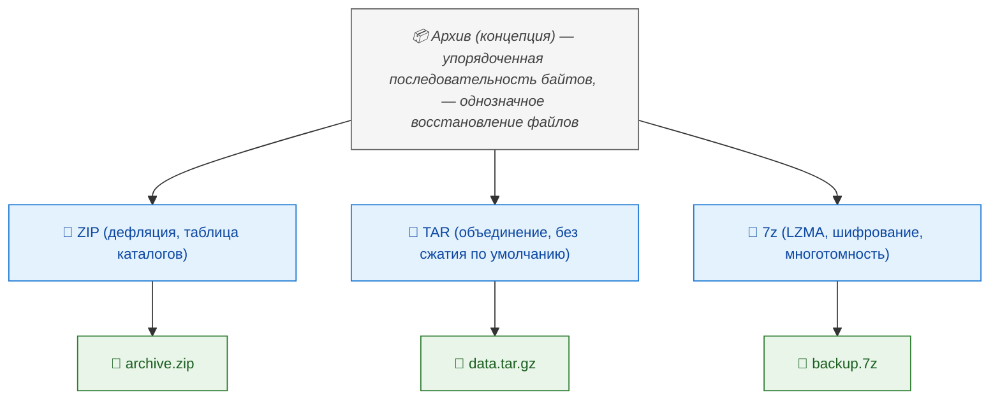
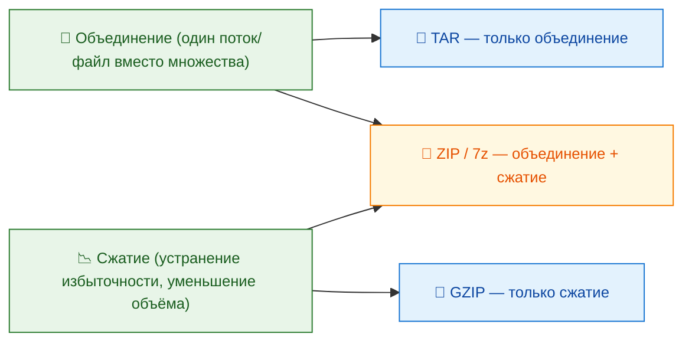
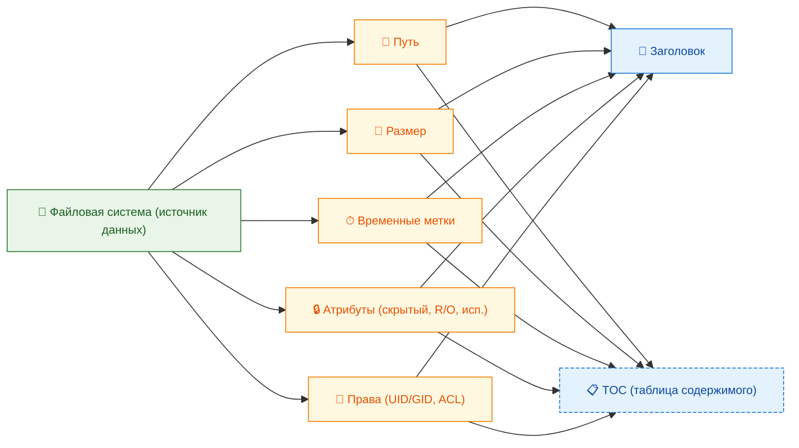
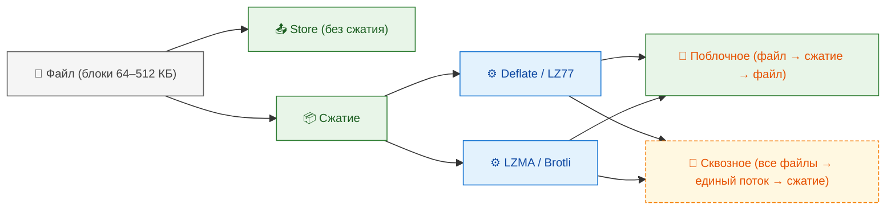
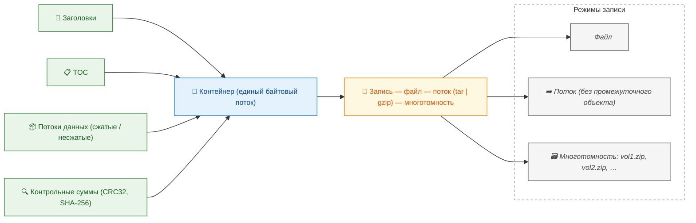

---
title: Архивы и установочные пакеты
---

# Архивы и установочные пакеты

<div class="article-tags">
  <span class="tag tag-required">ОБЯЗАТЕЛЬНО</span>
  <span class="tag tag-beginner">ДЛЯ НОВИЧКОВ</span>
  <span class="tag tag-advanced">НЕ ДЛЯ НОВИЧКОВ</span>
  <span class="tag tag-inprogress">В РАЗРАБОТКЕ</span>
</div>
<span class="complexity-badge">Всем</span>

## Архивы и установочные пакеты

### Что такое архив?

**Архив** — это логическая или физическая структура данных, предназначенная для объединения одного или нескольких файлов и каталогов в единый контейнер. 

Такой контейнер может (но не обязан) включать процедуру сжатия, метаданные (имена файлов, временные метки, права доступа), а также служебную информацию — например, контрольные суммы, таблицы содержимого (TOC), или индексы для быстрого поиска.

Важно различать два аспекта термина *архив*:

1. **Архив как концепция** — любая последовательность байтов, организованная по определённому внутреннему формату, позволяющая однозначно восстановить исходные файлы.  
2. **Архив как файл с расширением** — конкретная реализация, привязанная к определённому формату (ZIP, TAR, 7Z и др.).



Архив не обязательно предполагает сжатие. Например, формат TAR (*Tape ARchive*) изначально создавался для записи файлов на магнитные ленты и не включал сжатие — оно добавлялось на втором этапе (например, через `gzip`, получая `.tar.gz`). В отличие от этого, ZIP и 7Z интегрируют упаковку и сжатие в один этап, хотя позволяют отключить сжатие и сохранить только объединение файлов.

---

### Архивация

Архивацией обычно называют процесс создания архива.

Архивация решает две базовые задачи одновременно:  
- **Объединение** — устранение фрагментации при передаче или хранении множества мелких объектов.  
- **Сжатие** — уменьшение объёма, занимаемого данными, за счёт устранения избыточности.



Эти задачи могут применяться независимо или совместно, в зависимости от требований. Например, при резервном копировании логов часто используется только объединение с минимальным сжатием (чтобы сохранить скорость записи), тогда как при распространении дистрибутивов — максимальное сжатие, даже ценой длительной обработки.

---

### Как работает архивация

Архивация — это многоэтапный процесс, включающий как минимум три уровня преобразования:

#### Сбор и сериализация метаданных  

На первом этапе архиватор проходит по файловой системе, собирая информацию о каждом файле и каталоге:  
- абсолютный или относительный путь,  
- размер в байтах,  
- временные метки (создание, модификация, доступ),  
- атрибуты (только чтение, скрытый, исполняемый),  
- права доступа (в UNIX-подобных системах — UID, GID, маска прав),  
- расширенные атрибуты (например, ACL или SELinux-метки — при поддержке формата).



Эти данные сохраняются в заголовке архива или в отдельной таблице содержимого (TOC). Некоторые форматы (например, ZIP) позволяют размещать TOC в конце файла, что упрощает добавление файлов без перезаписи всего архива.

#### Потоковая обработка содержимого  

Каждый файл читается поблочно (обычно по 64–512 КБ), и его байтовый поток подаётся на вход алгоритму сжатия. Здесь возможны два режима:
- **Без сжатия** (store) — данные копируются «как есть», добавляется только метаинформация и заголовки.  
- **Со сжатием** — применяется выбранный алгоритм (LZ77, Deflate, LZMA, Brotli и др.).



В случае многофайловых архивов возможна **сквозная обработка** (например, в 7Z), когда алгоритм сжатия работает над единым потоком, объединённым из всех элементов. Это повышает степень сжатия, особенно если в разных файлах присутствуют одинаковые фрагменты (например, общие библиотеки, повторяющиеся строки в логах). Однако сквозная обработка нарушает возможность выборочной распаковки: для извлечения одного файла потребуется обработать весь архив.

#### Формирование контейнера и запись  

На заключительном этапе все компоненты — заголовки, TOC, сжатые/несжатые потоки, служебные структуры (например, CRC32 или SHA-256 хэши) — объединяются в единый байтовый поток, записываемый в выходной файл. При использовании потоковой записи (например, в `tar | gzip > archive.tar.gz`) архив может формироваться «на лету», без создания промежуточного объекта.



Важный технический нюанс: многие форматы поддерживают **многотомность** — разбиение архива на части заданного размера (например, 700 МБ для записи на CD). При этом таблица содержимого обычно дублируется в каждом томе или размещается в первом томе, что усложняет извлечение при отсутствии части архива.

---

### Зачем нужна архивация

Назначение архивации выходит далеко за пределы простого уменьшения размера. Ниже представлены ключевые области применения, сгруппированные по типу выгоды.

#### Экономия ресурсов хранения и передачи  

Самый очевидный эффект — сокращение объёма данных. В условиях ограничений по дисковому пространству (особенно в embedded-системах или при длительном хранении логов) это критически важно. Например, текстовые логи веб-сервера могут сжиматься в 5–10 раз при использовании gzip, а резервные копии баз данных в формате SQL — до 20 раз с LZMA2 (в 7Z). Экономия проявляется и при передаче: меньший объём — меньше времени, меньше трафика, ниже вероятность ошибок при сетевой передаче.

#### Упрощение управления файлами  

Объединение множества мелких файлов в один архив — это способ преодолеть ограничения файловых систем. Например, FAT32 имеет лимит на ~65 000 записей в корневом каталоге, а ext4 — на ~4 миллиарда, но даже в последнем случае большое количество мелких файлов ведёт к фрагментации метаданных и снижению производительности. Архив позволяет работать с набором данных как с единым объектом: его проще копировать, перемещать, проверять на целостность, шифровать.

#### Обеспечение целостности и версионности  

Архивы часто включают контрольные суммы (CRC32, Adler-32, SHA-1), проверяющие, не повреждён ли файл при передаче или хранении. Некоторые форматы (например, 7Z) поддерживают **восстановление данных** через информационные блоки избыточности (recovery volumes), позволяя восстанавливать содержимое даже при частичной потере архива. Кроме того, фиксация состояния файла в виде архива — это простейший способ создания точки отката: например, перед обновлением ПО сохраняется архив текущей версии.

#### Совместимость и переносимость  

Архивы абстрагируют от особенностей файловой системы. Например, архив, созданный в Linux с символическими ссылками и правами 0755, может быть корректно распакован в Windows (если архиватор поддерживает маппинг атрибутов), и наоборот. Форматы вроде ZIP стандартизированы на уровне RFC (RFC 1951 для Deflate, APPNOTE.TXT для ZIP-формата), что обеспечивает совместимость между сотнями реализаций.

#### Подготовка к установке  

Это мост к следующей теме — установочным пакетам. Простой архив (например, ZIP с исходным кодом) не содержит логики установки: он лишь предоставляет «материал». Установочный пакет — это архив с дополнительными компонентами: скрипты предустановки и постустановки, зависимости, инструкции для менеджера пакетов, метаданные (версия, автор, лицензия). Такой подход позволяет автоматизировать развёртывание, проверку зависимостей, обновление и удаление.

---

### Как сжимается занимаемый объём

Сжатие данных в архивах основывается на **статистической избыточности** — наличии закономерностей, повторяющихся структур или неравномерности распределения символов. Алгоритмы кодируют файлы более экономно, используя модель источника данных.

#### Основные принципы безпотерянного сжатия

1. **Кодирование по частоте** (алгоритм Хаффмана)  
   Символы, встречающиеся чаще, кодируются более короткими битовыми последовательностями, редкие — более длинными. Это гарантирует, что средняя длина кода будет минимальной при известном распределении частот. В современных реализациях Хаффман используется как завершающий этап — например, в Deflate (ZIP, gzip), после поиска повторов LZ77.

2. **Поиск и замена повторяющихся последовательностей** (LZ77, LZ78, LZW)  
   Алгоритмы семейства Лемпеля–Зива анализируют входной поток и заменяют повторяющиеся подстроки ссылками на их предыдущие вхождения («смещение + длина»). Например, фраза  
   ```
   data/data/data/data
   ```  
   может быть закодирована как  
   ```
   data/‹−5,4›
   ```  
   где `‹−5,4›` означает «вернуться на 5 байт назад и скопировать 4 байта». LZ77 лежит в основе Deflate, LZMA, Zstandard.

3. **Контекстное моделирование** (PPM, BWT)  
   Алгоритмы более высокого порядка строят модель предсказания следующего символа на основе предыдущих *n* символов (контекста). Например, после «HTTP/1.1 200 OK» с высокой вероятностью следует `\r\nContent-Type:`. Чем точнее модель, тем меньше энтропии, и тем выше сжатие. BWT (Burrows–Wheeler Transform), используемый в bzip2, переставляет байты так, чтобы одинаковые символы группировались, после чего применяется RLE и MTF.

#### Почему сжатие не всегда работает

Сжатие эффективно только тогда, когда исходные данные обладают **низкой энтропией** — то есть содержат предсказуемые закономерности. Если энтропия близка к максимуму (8 бит на байт для файлов), сжатие невозможно в принципе без потерь.

Примеры данных с высокой энтропией:
- **Уже сжатые файлы** (JPEG, MP3, MP4, PNG, WebP) — они созданы с использованием методов, близких к теоретическому пределу (например, JPEG использует DCT + квантование + энтропийное кодирование). Повторное сжатие не находит новых закономерностей.
- **Зашифрованные данные** — качественное шифрование (AES, ChaCha20) превращает исходный текст в псевдослучайную последовательность, где каждый байт равновероятен. Архиватор воспринимает такой поток как «белый шум».
- **Случайные бинарные данные** — например, результаты генератора `/dev/urandom`, хэш-суммы, ключи.

В таких случаях архив может оказаться **больше** исходного файла — из-за служебных структур: заголовков, таблицы содержимого, CRC. Разница обычно невелика (несколько килобайт), но при упаковке множества мелких зашифрованных файлов она может стать заметной.

#### Практическая оценка потенциала сжатия

Перед архивацией можно провести **анализ энтропии**:
- Текстовые файлы (TXT, CSV, XML, JSON, HTML, SQL) обычно сжимаются на 60–90%.  
- Двоичные форматы с избыточностью (BMP, WAV, несжатые дампы БД) — на 30–70%.  
- Уже сжатые медиафайлы — на 0–3%, а часто растут на 0.1–0.5%.

Современные архиваторы (например, 7-Zip) при запуске в режиме «ультра» используют адаптивные модели и многопоточную обработку, но даже они не в состоянии «сжать шум». Это не ограничение инструмента, а фундаментальное свойство информации.

---

### Сравнительный анализ форматов

В приведённой таблице перечислены девять форматов, но их можно объединить в три логические группы по назначению и архитектуре:

| Группа | Форматы | Основная функция |
|--------|---------|-----------------|
| **Универсальные архивы** | ZIP, RAR, 7Z, CAB | Объединение и сжатие файлов без логики установки |
| **Образы носителей** | ISO, DMG | Представление файловой системы в едином файле |
| **Установочные пакеты** | DEB, RPM, APK, IPA | Управление развёртыванием программного обеспечения |

Рассмотрим каждую группу подробно.

---

#### Универсальные архивы

Эти форматы предназначены для *передачи и хранения* данных. Они не содержат инструкций по установке, не проверяют зависимости и не интегрируются с системой управления пакетами. Однако различия между ними значительны.

##### ZIP

Формат ZIP был разработан в 1989 году Филом Кацем и быстро стал *де-факто* стандартом благодаря открытой спецификации (APPNOTE.TXT) и встроенной поддержке в операционных системах. Основные особенности:

- Использует алгоритм **Deflate** (комбинация LZ77 + код Хаффмана) по умолчанию. Поддерживает и другие методы: без сжатия (Store), BZIP2, LZMA (в расширенных реализациях), даже шифрование (AES-128/256 в ZIP 2.0+).
- Поддерживает **фрагментацию** (multi-disk archives), но на практике почти не используется.
- Метаданные включают: пути (внутренние, с разделителем `/`), временные метки (с точностью до 2 секунд — ограничение DOS-времени), CRC32, флаги (шифрование, UTF-8 имена — через extra field `0x0001`).
- Критическое ограничение: оригинальный ZIP использует 32-битные смещения, что ограничивает размер архива и отдельных файлов 4 ГБ. Расширение **ZIP64** (введено в 2001) устраняет это, но требует поддержки со стороны распаковщика.

ZIP популярен из-за *предсказуемости*: почти любая ОС, язык программирования и веб-сервер умеют с ним работать «из коробки». Это делает его стандартом для веб-API (например, выгрузка отчётов), распространения исходного кода (GitHub по умолчанию отдаёт репозитории как ZIP) и встраивания в другие форматы (JAR, ODF, EPUB — всё это ZIP-архивы с определённой структурой).

##### RAR

Разработан Евгением Рошалем в 1993 году. В отличие от ZIP, RAR — это *проприетарный* формат, хотя его спецификация частично раскрыта. Основные отличия:

- Алгоритм сжатия — модифицированный **PPM** (Prediction by Partial Matching) с адаптивной моделью контекста, что даёт лучшее сжатие, особенно на тексте и двоичных файлах с повторами.
- Поддержка **восстановительных томов** (`.rev`): при потере одного из частей многотомного архива можно восстановить данные, если есть достаточное количество `.rev`-файлов.
- Встроенные возможности: шифрование заголовков (имена файлов не видны без пароля), тестирование архива на повреждения, комментарии.

Однако RAR не получил широкого распространения в серверных и open-source средах из-за отсутствия свободных реализаций с полной совместимостью. 7-Zip может *распаковывать* RAR (благодаря обратной инженерии), но не создаёт архивы в этом формате по лицензионным причинам.

##### 7Z

Формат, разработанный Игорем Павловым как часть проекта 7-Zip. Это *открытый*, высокооптимизированный архивный контейнер, спроектированный с нуля для максимальной гибкости и эффективности.

- Поддерживает **множество алгоритмов сжатия** в одном архиве: LZMA, LZMA2 (многопоточный), Deflate, BZIP2, PPMd, даже Zstandard (в новых версиях).
- Использует **сквозное сжатие** по умолчанию: все файлы объединяются в один поток, что повышает степень сжатия, но требует полной распаковки для доступа к одному файлу.
- Метаданные включают: полные пути в UTF-8, временные метки с наносекундной точностью (на Linux), права доступа, символические ссылки, жёсткие ссылки.
- Поддержка **шифрования всего архива** (включая заголовки) с AES-256 и ключом на основе PBKDF2.
- Формат расширяем: новые кодеки и свойства могут быть добавлены без нарушения обратной совместимости (через идентификаторы классов).

7Z — это выбор для сценариев, где важны максимальное сжатие и целостность, но не важна встроенная поддержка в ОС (требуется установка 7-Zip или совместимого инструмента).

##### CAB (Cabinet)

Формат, разработанный Microsoft для внутренних нужд Windows. Используется в установщиках MSI, драйверах (`.inf` + `.cat` + `.sys` в CAB), обновлениях Windows (через `wusa.exe`).

- Алгоритмы сжатия: **MSZIP** (Deflate), **QUANTUM** (LZX — модификация LZ77 с более длинными окнами), **LZX** (в новых версиях).
- Поддерживает **дедупликацию на уровне файлов** внутри одного CAB: если два файла идентичны, хранится только одна копия.
- Интеграция с цифровой подписью: CAB-файлы могут быть подписаны через Authenticode — это обязательно для драйверов в 64-битных Windows.
- Имеет ограничения: максимальный размер файла — 2 ГБ (из-за 32-битных смещений), что делает его непригодным для крупных дистрибутивов.

CAB редко используется конечными пользователями, но играет ключевую роль в инфраструктуре Windows: практически любое официальное обновление или драйвер проходит через этот формат.

---

#### Образы носителей

Эти форматы моделируют *физическую структуру* оптического или виртуального диска — то есть полноценную файловую систему (обычно ISO 9660, UDF или HFS+).

##### ISO

Стандарт ISO 9660 (известен как «ISO-образ») определяет структуру данных на CD-ROM. Файл `.iso` — это побайтовая копия содержимого диска, включая загрузочный сектор, таблицу томов, каталоги и файлы.

- Не сжимается: размер ISO равен размеру исходного тома (с выравниванием по секторам — обычно 2 КБ).
- Может быть **загрузочным**: содержит загрузочную запись (El Torito), что позволяет использовать его как виртуальный носитель для установки ОС.
- Поддержка расширений: **Joliet** (для длинных имён в UTF-16), **Rock Ridge** (для UNIX-атрибутов, ссылок), **UDF** (для DVD/Blu-ray).

В современных системах ISO монтируется как виртуальный диск (`mount -o loop image.iso /mnt` в Linux, «Подключить образ диска» в Windows 8+). Это позволяет избежать распаковки — файлы доступны напрямую, как на физическом носителе.

##### DMG

Формат Apple для распространения приложений в macOS. По сути — это образ файловой системы **HFS+** или **APFS**, упакованный в единый файл.

- Поддерживает сжатие (обычно **ADC** — Apple Data Compression, или **zlib**), шифрование, разбиение на части.
- Может содержать **фоновое изображение**, расположение иконок, лицензионное соглашение — всё это часть метаданных файловой системы.
- При монтировании DMG появляется как отдельный диск в Finder, откуда пользователь перетаскивает приложение в `/Applications`.

macOS не имеет единого менеджера пакетов для GUI-приложений; установка сводится к копированию бандла `.app`. Поэтому DMG — это «дружелюбный» способ доставки, а не средство управления зависимостями.

---

#### Установочные пакеты

Это *единицы развёртывания*, интегрированные в экосистему операционной системы. 

Они содержат:
- файлы программы,
- метаданные (имя, версия, описание, лицензия, архитектура),
- зависимости (другие пакеты, которые должны быть установлены),
- скрипты (pre-install, post-install, pre-remove, post-remove),
- инструкции для менеджера пакетов (куда копировать файлы, какие права выставить, какие службы перезапустить).

##### DEB (Debian Package)

Формат, используемый в Debian, Ubuntu, Mint и производных. DEB — это *архив в архиве*:  
- Внешний слой — **ar** (Unix-архиватор, простой формат: заголовок + данные),  
- Внутри — три компонента:  
  1. `debian-binary` — версия формата (обычно `2.0`),  
  2. `control.tar.gz` — метаданные и скрипты (`control`, `preinst`, `postinst`, `prerm`, `postrm`, `conffiles`),  
  3. `data.tar.gz` (или `.xz`, `.zst`) — собственно файлы программы.

Менеджер `dpkg` отвечает за низкоуровневую установку, а `APT` — за разрешение зависимостей, загрузку из репозиториев, обновление. DEB поддерживает **конфигурационные файлы**, которые не перезаписываются при обновлении, если пользователь их модифицировал.

##### RPM (Red Hat Package Manager)

Используется в RHEL, CentOS, Fedora, openSUSE. RPM — это единый файл с бинарной структурой (не архив), содержащий:
- заголовок с тегами (имя, версия, зависимости, суммы контроля),
- сжатый payload (обычно с помощью `cpio + gzip/xz/zstd`).

Ключевые отличия от DEB:
- RPM строже в контроле целостности: каждый файл имеет MD5/SHA256-хэш в заголовке.
- Поддержка **транзакционности**: пакет либо устанавливается полностью, либо откатывается при ошибке (в новых версиях — с поддержкой Btrfs/ZFS снапшотов).
- Использует **скриптлеты** (встроенные скрипты в заголовке), которые выполняются в определённом порядке.

Менеджер `rpm` работает на низком уровне, а `DNF` (на смену `YUM`) — в качестве высокоуровневого клиента с разрешением зависимостей.

##### APK (Android Package)

Формат для Android — это, по сути, **ZIP-архив** с определённой структурой:
- `AndroidManifest.xml` — декларация компонентов, прав, зависимостей,
- `classes.dex` — байт-код Dalvik/ART,
- `resources.arsc` — скомпилированные ресурсы,
- `lib/` — нативные библиотеки (`.so`),
- `META-INF/` — цифровая подпись (обязательна для установки).

APK не содержит логики установки — она реализована в `PackageManagerService` в Android. При установке проверяется подпись, разрешения, совместимость с API level, и файлы копируются в `/data/app/`.

##### IPA (iOS App Store Package)

Аналог APK для iOS. Это ZIP-архив, содержащий:
- Payload/`AppName.app` — бандл приложения (бинарный файл, ресурсы, `Info.plist`),
- `iTunesMetadata.plist` — метаданные для App Store,
- `embedded.mobileprovision` — профиль подписи (разрешённые устройства, права).

Установка IPA возможна только через iTunes (устаревшее), TestFlight или MDM-системы — напрямую через файловый менеджер нельзя (ограничение sandbox). Подпись проверяется строго: любое изменение в архиве приводит к отказу в запуске.

---

### Архивы и установочные пакеты

| Критерий | Архив (ZIP, 7Z) | Установочный пакет (DEB, RPM) |
|---------|----------------|-----------------------------|
| **Цель** | Передача и хранение данных | Управление развёртыванием ПО |
| **Зависимости** | Не поддерживаются | Явно декларируются и разрешаются |
| **Идемпотентность** | Не гарантируется (повторная распаковка может перезаписать) | Гарантируется (пакет либо не установлен, либо обновлён) |
| **Откат** | Ручной (резервная копия) | Автоматический (через менеджер) |
| **Интеграция с ОС** | Минимальная | Полная (службы, права, пути, обновления) |
| **Безопасность** | Шифрование по желанию | Обязательная подпись, проверка хэшей |

Установочные пакеты — это инструмент *управления состоянием системы*. Они позволяют отвечать на вопросы:  
- Какая версия программы установлена?  
- Какие другие пакеты зависят от неё?  
- Можно ли безопасно удалить этот пакет?  
- Были ли внесены пользовательские изменения в конфигурацию?

Простые архивы таких возможностей не предоставляют. Поэтому в production-средах (серверы, embedded-устройства, корпоративные десктопы) используются именно пакетные менеджеры.

---

### Современные тенденции

#### AppImage, Flatpak, Snap

Эти форматы решают проблему **декомпозиции зависимостей** в Linux. Вместо установки библиотек в систему, приложение поставляется со *всем необходимым* внутри:

- **AppImage** — единый исполняемый файл (ELF + SquashFS-образ), монтируется в память при запуске. Не требует установки, не оставляет следов.
- **Flatpak** — использует OSTree для дедупликации общих runtime’ов (GNOME, KDE), изолирует приложение через Bubblewrap.
- **Snap** — формат Canonical, схож с Flatpak, но использует собственную систему runtime’ов и строгую песочницу (seccomp, AppArmor).

Все они — по сути, *архивы с встроенной логикой развёртывания*, сочетающие преимущества пакетов (управление версиями, обновления) и портативности («один файл — один запуск»).

#### OCI-образы (Docker, containerd)

Контейнерный образ — это *набор слоёв*, каждый из которых представляет собой архив файловой системы (обычно в формате tar+gzip). Слои объединяются через union mount (overlayfs), что позволяет эффективно кэшировать общие части (например, базовый слой Ubuntu).

OCI (Open Container Initiative) стандартизировал формат, что сделало образы переносимыми между разными движками (Docker, Podman, CRI-O). Здесь архивация служит для *атомарности доставки*: образ — неизменяемый артефакт, который можно верифицировать, подписывать и разворачивать идентично в любом окружении.

---

### Целостность и подлинность

Архивация без проверки целостности — это риск. Повреждение одного байта в середине многотомного архива может сделать весь набор непригодным для восстановления. Поэтому все современные форматы включают механизмы верификации, но их надёжность и назначение различаются принципиально.

#### Контрольные суммы (CRC32, Adler-32)

Наиболее простой уровень защиты — **циклический избыточный код**.  
- **CRC32** — 32-битный полиномиальный хэш, используемый в ZIP, RAR, 7Z, Ethernet, PNG. Обнаруживает:  
  - одиночные и двойные битовые ошибки,  
  - ошибки в блоках до 32 бит подряд,  
  - большинство всплесков ошибок длиной до 32 бит.  
  *Не обнаруживает*: специально подобранные коллизии, неслучайные изменения (например, замена строки на другую с тем же CRC).

- **Adler-32** — упрощённая альтернатива (используется в zlib/Deflate). Быстрее CRC32, но менее надёжна при коротких данных. Применяется там, где важна скорость, а не максимальная защита.

Контрольные суммы вычисляются *на этапе создания архива* и сохраняются в заголовке каждого файла (в ZIP — даже для несжатых файлов). При распаковке производится повторное вычисление и сравнение. Если не совпадает — архиватор сообщает об ошибке.

**Важный нюанс**: CRC32 защищает *от случайных повреждений*, но не от *злонамеренных изменений*. Она не криптографически стойкая — подобрать коллизию можно за минуты на обычном ПК.

#### Криптографические хэши (SHA-256, BLAKE3)

Для задач, где важна гарантия неизменности (например, резервное копирование или распространение ПО), используются криптографические хэш-функции:
- **SHA-256** — стандарт де-факто, часть семейства SHA-2. Вычисляется медленнее CRC, но устойчив к коллизиям (практически невозможно найти два разных файла с одинаковым хэшем).
- **BLAKE3** — современная функция, в 3–5 раз быстрее SHA-256 на CPU с AVX-512, с тем же уровнем безопасности. Используется в IPFS, Btrfs send/receive.

Хэши обычно публикуются отдельно — в виде файла `.sha256sum` или в метаданных репозитория (например, в `Release`-файле APT). Пользователь скачивает архив и хэш, затем сверяет локально:  
```bash
sha256sum -c checksums.sha256
```

#### Цифровая подпись

Это следующий уровень — не просто подтверждение *неизменности*, но и *подлинности источника*. Подпись строится по схеме:
1. Вычисляется хэш архива (например, SHA-256),  
2. Хэш шифруется *закрытым ключом* издателя,  
3. Результат (подпись) прикрепляется к архиву или публикуется отдельно.

Проверка:
1. Получатель вычисляет хэш архива,  
2. Расшифровывает подпись *открытым ключом* издателя,  
3. Сравнивает два хэша.

Если совпадают — данные не изменены и подписаны владельцем закрытого ключа.

**Реализации по форматам**:
- **DEB/RPM**: подпись через GPG. В Debian ключи хранятся в `debian-keyring`, в RHEL — в `gpg-pubkey`. `apt` и `dnf` проверяют подпись автоматически при установке из репозитория.
- **ZIP/APK**: поддержка **Authenticode** (Windows) и **APK Signature Scheme v2/v3** (Android). В APK v2 подпись охватывает *весь архив как единую структуру*, а не отдельные файлы — это исключает «внедрение» в ZIP без нарушения подписи.
- **CAB**: обязательная подпись для драйверов в 64-битных Windows (через `signtool.exe`). Без неё драйвер не загрузится.
- **DMG**: подпись через `codesign` в macOS, проверяется Gatekeeper при первом запуске.

**Ключевой принцип**: подпись не шифрует содержимое — она только гарантирует, что архив исходит от доверенного источника и не был изменён. Для конфиденциальности применяется отдельное шифрование (AES в 7Z, ZIP с AES).

---

### Механизмы обновления

Полная замена архива при каждом обновлении неэффективна. Поэтому разработаны методы доставки *только изменений*.

#### Дельта-обновления (бинарные патчи)

Идея проста: вместо отправки новой версии целиком — отправить *разницу* между старой и новой.  
- **bsdiff/bspatch** — классическая утилита, основанная на алгоритме суффиксных массивов. Генерирует патч размером ~5–15% от полного архива для типичных обновлений ПО. Используется в Chromium, Firefox, Steam.  
- **xdelta** — более гибкий формат, поддерживает сжатие патчей и многопоточность.  
- **RPM/DEB**: поддерживают *дельта-RPM* (DRPM) и *debpartial*, но на практике редко используются из-за сложности управления версиями.

Ограничения:  
- Требуется наличие *точной* предыдущей версии на клиенте,  
- Патч привязан к конкретным версиям (v1.0 → v1.1),  
- Генерация патча требует значительных ресурсов (O(n log n) по размеру файла).

#### Content-Addressable Storage (CAS)

Современный подход — хранить данные по хэшу содержимого. Примеры:  
- **IPFS** — файл разбивается на блоки (по 256 КБ), каждый блок хэшируется (BLAKE2b), идентификатор блока = его хэш. Одинаковые блоки дедуплицируются автоматически.  
- **OSTree** (используется в Flatpak, rpm-ostree) — дерево коммитов, как в Git. Обновление — это загрузка только новых блоков объектов.  
- **Docker layers** — каждый слой имеет хэш, при `docker pull` скачиваются только отсутствующие слои.

Преимущество CAS: клиент сам решает, какие части ему нужны, исходя из локального состояния. Сервер не должен генерировать патчи — он просто отдаёт блоки по запросу хэша.

#### Раздельная доставка компонентов

Крупные приложения (например, игры в Steam) используют *чанкинг*:  
- Ресурсы разбиваются на логические группы (локализация, текстуры, звук),  
- Каждая группа упаковывается отдельно,  
- Клиент загружает только нужные чанки (например, русскую локализацию и 4K-текстуры).

Это сочетается с CAS: чанки хэшируются, и при обновлении скачиваются только изменившиеся.

---

### Архивация в распределённых и облачных средах

В условиях, когда данные измеряются терабайтами и петабайтами, классические подходы («создать ZIP и положить на диск») неприменимы. Появляются новые требования:

#### Потоковая архивация (Streaming Archives)

Резервное копирование активных баз данных или лог-потоков не терпит остановок. Поэтому используются архиваторы, которые работают в pipeline:  
```bash
pg_dump mydb | gzip -c | aws s3 cp - s3://backups/mydb-$(date +%F).sql.gz
```
- `tar` поддерживает `-` как имя файла для stdin/stdout,  
- `zstd` имеет режим `--stream-size=...` для эффективного сжатия потоков,  
- `borg` и `restic` позволяют дедуплицировать данные *в потоке*, сравнивая блоки с уже существующими в репозитории.

#### Форматы, оптимизированные под cloud-storage

Облачные хранилища (S3, GCS) взимают плату за запросы (GET/PUT) и хранение. Поэтому важны:
- **Минимизация количества объектов**: 1 миллион мелких файлов дороже 1 архива,  
- **Поддержка диапазонных запросов (Range Requests)**: чтобы читать часть архива без скачивания целиком.

Форматы, решающие эти задачи:
- **Parquet/ORC** — колоночные форматы для аналитики. Внутри — сжатые блоки (Snappy, Zstandard, GZIP), каждый блок имеет метаданные и хэш. Можно читать одну колонку, не распаковывая остальное.  
- **Zstandard (zstd)** — поддерживает *индексированные фреймы*: при сжатии можно вставить контрольные точки (например, каждые 100 МБ), по которым можно начать распаковку без обработки предыдущих данных. Это позволяет эффективно использовать Range GET в S3.  
- **CRAM** — формат для геномных данных, использует *reference-based compression*: вместо хранения полной последовательности ДНК хранятся только отличия от эталонного генома. Сжатие — до 90%.

#### Умное хранение (Intelligent Tiering)

Облачные провайдеры предлагают автоматическое перемещение данных между уровнями:  
- **Hot** — для часто читаемых архивов (например, текущие бэкапы),  
- **Cool** — для архивов старше 30 дней,  
- **Archive** — для редко нужных (например, годичные бэкапы), с задержкой восстановления 1–5 часов.

Для этого архивы должны быть *атомарными* и *самодостаточными* — нельзя хранить TOC отдельно от данных, иначе при восстановлении из архива придётся выгружать оба объекта.

---