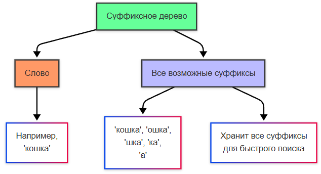
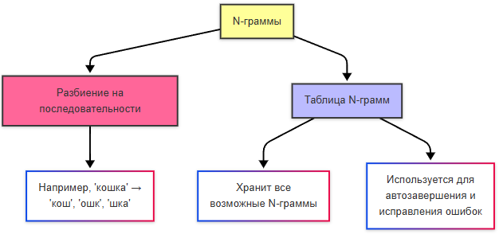

---
title: 1.21. Поиск информации
---

# 1.21. Поиск информации

  ДЛЯ НОВИЧКОВ
  НЕ ОБЯЗАТЕЛЬНО
  В РАЗРАБОТКЕ

Всем

## Технологии поиска

Мы живём в море информации, и зачастую неструктурированной, разбросанной по разным документациям, и, чтобы удовлетворить нашу потребность, нужно выполнить поиск. Для обывателя, это просто вбить вопрос в строку в Google или Яндекс. Но мы с вами уже не обыватели, поскольку изучили особенности программ и сетей. Почему бы нам не разобраться с тем, как правильно искать информацию, её структурировать и конечно же, понять, как работают поисковики?

★ **Информационный поиск** – это целая наука, затрагивающая процесс выявления в массиве информации записей, удовлетворяющих заранее определённому условию поиска или запросу. Поиск в Google (под гуглом мы будем подразумевать использование любого поисковика в целом) это навык. И если вводить запросы наугад, или задавая их в форме вопроса, можно потратить часы на бесполезные ссылки. Вот как искать эффективно.

Поиск бывает нескольких видов:
	- полнотекстовый поиск – поиск по всему содержимому документа, который для ускорения поиска использует предварительно построенные индексы – именно такой вид используется в «поисковиках»;
	- поиск по метаданным – поиск по атрибутам документа (название документа, дата создания, размер, автор) – допустим, поиск в файловой системе;
	- поиск изображений – более сложный вид, когда поисковая система распознаёт содержание изображения, и в результатах отображаются похожие изображения.

Поисковик работает по алгоритму:
	- роботы (краулеры) сканируют сайты, извлекают данные и добавляют их в индекс (в первую очередь текст);
	- алгоритмы ранжирования сортируют результаты по релевантности (допустим, возвращая топ-10);
	- персонализация (история поиска, геолокация и прочие факторы) влияет на выдачу.

Весь алгоритм определяет, что именно вы ищете. Поэтому, при поиске, система не перебирает все сайты подряд, а работает с базой данных. В интернете 60+ триллионов страниц (по данным Google от 2024 года), и перебирать их все по каждому запросу будет безумно дорого и медленно. Поэтому поисковики заранее создают «индекс» - специальную базу данных, где каждому слову сопоставлены документы, где оно встречается, а данные упорядочены для мгновенного доступа. Словом, индекс – алфавитный указатель в конце учебника, указывающий номера страниц.

★ **Метаданные** – информация о другой информации, своего рода сведения о признаках и свойствах. Метаданные файла могут содержать информацию о его названии, размере, структуру, формат, информацию об авторе, редакторе, и прочем.

★ **Поисковый робот, или веб-краулер (Web crawler)** - алгоритмы автоматического интернет-сёрфинга – это специальная программа, которая является составной частью поисковой системы, и именно она перебирает страницы в Интернете с целью занесения информации о них в базу данных поисковика. Она «парсит», анализирует содержимое страниц, преобразовывая в определённый вид на серверы поисковой машины.

★ **Поисковый индекс** – особая структура данных, которая используется в поисковых системах, словно «библиотечный каталог с указателями». Поисковая машина выполняет индексирование – процесс сбора, сортировки и хранения данных, чтобы обеспечить быстрый и точный поиск информации. Веб-индексирование касается как раз именно процесса добавления сведений о сайте роботом поисковой машины в базу данных, что потом и используется для поиска информации.

★ **Инвертированный индекс** – особая структура данных, в которой для каждого слова коллекции документов в соответствующем списке перечислены все документы коллекции, в которых оно встретилось. Документ разбивается на слова («токены»), и для каждого слова создаётся список документов, где токены встречаются, это и используется всеми современными поисковиками – Google, Elasticsearch, Solr.

Для более сложных запросов используют суффиксное дерево, которое хранит все возможные суффиксы слов. Это намного более требовательный к ресурсам подход, который используется в науке (геномика, поиск в ДНК) и специализированных СУБД (SuffixTreeDB).

Для исправления ошибок используют N-граммы, это таблицы всех возможных последовательностей из N символов («кош», «ошк», «шка»), что позволяет выполнять автозавершение поиска и исправлять опечатки («кошка» и «кошак»). Используется в системах проверки орфографии, к примеру.

В машинном обучении и латентно-семантическом анализе применяется более сложная технология – матрица термов документа, которая описывает частоту терминов, встречающихся в коллекции.
