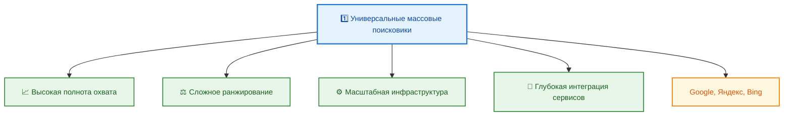
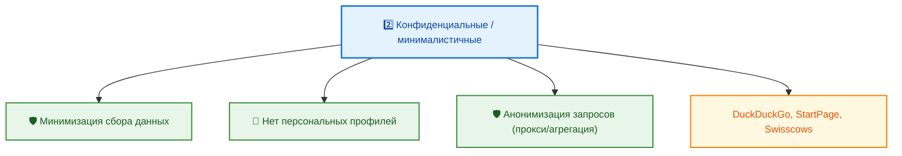
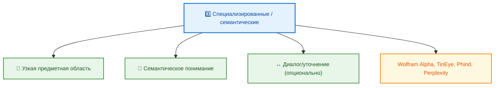

---
title: 1.21. Популярные поисковики
---

# 1.21. Популярные поисковики

<div class="article-tags">
  <span class="tag tag-beginner">ДЛЯ НОВИЧКОВ</span>
  <span class="tag tag-notrequired">НЕ ОБЯЗАТЕЛЬНО</span>
  <span class="tag tag-inprogress">В РАЗРАБОТКЕ</span>
</div>
<span class="complexity-badge">Всем</span>

## Популярные поисковики

Поисковые системы обеспечивают доступ к информации, структурируют знания и формируют поведенческие паттерны пользователей. Популярность конкретного поисковика обусловлена долей рынка и его способностью решать определённые задачи: от массового повседневного поиска до узкоспециализированных запросов в профессиональных областях. При этом «популярность» может оцениваться по разным критериям: географическому охвату, частоте использования в профессиональной среде, востребованности в определённых сценариях (например, при заботе о конфиденциальности или при решении технических задач).

Современный ландшафт поисковых систем условно делится на три группы:

1. **Универсальные массовые поисковики**, ориентированные на широкую аудиторию и обеспечивающие общую индексацию веб-контента. Их отличает высокая полнота охвата, сложные алгоритмы ранжирования, масштабная инфраструктура и глубокая интеграция с другими сервисами. К этой группе относятся Google, Яндекс, Bing.




2. **Конфиденциальные и минималистичные системы**, в которых центральным принципом является ограничение сбора пользовательских данных. Они часто не формируют персональные профили, не сохраняют историю запросов и используют проксирующие или агрегирующие схемы обработки запросов. Примеры — DuckDuckGo, StartPage, Swisscows.



3. **Специализированные и семантические поисковики**, нацеленные на конкретные типы запросов: изображения, звук, техническая документация, математические вычисления или диалоговое уточнение. Такие системы не заменяют универсальные, но дополняют их, обеспечивая точность и релевантность в узкой предметной области — Wolfram Alpha, TinEye, Phind, Perplexity.



Далее рассмотрим каждую из этих групп, начиная с доминирующих универсальных систем.

---

### Google

**Google**, разработанный компанией Alphabet Inc., остаётся доминирующей поисковой системой в глобальном масштабе. Его влияние выходит далеко за рамки традиционного поиска: Google определяет поведенческие ожидания пользователей, задаёт стандарты в области индексации, ранжирования и представления результатов, а также служит краеугольным камнем целой экосистемы цифровых сервисов.

Техническая база Google основана на собственной распределённой архитектуре, включающей краулеры (Googlebot), индексирующие миллиарды страниц ежедневно, хранилища на базе Bigtable и Colossus, а также вычислительные кластеры для анализа и ранжирования. Алгоритмы поиска постоянно обновляются – в их основе лежат модели, учитывающие сотни факторов: от структуры ссылок и качества контента до временных паттернов поведения пользователей и геолокационных сигналов.

Особенность Google — *персонализация*. Результаты поиска формируются с учётом истории активности пользователя в рамках его аккаунта Google, включая поисковые запросы, посещённые сайты, данные из Gmail и Календаря, геопозицию, устройство и даже время суток. Это позволяет повышать релевантность, однако порождает эффект «информационного пузыря» — пользователь не видит альтернативных точек зрения, которые система сочла нерелевантными для его профиля.

Ещё один ключевой аспект — *глубокая интеграция с собственными сервисами*. Например, запрос «погода в Москве» сразу отображает виджет с текущими данными от сервиса Погода; «расписание электричек» интегрируется с Google Maps и транспортными API; поиск документов — с Google Drive; запрос на перевод — с Google Translate. Такой подход снижает число кликов и удерживает пользователя внутри экосистемы.

В последние годы Google активно внедряет ИИ-компоненты:  
- *SGE (Search Generative Experience)* формирует сводные ответы на основе нескольких источников, выделяя ключевые факты и цитируя первоисточники.  
- В диалоговом режиме система способна уточнять неоднозначные запросы: например, после запроса «лучшие ноутбуки 2025» предложить уточнение по бюджету, назначению (игры/работа/учёба), бренду.  
- Визуальные и мультимодальные запросы (через Lens) позволяют искать по изображению, тексту на фотографии, объектам на сцене.

Google позиционирует себя как *интеллектуального посредника* между пользователем и знанием. Его цель — *предугадать намерение* и *выполнить задачу* за пользователя.

---

### Яндекс

**Яндекс** — крупнейший российский поисковик, разработанный одноимённой компанией. Несмотря на снижение доли рынка в последние годы, он сохраняет доминирующее положение в русскоязычном сегменте интернета (Рунете), что объясняется не столько маркетингом, сколько особой адаптацией технологии к лингвистическим и культурным особенностям.

Основное достоинство Яндекса — *понимание русского языка*. Система корректно обрабатывает морфологическую вариативность (падежи, множественное число, глагольные формы), синонимы, сленг, региональные выражения и даже опечатки в запросах вроде «как настроит роутер» или «почему компютер тормозит». Поисковый индекс Яндекса изначально проектировался с акцентом на русскоязычный контент, включая государственные порталы, региональные СМИ, форумы и блоги, которые часто игнорируются или плохо ранжируются в Google.

Архитектура Яндекса включает собственные краулеры («Яндекс.Паук»), семантическую платформу MatrixNet (позже заменённую на более современные нейросетевые модели), а также уникальную систему ранжирования, в которой значительный вес имеют:  
- *географическая привязка* (для запросов вроде «поликлиника рядом»),  
- *временной контекст* (актуальность при поиске новостей или событий),  
- *поведенческие метрики* (время на странице, глубина просмотра, частота возвратов),  
- *анализ структуры сайта* (наличие карты сайта, микроразметки, адаптивности).

Особую роль играет *интеграция с внутренними сервисами*:  
- «Яндекс.Карты» и «Яндекс.Навигатор» обеспечивают детальную проработку транспортных и пешеходных маршрутов, данных о пробках, общественном транспорте и даже о доступности объектов для маломобильных групп.  
- «Алиса» — голосовой помощник, встроенный в поиск, мобильные приложения и умные устройства, способна выполнять сложные составные команды («найди ближайший магазин, где есть хлеб и молоко, и проложи маршрут»).  
- Рекламная платформа «Яндекс.Директ» тесно связана с алгоритмами поиска, что позволяет точно таргетировать объявления в результатах выдачи.

Яндекс также развивает ИИ-направление:  
- «Яндекс.GPT» используется для генерации описаний, ответов на вопросы и поддержки диалогового поиска.  
- Видеопоиск поддерживает распознавание речи и транскрибирование контента с YouTube и «Яндекс.Эфира».  
- «Яндекс.Услуги» агрегирует предложения исполнителей (ремонт, репетиторство, юристы), связывая их с релевантными поисковыми запросами.

Стратегия Яндекса основана на *максимальной полезности в конкретном регионе*. В этом смысле он служит примером успешной локализованной поисковой системы, построенной на глубоком понимании локального контекста.

---

### Bing

**Bing**, разрабатываемый Microsoft, занимает третье место по глобальной доле рынка, но его влияние значительно шире благодаря глубокой интеграции в операционные системы и устройства экосистемы Microsoft.

Технически Bing использует собственные краулеры, но с 2009 года совместно с Yahoo! формирует общий индекс поиска (через партнёрство с Yahoo Search). Это позволяет сократить издержки на сбор и обработку данных, сохраняя приемлемую полноту охвата. Основные алгоритмы ранжирования включают семантический анализ, оценку авторитетности домена (через модель PageRank-подобного типа), а также расширенные сигналы пользовательского взаимодействия.

Главное конкурентное преимущество Bing — *встроенность*. По умолчанию он является поисковой системой в:  
- Windows (через строку поиска на панели задач и в проводнике),  
- Microsoft Edge,  
- Microsoft 365 (поиск в Outlook, OneNote, Teams),  
- Xbox и Surface-устройствах.

Это означает, что миллионы пользователей взаимодействуют с Bing ежедневно, даже не осознавая этого — например, при поиске файлов на компьютере или в облаке OneDrive. Такая «невидимая» интеграция обеспечивает стабильный трафик и данные для обучения моделей.

Bing делает акцент на *визуальной составляющей поиска*:  
- Фоновая картинка дня — маркетинговый инструмент, который формирует эмоциональную связь с брендом.  
- Видеопоиск включает *предпросмотр в реальном времени* — при наведении на результат можно видеть фрагмент видео без перехода на YouTube или Vimeo.  
- Визуальный поиск (через Bing Visual Search) позволяет загружать изображение и получать информацию об объектах на нём: название товара, похожие изображения, магазины, цены.

С 2023 года Bing активно развивает ИИ-направление в партнёрстве с OpenAI:  
- *Bing Chat* (ныне Copilot в Bing) — диалоговый ИИ, основанный на GPT-4, умеет генерировать развёрнутые ответы, писать код, составлять таблицы сравнения, переводить тексты и цитировать источники.  
- В отличие от Google SGE, Copilot в Bing изначально проектировался как *конкурент ChatGPT*, а не как дополнение к поиску — поэтому акцент сделан на интерактивности и генеративных возможностях.  
- Поддерживается мультимодальный ввод: можно отправить изображение и задать вопрос по нему («что это за устройство?», «как его настроить?»).

Bing усиливает экосистему Microsoft, превращая поиск в *часть рабочего процесса*, а не в отдельную активность.

---

### Конфиденциальные поисковые системы

Конфиденциальность в веб-поиске — не просто отсутствие cookies. Это комплексный подход, охватывающий цепочку обработки запроса: от момента его формирования пользователем до получения итоговой выдачи. Системы, позиционирующие себя как «приватные», реализуют разные уровни защиты, и важно различать *маркетинговую риторику* и * technically enforceable guarantees*.

#### DuckDuckGo

DuckDuckGo (DDG), разрабатываемый одноимённой компанией, стал символом движения за цифровую приватность. Его архитектура построена на трёх китах:

1. **Отсутствие постоянных идентификаторов**. DDG не присваивает пользователю уникальный ID, не сохраняет IP-адрес после завершения сессии (кроме случаев, необходимых для предотвращения DDoS), не использует долгоживущие cookies для трекинга. Каждый запрос обрабатывается изолированно.

2. **Локальная обработка метаданных**. При включённой опции «Enhanced Tracking Protection» (в расширении браузера) DDG перехватывает сторонние трекеры *до* отправки запроса на сервер, переписывая URL-параметры, содержащие идентификаторы (например, `?utm_source=...`, `?fbclid=...`). Это делается на стороне клиента — сервер никогда не получает «загрязнённый» запрос.

3. **Гибридный индекс**. DDG не строит полноценный собственный индекс веба из-за экономических и технических ограничений. Основной источник выдачи — лицензированные API Bing (с фильтрацией рекламы и персонализированных результатов), дополненные собственной базой из сайтов-доноров (например, Wikipedia, Stack Overflow, GitHub), а также результатами партнёрских движков (например, Yelp для локального поиска). Это означает, что *полнота охвата уступает Google*, но компенсируется отсутствием фильтрационного пузыря: два одинаковых запроса из разных мест в одно и то же время выдадут одинаковые результаты.

DDG не шифрует трафик по умолчанию (используется HTTPS, но без дополнительных прокси-слоёв), и не скрывает геолокацию от поставщиков контента — она передаётся Bing для локализации выдачи (например, «погода» вернёт данные для города, определённого по IP). Полная анонимизация возможна только при использовании Tor-версии duckduckgo.com/onion.

#### StartPage

StartPage (Нидерланды) предлагает иной подход — *перестраивать доступ к индексу*. Система действует как посредник между пользователем и Google:

- Пользователь отправляет запрос на серверы StartPage.  
- Сервер формирует *анонимизированный* запрос к Google (без User-Agent, cookies, IP, заголовков), получает HTML-выдачу.  
- Перед отправкой пользователю StartPage удаляет из HTML все трекеры (Google Analytics,DoubleClick), переписывает ссылки через свой прокси (чтобы при клике Google не получил прямой визит), а также позволяет просматривать страницы в *анонимном просмотре* (аналог режима «чтения» в браузере, но с серверной обработкой).

Таким образом, StartPage не имеет собственного индекса и не влияет на ранжирование — он лишь *фильтрует и перенаправляет*. Его ценность — в сочетании *полноты Google* с *приватностью постобработки*. Однако есть ограничения:  
- Google периодически блокирует массовые запросы от агрегаторов, что может вызывать задержки.  
- Некоторые интерактивные элементы (карточки знаний, виджеты) не работают в проксированной версии.  
- Изображения и видео, требующие авторизации (например, YouTube-превью), могут не отображаться.

StartPage сертифицирован по стандарту ISO/IEC 27001 и проходит ежегодный аудит независимыми организациями (включая нидерландский надзорный орган AP), что делает его одним из немногих поисковиков с *verifiable privacy claims*.

#### Swisscows

Swisscows (Швейцария) позиционирует себя как «семантический поисковик без профилирования». Его отличия носят скорее философский, чем технический характер:

- **Нулевое хранение логов**. Согласно швейцарскому законодательству о защите данных (FADP), компания обязана удалять любые логи запросов сразу после обработки. Даже в случае судебного запроса данных предоставить невозможно — они физически не сохраняются.  
- **Семантическая индексация на базе Microsoft Bing API**. Как и DDG, Swisscows использует внешний индекс, но применяет собственный алгоритм семантического анализа: запросы разбиваются на концепты (а не ключевые слова), что позволяет находить релевантные документы даже при отсутствии точного совпадения терминов. Например, запрос «устройство для варки кофе под давлением» корректно вернёт результаты по «эспрессо-машинам».  
- **Этическая фильтрация**. По умолчанию включены фильтры, блокирующие контент с насилием, порнографией, ненавистью. Это применение стандартных классификаторов (например, Google SafeSearch в строгом режиме + дополнительные правила). Фильтры можно отключить, но только после явного подтверждения.

Swisscows ориентирован на европейскую аудиторию, ценящую юридические гарантии и этическое соответствие. Его сила — не в технологическом превосходстве, а в *юрисдикционной надёжности*.

---

### Агрегаторы и региональные системы

Некоторые поисковики не стремятся строить собственный индекс. Вместо этого они комбинируют выдачу из нескольких источников, устраняя дубли и повышая разнообразие результатов. Другие сохраняют релевантность за счёт глубокой интеграции в локальные цифровые экосистемы, даже при снижении технического уровня поиска.

#### Dogpile

Dogpile (принадлежит System1, ранее — InfoSpace) — один из старейших метапоисковиков. Его принцип прост: отправить один запрос одновременно в Google, Bing и Yahoo!, собрать результаты, удалить дубликаты и представить топ-N уникальных URL.

Технически Dogpile использует API-доступ к поставщикам (не парсит HTML напрямую), что обеспечивает стабильность. Алгоритм дедупликации учитывает не только URL, но и канонические ссылки, `rel="alternate"`, а также хеш-суммы заголовков и фрагментов текста — это позволяет избежать ситуации, когда одна и та же статья, опубликованная на нескольких агрегаторах (например, Lenta.ru и РИА Новости), занимает все позиции.

Dogpile не персонализирует выдачу и не сохраняет историю. Его преимущество — *ширина охвата*: если Google не проиндексировал сайт, но он есть в Bing, Dogpile его покажет. Однако такой подход имеет издержки:  
- Задержка ответа (до 2–3 секунд) из-за ожидания всех источников.  
- Отсутствие продвинутых фич: ни сниппетов знаний, ни виджетов, ни голосового поиска.  
- Невозможность уточнения запроса — только однократная отправка.

Dogpile остаётся нишевым инструментом для исследователей, журналистов и системных администраторов, которым критична *полнота*, а не скорость или удобство.

#### BoardReader

BoardReader специализируется на индексации *форумов, дискуссионных платформ, mailing list’ов и сообществ в социальных сетях* (в первую очередь — тех, где контент публичен и доступен без авторизации). Его индекс включает миллионы тем с Reddit, Stack Exchange, Quora, GitHub Discussions, а также устаревших, но технически ценных ресурсов — например, форумов phpBB 2000-х годов.

Ключевые особенности:  
- **Глубокая индексация веток**. В отличие от Google, который часто индексирует только первую страницу темы, BoardReader проходит по пагинации и сохраняет полный текст дискуссии.  
- **Контекстный анализ цитат**. При цитировании сообщения (`> ...`) система сохраняет ссылку на родительский пост, что позволяет отслеживать логику дискуссии.  
- **Фильтрация по типу участника**: можно искать только сообщения модераторов, только первые посты тем, только ответы с высоким рейтингом.

BoardReader решает конкретную задачу: *найти живое обсуждение проблемы*, а не официальную документацию. Часто именно на форумах остаются решения для legacy-систем, редких ошибок или неочевидных конфигураций.

#### Рамблер и Mail.ru

Рамблер (Rambler Group) и Почта Mail.ru (VK Company) исторически развивались как порталы, а не как поисковые системы. Их поисковые движки — вторичны по отношению к основному продукту: новостям, почте, социальным сетям.

- **Рамблер** использует индекс Яндекса (по лицензионному соглашению), дополняя его собственной новостной лентой и архивом СМИ. Поиск в основном служит для навигации *внутри экосистемы Рамблера*: почта, погода, расписания поездов. Технически он не развивается — нет ИИ-функций, голосового поиска, семантического анализа.

- **Mail.ru Search** (ныне — «Поиск@Mail») интегрирован с социальной сетью «Одноклассники» и частично — с ВКонтакте. Его сила — в индексации *закрытых, но публично доступных профилей и групп*: можно найти человека по фрагменту имени, городу и году выпуска школы, даже если он не зарегистрирован в открытом каталоге. Также поддерживается поиск в прикреплённых файлах почты (только для авторизованных пользователей).

Обе системы теряют долю рынка, но сохраняют нишевую ценность:  
- Для пожилых пользователей, привыкших к интерфейсу портала.  
- Для HR-специалистов, проводящих паспортные проверки (в Рунете часть персональных данных до сих пор находится в открытом доступе на старых профилях).  
- Для анализа исторических упоминаний (архивы Рамблера содержат материалы 1990–2000-х, не дублируемые в Google).

Их существование — напоминание о том, что «поисковая система» может быть *частью информационно-коммуникационного ландшафта*, где важны социальные практики.

---

### Специализированные поисковые системы

Универсальные поисковики оптимизированы под *максимальную релевантность при неопределённости запроса*. Они предполагают, что пользователь не всегда точно формулирует намерение, и компенсируют это широким набором сигналов: поведенческих, контекстных, социальных. Специализированные системы действуют иначе: они *сужают пространство поиска*, чтобы обеспечить *стопроцентную точность* в узкой области. Это достигается за счёт:

- индексации структурированных или мультимодальных данных (формулы, изображения, звук, код);  
- применения предметно-ориентированных моделей (математических, лингвистических, семантических);  
- отказа от персонализации и поведенческих метрик — релевантность определяется строго по содержанию запроса и данных.

Рассмотрим наиболее значимые представители.

---

#### Wolfram Alpha

Wolfram Alpha — *вычислительная система знаний*, разработанная Wolfram Research. Её цель — не найти ссылку, а *произвести расчёт* или *извлечь структурированный факт* из курируемой базы.

Архитектурно Wolfram Alpha состоит из трёх слоёв:

1. **Интерпретатор естественного языка**. Он преобразует запрос вроде *«средняя температура в Токио в июле»* или *«интеграл от sin(x) по x от 0 до pi»* в формальное выражение на языке Wolfram Language. Этот этап включает:  
   - лексический разбор (выделение сущностей: «Токио» → географический объект, «июль» → временной интервал),  
   - семантическое разрешение («температура» → `WeatherData["Tokyo", "MeanTemperature", {2025, 7}]`),  
   - нормализацию единиц измерения («100 миль в час в км/ч» → автоматическое преобразование).

2. **База знаний и алгоритмов**. В отличие от веб-индекса, Wolfram Alpha использует *курируемые данные*:  
   - научные константы (из CODATA, NIST),  
   - демографические и экономические показатели (Всемирный банк, ООН, Росстат),  
   - химические свойства веществ (PubChem API),  
   - математические функции и преобразования (встроенный CAS — Computer Algebra System).  
   Все данные снабжены метаданными: источник, дата обновления, погрешность измерения.

3. **Генератор ответа**. Результат не ограничивается числом: система строит графики, таблицы сравнения, временные ряды, химические формулы, диаграммы фазовых переходов — всё в интерактивном виде. Ответ всегда содержит ссылки на источники данных и методику расчёта.

Примеры задач, где Wolfram Alpha незаменим:  
- **Физика и инженерия**: «напряжённость магнитного поля на оси соленоида длиной 20 см, 500 витков, ток 3 А».  
- **Экономика**: «ВВП на душу населения в Бразилии в ценах 2020 года, инфляция с 2010 по 2024».  
- **Медицина**: «LD50 кофеина для человека», «период полувыведения ибупрофена».  
- **Программирование**: «битовая длина int32 в little-endian», «ASCII-код символа @».

Ограничения Wolfram Alpha принципиальны: он не индексирует веб, не ищет новости, не анализирует мнения. Его сила — в *детерминированности*: один и тот же запрос всегда даёт один и тот же проверяемый результат.

---

#### TinEye

TinEye — первый в мире поисковик, реализующий *обратный поиск по изображению* (content-based image retrieval, CBIR). Его задача — найти вхождения конкретного изображения в вебе, даже если оно было изменено (обрезано, перевёрнуто, наложена водяная метка, изменён цветовой баланс).

Ключевые технические решения:

- **Алгоритм цифрового отпечатка**. TinEye строит *геш-подобный отпечаток*, инвариантный к аффинным преобразованиям. Это позволяет находить изображение даже при:  
  - изменении размера (с сохранением пропорций),  
  - повороте до ±15°,  
  - перекодировании (JPEG ↔ PNG),  
  - локальных искажениях (например, надпись поверх картинки).  

- **Индекс на основе хеш-таблиц**. Отпечатки хранятся в распределённой хеш-таблице, где ключ — это композитный хеш, а значение — URL, дата обнаружения, размер, формат. Поиск занимает до 200 мс даже при индексе в 25+ миллиардов изображений.

- **Метаданный анализ**. Для каждого совпадения TinEye указывает:  
  - дата первого обнаружения (позволяет установить первоисточник),  
  - изменения размера и ориентации,  
  - наличие текстовых наложений (по анализу контрастных участков),  
  - домен владельца (часто помогает установить автора).

Сценарии применения:  
- **Проверка авторства**: дизайнер загружает своё изображение — система находит нелицензионные использования.  
- **Фактчекинг**: журналист проверяет, не использовалось ли фото в другом контексте (например, кадр из архива подаётся как «сегодняшнее событие»).  
- **Расследования**: правоохранительные органы ищут происхождение изображений в даркнете.

TinEye работает строго с *визуальным содержанием файла*. Это ограничение — одновременно и гарантия точности: ложные срабатывания практически исключены.

---

#### FindSounds

FindSounds — специализированный индекс звуковых эффектов и аудиофрагментов. Он решает задачу, которую не решает ни один универсальный поисковик: *поиск по звуковому содержанию*.

Архитектура включает:

- **Акустический анализ волновой формы**. Система строит спектрограммы для каждого аудиофайла и извлекает признаки:  
  - доминирующая частота,  
  - тембральные характеристики (атака, спад, sustain, release),  
  - наличие шума, гармоник, переходных процессов.  

- **Классификация по онтологии звуков**. Вместо тегов вроде «explosion» используется иерархическая таксономия:  
  ```
  Звук → Механический → Взрыв → Подводный / Наземный / Воздушный  
  Звук → Биологический → Голос → Человек → Эмоция → Удивление  
  ```  
  Это позволяет искать по концептам: «звуки природы с низкими частотами», «короткие щелчки с быстрым затуханием».

- **Поиск по примеру**. Можно загрузить аудиофрагмент — система найдёт схожие по спектральной структуре звуки, даже если они озаглавлены по-разному (например, «gunshot» и «firecracker» могут быть близки по форме волны).

Источники данных — публичные архивы: Freesound, BBC Sound Effects, а также партнёрские библиотеки (например, Hollywood Edge). FindSounds не индексирует музыку — только неречевые, неритмичные звуки, что делает его незаменимым для:  
- звукорежиссёров, работающих над фильмами и играми,  
- разработчиков AR/VR, которым нужны реалистичные фоновые звуки,  
- исследователей биоакустики (поиск записей птиц, насекомых).

---

#### Phind

Phind — поисковик, созданный *для разработчиков*, с фокусом на решение конкретных инженерных задач. Его индекс охватывает:  
- официальную документацию (MDN, Microsoft Docs, Oracle Docs, AWS, Google Cloud),  
- Stack Overflow, GitHub Issues, Reddit (r/programming, r/learnpython),  
- блоги технических экспертов (например, Dan Abramov, Kent C. Dodds),  
- спецификации стандартов (ECMAScript, RFC, ISO).

Отличия от универсального поиска:

- **Контекстная векторизация кода**. Phind использует код-специфичные модели (на базе CodeBERT), которые понимают:  
  - семантику вызовов (`fetch()` vs `axios.get()`),  
  - версионные различия («как сделать это в React 18» vs «React 16»),  
  - экосистемные зависимости («TypeScript + Next.js + Prisma»).  

- **Фильтрация по языку и стеку**. При запросе *«как прочитать CSV в Python»* система автоматически исключает результаты по Java, C# и Pandas-специфичные советы, если в профиле указано «стандартная библиотека».  

- **Генерация решений с цитированием**. Ответ не просто ссылается на Stack Overflow — он извлекает ключевой фрагмент кода, объясняет его, и указывает источник (с прямой ссылкой на ответ и автора). Это соответствует принципам *академической честности* в техническом сообществе.

Phind особенно эффективен при:  
- устранении редких ошибок (например, `ERR_SSL_VERSION_OR_CIPHER_MISMATCH` с указанием версии OpenSSL),  
- сравнении подходов («async/await vs Promise.all в Node.js»),  
- миграции между версиями («переход с Express 4 на 5»).

Он не заменяет Google — но *заменяет 5–10 кликов по выдаче*, сразу предоставляя рабочее решение.

---

#### Perplexity

Perplexity AI — это *поисковая система нового поколения*, в которой ИИ выступает в роли *интерпретатора запроса и агрегатора ответов*, но не генератора «с нуля».

Основные принципы:

- **Пошаговая обработка запроса**:  
  1. Пользователь формулирует вопрос («Какие есть open-source альтернативы Figma?»).  
  2. Система разбивает его на подзапросы: «open-source UI design tools», «vector editors with collaboration», «Figma clones GitHub».  
  3. Выполняет поиск в нескольких источниках (Google, Bing, Reddit, GitHub, официальные сайты).  
  4. Извлекает релевантные фрагменты, ранжирует их по авторитетности (GitHub stars > Medium post > forum thread).  
  5. Генерирует сводный ответ, *цитируя каждый факт* (с гиперссылкой на источник и выдержкой).  

- **Режимы источников**:  
  - *Copilot* — максимальная генерация, но с обязательной атрибуцией,  
  - *Focus* — можно ограничить поиск только академическими публикациями (arXiv, PubMed), только кодом (GitHub), только новостями (последние 24 ч).  

- **Проверка противоречий**. Если источники расходятся (например, один говорит, что App A поддерживает Figma-импорт, другой — что нет), Perplexity явно указывает на расхождение и приводит оба мнения.

Perplexity не «знает» — он *находит и проверяет*. Это критически важно в эпоху генеративных ИИ, где галлюцинации — системная проблема. Его сила — в *transparent reasoning*: каждый вывод можно проверить вручную.

---