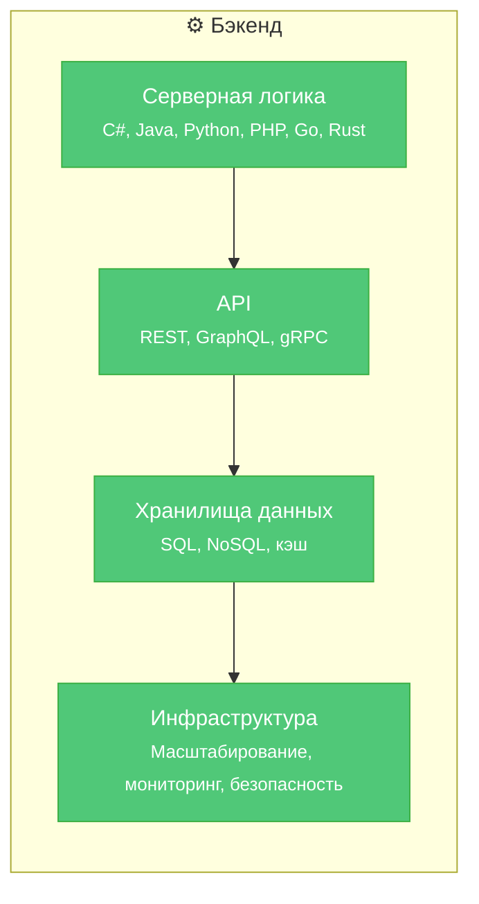

---
title: 1.23. Бэкенд
---

# 1.23. Бэкенд

## Бэкенд

★ **Серверная часть (Backend)** — невидимый для пользователя слой приложения, отвечающий за бизнес-логику, хранение и обработку данных, а также взаимодействие с внешними системами. В отличие от фронтенда, бэкенд не имеет визуального представления и реализуется на стороне сервера. Его корректная работа напрямую определяет функциональность, надёжность и производительность всего приложения.

Хотя пользователь взаимодействует только с интерфейсом — кнопками, формами, анимациями — реальная логика приложения выполняется на сервере. Фронтенд может быть технически оптимизирован до предела: сжатые ресурсы, эффективный рендеринг, кэширование на клиенте — однако если бэкенд медленно обрабатывает запросы, возвращает ошибки или не масштабируется под нагрузку, качество пользовательского опыта неизбежно падает. Таким образом, производительность фронтенда ограничена качеством серверной реализации.

Чтобы развернуть бэкенд-часть приложения, недостаточно просто скопировать файлы на сервер. Требуется:
- установка среды выполнения (например, .NET Runtime, JVM, Python interpreter);
- настройка зависимостей (пакетов, библиотек, переменных окружения);
- конфигурация подключения к базе данных и внешним сервисам;
- проверка корректности запуска и мониторинг работоспособности.

### Составляющие бэкенда

**1. Серверная логика**  
Реализуется на одном или нескольких языках программирования (C#, Java, Python, PHP, Go и др.). Отвечает за обработку входящих запросов, применение бизнес-правил, валидацию данных, взаимодействие с хранилищами и сторонними API. Архитектурно часто разделяется на слои:
- контроллеры (обработка HTTP-запросов),
- сервисы (реализация бизнес-логики),
- репозитории (абстракция над доступом к данным).

Такое разделение способствует тестируемости, поддерживаемости и соблюдению принципов SOLID.

**2. API (Application Programming Interface)**  
Интерфейс взаимодействия между клиентом и сервером, а также между микросервисами. Наиболее распространены:
- **REST** — архитектурный стиль, основанный на ресурсах и HTTP-методах;
- **GraphQL** — язык запросов, позволяющий клиенту точно определять структуру требуемых данных;
- **gRPC** — высокопроизводительный RPC-протокол на основе Protocol Buffers, часто используется во внутренних сервисах.

API должен обеспечивать:
- чёткую контрактность (версионирование, документирование, например, через OpenAPI);
- контроль доступа (аутентификация и авторизация: JWT, OAuth 2.0, OpenID Connect);
- валидацию входных данных и обработку ошибок.

**3. Хранилища данных**  
Бэкенд взаимодействует с различными типами хранилищ:
- **Реляционные СУБД** (PostgreSQL, MySQL, MS SQL Server) — обеспечивают строгую схему, ACID-транзакции, поддержку сложных запросов;
- **Документные и ключ-значение хранилища** (MongoDB, Redis, DynamoDB) — оптимизированы под гибкость схемы, горизонтальное масштабирование, высокую скорость записи/чтения;
- **Кэши** (Redis, Memcached) — используются для снижения нагрузки на основные БД и ускорения ответов.

Оптимизация работы с данными включает:
- проектирование нормализованной/денормализованной схемы;
- использование индексов;
- разграничение операций чтения и записи (CQRS);
- реализацию стратегий резервного копирования и восстановления.

**4. Инфраструктурная составляющая**  
Современный бэкенд редко существует как монолитный сервис на одном сервере. Даже в небольших проектах учитываются:
- **Масштабируемость** — возможность горизонтального (добавление инстансов) и вертикального (увеличение ресурсов) расширения;
- **Безопасность** — защита от инъекций (SQL, XSS), управление секретами, шифрование данных в покое и в передаче;
- **Надёжность** — обработка сбоев, повторные попытки (retry), circuit breaker;
- **Наблюдаемость** — логирование, метрики, трассировка запросов (например, через OpenTelemetry).

Хотя бэкенд-разработчик не обязан быть экспертом в DevOps, понимание основ CI/CD, контейнеризации (Docker), оркестрации (Kubernetes) и облачных платформ (AWS, Azure, GCP) существенно повышает эффективность работы.

