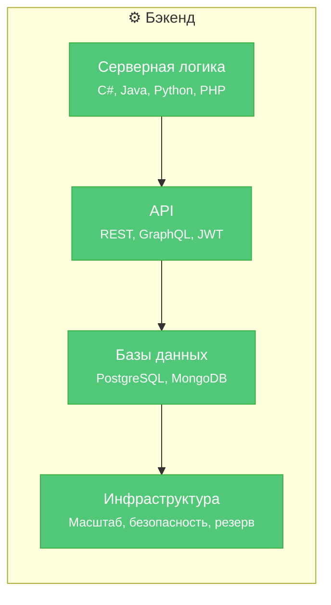

---
title: 1.23. Бэкенд
---

# 1.23. Бэкенд

## Бэкенд

★ **Серверная часть (Backend)** не видна, поэтому вы не сможете узнать, что происходит в настоящей, «скрытой» логике работы сайта. Бэкенд отвечает за базы данных, API, безопасность и основую логику.

Хотя пользователь видит только интерфейс — кнопки, анимации, картинки — настоящая «кухня» сайта скрыта за кулисами: в бэкенде. Именно серверная логика определяет, насколько быстро приложение отвечает на действия пользователя. Фронтенд может быть идеально оптимизирован: сжатые изображения, ленивая загрузка, мгновенный рендеринг — но если бэкенд медленно обрабатывает запросы, всё это теряет смысл. Скорость загрузки страницы, отзывчивость интерфейса, даже плавность переходов — всё упирается в то, как быстро сервер возвращает данные. Поэтому, работая над производительностью фронтенда, важно помнить: его эффективность напрямую зависит от того, насколько продуманно и быстро работает бэкенд — от оптимизации запросов и кэширования до балансировки нагрузки и архитектуры API.

Чтобы развернуть «бэк»-часть сайта, загрузить файлы недостаточно. Нужен полноценный процесс установки и проверки зависимостей, тестирования и конфигурации.

★ **Бэкенд-код (C#, Java, Python, PHP)** отвечает за обработку данных. Мы отдельно изучим все языки, отдельно рассмотрим особенности проектирования и архитектуры, так что на этом моменте останавливаться пока не будем. 

Как организовать работу бэкенд-кода? После определения архитектуры, организации инфраструктуры и начала разработки, определяется паттерн (шаблон) проекта, пишется код, который выполняет соответствующую обработку бизнес-логики. Существует множество практик для решения типовых задач, но требуется глубокое погружение во внутренности кода.

★ **База данных (PostgreSQL, MongoDB)** хранит информацию, и важно не просто её спроектировать, наполнить и администрировать, но и обеспечивать оптимизацию запросов (индексами, кэшированием, репликацией), обеспечивать гибкую миграцию и управление схемой, а также выполнять резервное копирование данных.

★ **API** – передача данных фронтенду, а также язык общения между сервисами. В зависимости от архитектуры, почти всегда присутствует интеграция – процесс обеспечения совместимости обмена данными, при котором определяется протокол, методы, способы, и всё это должно включать в себя использование механизмов аутентификации и авторизации (JWT, OAuth 2.0).

И если во фронтенде проблемы в основном с адаптивностью и выравниванием, то в бэкенде всё гораздо сложнее – производительность, безопасность, масштабируемость, а также согласованность данных – это требует особого подхода.
Важно: не стоит пугаться кучи технологий, так как это всё – совокупность работы десятков, а то и сотен человек, которые работают сообща, а каждый отвечает за определённую область. Поэтому «бэкендеру» не всегда понадобится, к примеру, разбираться в DevOps, но всё же ознакомиться хотя бы в общих чертах будет лишь плюсом.

