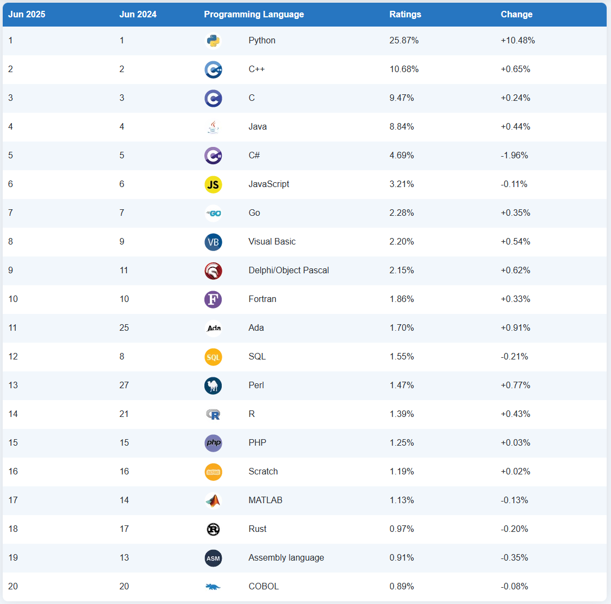

---
title: Основные языки
---

# Основные языки

  ДЛЯ НОВИЧКОВ
  НЕ ОБЯЗАТЕЛЬНО
  В РАЗРАБОТКЕ

Разработчику
Аналитику
Архитектору

## Основные языки

Сейчас давайте посмотрим, какие бывают языки программирования, не углубляясь в код - обзорно. Не каждому айтишнику нужно знать код, поэтому алгоритмы, терминал, фреймворки, структуры данных, асинхронность, понятие кода и все тонкости языков будет рассматривать отдельно. Чуть позднее мы отдельно рассмотрим конфигурационные форматы и основы базы данных.

Для начала нужно понять, а какие бывают языки, что за непонятные названия и как они вообще работают? Нам не нужно сейчас углубляться в особенности объектно-ориентированного программирования, изучать функции и методы.

Важный момент - не ведитесь на популисткие заявления или рассуждения на тему популярности языков, не пытайтесь «выбрать язык». Старайтесь учить сначала базовое программирование, затем объектно-ориентированные языки. Если планируете развиваться в IT, лучше изучать и фронт, и бэк, поэтому одними языками программирования не обойтись, понадобятся языки запросов, разметки и стилей.

К примеру, язык Python могут называть простым из-за лаконичности, но под поверхностью лежит ряд тонкостей: неочевидное поведение изменяемых значений по умолчанию, динамическая типизация, ленивые вычисления в генераторах, особенности области видимости (LEGB-правило), механизм дескрипторов, особенности работы с GIL в многопоточности и т.д. Эти аспекты требуют от разработчика глубокого понимания того, как устроен интерпретатор CPython и как реализованы базовые конструкции языка.

А уровень знания языка определяется глубиной понимания его парадигм и особенностей реализации, а также, разумеется, опытом. На практике всё определяется опытом решений - чем джун хуже сеньора? Тем, что опытный уже сталкивался с проблемами, знает как их решить, возможно сохранил себе код с вариантом решения, или имеет даже рабочие проекты. Опыт формирует у разработчика репертуар паттернов поведения, он понимает, какие последствия это повлечёт — с точки зрения производительности, читаемости, сопровождаемости, масштабируемости и совместимости. Различие между джуном и сеньором проявляется не столько в технической грамотности, сколько в глубине осмысления компромиссов. Младший разработчик может корректно реализовать алгоритм, но не всегда предвидит, как его решение поведёт себя при изменении контекста — например, при росте объёма данных, в многопоточной среде или при интеграции с внешними системами. Сеньор же, сталкиваясь с похожей проблемой ранее, обладает ментальной моделью возможных исходов и готов выбрать решение, минимизирующее риски. Кроме того, опыт позволяет эффективно использовать инструментарий: от отладки и профилирования до управления зависимостями и конфигурацией. Накопленные фрагменты рабочего кода, шаблоны архитектурных решений, знание «подводных камней» конкретной экосистемы (например, особенностей работы с асинхронностью в Python или управлением памятью в Java) — всё это составляет практическую компетентность, которую невозможно воспроизвести только чтением документации.

Есть разные индикаторы популярности языков, к примеру TIOBE:

https://www.tiobe.com/tiobe-index/

Там можно заметить немалый такой процент популярности языков Си, C++, Visual Basic, Delphi, и даже Fortran. Это старые языки, и у них процент ой какой большой. Поэтому, когда кто-то говорит о том, что язык устарел - можете показать пальцем на место «устаревших» языков в рейтинге.

Кроме того, не забывайте о факте перенасыщения рынка - если вы будете представителем популярного языка, значит вы будете представителем часто встречающихся конкурентов-специалистов, поэтому не нужно бежать за единственным Python, я бы порекомендовал Java, C#, Go, и JavaScript. Можно и C++, но там тоже специалистов довольно много, причём сильнейших. Узкие специалисты не нужны, нужны многопрофильные, которые смогут переключиться на новые технологии или вернуться к старым. Помните это.

Для долгосрочного развития рекомендуется овладеть как минимум одним языком из следующих групп:  
- **Системный/низкоуровневый**: C, C++  
- **Бизнес-приложения/экосистема**: Java, C#  
- **Веб и скриптовые задачи**: JavaScript, TypeScript  
- **Современные языки с акцентом на производительность и простоту**: Go, Rust  
- **Язык общего назначения с широким применением**: Python  

Отдельно рассматриваются языки запросов (SQL), разметки (HTML, XML), стилей (CSS) и конфигурационные форматы (YAML, JSON), но они выходят за рамки классического понимания «языков программирования».

Но давайте сделаем краткий обзор языков, а их отдельные тонкости рассмотрим потом.

---