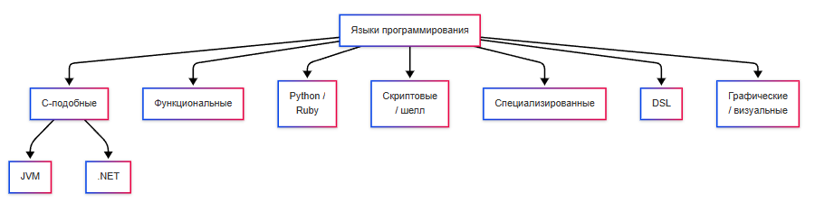
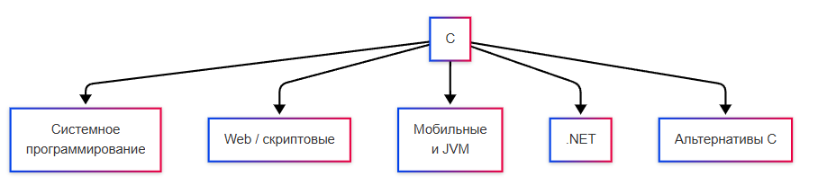

---
title: 1.24. Языки разметки
---

# 1.24. Языки разметки

## Языки разметки

**Языки разметки (Markup Languages)** используются для структурирования текста или данных, часто не являются полными языками программирования.

**Разметка** - это дополнительная информация, добавляемая к основному содержимому (текст или данные), чтобы указать:
	- структуру (что есть заголовок, абзац, список);
	- форматирование (жирный, курсив, цвет, размер шрифта);
	- семантику (значение - цитата, название, адрес);
	- поведение или связь с другими данными (гиперссылка, метаданные).

Например, эта статья написана при помощи разметки.

Если бы я не использовал разметку, то текст был бы сплошным:
```
Разметка - это дополнительная информация, добавляемая к основному содержимому (текст или данные), чтобы указать: структуру (что есть заголовок, абзац, список); форматирование (жирный, курсив, цвет, размер шрифта); семантику (значение - цитата, название, адрес); поведение или связь с другими данными (гиперссылка, метаданные).
```

Но мы разметили текст:

```markdown
**Разметка** - это дополнительная информация, добавляемая к основному содержимому (текст или данные), чтобы указать:
	- структуру (что есть заголовок, абзац, список);
	- форматирование (жирный, курсив, цвет, размер шрифта);
	- семантику (значение - цитата, название, адрес);
	- поведение или связь с другими данными (гиперссылка, метаданные).
```

Разметка не является частью самого содержания, а служит инструкцией для программ (браузеров, редакторов, компиляторов и др.) о том, как обрабатывать, отображать или интерпретировать это содержимое.

Разметка не содержит логики, ветвлений, циклов или вычислений, она декларативна, как и запросы. К примеру, если вы хотите, чтобы ваш текст имел красивое оформление, вы добавляете специальную информацию, которая позволит показать пользователю более структурный и оформленный итоговый вариант.

Языки разметки можно условно разделить на веб, документы и данные.


**HTML (HyperText Markup Language)** – язык разметки гипертекстовых документов, используемый для структурирования содержимого веб-страниц. Дата создания — 1993 год. Основными особенностями являются теговая структура, семантические элементы, интеграция с CSS и JavaScript. Работает в браузерах. Применяется во фронтенд-разработке как основа всех веб-сайтов. Один из самых популярных языков в мире.

```html
<!DOCTYPE html>
<html>
<head>
    <title>Пример страницы</title>
</head>
<body>
    <h1>Заголовок</h1>
    <p>Это абзац текста.</p>
</body>
</html>
```


**XML (eXtensible Markup Language)** – универсальный язык разметки для хранения и передачи структурированных данных. Дата создания — 1998 год. Основными особенностями являются самодостаточность, возможность определения собственных тегов, строгий синтаксис. Используется в конфигурационных файлах, веб-сервисах, документообороте. Широко используется в legacy-системах и протоколах обмена данными.

```xml
<book>
    <title>Война и мир</title>
    <author>Лев Толстой</author>
    <year>1869</year>
</book>
```

**YAML (YAML Ain't Markup Language)** – формат сериализации данных, часто используемый как альтернатива XML и JSON. Дата создания — 2001 год. Основными особенностями являются читаемость человеком, использование отступов, поддержка сложных структур. Используется в конфигурационных файлах, DevOps, CI/CD. Популярен в современных инфраструктурных проектах.

```yml
database:
  host: localhost
  port: 5432
  ssl: true
```

**Markdown** – легковесный язык разметки, предназначенный для форматирования текста. Дата создания — 2004 год. Основными особенностями являются простой синтаксис, легко преобразуется в HTML, поддерживается многими редакторами. Работает через интерпретаторы и парсеры. Применяется в документации, README-файлах, блогах. Очень популярен среди разработчиков и технических писателей.

```markdown
# Заголовок

Это **жирный текст** в абзаце.

- Пункт списка
- Ещё один пункт
```

**XAML (Extensible Application Markup Language)** – декларативный язык разметки для описания пользовательского интерфейса в экосистеме .NET. Дата создания — 2006 год. Основными особенностями являются связь с кодом C#, поддержка привязки данных, стилей и триггеров. Работает в WPF, UWP, Xamarin. Применяется в настольных и мобильных приложениях Windows.

```xml
<Grid>
    <TextBlock Text="Привет, мир!" FontSize="16" />
    <Button Content="Нажми меня" Click="OnButtonClick" />
</Grid>
```

**SVG (Scalable Vector Graphics)** – XML-базированный язык описания двумерной векторной графики. Дата создания — 2001 год. Основными особенностями являются масштабируемость, поддержка CSS и JS, совместимость с HTML. Работает в браузерах. Применяется в логотипах, иконках, динамической графике. Активно используется в веб-дизайне и анимации.

```xml
<svg width="100" height="100">
    <circle cx="50" cy="50" r="40" fill="blue" />
</svg>
```

**LaTeX** – система верстки документов, основанная на языке разметки. Дата создания — 1985 год (на основе TeX). Основными особенностями являются акцент на научных и технических публикациях, поддержка формул, автоматическая нумерация. Работает через компиляцию в PDF или другие форматы. Применяется в университетах, исследованиях, математике. Основной инструмент для подготовки научных работ.

```latex
\documentclass{article}
\begin{document}
\section{Введение}
Формула: $E = mc^2$
\end{document}
```

**JSON (JavaScript Object Notation)** – формат обмена данными, часто используемый в веб-приложениях. Дата создания — около 2001 года. Основными особенностями являются структурированность, читаемость, поддержка большинством языков программирования. Используется как формат данных, но иногда относится к языкам разметки условно. Стандарт для API-ответов и клиент-серверного взаимодействия.

```json
{
  "name": "Тимур",
  "age": 30,
  "skills": ["C#", "Python", "JS"]
}
```

**RTF (Rich Text Format)** – формат разметки для представления документов с форматированием. Дата создания — 1987 год (Microsoft). Основными особенностями являются поддержка шрифтов, цветов, списков, таблиц. Работает в текстовых редакторах. Применялся в ранних офисных приложениях. Устаревающий, но до сих пор встречается в legacy-документах.

```
{\rtf1\ansi
{\fonttbl{\f0 Arial;}}
\pard\f0\fs24 \b Жирный текст\b0 
и обычный.
}
```

**Wiki markup** – упрощённый язык разметки, используемый в вики-движках. Дата появления — 2001 год (Wikipedia). Основными особенностями являются минимальный синтаксис, удобство редактирования, поддержка ссылок и заголовков. Работает в системах управления вики-контентом. Применяется в вики-движках, таких как MediaWiki, DokuWiki.

```
== Заголовок ==
Это ''курсив'' и ссылка на [[Главная страница]].

* Элемент списка
* Другой элемент
```

## Языки стилей

**Языки стилей (Style Sheet Languages)** определяют внешний вид и оформление содержимого, описанного на языке разметки.

Стиль регулирует цвет текста, размер шрифта, расположение на странице, рамки, тени, отступы, поведение при наведении. Если разметка лишь определяет структуру - заголовки, абзацы, списки, то стиль определяет, что заголовок будет именно синим, увеличенным и расположенным по центру с желтым фоном. Это как расширение разметки за счёт добавления визуального оформления. 


**CSS (Cascading Style Sheets)** – язык таблиц стилей, определяющий внешний вид и оформление документов, написанных на языках разметки, таких как HTML. Дата создания — 1996 год. Основными особенностями являются каскадность, поддержка селекторов, модульное развитие через версии CSS2, CSS3 и т. д. Работает в браузерах. Применяется в веб-разработке для оформления сайтов и приложений. Один из ключевых технологий современного интернета.

```css
h1 {
    color: #333;
    font-size: 24px;
    margin-bottom: 16px;
}
```

**Sass / SCSS** – препроцессор CSS, добавляющий переменные, вложенные правила, миксины и другие удобства. Sass создан в 2006 году, SCSS — это его синтаксический вариант с совместимостью CSS. Основными особенностями являются расширяемость, поддержка условий и функций. Работает через компиляцию в обычный CSS. Применяется в масштабных проектах для упрощения управления стилями. Широко используется в профессиональной фронтенд-разработке.

```css
$primary-color: #007BFF;

.card {
    border: 1px solid #ddd;
    border-radius: 8px;
    
    &__title {
        color: $primary-color;
        font-weight: bold;
    }
}
```


**LESS** – ещё один препроцессор CSS, предоставляющий переменные, миксины, операции и вложенные правила. Дата создания — 2009 год. Основными особенностями являются JavaScript-базовая реализация, простота освоения, интеграция с популярными фреймворками. Работает через интерпретатор или компилятор. Применяется в веб-проектах, где нужна гибкость стилей. Популярен среди разработчиков, особенно в сочетании с Bootstrap.

```css
@link-color: #1a73e8;

a {
    color: @link-color;
    
    &:hover {
        color: darken(@link-color, 10%);
    }
}
```

**Stylus** – гибкий препроцессор CSS с минимальным синтаксисом и мощными возможностями. Дата создания — 2010 год. Основными особенностями являются отсутствие необходимости в скобках и точках с запятой, поддержка JavaScript-выражений. Работает через компиляцию. Применяется в небольших и средних веб-проектах, где важна скорость написания кода и читаемость. Менее популярен, чем Sass или LESS, но остаётся актуальным в нишевых проектах.

```
primary = #0056b3

button
    padding 10px 15px
    background-color primary
    border none
    rounded()
        border-radius 4px
    rounded()
```

**XSLT (Extensible Stylesheet Language Transformations)** – язык преобразования XML-документов, в том числе в HTML и другие форматы. Дата создания — 1999 год. Основными особенностями являются работа с деревом XML, шаблонная система, использование XPath. Работает через XSLT-процессоры. Применяется в системах обработки данных, документообороте, legacy-веб-приложениях. Используется там, где нужно конвертировать XML в представимый формат.

```xml
<xsl:stylesheet version="1.0" xmlns:xsl="http://www.w3.org/1999/XSL/Transform">
    <xsl:template match="/">
        <html>
            <body>
                <h2>Список книг</h2>
                <ul>
                    <xsl:for-each select="catalog/book">
                        <li><xsl:value-of select="title"/></li>
                    </xsl:for-each>
                </ul>
            </body>
        </html>
    </xsl:template>
</xsl:stylesheet>
```

**FXML** – язык разметки пользовательского интерфейса для JavaFX. Дата появления — 2008 год. Основными особенностями являются декларативное описание UI, связь с контроллерами на Java, поддержка стилей и анимаций. Работает в экосистеме JavaFX. Применяется в настольных Java-приложениях для создания графического интерфейса. Альтернатива программному созданию UI в Java.

```xml
<?import javafx.scene.control.*?>
<?import javafx.scene.layout.*?>

<VBox xmlns="http://javafx.com/javafx">
    <Label text="Добро пожаловать!" />
    <Button text="Нажми меня" onAction="#handleButtonClick" />
</VBox>
```

## Языки программирования

Языки программирования являются самой большой группой, которую лучше разделить на семейства, основываясь на общих чертах, происхождении, парадигмах и экосистеме.



### Семейство Си




**C (Си)** – процедурный язык программирования, один из первых универсальных языков. Дата создания — 1972 год. Основными особенностями являются низкоуровневый доступ к памяти, минимальная абстракция от аппаратного уровня и отсутствие встроенной поддержки ООП. Компилируется в машинный код, использует стек, кучу, регистры напрямую, поддерживает указатели. Применяется в операционных системах, драйверах, встраиваемых системах и компиляторах других языков. Широко используется в системном программировании, поддерживается большинством архитектур процессоров.

```c
#include <stdio.h>

int main() {
    printf("Hello, World!\n");
    return 0;
}
```

**D** - системный язык программирования, сочетающий возможности C++ и Python. Дата создания — 2001 год. Основными особенностями являются поддержка нескольких парадигм (процедурное, ООП, функциональное), автоматическое управление памятью с возможностью ручного контроля, метапрограммирование. Компилируется в нативный код, может использовать GC или работать без него. Применяется в системном программировании, высокопроизводительных приложениях и игровых движках. Является нишевым языком, популярен среди энтузиастов, но не получил массового распространения.

```d
import std.stdio;

void main() {
    writeln("Hello, World!");
}
```

**C++** - объектно-ориентированный язык программирования, расширяющий возможности C. Дата создания — 1985 год. Основными особенностями являются поддержка ООП, шаблонов, перегрузки операторов, возможность разработки на разных уровнях абстракции. Компилируется в нативный код, полностью совместим с C. Применяется в играх, высокопроизводительных приложениях, операционных системах. Один из самых популярных языков в мире, активно развивается.

```cpp
#include <iostream>
int main() {
    std::cout << "Hello, World!" << std::endl;
    return 0;
}
```


**C#** – объектно-ориентированный язык программирования, работающий на платформе .NET. Дата создания — 2000 год. Основными особенностями являются управляемая среда выполнения, автоматическое управление памятью, поддержка LINQ, async/await, generics. Компилируется в промежуточный байт-код (IL), исполняемый CLR. Применяется в Windows-приложениях, серверных приложениях (ASP.NET) и играх (Unity). Широко используется в корпоративной разработке, активно развивается Microsoft.

```csharp
using System;

class Program {
    static void Main() {
        Console.WriteLine("Hello, World!");
    }
}
```

**Java** – объектно-ориентированный язык программирования, работающий на виртуальной машине Java (JVM). Дата создания — 1995 год. Основными особенностями являются "Write once, run anywhere" через JVM, строгая типизация, автоматическое управление памятью. Компилируется в байт-код, исполняемый JVM. Применяется в Android-приложениях, корпоративных системах и серверных приложениях. Один из самых популярных языков программирования, активно используется в enterprise.

```java
public class HelloWorld {
    public static void main(String[] args) {
        System.out.println("Hello, World!");
    }
}
```

**JavaScript** – язык программирования, изначально предназначенный для клиентской логики в браузерах. Дата создания — 1995 год. Основными особенностями являются прототипное ООП, однопоточность с событийным циклом, динамическая типизация. Интерпретируется или компилируется движками (V8, SpiderMonkey), работает в браузере и на сервере (Node.js). Применяется во фронтенд-разработке, backend-разработке (Node.js) и мобильных приложениях (React Native). Один из самых популярных языков в мире, основа современного веба.

```JavaScript
console.log("Hello, World!");
```

**Objective-C** – объектно-ориентированный язык программирования, расширяющий C синтаксисом Smalltalk. Дата создания — 1984 год. Основными особенностями являются сообщения вместо вызовов методов, интеграция с Cocoa-фреймворками Apple. Компилируется в нативный код. Применялся в iOS- и macOS-приложениях до появления Swift. Устаревающий язык, встречается в legacy-проектах Apple.

```cpp
#import <Foundation/Foundation.h>

int main() {
    NSLog(@"Hello, World!");
    return 0;
}
```

**Swift** – современный язык программирования для экосистемы Apple. Дата создания — 2014 год. Основными особенностями являются современный синтаксис, безопасность типов, поддержка функциональных подходов. Компилируется LLVM в нативный код. Применяется в iOS-, macOS-, watchOS-, tvOS-приложениях. Официальный язык Apple, активно развивается и поддерживается.

```swift
print("Hello, World!")
```

**Kotlin** – современный язык программирования, работающий на JVM и Android. Дата создания — 2011 год. Основными особенностями являются совместимость с Java, null-safety, поддержка функционального программирования. Компилируется в байт-код JVM, также может компилироваться в JavaScript и нативный код. Применяется в Android-разработке, backend-разработке и мультиплатформенных проектах. Рекомендован Google как основной язык для Android, активно развивается.

```kotlin
fun main() {
    println("Hello, World!")
}
```

**Go (Golang)** – язык программирования общего назначения с фокусом на простоту и производительность. Дата создания — 2009 год. Основными особенностями являются гарантированная совместимость API, горутины для параллельности, отказ от сложных механизмов ООП. Компилируется в нативный код, имеет свой сборщик мусора. Применяется в микросервисах, DevOps-инструментах и CLI-утилитах. Широко используется в облачных сервисах, активно развивается сообществом и Google.

```go
package main

import "fmt"

func main() {
    fmt.Println("Hello, World!")
}
```

**Rust** – современный безопасный системный язык программирования. Дата создания — 2010 год. Основными особенностями являются безопасность памяти без сборщика мусора, строгий контроль за владением данными, отсутствие нулевых указателей и дата-рейсов. Компилируется в нативный код через LLVM. Применяется в системном программировании, веб-движках (например, Firefox) и блокчейне. Быстро набирает популярность, поддерживается крупными компаниями.

```rust
fn main() {
    println!("Hello, World!");
}
```

**PHP** – язык программирования, изначально созданный для генерации HTML на стороне сервера. Дата создания — 1995 год. Основными особенностями являются встроенная поддержка HTTP, лёгкий вход в веб-разработку, динамическая типизация. Интерпретируется через Zend Engine. Применяется в веб-сайтах и CMS (WordPress, Drupal), а также в API-серверах. Широко используется в вебе, особенно в малом бизнесе, активно развивается (PHP 8).

```php
<?php
echo "Hello, World!\n";
?>
```

**Zig** - современный язык программирования, рассматривающийся как потенциальная замена C. Дата создания — 2015 год. Основными особенностями являются отсутствие сборщика мусора, отсутствие скрытого аллокатора, полная совместимость с C. Компилируется в нативный код. Применяется в системном программировании, эмбеддинге и как альтернатива C. Экспериментальный, но быстро растёт, перспективный кандидат на замену C.

```
const std = @import("std");

pub fn main() !void {
    const stdout = std.io.getStdOut().writer();
    try stdout.print("Hello, World!\n", .{});
}
```

**Carbon** - экспериментальный язык программирования, рассматриваемый как потенциальное будущее C++. Дата создания — 2022 год. Основными особенностями являются совместимость с C++, современный синтаксис, поддержка новых парадигм. Разрабатывается на основе LLVM. Применяется в системном программировании, потенциальная замена C++. Находится на очень ранней стадии развития, пока не готов к массовому использованию.

```
package sample api;

fn Main() -> i32 {
  Print("Hello, World!\n");
  return 0;
}
```

### Функциональные языки

Акцент на функциях как строительных блоках программы. Эти языки часто используются в научной среде, финансах, системах с высокой логической сложностью.

**Haskell** – чисто функциональный язык программирования с ленивыми вычислениями и статической типизацией. Дата создания — 1990 год (стандарт опубликован, хотя развитие началось ранее). Основными особенностями являются отсутствие побочных эффектов, поддержка монад, мощная система типов. Работает как интерпретируемый или компилируемый через GHC. Применяется в научной сфере, финансовых системах и образовании. Используется в нишевых проектах, ценится за безопасность и выразительность.

```
main :: IO ()
main = putStrLn "Hello, World!"
```

**F#** –  функциональный язык программирования, работающий на платформе .NET. Дата создания — 2005 год. Основными особенностями являются поддержка функционального и объектно-ориентированного программирования, вывод типов, интерактивная среда FSI. Компилируется в байт-код .NET, работает на всех платформах .NET. Применяется в анализе данных, финансовых вычислениях и инженерных задачах. Активно развивается Microsoft, используется в корпоративной разработке.

```fsharp
printfn "Hello, World!"
```

**Scala** – гибридный язык программирования, сочетающий ООП и функциональное программирование. Дата создания — 2004 год. Основными особенностями являются совместимость с Java, мощная система типов, поддержка неявных преобразований и паттерн-матчинга. Компилируется в байт-код JVM. Применяется в распределённых системах, обработке больших данных (Apache Spark), backend-разработке. Широко используется в enterprise и big data, имеет большую экосистему.

```scala
object HelloWorld extends App {
  println("Hello, World!")
}
```

**Clojure** – диалект Lisp, работающий на JVM. Дата создания — 2007 год. Основными особенностями являются иммутабельные структуры данных, REPL-ориентированная разработка, макросы. Компилируется в байт-код JVM, также поддерживает JavaScript и .NET. Применяется в высоконагруженных системах, веб-разработке и аналитике. Популярен среди разработчиков, ценящих выразительность и мощь Lisp.

```clojure
(println "Hello, World!")
```

**OCaml** – строго типизированный функциональный язык программирования с возможностью императивного программирования. Дата создания — 1996 год. Основными особенностями являются вывод типов, статическая типизация, модульная система. Компилируется в нативный код или байт-код. Применяется в академической среде, верификации программ, финансовой сфере и компиляторостроении. Используется в проектах, где важна надёжность и производительность.

```
print_endline "Hello, World!"
```

**Elm** – чисто функциональный язык программирования для фронтенд-разработки. Дата создания — 2012 год. Основными особенностями являются отсутствие ошибок выполнения, модель «театр одного актёра», декларативный подход к UI. Компилируется в JavaScript. Применяется в разработке пользовательских интерфейсов в браузере. Популярен среди разработчиков, ценящих предсказуемость и стабильность.

```
module Main exposing (main)

import Html exposing (text)

main =
    text "Hello, World!"
```

**Erlang / Elixir** – функциональные языки, ориентированные на высокую доступность и параллелизм. Erlang создан в 1986 году, Elixir — в 2011 году. Основными особенностями являются легковесные процессы, отказоустойчивость, асинхронность, распределённость. Erlang компилируется в байт-код BEAM-машины, Elixir транслируется в Erlang. Применяются в телекоммуникациях, мессенджерах, распределённых системах. Erlang остаётся актуальным в legacy-системах, Elixir активно развивается в web и микросервисных архитектурах.

Erlang
```
-module(hello).
-export([start/0]).

start() ->
    io:format("Hello, World!~n").
```

Elixir

```
IO.puts "Hello, World!"
```


### JVM-языки

Языки, работающие на Java Virtual Machine. Все они могут взаимодействовать между собой внутри одной JVM. Конечно же, в первую очередь это Java. Также на JVM работают Clojure, Kotlin, Scala. 

**Groovy** – динамический язык программирования для JVM с синтаксисом, похожим на Java. Дата создания — 2003 год. Основными особенностями являются скриптовые возможности, динамическая типизация, интеграция с Java, поддержка DSL. Компилируется в байт-код JVM. Применяется в автоматизации, тестировании, DevOps и фреймворках (например, Gradle, Grails). Используется там, где нужна гибкость и быстрая разработка поверх Java.

```java
println "Hello, World!"
```

### .NET-языки

Языки, работающие на платформе .NET. Активно используются в Windows-приложениях, сервисах, корпоративных системах. C#, F# являются основными языками на .NET.

**VB.NET** – объектно-ориентированный язык программирования, являющийся продолжением Visual Basic. Дата создания — 2002 год. Основными особенностями являются простота освоения, поддержка событийно-ориентированного программирования, полная совместимость с .NET. Компилируется в байт-код .NET. Применяется в legacy-проектах, созданных в эпоху доминирования Visual Basic. Мало используется в новых проектах, поддерживается Microsoft, но развитие ограничено.

```
Module Program
    Sub Main()
        Console.WriteLine("Hello, World!")
    End Sub
End Module
```

### Python / Ruby-экосистема

Динамические, удобные для разработки, обучения и автоматизации. Просты в освоении, популярны среди новичков и аналитиков. Groovy тоже относится к таким языкам.

**Python** – интерпретируемый язык программирования с динамической типизацией и акцентом на читаемость кода. Дата создания — 1991 год. Основными особенностями являются простой синтаксис, богатая стандартная библиотека, поддержка множества парадигм (процедурное, ООП, функциональное). Работает через интерпретатор, может использоваться с JIT-компиляцией (например, PyPy). Применяется в анализе данных, машинном обучении, автоматизации, веб-разработке, научных вычислениях. Один из самых популярных языков в мире, активно развивается и поддерживается сообществом.

```python
print("Hello, World!")
```

**Ruby** – динамический объектно-ориентированный язык программирования с акцентом на простоту и продуктивность. Дата создания — 1995 год. Основными особенностями являются гибкий синтаксис, мощные DSL, философия "Программист счастлив". Работает через интерпретатор или виртуальную машину (MRI, JRuby). Применяется во фронтенд- и backend-разработке, особенно популярен благодаря фреймворку Ruby on Rails. Имел пик популярности в 2000-х, сейчас менее распространён, но остаётся актуальным в legacy-проектах и нишевых средах.

```
puts "Hello, World!"
```

**Lua** – легковесный встраиваемый скриптовый язык программирования. Дата создания — 1993 год. Основными особенностями являются минимальное потребление ресурсов, простота интеграции в другие языки, гибкость. Работает через виртуальную машину с JIT-компиляцией (LuaJIT). Применяется в играх (например, World of Warcraft), системах встраивания, роутерах, плагинах. Популярен в embedded-системах и игровой разработке.

```lua
print("Hello, World!")
```

**Julia** –  высокопроизводительный язык программирования для научных вычислений и анализа данных. Дата создания — 2012 год. Основными особенностями являются скорость, близкая к C, поддержка многозадачности, динамическая типизация с возможностью аннотаций. Компилируется в LLVM-промежуточный код. Применяется в математике, статистике, машинном обучении, моделировании. Активно развивается, становится популярным в научном сообществе.

```java
println("Hello, World!")
```

**R** – язык программирования и окружение для статистического анализа и визуализации данных. Дата создания — 1993 год. Основными особенностями являются специализация на статистике, богатые графические возможности, широкий набор пакетов. Работает через интерпретатор. Применяется в науке, экономике, медицине, бизнес-аналитике. Один из ключевых инструментов в data science, сохраняет высокую актуальность в этой области.

```
cat("Hello, World!\n")
```

**Smalltalk** – чисто объектно-ориентированный язык программирования, оказавший влияние на многие современные языки. Дата создания — 1972 год (первые версии), коммерческий выпуск — 1980-е. Основными особенностями являются всё является объектом, динамическая типизация, интегрированная среда разработки. Работает в виртуальной машине. Применялся в ранних GUI-приложениях, обучении, прототипировании. Устаревающий, но остаётся важным исторически и используется в нишевых проектах.

```
Transcript show: 'Hello, World!'; cr.
```

**Lisp** – один из старейших языков программирования, основанный на обработке символьных выражений. Дата создания — 1958 год. Основными особенностями являются макросы, homoiconicity, функциональная природа. Работает через интерпретатор или компилятор. Применялся в искусственном интеллекте, исследовательском программировании, создании DSL. Встречается в академической среде и нишевых проектах, остаётся важным для понимания программирования.

```lisp
(format t "Hello, World!~%")
```

**Perl** – скриптовый язык общего назначения с акцентом на обработку текста. Дата создания — 1987 год. Основными особенностями являются мощные регулярные выражения, гибкий синтаксис, богатая библиотека CPAN. Работает через интерпретатор. Применялся в системном администрировании, CGI-скриптах, парсинге данных. Был очень популярен в 1990–2000-х, сейчас утратил большую часть аудитории, но остаётся в legacy-системах и скриптах.

```
print "Hello, World!\n";
```

### Скриптовые и шелл-языки

Эти языки помогают писать сценарии автоматизации, а также применяются в специализированных сферах вроде DevOps, администрирование.

**Bash / Shell Scripting** – язык командной строки Unix-подобных систем. Дата создания — 1989 год (Bash). Основными особенностями являются управление процессами, работа с файлами и потоками, автоматизация задач. Выполняется через интерпретатор оболочки. Применяется в системном администрировании, DevOps, автоматизации развёртывания и рутинных задач. Один из самых популярных скриптовых инструментов в мире Linux.

```bash
#!/bin/bash
echo "Hello, World!"
```

**PowerShell** – объектно-ориентированная оболочка и язык сценариев от Microsoft. Дата создания — 2006 год. Основными особенностями являются работа с объектами, а не текстом, глубокая интеграция с Windows, поддержка .NET. Работает через интерпретатор. Применяется в администрировании Windows, автоматизации задач, DevOps. Стандарт для управления Windows-инфраструктурой, также доступен на Linux и macOS.

```bash
Write-Host "Hello, World!"
```

**VBScript** – легковесный скриптовый язык от Microsoft, основанный на Visual Basic. Дата создания — 1996 год. Основными особенностями являются простота освоения, поддержка событий, интеграция с Windows. Работает через интерпретатор. Применялся в старых веб-приложениях, автоматизации Windows и устаревших корпоративных приложениях. Устаревающий, заменяется PowerShell и другими технологиями.

```
WScript.Echo "Hello, World!"
```

**AWK / Sed** – утилиты командной строки для обработки текстовых данных. AWK создан в 1977 году, Sed — в 1979 году. Основными особенностями являются мощные возможности фильтрации и преобразования текста, регулярные выражения. Работают как интерпретируемые утилиты. Применяются в анализе логов, парсинге, конвейерной обработке данных. Входят в стандартный набор Unix-инструментов, остаются актуальными в shell-автоматизации.

AWK
```
BEGIN { print "Hello, World!" }
```

Sed
```
i\Hello, World!
```

**Makefile syntax** – декларативный язык описания зависимостей и правил сборки проектов. Дата создания — 1976 год (первая реализация make). Основными особенностями являются описание целей и зависимостей, поддержка макросов и условий. Используется вместе с утилитой make. Применяется в автоматизации компиляции программ, особенно в C/C++. Основа многих систем сборки, до сих пор используется в open source и embedded разработке.

```
hello:
	@echo "Hello, World!"
```

**AutoHotKey / AutoIt** – языки автоматизации действий пользователя в Windows. AutoHotKey создан в 2003 году, AutoIt — в 1999 году. Основными особенностями являются эмуляция клавиш и мыши, автоматизация GUI, создание горячих клавиш. Работают как интерпретируемые скрипты. Применяются в автоматизации рабочих процессов, тестировании, рутинных задачах. Популярны среди пользователей, не являющихся профессиональными разработчиками.

AutoHotKey
```
MsgBox, Hello, World!
```

AutoIt
```
MsgBox(0, "Greeting", "Hello, World!")
```


### Специализированные языки

Созданы для конкретных задач или ниш. В основном это старые языки. К специализированным можно отнести также R и Julia.

**Fortran** – один из первых языков программирования, ориентированный на научные и инженерные вычисления. Дата создания — 1957 год. Основными особенностями являются высокая производительность на численных задачах, поддержка массивов и математических операций. Компилируется в нативный код. Применяется в физике, аэродинамике, климатическом моделировании, финансовой аналитике. До сих пор используется в legacy-научных проектах и HPC (высокопроизводительных вычислениях).

```fortran
program hello
    print *, 'Hello, World!'
end program hello
```

**COBOL** – язык программирования, предназначенный для бизнес-приложений и финансовых систем. Дата создания — 1959 год. Основными особенностями являются читаемость кода, ориентация на обработку данных, устойчивость к ошибкам. Компилируется в машинный или байт-код. Применяется в банках, правительствах, страховых компаниях. Огромное количество legacy-систем до сих пор работает на COBOL, требует поддержки и модернизации.

```cobol
IDENTIFICATION DIVISION.
PROGRAM-ID. HELLO-WORLD.
PROCEDURE DIVISION.
    DISPLAY 'Hello, World!'.
    STOP RUN.
```

**Prolog** – язык логического программирования, основанный на формальных правилах и фактах. Дата создания — 1972 год. Основными особенностями являются дедуктивный подход, рекурсия, паттерн-матчинг. Работает через интерпретатор или компилятор. Применяется в искусственном интеллекте, экспертных системах, логических задачах. Активно используется в академической среде и нишевых приложениях.

```
:- initialization(main).
main :-
    write('Hello, World!'), nl,
    halt.
```

**Verilog / VHDL** – языки описания аппаратуры, используемые для проектирования цифровых схем. Verilog создан в 1984 году, VHDL — в 1983 году. Основными особенностями являются возможность моделирования поведения и структуры схем, симуляция работы чипов. Работают через специализированные симуляторы и синтезаторы. Применяются в разработке FPGA, ASIC, процессоров. Ключевые инструменты в области hardware engineering.

Verilog
```
module hello();
    initial begin
        $display("Hello, World!");
        $finish;
    end
endmodule
```

VHDL
```
entity hello is
end entity;

architecture behavior of hello is
begin
    process
    begin
        report "Hello, World!";
        wait;
    end process;
end architecture;
```


**Solidity** – язык программирования для написания смарт-контрактов в блокчейне Ethereum. Дата создания — 2014 год. Основными особенностями являются поддержка контрактов, ограниченная вычислительная модель (EVM), строгие ограничения на безопасность. Компилируется в байт-код виртуальной машины Ethereum. Применяется в децентрализованных приложениях (dApps), финансе (DeFi), NFT. Быстро развивается в экосистеме блокчейн-технологий.

```
// SPDX-License-Identifier: MIT
pragma solidity ^0.8.0;

contract HelloWorld {
    function greet() public pure returns (string memory) {
        return "Hello, World!";
    }
}
```

**GDScript** – скриптовый язык, разработанный специально для игрового движка Godot. Дата создания — 2014 год. Основными особенностями являются Python-подобный синтаксис, тесная интеграция с движком, оптимизация под игры. Работает через виртуальную машину Godot. Применяется в 2D и 3D-играх, особенно indie-проектах. Является основным языком Godot, быстро набирает популярность среди независимых разработчиков.

```
extends Node

func _ready():
    print("Hello, World!")
```

**GLSL / HLSL** – языки шейдеров для программирования графического конвейера GPU. GLSL создан в 2004 году, HLSL — в 2002 году. Основными особенностями являются работа с вершинами, фрагментами, текстурами, параллелизм на уровне GPU. Компилируются в промежуточный код GPU. Применяются в играх, 3D-графике, визуальных эффектах. Необходимы для современной графической разработки. 

GLSL (OpenGL Shading Language)
```
#version 330 core
void main() {
    gl_FragColor = vec4(1.0, 1.0, 1.0, 1.0); // Белый цвет
}
```

HLSL (High-Level Shading Language)
```
float4 main() : SV_Target {
    return float4(1.0, 1.0, 1.0, 1.0); // Белый цвет
}
```


**MATLAB / Octave** – языки и среды для численных вычислений, анализа данных и моделирования. MATLAB создан в 1984 году, Octave — в 1993 году. Основными особенностями являются матричная ориентация, богатые библиотеки, встроенная визуализация. Работают через интерпретатор. Применяются в инженерии, физике, образовании, исследовательской работе. MATLAB — коммерческий продукт, Octave — его бесплатная альтернатива.

MATLAB
```
disp('Hello, World!')
```

Octave
```
printf("Hello, World!\n");
```


### DSL

DSL, или **Domain Specific Languages** - это языки, встроенные в другие системы. 

**VBA (Visual Basic for Applications)** – встроенный язык макросов, используемый в приложениях Microsoft Office. Дата создания — 1993 год. Основными особенностями являются тесная интеграция с Excel, Word, Access, поддержка COM-объектов. Работает через интерпретатор. Применяется для автоматизации офисных задач, обработки данных в Excel, создания пользовательских функций. Широко используется в корпоративной среде, особенно в legacy-системах. 

```
Sub HelloWorld()
    MsgBox "Hello, World!"
End Sub
```

**MQL (MetaQuotes Language)** – язык программирования для автоматической торговли на финансовых рынках. Существует в двух версиях: MQL4 и MQL5. Дата создания — начало 2000-х. Основными особенностями являются работа с котировками, графиками, таймерами, событиями. Работает внутри платформ MetaTrader 4 и 5. Применяется для написания торговых советников и скриптов. Активно используется частными трейдерами и алгоритмическими системами.

```
int OnStart() {
   Print("Hello, World!");
   return(0);
}
```

**Regular Expressions (RegEx)** – регулярные выражения, формальный язык описания шаблонов строк текста. Дата возникновения — 1950-е (теоретическая основа), широкое применение — с 1970-х. Основными особенностями являются мощные средства поиска, замены, проверки формата. Поддерживается большинством языков программирования и утилит. Применяется в валидации данных, парсинге логов, поиске текста. Универсальный инструмент в любом виде разработки.

```
^[\w\.-]+@[\w\.-]+\.\w{2,}$
```

**Excel формулы** – встроенный язык выражений для вычислений в электронных таблицах. Дата появления — 1979 год (VisiCalc), активное развитие — с появления Excel в 1985 году. Основными особенностями являются простота освоения, работа с ячейками, диапазонами, встроенными функциями. Работает через интерпретатор Excel. Применяется в бухгалтерии, финансовом анализе, бизнес-планировании. Один из самых массовых "языков программирования" в мире.

```
=ЕСЛИ(A1>10; "Больше 10"; "Меньше или равно")
```

**ReactiveX / RxJS** – DSL для реактивного программирования, основанный на наблюдаемых потоках данных. ReactiveX создан в 2012 году (Microsoft), RxJS — его реализация на JavaScript. Основными особенностями являются работа с асинхронными потоками, операторы map/filter/merge, обработка ошибок. Работает через библиотеки (например, RxJS, RxJava). Применяется в клиентских и серверных приложениях, где важна реакция на события в реальном времени.

```
import { of } from 'rxjs';
import { map, filter } from 'rxjs/operators';

of(1, 2, 3, 4, 5)
  .pipe(
    filter(x => x % 2 === 0),
    map(x => x * 2)
  )
  .subscribe(result => console.log(result));
// Вывод: 4, 8
```

**Язык 1С, или базовый сценарий программирования (БСП)** - встроенный язык программирования, используемый в платформе 1С:Предприятие, высокоуровневый и ориентированный на разработку приложений в рамках платформы 1С. Поддерживает как процедурный, так и объектно-ориентированный подход. Имеет встроенные механизмы работы с БД, документами, регистрами, отчётами. Он очень похож на обычный алгоритмический язык за счёт русскоязычных ключевых слов, вроде «Процедура НайтиНоменклатуру()».

```
Процедура НайтиНоменклатуру(Товар)
	Найдено = Ложь;
	Для Каждого СтрокаТаблицы Из ТаблицаНоменклатуры Цикл
		Если СтрокаТаблицы.Наименование = Товар Тогда
			Найдено = Истина;
			Сообщить("Товар найден: " + Товар);
		КонецЕсли;
	КонецЦикла;
КонецПроцедуры
```

## Графические / визуальные языки

Графические и визуальные языки упрощают обучение и визуальное представление алгоритмов.

**Scratch** – визуальный язык программирования для обучения детей и новичков. Дата создания — 2003 год (MIT Media Lab). Основными особенностями являются блочное программирование, перетаскивание команд, визуальная логика. Работает в браузере или через отдельную среду. Применяется в образовании, школах, курсах для начинающих. Популярен как первый шаг в программировании.

**Blockly** – графический редактор кода от Google, позволяющий создавать визуальные интерфейсы для написания программ. Дата создания — 2011 год. Основными особенностями являются drag-and-drop блоков, генерация кода на других языках (JavaScript, Python и др.), возможность кастомизации. Работает в браузере. Применяется в образовательных проектах, играх, инструментах для детей и не-программистов.

**LabVIEW** – графическая среда разработки и язык программирования от National Instruments. Дата создания — 1986 год. Основными особенностями являются программирование на основе диаграмм (dataflow), интеграция с оборудованием, визуализация данных. Работает через собственную среду. Применяется в научных исследованиях, тестировании оборудования, промышленной автоматизации. Используется в инженерии и лабораториях.

**No-code / Low-code** – визуальные среды для создания приложений без или с минимальным программированием. Дата появления — конец 2000-х — начало 2010-х. Основными особенностями являются drag-and-drop элементов, визуальные триггеры, интеграции с API. Работают через облачные или локальные платформы. Применяются в быстрой разработке MVP, внутренних инструментах, автоматизации процессов. Активно развиваются в enterprise и стартапах.


