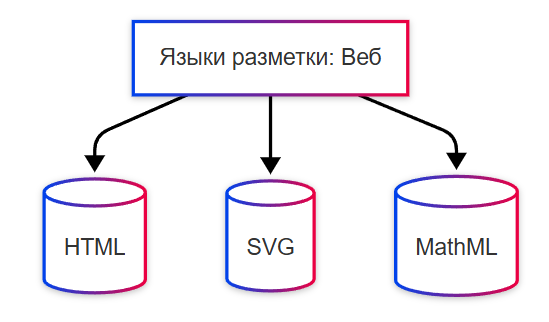
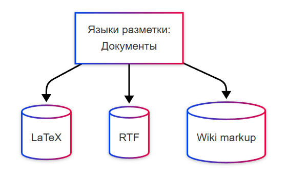
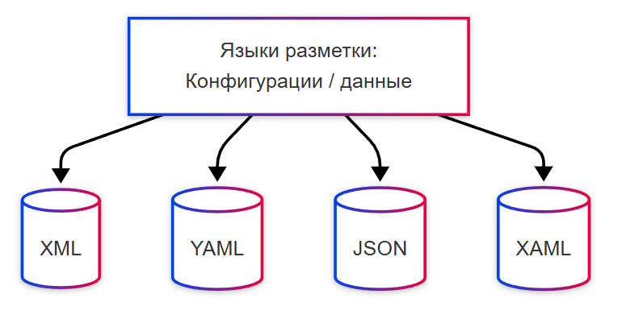

---
title: Языки разметки - HTML, XML, Markdown
---

# Языки разметки - HTML, XML, Markdown

<div class="article-tags">
  <span class="tag tag-beginner">ДЛЯ НОВИЧКОВ</span>
  <span class="tag tag-notrequired">НЕ ОБЯЗАТЕЛЬНО</span>
  <span class="tag tag-inprogress">В РАЗРАБОТКЕ</span>
</div>
<span class="complexity-badge">Разработчику</span>
<span class="complexity-badge">Аналитику</span>
<span class="complexity-badge">Архитектору</span>

## Языки разметки

**Языки разметки (Markup Languages)** используются для структурирования текста или данных, часто не являются полными языками программирования.

**Разметка** - это дополнительная информация, добавляемая к основному содержимому (текст или данные), чтобы указать:
	- структуру (что есть заголовок, абзац, список);
	- форматирование (жирный, курсив, цвет, размер шрифта);
	- семантику (значение - цитата, название, адрес);
	- поведение или связь с другими данными (гиперссылка, метаданные).

Например, эта статья написана при помощи разметки.

Если бы я не использовал разметку, то текст был бы сплошным:
```
Разметка - это дополнительная информация, добавляемая к основному содержимому (текст или данные), чтобы указать: структуру (что есть заголовок, абзац, список); форматирование (жирный, курсив, цвет, размер шрифта); семантику (значение - цитата, название, адрес); поведение или связь с другими данными (гиперссылка, метаданные).
```

Но мы разметили текст:

```markdown
**Разметка** - это дополнительная информация, добавляемая к основному содержимому (текст или данные), чтобы указать:
	- структуру (что есть заголовок, абзац, список);
	- форматирование (жирный, курсив, цвет, размер шрифта);
	- семантику (значение - цитата, название, адрес);
	- поведение или связь с другими данными (гиперссылка, метаданные).
```

Разметка служит инструкцией для программ (браузеров, редакторов, компиляторов и др.) о том, как обрабатывать, отображать или интерпретировать это содержимое.

Разметка не содержит логики, ветвлений, циклов или вычислений, она декларативна, как и запросы. К примеру, если вы хотите, чтобы ваш текст имел красивое оформление, вы добавляете специальную информацию, которая позволит показать пользователю более структурный и оформленный итоговый вариант.

Языки разметки можно условно разделить на веб, документы и данные.







**HTML (HyperText Markup Language)** – язык разметки гипертекстовых документов, используемый для структурирования содержимого веб-страниц. Дата создания — 1993 год. Основными особенностями являются теговая структура, семантические элементы, интеграция с CSS и JavaScript. Работает в браузерах. Применяется во фронтенд-разработке как основа всех веб-сайтов. Один из самых популярных языков в мире.

```html
<!DOCTYPE html>
<html>
<head>
    <title>Пример страницы</title>
</head>
<body>
    <h1>Заголовок</h1>
    <p>Это абзац текста.</p>
</body>
</html>
```


**XML (eXtensible Markup Language)** – универсальный язык разметки для хранения и передачи структурированных данных. Дата создания — 1998 год. Основными особенностями являются самодостаточность, возможность определения собственных тегов, строгий синтаксис. Используется в конфигурационных файлах, веб-сервисах, документообороте. Широко используется в legacy-системах и протоколах обмена данными.

```xml
<book>
    <title>Война и мир</title>
    <author>Лев Толстой</author>
    <year>1869</year>
</book>
```

**YAML (YAML Ain't Markup Language)** – формат сериализации данных, часто используемый как альтернатива XML и JSON. Дата создания — 2001 год. Основными особенностями являются читаемость человеком, использование отступов, поддержка сложных структур. Используется в конфигурационных файлах, DevOps, CI/CD. Популярен в современных инфраструктурных проектах.

```yml
database:
  host: localhost
  port: 5432
  ssl: true
```

**Markdown** – легковесный язык разметки, предназначенный для форматирования текста. Дата создания — 2004 год. Основными особенностями являются простой синтаксис, легко преобразуется в HTML, поддерживается многими редакторами. Работает через интерпретаторы и парсеры. Применяется в документации, README-файлах, блогах. Очень популярен среди разработчиков и технических писателей.

```markdown
# Заголовок

Это **жирный текст** в абзаце.

- Пункт списка
- Ещё один пункт
```

**XAML (Extensible Application Markup Language)** – декларативный язык разметки для описания пользовательского интерфейса в экосистеме .NET. Дата создания — 2006 год. Основными особенностями являются связь с кодом C#, поддержка привязки данных, стилей и триггеров. Работает в WPF, UWP, Xamarin. Применяется в настольных и мобильных приложениях Windows.

```xml
<Grid>
    <TextBlock Text="Привет, мир!" FontSize="16" />
    <Button Content="Нажми меня" Click="OnButtonClick" />
</Grid>
```

**SVG (Scalable Vector Graphics)** – XML-базированный язык описания двумерной векторной графики. Дата создания — 2001 год. Основными особенностями являются масштабируемость, поддержка CSS и JS, совместимость с HTML. Работает в браузерах. Применяется в логотипах, иконках, динамической графике. Активно используется в веб-дизайне и анимации.

```xml
<svg width="100" height="100">
    <circle cx="50" cy="50" r="40" fill="blue" />
</svg>
```

**LaTeX** – система верстки документов, основанная на языке разметки. Дата создания — 1985 год (на основе TeX). Основными особенностями являются акцент на научных и технических публикациях, поддержка формул, автоматическая нумерация. Работает через компиляцию в PDF или другие форматы. Применяется в университетах, исследованиях, математике. Основной инструмент для подготовки научных работ.

```latex
\documentclass{article}
\begin{document}
\section{Введение}
Формула: $E = mc^2$
\end{document}
```

**JSON (JavaScript Object Notation)** – формат обмена данными, часто используемый в веб-приложениях. Дата создания — около 2001 года. Основными особенностями являются структурированность, читаемость, поддержка большинством языков программирования. Используется как формат данных, но иногда относится к языкам разметки условно. Стандарт для API-ответов и клиент-серверного взаимодействия.

```json
{
  "name": "Тимур",
  "age": 30,
  "skills": ["C#", "Python", "JS"]
}
```

**RTF (Rich Text Format)** – формат разметки для представления документов с форматированием. Дата создания — 1987 год (Microsoft). Основными особенностями являются поддержка шрифтов, цветов, списков, таблиц. Работает в текстовых редакторах. Применялся в ранних офисных приложениях. Устаревающий, но до сих пор встречается в legacy-документах.

```
{\rtf1\ansi
{\fonttbl{\f0 Arial;}}
\pard\f0\fs24 \b Жирный текст\b0 
и обычный.
}
```

**Wiki markup** – упрощённый язык разметки, используемый в вики-движках. Дата появления — 2001 год (Wikipedia). Основными особенностями являются минимальный синтаксис, удобство редактирования, поддержка ссылок и заголовков. Работает в системах управления вики-контентом. Применяется в вики-движках, таких как MediaWiki, DokuWiki.

```
== Заголовок ==
Это ''курсив'' и ссылка на [[Главная страница]].

* Элемент списка
* Другой элемент
```
