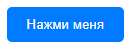
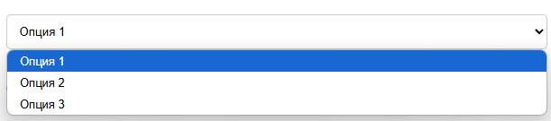
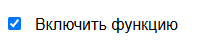
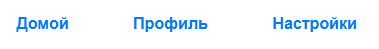

---
title: Функциональные элементы
---

# Функциональные элементы

## Функциональные элементы

**Кнопки** — это элементы управления, которые позволяют пользователю выполнять определенные действия. Они обычно содержат текст или иконку и реагируют на клик пользователя.

**Поля ввода** — это элементы, предназначенные для ввода текстовой информации пользователем. Они могут быть однострочными (input) или многострочными (textarea).

**Выпадающие списки (dropdowns)** позволяют пользователю выбирать один или несколько вариантов из предложенного списка. Они экономят место на экране и упрощают выбор.

**Слайдеры** — это элементы управления, которые позволяют пользователю выбирать значение из диапазона. Они часто используются для настройки параметров, таких как громкость или яркость.

**Переключатели (toggle switches)** позволяют пользователю включать или выключать определенные функции. Они работают по принципу «вкл/выкл». Их также называют флагами.

**Чекбоксы** — это элементы управления, которые позволяют пользователю выбрать один или несколько вариантов из списка. Они представлены в виде маленьких квадратов, которые можно отметить. Их также называют галочками.

- [x] Выполненная задача
- [ ] Невыполненная задача
- [ ] Другая задача

**Меню** — это набор пунктов, организованных в виде списка или сетки, который позволяет пользователю выбирать действия или переходить на другие страницы.

**Панели навигации** — это элементы интерфейса, которые помогают пользователю перемещаться между различными разделами приложения или сайта.

