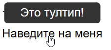
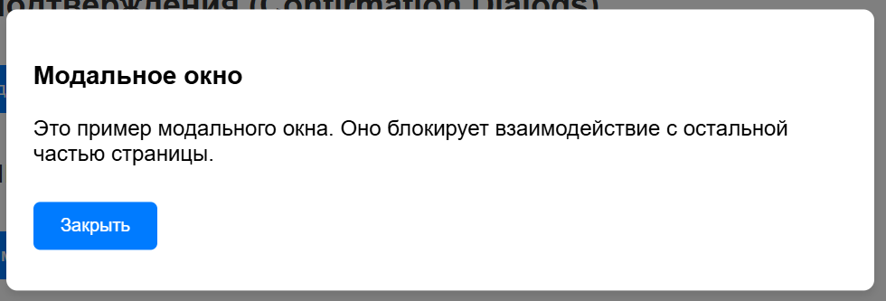
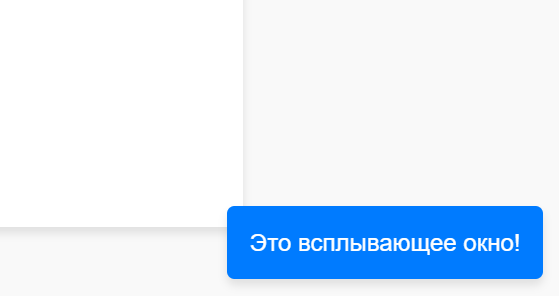

---
title: Элементы обратной связи
---

# Элементы обратной связи

  ДЛЯ НОВИЧКОВ
  НЕ ОБЯЗАТЕЛЬНО
  В РАЗРАБОТКЕ

Разработчику
Аналитику
Тестировщику

## Элементы обратной связи

**Уведомления (Notifications)** — это визуальные сообщения, которые информируют пользователя о событиях или действиях. Они могут быть информационными, предупреждающими или подтверждающими.

---

**Подсказки (Hints)** — это короткие текстовые фрагменты, которые помогают пользователю понять, как заполнить форму или выполнить действие. Обычно они отображаются рядом с полями ввода.

---

**Тултипы (Tooltips)** — это небольшие всплывающие окна, которые появляются при наведении курсора на элемент. Они содержат дополнительную информацию о данном элементе.

---

**Контекстное меню (Context Menu)** — это меню, которое появляется при щелчке правой кнопкой мыши или другом действии. Оно предоставляет пользователю варианты действий, связанных с текущим контекстом.

---

**Анимации и переходы (Animations and Transitions)** — это визуальные эффекты, которые делают интерфейс более динамичным и приятным для взаимодействия. Они могут использоваться для привлечения внимания или плавного изменения состояния элементов.

---

**Сообщения об ошибках (Error Messages)** — это уведомления, которые информируют пользователя о проблемах или неверных действиях. Они обычно выделяются красным цветом и содержат описание ошибки.

---

Кстати сами по себе сообщения об ошибках, фактически, это вариации диалоговых окон. Диалоговое окно подразумевает собой некое окно на интерфейсе, которое требует взаимодействия с пользователем.

**Окна (Windows)** — это основные контейнеры интерфейса, которые содержат контент и элементы управления. Они могут быть независимыми (например, браузерное окно) или встроенными в приложение. Окна обычно имеют заголовок, кнопки управления (закрыть, свернуть, развернуть) и контент.

---

**Диалоговые окна (Dialog Boxes)** — это вторичные окна, которые появляются поверх основного интерфейса для взаимодействия с пользователем. Они требуют выполнения определенного действия, например, подтверждения выбора или ввода данных. Пример: окно "Сохранить изменения?".

---

**Модальные окна (Modal Windows)** — это разновидность диалоговых окон, которые блокируют взаимодействие с остальной частью интерфейса до тех пор, пока пользователь не выполнит требуемое действие (например, закроет окно). Они используются для важных сообщений или действий.

---

**Немодальные окна (Non-modal Windows)** — это окна, которые не блокируют взаимодействие с основным интерфейсом. Они позволяют пользователю продолжать работу, не закрывая их. Пример: панель инструментов или плавающее окно настроек.

---

**Всплывающие окна (Pop-ups)** — это небольшие окна, которые появляются поверх основного контента. Они могут быть информационными, рекламными или содержать дополнительные элементы управления. Часто используются для уведомлений или рекламы.

---

**Окна предупреждений (Alerts)** — это простые диалоговые окна, которые информируют пользователя о важной информации или ошибке. Обычно они содержат текст и одну кнопку (например, "OK").

---

**Окна подтверждения (Confirmation Dialogs)** — это диалоговые окна, которые запрашивают у пользователя подтверждение действия. Они обычно содержат текст вопроса и две кнопки ("Да" и "Нет").

---
