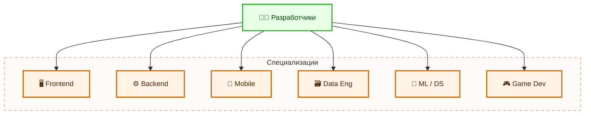
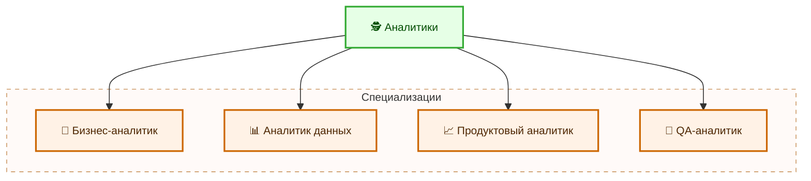
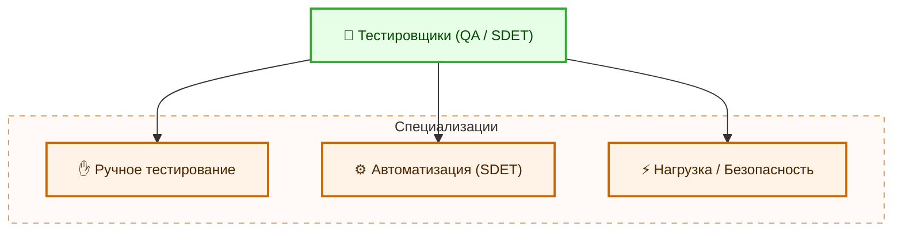
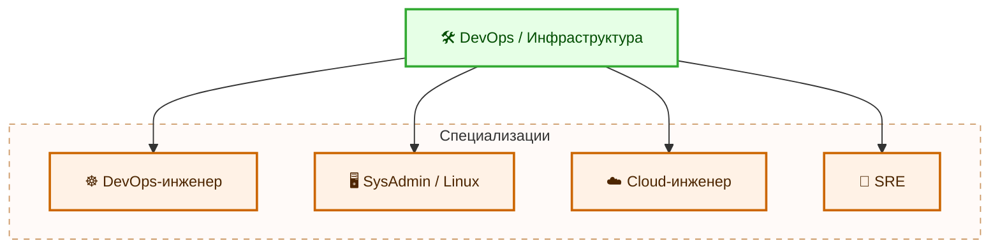
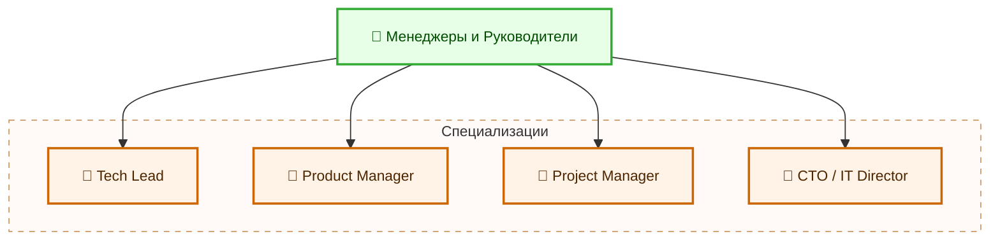
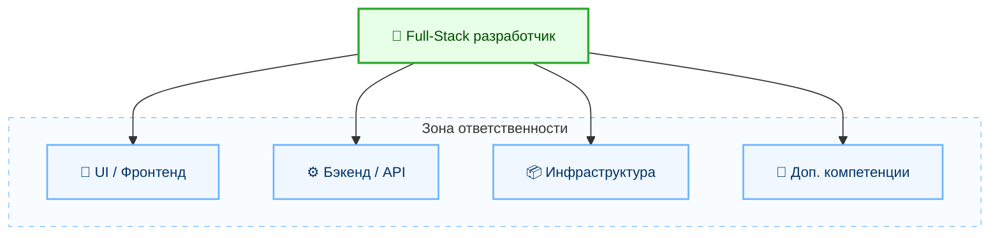
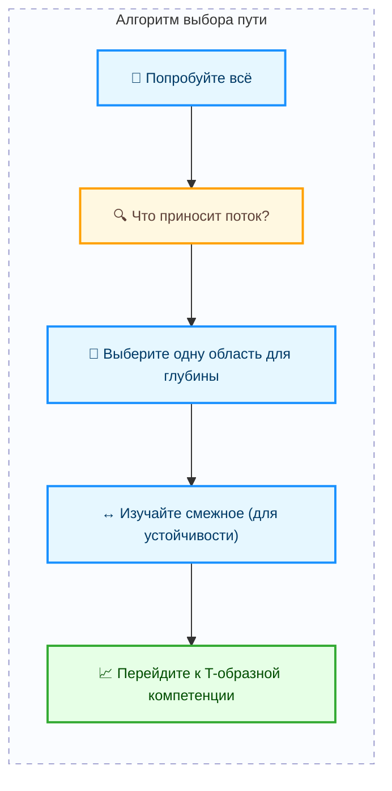

---
title: 1.26. Специализации
---

# 1.26. Специализации

  ДЛЯ НОВИЧКОВ
  НЕ ОБЯЗАТЕЛЬНО
  В РАЗРАБОТКЕ

Всем

## Специализации

Специализация — это когда вы сосредотачиваетесь на одной узкой области, становитесь экспертом в ней, знаете её глубоко, понимаете нюансы, ограничения, лучшие практики и умеете решать сложные проблемы, которые другие просто не видят.

Если обладать соответствующей компетенцией в определённой области, специалист становится незаменимым человеком в команде, его приглашают на сложные проекты, где требуется глубокое знание, он может претендовать на повышение и высокую зарплату. Узкая специализация, доведённая до высших ступеней, получает устойчивость к автоматизации - таких людей ИИ не заменит.

### Какие есть основные специализации в IT?

1. **Разработчики (Developers)**
	- Frontend-разработчик: React, Vue, Angular, TypeScript, Webpack, CSS-архитектура, доступность (a11y), производительность фронтенда.
	- Backend-разработчик: Node.js, Python/Django, Java/Spring, Go, REST/GraphQL, архитектура микросервисов, масштабирование.
	- Mobile-разработчик: iOS (Swift), Android (Kotlin), Flutter, React Native.
	- Data Engineer: ETL-процессы, Apache Spark, Kafka, Airflow, хранилища данных (Snowflake, BigQuery).
	- ML-инженер / Data Scientist: TensorFlow, PyTorch, модели машинного обучения, обработка больших данных, A/B-тесты.
	- Game Developer: Unity, Unreal Engine, оптимизация под GPU, физические движки, сетевой гейминг.

2. **Аналитики (Analysts)**
	- Бизнес-аналитик (BA): Требования, пользовательские истории, BPMN, UML, работа с заинтересованными сторонами.
	- Данных (Data Analyst): SQL, Power BI, Tableau, Excel, статистика, визуализация KPI.
	- Продуктовый аналитик (Product Analyst): Аналитика поведения пользователей (Mixpanel, Amplitude), гипотезы, A/B-тесты, метрики удержания.
	- QA-аналитик: Понимание бизнес-логики, тест-кейсы, документирование требований, автоматизация тестирования.

3. **Тестировщики (QA / SDET)**
	- Ручной QA: Тест-планы, баг-репорты, юзабилити, регрессионное тестирование.
	- Автоматизатор (SDET): Selenium, Playwright, Cypress, Pytest, Jenkins, CI/CD, написание тестовых фреймворков.
	- QA-инженер по нагрузке/безопасности: JMeter, LoadRunner, OWASP, PenTest, fuzzing.

4. **DevOps / Инженеры инфраструктуры**
	- DevOps-инженер: Docker, Kubernetes, Terraform, Helm, CI/CD (GitLab CI, GitHub Actions), мониторинг (Prometheus, Grafana), логи (ELK, Loki).
	- SysAdmin / Linux-инженер: Настройка серверов, сети, безопасность, скрипты (Bash/Python), Ansible.
	- Cloud-инженер (AWS/Azure/GCP): Архитектура облака, IAM, VPC, Lambda, S3, Cost Optimization, Serverless.
	- Site Reliability Engineer (SRE): SLI/SLO, error budgets, автоматическое восстановление, chaos engineering.

5. **Менеджеры и Руководители**
	- Технический менеджер (Tech Lead): Управление командой разработчиков, код-ревью, распределение задач, технические решения.
	- Product Manager (PM): Продуктовая стратегия, roadmap, взаимодействие с клиентами, приоритизация задач.
	- Project Manager (PM): Agile/Scrum/Kanban, управление сроками, рисками, бюджетом.
	- CTO / IT Director: Техническая стратегия компании, выбор технологий, найм, масштабирование инфраструктуры.

### Что такое Full-Stack?

**Full-Stack** (фуллстек) — это разработчик, который способен работать на всех уровнях веб-приложения:

	- Фронтенд (HTML/CSS/JS, фреймворки),
	- Бэкенд (сервер, API, БД),
	- Инфраструктура (деплой, базовые настройки сервера, CI/CD),
	- Иногда — даже дизайн или тестирование.

Что значит «уметь всё»?

Это значит:
	- Вы можете создать MVP от нуля до продакшена.
	- Вы понимаете, как все части системы связаны между собой.
	- Вы можете общаться с frontend-разработчиком, backend-инженером и DevOps’ом — без языкового барьера.

T-shaped professional — золотая середина. Это современная модель профессионала в IT. Вы эксперт в одной области (например, Backend на Java), но при этом:
	- Понимаете, как работает фронтенд,
	- Знакомы с DevOps-процессами,
	- Знаете, как пишутся тесты,
	- Умеете объяснять технические вещи менеджерам и клиентам.

Такие люди — самые востребованные.

### Как выбрать свой путь?

✅ Алгоритм для новичка:
	- Попробуйте всё — сделайте 2–3 мини-проекта: сайт, бэкенд, простой деплой.
	- Определите, что вам доставляет удовольствие — что вы делаете и забываете о времени?
	- Выберите одну область для глубины — пусть это будет даже не самая популярная, но та, где вы чувствуете «это моё».
	- Не переставайте учить смежные области — вы же не хотите, чтобы вас заменили ботом?
	- Через 1–2 года — переходите к T-shaped модели — развивайте широту.

