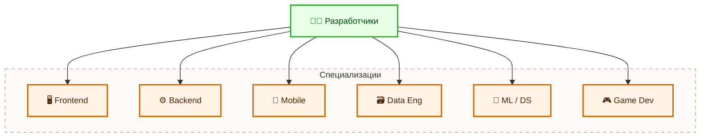
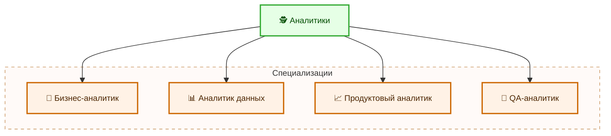
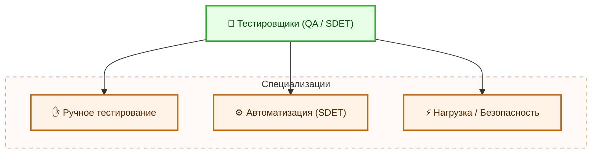
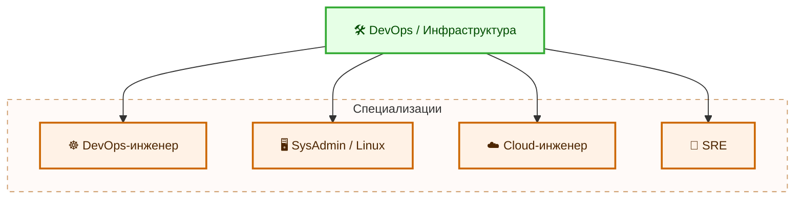
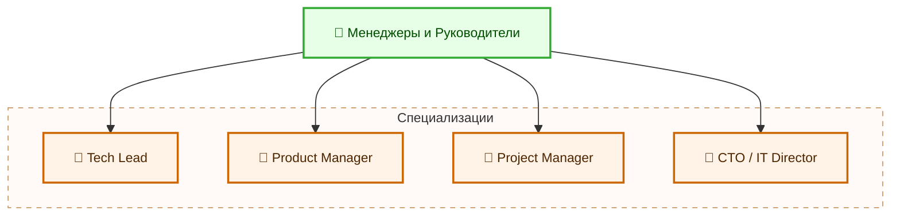
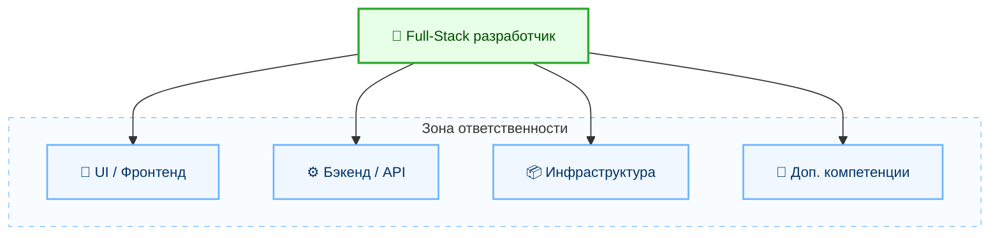
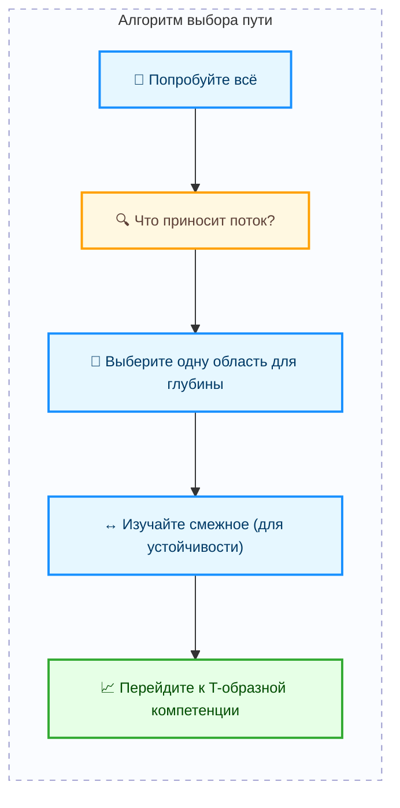

---
title: Специализации
---

# Специализации

  ДЛЯ НОВИЧКОВ
  НЕ ОБЯЗАТЕЛЬНО
  В РАЗРАБОТКЕ

Всем

## Что такое специализация?

Специализация — это профессиональная ориентация на узкую область знаний или навыков, в которой человек достигает высокого уровня компетентности, понимает ограничения, лучшие практики и способен решать сложные задачи, недоступные широкому кругу специалистов.

Специализация — это когда вы сосредотачиваетесь на одной узкой области, становитесь экспертом в ней, знаете её глубоко, понимаете нюансы, ограничения, лучшие практики и умеете решать сложные проблемы, которые другие просто не видят.

Если обладать соответствующей компетенцией в определённой области, специалист становится незаменимым человеком в команде, его приглашают на сложные проекты, где требуется глубокое знание, он может претендовать на повышение и высокую зарплату. Узкая специализация, доведённая до высших ступеней, получает устойчивость к автоматизации - таких людей ИИ не заменит.

## Какие есть основные специализации в IT?

### Разработчики

Разработчик — это специалист, создающий программное обеспечение, реализующий логику приложений, взаимодействие с данными и пользовательский интерфейс.

**Разработчики (Developers)**
	- Frontend-разработчик: React, Vue, Angular, TypeScript, Webpack, CSS-архитектура, доступность (a11y), производительность фронтенда.
	- Backend-разработчик: Node.js, Python/Django, Java/Spring, Go, REST/GraphQL, архитектура микросервисов, масштабирование.
	- Mobile-разработчик: iOS (Swift), Android (Kotlin), Flutter, React Native.
	- Data Engineer: ETL-процессы, Apache Spark, Kafka, Airflow, хранилища данных (Snowflake, BigQuery).
	- ML-инженер / Data Scientist: TensorFlow, PyTorch, модели машинного обучения, обработка больших данных, A/B-тесты.
	- Game Developer: Unity, Unreal Engine, оптимизация под GPU, физические движки, сетевой гейминг.

**Frontend-разработчик** — это разработчик, отвечающий за клиентскую часть веб-приложения: интерфейс, взаимодействие с пользователем, отображение данных и поведение элементов на экране. Он работает с HTML, CSS, JavaScript и фреймворками вроде React, Vue или Angular.

**Backend-разработчик** — это разработчик, реализующий серверную логику приложения: обработку запросов, работу с базами данных, авторизацию, бизнес-правила и интеграции с другими системами. Он использует языки вроде Python, Java, C#, Go и фреймворки типа Django, Spring, ASP.NET.

**Mobile-разработчик** — это разработчик, создающий приложения для мобильных устройств. Он работает с нативными технологиями (Swift для iOS, Kotlin для Android) или кроссплатформенными решениями (Flutter, React Native), учитывая особенности сенсорного ввода, энергопотребления и ограниченных ресурсов устройства.

**Data Engineer** — это инженер, проектирующий и поддерживающий системы сбора, хранения, обработки и доставки больших объёмов данных. Он строит ETL-процессы, управляет хранилищами данных, настраивает потоковую обработку через Kafka, Spark, Airflow и другие инструменты.

**ML-инженер** — это специалист, разрабатывающий, обучая и внедряющий модели машинного обучения в производственные системы.

**Data Scientist** — это аналитик, исследующий данные, выявляющий закономерности, строящий предсказательные модели и проверяющий гипотезы с помощью статистики и алгоритмов. Обе роли используют Python, библиотеки TensorFlow/PyTorch, а также инструменты A/B-тестирования и визуализации.

**Game Developer** — это разработчик, создающий компьютерные игры. Он реализует игровую логику, физику, графику, звук, сетевое взаимодействие и оптимизацию под целевые платформы. Основные инструменты — движки Unity и Unreal Engine, языки C# и C++.

---

### Аналитики

**Аналитик** — это специалист, изучающий потребности бизнеса, пользователей или системы, и преобразующий их в структурированные требования, метрики или гипотезы.

**Аналитики (Analysts)**
	- Бизнес-аналитик (BA): Требования, пользовательские истории, BPMN, UML, работа с заинтересованными сторонами.
	- Данных (Data Analyst): SQL, Power BI, Tableau, Excel, статистика, визуализация KPI.
	- Продуктовый аналитик (Product Analyst): Аналитика поведения пользователей (Mixpanel, Amplitude), гипотезы, A/B-тесты, метрики удержания.
	- QA-аналитик: Понимание бизнес-логики, тест-кейсы, документирование требований, автоматизация тестирования.

**Бизнес-аналитик** — это аналитик, выявляющий и документирующий бизнес-требования, моделирующий процессы с помощью BPMN/UML, согласовывающий цели заинтересованных сторон и обеспечивая связь между заказчиком и командой разработки.

**Аналитик данных** — это специалист, извлекающий информацию из структурированных источников с помощью SQL, Excel, Power BI или Tableau. Он строит отчёты, рассчитывает KPI, визуализирует тренды и помогает принимать решения на основе фактов.

**Продуктовый аналитик** — это аналитик, изучающий поведение пользователей в продукте через события (events), метрики удержания, конверсии и сессий. Он формулирует гипотезы, запускает A/B-тесты и оценивает влияние изменений на ключевые показатели.

**QA-аналитик** — это специалист, глубоко понимающий бизнес-логику продукта и способный переводить её в тестовые сценарии, чек-листы и требования к качеству. Он участвует в проектировании функциональности и проверяет соответствие реализации исходным условиям.

---

### Тестировщики

**Тестировщик** — это специалист, обеспечивающий качество программного обеспечения через проверку его соответствия требованиям, выявление дефектов и оценку рисков.

**Тестировщики (QA / SDET)**
	- Ручной QA: Тест-планы, баг-репорты, юзабилити, регрессионное тестирование.
	- Автоматизатор (SDET): Selenium, Playwright, Cypress, Pytest, Jenkins, CI/CD, написание тестовых фреймворков.
	- QA-инженер по нагрузке/безопасности: JMeter, LoadRunner, OWASP, PenTest, fuzzing.

**Ручной QA** — это тестировщик, выполняющий проверки вручную: заполняет формы, кликает по кнопкам, проверяет юзабилити, воспроизводит сценарии использования и составляет баг-репорты.

**Автоматизатор** — это инженер, пишущий код для автоматизации тестов: UI-тесты (Playwright, Cypress), API-тесты, unit- и интеграционные проверки. Он интегрирует тесты в CI/CD, поддерживает фреймворки и следит за стабильностью проверок.

**QA-инженер по нагрузке** — это специалист, моделирующий высокую нагрузку на систему с помощью JMeter или LoadRunner, чтобы оценить производительность, время отклика и устойчивость.

**QA-инженер по безопасности** — это специалист, проводящий тесты на уязвимости (PenTest), анализирующий код на наличие рисков (OWASP Top 10) и проверяющий защиту от атак типа SQL-инъекция или XSS.

---

### Инженеры инфраструктуры

**Инженер инфраструктуры** — это специалист, обеспечивающий надёжную, масштабируемую и автоматизированную среду для разработки, тестирования и эксплуатации программного обеспечения.

**DevOps / Инженеры инфраструктуры**
	- DevOps-инженер: Docker, Kubernetes, Terraform, Helm, CI/CD (GitLab CI, GitHub Actions), мониторинг (Prometheus, Grafana), логи (ELK, Loki).
	- SysAdmin / Linux-инженер: Настройка серверов, сети, безопасность, скрипты (Bash/Python), Ansible.
	- Cloud-инженер (AWS/Azure/GCP): Архитектура облака, IAM, VPC, Lambda, S3, Cost Optimization, Serverless.
	- Site Reliability Engineer (SRE): SLI/SLO, error budgets, автоматическое восстановление, chaos engineering.

**DevOps-инженер** — это инженер, объединяющий процессы разработки и эксплуатации. Он настраивает CI/CD (GitHub Actions, GitLab CI), управляет контейнерами (Docker), оркестрацией (Kubernetes), мониторингом (Prometheus/Grafana) и логами (Loki, ELK).

**SysAdmin** — это администратор, управляющий серверами, сетями, пользователями и службами. Он пишет скрипты (Bash/Python), настраивает безопасность, резервное копирование и автоматизацию через Ansible или аналоги.

**Cloud-инженер** — это специалист, проектирующий и управляющий облачной инфраструктурой в AWS, Azure или GCP. Он настраивает виртуальные сети (VPC), IAM-политики, serverless-функции (Lambda), хранилища (S3) и оптимизирует расходы.

**SRE** — это инженер, применяющий инженерные подходы к надёжности систем. Он определяет SLI/SLO, управляет error budgets, внедряет автоматическое восстановление и проводит «хаос-инженерию» (chaos engineering) для повышения устойчивости.

---

### Менеджеры

**Руководитель в IT** — это специалист, координирующий людей, процессы и ресурсы для достижения бизнес-целей через технологии.

**Менеджеры и руководители**
	- Технический менеджер (Tech Lead): Управление командой разработчиков, код-ревью, распределение задач, технические решения.
	- Product Manager (PM): Продуктовая стратегия, roadmap, взаимодействие с клиентами, приоритизация задач.
	- Project Manager (PM): Agile/Scrum/Kanban, управление сроками, рисками, бюджетом.
	- CTO / IT Director: Техническая стратегия компании, выбор технологий, найм, масштабирование инфраструктуры.

**Tech Lead** — это технический лидер команды разработчиков. Он принимает архитектурные решения, проводит код-ревью, распределяет задачи и обеспечивает техническое качество продукта.

**Product Manager** — это менеджер продукта, определяющий его стратегию, roadmap и приоритеты. Он общается с клиентами, анализирует рынок, формулирует ценность функций и согласует работу дизайнеров, аналитиков и разработчиков.

**Project Manager** — это менеджер проекта, отвечающий за сроки, бюджет, риски и коммуникацию. Он применяет методологии Agile, Scrum или Kanban, организует встречи и следит за выполнением плана.

**CTO** — это технический директор компании, определяющий долгосрочную технологическую стратегию, выбирающий стек технологий, руководящий наймом и масштабированием инфраструктуры.

---

## Специфика и комбинирование

### Что такое Full-Stack?

**Full-Stack разработчик** — это специалист, способный работать на всех уровнях веб-приложения: от пользовательского интерфейса до серверной логики, баз данных и базовой инфраструктуры. Он понимает, как компоненты взаимодействуют друг с другом, и может самостоятельно создать MVP от идеи до развёртывания.

**Full-Stack** (фуллстек) — это разработчик, который способен работать на всех уровнях веб-приложения:

	- Фронтенд (HTML/CSS/JS, фреймворки),
	- Бэкенд (сервер, API, БД),
	- Инфраструктура (деплой, базовые настройки сервера, CI/CD),
	- Иногда — даже дизайн или тестирование.

Что значит «уметь всё»?

Это значит:
	- Вы можете создать MVP от нуля до продакшена.
	- Вы понимаете, как все части системы связаны между собой.
	- Вы можете общаться с frontend-разработчиком, backend-инженером и DevOps’ом — без языкового барьера.

---

### T-shaped professional

**T-shaped professional** — это специалист с глубокой экспертизой в одной области (вертикальная часть буквы T) и достаточным пониманием смежных дисциплин (горизонтальная часть). Такой подход позволяет эффективно сотрудничать в междисциплинарных командах и решать комплексные задачи.

T-shaped professional — золотая середина. Это современная модель профессионала в IT. Вы эксперт в одной области (например, Backend на Java), но при этом:
	- Понимаете, как работает фронтенд,
	- Знакомы с DevOps-процессами,
	- Знаете, как пишутся тесты,
	- Умеете объяснять технические вещи менеджерам и клиентам.

Такие люди — самые востребованные.

---

### Как выбрать свой путь?

Алгоритм для новичка:
	- Попробуйте всё — сделайте 2–3 мини-проекта: сайт, бэкенд, простой деплой.
	- Определите, что вам доставляет удовольствие — что вы делаете и забываете о времени?
	- Выберите одну область для глубины — пусть это будет даже не самая популярная, но та, где вы чувствуете «это моё».
	- Не переставайте учить смежные области — вы же не хотите, чтобы вас заменили ботом?
	- Через 1–2 года — переходите к T-shaped модели — развивайте широту.

---