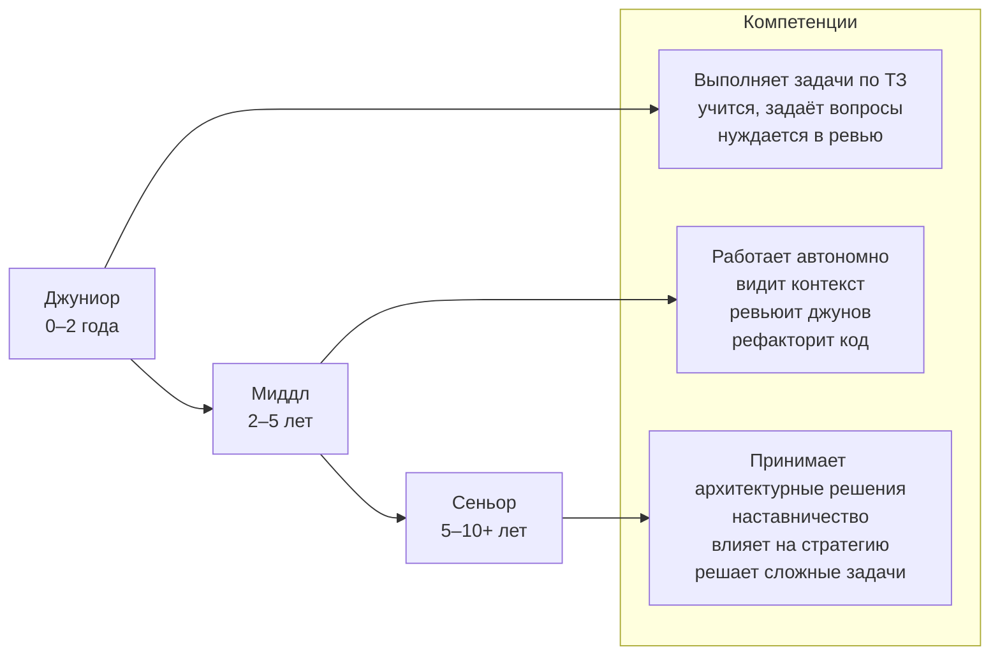

---
title: Этапы профессионального роста в IT
tags: [beginner, notrequired, all]
description: От джуниора до архитектора и руководителя.
---

# Этапы профессионального роста в IT

  ДЛЯ НОВИЧКОВ
  НЕ ОБЯЗАТЕЛЬНО
  В РАЗРАБОТКЕ

Всем

## Грейды и уровни в компаниях

Грейды (уровни) в IT:
- Junior (0–2 года) — учится, делает простые задачи по чёткой инструкции, боится, задаёт вопросы. Нужен наставник.
- Middle (2–5 лет) — работает сам, рефакторит, проверяет код джуниоров, видит картину проекта, но стратегией не управляет.
- Senior (5–10+ лет) — проектирует архитектуру, выбирает технологии, учит других, отвечает за систему в целом.

Джунов гоняют, миддлов уважают, сеньоров боятся.

Но порой даже джунами сразу не берут, сначала - стажировка. Это первый шаг. Часто мало или без оплаты, но даёт реальный опыт. Многие компании берут потом стажёров на работу.

Новичкам часто устраивают "онбординг" - такой процесс адаптации, выдача техники, знакомство с командой, ментор, обучение процессам. Хороший онбординг снижает текучку и стресс.

---

### Как работают грейды?

**Грейд** (grade) — это формальная категория, используемая в HR-системах для оценки квалификации сотрудника, определения уровня зарплаты и карьерного роста.

Количество таких категорий варьируется от трёх (Junior, Middle, Senior) до 30-50. Категории позволяют определить уровень навыков, сложности задач и размер заработной платы:
- Junior может получать 20-100 тысяч рублей;
- Middle может получать 70-200 тысяч рублей;
- Senior может получать 100-500 тысяч рублей.

Крупные технологические компании (Google, Yandex, JetBrains, Tinkoff и другие) используют многоуровневые грейдовые шкалы. Например:

| Уровень | Обозначение | Описание |
|--------|--------------|---------|
| L1–L2  | Intern / Junior | Обучение, выполнение простых задач под наставничеством |
| L3     | Software Engineer I | Первый полноценный уровень разработчика |
| L4     | Software Engineer II | Миддл: самостоятельная работа, владение стеком |
| L5     | Senior Software Engineer | Сеньор: архитектурные решения, наставничество |
| L6     | Staff Engineer | Сеньор+: кросс-командное влияние, техническая стратегия |
| L7+    | Principal / Distinguished Engineer | Экспертный уровень, влияние на всю организацию |

В российских компаниях часто используется упрощённая система:
- **Junior**
- **Middle**
- **Senior**
- **Lead / Architect**

Некоторые организации добавляют цифровые индексы: **Middle 1**, **Middle 2**, **Senior 1**, что позволяет проводить более гибкую градацию внутри уровня.

Грейд определяется не только опытом, но и:
- качеством принимаемых решений;
- степенью автономии;
- влиянием на команду и продукт;
- способностью обучать других;
- пониманием бизнес-контекста.

Переход на следующий грейд обычно сопровождается формальной процедурой: ревью, самооценкой, обратной связью от коллег и утверждением HR-комитетом.

---

## Этапы карьерного роста в IT

### Джуниор

**Джуниор** — это начинающий специалист, который осваивает профессиональные навыки под руководством более опытных коллег. Он выполняет задачи по чётким техническим заданиям, учится писать читаемый и поддерживаемый код, работает с системой контроля версий и участвует в командной разработке. Его основная цель — научиться применять теоретические знания на практике и понять контекст реальных проектов.

Задачи джуниора:
- Исправление мелких багов (например, опечатка в тексте интерфейса, некорректная валидация формы).
- Реализация простых фич по готовому ТЗ (добавить поле в форму, вывести данные из API на экран).
- Написание unit-тестов для существующего кода.
- Обновление документации (описание API, инструкции по запуску).
- Настройка локального окружения и воспроизведение проблем.
- Участие в код-ревью с целью обучения.

Когда человек вот только-только начинает свой путь в IT, его называют джуниором. Это слово уже давно стало частью профессионального языка индустрии. Новичок в IT - это человек, который ещё не имеет практического опыта работы в команде, но уже обладает базовыми техническими знаниями. Он может уметь писать простые программы, понимает основы алгоритмов, знает хотя бы один язык программирования и умеет работать с Git. Обычно это выпускники курсов, студенты, или люди, которые самостоятельно освоили первые навыки. Иногда к новичкам относят даже тех, кто уже получил первую работу, но пока не прошёл этап адаптации и не начал решать задачи самостоятельно. В этот период он всё ещё остаётся «в обучении», хотя формально уже числится сотрудником.

Как люди себя чувствуют на первых порах? На старте многим кажется, что они знают слишком мало, и это нормально. Почти все, кто сейчас работает в IT, через это прошли.На первых порах легко потеряться в терминах, не понять многие вещи и как вообще начать работать с чужим проектом.

Часто возникает ощущение, что все вокруг говорят на другом языке, используют множество сложных англицизмов, сокращений. Страх сделать ошибку, получить критику, желание угодить коллегам, постоянное сравнение себя с другими - всё это естественные эмоции. Но важно помнить, что никто не ждёт от джуниора идеального знания, ведь его задача - учиться, задавать вопросы и не бояться просить помощи.

Слово junior пришло к нам из английского языка и буквально означает «младший». В IT-сфере так стали называть младших разработчиков, чтобы отделить их от более опытных специалистов - middle и senior.

Эта система деления на уровни возникла в крупных компаниях, где нужно было удобно распределять нагрузку и ответственность. Джуниор получает поддержку, миддл уже может работать почти самостоятельно, а сеньор берёт на себя стратегические решения и управление. Такие уровни помогают строить понятную карьерную лестницу и оценивать прогресс сотрудников. Поэтому junior - это этап, на котором учатся, ошибаются, растут и становятся лучше.

С чего обычно начинают карьеру? Большинство людей начинают с обучения - онлайн-курсов, книг, видеоуроков. Среди молодёжи популярно именно видеообразование, когда можно узнать по любому инструменту или понятию кучу уроков на YouTube. Сейчас существует множество доступных источников для изучения программирования, где можно пройти структурированное обучение.

После теории приходит практика - создание проектов, участие в open-source, хакатонах и прочем. Но это уже дело каждого, в основном люди просто пишут код и работают. Именно практика позволяет набраться опыта и собрать своё первое портфолио, после чего придёт время первого интервью и первой работы. Кто-то начинает с неоплачиваемых стажировок, кто-то с фриланса.

В IT огромное количество направлений, и джуниор может выбрать себе любую дорогу:
	- фронтенд-разработчик;
	- бэкенд-разработчик;
	- фуллстек-разработчик;
	- QA-инженер (тестировщик);
	- DevOps-инженер;
	- аналитик данных;
	- бизнес-аналитик;
	- системный аналитик;
	- разработчик мобильных приложений;
	- системный администратор.

Каждое из направлений требует разного набора знаний, но у всех джуниоров много общего - им всем нужно познать основы. В первую очередь, разбираться в протоколах, логике, и подкрепиться практикой.

Важно отметить, что в крупной серьёзной компании будут более строгие требования к программисту junior - базовые понимания языка программирования, опыт работы с Git, умение писать чистый и понятный код, знания основных принципов разработки, например SOLID, и даже участие в проектах. Но это обусловлено довольно высоким уровнем заработной платы - ведь никто не захочет платить большие деньги программисту, который не знает программирование?

Аналитикам, тестировщикам чуть проще - им больше нужно сфокусироваться на умениях анализировать, декомпозировать задачи и различных софт-навыках. Системным администраторам важно разбираться в операционных системах и уметь работать с железом.

Но так не везде - некоторые организации используют другой подход, высматривая именно хороших людей в первую очередь, ориентируясь на софт-скиллы, с перспективой обучить всем необходимым хард-скиллам. Такие могут не выставлять требования к знанию языков и опыту работы на проектах, поэтому новичку следует ориентироваться на такие компании, или повышать свои навыки.

На работе джуниоры выполняют более простые задачи, которые требуют меньше самостоятельности, и чему-то могут научить. Это небольшие баги, простые фичи по готовым техническим заданиям, тесты, документация, внедрение сторонних библиотек, а порой и выполнение задач вместе с ментором-наставником.

Джуниору не обязательно знать архитектурные паттерны, масштабирование сервисов, идеальный код, особенности деплоя или весь стек технологий компании. Всему этому можно научиться только со временем. Главное - не бояться спрашивать, учиться на ошибках и двигаться вперёд.

Переход на другую ступень обычно занимает около двух-пяти лет. Всё зависит от индивидуальных особенностей самого человека, его навыков, способностей, целей, везения и компании.

Пример - ожидаемые знания по Java:
- Базовый синтаксис: переменные, циклы, условия, методы.
- Основы ООП: классы, объекты, наследование, инкапсуляция.
- Работа с коллекциями (`List`, `Map`, `Set`) и исключениями.
- Понимание принципов работы JVM (без глубокого погружения).
- Умение писать unit-тесты с JUnit.
- Использование Maven/Gradle для сборки проекта.
- Работа с Git: коммиты, пулл-реквесты, ветки.
- Знакомство с Spring Boot: создание простого REST-контроллера.

---

### Миддл

**Миддл** — это самостоятельный разработчик, способный проектировать и реализовывать функциональность средней сложности без постоянного надзора. Он понимает архитектуру проекта, может проводить ревью кода джуниоров, участвует в принятии технических решений на уровне модуля и умеет диагностировать и исправлять нетривиальные ошибки. Его работа строится на балансе между качеством, сроками и техническим долгом.

Задачи миддла:
- Разработка нового функционала с учётом бизнес-логики и требований.
- Рефакторинг устаревшего кода для улучшения читаемости и поддержки.
- Проектирование DTO, сервисов, контроллеров в рамках микросервиса.
- Интеграция с внешними API или внутренними сервисами.
- Проведение код-ревью и помощь джуниорам.
- Анализ производительности и предложение оптимизаций.
- Участие в планировании спринтов и оценке трудозатрат.

Когда человек проходит начальный этап карьеры и уже не джуниор, но ещё не сеньор - он становится миддлом. Это важный переходный этап в жизни разработчика, так как на этом уровне уже умеем работать почти самостоятельно, берём на себя ответственность за более сложные задачи и начинаем влиять на команду. Но при этом ещё далеко до эксперта и многое предстоит выучить.

Миддл - это специалист, который имеет 2-5 лет опыта работы и уже способен выполнять большинство задач без постоянного контроля. Он понимает, как устроен проект, может читать чужой код, писать свой - так, чтобы его было легко поддерживать. Миддл начинает видеть общую картину - как работает система, зачем нужна та или иная архитектура, и как принимаются технические решения. Он уже не новичок, но не руководит проектами, однако может взять на себя модуль, дать советы коллегам, и даже помочь джуниору освоиться.

Почему миддл не старший и почему не младший? Сеньор отвечает за стратегию, принимает ключевые решения и влияет на архитектуру, понимает бизнес-цели, тогда как миддл этим пока не занимается. Его задача - быть надёжным звеном в цепочке, делать то, что ему поручено, но уже с высоким качеством и пониманием контекста. В то же время миддл уже не зависит от постоянной помощи. Он не боится брать задачи, которые занимают несколько дней. Он знает, где найти информацию, как гуглить правильно, как читать документацию и объяснять свои решения. Он стал самостоятельным, но ещё не лидером.

На этом этапе часто возникает ощущение «я уже знаю достаточно, но ещё недостаточно», из-за чего возникает спектр эмоций - от парадокса до стыда. Это нормально, и многие миддлы задаются вопросами «Почему я всё ещё не сеньор?», «Чего мне не хватает?», «Как перейти дальше?». Это период роста и некоторого внутреннего напряжения, когда кажется, что недооценивают, иногда что слишком много давят. Важно понимать, что это естественный этап, когда расширяется кругозор, учатся смотреть на систему шире.

Становление миддлом не является формальной процедурой, здесь нет как таковых экзаменов, и обычно происходит постепенно - задачи всё более сложные, получают обратные связи, улучшают качество кода, начинают понимать, как работает команда.

Развитие миддла - это процесс глубокого погружения, когда начинают изучать более сложные темы, а код должен быть стабильным, масштабируемым и безопасным. На уровне миддла можно уже выбрать конкретное направление и развиваться в нём, к примеру, фронтенд или бэкенд. В зависимости от направления, требования и задачи будут отличаться, но общий уровень ответственности остаётся одинаковым.

На уровне миддла уже повсеместно ожидается знание языков, фреймворков, опыта работы, знания принципов чистого кода, участия в реальных проектах, умения читать чужой код. Как правило, общее, что требуется от джуниора - знание теории, а от миддла - практика.

Задачи миддла уже не ограничиваются простыми багами, часто это реализация крунпых фич, работа с несколькими компонентами одновременно, рефакторинг, код-ревью, внедрение сервисов, помощь джунам, и даже предложения по изменению в архитектуре. Это полноценная часть системы, которая влияет на качество продукта.

Не стоит переживать, если миддлом не знать, как масштабировать систему на миллион пользователей, как писать собственные ORM или фреймворки, варианты архитеткурных решений, теории управления, стратегических решений или деталей облачных платформ вроде AWS, GCP, Azure. Это задачи сеньора, а сейчас нужно просто уметь выполнять хорошо свою часть работы. 

Пример - ожидаемые знания по Java:
- Глубокое понимание коллекций, потоков (`Stream API`), лямбд.
- Знание жизненного цикла бина в Spring, DI, AOP.
- Работа с транзакциями, JPA/Hibernate, паттернами репозитория.
- Понимание многопоточности: `ExecutorService`, `synchronized`, `volatile`.
- Написание интеграционных и нагрузочных тестов.
- Настройка логгера (SLF4J, Logback).
- Использование аннотаций, рефлексии, generics.
- Понимание принципов REST, HTTP-статусов, idempotency.
- Опыт работы с Docker, базовое понимание Kubernetes.

---

### Сеньор

**Сеньор** — это эксперт, отвечающий за техническую целостность системы. Он проектирует архитектурные решения, оценивает риски масштабирования, выбирает технологии и инструменты, наставляет младших разработчиков и взаимодействует с аналитиками, тестировщиками и менеджерами продукта. Сеньор принимает решения, которые влияют на долгосрочное развитие продукта и команды.

Задачи сеньора:
- Проектирование архитектуры нового сервиса или модуля.
- Выбор технологического стека и обоснование решений.
- Внедрение CI/CD, мониторинга, логирования.
- Решение критических инцидентов в продакшене.
- Наставничество, проведение технических собеседований.
- Формирование стандартов кодирования и процессов разработки.
- Участие в roadmap-планировании и согласование технических ограничений с бизнесом.

Когда человек проходит через этапы джуниора и миддла, накапливает опыт, знания и уверенность - он становится сеньором. Это уже не просто разработчик, а эксперт, на плечи которого ложится ответственность за техническую часть проекта, а иногда и за команду. Может быть, и даже за стратегию развития продукта.

Сеньором обычно называют специалиста с 5-10 годами опыта в индустрии, который понимает, как устроены системы в целом, может принимать решения, которые влияют на долгосрочное развитие продукта, умеет не только писать код, но и объяснять, почему выбрано именно такое решение, влияет на выбор технологий, архитектуру, процессы и подходы в команде, и главное - руководит людьми или хотя бы умеет делегировать задачи и помогать другим расти.

Важно понимать, что в IT не работает принцип других отраслей, где начальником или старшим может быть человек менее компетентный, чем нижестоящий, здесь сеньор это уровень, на котором человек перестаёт быть «исполнителем» и становится архитектором, наставником и стратегом.

Слово старший здесь означает не возраст, а уровень ответственности и влияния. Если джун отвечает за выполнение конкретной задачи, а миддл - за модуль или фичу, то сеньор несёт ответственность за всю систему. Он принимает участие в обсуждении архитектуры, оценивает риски и возможные проблемы заранее, делает так, чтобы система была не только рабочей, но и масштабируемой, поддерживаемой, безопасной, может работать напрямую с менеджерами, бизнес-аналитиками и руководителями.

Как себя чувствуют сеньоры? Буду сеньором, как правило, ощущается совсем другой уровень давления - теперь все ждут не только правильного выполнения задачи, но и правильных решений. Теперь уже зачастую не получится просто спросить «А как вы обычно делаете?» - теперь все вопросы задают уже сеньору. Многие сеньоры говорят, что чувствуют большую нагрузку из-за необходимости быть в курсе изменений, принимать сложные решения и брать на себя ответственность за ошибки. Но при этом они получают гораздо больше уважения, автономии и конечно финансовой стабильности. Также часто возникает чувство внутреннего конфликта между желанием писать код и необходимостью управлять процессами. Кто-то уходит в техническую экспертизу, кто-то в роль менеджера или техлида.

Становление сеньора не является прямой дорогой, и для этого нужно решать именно сложные задачи, учиться у других, читать код других людей, писать документацию, иметь опыт наставничества и изучения архитектуры. В какой-то момент можно заметить, что стали спрашивать совета, и что мнение учитывается при выборе технологий.

Поэтому здесь два основных пути:
	- технический путь - углубление в технологии, системное проектирование, облачные архитектуры, DevOps, безопасность, автоматизация;
	- лидерский путь - переход к управлению людьми, проектами, командами.

Должности бывают разные - от программистов до инженеров, архитекторов, проектировщиков, где-то это может быть просто должность разработчика с надбавкой уровня сеньора, а где-то руководитель департамента.

На уровне сеньора ждут глубоких знаний в одном или нескольких языках программирования, опыта работы с масштабируемыми системами или высоконагруженными проектами, знания архитектурных паттернов, понимания DevOps, контейнеризации, участия в проектировании систем, выборе технологий, опыта в управлении командой или хотя бы в наставничестве, умения читать и писать техническую документацию, коммуникационных навыков и понимания бизнес-задач.

Задачи соответствующие - это может быть разработка архитектуры нового сервиса, или рефакторинг существующего, настройка CI/CD и автоматизации тестирования, управление зависимостями и техническим долгом, обучение, согласование, прогнозирование и консультирование.

Пример - ожидаемые знания по Java:
- Архитектурные паттерны: Hexagonal, CQRS, Saga, Event Sourcing.
- Глубокое знание JVM: garbage collection, JIT, memory model.
- Профилирование приложений (VisualVM, JProfiler, async-profiler).
- Безопасность: OAuth2, JWT, защита от инъекций.
- Проектирование отказоустойчивых систем: circuit breaker, retries, timeouts.
- Опыт с реактивным программированием (Project Reactor, WebFlux).
- Знание внутренностей Spring Framework: BeanFactory, ApplicationContext.
- Создание кастомных starter’ов, auto-configuration.
- Понимание CAP-теоремы, распределённых транзакций, консистентности.
- Умение писать production-ready код с observability (metrics, tracing, logging).

---

### Расширенные уровни

В некоторых компаниях используются промежуточные грейды для более точной калибровки компетенций.

#### Junior+

Разработчик, который уже уверенно справляется с типичными задачами джуниора, но ещё не готов к полной самостоятельности. Он может брать задачи с небольшой неопределённостью, предлагает решения, но требует подтверждения от миддла или сеньора. Часто находится на грани перехода в миддл.

#### Middle+

Специалист, который демонстрирует часть компетенций сеньора: например, проектирует сложные модули, участвует в архитектурных обсуждениях, но пока не берёт на себя ответственность за систему в целом. Может временно замещать сеньора в его отсутствие.

#### Senior+

Эксперт высшего уровня, часто называемый **стэфф-инженером**, **техлидом** или **архитектором**. Он влияет на техническую стратегию компании, проектирует платформенные решения, внедряет новые подходы и обучает других сеньоров. Его решения затрагивают несколько команд или всю организацию.

---

### Онбординг

Onboarding (онбординг) — это процесс адаптации нового сотрудника в компании.  Он включает в себя все мероприятия, направленные на то, чтобы помочь новому сотруднику быстро освоиться, понять корпоративную культуру, получить необходимые знания и инструменты для эффективной работы.
Крупные компании серьёзно относятся к этой процедуре, ведь если хорошо принять сотрудника, это увеличит его вовлечённость, снизить текучку кадров и создаст позитивное первое впечатление о компании.

Когда новичок попадает в новую среду, он сталкивается с множеством новых людей, процессов, инструментов и задач. Без должной поддержки этот период может быть стрессовым и привести к тому, что сотрудник уйдёт через несколько месяцев. Поэтому эффективный онбординг направлен на снижение времени выхода на продуктивность, укрепление доверия между сотрудником и работодателем, повышение удовлетворённости работой, создание культуры открытости и постоянного развития и конечно предотвращение преждевременного ухода ценных специалистов.

Как правило, онбординг включает несколько этапов:

1. Административная адаптация. Это самая формальная часть, когда новому сотруднику нужно пройти юридические и технические процессы, необходимые для начала работы:
	- оформление документов;
	- получение оборудования;
	- настройка учётных записей и доступа к ресурсам;
	- знакомство с внутренними системами и политиками компании.

Хорошие компании организовывают всё так грамотно, что заранее готовят всё необходимое к первому дню, чтобы сотрудник сразу мог сосредоточиться на работе, а не на поиске паролей или установке софта.

2. Знакомство с командой и продуктом. Важно, чтобы новый сотрудник понял, кто есть кто в команде, как работает компания и какие задачи решает её продукт.

Для этого проводят встречи с коллегами и руководителями, обзор структуры компании и роли своей команды в ней, изучение продуктовой стратегии, целевой аудитории и бизнес-модели, а также знакомство с текущим проектом. На этом этапе особенно важно пояснить контекст - зачем делается продукт, кто его использует, и как именно новый сотрудник будет влиять на его развитие.

3. Обучение и развитие. Новый сотрудник должен получить знания, необходимые для выполнения своих обязанностей:
	- технические навыки (кодовая база, регламенты, архитектура и используемые решения);
	- внутренние процессы (как создавать задачи, работать с Git);
	- работа с документаций (где хранится, как пользоваться и править);
	- возможности для обучения - доступ к курсам, книгам и тренингам.

4. Обратная связь и менторство. Компании, которые ценят своих сотрудников, вводят регулярные встречи с менеджером или ментором, так как получение обратной связи очень важно для быстрого развития.

Компания обозначает руководителя, и назначает ментора - опытного коллегу, который помогает разбираться с вопросами, объясняет тонкости и поддерживает. Кроме этого, проводятся регулярные встречи с руководством для обсуждения прогресса, трудностей и планов. На ошибки здесь важно указывать без мотивации, именно поэтому нужен наставник, который на ранних этапах поможет неуверенному новичку разобраться.
На практике онбординг используется по лучшим вариациям - с использованием чек-листа (подробного списка задач), временного напарника, набора материалов для новичка, а также обучающие видео и гайды.

Крупные корпорации зачастую создают именно иллюзию того, что работа в компании прекрасна, а все сотрудники приветливы и заботливы, будто на новичка не плевать.

---

### Стажировка

Первое, с чем столкнётся начинающий айтишник - с отсутствием опыта и требованием в вакансиях многих лет опыта с какими-то определёнными технологиями. После этого возникает вопрос - а где этот опыт набирать?

Ответ - набираться опыта стажёром или ассистентом. Если вы сорокалетний новичок, с семьей, которую надо кормить - будет сложно в финансовой части. Стажёрам либо не платят, либо платят совсем немного, поэтому здесь нужно иметь хотя бы какой-то запас средств для обеспечения существования.

Стаж - это период практической работы. Стаж может быть оплачиваемым и неоплачиваемым, и не обязательно придерживаться подхода указания в резюме только трудового стажа в соответствии с трудовой книжкой - нужно указывать и стажировки. Ведь это всё служит для приобретения опыта, развития навыков и понимания реального рабочего процесса.

Стажировка — это форма обучения на практике, когда человек (стажёр) временно работает в компании под руководством опытных специалистов. Это позволяет не только применить знания, полученные ранее, но и погрузиться в корпоративную культуру, увидеть, как работают настоящие проекты, и начать формировать свою профессиональную сеть. В IT-сфере стажировка особенно важна, потому что теория программирования — лишь малая часть того, что нужно знать для успешной работы. Реальные задачи, коммуникация в команде, использование Git, Jira, CI/CD, работа с чужим кодом — всё это можно по-настоящему понять только в условиях реальной разработки.

Зачем нужна стажировка и чем она полезна?

1. Получить реальный опыт, а не только учебные проекты.
2. Разобраться в технологиях, используемых в индустрии.
3. Узнать, как работают процессы, как выполняется планирование, анализ, разработка, тестирование, релиз, поддержка.
4. Понять, подходит ли сфера, направление или компания.
5. Наладить связи с коллегами, которые могут стать рекомендателями.
6. Укрепить портфолио, даже если проект закрытый - можно указать свой вклад, без раскрытия конфиденциальной информации.
7. Подготовиться к первому собеседованию, ведь стажировка будет уже в резюме.

Кроме того, стажировка поможет новичку упростить период адаптации, придаст психологическую уверенность, благодаря чему человек будет чувствовать себя частью сообщества, понимать язык профессионалов, и видеть, как выглядит развитие изнутри.
Формальная стажировка - это официально организованная программа, часто с контрактом, расписанным графиком, ментором и иногда с оплатой. Такие программы проводят крупные компании, стартапы, образовательные платформы и университеты.

Примеры - программы стажировок в Google, Яндекс, Т-Банк (Тинькофф), JetBrains, учебные центры, предлагающие стажировки после курсов, и программы вроде Яндекс Практикум, Stepik Internship и другие.

Формальная стажировка обеспечит официальное подтверждение опыта, чётко обозначенный план развития, даст высокий шанс остаться в компании после стажировки и даже возможность получения оплаты.

Неформальная стажировка же менее структурированный путь, подразумевающий, к примеру, участие в open source, помощь знакомым с проектами, волонтёрство, или стажировка «по знакомству» без формального оформления.

Это более гибко, без бюрократии и возможность начать всё максимально быстро, но не даёт гарантий, не подтверждается официально, а также имеет сложности в получении обратной связи.

Для многих стажировка становится первым шагом к трудоустройству. Особенно если человек показывает хорошие результаты, умеет работать в команде и хочет развиваться. Зачастую под «желанием развиваться» работодатели подразумевают готовность работать и учиться во внерабочее время, инвестируя личное время в саморазвитие.

Как стажировка может привести к постоянной работе?

1. Знание продукта и процессов - обучение уже не требуется.
2. Доказательство надёжности - уже знают, доверяют и ценят.
3. Есть внутренние рекомендации - коллеги могут дать положительный отзыв.
4. Экономия времени для HR - зачем искать нового кандидата, когда вот он!

Поэтому важно воспринимать стажировку как «пробный период», во время которого человек должен показать себя с лучшей стороны.

---