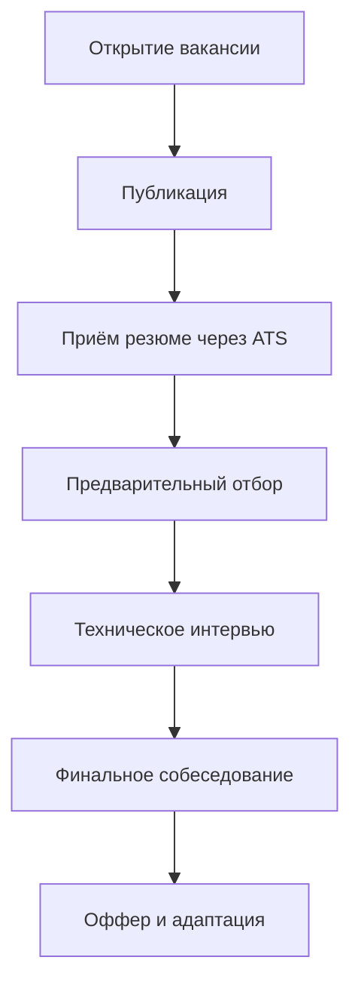

---
title: Взаимодействие с HR и рекрутерами
tags: [beginner, notrequired, all]
---

# Взаимодействие с HR и рекрутерами

  ДЛЯ НОВИЧКОВ
  НЕ ОБЯЗАТЕЛЬНО
  В РАЗРАБОТКЕ

Всем

## Работа с HR

## Что такое HR и рекрутинг в IT

**HR** — это подразделение компании, отвечающее за управление персоналом. Его задачи включают подбор кадров, адаптацию новых сотрудников, развитие компетенций, мотивацию и удержание специалистов.

**HR** переводится как **«Human Resources»** - человеческие ресурсы. Это кадровая служба - совокупность специализированных подразделений в структуре предприятия, призванных управлять персоналом. На начальном этапе рекрутеры оценивают соответствие кандидатов базовым требованиям компании, таким как наличие необходимых сертификаций, опыт работы с облачными платформами или понимание принципов.

**Рекрутинг** — процесс поиска, оценки и привлечения кандидатов на открытые позиции. В IT-сфере он имеет особенности: акцент делается не только на опыт, но и на технические навыки, способность решать задачи и работать в команде.

Процесс подбора в IT обычно состоит из нескольких этапов:

| Этап | Описание |
| :--- | :---: |
|Открытие вакансии	|Менеджер по найму получает одобрение на закрытие позиции от руководства
|Публикация вакансии	|Вакансия размещается на сайтах (HH.ru, LinkedIn, собственный сайт компании)
|Прием резюме через ATS	|Кандидаты отправляют отклики, система фильтрует их по ключевым словам
|Предварительный отбор	|Рекрутер или HR-специалист оценивает соответствие требованиям
|Техническое интервью / тестовое задание	|Оценка навыков, знаний, подхода к решению задач
|Финальное собеседование	|Обсуждение культуры компании, мотивации, ожиданий
|Оффер и адаптация	|Предложение работы, оформление, onboarding

---

### Как работает система ATS

**ATS (Applicant Tracking System)** — это программа, которая автоматически обрабатывает входящие резюме и отбирает тех кандидатов, которые соответствуют заданным критериям. Она используется почти всеми крупными компаниями и всё чаще — средними и даже стартапами.

Это упрощает обработку большого количества откликов, сокращает время на предварительный отбор, автоматизирует этапы коммуникации (к примеру, рассылка приглашений), интегрируется с системами управления проектами и HR-порталами.

**Как работает ATS?**

Когда кандидат загружает резюме, ATS:
	- Сканирует текст на наличие ключевых слов;
	- Сравнивает с шаблоном вакансии;
	- Присваивает рейтинг или баллы;
	- Отправляет наиболее подходящих кандидатов дальше.

Ключевые слова — термины, технологии, инструменты и навыки, указанные в описании вакансии. Например, если вакансия требует знания `Python`, `Django`, `PostgreSQL` и `Git`, то эти слова обязательно должны присутствовать в резюме.

Пример - Вакансия: «Ищу Python-разработчика с опытом 2+ года, знанием Django, REST API, PostgreSQL, Git». Ключевыми словами здесь будут:
	- Python
	- Django
	- REST API
	- PostgreSQL
	- Git
	- ООП
	- ORM
	- JSON / XML
	- Linux
	- SQL

Если этих слов нет в вашем резюме — ATS может его не пропустить.

---

### Как составить резюме

Тогда как оформить резюме?

**Резюме** — это первый документ, который видит рекрутер. Оно должно быть чётким, акцентирующим внимание на ключевых навыках и без лишней информации.

Обязательные разделы резюме:

| Раздел | Содержание |
| :--- | :--- |
| Контакты | Имя, телефон, email, Telegram, GitHub, LinkedIn |
| Технические навыки | Языки программирования, фреймворки, базы данных, инструменты |
| Опыт работы | Компания, должность, период, обязанности и достижения |
| Образование | ВУЗ, факультет, год окончания |
| Проекты | Краткое описание одного–двух значимых проектов или ссылка на репозиторий |
| Дополнительно | Сертификаты, уровень английского, soft skills |

В резюме лучше не использовать картинки, сложные дизайны, не писать «умею работать в команде», нужно указывать конкретные результаты (например: «оптимизировал скорость загрузки страницы на 40%»).

Совет

Если вы новичок и у вас мало опыта — делайте акцент на проектах, курсах и активностях, которые демонстрируют ваши навыки.

---

### Этапы собеседования в IT

Собеседование в IT — это не один разговор, а серия встреч, каждая из которых проверяет разные аспекты кандидата.

Как готовиться:
- Повторите основы языков и технологий, указанных в вашем резюме.
- Подготовьте рассказы о своих проектах по методике STAR (Situation, Task, Action, Result).
- Изучите сайт компании, её продукты, новости и вакансии.
- Потренируйтесь объяснять свои решения вслух — это важно на технических интервью.
- Подготовьте 3–5 вопросов к интервьюеру: это показывает интерес и вовлечённость.

Типичная структура:

| Этап | Цель |
| :--- | :--- |
| Вводная беседа | Знакомство, обсуждение мотивации, карьерных целей и общего опыта |
| Техническое интервью | Проверка знаний: алгоритмы, архитектура, код, работа с данными |
| Тестовое задание | Практическая задача: написание кода, проектирование решения, анализ |
| Поведенческие вопросы | Оценка soft skills: работа в команде, реакция на стресс, решение конфликтов |
| Вопросы от кандидата | Возможность узнать о проектах, культуре, процессах внутри компании |

Как вести себя после собеседования

- **Спасибо за встречу** — отправьте короткое сообщение в течение 24 часов.
- **Запросите обратную связь**, даже если получили отказ. Это помогает расти.
- **Не торопитесь с ответом** на оффер — запросите 1–3 дня на размышление, если нужно.
- **Соблюдайте дедлайны** — если обещали ответить до пятницы, ответьте до пятницы.

Обычно проводится с руководителем направления или HR-бизнес-партнёром. Здесь обсуждаются:
- Детали компенсационного пакета.
- Возможности роста.
- Корпоративная культура.
- Онбординг и первые недели.

Если всё согласовано, кандидат получает **оффер** — официальное предложение о работе. В нём указываются:
- Должность.
- Зарплата и бонусы.
- График и формат работы.
- Дата выхода на работу.

> **⚠️ Предупреждение**  
> Не подписывайте оффер сразу. Возьмите время на размышление, сравните с другими предложениями, уточните детали, если что-то непонятно.

---

## Ошибки HR и как на них реагировать

HR-специалисты и рекрутеры — люди, выполняющие сложную и многогранную работу. Они взаимодействуют с десятками кандидатов одновременно, работают в условиях неопределённости и часто принимают решения при недостатке информации. Тем не менее, их действия могут содержать ошибки, которые влияют на восприятие компании и опыт кандидата.

### Типичные ошибки HR

#### 1. Нечёткое описание вакансии  
HR может опубликовать вакансию без ясных требований, обязанностей или ожиданий от кандидата. Это приводит к тому, что откликаются неподходящие специалисты, а подходящие теряют интерес.

#### 2. Отсутствие обратной связи  
После собеседования кандидат остаётся без ответа на несколько дней или недель. Это создаёт ощущение игнорирования и снижает лояльность к бренду работодателя.

#### 3. Избыточный фокус на формальных критериях  
Некоторые HR чрезмерно полагаются на соответствие резюме шаблону: количество лет опыта, наличие диплома, конкретные технологии. При этом игнорируются способности к обучению, мотивация и практические навыки.

#### 4. Нарушение сроков  
Обещанное решение «в течение трёх дней» затягивается на две недели. Такие задержки демонстрируют плохую организацию процесса подбора.

#### 5. Непрофессиональное поведение  
Примеры:
- Опоздание на собеседование без уведомления.
- Звонок в неудобное время без предварительного согласования.
- Использование разговорного тона, неуместного в деловой коммуникации.

#### 6. Подмена роли технического специалиста  
HR пытается оценить технические навыки без участия разработчиков. Это приводит к отсеву сильных кандидатов из-за поверхностного понимания технологий.

---

### Как реагировать на ошибки HR

#### Если вы получили отказ без объяснений  
Напишите вежливое сообщение:  
> «Благодарю за возможность пройти собеседование. Буду признателен за краткую обратную связь — это поможет мне расти как специалисту».

Такой запрос повышает шансы получить полезную информацию и оставляет положительное впечатление.

#### Если HR нарушил сроки  
Допустимо напомнить один раз через указанный в обещании срок:  
> «Добрый день! Хотел уточнить статус моей кандидатуры. Спасибо за внимание!»

Если ответа нет — можно считать, что компания не заинтересована. Продолжайте поиск.

#### Если вакансия оказалась не той, что обещали  
На этапе финального собеседования уточните:
- Конкретные задачи первых трёх месяцев.
- Стек технологий команды.
- Формат работы (офис/удалёнка/гибрид).
- Возможности роста и обучения.

Это поможет избежать разочарования после выхода на работу.

#### Если HR ведёт себя непрофессионально  
Сохраняйте спокойствие и вежливость. Внутренняя культура компании часто проявляется уже на этапе найма. Если вам некомфортно — это сигнал.

> **💡 Совет**  
> Плохой опыт с HR — тоже ценный опыт. Он помогает понять, какие ценности важны для вас в работе: уважение, прозрачность, профессионализм.

---