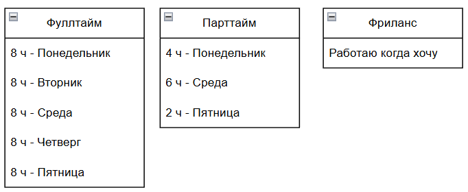

---
title: 1.26. Виды занятости
---

# 1.26. Виды занятости

  ДЛЯ НОВИЧКОВ
  НЕ ОБЯЗАТЕЛЬНО
  В РАЗРАБОТКЕ

Всем

# Виды занятости

В каждой компании и на каждой должности могут быть свои особенности в части занятости. Здесь нам нужны два момента - форма, время и формат.

Форма занятости сейчас подразумевает в основном способ оформления:
	- как ИП (индивидуальный предприниматель);
	- как самозанятый;
	- через гражданско-правовой договор (ГПХ);
	- через трудовой договор.

Зарубежные работодатели и заказчики предпочтут ГПХ. Российские оформляют обычно через трудовой договор. В чём здесь особенности?
ИП - это физическое лицо, зарегистрированное в установленном законом порядке и осуществляющее предпринимательскую деятельность без образования юридического лица. Почему так?

Давайте погрузимся в основы. Когда человек получает прибыль на регулярной основе, это означает, что он осуществляет предпринимательскую или иную приносящую доход деятельность. Поскольку все граждане должны отчитываться о своих доходах перед государством и оплачивать часть из них в виде налогов, отчисляя в казну государства, то необходимо выполнять ряд обязательных процедур.

Все компании в мире являются юридическими лицами - это образования из нескольких физических лиц, которые имеют повышенные требования к отчётности, платят больше налогов, но при этом получают возможность получать больше денег. Именно поэтому в каждой компании есть бухгалтера, финансисты, экономисты, юристы и кадровики - все они занимаются в первую очередь именно «защитой» компании от ошибок при отчетности перед государством. Если юридическое лицо занимается какой-то приносящей доход деятельностью, то должно получить разрешение - к примеру, нельзя разрешать всем налево-направо производить медицинское оборудование или вооружение, так как от этого зависят жизни людей и благополучие общество. Для регулирования всего этого существует ряд процедур в виде лицензирования, разрешительных операций и сертифицирования.

Но в ряде случаев, человек (физическое лицо) может заниматься предпринимательством и даже нанимать сотрудников, но без необходимости разворачивать целое юридическое лицо. Для этого он просто сообщает государству, что будет заниматься такой-то деятельностью и регистрируется в качестве ИП, получает особый статус и за этот статус ему добавляется новая обязанность - отчитываться.

Обычный гражданин не задумывается о налогах и отчётности, так как это за него делает работодатель. При оформлении по трудовому договору, зарплата сначала начисляется, потом из неё вычитывается налог и все обязательные сборы, и «на руки» выдаётся именно сумма ПОСЛЕ вычета. Поэтому будьте внимательны - если указана сумма с пометкой «ДО ВЫЧЕТА», значит нужно вычесть как минимум 13% (процент налога на доход физического лица, НДФЛ). Другие сборы - это отчисления в пенсионный фонд, для формирования пенсии.

Таким образом, формат будет отличаться следующим:
	- ИП - специальный статус, ряд ограничений и самостоятельная отчётность;
	- самозанятый - специальный статус, самостоятельная отчётность с пониженным налогом;
	- ГПХ - без специального статуса, разовая временная работа или услуга;
	- трудовой договор - вся отчетность ложится на работодателя - от работника нужно лишь работать и выполнять свои обязанности перед работодателем.

Если работать по ГПХ на регулярной основе без оформления ИП или статуса самозанятого, можно получить штраф, так как регулярность это признак предпринимательской деятельности, а она без статуса ИП незаконна.

Раньше оформлялись через ИП или по трудовому договору, а ГПХ был своеобразным обходом налогов, и поэтому государством было введено новое понятие «самозанятого» как раз для того, чтобы был упрощённый режим с пониженным налогом. В таком статусе нет ограничений ИП, и не будет штрафов, остаётся лишь самостоятельно считать все налоги и уплачивать их.

Поэтому будьте аккуратны в юридическом плане.

Формат работы, в отличие от формы занятости, предполагает способ выполнения задач. Тут различают пять вариантов:

- Офис - когда предполагается посещение офиса компании в соответствии с рабочим временем по определённому адресу, указанному в договоре;
- Аутсорсинг - когда не предполагается посещения или учёта рабочего времени, лишь требуется результат в установленный срок;
- Аутстаффинг - другая компания предоставляет специалистов заказчику;
- Удалённая работа - когда нет нужды посещать офис, и можно выполнять работу в любом удобном для работника месте (предполагается, что дома);
- Гибридный формат - когда часть работы удалённая, а часть - в офисе.

Варианты могут и комбинироваться. К примеру, гибридный формат работы аутстаффинга. Или офисный аутсорсинг.

Думаю, здесь очевидно - либо сидим дома, либо ходим в офис и определяемся, на кого мы работаем. Вопросы могут возникнуть по поводу именно аутсорсинга. 

**Аутсорсинг** — это когда компания передаёт часть своих задач внешней организации. Например, заказывает разработку сайта или мобильного приложения сторонней IT-компании. Для специалиста это означает, что он работает в составе аутсорс-фирмы, а не напрямую в клиентской компании, при этом он может работать по ГПХ или как ИП. Суть в том, что он не подчиняется правилам компании, а лишь берёт задачу выполнять какую-то работу или оказывать услугу.

**Аутстаффинг** отличается от аутсорса тем, что специалист числится в одной компании, но фактически работает в другой. Например, человек заключает договор с IT-агентством, а затем направляется на проект клиента. Это позволяет работодателю быстро масштабировать команду, а сотрудникам — получать опыт в разных компаниях. Однако здесь тоже есть риски: нестабильность проектов, зависимость от контрактов между компаниями и ограничения в карьерном росте.

**Время работы** включает в себя полноту занятости.

**Фуллтайм** подразумевает стандартную 40-часовую рабочую неделю и чаще всего предполагает работу в офисе. Такой формат наиболее распространён в крупных компаниях и стартапах, где требуется постоянное присутствие сотрудника в команде.

**Парттайм** означает частичную занятость, например, 20–30 часов в неделю. Такой формат часто выбирают студенты, мамы в декрете, люди, совмещающие несколько видов деятельности или желающие плавно войти в профессию. 

**Фриланс** — это самостоятельная работа на себя. Фрилансер сам ищет клиентов, договаривается об условиях, составляет договоры и контролирует сроки. Плюсы такого формата — максимальная свобода, возможность выбирать проекты и устанавливать свою цену. Однако минусы — отсутствие стабильного дохода, необходимость самостоятельно решать юридические и финансовые вопросы, а также высокая конкуренция.

Сегодня рынок фриланса стал гораздо сложнее, чем раньше. Многие платформы, такие как Upwork, Freelancer и Fiverr, переполнены предложениями, и новичкам сложно выделиться. Кроме того, ИИ-инструменты начали автоматизировать многие задачи, которые ранее делали фрилансеры — от верстки до написания простых скриптов. Поэтому фриланс всё чаще требует глубоких знаний, уникальных навыков и узкой специализации.

Я бы сказал «о фрилансе не мечтайте», но кто знает, вдруг именно у вас это получится!
