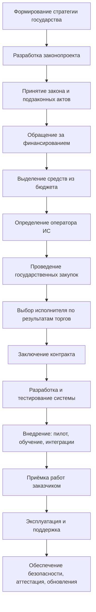
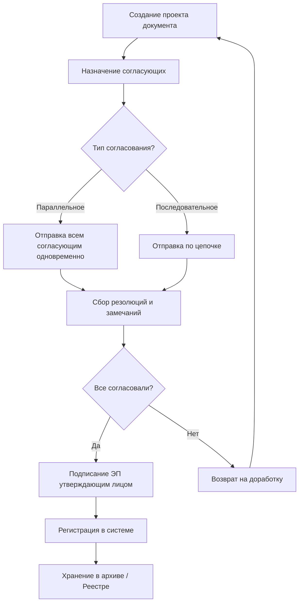

---
title: Государство и цифровая экономика
---

# Государство и цифровая экономика

  ДЛЯ НОВИЧКОВ
  НЕ ОБЯЗАТЕЛЬНО
  В РАЗРАБОТКЕ

Всем

## Государство

**Государство** — это сложившаяся во времени политическая структура, обладающая суверенитетом на определённой территории. Оно имеет территорию, граждан, систему управления, право собирать налоги и монополию на применение силы в рамках закона. Государство обеспечивает безопасность, поддерживает правопорядок, регулирует экономику, предоставляет услуги населению — от образования до здравоохранения.

**Гражданское общество** — это совокупность добровольных некоммерческих объединений людей - неправительственные организации, профсоюзы, фонды, медиа, религиозные группы, ассоциации граждан, сообщества по интересам.

И эти два понятия, фактически, связаны и составляют основу экономики - взаимодействие государства и общества обеспечивают гармоничное функционирование, которое может быть преимущественно с государственной ролью или с ролью общества.

Деньги у государства формируются из налогов, пошлин и сборов, штрафов, внутренних облигаций, внешних займов и, что важно - от государственных активов. Это дивиденты от госпредприятий, аренда государственного имущества, продажа ресурсов (например, нефть, газ). Все эти полученные деньги государство распределяет по своим соответствующим функциям, предоставляя услуги населению, усиливая безопасность и регулируя экономику. Расходы и доходы в совокупности представляют собой бюджет, дефицит которого возникает, когда расходы превышают доходы. Для его покрытия государство берёт кредиты, увеличивая государственный долг.

Учитывая такую роль государства, цели государства можно разделить на основные и второстепенные. Основными являются защита границ, поддержание порядка, создание и соблюдение законов, защита прав человека, развитие инфраструктуры, регулирование рынков, образование, здравоохранение, пенсионное обеспечение. Второстепенными являются специфические цели - развитие науки и технологий, укрепление международных позиций, поддержка культуры, политическая стабильность - такие цели уже зависят от формы правления, экономического развития и культурных особенностей страны.

И все эти сферы требуют оптимизации, автоматизации и цифровизации. К примеру, Российская Федерация уже достигла очень больших целей, и сейчас уже сложно представить нашу жизнь без цифровых технологий, ведь охвачены все ключевые отрасли:
	- Оборона - системы управления войсками, разведка, связь;
	- Промышленность - «умное» производство, автоматизация, интернет вещей;
	- Строительство и архитектура - BIM-технологии, цифровые карты;
	- Медицина - электронные карты пациентов, аналитика;
	- Образование - онлайн-обучение, цифровые платформы, системы оценки;
	- Правосудие и правоохранительные органы - учёт, документооборот;
	- Экология и ЖКХ - мониторинг состояния окружающей среды, умные сети.

Государства активно внедряют информационные системы (ИС) для повышения эффективности, доступности услуг и качества жизни граждан.

Целью создания ГИС (государственных ИС) являются:
	- повышение эффективности государственного управления;
	- упрощение взаимодействия между государством и гражданами;
	- автоматизация рутинных процессов;
	- обеспечение прозрачности и контроля за выполнением функций;
	- централизация данных и обеспечение их безопасности.

Например, «Госуслуги» позволяют получить сотни услуг онлайн, не выходя из дома, что экономит время и деньги гражданам и государственным службам.

В любой ГИС участвуют следующие стороны:
	- граждане получают услуги через ИС (за исключением закрытых систем);
	- органы власти собирают, обрабатывают данные, оказывают услуги;
	- операторы ИС поддерживают работоспособность систем;
	- разработчики и поставщики ПО создают и внедряют решения;
	- независимые эксперты и регуляторы контролируют соблюдение требований, проводят аудит.

Оператор ИС — это юридическое лицо, ответственное за функционирование информационной системы. Это может быть учреждение, корпорация, частная компания. Оператор отвечает за техническое обслуживание, защиту информации, своевременное обновление и логистику взаимодействия с пользователями.

ГИС могут быть организованы в разных форматах:
	- Единая система (монопольная) - одна централизованная система.
	- Распределённые системы - множество связанных систем, работающих на уровне субъектов РФ или муниципалитетов.
	- Облачные сервисы - целые инфраструктуры облачного характера;
	- Мобильные приложения (обычно это дополнения к основным системам).
	- API-интерфейсы - позволяют другим системам взаимодействовать с ГИС.

***В разработке***

Технический контроль со стороны государства за государственными и корпоративными информационными системами.

Сертификация

Аттестация

Проверки

ФСТЭК

***В разработке***

Обычно схема такая:

1. Руководством страны задаётся направление или концепция развития.

---

2. Определяется уполномоченные за направление органы или структуры, которые занимаются исследованием темы, формулированием предложений и подготовкой законопроекта.

Здесь обосновывается необходимость, выполняется анализ потребностей, формирование требований, выбор технологии и платформы, а в исключительных случаях может быть даже проектирование архитектуры.

---

3. Инициатор подаёт законопроект в парламент для утверждения и дальнейшего подписания руководством страны - после этого законопроект становится законом.

---

4. Закон, как правило, определяет, какую систему нужно сделать, и кто будет её ответственным за такую систему. В идеале - определяется ещё и оператор. Но законы бывают разные, так что тут всё зависит от содержания.

Согласно закону, эстафета передаётся ответственному - обычно органу власти, который уже регулирует особенности планирования и развития согласно основной задачи. К примеру, определяется, как должна работать ГИС, какие у неё функции, и кто будет её оператором. Органы власти детализируют основной закон своими приказами и постановлениями - подзаконными актами.

---

5. Но одного закона недостаточно - согласно набору «закон+подзаконный акт», формируется обращение в финансовые органы власти, которые отвечают за бюджет. Из казны выделяются деньги на проектирование, разработку, внедрение и поддержку системы. Финансовые органы будут давать деньги не просто так, они будут требовать детальные периодические отчёты по потраченным средствам, по работе системы, будут проводить аудит и контролировать исполнение.

---

6. Оператор получает финансирование и приступает к разработке. Но особенность государственной разработки в том, что у государства нет возможности конкурировать по оплате труда с бизнесом, поэтому основной штат сотрудников органов власти и операторов, как правило, содержит лишь ключевые должности, не связанные с разработкой - это могут быть начальники, специалисты, эксперты, юристы, бухгалтера, техподдержка, безопасники и администраторы. Среди них, как правило, нет аналитиков и разработчиков - это бывает лишь в редких и дорогих проектах.

Поэтому оператору потребуется найти разработчиков-профессионалов. Тут он выходит на рынок, объявляет торги с установленной начальной ценой - вступает работа системы закупок услуг, работ, товаров для государственных и муниципальных нужд. Бизнес, который обладает разработчиками и ресурсами, принимает участие в таких торгах. Победитель определяется согласно правилам - для аукциона побеждает самая низкая цена, для конкурса - лучшие условия.

С победителем торгов заключается контракт, где указывается, что организация-победитель должна выполнить соответствующие работы, оказать услуги или поставить товары. Контрактов может быть много, это может быть закупка техники и серверов, получение лицензий, разработка и внедрение системы как целиком, так и по модулям.

---

7. Исполнитель разрабатывает и внедряет систему, и как раз у такой организации всё может быть «по-айтишному» - с анализом, разработкой, тестированием. На вырученные с исполнения контракта деньги исполнитель будет закупать всё необходимое, оплачивать разработку и, конечно, получать прибыль.

Внедрение - это переход от проекта к практическому использованию системы. Такой этап включает в себя подготовку инфраструктуры, настройку интеграций с другими системами, обучение сотрудников, пилотный и полноценный запуски.

---

8. После исполнения контракт, результат принимается заказчиком - оператором, для чего и проводятся различные приёмки, испытания, проверки - процедуры, которые позволяют убедиться, что работы, товары, услуги соответствуют требованиям заказчика.

---

9. Когда система готова и внедрена, оператору остаётся лишь поддерживать её и защищать. Поддержка ИС — это постоянная работа над улучшением и стабильностью системы, а защита информации подразумевает шифрование, выработку ролевой модели, аудит действий пользователей, антивирусную защиту, резервное копирование и сертификацию по ФСТЭК и ФСБ (это службы, которые выставляют требования к безопасности государственных систем).

---

---

В основном, государственные ИС занимаются цифровизацией, которая подразумевает перевод существующих процессов в электронный вид. Процессы переводятся в режим «онлайн», а бумажные документы становятся электронными.

Документ — это зафиксированная информация, которая может быть использована для передачи знаний, принятия решений или выполнения каких-либо действий. В традиционном понимании документы могут быть бумажными, содержать текст, графики, изображения и другие формы данных.

Электронный документ — это информация, зафиксированная в электронной форме и предназначенная для обработки компьютером (ЭВМ), а не только для чтения человеком. Хотя человек тоже может его прочитать, основное назначение электронного документа — быть понятным машине, чтобы автоматизировать процессы обмена данными между системами. Обычно электронные документы бывают именно формата XML, так как PDF не является машиночитаемым (и распознание здесь не поможет). PDF и копия документа в виде сканированного файла, электронный образ документа, который уже есть на бумаге, называется скан-образом. А электронный документ является изначально цифровыми данными.

Электронный документооборот представляет собой процесс обращения, обработки и передачи документов. Это включает создание, утверждение, передачу, хранение и уничтожение документов в соответствии с установленными процедурами и правилами, а также взаимодействие между участниками различных процессов в ходе работы.

К примеру, документ сначала формируется, затем согласуется между определённым кругом лиц, и лишь потом подписывается утверждающим лицом. Подписываются электронные документы при помощи электронной подписи. 

В документообороте важнейшим (и сложнейшим) элементом является согласование документации. Это может быть процесс ознакомления, верификации, визирования, проверки компетентными лицами определенной информации с положительным или отрицательным результатом, и резолюцией (комментарием). Допустим, нужно согласовать ответ на обращение – ответственный исполнитель готовит проект ответа, а начальники отделов проверяют и визируют документ, после чего документ с листом согласования отправляется к руководителю.

Согласование может быть последовательным и параллельным. При последовательном согласовании документ отправляется всем согласующим одновременно, а при последовательном – по определенной очереди. В сфере айти распространены системы, обеспечивающие цифровизацию и автоматизацию процессов в электронном документообороте, в том числе и согласования – тогда система практически имитирует реальный процесс, но позволяет сократить время за счет быстрого ознакомления и использования приложения в электронном виде – вычеркивается весь сопутствующий расход ресурсов на беготню, очереди, беседы и т.п. Но это ближе к бизнесу, чем к государству. Органам власти нецелесообразно использовать готовые коробочные решения.

Такие документы, наряду с другими сведениями, хранятся в специальных реестрах. Государственные реестры — это централизованные базы данных, в которых хранится официальная информация, имеющая юридическую силу. Они служат основой для предоставления государственных услуг, контроля и регулирования различных отраслей. Примеры - ЕГРН, ЕГРЮЛ, ЕГРИП, реестры лицензий. Эти реестры интегрируются между собой и предоставляют данные через API или другие механизмы, позволяя создавать единую цифровую экосистему.

---

---

А что такое государственная услуга?

Государственная услуга — действие (или комплекс действий), совершаемое органом власти для достижения определённого правового результата для гражданина или организации. К примеру, выдача паспорта, регистрация автомобиля, запись ребёнка в детский сад. 

Согласно Федеральному закону №210-ФЗ, государственные и муниципальные услуги предоставляются в соответствии с административными регламентами. Административный регламент — это официальный документ, устанавливающий порядок предоставления государственной или муниципальной услуги. Он включает в себя перечень необходимых документов, сроки оказания услуги, требования к взаимодействию с заявителем, процедуры проверки и принятия решений, возможность получения услуги онлайн, порядок обжалования действий.

Большинство ГИС как раз рассчитаны на интеграцию с порталом «Госуслуги», чтобы создать «единое окно» для подачи обращений, что делает взаимодействие с государством проще и быстрее.

Но если не касаться услуг, а затронуть тему регулирования и цифровизацию сопутствующих процессов, то нужно упомянуть стандарты.

Стандартизация — ключевой элемент цифровизации государственных процессов. Без единых стандартов невозможно обеспечить межведомственное взаимодействие, обмен данными и автоматизацию. Это форматы данных, протоколы обмена, методологии разработки, технические стандарты безопасности, процессные стандарты. И если, к примеру, Agile, Waterfall, DevOps являются некими «общественными» стандартами, не подкрепленными государством, то существуют и госстандарты (они в основном отраслевые). Стандартизацией в РФ занимаются Минцифры России, Росстандарт. 

Некоторые стандарты перенимаются из зарубежной практики от международных организаций (ISO, IEC, ITU).
