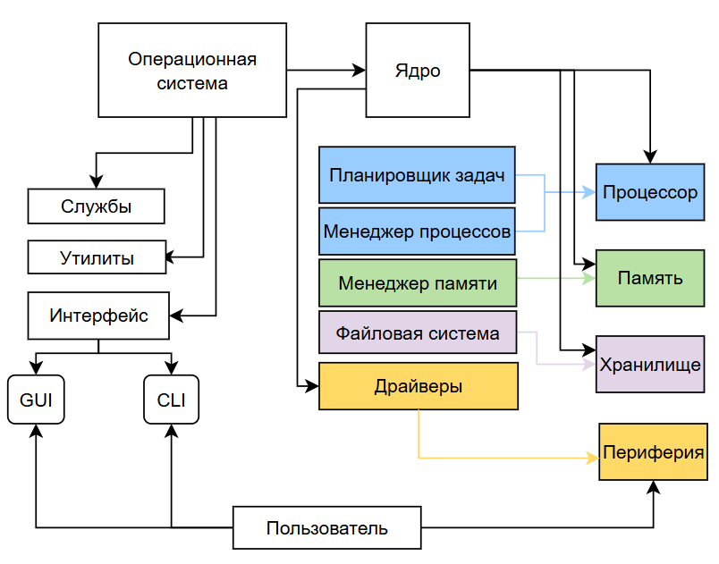

import BIOSemulator from '@site/src/components/BIOSemulator.js';

# Операционные системы

  ОБЯЗАТЕЛЬНО
  ДЛЯ НОВИЧКОВ

Разработчику
Архитектору
Инженеру

## Операционные системы

### Что такое ОС?

★ **Операционная система** – самая главная программа, которая управляет всеми процессами в компьютере, обеспечивая работу оборудования, запуск приложений и взаимодействие пользователя с техникой. Без ОС компьютер – просто набор «железа», которое не понимает команд. Именно операционная система, словно душа, «оживляет» компьютер, превращая его в полезный инструмент.

ОС выполняет ключевые задачи:
	- *Управление железом* (процессором, памятью, дисками, ввод и вывод);
	- *Запуск и работа программ* (браузер, текстовый редактор, игры);
	- *Организация файлов* (хранение, поиск, копирование);
	- *Обеспечение безопасности* (разграничение прав пользователей, защита от вирусов);
	- *Сетевые функции* (подключение к сети).
	
---

### Как работает ОС?

ОС – посредник между пользователем, программами и железом, и состоит из следующих компонентов:
	- **Ядро** (Kernel) – сердце ОС, отвечает за базовые операции: управление памятью, процессами, драйверами;
	- **Драйверы** – программы для работы с устройствами (видеокарта, принтер, сетевая карта);
	- **Интерфейс** – позволяет пользователю взаимодействовать с системой, к примеру, вся возможность работать через графический интерфейс в Windows. Интерфейс может быть графическим (GUI – Graphic User Interface) и командным (Command Line Interface).
	- **Системные службы** – фоновые процессы (обновления, резервное копирование, сетевое соединение);
	- **Системные утилиты** – программы, которые позволяют выполнять базовые операции и обслуживать систему (форматирование диска, диспетчер задач, терминалы, архиваторы, антивирусы);
	- **Файловая система** – система связи с носителями информации, использующая API для доступа к файлам (NTFS, FAT32, ext4).

★ **Службы** – фоновые программы, которые работают без участия пользователя. Например, сетевые службы DHCP, DNS, службы печати для управления принтерами, или планировщик задач для автозапуска программ.

★ **Файловая система** определяет способ хранения данных на диске:
	- *FAT32* — старая, поддерживается везде, но не работает с файлами `>`4 ГБ.
	- *NTFS* (Windows) — поддерживает шифрование, большие файлы, права доступа.
	- *ext4* (Linux) — журналируемая, устойчивая к сбоям.
	- *APFS* (macOS) — оптимизирована для SSD, быстрая работа с файлами.
	- *exFAT* — для флешек и внешних дисков (поддержка больших файлов).

ОС контролирует процессы, при помощи встроенных **менеджеров**. Можно выделить четыре основных вида:
	- *Менеджер процессов* распределяет ресурсы CPU и RAM между программами;
	- *Планировщик задач* решает, какая программа будет выполняться в определенный момент;
	- *Менеджер памяти* следит, чтобы приложения не «съели» всю оперативную память;
	- *Диспетчер устройств* управляет подключенным оборудованием.

Операционная система работает с устройством при помощи инструкций. И в первую очередь, зависима от архитектуры процессора, от неё зависит скорость работы, энергопотребление и совместимость.

★ **Архитектура процессоров** бывает нескольких видов:

1. x86 – старая архитектура с разрядностью в 32 бита. Поддерживает меньше ОЗУ (до 4 ГБ), медленная, и встречается на старых моделях процессоров вроде Intel Pentium или AMD Athlon.
2. x64 – современная версия x86, с разрядностью в 64 бита, сейчас используется почти на каждом ПК, сервере или ноутбуке, где процессоры линейки Intel Core i3/i5/i7/i9 или AMD Ryzen.
3. ARM64 – более энергоэффективная архитектура с разрядностью в 64 бита, но используется на смартфонах, планшетах, Apple M1/M2, и на некоторых серверах.

**Важно**: программы собираются под определённую архитектуру, и не все поддерживают совместимость с разными версиями, к примеру, некоторые новые программы не запустятся на x86 без «танцев с бубном».

---

### Возможности ОС

Операционная система — это базовый программный уровень, управляющий аппаратными ресурсами компьютера и предоставляющий интерфейсы для взаимодействия с ними. Она служит мостом между пользователем или приложением и «железом», обеспечивая структурированный доступ к вычислительным мощностям. Мы уже вкратце упомянули некоторые задачи ОС. 

Но что же можно делать при помощи ОС?
	- использовать средства для взаимодействия пользователя с системой (графический или текстовый);
	- управлять процессором, памятью, дисками, сетевыми адаптерами и другими компонентами;
	- распределять ресурсы между выполняющимися задачами;
	- создавать изолированные окружения для программ, чтобы они не могли нарушить работу других частей системы;
	- работать с устройствами через стандартные вызовы, не заботясь о деталях железа;
	- загружать программы из долговременной памяти в оперативную, инициировать их выполнение, организуя обмен данными и завершение;
	- управлять пространством на диске, разрешать конфликты, обеспечивая целостность данных;
	- управлять подключениями, маршрутизацией, шифрованием и обработкой ошибок;
	- возможность добавления или удаления функциональных блоков (например, драйверов) без пересборки всей системы;
	- комбинировать маленькие, специализированные утилиты для решения сложных задач;
	- собирать информацию о состоянии системы, событиях, производительности;

#### Взаимодействие пользователя с системой

Операционная система обеспечивает пользователю средства для управления компьютером и запуска приложений. Это взаимодействие может происходить через графический или текстовый интерфейс.
 
- **Графический интерфейс (GUI)** состоит из окон, значков, меню и указателя мыши. Он реализуется через дисплейный сервер (например, X11 или Wayland в Linux) и среду рабочего стола (GNOME, KDE, Windows Shell, Aqua в macOS).  
- **Текстовый интерфейс (CLI)** представлен терминалом или консолью, где пользователь вводит команды. В Linux и macOS это программы вроде `bash`, `zsh`; в Windows — `cmd.exe` или PowerShell.  
Оба интерфейса используют системные вызовы для выполнения операций, но GUI скрывает сложность за визуальными элементами, а CLI даёт точный контроль над системой.

---

#### Управление аппаратными ресурсами
  
ОС контролирует всё физическое оборудование: процессор, оперативную память, жёсткие диски, сетевые адаптеры, периферию.
  
Ядро ОС содержит подсистемы:
- **Менеджер CPU** — распределяет время процессора между задачами.
- **Менеджер памяти** — выделяет и освобождает участки RAM, использует виртуальную память и подкачку (swap/pagefile).
- **Диспетчер устройств** — взаимодействует с оборудованием через драйверы, абстрагируя детали работы чипсетов и протоколов.
- **Подсистема ввода-вывода** — координирует передачу данных между процессами и устройствами (клавиатура, диск, сеть).

Эти компоненты работают непрерывно, обеспечивая стабильность и эффективность использования «железа».

---

#### Распределение ресурсов между задачами
 
ОС позволяет одновременно выполнять множество программ, справедливо распределяя между ними ресурсы.
 
- **Планировщик задач** определяет, какой процесс получит доступ к CPU в следующий момент, исходя из приоритета, типа задачи (фон/интерактив) и политики планирования (например, CFS в Linux).
- **Выделение памяти** происходит в изолированных адресных пространствах, чтобы одна программа не могла случайно повредить данные другой.
- **Квоты и лимиты** (в корпоративных системах) ограничивают потребление ресурсов конкретными пользователями или службами.

Благодаря этому даже на слабом компьютере можно одновременно просматривать веб-страницы, воспроизводить музыку и писать документ.

---

#### Изоляция программных окружений
 
ОС создаёт изолированные среды выполнения для приложений, предотвращая их взаимное влияние.
 
- Каждый процесс работает в собственном **виртуальном адресном пространстве**.
- Современные ОС применяют **песочницы** (sandboxing): ограничивают доступ приложения к файловой системе, сети, микрофону (пример — App Sandbox в macOS, Windows Defender Application Guard).
- В Linux изоляция усиливается с помощью **namespaces** и **cgroups**, лежащих в основе контейнеров (Docker, Podman).
- Права доступа и привилегии (например, запуск от имени обычного пользователя, а не root/Administrator) дополнительно снижают риски.

Это повышает стабильность и безопасность системы в целом.

---

#### Абстракция работы с устройствами
 
Программы взаимодействуют с оборудованием через стандартизированные интерфейсы, не зная особенностей конкретных моделей устройств.
 
- Ядро предоставляет **унифицированные API** для работы с дисками (`/dev/sda`), сетью (`socket`), принтерами и т.д.
- **Драйверы устройств** реализуют низкоуровневую логику общения с чипсетами, но для приложения они выглядят как стандартный модуль.
- Например, любая программа может записать данные в файл, не зная, используется ли SSD, HDD или сетевой том — файловая система и драйвер абстрагируют эти различия.

Это упрощает разработку ПО и обеспечивает переносимость между разными конфигурациями.

---

#### Загрузка и выполнение программ
  
ОС отвечает за запуск приложений: загрузку кода из долговременной памяти в оперативную, инициализацию и управление жизненным циклом процесса.
  
- При запуске программы ядро считывает её исполняемый файл (например, `.exe` или ELF-бинарник) с диска.
- Выделяет для неё **адресное пространство**, загружает код и данные в RAM.
- Создаёт **процесс** и **поток выполнения**, передаёт управление точке входа (`main()`).
- Организует **механизмы межпроцессного взаимодействия** (pipes, shared memory, sockets) и **обработку завершения** (возврат кода выхода, освобождение ресурсов).

Благодаря этому каждое приложение работает как независимая сущность в рамках единой системы.

---

#### Управление дисковым пространством и целостностью данных
  
ОС организует хранение информации на носителях, предотвращает конфликты и гарантирует сохранность данных даже при сбоях.
  
- **Файловая система** (NTFS, ext4, APFS) определяет структуру каталогов, метаданные файлов, права доступа.
- **Журналирование** (journaling) записывает изменения в лог перед применением, что позволяет восстановить согласованное состояние после аварийного отключения.
- **Блокировки файлов** предотвращают одновременную запись несколькими процессами.
- **Проверка целостности** (например, `fsck` или `chkdsk`) исправляет повреждённые структуры при необходимости.

Это обеспечивает надёжность хранения даже в условиях интенсивной работы.

---

#### Сетевое взаимодействие
  
ОС управляет подключением к сетям, маршрутизацией трафика, шифрованием и обработкой ошибок связи.
  
- **Сетевой стек** реализует протоколы TCP/IP, UDP, ICMP и другие уровни модели OSI.
- **Драйверы сетевых адаптеров** обеспечивают физическую передачу данных.
- **Брандмауэр** (например, `iptables`, Windows Defender Firewall) фильтрует входящие и исходящие соединения.
- **Шифрование** поддерживается на уровне TLS/SSL (в приложениях) или IPsec (на уровне ОС).
- **Маршрутизация** и **NAT** позволяют устройству работать в составе локальной сети и выходить в интернет.

Благодаря этому компьютер становится полноценным участником глобальной или локальной сети.

---

#### Модульность и расширяемость
 
ОС позволяет добавлять или удалять функциональные компоненты без пересборки всей системы.
 
- **Загружаемые модули ядра** (например, `.ko` в Linux, `.sys` в Windows) позволяют подключать драйверы и подсистемы «на лету».
- **Пакетные менеджеры** (APT, YUM, Homebrew, MSI) управляют установкой и удалением программ и библиотек.
- **Плагины и расширения** в пользовательском пространстве (например, драйверы печати, кодеки) дополняют функционал без изменения ядра.

Это делает систему гибкой и адаптируемой под разные задачи.

---

#### Композиция утилит
  
ОС позволяет комбинировать небольшие специализированные программы для решения сложных задач.
  
- В Unix-подобных системах действует принцип: «каждая программа делает одно, но делает это хорошо».
- **Конвейеры (pipes)** связывают вывод одной утилиты со вводом другой: `ls | grep .txt | wc -l`.
- **Перенаправление потоков** (`>`, `>>`, `<`) позволяет работать с файлами как с источниками или приёмниками данных.
- Скрипты (Bash, PowerShell) объединяют последовательности команд в автоматизированные процедуры.

Этот подход лежит в основе мощной и гибкой системной автоматизации.

---

#### Мониторинг состояния и производительности
  
ОС собирает и предоставляет информацию о работе системы: загрузке ресурсов, событиях, ошибках, активности процессов.
  
- **Журналы событий** (systemd journal, Windows Event Log) фиксируют действия ядра, служб и приложений.
- **Утилиты мониторинга**: `top`, `htop`, `iostat`, `netstat`, `Task Manager`, `Activity Monitor` — показывают текущее состояние.
- **Счётчики производительности** (performance counters) предоставляют данные для анализа и диагностики.
- **Интерфейсы для сбора метрик** (например, `/proc` и `/sys` в Linux) позволяют сторонним инструментам (Prometheus, Zabbix) получать данные в реальном времени.

Это помогает администраторам и разработчикам поддерживать стабильность и выявлять узкие места.

---

### Загрузка ОС

**Загрузка операционной системы** — это последовательный процесс инициализации аппаратного обеспечения и передачи управления от микропрограммы к программному ядру, а затем к пользовательским службам и интерфейсу. Этот процесс начинается с момента включения питания компьютера и завершается готовностью системы к взаимодействию с пользователем.

<BIOSemulator />

**BIOS (Basic Input/Output Система)** — устаревшая, но всё ещё встречающаяся микропрограмма, хранящаяся в энергонезависимой памяти материнской платы. При включении питания BIOS выполняет следующие действия:
- Проводит **POST (Power-On Self-Test)** — проверку работоспособности основных компонентов: процессора, оперативной памяти, видеокарты, клавиатуры.
- Инициализирует минимально необходимые устройства ввода-вывода.
- Ищет **загрузочное устройство** по заранее заданному порядку (обычно: жёсткий диск → USB → CD/DVD → сеть).

**UEFI (Unified Extensible Firmware Interface)** — современная замена BIOS, обладающая расширенными возможностями:
- Поддерживает диски объёмом более 2 ТБ благодаря использованию таблицы разделов GPT вместо MBR.
- Обеспечивает более быстрый запуск за счёт оптимизированной инициализации оборудования.
- Включает встроенный менеджер загрузки, безопасную загрузку (Secure Boot), графический интерфейс и сетевые функции.
- Может выполнять приложения непосредственно из прошивки (например, диагностические утилиты или веб-браузер).

Обе системы — BIOS и UEFI — завершают свою работу, передавая управление **загрузчику**, расположенному на выбранном загрузочном устройстве.

**Загрузчик (Bootloader)** — специальная программа, хранящаяся в загрузочном секторе диска (MBR или EFI-раздел). Она отвечает за подготовку среды для запуска ядра операционной системы.

Примеры загрузчиков:
- **GRUB (Grand Unified Bootloader)** — используется в большинстве Linux-дистрибутивов. Поддерживает выбор между несколькими установленными ОС, редактирование параметров загрузки, восстановление системы.
- **Windows Boot Manager** — стандартный загрузчик Windows, интегрированный с UEFI и поддерживающий Secure Boot.
- **rEFInd** — альтернативный загрузчик для macOS и Linux на Mac-устройствах.
- **LILO** — устаревший загрузчик для Linux, почти не используется в новых системах.

Загрузчик:
- Читает конфигурационные файлы (например, `/boot/grub/grub.cfg` в Linux).
- Загружает образ ядра (`vmlinuz`) и начальный RAM-диск (`initramfs`) в оперативную память.
- Передаёт управление ядру, указывая корневую файловую систему и параметры запуска.

После получения управления **ядро ОС** начинает инициализацию:
- Настраивает базовые подсистемы: управление памятью, планировщик задач, виртуальную файловую систему (VFS).
- Загружает необходимые **драйверы устройств** — либо встроенные, либо из `initramfs`, если корневая файловая система находится на сложном хранилище (LVM, RAID, шифрованный диск).
- Монтирует **корневую файловую систему** (`/`) в режиме только для чтения, затем переключает её в полноценный режим записи.
- Выполняет проверку целостности файловой системы (например, через `fsck` в Linux).

На этом этапе система уже способна работать на уровне ядра, но пользовательские процессы ещё не запущены.

После успешной инициализации ядро запускает **первый пользовательский процесс**, традиционно называемый **init**. Этот процесс имеет PID = 1 и является родителем всех остальных процессов в системе.

Разные ОС используют разные реализации init:

- **systemd** — современная система инициализации в большинстве Linux-дистрибутивов. Управляет службами, монтированием, сетью, журналом событий (через `journald`). Запускает графическую оболочку (например, GNOME или KDE) через дисплейный менеджер (`gdm`, `sddm`).
- **launchd** — система инициализации в macOS и iOS. Отвечает за запуск фоновых служб, демонов, агентов пользователя и приложений при входе в систему.
- **services.exe** — компонент Windows NT, управляющий системными службами, драйверами, сеансами пользователей и графической подсистемой Win32.

Init-процесс:
- Запускает системные службы (сетевые интерфейсы, cron, SSH, печать).
- Инициализирует графическую подсистему (если используется).
- Предлагает пользователю экран входа (login screen) или автоматически авторизует его.
- Готовит окружение для запуска приложений.

После завершения работы init-процесса система считается полностью загруженной и готовой к использованию.

---

### Обновления и жизненный цикл ОС

Операционные системы регулярно получают исправления, новые функции и обновления безопасности в рамках своего жизненного цикла.

**Жизненный цикл операционной системы** — это период от её первого официального выпуска до прекращения поддержки разработчиком. В течение этого времени ОС получает регулярные обновления, исправления ошибок, улучшения безопасности и новые функции. После завершения жизненного цикла система больше не получает обновлений, что делает её уязвимой и потенциально непригодной для использования в современных условиях.

**Цикл поддержки** определяет, сколько лет после релиза операционная система будет получать официальные обновления от разработчика. Он делится на несколько фаз:

- **Активная поддержка** — полный набор обновлений: исправления, новые функции, улучшения интерфейса, драйверов и производительности.
- **Поддержка только безопасности** — прекращается выпуск новых функций, но продолжаются патчи, закрывающие критические уязвимости.
- **Конец поддержки (End of Life, EOL)** — все обновления прекращаются. Использование такой системы становится рискованным.

Примеры:
- **Windows 10** — поддержка завершилась в октябре 2025 года.
- **Ubuntu LTS (Long-Term Support)** — поддержка длится 5 лет с возможностью продления до 10 лет через Extended Безопасность Maintenance (ESM).
- **macOS** — Apple обычно поддерживает последнюю версию и две предыдущие, но точные сроки зависят от аппаратной совместимости.
- **RHEL (Red Hat Enterprise Linux)** — стандартный цикл составляет 10 лет, включая фазы Full Support, Maintenance Support и Extended Life Phase.

Операционные системы получают обновления разных категорий, каждая из которых решает определённую задачу.

**Патчи безопасности** — исправления, направленные на устранение уязвимостей, которые могут быть использованы злоумышленниками для получения несанкционированного доступа, выполнения кода или кражи данных. Такие обновления часто выпускаются в рамках «Patch Tuesday» (например, Microsoft) или по мере обнаружения угроз.

**Функциональные обновления** — добавляют новые возможности, улучшают пользовательский интерфейс, расширяют поддержку оборудования или вводят новые API для разработчиков. Пример: переход с Windows 10 версии 21H2 на 22H2.

**Сервис-паки** — крупные накопительные обновления, объединяющие множество исправлений, улучшений и иногда даже изменений в архитектуре системы. В современных ОС концепция сервис-паков уступила место непрерывному потоку обновлений (rolling updates), но в корпоративных системах (например, Windows Server) они всё ещё актуальны.

**Обновления ядра и драйверов** — особенно важны в Linux-системах, где ядро может обновляться независимо от пользовательского окружения. В Windows и macOS такие компоненты обновляются как часть системного пакета.

Выбор между автоматическими и ручными обновлениями зависит от требований к стабильности, безопасности и контролю над системой.

**Автоматические обновления** обеспечивают максимальную защиту и удобство. Система сама загружает и устанавливает патчи без участия пользователя. Это особенно важно для домашних устройств и рабочих станций, где безопасность критична, а технические знания ограничены.

> НО! В 2024-2026 годах Microsoft наглядно показала миллионам пользователей, что автоматическое принудительное обновление системы влечёт не только безопасность и свежесть функций, но и проблемы. Например, если в обновлении будет сломана часть системы, то она сломается у всех пользователей.

**Ручные обновления** дают администратору полный контроль над тем, когда и какие изменения применяются. Это необходимо в корпоративной среде, где каждое обновление должно пройти тестирование на совместимость с внутренним ПО, оборудованием и бизнес-процессами. Ручное управление также позволяет отложить обновление, если оно вызывает регрессии или конфликты.

Некоторые ОС предлагают гибридный подход:
- **Windows** — позволяет откладывать функциональные обновления на несколько недель, но критические патчи безопасности устанавливаются принудительно.
- **Linux (Debian/Ubuntu)** — через `unattended-upgrades` можно настроить автоматическую установку только обновлений безопасности.
- **macOS** — разделяет обновления безопасности и крупных версий, позволяя устанавливать первые автоматически, а вторые — вручную.

---