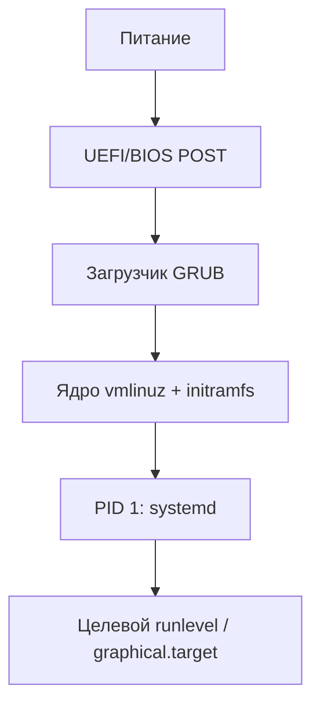

# Загрузка операционной системы Linux

  ОБЯЗАТЕЛЬНО
  ДЛЯ НОВИЧКОВ

Разработчику
Архитектору
Инженеру

## Процесс загрузки Linux

Загрузка операционной системы Linux представляет собой последовательную цепочку этапов, каждый из которых готовит среду для следующего. Этот процесс начинается в момент подачи электропитания на компьютер и завершается предоставлением пользователю рабочей среды. Понимание каждого этапа помогает диагностировать проблемы запуска, настраивать параметры системы и осознанно подходить к администрированию.

Связано: [определение ОС](./1), [ядро](./3), [жизненный цикл процесса](./5114).

### Аппаратная инициализация и прошивка

При включении компьютера процессор начинает выполнение инструкций с фиксированного адреса памяти, где размещена микропрограмма материнской платы. Современные системы используют два стандарта прошивки: устаревающий BIOS и современный UEFI. BIOS работает в 16-битном режиме реального адреса, имеет ограничения по адресации памяти и использует таблицу разделов MBR. UEFI функционирует в 32- или 64-битном защищённом режиме, поддерживает большие диски через таблицу разделов GPT и предоставляет расширенные возможности взаимодействия с оборудованием до запуска операционной системы.

Прошивка выполняет самотестирование оборудования (POST), инициализирует базовые компоненты: процессор, память, шину ввода-вывода. Затем прошивка обращается к энергонезависимой памяти CMOS, где хранятся настройки конфигурации системы, включая порядок загрузочных устройств. Прошивка последовательно опрашивает устройства в указанном порядке, проверяя наличие загрузочного сектора или EFI-совместимого загрузчика. При обнаружении подходящего носителя управление передаётся первой стадии загрузчика.

### Загрузчик — первая и вторая стадии

Загрузчик обеспечивает переход от среды прошивки к операционной системе. Наиболее распространённым решением в дистрибутивах Linux выступает GRUB 2. Этот загрузчик организован в несколько стадий из-за ограничений, накладываемых архитектурой загрузки.

Первая стадия размещается в первых 446 байтах главной загрузочной записи диска (для систем с BIOS) или в специальном разделе EFI System Partition (для UEFI). Размер первой стадии строго ограничен, поэтому она содержит минимальный код для загрузки следующей части. При использовании BIOS первая стадия считывает дополнительные блоки с диска, расположенные сразу после MBR в так называемой области между загрузочной записью и первым разделом. При UEFI первая стадия представляет собой исполняемый файл в формате PE/COFF, размещённый в каталоге /EFI/дистрибутив/ на разделе ESP.

Вторая стадия загрузчика загружает конфигурационные файлы из каталога /boot/grub/. Эти файлы содержат описание доступных ядер, параметры загрузки, информацию о расположении корневой файловой системы. Вторая стадия предоставляет пользователю интерфейс выбора операционной системы или ядра, позволяет редактировать параметры загрузки вручную, загружать модули для работы с различными файловыми системами. Загрузчик определяет расположение файла ядра и initramfs на диске, подготавливает окружение для передачи параметров ядру и передаёт управление точке входа ядра.

### Загрузка ядра и начального образа памяти

Ядро Linux представляет собой монолитный исполняемый файл, обычно размещённый в каталоге /boot под именем vmlinuz-версия. Современные ядра сжаты алгоритмом gzip, lz4 или zstd для экономии места. Загрузчик распаковывает ядро в оперативную память и передаёт ему управление. Параллельно загружается начальный образ памяти (initramfs или initrd), представляющий собой архив cpio, содержащий минимальную файловую систему в оперативной памяти.

Initramfs решает критическую задачу: ядро само по себе не содержит драйверов для всех возможных контроллеров дисков и файловых систем. Без возможности обратиться к корневому разделу система не может продолжить загрузку. Initramfs включает необходимые модули ядра, утилиты для определения оборудования, скрипты для сборки виртуальной файловой системы. Ядро монтирует initramfs как временную корневую файловую систему и запускает скрипт /init, который определяет реальное расположение корневого раздела, загружает требуемые драйверы, расшифровывает зашифрованные разделы при необходимости и готовит переход к основной файловой системе.

### Инициализация ядра

После передачи управления ядро начинает выполнение функции start_kernel. Этот этап включает настройку внутренних структур данных ядра: таблицы процессов, планировщика задач, подсистемы управления памятью. Ядро инициализирует аппаратные прерывания, таймеры, многопроцессорную поддержку на системах с несколькими ядрами процессора. Подсистема управления памятью настраивает виртуальную адресацию, организует пулы памяти для различных целей.

Ядро перечисляет оборудование через шины PCI, USB, ACPI, создаёт представление устройств в виртуальной файловой системе /sys. Для каждого обнаруженного устройства ядро пытается загрузить соответствующий модуль драйвера. Драйверы регистрируют свои возможности, создают точки доступа в /dev. Сетевые интерфейсы, дисковые контроллеры, графические адаптеры получают базовую инициализацию. Ядро устанавливает обработчики системных вызовов, настраивает механизмы межпроцессного взаимодействия.

Завершающим шагом инициализации ядра становится запуск первого пользовательского процесса. Традиционно этим процессом выступал init с идентификатором PID 1, в современных системах чаще используется systemd. Ядро передаёт управление этому процессу, завершая свою часть загрузочной последовательности. Все последующие действия выполняются в пространстве пользователя под управлением первого процесса.

### Запуск первого процесса и монтирование корневой файловой системы

Первый процесс получает управление с уже смонтированным корневым разделом. В случае использования initramfs происходит смена корневой файловой системы с временной на постоянную через системный вызов switch_root. Этот механизм перемещает процессы и точки монтирования из временной среды в основную файловую систему, после чего временная файловая система уничтожается.

Systemd как первый процесс начинает работу с анализа параметров командной строки ядра, определения целевой загрузки (цели). Цель представляет собой концептуальное состояние системы: графический интерфейс, многопользовательский режим, режим восстановления. Каждая цель определяется юнитом с расширением .target и указывает зависимости — другие юниты, которые должны быть активированы для достижения этого состояния.

Systemd параллельно активирует необходимые юниты: монтирует файловые системы, указанные в /etc/fstab, запускает системные службы, настраивает сеть. Механизм зависимостей позволяет оптимизировать порядок запуска: службы, не зависящие друг от друга, стартуют одновременно. Systemd отслеживает состояние каждого юнита, перезапускает упавшие процессы согласно политике, предоставляет единый интерфейс управления через команду systemctl.

### Инициализация системных служб и окружения

После монтирования всех файловых систем systemd активирует базовые системные службы. Служба systemd-udevd запускает демон управления устройствами, который реагирует на появление и исчезновение оборудования, создаёт узлы устройств в /dev, применяет правила именования. Служба systemd-journald инициализирует подсистему журналирования, создаёт буферы для сбора сообщений ядра и пользовательских процессов.

Сетевая подсистема получает конфигурацию через NetworkManager или systemd-networkd. Эти службы определяют доступные интерфейсы, применяют настройки из конфигурационных файлов, запускают DHCP-клиент при необходимости, устанавливают маршруты. Служба локального разрешения имён systemd-resolved настраивает кэширование DNS-запросов. Служба времени systemd-timesyncd синхронизирует системные часы с сетевыми серверами.

Криптографические службы инициализируют генераторы случайных чисел, обеспечивают доступ к аппаратным модулям безопасности. Службы аутентификации настраивают механизмы входа пользователей, загружают конфигурацию PAM. Система логирования принимает сообщения от всех компонентов, классифицирует их по приоритету и источнику, сохраняет в бинарном журнале или перенаправляет в традиционные текстовые файлы /var/log/.

### Достижение целевого состояния

Целевое состояние определяет конечную конфигурацию системы после загрузки. Основные цели включают:

- **Графическая цель** обеспечивает запуск дисплейного менеджера, предоставляющего графический интерфейс входа в систему. Эта цель активирует все зависимости многопользовательной цели и добавляет службы, необходимые для работы графической подсистемы.
- **Многопользовательская цель** представляет текстовый многопользовательский режим с сетевыми возможностями. Эта цель активирует сетевые службы, службы аутентификации, системные демоны, но не запускает графическую подсистему.
- **Цель восстановления** предоставляет минимальную среду с корневой оболочкой для диагностики и исправления проблем. Сетевые службы и большинство демонов в этом режиме не запускаются.

Systemd последовательно активирует все зависимости выбранной цели. Каждый юнит проходит стадии загрузки: анализ конфигурации, разрешение зависимостей, запуск процесса, ожидание готовности. Юниты типа сокета активируют точки прослушивания до запуска соответствующих служб, что позволяет запускать процессы по требованию при первом обращении к сокету. Юниты типа устройства отслеживают появление оборудования и активируют связанные службы автоматически.

### Предоставление пользовательского интерфейса

При достижении графической цели запускается дисплейный менеджер: GDM, SDDM, LightDM или другой. Дисплейный менеджер инициализирует графический сервер X11 или Wayland, определяет доступные сеансы, отображает графический интерфейс входа. Пользователь вводит учётные данные, система проверяет их через PAM, создаёт сеанс пользователя с собственным окружением.

Для текстового режима активируется менеджер терминалов getty на виртуальных консолях. Getty отображает приглашение входа, принимает имя пользователя и пароль, запускает оболочку после успешной аутентификации. Количество активных консолей определяется конфигурацией, обычно шесть текстовых консолей и одна графическая.

После входа пользователя запускается выбранный сеанс: рабочий стол, оконный менеджер или просто оболочка. Сеанс инициализирует пользовательские службы через systemd --user, загружает настройки из домашнего каталога, запускает автозагружаемые приложения. Система достигает полностью рабочего состояния, готового к взаимодействию с пользователем.

### Особенности загрузки в различных сценариях

Загрузка системы с зашифрованным диском требует дополнительного этапа расшифровки. Initramfs содержит утилиту cryptsetup и скрипты для запроса пароля или ключа. После ввода пароля расшифровывается раздел, содержащий корневую файловую систему, и загрузка продолжается стандартным образом. Некоторые системы используют сетевую загрузку пароля через TPM или внешние устройства.

Системы с программным RAID или LVM требуют сборки логических томов до монтирования корневой файловой системы. Initramfs включает утилиты mdadm для программного RAID и lvm для управления логическими томами. Скрипты автоматически обнаруживают метаданные RAID или группы томов LVM, собирают массивы или активируют тома, после чего корневой раздел становится доступен для монтирования.

Загрузка в виртуальной машине использует паравиртуализированные драйверы для ускорения операций ввода-вывода. Ядро определяет среду виртуализации через CPUID или специальные регистры, загружает модули виртуальных устройств. Процесс загрузки ускоряется за счёт отсутствия аппаратной инициализации реальных контроллеров, но сохраняет ту же логическую последовательность этапов.

### Диагностика процесса загрузки

Понимание этапов загрузки позволяет эффективно диагностировать проблемы. Остановка на этапе прошивки указывает на аппаратные неисправности или неправильные настройки BIOS/UEFI. Отсутствие меню загрузчика говорит о повреждении загрузочного сектора или неправильной конфигурации загрузчика. Ошибки ядра во время распаковки или инициализации проявляются сообщениями на консоли, часто с указанием отсутствующего модуля или неподдерживаемого оборудования.

Проблемы с initramfs проявляются невозможностью найти корневой раздел или расшифровать зашифрованный том. Сообщения об ошибках монтирования указывают на повреждение файловой системы или отсутствие необходимых драйверов в образе. Сбои при запуске первого процесса могут быть вызваны повреждением бинарного файла /sbin/init или отсутствием критических библиотек.

Современные системы предоставляют механизмы диагностики: режим подробного вывода при загрузке, возможность редактирования параметров ядра в меню загрузчика, аварийный режим с корневой оболочкой. Эти инструменты позволяют администратору вмешаться в процесс загрузки на любом этапе, исправить конфигурацию или восстановить систему.

Процесс загрузки Linux демонстрирует продуманную архитектуру, где каждый этап решает конкретную задачу и передаёт управление следующему компоненту. Эта модульность обеспечивает гибкость: возможность замены загрузчика, использование различных систем инициализации, поддержка сложных конфигураций хранения данных. Понимание полной цепочки загрузки даёт администратору уверенность в управлении системой и способность решать нестандартные задачи конфигурации.

---

## Детали работы загрузчика GRUB 2

Загрузчик GRUB 2 организован как многоступенчатая система, где каждая ступень решает конкретную задачу ограниченными ресурсами. Первая ступень размещается в главной загрузочной записи диска или в специальном разделе EFI System Partition. Её размер строго ограничен: 446 байт для BIOS-систем или несколько килобайт для UEFI-образа. Этот код выполняет минимальные действия — определяет геометрию диска, считывает следующую ступень с заранее известного смещения.

Вторая ступень загрузчика загружает ядро образа из каталога /boot/grub/i386-pc/ для архитектуры x86 или из /boot/grub/x86_64-efi/ для UEFI. Эти модули реализуют поддержку файловых систем, сжатия, шифрования. Модуль для работы с файловой системой ext4 позволяет загрузчику напрямую обращаться к файлам ядра без знания их физического расположения на диске. Модуль криптографии обеспечивает расшифровку зашифрованных разделов до передачи управления ядру.

Конфигурационный файл /boot/grub/grub.cfg формируется автоматически утилитой grub-mkconfig на основе шаблонов из каталога /etc/grub.d/ и настроек из /etc/default/grub. Этот файл описывает меню загрузки, параметры ядра, расположение образов initramfs. При обновлении ядра пакетный менеджер дистрибутива автоматически вызывает обновление конфигурации загрузчика, добавляя новую запись в меню без удаления предыдущих версий. Такая политика позволяет откатиться к рабочей версии ядра при возникновении проблем с новым выпуском.

Загрузчик поддерживает интерактивный режим работы. Удержание клавиши Shift при загрузке на системах с BIOS или нажатие клавиши Esc на системах с UEFI прерывает автоматический запуск и отображает меню выбора. В этом меню пользователь может выбрать альтернативное ядро, режим восстановления или отредактировать параметры загрузки. Редактирование параметров полезно для временного отключения проблемных модулей, изменения уровня детализации вывода или указания альтернативного корневого раздела.

### Параметры командной строки ядра

Ядро Linux принимает параметры командной строки, которые определяют поведение системы на ранних этапах загрузки. Эти параметры передаются загрузчиком и обрабатываются функцией parse_args в исходном коде ядра. Параметр root указывает устройство, содержащее корневую файловую систему. Устройство может задаваться по имени /dev/sda2, по UUID диска или по метке раздела. Использование UUID обеспечивает надёжность при изменении порядка подключения дисков.

Параметр init указывает путь к первому пользовательскому процессу. По умолчанию используется /sbin/init, но в режиме восстановления может применяться /bin/bash для получения корневой оболочки без запуска системных служб. Параметр systemd.unit определяет целевое состояние системы — графический интерфейс, многопользовательский режим или аварийный режим. Параметр quiet подавляет подробный вывод ядра на консоль, оставляя только критические сообщения. Параметр splash активирует графический сплэш-скрин во время загрузки.

Специальные параметры помогают диагностировать проблемы аппаратного обеспечения. Параметр nomodeset отключает загрузку драйверов графической подсистемы KMS, что полезно при конфликтах с видеокартами. Параметр acpi=off полностью отключает подсистему управления питанием, параметр noapic отключает расширенный контроллер прерываний. Параметр mem= указывает объём оперативной памяти, который ядро должно использовать, игнорируя остальную память — это помогает изолировать проблемы, связанные с неисправными модулями памяти.

Параметры отладки включают earlyprintk для вывода сообщений ядра до инициализации консольного драйвера, параметр debug активирует расширенное логирование подсистем ядра. Параметр systemd.log_level=debug увеличивает детализацию сообщений демона инициализации. Все параметры разделяются пробелами и передаются ядру как единая текстовая строка.

### Структура и содержимое initramfs

Initramfs представляет собой архив в формате cpio, сжатый алгоритмом gzip, lz4 или zstd. Этот архив распаковывается ядром в оперативную память и монтируется как временная корневая файловая система. Размер типичного initramfs составляет от 30 до 100 мегабайт, в зависимости от включённых модулей и утилит. Содержимое архива формируется утилитой dracut, mkinitcpio или update-initramfs в зависимости от дистрибутива.

Каталог /usr/lib/dracut/modules.d/ в системах на базе dracut содержит модули, каждый из которых отвечает за определённую функциональность. Модуль kernel-modules загружает драйверы устройств хранения данных. Модуль lvm активирует логические тома при использовании менеджера логических томов. Модуль cryptsetup обеспечивает расшифровку зашифрованных разделов через LUKS. Модуль Сеть добавляет поддержку сетевой загрузки корневой файловой системы по протоколу NFS или iSCSI.

Скрипт /init внутри initramfs выполняет последовательность действий. Сначала скрипт монтирует виртуальные файловые системы /proc, /sys, /dev для взаимодействия с ядром. Затем скрипт запускает демон udev для обнаружения оборудования и создания узлов устройств. Скрипт определяет корневое устройство через параметр root или через автоматическое обнаружение по метке или UUID. При наличии зашифрованного раздела скрипт запрашивает парольную фразу через консоль или через TPM-чип, расшифровывает раздел и монтирует его.

После успешного монтирования корневой файловой системы скрипт выполняет системный вызов switch_root. Этот вызов перемещает все процессы и точки монтирования из временной файловой системы в постоянную, затем уничтожает содержимое initramfs из памяти. Управление передаётся первому процессу из постоянной корневой файловой системы — обычно /sbin/init или /lib/systemd/systemd.

### Ранняя инициализация systemd

Systemd начинает работу как процесс с идентификатором 1 сразу после передачи управления от ядра. Первым действием systemd становится парсинг параметров командной строки ядра для определения целевого состояния системы. Если параметр не указан, systemd использует символическую ссылку /etc/systemd/system/default.target, которая обычно указывает на graphical.target или multi-user.target.

Systemd параллельно активирует юниты, необходимые для достижения цели. Юниты типа .mount отвечают за монтирование файловых систем, описанных в /etc/fstab. Юниты типа .device отслеживают появление оборудования через подсистему udev. Юниты типа .service запускают системные демоны. Зависимости между юнитами описываются директивами Wants, Requires, After, Before в файлах конфигурации юнитов. Эти директивы позволяют оптимизировать порядок запуска и обеспечить параллельное выполнение независимых задач.

Особую роль играют юниты сокетной активации. Юнит типа .socket создаёт точку прослушивания сокета до запуска соответствующего демона. Когда клиент подключается к сокету, systemd автоматически запускает связанный демон и передаёт ему сокет. Такой подход ускоряет загрузку, так как демоны запускаются только при первом обращении, а не сразу при старте системы. Примером служит демон dbus, который активируется при первом обращении к системной шине сообщений.

Systemd инициализирует контрольные группы (cgroups) для управления ресурсами процессов. Каждый процесс помещается в иерархию контрольных групп, что позволяет ограничивать потребление процессора, памяти, дискового ввода-вывода на уровне служб. Эта функциональность интегрирована в ядро и обеспечивает предсказуемое поведение системы под нагрузкой.

### Сценарии восстановления системы

Режим восстановления активируется выбором соответствующей записи в меню загрузчика или добавлением параметра systemd.unit=rescue.target в командную строку ядра. В этом режиме система монтирует корневую файловую систему в режиме только для чтения, запускает минимальный набор служб и предоставляет корневую оболочку без графического интерфейса. Сетевые интерфейсы не активируются автоматически, что повышает безопасность при работе с потенциально повреждённой системой.

Аварийный режим достигается параметром systemd.unit=emergency.target или добавлением параметра emergency в командную строку. В этом режиме корневая файловая система не монтируется автоматически, пользователь получает оболочку сразу после инициализации ядра. Такой режим применяется для исправления критических ошибок в /etc/fstab или повреждения метаданных файловой системы. Пользователь вручную монтирует корневой раздел в режиме чтения-записи, исправляет конфигурационные файлы и перезагружает систему.

Для диагностики проблем с загрузкой полезен параметр systemd.log_target=console, который направляет все сообщения демона на консоль вместо журнала journald. Параметр systemd.log_level=debug увеличивает детализацию сообщений. Параметр rd.debug активирует отладочный режим в initramfs, выводя каждую выполняемую команду скрипта /init. Эти параметры помогают локализовать точку сбоя в процессе загрузки.

Системы с зашифрованным диском предоставляют резервные механизмы восстановления. При потере парольной фразы можно использовать ключевой файл, размещённый на внешнем носителе, или восстановить доступ через TPM-чип с предварительно сохранённым ключом. Некоторые дистрибутивы поддерживают сетевую загрузку парольной фразы через защищённое соединение к доверенному серверу.

### Безопасная загрузка и измеряемая загрузка

Современные системы поддерживают механизм безопасной загрузки (Secure Boot), встроенный в спецификацию UEFI. Этот механизм проверяет цифровую подпись каждого компонента загрузочной цепочки перед передачей ему управления. Подпись загрузчика проверяется ключами, хранящимися в энергонезависимой памяти материнской платы. Подпись ядра проверяется после загрузки загрузчиком. Только компоненты с действительной подписью получают право выполнения кода.

Microsoft предоставляет централизованную подпись для загрузчиков Linux через программу Windows Hardware Compatibility Program. Дистрибутивы могут использовать эту подпись или создавать собственные ключи и регистрировать их в системе через утилиту mokutil. Пользователь может добавить собственный ключ в список доверенных через интерфейс управления ключами на этапе загрузки.

Измеряемая загрузка (Measured Boot) дополняет безопасную загрузку механизмом аттестации целостности системы. Каждый этап загрузки вычисляет криптографический хэш состояния системы и сохраняет его в доверённом платформенном модуле (TPM). Эти хэши образуют цепочку доверия, где каждый последующий этап включает хэш предыдущего. После полной загрузки система может предоставить удалённому серверу доказательство целостности через протокол аттестации.

### Отладка через последовательную консоль

Серверные системы и встроенные устройства часто не имеют графического вывода. Для диагностики загрузки таких систем применяется перенаправление консоли на последовательный порт. Параметр консоли ядра указывается как console=ttyS0,115200 для COM-порта или console=ttyAMA0,115200 для ARM-устройств. Все сообщения ядра и вывод служб перенаправляются на этот порт.

Для захвата полного лога загрузки применяется параметр earlycon, который активирует консольный вывод ещё до инициализации драйверов устройств. Параметр указывает тип консоли и параметры подключения: earlycon=uart8250,io,0x3f8,115200. Такой подход позволяет зафиксировать сообщения об ошибках инициализации оборудования, которые теряются при стандартной настройке консоли.

Современные системы виртуализации предоставляют виртуальные последовательные порты через протоколы вроде virtio-console. Гипервизор перехватывает вывод консоли гостевой системы и перенаправляет его в файл журнала хоста или в интерфейс управления. Это упрощает диагностику проблем загрузки виртуальных машин без необходимости подключения физических устройств.

### Различия между дистрибутивами

Дистрибутивы Linux применяют различные подходы к организации процесса загрузки. Семейство Red Hat использует утилиту dracut для генерации initramfs с модульной архитектурой. Семейство Debian применяет update-initramfs с более простой структурой скриптов. Архитектура Arch Linux использует mkinitcpio с гибкой системой хуков для кастомизации образа.

Порядок активации служб в systemd может различаться. Некоторые дистрибутивы активируют сетевые интерфейсы до монтирования сетевых файловых систем, другие используют зависимости для строгой последовательности. Политика обработки ошибок монтирования также варьируется: одни системы продолжают загрузку с пропуском проблемного раздела, другие останавливаются в режиме восстановления.

Временные метки событий загрузки сохраняются в журнале systemd и доступны через команду systemd-analyze blame. Эта команда показывает продолжительность активации каждого юнита, что помогает оптимизировать процесс загрузки. Некоторые дистрибутивы по умолчанию отключают медленные службы или применяют отложенную активацию для ускорения предоставления пользовательского интерфейса.

Процесс загрузки Linux представляет собой сложную, но логически выстроенную последовательность этапов. Каждый этап решает конкретную техническую задачу и передаёт управление следующему компоненту с минимальными зависимостями. Эта модульность обеспечивает гибкость конфигурации, возможность диагностики на любом этапе и адаптацию к различным аппаратным платформам и сценариям использования. Понимание внутренней организации загрузочной цепочки даёт системному администратору инструменты для решения нестандартных задач и восстановления работоспособности системы в критических ситуациях.

---
