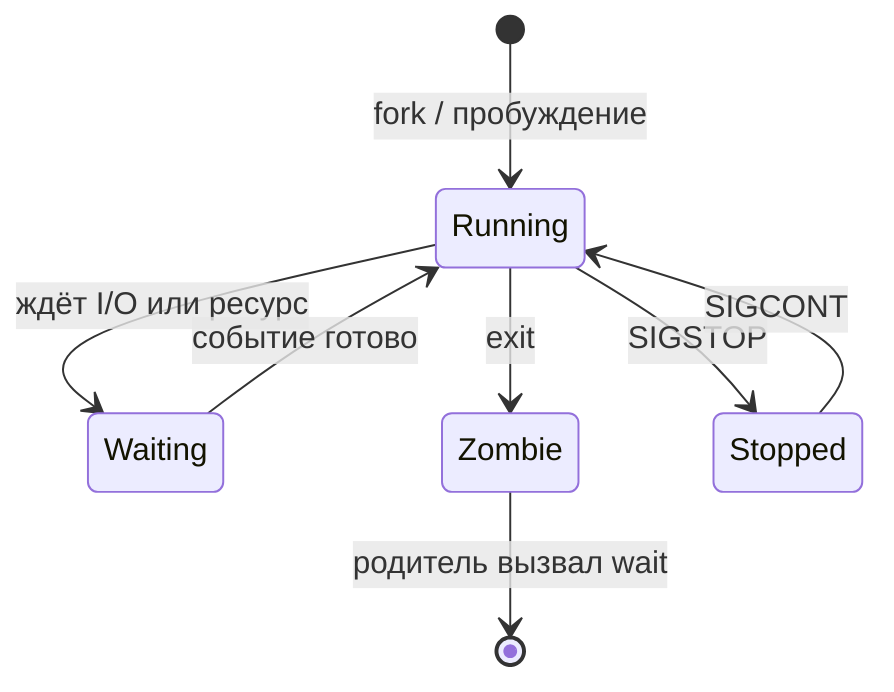

# Жизненный цикл процесса в Linux

<div class="article-tags">
  <span class="tag tag-required">ОБЯЗАТЕЛЬНО</span>
  <span class="tag tag-beginner">ДЛЯ НОВИЧКОВ</span>
</div>

<span class="complexity-badge">Разработчику</span>
<span class="complexity-badge">Архитектору</span>
<span class="complexity-badge">Инженеру</span>

<div class="callout callout--tip">
  <div class="callout-title">Теория и практика</div>

  <div class="callout-body">
  Здесь — **модель** состояний, fork/exec, зомби и сигналы.

  Команды `ps`, `kill`, cgroups и сценарии администрирования — в [управлении процессами](./5115).

  Дескриптор в ядре — [Дескрипторы процессов в Linux](./5111).
</div>
  </div>


---

### Понятие процесса в операционной системе Linux

Процесс представляет собой экземпляр выполняемой программы в операционной системе Linux. Каждый процесс обладает собственным виртуальным адресным пространством, набором ресурсов и состоянием выполнения. Ядро Linux управляет процессами через централизованную структуру данных task_struct, хранящую всю информацию о процессе: идентификатор, состояние, приоритет, указатели на память, открытые файлы, сигналы и другие атрибуты. Эта структура существует в памяти ядра на протяжении всего жизненного цикла процесса и служит основой для планирования, синхронизации и управления ресурсами.

Виртуальное адресное пространство процесса организовано в несколько сегментов. Сегмент кода содержит машинные инструкции программы и обычно помечен как доступный только для чтения. Сегмент данных хранит глобальные и статические переменные, инициализированные значениями из исполняемого файла. Сегмент BSS размещает неинициализированные глобальные и статические переменные. Куча предоставляет динамически выделяемую память через системные вызовы brk и mmap. Стек содержит локальные переменные функций, аргументы вызовов и адреса возврата, растёт в сторону уменьшения адресов. Отображение разделяемой памяти и файлов занимает отдельные области адресного пространства. Такая организация позволяет изолировать процессы друг от друга и обеспечивает стабильность системы при сбое отдельного приложения.

---

### Создание нового процесса

Создание процесса в Linux начинается с системного вызова fork. Родительский процесс вызывает fork, ядро создаёт точную копию вызывающего процесса с новым уникальным идентификатором PID. Дочерний процесс наследует копию виртуального адресного пространства родителя, открытые файловые дескрипторы, переменные окружения, текущую рабочую директорию, маску создания файлов umask и обработчики сигналов. Механизм копирования при записи позволяет избежать немедленного дублирования всей памяти: страницы помечаются как общие между процессами до первого изменения, после чего создаётся отдельная копия изменённой страницы.

Системный вызов vfork представляет оптимизацию для сценариев, когда дочерний процесс немедленно вызывает exec. В отличие от fork, vfork приостанавливает выполнение родительского процесса до завершения exec или exit в дочернем процессе. Адресное пространство не копируется, дочерний процесс временно использует память родителя. Такой подход экономит ресурсы при запуске внешних программ, но требует осторожности в программировании, так как изменения памяти в дочернем процессе влияют на родителя.

Современный подход к созданию процессов использует системный вызов clone с различными флагами. Вызов clone позволяет создавать не только полноценные процессы, но и потоки выполнения с разной степенью разделения ресурсов: общая память, файловые дескрипторы, пространство имён, таблица сигналов. Флаг CLONE_THREAD создаёт потоки в рамках одного группового идентификатора потоков, флаги пространств имён позволяют изолировать сетевые интерфейсы, точки монтирования или пользовательские идентификаторы. Механизм clone лежит в основе реализации потоков в библиотеке pthread и контейнеризации в Docker и LXC.

После создания через fork или clone дочерний процесс обычно заменяет своё адресное пространство новой программой с помощью системного вызова execve или его вариантов (execl, execv, execvp). Вызов execve загружает исполняемый файл, указанный в аргументах, в адресное пространство процесса, заменяя существующий код, данные и стек. Аргументы командной строки и переменные окружения передаются новой программе. Идентификатор процесса PID сохраняется, открытые файловые дескрипторы остаются доступными, если они не помечены флагом close-on-exec. Успешный вызов execve никогда не возвращает управление вызывающему коду, так как старый образ процесса полностью заменяется новым.

Классическая схема запуска внешней программы в Unix:

```c
#include <unistd.h>
#include <sys/wait.h>
#include <stdio.h>

int main(void) {
    pid_t pid = fork();
    if (pid < 0) return 1;
    if (pid == 0) {
        execl("/bin/ls", "ls", "-l", NULL);
        perror("exec");
        _exit(127);
    }
    int status;
    waitpid(pid, &status, 0);
    if (WIFEXITED(status))
        printf("child exit code: %d\n", WEXITSTATUS(status));
    return 0;
}
```

`fork` возвращает **0 в дочернем** и **PID ребёнка в родителе** — по этому различают ветки. `waitpid` забирает статус и убирает зомби.

---

### Состояния процесса в ядре Linux

Ядро Linux отслеживает состояние каждого процесса через поле state в структуре task_struct. Процесс в состоянии TASK_RUNNING готов к выполнению или непосредственно выполняется на процессоре. Планировщик выбирает процессы из очереди готовых для распределения процессорного времени. Процесс переходит в состояние TASK_INTERRUPTIBLE при ожидании события, которое может быть прервано сигналом: завершения операции ввода-вывода, освобождения ресурса, истечения таймера. Такой процесс пробуждается при наступлении ожидаемого события или получении сигнала.

Состояние TASK_UNINTERRUPTIBLE применяется для критических операций ввода-вывода, когда прерывание сигнала может нарушить целостность данных или стабильность драйвера. Процесс в этом состоянии не реагирует на сигналы до завершения ожидаемой операции. Примером служит ожидание ответа от сетевого хранилища или завершения операции записи на медленное устройство. Состояние TASK_STOPPED возникает при приостановке процесса сигналами SIGSTOP, SIGTSTP или при отладке через ptrace. Процесс сохраняет все ресурсы, но не участвует в планировании до получения сигнала SIGCONT.

Завершённый процесс переходит в состояние TASK_DEAD, также известное как состояние зомби. Процесс освобождает почти все ресурсы: память, файловые дескрипторы, таблицы страниц. Ядро сохраняет минимальную запись в таблице процессов, содержащую идентификатор PID, идентификатор родительского процесса PPID, код завершения, накопленное процессорное время в пользовательском и системном режимах. Эта запись необходима родительскому процессу для получения информации о завершении через системные вызовы wait или waitpid. Процесс остаётся в состоянии зомби до момента получения статуса родителем.

В `ps` и `/proc/PID/status` состояние часто кодируется одной буквой:

| Код | Смысл (упрощённо) | Ядро (идея) |
|-----|-------------------|-------------|
| **R** | Running / Ready | Выполняется или готов к CPU |
| **S** | Sleeping | Прерываемое ожидание (I/O, таймер) |
| **D** | Disk sleep | Непрерываемое ожидание I/O |
| **Z** | Zombie | Завершён, ждёт `wait` родителя |
| **T** | Stopped | SIGSTOP / отладка |



---

### Управление выполнением процесса

Планировщик ядра Linux распределяет процессорное время между готовыми процессами согласно политике планирования и приоритету. Каждый процесс обладает статическим приоритетом nice, задаваемым пользователем в диапазоне от минус двадцати до девятнадцати. Положительные значения nice снижают приоритет процесса, отрицательные повышают. Динамический приоритет вычисляется планировщиком на основе статического приоритета, истории использования процессора и типа нагрузки. Интерактивные процессы получают временное повышение приоритета для обеспечения отзывчивости системы.

Политики планирования определяют алгоритм распределения процессорного времени. Политика SCHED_OTHER представляет стандартное время совместного использования с динамическими приоритетами. Политика SCHED_FIFO реализует планирование по принципу первой очереди без квантования времени: процесс выполняется до блокировки или добровольной уступки процессора. Политика SCHED_RR добавляет квантование времени к принципу кругового распределения. Политики реального времени SCHED_FIFO и SCHED_RR требуют привилегий и применяются для критичных к времени задач. Современные ядра используют планировщик Completely Fair Scheduler, стремящийся обеспечить равномерное распределение процессорного времени между всеми процессами.

Переключение контекста происходит при истечении кванта времени, блокировке процесса или пробуждении более приоритетного процесса. Ядро сохраняет регистры процессора, состояние стека и указатель инструкций текущего процесса, восстанавливает соответствующие значения для следующего процесса. Стоимость переключения контекста включает сброс кэшей процессора, переключение таблицы страниц памяти и обновление внутренних структур планировщика. Частые переключения снижают производительность системы, поэтому ядро стремится минимизировать их количество при сохранении отзывчивости.

---

### Завершение процесса и обработка ресурсов

Завершение процесса инициируется вызовом функции exit из пользовательского пространства или системного вызова _exit. Процесс выполняет последовательность действий по освобождению ресурсов. Сначала вызываются обработчики, зарегистрированные через atexit и on_exit, в порядке, обратном регистрации. Затем закрываются все открытые потоки стандартной библиотеки, что приводит к сбросу буферов и фактической записи данных на устройство. Системные вызовы _exit и exit_group немедленно передают управление ядру без выполнения пользовательских обработчиков.

Ядро освобождает динамически выделенную память процесса: кучу, стек, отображённые файлы и разделяемую память. Закрываются все файловые дескрипторы, сокеты и каналы, принадлежащие процессу. Удаляются временные ресурсы: блокировки файлов, семафоры Система V, сегменты разделяемой памяти, если процесс был последним пользователем. Освобождаются ресурсы межпроцессного взаимодействия: очереди сообщений, семафоры POSIX. Ядро обновляет статистику использования ресурсов для родительского процесса и передаёт сигнал SIGCHLD родителю.

Код завершения процесса передаётся родительскому процессу через системные вызовы wait или waitpid. Код представляет восьмибитное значение, возвращаемое из функции main или переданное в exit. Дополнительно ядро сохраняет информацию о причине завершения: нормальное завершение, завершение по сигналу, остановка по сигналу. Для завершения по сигналу сохраняется номер сигнала и флаг создания файла дампа памяти core dump. Накопленное процессорное время разделяется на время в пользовательском режиме utime и время в режиме ядра stime, измеряется в тактах системного таймера или наносекундах в современных ядрах.

---

### Процессы-зомби и процессы-сироты

Процесс переходит в состояние зомби после завершения выполнения и до получения статуса родительским процессом. Зомби не потребляет оперативную память, процессорное время или другие системные ресурсы, за исключением записи в таблице процессов. Запись содержит идентификатор PID, код завершения, накопленное процессорное время и идентификатор родительского процесса. Наличие зомби необходимо для предотвращения повторного использования идентификатора PID до получения информации родителем, что исключает путаницу при отслеживании завершения дочерних процессов.

Накопление зомби происходит при отсутствии обработки сигнала SIGCHLD родительским процессом. Родительский процесс должен вызывать wait или waitpid для получения статуса завершения и удаления записи зомби из таблицы процессов. Автоматическая очистка зомби возможна при установке обработчика сигнала SIGCHLD с флагом SA_NOCLDWAIT или игнорировании сигнала через SIG_IGN. В этом случае ядро немедленно удаляет запись завершённого процесса без сохранения статуса. Такой подход применим для демонов и фоновых процессов, не требующих отслеживания завершения дочерних процессов.

Процесс становится сиротой при завершении родительского процесса до его собственного завершения. Ядро автоматически передаёт сиротские процессы процессу-инициализатору с идентификатором один. Современные системы используют демон systemd или другой процесс инициализации в качестве приёмного родителя. Процесс-инициализатор периодически вызывает wait для сбора статусов завершённых сирот и предотвращения образования зомби. Передача родительства происходит мгновенно при завершении родителя, новые дочерние процессы сироты получают идентификатор родителя равный идентификатору процесса-инициализатора.

Группы процессов и сессии влияют на управление сиротами при работе с терминалами. Процесс, ставший лидером сессии, создаёт новый управляющий терминал. При закрытии терминала все процессы в сессии получают сигнал SIGHUP. Процессы, потерявшие управляющий терминал и не входящие в группу переднего плана, становятся сиротами в контексте управления терминалом. Демоны решают эту проблему двойным вызовом fork: первый порождает процесс, второй завершает родителя, оставляя дочерний процесс без управляющего терминала и с родителем-инициализатором.

---

### Сигналы как часть жизненного цикла

Сигналы представляют механизм асинхронного уведомления процесса о событии. Каждый процесс содержит маску сигналов, определяющую, какие сигналы блокируются от немедленной доставки. Отложенные сигналы сохраняются в очереди процесса до разблокирования или завершения. Обработчики сигналов регистрируются через системные вызовы signal или sigaction, позволяют выполнить пользовательский код при получении сигнала. Сигналы по умолчанию вызывают завершение процесса, остановку или игнорирование в зависимости от типа сигнала.

Сигналы играют ключевую роль в управлении жизненным циклом. Сигнал SIGTERM запрашивает корректное завершение процесса с возможностью выполнения очистки. Сигнал SIGKILL немедленно завершает процесс без возможности обработки, применяется как крайняя мера. Сигналы SIGSTOP и SIGTSTP приостанавливают выполнение процесса, SIGCONT возобновляет выполнение. Сигнал SIGCHLD уведомляет родительский процесс о завершении, остановке или продолжении дочернего процесса. Сигнал SIGHUP информирует процесс об отключении управляющего терминала, часто используется для перечитывания конфигурации демонами.

Поведение процесса при получении сигнала зависит от текущего состояния. Процесс в состоянии ожидания прерываемого события немедленно пробуждается при получении сигнала. Процесс в состоянии непрерываемого ожидания завершает операцию ввода-вывода перед обработкой сигнала. Процесс в состоянии зомби игнорирует все сигналы, так как не выполняет код. Процесс-инициализатор игнорирует все сигналы, кроме SIGKILL и SIGSTOP, обеспечивая стабильность системы при сбоях.

---

### Идентификаторы и иерархия процессов

Каждый процесс обладает уникальным идентификатором процесса PID, присваиваемым ядром при создании. Идентификатор родительского процесса PPID сохраняется в структуре процесса и позволяет восстановить дерево процессов. Групповой идентификатор процесса PGID определяет принадлежность к группе процессов, используемой для управления сигналами и терминалами. Идентификатор сессии SID связывает процессы с управляющим терминалом и определяет поведение при отключении терминала.

Лидер группы процессов создаёт группу через системный вызов setpgid или автоматически при создании новой сессии. Все процессы в группе получают сигналы, отправленные группе через отрицательный идентификатор в kill. Лидер сессии создаёт новую сессию вызовом setsid, получает новый управляющий терминал при открытии устройства терминала. Процессы в одной сессии разделяют управляющий терминал и получают сигнал SIGHUP при его закрытии. Группа переднего плана определяет процессы, имеющие право на чтение из терминала без генерации сигнала SIGTTIN.

Дерево процессов отражает историю создания процессов в системе. Корневой процесс с идентификатором один запускается ядром при загрузке системы и выполняет инициализацию пользовательского пространства. Все остальные процессы порождаются через системные вызовы fork и clone от существующих процессов. Утилиты ps и pstree визуализируют дерево процессов, отображая иерархию родитель-потомок. Ядро поддерживает целостность дерева при завершении процессов, автоматически передавая сирот потомкам процессу-инициализатору.

---

### Демоны и их специфический жизненный цикл

Демон представляет процесс, работающий в фоновом режиме без управляющего терминала. Типичный жизненный цикл демона включает двойной вызов fork для отделения от родительского процесса и терминала. Первый fork создаёт промежуточный процесс, родитель завершается, оставляя дочерний процесс сиротой. Второй fork создаёт процесс-демон, промежуточный процесс завершается, обеспечивая невозможность демону стать лидером сессии. Вызов setsid создаёт новую сессию без управляющего терминала.

Демон изменяет текущую рабочую директорию на корневую файловую систему, предотвращая блокировку точек монтирования. Маска создания файлов umask устанавливается в ноль для полного контроля над правами доступа к создаваемым файлам. Все файловые дескрипторы стандартного ввода, вывода и ошибок закрываются или перенаправляются в файлы журналов или /dev/null. Демон регистрирует обработчик сигнала SIGHUP для перечитывания конфигурации без перезапуска. Сигналы SIGTERM и SIGINT обрабатываются для корректного завершения с освобождением ресурсов.

Современные системы используют менеджеры служб, такие как systemd, для управления демонами. Демон регистрируется как служба с описанием зависимостей, порядка запуска и параметров перезапуска. Менеджер служб отслеживает состояние демона, автоматически перезапускает его при сбое, управляет зависимостями между службами. Демон взаимодействует с менеджером через сокеты, файлы блокировок или системные вызовы sd_notify. Такой подход упрощает управление жизненным циклом демонов и интеграцию с системой инициализации.

---

### Инструменты наблюдения за жизненным циклом

Утилита ps отображает текущее состояние процессов в системе. Параметры определяют формат вывода: идентификаторы, состояние, потребление ресурсов, командную строку. Состояние процесса отображается односимвольным кодом: R для выполняющегося, S для прерываемого ожидания, D для непрерываемого ожидания, Z для зомби, T для остановленного. Утилита top предоставляет динамическое обновление информации о процессах с сортировкой по потреблению процессорного времени или памяти. Утилита htop улучшает представление через цветовую индикацию, дерево процессов и интерактивное управление.

Файловая система /proc предоставляет интерфейс для наблюдения за процессами. Каждый процесс имеет каталог /proc/PID с виртуальными файлами, отражающими состояние процесса. Файл status содержит основные атрибуты: идентификаторы, состояние, родительский процесс, группы. Файл stat предоставляет детальную статистику в машинно-читаемом формате. Файл cmdline хранит аргументы командной строки, environ содержит переменные окружения. Файл fd перечисляет открытые файловые дескрипторы как символические ссылки. Файл maps отображает виртуальное адресное пространство с правами доступа и отображёнными файлами.

Системные вызовы ptrace и strace позволяют отслеживать выполнение процесса на уровне системных вызовов. Вызов ptrace предоставляет отладчику контроль над процессом: чтение и запись памяти, регистров, перехват системных вызовов. Утилита strace использует ptrace для вывода всех системных вызовов процесса с аргументами и возвращаемыми значениями. Такой подход помогает диагностировать проблемы с ресурсами, понять причину зависания или завершения процесса. Утилита lsof перечисляет все открытые файлы процесса, включая сокеты, каналы и устройства, полезна для анализа утечек ресурсов.

---

### Взаимодействие процессов в рамках жизненного цикла

Механизмы межпроцессного взаимодействия влияют на жизненный цикл процессов. Каналы позволяют передавать данные между связанными процессами, созданными через общего родителя. Именованные каналы FIFO обеспечивают взаимодействие между несвязанными процессами через файловую систему. Сокеты домена UNIX предоставляют двунаправленную связь с поддержкой передачи файловых дескрипторов между процессами. Сигналы служат для уведомления о событиях без передачи данных.

Разделяемая память создаёт общую область памяти между процессами, требует синхронизации через семафоры или мьютексы. Семафоры Система V и POSIX координируют доступ к разделяемым ресурсам, предотвращают гонки данных. Очереди сообщений передают структурированные данные между процессами с приоритетами и фильтрацией. Эти механизмы требуют явного освобождения ресурсов при завершении процесса, ядро автоматически очищает ресурсы, принадлежащие только завершённому процессу.

Зависимости между процессами влияют на порядок завершения. Процесс, владеющий ресурсом межпроцессного взаимодействия, должен завершаться последним или передавать владение. Серверные процессы часто создают дочерние процессы для обработки запросов, отслеживают их завершение через обработку SIGCHLD. Клиентские процессы завершаются после получения ответа от сервера или по таймауту. Операционная система не обеспечивает автоматического упорядоченного завершения, приложение само управляет зависимостями через сигналы, файлы блокировок или координацию через разделяемую память.

---

### Завершение работы системы и процессы

При завершении работы системы инициируется упорядоченное завершение всех процессов. Системный менеджер отправляет сигнал SIGTERM всем процессам, ожидая корректного завершения с освобождением ресурсов. По истечении таймаута отправляется сигнал SIGKILL для принудительного завершения оставшихся процессов. Процессы получают сигналы в порядке, определённом системным менеджером, обычно с учётом зависимостей между службами.

Демоны выполняют процедуры завершения: закрытие сетевых соединений, сброс кэшей на диск, удаление файлов блокировок, запись состояния в постоянное хранилище. Базы данных завершают транзакции, создают контрольные точки, обеспечивают целостность данных. Сетевые серверы прекращают приём новых соединений, завершают активные сессии. Процессы, не завершившиеся за отведённое время, принудительно останавливаются сигналом SIGKILL без возможности сохранения состояния.

Порядок завершения критичен для сохранения целостности данных. Службы прикладного уровня завершаются первыми, затем службы инфраструктуры: сеть, файловые системы, менеджеры устройств. Процесс-инициализатор завершает работу последним после остановки всех дочерних процессов. Ядро выполняет окончательную очистку: размонтирование файловых систем, остановку устройств, запись данных кэша на диск. После завершения всех процессов ядро инициирует выключение питания или перезагрузку системы.

---
