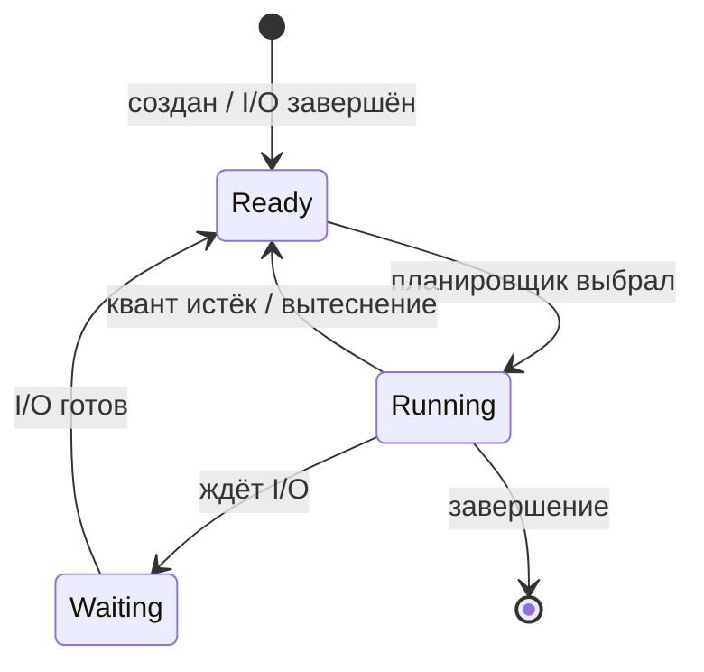

# Планирование процессора — классические алгоритмы

  ОБЯЗАТЕЛЬНО
  ДЛЯ НОВИЧКОВ

Разработчику
Архитектору
Инженеру

---

## Планировщик ОС - как выбирается следующий процесс

**Планировщик (scheduler)** решает, какой процесс или поток получит процессор в следующий момент. Без него многозадачность невозможна: десятки программ "готовы", а ядер — четыре или восемь.

В учебниках сначала разбирают **классические алгоритмы** на бумаге — они просты и показывают компромиссы. В реальных ОС (Linux CFS, Windows) формулы сложнее, но **идеи те же**: квант времени, приоритет, очередь готовых, starvation.

См. также: [управление процессами в Linux](./5115.md), [жизненный цикл процесса](./5114.md), [определение ОС](./1.md).

---

## Модель для анализа

Упростим до **одного CPU** и процессов в трёх состояниях:

**Переключение контекста** — сохранить регистры, счётчик команд, указатель стека текущего процесса и загрузить их для следующего. Стоит микросекунды, но при тысячах переключений в секунду накладные расходы заметны.

| Параметр | Смысл |
|----------|--------|
| **Burst time** | Сколько CPU нужно процессу подряд (в учебниках — заранее известно; в жизни — угадывают) |
| **Квант (time quantum)** | Максимум непрерывной работы в RR |
| **Приоритет** | Число: кто "важнее" |
| **Время ожидания** | Сумма пауз в Ready до первого завершения |
| **Время оборота** | От прихода в систему до завершения |

---

## FCFS — First-Come, First-Served

**Первым пришёл — первым обслужен.** Очередь FIFO, без вытеснения: процесс держит CPU, пока не уйдёт в ожидание I/O или не завершится.

**Плюсы:** простота, справедливость "по очереди".

**Минусы:** **эффект конвоя** — короткая задача ждёт за длинной; плохое время ожидания при смеси batch и интерактивных задач.

**Пример:** процессы P1(24), P2(3), P3(3) — среднее время ожидания (0+24+27)/3 = 17. Если порядок P2, P3, P1 — (0+0+3)/3 = 1.

  
Аналогия

  Одна касса в супермаркете: покупатель с полной тележкой задерживает всех с одной банкой молока.

---

## SJF — Shortest Job First

Выбирается процесс с **наименьшим следующим CPU-burst**.

**Оптимален** по среднему времени ожидания *при известных длительностях*.

**Проблемы:**

- длительность **неизвестна** заранее — используют **экспоненциальное усреднение** прошлых burst (идея перенесена в Unix для прогноза);
- возможно **голодание (starvation)** длинных задач, если постоянно приходят короткие.

**SRTF (Shortest Remaining Time First)** — вытесняющий вариант: если пришла задача с меньшим *оставшимся* временем, текущую прерывают. Ещё лучше по среднему ожиданию, ещё сильнее starvation.

---

## Round Robin (RR)

Каждому процессу в очереди готовых даётся **квант** `q` (типично 10–100 мс в старых системах, в Linux CFS — иная модель).

- Истёк квант → процесс в **конец очереди**, следующий получает CPU.
- Если процесс ушёл в I/O до конца кванта — не наказывается "лишним" переключением в конец (в зависимости от варианта учебника).

**Плюсы:** хороший отклик для интерактивных задач, нет полного starvation.

**Минусы:** при **слишком большом** `q` RR → FCFS; при **слишком малом** — много переключений контекста, падает эффективность.

| Квант | Поведение |
|-------|-----------|
| Очень большой | Почти FCFS |
| Очень маленький | Много overhead, "дробление" CPU |
| Умеренный | Баланс отклик / throughput |

---

## Приоритетное планирование

У каждого процесса **приоритет** (число). CPU получает процесс с наивысшим (или наинизшим — зависит от соглашения) приоритетом.

- **Статический приоритет** — задаётся при создании (системные службы выше пользователя).
- **Динамический** — меняется по поведению (интерактивный → повысить, CPU-bound → понизить).

**Проблема:** **инверсия приоритетов** — высокоприоритетный процесс A ждёт низкоприоритетный B, который ждёт средний C. Решение: **наследование приоритетов** — пока A ждёт B, B временно получает приоритет A (реализовано в Windows и Linux для mutex).

**Голодание:** низкий приоритет никогда не выполняется. **Старение (aging)** — периодически повышать приоритет долго ждущих.

В Linux: `nice` от -20 до +19 влияет на вес в CFS; `chrt` задаёт SCHED_FIFO / SCHED_RR для RT.

---

## Многоуровневая очередь (MLQ)

Несколько очередей с разными политиками:

- **foreground** — RR с малым квантом (интерактив);
- **background** — FCFS с большим квантом (batch).

Процесс **не переходит** между очередями (жёсткая классификация) — просто, но грубо.

---

## Многоуровневая очередь с обратной связью (MLFQ)

Процессы **перемещаются** между уровнями по поведению:

- много CPU подряд → вниз (меньше приоритет, больший квант или наоборот по варианту);
- ждёт I/O → вверх (интерактивный).

**Идея:** автоматически отличить "редактор в браузере" от "рендер видео" без ручной разметки.

Современный **CFS в Linux** — другая математика (виртуальное время `vruntime`), но цель та же: **справедливость и отзывчивость**.

---

## Сравнительная таблица

| Алгоритм | Вытеснение | Starvation | Отклик | Throughput | Нужно знать burst |
|----------|------------|------------|--------|------------|-------------------|
| FCFS | Нет | Нет* | Плохой при конвое | Средний | Нет |
| SJF / SRTF | SRTF — да | Да | Хороший | Высокий | Да (идеально) |
| RR | Да | Нет | Хороший | Зависит от q | Нет |
| Приоритеты | Обычно да | Возможен | Настраивается | Настраивается | Нет |
| MLFQ | Да | Смягчается aging | Очень хороший | Хороший | Нет |

\* длинные задачи не "голодают", но ждут дольше в очереди.

---

## Что в реальных ОС

### Linux — Completely Fair Scheduler (CFS)

- Каждый runnable процесс накапливает **vruntime** пропорционально реальному времени CPU с учётом **веса** (nice, cgroups).
- Следующим обычно выбирают процесс с **наименьшим** vruntime — "кто меньше всего уже получил CPU".
- **Не фиксированный квант** в классическом смысле; переключение при "несправедливости".
- Отдельные классы: **SCHED_FIFO**, **SCHED_RR** для real-time.

Практика: `nice`, `renice`, `chrt`, лимиты `cpu` в cgroups — см. [5115](./5115.md).

---

### Windows

- Планировщик потоков с **приоритетами** (базовый, динамический, boost для foreground).
- **Многоядерность:** affinity, выбор процессора для кэша.
- Подсистема I/O с приоритетами диска.

---

### Связь с I/O

В планировщике CPU процесс в **Waiting** не потребляет квант. Длинные очереди на диске "разгружают" CPU — см. [подсистему I/O](./5120.md).

---

## Упражнение на понимание

Три процесса приходят в момент 0, burst: A=8, B=4, C=2. Сравните **среднее время ожидания** для:

1. FCFS порядок A,B,C  
2. SJF порядок C,B,A  
3. RR с q=2 (нарисуйте диаграмму Ганта)

Ответы помогут почувствовать, почему в продакшене не используют чистый SJF, но **используют идеи** коротких задач и справедливого распределения.

---

## Куда дальше

- Практика Linux: [5115](./5115.md), [5114](./5114.md)  
- Когда процессы ждут друг друга: [тупики](./5119.md)  
- Синхронизация и блокировки: [5118](./5118.md)  
- [Чек-лист](./99.md) — вопросы по планированию

---
