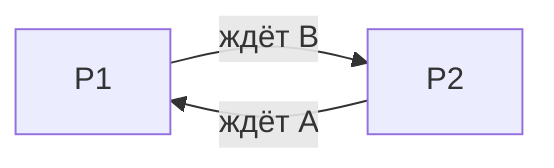

# Тупики (deadlock) и защита от них

<div class="article-tags">
  <span class="tag tag-required">ОБЯЗАТЕЛЬНО</span>
  <span class="tag tag-beginner">ДЛЯ НОВИЧКОВ</span>
</div>

<span class="complexity-badge">Разработчику</span>
<span class="complexity-badge">Архитектору</span>
<span class="complexity-badge">Инженеру</span>

---

## Что такое тупик

**Тупик (deadlock, взаимная блокировка)** — ситуация, когда несколько процессов (или потоков) **навсегда ждут друг друга**, и ни один не может продолжить работу.

Классический пример с двумя мьютексами:

```text
Поток 1: lock(A) → ... → lock(B)
Поток 2: lock(B) → ... → lock(A)
```

Если оба захватили первый замок и ждут второй — **вечное ожидание**.

<div class="callout callout--info">
  <div class="callout-title">Не путать с "mutex"</div>

  <div class="callout-body">
  В статье <a href="./5115.md">5115</a> слово "взаимная блокировка" иногда использовалось в смысле <strong>mutex</strong> (взаимное исключение). В учебниках ОС <strong>deadlock</strong> — отдельная проблема: цикл ожиданий ресурсов. Mutex — средство; deadlock — неправильная схема захвата.
</div>
  </div>


Связано: [синхронизация и гонки](./5118.md), [планирование](./5117.md), [управление процессами](./5115.md).

---

## Ресурсы и типы

**Ресурс** — всё, что выделяется в единственном экземпляре или ограниченно:

- мьютексы, семафоры, блокировки файлов;
- записи в таблице процессов;
- специальные устройства (принтер, лента);
- **страницы памяти** (в теории — при жёстком резервировании).

| Тип | Поведение |
|-----|-----------|
| **Исчерпаемый** | Счётчик: N копий (семафор на N слотов) |
| **Неисчерпаемый** | Один владелец (мьютекс, принтер) |

Deadlock чаще формулируют для **неисчерпаемых** ресурсов с захватом/освобождением.

---

## Четыре условия Кофмана (Coffman)

Тупик **возможен** только если **одновременно** выполнены все четыре:

1. **Взаимное исключение** — ресурс в один момент у одного исполнителя.
2. **Удержание и ожидание (hold and wait)** — держишь один ресурс, ждёшь другой.
3. **Невозможность принудительного отъёма** — нельзя забрать ресурс без согласия владельца (процесс не "выгнали" с mutex).
4. **Циклическое ожидание** — цепочка: P1 ждёт P2, P2 ждёт P3, … Pn ждёт P1.

**Стратегия борьбы:** разрушить **хотя бы одно** условие — тогда deadlock невозможен (в модели).

---

## Граф ожидания (wait-for graph)

Узлы — процессы. Дуга **P1 → P2** означает: P1 ждёт ресурс, удерживаемый P2.

- Если граф **ацикличен** — deadlock нет.
- **Цикл** — deadlock (для одного экземпляра каждого ресурса).

Для **нескольких экземпляров** (например, 3 принтера) используют расширенные модели; в учебниках часто начинают с одного экземпляра.



---

## Пример на псевдокоде

```text
Процесс 1:          Процесс 2:
acquire(mutex_A)    acquire(mutex_B)
acquire(mutex_B)    acquire(mutex_A)   // оба зависли
```

**Исправление:** **глобальный порядок** захвата — всегда сначала A, потом B:

```text
acquire(mutex_A)
acquire(mutex_B)
// ...
release(mutex_B)
release(mutex_A)
```

Это разрушает **циклическое ожидание** (и часто hold-and-wait при дисциплине "захвати всё сразу").

---

## Стратегии обработки

### 1. Игнорировать (ostrich algorithm)

Используется там, где deadlock **редок** и дешевле перезапуск: некоторые embedded, прототипы. **Не** подходит для банковских транзакций.

---

### 2. Предотвращение (prevention)

Разрушить одно из условий Кофмана:

| Условие | Идея |
|---------|------|
| Mutual exclusion | Спулинг принтера — очередь заданий, не прямой захват |
| Hold and wait | **Захват всех ресурсов сразу** перед работой (мало параллелизма) |
| No preemption | **Отъём** у процессов с низким приоритетом (редко для mutex) |
| Circular wait | **Упорядочивание** ресурсов (номера, lock ordering) |

На практике чаще всего — **упорядочивание блокировок** в коде.

---

### 3. Избежание (avoidance) — банкир (Banker's algorithm)

ОС знает **максимальную потребность** каждого процесса и **текущее распределение**. Перед выделением ресурса проверяет: останется ли система в **безопасном состоянии** (существует последовательность завершения всех процессов).

- **Плюс:** не допускает deadlock.
- **Минус:** нужны точные оценки потребности; консервативно; редко в полном виде в desktop ОС.

Полезно на экзамене и для понимания **безопасного состояния**.

---

### 4. Обнаружение и восстановление (detection & recovery)

Периодически строят граф ожидания. Если **цикл** —

- **завершить** один из процессов в цикле (rollback, освободить ресурсы);
- **откатить** транзакцию (СУБД);
- **отобрать** ресурсы (только если модель позволяет).

СУБД и некоторые серверы детектируют deadlock на блокировках строк и **жертвуют** одну транзакцию (victim selection по стоимости отката).

---

### 5. Таймауты

`trylock` с таймаутом — **не гарантия** отсутствия deadlock, но **практическая** защита: через N мс отказ и повтор/логирование. Риск: ложные срабатывания под нагрузкой.

---

## Deadlock и планировщик

Deadlock — **не** то же самое, что "все процессы в очереди Ready". CPU может быть свободен, пока процессы **заблокированы** на mutex. Планировщик [5117](./5117.md) не "чинит" deadlock — нужна политика ресурсов.

**Livelock** — родственная проблема: процессы **не блокированы**, но бесполезно перестраиваются (оба отступают по вежливости) и не продвигаются.

**Starvation** — процесс **ждёт бесконечно** из-за приоритетов, без цикла с другими (не полный deadlock).

---

## В Linux и Windows

- **Ядро** отслеживает **lockdep** (отладка), **futex** с цепочками ожиданий.
- **Пользовательский код** — ответственность разработчика; `pthread_mutex` не предотвращает deadlock.
- **БД:** InnoDB, PostgreSQL — detection + rollback транзакции.
- **Файловые блокировки:** `flock`, `fcntl` — могут участвовать в deadlock при скриптах.

Инструменты: **Thread Sanitizer** (частично), **helgrind**, анализ дампов, `echo w > /proc/sysrq-trigger` (экстренная диагностика ядра — только для опытных админов).

---

## Чек-лист для разработчика

1. Минимизируйте **число** одновременно удерживаемых блокировок.
2. **Один порядок** захвата для всех потоков.
3. **Короткие** критические секции — см. [5118](./5118.md).
4. Избегайте блокировок **под** другой блокировкой без схемы.
5. Для иерархий — **trylock** + откат на уровне бизнес-логики.
6. В распределённых системах — **таймауты** и идемпотентность повторов.

---

## Резюме

| Термин | Смысл |
|--------|--------|
| Deadlock | Цикл "жду тебя, ты ждёшь меня" |
| Coffman | 4 условия — все нужны |
| Prevention | Запретить цикл (порядок lock) |
| Avoidance | Банкир — безопасное состояние |
| Detection | Найти цикл, убить/откатить |

Дальше: [ввод-вывод](./5120.md), [память и замещение страниц](./5121.md), [чек-лист](./99.md).

---

## Практический анти-паттерн

Частая ошибка: сначала писать многопоточную логику, а порядок захвата блокировок "додумать потом".  
Правильный путь: зафиксировать порядок захвата ресурсов до реализации, добавить таймауты и диагностические логи.

Если в проекте уже появились зависания без нагрузки на CPU, первым делом проверяют именно цепочки ожидания и пересечение блокировок.

---
