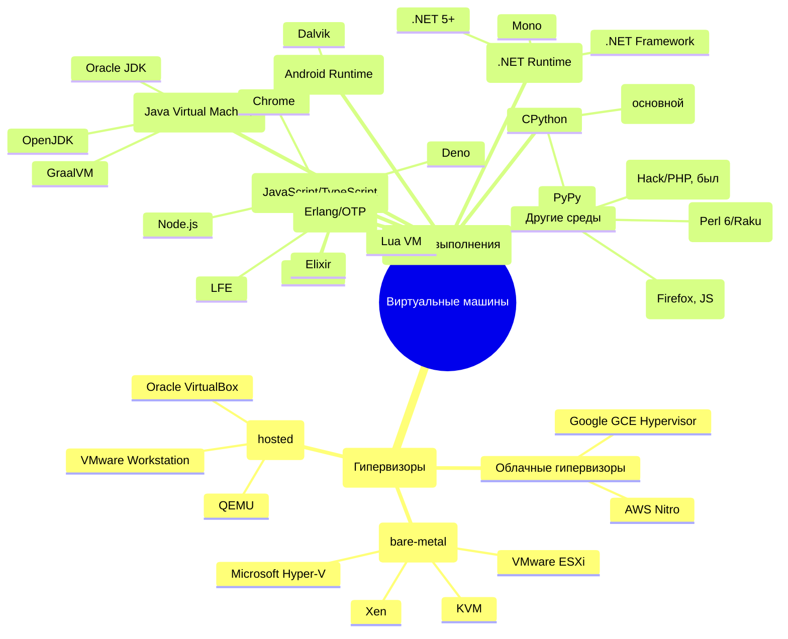

# Платформы в IT

  ОБЯЗАТЕЛЬНО
  ДЛЯ НОВИЧКОВ

Разработчику
Архитектору
Инженеру

## Платформа

### Что такое платформа?

ОС является программным комплексом, который управляет ресурсами компьютера и обеспечивает взаимодействие между пользователем, приложениями и "железом". Но чтобы программа вообще могла запуститься, одного лишь присутствия ОС недостаточно.

Представим себе идеальное приложение, красивое, быстрое, удобное. Но на каком устройстве оно будет работать? На старом ноутбуке с процессором Intel Pentium? На MacBook с Apple M2? На смартфоне Samsung с процессором Snapdragon? Или на сервере в облаке? Каждое из этих устройств имеет:
	- свою архитектуру процессора (x86, x64, ARM);
	- свою операционную систему (Windows, macOS, Android);
	- свои способы взаимодействия с пользователем и оборудованием;
	- свои ограничения по энергопотреблению, памяти, драйверам.
	
Оборудование старого поколения не могут обеспечивать достаточным количеством ресурсов современные программы, так как их платформы, как и программы того же времени, создавались с расчётом на меньшую производительность.

Поэтому и существуют платформы как единый контекст, в котором приложение сможет существовать и корректно функционировать.

★ **Платформа** – сочетание аппаратной части и программной среды, на которой работает приложение. Она включает:
	- Аппаратную часть (процессор, архитектура: x86, x64, ARM);
	- Операционную систему;
	- Среды выполнения (JVM для Java, .NET для C#).
	

Платформы существуют из-за технических ограничений и бизнес-интересов компаний, ведь мир технологий не является единым монолитом, и устройства создаются разными компаниями под свои задачи:
	- настольные ПК - мощные, универсальные, но энергозатратные;
	- мобильные устройства - компактные, требуют энергоэффективности;
	- серверы в первую очередь должны быть надежными и стабильными.

Компании вроде Apple, Microsoft и Google создают собственные платформы, потому что это бизнес:
	- контроль качества обеспечит то, что программа, написанна специально под iPhone, будет работать лучше, чем портированная с Android;
	- создаётся экосистема - пользователь покупает iPhone, потом Mac, потом AirPods и всё будет работать вместе;
	- экономическая выгода - продажа устройств, подписок, сервисов внутри своей платформы.

Apple не хочет, чтобы на её чипах работала Android - потому что тогда исчезнет уникальность её платформы. Microsoft не выпускает Windows для ARM-смартфонов, потому что это не её целевой рынок. Конкуренция формирует границы платформ.

Это и есть первоочередная причина существования платформ - конкуренция. Apple первыми вышли на рынок смартфонов, представив революционный iPhone, вот и держатся. Корпораций множество - Microsoft, Apple, Google, Amazon, Nvidia, Oracle, IBM, HP, Dell, CISCO, Samsung, Xiaomi, Huawei, Sony, и прочие - все они формируют мировой рынок технологий.

Оборудование старого поколения не может обеспечивать достаточным количеством ресурсов современные программы, так как их платформы, как и программы того же времени, создавались с расчётом на меньшую производительность.

---

## Аппаратная часть платформы

### Архитектура процессора

**Архитектура процессора** — набор инструкций и принципов работы центрального процессора, определяющий, какие операции он может выполнять и как взаимодействует с памятью.

Архитектура определяет:
- какие инструкции понимает процессор;
- сколько данных он может обрабатывать за такт;
- как работает с памятью;
- как организованы регистры и кэш.

В настоящее время существуют три основные архитектуры процессоров:
- **x86** — 32-битная архитектура, разработанная компанией Intel;
- **x64** — 64-битная архитектура, расширение x86;
- **ARM** — энергоэффективная архитектура, используемая в мобильных устройствах.

Современные программы не поддерживают архитектуру x86, так как она даёт мало памяти и не имеет новейших инструкций. Программа, скомпилированная под архитектуру x64, не запустится на процессоре ARM без специальных прослоек — таких как Rosetta2 (Apple), QEMU, Proton (Valve).

---

### Аппаратный комплекс

**Аппаратный комплекс** — совокупность физических компонентов компьютера, включающая процессор, память, шины, контроллеры и периферийные устройства.

Аппаратный комплекс представляет собой физическую основу платформы. Устройства представляют собой аппаратную часть с конкретными характеристиками и возможностями.

---

## Программная среда платформы

### Программный комплекс

**Программный комплекс** — совокупность программных компонентов, обеспечивающих функционирование системы. Программный комплекс включает операционную систему, системные службы, библиотеки и утилиты.

Программный комплекс отличается от аппаратного комплекса тем, что аппаратный комплекс представляет собой физические компоненты, а программный комплекс — логические компоненты, работающие на аппаратной основе.

### Операционная система

**Операционная система** — базовый программный комплекс, управляющий ресурсами компьютера и обеспечивающий взаимодействие между пользователем, приложениями и аппаратным обеспечением.

Операционная система включает:
- ядро — центральный компонент, управляющий ресурсами;
- драйверы — программы для взаимодействия с устройствами;
- файловую систему — механизм хранения и организации данных;
- планировщики задач — компоненты для управления процессами.

### Программные интерфейсы

**API (Application Programming Interface)** — интерфейсы, через которые приложение обращается к операционной системе и другим программным компонентам.

Примеры программных интерфейсов:
- **Win32 API** — интерфейсы для приложений на платформе Windows;
- **POSIX** — стандартные интерфейсы для Unix-подобных систем;
- **Cocoa** — интерфейсы для приложений на платформе macOS.

Чтобы приложение сохранило файл на диск, оно вызывает функцию API операционной системы (например, `WriteFile` в Windows или `write()` в Linux). Операционная система через драйвер передаёт команду контроллеру диска. Такой подход обеспечивает безопасность и совместимость.

### SDK (Software Разработка Kit)

**SDK (Software Разработка Kit)** — набор инструментов для разработки программного обеспечения, включающий библиотеки, отладчики и документацию.

SDK предоставляет разработчикам всё необходимое для создания приложений под конкретную платформу.

### UI-фреймворки

**UI-фреймворки** — средства для построения пользовательского интерфейса приложений.

Примеры UI-фреймворков:
- **UIKit** — фреймворк для приложений на iOS;
- **SwiftUI** — современный фреймворк для приложений на платформе Apple;
- **Android Views** — фреймворк для приложений на платформе Android;
- **Qt** — кроссплатформенный фреймворк для десктопных приложений;
- **GTK** — фреймворк для приложений на Linux.

### Стартовое ПО и системные службы

**Стартовое ПО** — фоновые процессы, менеджеры и службы безопасности, обеспечивающие работу системы.

Стартовое ПО включает системные службы, которые запускаются при загрузке операционной системы и обеспечивают её функционирование.

---

## Среда выполнения

### Что такое среда выполнения

**Среда выполнения (runtime environment)** — программный слой, который обеспечивает работу приложения на целевой платформе. Среда выполнения представляет собой специфический механизм, который непосредственно выполняет код приложения.

Программная среда — это всё окружение (операционная система, программные интерфейсы, драйверы, пользовательские интерфейсы), а среда выполнения — более узкое понятие, специфический механизм, который непосредственно выполняет код.

### Типы сред выполнения

Можно выделить следующие типы сред выполнения:

| Тип среды | Примеры | Особенности |
| :--- | :---: | ---: |
| Виртуальная машина | JVM (Java), CLR (.NET) | Исполняет байт-код |
| Интерпретатор | Python, Node.js | Выполняет код построчно |
| Нативная среда | Android Runtime (ART) | Компиляция в машинный код |

**Виртуальная машина** — программная эмуляция компьютерной системы, которая исполняет байт-код. Примеры включают JVM для языка Java и CLR для платформы .NET.

**Интерпретатор** — программа, которая выполняет код построчно, без предварительной компиляции в машинный код. Примеры включают интерпретаторы языков Python и JavaScript (Node.js).

**Нативная среда** — среда выполнения, которая компилирует код в машинный код для конкретной архитектуры процессора. Пример — Android Runtime (ART).

Java-приложение работает на любом устройстве с установленной виртуальной машиной Java благодаря байт-коду, а веб-приложение в браузере использует среду выполнения JavaScript. Языки программирования зачастую имеют свои виртуальные машины, которые обеспечивают корректность работы на конкретном языке.

---

## Экосистема платформы

**Экосистема** — совокупность устройств, сервисов и приложений, работающих в рамках одной платформы и обеспечивающих взаимодействие между собой.

Компании вроде Apple, Microsoft и Google создают собственные платформы, потому что это бизнес:
- контроль качества обеспечивает то, что программа, написанная специально под iPhone, будет работать лучше, чем портированная с платформы Android;
- создаётся экосистема — пользователь покупает iPhone, потом Mac, потом AirPods и всё работает вместе;
- экономическая выгода — продажа устройств, подписок, сервисов внутри своей платформы.

Apple не выпускает устройства с операционной системой Android, потому что тогда исчезает уникальность её платформы. Microsoft не выпускает Windows для ARM-смартфонов, потому что это не её целевой рынок. Конкуренция формирует границы платформ.

Первоочередная причина существования платформ — конкуренция. Корпораций множество — Microsoft, Apple, Google, Amazon, Nvidia, Oracle, IBM, HP, Dell, CISCO, Samsung, Xiaomi, Huawei, Sony и другие — все они формируют мировой рынок технологий.

---

## Основные комбинации платформ

Основные комбинации аппаратной части и программной среды:

| Платформа | Аппаратная часть | Программная среда |
| :--- | :---: | ---: |
| Windows + x86/64 | Процессоры Intel/AMD | Win32 API, .NET |
| macOS + ARM/x86 | Apple Silicon/Intel | Cocoa, SwiftUI |
| Android + ARM | Процессоры ARM | Android SDK, NDK |
| iOS + ARM | Apple Silicon | UIKit, Swift |
| Web + JavaScript | Любой процессор | Браузер |
| Linux + x86/ARM | Intel/ARM | GTK/Qt, Wayland |

---

## Портирование и нативные приложения

### Портирование

**Портирование ПО** — адаптация программы так, чтобы она работала в другой среде. Результат портирования называется портом.

Портирование представляет собой модификацию приложения для работы на другой платформе. Простейший пример — игра "DOOM", разработанная для старых персональных компьютеров, модифицируется так, чтобы могла запускаться на смартфоне.

Приложение, которое было изначально разработано для платформы Windows, но потом воспроизведённое на платформе Linux при помощи инструментов (например, Proton), не является нативным — оно портированное. Игра из Steam, запущенная на Linux через Proton, будет работать, но медленнее, так как является не родной для этой платформы.

### Нативные приложения

Программа, написанная изначально под определённую платформу, будет нативной - иными словами, "родной".

**Нативные приложения** — приложения, написанные специально для конкретной платформы на родном языке и использующие нативные интерфейсы.

Пример нативного приложения — Microsoft Word для платформы Windows, использующий интерфейсы Win32 API и оптимизированный под архитектуру x64.

### Мультиплатформенность и кроссплатформенность

**Мультиплатформенность** — способность программы развернуться и запуститься на разных платформах. Мультиплатформенное приложение имеет отдельные версии для каждой платформы.

**Кроссплатформенность** — способность программы работать единым кодом для разных платформ. Кроссплатформенное приложение использует общую кодовую базу.

Пример мультиплатформенного приложения — Telegram, работающий на разных устройствах отдельными клиентами. Пример кроссплатформенного приложения — Spotify, работающий по единой кодовой базе.

---

## Как работает платформа

Рассмотрим алгоритм работы платформы на примере сохранения файла в приложении Photoshop.

Пользователь кликает мышью по кнопке "Сохранить".

1. Устройство ввода генерирует сигналы, отправленные пользователем, и драйвера в операционной системе их распознают.
2. Операционная система передаёт события ввода графической подсистеме — оконному менеджеру.
3. Оконный менеджер определяет, какое приложение находится под курсором, и передаёт событие ему.
4. Приложение получает событие и вызывает свою логику сохранения.
5. Приложение обращается к программным интерфейсам операционной системы для сохранения файла в папку X.
6. Операционная система проверяет права, вызывает файловую систему, драйвер диска и данные записываются на жесткий диск.

Все эти шаги возможны только потому, что приложение работает в рамках платформы, знает программные интерфейсы и имеет доступ к среде исполнения, совместимой с архитектурой. Никакого прямого доступа к аппаратному обеспечению нет, только через посредников. Именно это и обеспечивает стабильность всей системы.

---

## Целевая платформа и окружение

### Целевая платформа

**Целевая платформа** — конкретная комбинация аппаратной части и программной среды, для которой разрабатывается приложение.

При разработке приложения необходимо определить целевую платформу, чтобы обеспечить совместимость и оптимальную производительность.

### Окружение

**Окружение** — совокупность условий и компонентов, в которых работает приложение. Окружение включает операционную систему, библиотеки, зависимости и конфигурацию.

Окружение определяет, как приложение взаимодействует с системой и какими ресурсами может пользоваться.

{/* sidebar-collections */}
## В подборках

Статья входит в тематические маршруты из меню **Подборки** и блока "С чего начать?" на главной. Соседние шаги того же маршрута:

**Архитектура и проектирование ПО** — [Основы архитектуры](/encyclopedia/4-code-dev/4-04-proekt-i-freymvorki/112), [Программные платформы](/encyclopedia/2-system-network/2-02-platformy/3), [Архитектура персонального компьютера](/encyclopedia/1-basics/1-08-kak-rabotaet-kompyuter/7), [Low-code и No-code платформы](/encyclopedia/8-infra-security/8-02-low-code-no-code/1), [Аутентификация и авторизация](/encyclopedia/2-system-network/2-08-osnovy-informatsionnoy-bezopasnosti/111), [Основы интеграционного взаимодействия — о разделе](/encyclopedia/2-system-network/2-09-osnovy-integratsionnogo-vzaimodeystviya/intro).

{/* /sidebar-collections */}

---
