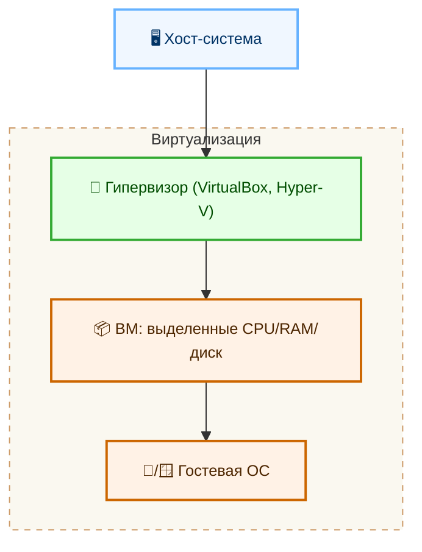
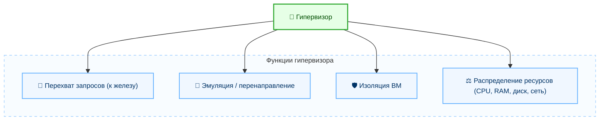
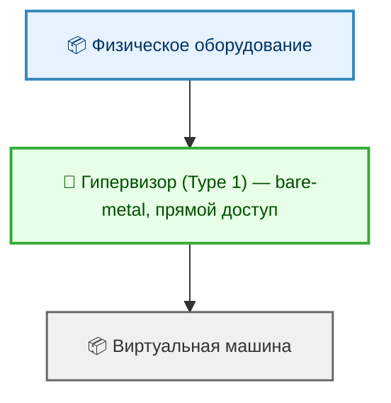
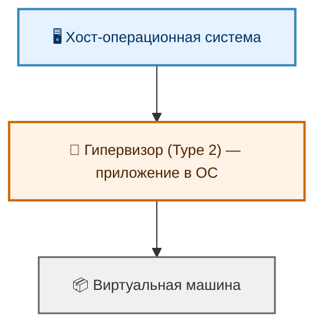

import ExternalPlayEmbed from '@site/src/components/ExternalPlayEmbed';

# Виртуализация

  ОБЯЗАТЕЛЬНО
  ДЛЯ НОВИЧКОВ

Разработчику
Архитектору
Инженеру

---

## Виртуализация

### Как работают виртуальные машины?

★ **Виртуальная машина** – это программная среда, которая эмулирует реальный компьютер с собственной ОС, процессором, памятью и диском, но при этом работает внутри основной системы. ВМ выступает как "контейнер" для ОС.

ВМ позволяет запускать гостевые операционные системы (к примеру, Linux на Windows, macOS на Linux, Windows 11 на Mac) без изменения основной системы. Это как "компьютер в компьютере", но полностью изолированный, управляемый и безопасный. Разумеется, если основная система выключится, то выключится и гостевая.

- **Хост (Host)** - это основная ОС и физическое устройство, на котором запущен гипервизор и ВМ;
- **Гостевая ОС (Guest OS)** - это ОС, которая работает внутри ВМ. Она "не знает" о том, что она является ВМ. Всё эмулируется как настоящее.

На аппаратные ВМ можно установить любую ОС, для которой есть образ - Windows, Linux, FreeBSD, даже старые DOS или OS/2. Главное, чтобы гипервизор поддерживал архитектуру и был достаточно мощный хост.

ВМ работает следующим образом:
	- *Гипервизор* (VirtualBox, Hyper-V) создаёт изолированную "песочницу";
	- ВМ получает выделенные ресурсы (CPU, RAM, диск);
	- Гостевые ОС (Windows, Linux) работают так, будто они на реальном железе.

<ExternalPlayEmbed example="tools-system/hypervisor-play" title="Hypervisor" />

---

### Гипервизор

**Гипервизор** - это специальное ПО или встроенный компонент ОС, которое создаёт, управляет и распределяет ресурсы между виртуальными машинами. Он работает так:
	- перехватывает запросы от гостевой ОС к "железу";
	- эмулирует или перенаправляет эти запросы на физическое оборудование хоста;
	- изолирует ВМ друг от друга, чтобы одна ВМ не могла сломать другую или основную систему;
	- распределяет ресурсы - CPU, RAM, дисковое пространство и сеть.

Гипервизор бывает двух типов:
	- **Тип 1** - Native / Bare-metal, устанавливается напрямую на железо, без основной ОС, что даёт максимальную производительность;
	- **Тип 2** - Hosted, работает как приложение внутри основной ОС. Медленнее, но проще в использовании.

Native / Bare-metal

---

Hosted

---

Например, **VirtualBox**, запускаемая на Windows будет гипервизором типа 2, а ESXi на сервере будет типом 1.

---

### Виртуальные машины

VirtualBox распространяется компанией Oracle, имеет Тип 2, бесплатный, с открытым исходным кодом. Он поддерживает множество гостевых ОС, прост и очень удобен для обучения, тестирования и даже разработки.

**VMware Workstation / Fusion** гипервизоры Типа 2, платные, имеют более высокую производительность, профессиональные функции и отличную поддержку.

**ESXi** - профессиональный гипервизор Типа 1, для серверов, есть бесплатная версия.

**Hyper-V** встроен в Windows 10/11 Pro и Windows Server. Это гипервизор типа 1, но работает поверх Windows, технически как разделённое ядро, очень производительный и рекомендуемый для .NET/Windows разработки.

В Linux-среде можно встретить типичный стек - **libvirt+virt manger + KVM + QEMU**.

**QEMU (Quick Emulator)** - эмулятор процессоров и устройств, может имитировать любую архитектуру, работает самостоятельно или с KVM.

**KVM (Kernel-based Virtual Machine)** - это особый модуль ядра Linux, который превращает Linux в гипервизор Типа 1. Требует поддержки процессора (Intel VT-x / AMD-V) и работает в паре с QEMU.

**libvirt** - набор библиотек и API для управления ВМ через virt-manager (графический интерфейс) или virsh (консоль).

Когда создаётся ВМ, ей выделяются ресурсы из ресурсов хоста:
	- процессор - 1, 2, 4 ядра из общего пула;
	- оперативная память - например, 4 ГБ из 16 ГБ физической памяти;
	- дисковое пространство - создается виртуальный диск (файл .vdi, .vmdk), который эмулирует SSD/HDD;
	- сеть - виртуальный сетевой адаптер, работающий в режиме NAT, моста или изолированной сети.

Ресурсы резервируются статически, если задаются жёсткие лимиты (2 ядра, 4 ГБ, и ВМ не может выйти за эти рамки) и динамически, когда ресурсы могут расширяться и сжиматься в зависимости от нагрузки.

Если выделить слишком много ресурсов ВМ, то основная система (хост) начнёт "тормозить". Виртуализация перераспределяет ресурсы, а не создаёт из воздуха.

---

Виртуальные машины могут быть следующих типов:
	- **Аппаратные (системные)** для запуска целых ОС, к примеру, VirtualBox, VMware, Hyper-V;
	- **Программные ВМ** (для выполнения кода) – JVM, CLR, BEAM.

---

### Аппаратная ВМ

Аппаратные (системные) ВМ предназначены для запуска целых операционных систем. Они эмулируют или виртуализируют всё железо - процессор, память, диски, видеокарту, сеть.

Сама по себе виртуализация тоже бывает нескольких типов:

- **Полная виртуализация** подразумевает, что гостевая ОС "не знает", что работает в ВМ, а гипервизор эмулирует всё железо. Это VirtualBox, VMware Workstation.

- **Паравиртуализация** - гостевая ОС "знает", что работает в ВМ, и оптимизирована для этого, используя специальные драйвверы. Примеры - Xen, KVM с гостевыми драйверами.

Аппаратная виртуализация - процессор (Intel VT-x, AMD-V) помогает гипервизору ускорять работу ВМ. Это и ускоряет работу.

Технология виртуальных машин позволяет, к примеру, протестировать какую-то программу без необходимости приобретать ещё один компьютер, а также изучать другие операционные системы, виртуализировать серверы. Вот примеры:

1. Представим, что у нас организация, в которой есть 10 отделов, и у каждого свои системы, настройки и наборы инструментов. Хотелось бы для каждого иметь свои настройки, ресурсы, и для этого мы можем на один сервер установить 10 виртуальных машин, и никто не будет друг другу мешать, главное, чтобы у основного сервера хватило ресурсов на разделение между 10 гостями.
2. Представим, что у нас на сервере Windows появилась необходимость установить программу, которая работает на Linux, но возможности выделить ещё сервер нет. Можно создать на Windows новую виртуальную машину и установить туда Linux.
3. Нужно развернуть программу, однако она подозрительная, и запуск на основном компьютере несёт риски. Можно создать ВМ, и попробовать работу программы там. В таком случае даже заражение ВМ вирусами или поломка системы не страшна – ведь для основной системы ВМ – просто файл.

**Важно**: виртуализация не подходит для игр – производительность куда ниже.

Пользователь работает с программами внутри гостевой ОС, которая, в свою очередь, работает внутри виртуальной машины, запущенной на основной (хостовой) ОС, которая использует физическое железо.

---

### Программная ВМ

Программная виртуальная машина имеет совсем другие цели. Это среда выполнения, которая интерпретирует или компилирует промежуточный код (байт-код), а не эмулирует железо. Она работает внутри ОС, а не вместо неё.

Они нужны для обеспечения кроссплатформенности, безопасности и упрощения управления памяти. Это своего рода результат эволюции программирования, позволяющий писать не прямые инструкции в процессор, а код на своём языке программирования со своим синтаксисом.

**Важно**: программные ВМ используются не только в компилируемых языках, но и в интерпретируемых. Главное — наличие промежуточного представления кода (байт-кода).

Программист пишет код на языке высокого уровня → компилятор/интерпретатор превращает его в байт-код → программная ВМ (например, JVM) интерпретирует или JIT-компилирует его в машинный код, который выполняется на ОС и железе.

Можно выделить несколько важных для знания программных ВМ.

1. **JVM** — Java Virtual Machine, используется в Java. Она запускает байт-код Java, управляет памятью, безопасностью, многопоточностью. Это позволяет Java-приложениям, скомпилированным на Windows, запускаться на Linux, потому что JVM на Linux "понимает" тот же байт-код.
2. **CLR** - Common Language Runtime (.NET) используется в языках .NET (C#, F#, VB.NET), компилирует IL-код в машинный код через JIT (Just-In-Time), управляет памятью, безопасностью, исключениями.
3. **BEAM** - Erlang Virtual Machine запускает код языков Erlang и Elixir, создана для высоконагруженных, отказоустойчивых систем (телеком, чаты, БД), поддерживает миллионы легковесных процессов и "горячее" обновление кода.
4. **V8** — JavaScript Engine (Google), технически это движок, а не полноценная ВМ, но выполняет ту же роль, компилируя язык JavaScript в машинный код. Используется в Chrome, Node.js, Deno.
5. **Python Virtual Machine (CPython)**, интерпретатор языка Python, компилирует код в байт-код (.pyc) и выполняет его на виртуальной машине.
6. **Dalvik / ART. Dalvik** — интерпретатор, ART — компилятор в нативный код (AOT/JIT). Запускают приложения Android.
7. **Lua VM**, язык Lua, легкая, встраиваемая ВМ для игр, скриптов.

Когда мы будем изучать конкретные языки программирования, мы ещё вернёмся к программным ВМ.

  
Практическое задание

  

Убедитесь, что у вас имеется в распоряжении более, чем 8 ядер процессора и более, чем 16 ГБ ОЗУ.
Если меньше - лучше не пытайтесь выполнять это задание.
Установите себе VirtualBox.
Попробуйте установить Ubuntu.
Если возникнут проблемы, можете отложить установку до главы с системным администрированием.

  

---

## Виртуализация в рабочих задачах

### Где ВМ дают максимальную пользу

- Учебные стенды: можно быстро собрать "лабораторию" из нескольких ОС и безопасно экспериментировать.
- Тестирование релизов: каждая версия проверяется в чистом окружении без влияния старых зависимостей.
- Поддержка legacy-систем: старое приложение можно оставить в изолированной ВМ и не блокировать обновление основной ОС.
- Серверная консолидация: несколько сервисов работают на одном физическом хосте через изолированные гостевые системы.

---

### Пример безопасного эксперимента

Перед запуском неизвестного ПО удобно сделать так:

1. Создать отдельную ВМ с базовой ОС.
2. Отключить общий буфер обмена и общие папки.
3. Включить снапшот перед установкой.
4. Проверить поведение программы.
5. Откатить ВМ к снапшоту.

Этот сценарий сохраняет чистоту основной системы и экономит время на восстановление.

---

### Частые ошибки при работе с ВМ

- Выделять гостевой системе почти всю память и CPU хоста.
- Хранить все виртуальные диски на медленном HDD при интенсивной нагрузке.
- Игнорировать бэкапы виртуальных машин и полагаться только на снапшоты.
- Путать контейнеры и виртуальные машины: это разные уровни изоляции и разные задачи.

---

### Короткий ориентир по выбору

- Для обучения и быстрой проверки подходит `VirtualBox`.
- Для production-виртуализации обычно выбирают `KVM`, `VMware ESXi` или `Hyper-V`.
- Для переносимых сред разработки часто комбинируют ВМ и контейнеры.

---

### Связанные материалы

- Общая картина платформ и сред выполнения: [Платформы в IT](/encyclopedia/2-system-network/2-02-platformy/1).
- Практика серверной платформы в эксплуатации: [Серверные платформы](/encyclopedia/2-system-network/2-02-platformy/111).
- Связь с контейнерной инфраструктурой и DevOps-процессами: [Платформенные решения в бизнесе](/encyclopedia/2-system-network/2-02-platformy/3002).

---

## Снапшоты, шаблоны и жизненный цикл ВМ

### Для чего использовать снапшоты

Снапшот фиксирует состояние виртуальной машины в конкретный момент. Это удобно перед рискованными изменениями:

- установка системных обновлений;
- обновление критичных зависимостей;
- эксперименты с сетевой конфигурацией;
- установка нового серверного ПО.

Снапшот не заменяет полноценный бэкап, но ускоряет откат при ошибках.

---

### Шаблоны ВМ в команде

Для ускорения работы в командах часто используют "золотой образ":

1. Готовят эталонную ВМ с базовой ОС и обязательными инструментами.
2. Очищают чувствительные данные и ключи.
3. Сохраняют образ как шаблон.
4. Клонируют рабочие ВМ из шаблона для новых задач.

Это снижает расхождения между окружениями и делает тесты воспроизводимыми.

---

### Вопросы для самопроверки

1. Где у вас проходит граница между "тестовой ВМ" и "боевой ВМ"?
2. Как вы проверяете, что снапшот действительно пригоден для отката?
3. Какие данные в ВМ нельзя оставлять в шаблоне?
