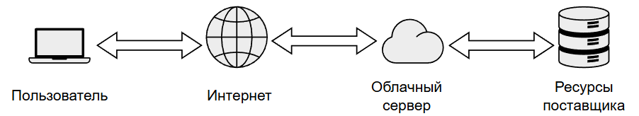

import CloudServiceStackPlay from '@site/src/components/CloudServiceStackPlay.jsx';

# Программные платформы

  ОБЯЗАТЕЛЬНО
  ДЛЯ НОВИЧКОВ

Разработчику
Архитектору
Инженеру

---

## Платформы программных продуктов

### Что такое платформа программного продукта?

В ряде случаев под платформой может пониматься не то, что мы рассмотрели выше, а именно некая совокупность ПО и инструментов, на базе которого собирается определённый функционал. В таком случае программа как таковая остаётся в ядре своём той же, но её возможности адаптируются под пользователя. Всё равно, что сайт остаётся сайтом, но у каждого пользователя интерфейс будет свой – это называется платформы программных продуктов:
	- Коробочные решения – готовые продукты, которые устанавливаются локально (1C: Предприятие, Adobe Photoshop);
	- Облачные SaaS технологии- Google Workspace, Microsoft 365;
	- Облачные PaaS платформы – Heroku, Google App Engine;
	- Гибридные решения – десктоп-приложения на веб-технологиях, мобильные приложения с веб-интерфейсом.

Их называют платформами, потому что это основа, на которой строится функционал, экосистема, включающая сервисы, API, настройки, интеграции. Это гибкая среда, адаптируемая под нужды разных пользователей или компаний, и не является статичным продуктом - скорее это динамическая система, которую можно расширять, кастомизировать и масштабировать. Например, 1С:Предприятие: ядро одно, но конфигурации (бухгалтерия, торговля, ЗП) — разные.

---

### Программный продукт

**Программный продукт** — это завершённое программное обеспечение, прошедшее стадии проектирования, разработки, тестирования и верификации, и поставляемое как единое целое для массового использования. Он обладает чётко определённым назначением, стабильным интерфейсом, документацией и жизненным циклом.

Ключевые свойства программного продукта:

- **Целостность** — он работает как законченная система, не требующая сборки из отдельных компонентов конечным пользователем.
- **Поддерживаемость** — вендор обеспечивает регулярные обновления, исправление уязвимостей, совместимость с новыми версиями ОС и оборудования.
- **Сертификация и соответствие стандартам** — многие продукты (особенно для госсектора, финансов, медицины) проходят независимое тестирование на соответствие ГОСТ, ISO, ФСТЭК или внутренним регламентам заказчика.
- **Лицензирование** — продукт распространяется на условиях лицензионного соглашения: perpetual (бессрочная лицензия), subscription (подписка), freemium (базовая версия бесплатно, расширенная — платно), trial (пробный период).
- **Масштабируемость** — способность работать как на одном компьютере, так и в распределённой инфраструктуре (кластерах, облаках, гибридных средах).
- **Интегрируемость** — наличие открытых API, поддержка стандартов (REST, SOAP, OAuth, OpenAPI), возможность подключения к другим системам через адаптеры и шины.

Программный продукт отличается от *проекта* или *кастомной разработки*: он не создаётся под один конкретный заказ, а проектируется так, чтобы один и тот же код (или его конфигурируемая версия) удовлетворял потребности множества клиентов. Например, Microsoft Office — один и тот же продукт для миллиона организаций, но с разными настройками, языками, лицензиями и политиками.

> ⚠️ Важный момент: даже если продукт поставляется как исходный код (например, open source ERP-система Odoo), он всё равно считается *программным продуктом*, если есть:
> - стабильные релизы (версии: v16.0, v17.1),
> - Планы развития (план развития),
> - issue tracker для ошибок,
> - официальная поддержка (коммерческая или community-based),
> - документация, включая руководства по установке и настройке.

---

### Вендор

**Вендор (Vendor)** — компания-разработчик и поставщик программного обеспечения, которое приобретают другие компании или пользователи для решения своих задач. Именно вендор продаёт, арендует, распространяет свой продукт по подписке, и поставляет обновления, исправления, документацию.

Примеры - Microsoft, Google, Oracle, SAP, Adobe, Autodesk, 1C, Amazon. Крупнейшие корпорации мира стали богатейшими в первую очередь благодаря тому, что они разработали или выкупили успешный программный продукт, развили его как платформу и теперь просто получают пассивный доход.

Вендор несёт ответственность за жизненный цикл программного продукта: от идеи и финансирования разработки до поставки, сопровождения и прекращения поддержки.

Роль вендора многогранна:

- **Разработка и эволюция** — формирование технического видения, управление командами разработки, принятие решений по архитектуре и функционалу.
- **Монетизация** — выбор модели дохода (лицензии, подписка, freemium, usage-based pricing), формирование ценовой политики, управление партнёрской сетью.
- **Сертификация и соответствие** — прохождение аудитов (ISO 27001, SOC 2, GDPR), получение аккредитаций (например, Минцифры РФ для отечественного ПО), адаптация под отраслевые требования.
- **Поддержка и сопровождение** — работа с инцидентами, публикация обновлений безопасности, оказание технической помощи (SLA-гарантии: 99.9% uptime, реакция за 4 часа).
- **Экосистемное развитие** — создание SDK, marketplace для плагинов, партнёрских программ, обучающих курсов, конференций.

Вендор может быть:
- **Независимым разработчиком** (например, JetBrains — создатель IntelliJ IDEA),
- **Глобальным технологическим гигантом** (Microsoft, Google, SAP),
- **Государственной структурой или фондом** (например, "Ростелеком" с платформой "Госключ"),
- **Консорциумом или open-source foundation** (Apache Software Foundation, Linux Foundation).

Вендор определяет не только *что* входит в продукт, но и *как* он развивается. Его решения влияют на совместимость, безопасность, скорость обновлений — и, в конечном счёте, на долгосрочную жизнеспособность всей экосистемы вокруг продукта.

> 📌 Пример:  
> Adobe перешла от коробочной модели (покупка Photoshop CS6 за 10 000 ₽ разово) к подписке (Creative Cloud за 1 990 ₽/мес). Это решение вендора изменило рынок графического дизайна — теперь пользователи получают постоянные обновления, облачное хранилище, интеграцию с другими сервисами Adobe (Figma, Acrobat), но потеряли возможность "купить и забыть". Такой переход стал возможен благодаря тому, что Adobe как вендор контролирует и продукт, и платформу, и каналы распространения.

---

## Виды программных продуктов

**Коробочное ПО (Boxed Software / On-Premises Software)** — программный продукт, который поставляется в виде готового пакета для установки на локальное устройство или сервер компании. Пользователь или компания покупает лицензию (разовую или бессрочную), скачивает или получает на физическом носителе установочный пакет, устанавливает ПО на своё оборудование и настраивает под свои нужды. Это даёт полный контроль над данными и инфраструктурой, но требует своих ресурсов для установки, настройки и обновления.

Часто можно встретить понятие **"On-Premise"** или **"On-Premises"**, модель развёртывания программного обеспечения, при которой всё ПО, данные и инфраструктура размещаются и управляются на собственных серверах и в помещениях организации, а не в облаке у стороннего провайдера. Это как раз и подразумевает, что программный продукт передаётся компании. On-Premises — это локальная модель, где вся ответственность лежит на компании-пользователе.

**SaaS (Software as a Service)** — модель доставки программного обеспечения, при которой приложение размещается в облаке, доступно через интернет, и оплачивается по подписке. Вендор развёртывает и поддерживает приложение на своих серверах, пользователь заходит туда через браузер или мобильное приложение, а данные хранятся в облаке вендора (или в доверенном облаке). Остаётся лишь оплачивать ежемесячно/ежегодно. Не нужно ничего устанавливать, обслуживать, и доступ откуда угодно.

<CloudServiceStackPlay />

**PaaS (Platform as a Service)** — облачная платформа, предоставляющая среду для разработки, тестирования и развёртывания приложений, без необходимости управлять серверами, ОС, сетями. Разработчик пишет код (веб-приложение, API, бот), загружает его на платформу, которая автоматически выбирает среду выполнения, запускает приложение, масштабирует нагрузку, обеспечивает БД, кеши, очереди и прочее. Разработчик лишь платит за эти ресурсы, процессорное время, память и трафик. Можно назвать "облачной мастерской".

Есть и другие "…aaS":

	- IaaS (Infrastructure as a Service) - это предоставление виртуальных серверов, дисков, сетей и балансировщиков. Примеры - AWS EC2, Azure Virtual Machines, Google Compute Engine.
	- DaaS (Desktop as a Service) - виртуальный рабочий стол в облаке. Примеры - Amazon WorkSpaces, Windows 365 Cloud PC.
	- FaaS (Function as a Service) - запуск отдельных функций по событию (serverless). Примеры - AWS Lambda, Azure Functions, Google Cloud Functions.
	- CaaS (Containers as a Service) - управление контейнерами (Kubernetes в облаке). Примеры - AWS ECS, Google Kubernetes Engine, Azure Kubernetes Service.
	- DBaaS (Database as a Service) - облачные базы данных. Примеры - Amazon RDS, Firebase, MongoDB Atlas.

Эта классификация пошла от NIST (Национальный институт стандартов и технологий США) и закрепилась в индустрии как стандарт описания облачных моделей, потому существуют такие понятия.

Гибридные же продукты возникают, когда пользователи хотят быстродействие и оффлайн-доступ (десктоп) + синхронизацию и доступ отовсюду (облако), а компании хотят контроль над данными (локально) + гибкость и масштабируемость (облако). Так мы и получаем, к примеру, Telegram, Steam, и прочие приложения, которые совмещают в себе элементы разных моделей.

Платформы создаются под разные цели — и это важно понимать при выборе решения:
	- разработка, ускорение создания ПО (такие решения имеют SDK, API, шаблоны, хостинг и отладку);
	- бизнес-задачи для автоматизации процессов компании (имеют модули под разные отделы, интеграции и отчётность);
	- работа с клиентами - привлечение, удержание и обслуживание (имеют CRM, чат-боты, аналитику и уведомления);
	- управление компаниями - сквозное управление ресурсами, проектами, командами (совместная работа, календари, задачи, документы, видеоконференции).

---

## Окружения

**Окружение (environment)** — это самостоятельная копия программного продукта (или его части), развернутая на выделенных ресурсах и используемая для конкретной цели в жизненном цикле разработки и эксплуатации.

Окружения необходимы, чтобы изолировать процесс создания, проверки и выпуска ПО от реальной работы пользователей. Они позволяют безопасно вносить изменения, не рискуя стабильностью основной системы.

---

### Типичные окружения в жизненном цикле ПО —

| Окружение | Назначение | Особенности |
|-----------|------------|-------------|
| **DEV (Разработка)** | Локальная или удалённая среда для разработчиков | - Каждый разработчик может иметь своё (на компьютере или в облаке) - Часто используются эмуляторы БД, заглушки внешних сервисов - Настройки максимально гибкие, логирование включено на максимум - Может быть нестабильным, "ломаться" ежедневно — это нормально |
| **TEST / QA (Тестирование)** | Проверка функциональности, производительности, безопасности | - Используется тестировщиками и автоматическими скриптами - Данные — синтетические или анонимизированные копии PROD - Строгая фиксация версий (только проверенные сборки попадают сюда) - Может включать нагрузочное тестирование (JMeter), сканирование уязвимостей (OWASP ZAP) |
| **STAGE / PRE-PROD (Staging)** | Финальная проверка перед выходом в продакшн | - Инфраструктура максимально приближена к PROD (та же ОС, те же серверы, те же настройки сети) - Данные — копия PROD (часто с задержкой в 24 часа) - Проводятся user acceptance tests (UAT), демонстрации заказчику - Доступ ограничен |
| **PROD (Production)** | Основная рабочая система, используемая конечными пользователями | - Максимальная стабильность и безопасность - Все изменения — только через строго регламентированный процесс (CI/CD pipeline, code review, rollback-план) - Мониторинг 24/7 (логи, метрики, алерты) - Резервное копирование и аварийное восстановление — обязательны |

---

### Дополнительные типы окружений —

- **SANDBOX** — изолированная "песочница" для экспериментов: попробовать новую библиотеку, сделать PoC (Proof of Concept), протестировать интеграцию без риска для других сред.
- **FEATURE BRANCH ENV** — временное окружение, автоматически развёрнутое для каждой новой ветки функционала (часто в GitOps-подходе). Уничтожается после мёрджа.
- **CANARY / BLUE-GREEN** — специальные режимы развёртывания в PROD: часть трафика идёт на новую версию (canary), или две идентичные среды переключаются (blue-green). Это не отдельные окружения, а стратегии использования PROD.

---

### Почему важно разделять окружения?

1. **Безопасность** — тестовые данные не попадают в продакшн, реальные пароли не используются в DEV.
2. **Стабильность** — сбой в DEV не останавливает бизнес-процессы.
3. **Контроль версий** — можно точно знать, какая сборка работает где.
4. **Соответствие нормам** — аудиторы (ФСТЭК, ЦБ) требуют разделения PROD и TEST.
5. **Предсказуемость** — если что-то работает в STAGE, есть высокая вероятность, что заработает и в PROD.

> 💡 Совет на практике:  
> Даже в небольшом проекте (например, внутренний инструмент для отдела) стоит выделять хотя бы три среды:  
> - `dev` — для активной разработки,  
> - `staging` — для финальной проверки перед релизом,  
> - `prod` — только для реального использования.  
> Это экономит время и нервы при масштабировании.

---

## Как выбирать программную платформу осознанно

### Практический подход к выбору

Удобно оценивать платформу по четырем блокам:

1. Бизнес-цели: скорость запуска, стоимость владения, требования по SLA.
2. Техническая совместимость: интеграции, API, поддерживаемые стеки, модель данных.
3. Эксплуатация: мониторинг, резервирование, обновления, контроль доступа.
4. Риски зависимости от вендора: переносимость данных, лицензирование, ограничения платформы.

Такой подход помогает избежать ситуации, когда решение красиво выглядит на демо, но плохо вписывается в реальную инфраструктуру компании.

---

### Мини-кейс выбора модели

Компания запускает внутренний сервис заявок:

- На старте выбирают `SaaS`, чтобы быстро запуститься и не держать отдельную инфраструктуру.
- После роста требований по безопасности и интеграции переходят на гибридную модель: чувствительные данные оставляют в контуре компании, остальное остается в облаке.
- Для команд разработки добавляют отдельные окружения `dev`, `test`, `stage`, `prod` и автоматический деплой.

Итог: платформа развивается вместе с продуктом, а не тормозит его.

---

### Что обычно упускают при внедрении

- Отсутствие политики миграции данных между окружениями.
- Смешивание тестовых и боевых интеграций в одном контуре.
- Недооценка стоимости поддержки кастомизаций.
- Выбор по количеству функций без проверки реальных бизнес-сценариев.

---

### Полезные внутренние связи

- Базовая модель платформ и их уровней: [Платформы в IT](/encyclopedia/2-system-network/2-02-platformy/1).
- Специфика корпоративного внедрения: [Корпоративное ПО](/encyclopedia/2-system-network/2-02-platformy/3001).
- Архитектурный контекст и роль технических решений: [Основы архитектуры](/encyclopedia/4-code-dev/4-04-proekt-i-freymvorki/112).
- Безопасность на уровне доступа и ролей: [Аутентификация и авторизация](/encyclopedia/2-system-network/2-08-osnovy-informatsionnoy-bezopasnosti/111).

---

## Выбор модели поставки по задачам

### Когда подходит On-Premises

Локальная модель обычно оправдана, если:

- есть жесткие требования к размещению данных;
- критична интеграция с внутренними legacy-системами;
- компания готова держать собственную эксплуатационную команду.

---

### Когда выгоднее SaaS

Облачная подписка дает быстрый старт, если:

- продукт нужен "здесь и сейчас";
- важно быстро получать обновления вендора;
- нет ресурса на обслуживание инфраструктуры.

---

### Когда выбирать гибридный подход

Гибрид работает в организациях, где:

- чувствительные данные хранятся локально;
- клиентский интерфейс и часть сервисов работают в облаке;
- интеграции требуют одновременно внутреннего и внешнего контура.

Такой подход часто помогает балансировать комплаенс и скорость изменений.

---

### Контрольные вопросы перед выбором

1. Какие данные запрещено выносить за пределы периметра?
2. Какой простой допустим по SLA для вашего процесса?
3. Кто будет сопровождать платформу через 6-12 месяцев?

{/* sidebar-collections */}

---

## В подборках

Статья входит в [тематические подборки](/about/collections) и блок «С чего начать?» на [главной](/). Соседние шаги того же маршрута:

**Архитектура и проектирование ПО** — [Платформы в IT](/encyclopedia/2-system-network/2-02-platformy/1), [Low-code и No-code платформы](/encyclopedia/8-infra-security/8-02-low-code-no-code/1), [Основы архитектуры](/encyclopedia/4-code-dev/4-04-proekt-i-freymvorki/112), [Аутентификация и авторизация](/encyclopedia/2-system-network/2-08-osnovy-informatsionnoy-bezopasnosti/111), [Архитектура персонального компьютера](/encyclopedia/1-basics/1-08-kak-rabotaet-kompyuter/7), [Основы интеграционного взаимодействия — о разделе](/encyclopedia/2-system-network/2-09-osnovy-integratsionnogo-vzaimodeystviya/intro).

**Системная аналитика** — [BPMN-движки Camunda и Flowable](/encyclopedia/7-project/7-04-analitika/130), [Корпоративное ПО](/encyclopedia/2-system-network/2-02-platformy/3001), [Аналитика — о разделе](/encyclopedia/7-project/7-04-analitika/intro), [Платформенные решения в бизнесе](/encyclopedia/2-system-network/2-02-platformy/3002), [Основы анализа требований](/encyclopedia/7-project/7-04-analitika/111), [Основы архитектуры](/encyclopedia/4-code-dev/4-04-proekt-i-freymvorki/112).

**Тестирование ПО** — [Тестирование программного обеспечения — о разделе](/encyclopedia/7-project/7-05-testirovanie/intro), [Корпоративное ПО](/encyclopedia/2-system-network/2-02-platformy/3001), [Основы бизнеса для IT-специалиста](/encyclopedia/1-basics/1-29-gosudarstvo-i-biznes/112), [Платформенные решения в бизнесе](/encyclopedia/2-system-network/2-02-platformy/3002), [Аутентификация и авторизация](/encyclopedia/2-system-network/2-08-osnovy-informatsionnoy-bezopasnosti/111), [Основы интеграционного взаимодействия — о разделе](/encyclopedia/2-system-network/2-09-osnovy-integratsionnogo-vzaimodeystviya/intro).

{/* /sidebar-collections */}

---
