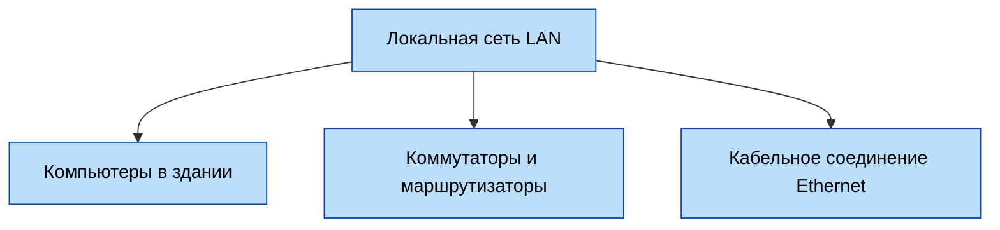
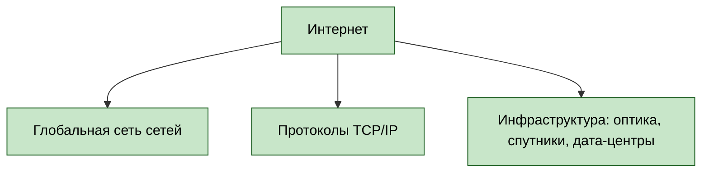
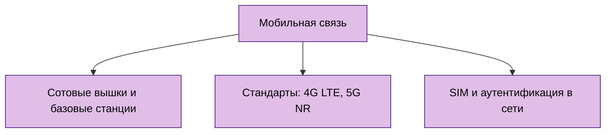
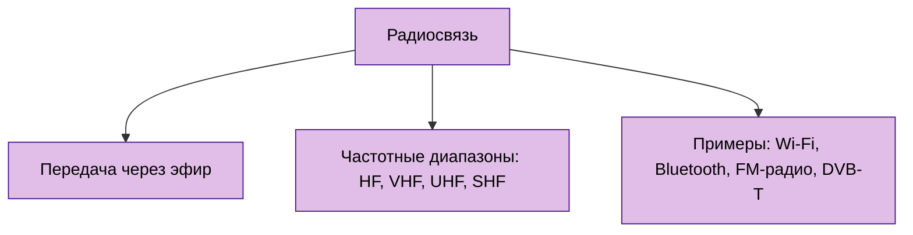
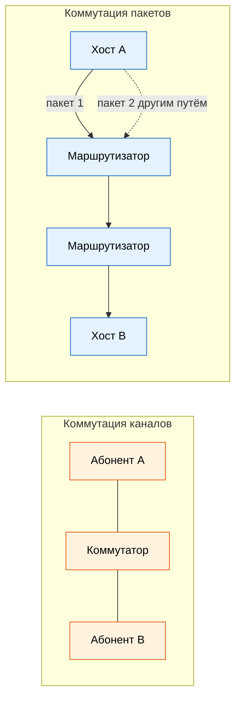

import NetworkStackExplorerPlay from '@site/src/components/NetworkStackExplorerPlay';

# Сеть и интернет - основы и принципы работы

<div class="article-tags">
  <span class="tag tag-required">ОБЯЗАТЕЛЬНО</span>
  <span class="tag tag-beginner">ДЛЯ НОВИЧКОВ</span>
</div>

<span class="complexity-badge">Всем</span>

---

## Сеть и интернет

### Общее о сетях

Сейчас мы уже привыкли к такому явлению, как сеть. Мы всё время онлайн, как с телефона, так и с компьютера – работаем и играем с постоянным Интернет-соединением, общаемся и обмениваемся информацией, даже не задумываясь порой о том, какой путь прошли эти технологии, прежде чем дать нам возможность смотреть фильмы в 4K.

Сети — это среда, в которой сегодня реализуется подавляющее большинство цифровых взаимодействий, что сравнимо по значимости с электрическими или транспортными сетями.

Люди веками искали способы передавать информацию на расстоянии (да, можно пошутить про голубиную почту – можете даже для интереса посмотреть, как это работало – приходилось действительно идти в "голубятню" и разбирать привязанные к ножкам птиц сообщения). 

★ **Сеть** — это совокупность двух и более независимых вычислительных устройств (узлов), соединённых физически или логически и способных обмениваться данными по заранее определённым правилам (протоколам). Соединение может быть проводным (медь, оптоволокно), беспроводным (радио, Wi‑Fi) или гибридным. Главное — **двусторонний обмен** по общим правилам: адресация, формат сообщений, контроль ошибок (на транспортном уровне — у TCP).

Важно подчеркнуть: **соединение ≠ сеть**. Два компьютера, соединённых кабелем "в крест", ещё не образуют сеть в полном смысле. Они образуют *канал связи*. Сетью это становится тогда, когда введены:

- идентификация участников (адреса),
- правила форматирования сообщений (протоколы),
- механизмы обнаружения ошибок и их устранения,
- способы управления доступом к среде передачи.

Именно эти четыре компонента превращают простой канал в управляемую, масштабируемую и безопасную среду взаимодействия.

Практически это означает следующее: когда дома "есть кабель, но нет интернета", проблема чаще всего находится в одном из четырех компонентов выше, а не только в физическом подключении.

<NetworkStackExplorerPlay variant="basics" />

---

## Классификация сетей по масштабу охвата

Сети различаются прежде всего по географическому и административному охвату. Эта классификация помогает понять, какие технологии, протоколы и подходы к управлению применяются в каждом случае.

---

### PAN — Personal Area Network (персональная сеть)

PAN — это самая малая по масштабу сеть. Она обслуживает одного человека в радиусе до нескольких метров. Примеры: Bluetooth-гарнитура, соединённая со смартфоном; клавиатура и мышь, подключённые к ноутбуку по беспроводному протоколу; смарт-часы, синхронизирующие данные с телефоном. PAN не предполагает постоянного подключения к внешним системам, хотя может выступать как шлюз (например, телефон в роли точки доступа к Интернету для часов). Устройства в PAN обычно работают по энергосберегающим протоколам (BLE, Zigbee, ANT+), так как ограничены ресурсами аккумуляторов.

---

### LAN — Local Area Network (локальная сеть)

LAN объединяет устройства в пределах одного здания, этажа или небольшого комплекса (например, офис, школа, дом). Типичный радиус действия — до нескольких сотен метров (при использовании витой пары — до 100 м на сегмент без повторителей). LAN характеризуется высокой скоростью передачи (от 100 Мбит/с до 10 Гбит/с и выше), низкой задержкой и централизованным управлением — как правило, администратором локальной инфраструктуры.

В LAN устройства взаимодействуют на канальном и физическом уровнях стека протоколов (например, Ethernet). Адресация внутри LAN чаще всего осуществляется с помощью MAC-адресов, но для удобства маршрутизации и доступа приложений используются локальные IP-адреса (например, из диапазона 192.168.0.0/16). Для разделения сети на логические сегменты применяются VLAN (Virtual LAN), что позволяет изолировать трафик даже при физическом совмещении устройств на одном коммутаторе.

Важной особенностью LAN является то, что она обычно находится под единым административным контролем: организация или частное лицо полностью владеет оборудованием (коммутаторами, точками доступа, маршрутизаторами) и устанавливает правила доступа, политики безопасности и резервного копирования.



---

### MAN — Metropolitan Area Network (городская сеть)

MAN охватывает территорию города или агломерации. Это промежуточное звено между LAN и WAN. Обычно MAN строится операторами связи или муниципальными структурами и служит для объединения множества локальных сетей (например, всех отделений банка в городе, кампусов университета, государственных учреждений). 

Технологически MAN использует высокоскоростные решения: оптоволоконные кольца (часто с резервированием по стандартам SONET/SDH), протоколы MPLS для виртуальной маршрутизации, а также WiMAX или точечные радиолинии для беспроводного соединения удалённых зданий. Скорости в MAN могут составлять от 1 Гбит/с до 100 Гбит/с и более. Задержки — от единиц до десятков миллисекунд. MAN часто выступает как "магистраль", к которой подключаются отдельные LAN.

---

### WAN — Wide Area Network (глобальная сеть)

WAN — это сеть, выходящая за пределы одного административного домена и географического региона. Самый известный пример WAN — Интернет, но не всякий WAN является Интернетом. Корпоративные WAN, например, соединяют офисы компании в разных странах через выделенные каналы, арендованные у телеком-операторов. Такие сети могут использовать технологии Frame Relay (устаревшая), ATM (практически не используется), MPLS, или современные SD-WAN (Software-Defined Wide Area Network).

Ключевая особенность WAN — **передача данных через публичную или арендованную инфраструктуру**, не находящуюся в собственности пользователя. Это накладывает ограничения: задержки выше (от 10 мс до сотен миллисекунд), пропускная способность может быть асимметричной, а качество канала — переменным. Поэтому в WAN критически важны механизмы:

- восстановления после потерь (повторная передача),
- сжатия и оптимизации трафика,
- шифрования (особенно при использовании публичных каналов).

WAN-соединения почти всегда реализуются на сетевом и транспортном уровнях (IP, TCP/UDP), тогда как физическая и канальная реализация скрыта от конечного пользователя.

---

### Интернет

★ **Интернет** – глобальная сеть сетей, где миллиарды устройств общаются через провода, радиоволны и даже спутники.

#### В рунет-дискурсе

В быту "интернет" часто означает **всё онлайн** — браузер, игры и мессенджеры. На форуме фраза "интернет сломался" может означать провайдера, DNS, один сайт или Wi‑Fi; при разборе инцидента полезно сразу уточнить **слой** (канал, IP, приложение). Культурный мост и Neolurk — [2.04 / 125](/encyclopedia/2-system-network/2-04-kak-rabotayut-sayty-i-veb-sayty/125#в-рунет-дискурсе), [120](/encyclopedia/9-spinoff/9-10-internet-kultura/120). Указатель — [Неолурк (Интернет)](https://neolurk.org/wiki/%D0%98%D0%BD%D1%82%D0%B5%D1%80%D0%BD%D0%B5%D1%82).



★ **Мобильная связь** – сеть без проводов, использующая радиоволны и вышки.



★ **Радиосвязь** – передача данных через эфир (радио, телевидение и Wi-Fi).



---

<span id="periferiya-i-yadro"></span>

## Периферия, ядро и способы коммутации

Любую крупную сеть удобно делить на две части. **Периферия** (edge) — домашние роутеры, Wi‑Fi, сети доступа провайдера (DSL, кабель, оптика, LTE). **Ядро** (core) — высокоскоростные магистрали и маршрутизаторы операторов, через которые пакеты пересекают города и континенты. Периферия подключает пользователей; ядро соединяет периферии друг с другом. Подробнее про Tier 1–3, IXP и пиринг — в [архитектуре глобальной сети](./211.md#evolyutsiya-setevyh-struktur).

---

### Коммутация пакетов и коммутация каналов

Данные по сети можно доставлять двумя принципиально разными способами.

| Подход | Идея | Пример | Плюсы | Минусы |
| :--- | :--- | :--- | :--- | :--- |
| **Коммутация каналов** | На всё время сеанса выделяется **резерв** пропускной способности по пути «источник → приёмник» | Классическая телефония (PSTN), устаревшие ATM/Frame Relay | Предсказуемая задержка и полоса на время звонка | Канал простаивает, когда абонент молчит; плохо масштабируется при миллиардах хостов |
| **Коммутация пакетов** | Сообщение режется на **пакеты**; каждый маршрутизатор пересылает их независимо, деля канал с другими потоками | Интернет (IP), Ethernet в LAN | Эффективное совместное использование линий; устойчивость к сбоям (обход маршрутом) | Переменная задержка, очереди и потери при перегрузке |

Современный Интернет построен на **коммутации пакетов**. VoIP и видеозвонки поверх IP эмулируют «постоянный канал» поверх пакетной сети за счёт буферов и кодеков на концах, а не за счёт выделенной медной пары на каждый разговор.



---

### Сети доступа

Между вашим ноутбуком и ядром Интернета лежит **сеть доступа** (access network) — участок, за который отвечает домашний оператор или корпоративный IT. Типичные технологии:

- **Ethernet** и **Wi‑Fi** в офисе и дома (часто за NAT на роутере);
- **DOCSIS** — кабельный интернет по коаксиалу;
- **xDSL** — медь телефонной линии;
- **GPON** и другая **пассивная оптика** до квартиры;
- **LTE/5G** — сотовый доступ.

У всех разных заявленных скоростей и задержек, но выше канального уровня стек один — **TCP/IP**. Разбор модема, коммутатора и маршрутизатора — в [сетевых устройствах](./21.md).

---

## Сервер

Интернет обеспечивает свою работу благодаря особым компьютерам - серверам.

Слово *сервер* часто используется неточно — то как аппаратное устройство, то как программа, то как роль в системе. Требуется чёткое разграничение.

**Сервер — это программное обеспечение (процесс), предоставляющее ресурсы, данные или сервисы другим программам (клиентам) по запросу в рамках клиент-серверной архитектуры.**

Аппаратный носитель, на котором работает этот процесс, называется *серверной машиной* или *хостом*, но это вторично. Один физический компьютер может одновременно исполнять десятки серверных ролей: веб-сервер, база данных, файловый сервер, почтовый агент — каждый в отдельном процессе.

Основные признаки сервера:

- **Пассивность**: сервер не инициирует соединение первым. Он ожидает входящие запросы на выделенном сетевом порту.
- **Многопоточность/асинхронность**: способность обслуживать множество клиентов одновременно.
- **Устойчивость**: серверы проектируются так, чтобы минимизировать простои — с резервированием питания, дисков (RAID), сетевых интерфейсов, а также с возможностью "горячей" замены компонентов.
- **Стандартизация протоколов**: сервер взаимодействует с клиентом строго по спецификации (HTTP, SMTP, SMB, LDAP и др.).

<span id="tipy-serverov"></span>

### Напоминалка — шесть типов серверов

Шесть ролей, которые чаще всего встречаются в сетевой грамотности разработчика. У каждой — свой протокол и типичная цепочка запроса.

| № | Тип | Задача | Типичная цепочка |
| :--- | :--- | :--- | :--- |
| 1 | **Веб-сервер** | Принять HTTP/HTTPS и вернуть страницу или API-ответ | Клиент → интернет → веб-сервер → HTTP-ответ клиенту |
| 2 | **Почтовый сервер** | Принять, доставить и хранить электронную почту | Отправитель → свой MTA (**SMTP**) → интернет → MTA получателя → клиент читает через **IMAP** или **POP3** |
| 3 | **DNS-сервер** | Перевести доменное имя в IP-адрес | Клиент спрашивает `example.com` → DNS возвращает IP → клиент обращается к серверу по этому адресу |
| 4 | **Прокси-сервер** | Посредник между клиентом и внешней сетью | Клиент → прокси → интернет; прямой выход может быть запрещён политикой сети |
| 5 | **FTP-сервер** | Централизованное хранение и обмен файлами | Клиент подключается по **FTP** (LAN или интернет) → загрузка и скачивание с общего каталога |
| 6 | **Origin-сервер** | Источник «оригинала» контента за CDN | Посетитель → DNS → edge CDN → при промахе кэша запрос уходит на origin, ответ кэшируется на edge |

**1. Веб-сервер.** Программа (Nginx, Apache, IIS, Caddy), которая слушает порты 80/443, разбирает HTTP-запрос и отдаёт статику или передаёт запрос прикладному коду. Подробнее — в [«Веб-серверах»](/encyclopedia/2-system-network/2-04-kak-rabotayut-sayty-i-veb-sayty/112).

**2. Почтовый сервер.** Принимает исходящие письма по SMTP, маршрутизирует их между доменами (через MX в DNS) и держит почтовые ящики получателей. Клиент отправляет через SMTP (порт 587), читает через IMAP (993) или POP3 (995). Полный разбор цепочки доставки, MUA/MTA/MDA и аутентификации домена — в [«Электронная почта»](/encyclopedia/1-basics/1-22-kommunikatsiya-i-obschenie/3); таблица портов — в [справочнике](./618.md#pochta).

**3. DNS-сервер.** «Адресная книга» интернета: по имени `google.com` возвращает IP вроде `142.250.185.46`, после чего браузер устанавливает TCP-соединение с веб-сервером. Разбор иерархии резолверов — в [статье про DNS](./6.md).

**4. Прокси-сервер.** Клиент обращается к прокси, прокси — к целевому серверу от своего имени. Так скрывают IP клиента, фильтруют трафик в офисе, кэшируют ответы и защищают внутреннюю сеть. Разбор forward/reverse proxy — в [«Прокси-серверах»](./614.md).

**5. FTP-сервер.** Хранилище файлов с доступом по протоколу FTP (управление — порт 21). Удобен для массовой выгрузки и раздачи артефактов; в современных проектах часто заменяют на SFTP, S3 или Git. Порты — в [справочнике](./618.md#udalenniy-dostup-i-peredacha-faylov).

**6. Origin-сервер.** Основной сервер владельца сайта: «источник правды» для CDN. Edge-серверы CDN отдают закэшированную копию; при промахе кэша идут за свежими данными на origin. Схема edge → origin — в [«CDN и кэшировании»](./212.md).

<div class="callout callout--tip">
  <div class="callout-title">Роли, а не устройства</div>

  Один физический хост может одновременно быть веб-сервером, DNS-резолвером и FTP-сервером — это разные процессы на одной машине. Клиент и сервер — роли в конкретном обмене, а не «тип железа».
</div>

### Другие распространённые роли

- **Прикладной сервер** (Tomcat, Node.js runtime) — исполняет бизнес-логику; веб-сервер часто проксирует к нему динамические запросы.
- **Сервер баз данных** (PostgreSQL, MySQL, MongoDB) — хранение, индексы, транзакции, права доступа.
- **Файловый сервер** (Samba, NFS) — общие сетевые каталоги в LAN без протокола FTP.

Важно: клиент и сервер — это *роли*, а не типы устройств. Смартфон может быть клиентом по отношению к облачному API, но одновременно — сервером для Bluetooth-устройств (PAN). Устройство IoT может быть сервером для локального шлюза и клиентом по отношению к облаку.

---

## Модель OSI

Сетевая модель **OSI** (Open Systems Interconnection) — эталон из семи уровней: от передачи битов по кабелю до сервисов вроде HTTP и DNS. Каждый уровень решает свою задачу и передаёт результат соседу; при отправке данные идут вниз по стеку, при приёме — вверх. Понимание уровней помогает локализовать сбой (физика, MAC, IP, порт или приложение), читать `traceroute`/`tcpdump` и настраивать защиту (TLS, IPsec, правила фаервола).

| № | Уровень | Кратко |
|---|---------|--------|
| 7 | Прикладной | HTTP, DNS, почта, FTP |
| 6 | Представления | Кодировки, gzip, TLS (учебно) |
| 5 | Сеансовый | Сеансы RPC, SIP, RTP |
| 4 | Транспортный | TCP, UDP, порты |
| 3 | Сетевой | IP, маршрутизация, ICMP |
| 2 | Канальный | Ethernet, MAC, VLAN |
| 1 | Физический | Кабель, сигнал, биты |

Подробные описания уровней OSI, **модель TCP/IP** (PDU, инкапсуляция, протоколы по слоям) и связь между моделями — в статье [Сетевые протоколы, порты и установка соединения](./4.md#model-tcp-ip).

```mermaid
flowchart TD
    classDef osi fill:#f5f5f5,stroke:#616161,color:black;
    classDef lan fill:#bbdefb,stroke:#0d47a1,color:black;
    classDef global fill:#c8e6c9,stroke:#1b5e20,color:black;
    classDef wireless fill:#e1bee7,stroke:#4a148c,color:black;

    O[Модель OSI]:::osi

    L1[1 Физический]:::osi
    L2[2 Канальный]:::osi
    L3[3 Сетевой]:::osi
    L4[4 Транспортный]:::osi
    L5[5 Сеансовый]:::osi
    L6[6 Представительский]:::osi
    L7[7 Прикладной]:::osi

    O --> L1
    O --> L2
    O --> L3
    O --> L4
    O --> L5
    O --> L6
    O --> L7

    %% Привязка LAN
    L1 -.-> LAN1[LAN: кабель, коннекторы]:::lan
    L2 -.-> LAN2[LAN: Ethernet, MAC]:::lan
    L3 -.-> LAN3[LAN: IPv4/IPv6]:::lan

    %% Привязка Интернет
    L3 -.-> INT3[Интернет: IP, маршрутизация между сетями]:::global
    L4 -.-> INT4[Интернет: TCP, UDP]:::global
    L7 -.-> INT7[Интернет: HTTP, DNS, TLS, SMTP]:::global

    %% Привязка Мобильная связь
    L1 -.-> MOB1[Мобильная: радиоволны, антенны]:::wireless
    L2 -.-> MOB2[Мобильная: LTE RLC/MAC, 5G NR PDCP]:::wireless
    L3 -.-> MOB3[Мобильная: GTP, IP в ядре сети]:::wireless

    %% Привязка Радиосвязь
    L1 -.-> RAD1[Радиосвязь: эфир, частоты]:::wireless
    L2 -.-> RAD2[Радиосвязь: Wi-Fi, Bluetooth L2CAP]:::wireless
    L3 -.-> RAD3[Радиосвязь: IP поверх Wi-Fi / 6LoWPAN]:::wireless
```



---

## Протокол

Если представить сеть как международный аэропорт, то протокол — это полный свод правил: как подавать сигналы, как интерпретировать высоту, как реагировать на аварийные ситуации, как оформлять разрешения на взлёт. Без единого стандарта взаимодействие невозможно — даже если два устройства физически подключены, они останутся "глухи" друг к другу.

**Протокол — это формализованное соглашение о порядке, формате и семантике обмена сообщениями между двумя или более участниками сети.** Он определяет:

- как устроено сообщение (заголовки, тело, контрольные суммы),
- как начинается и завершается сеанс связи,
- как обнаруживаются и корректируются ошибки,
- как управляется поток данных (например, чтобы быстрый отправитель не "затопил" медленного получателя),
- как обеспечивается надёжность (гарантированная доставка или отказ от неё в пользу скорости).

Протоколы строятся иерархически — в виде так называемого *стека*. Каждый уровень стека решает свою задачу и "скрывает" сложность нижележащих уровней от вышележащих. Например, приложение (уровень приложения) работает с HTTP-запросами и не знает, передаётся ли пакет по Wi-Fi, оптоволокну или спутниковому каналу — этим занимается уровень соединения и физический уровень, скрытые внутри.

Наиболее известный и универсальный стек — **TCP/IP**, хотя исторически существовали и другие (например, OSI — семиуровневая модель, используемая в основном как учебный инструмент). В TCP/IP выделяют четыре основных уровня:

1. **Прикладной** (HTTP, FTP, SMTP, DNS, SSH) — интерфейс для программ; единица данных **Data**.
2. **Транспортный** (TCP, UDP) — доставка между процессами по **портам**, надёжность; единица **Segment**.
3. **Интернет** (IP, ICMP) — логические адреса и маршрут между сетями; единица **Packet**.
4. **Сетевой интерфейс** (Ethernet, Wi‑Fi, PPP, оптика) — кадры по MAC и биты в среде; **Frame** и **Bit**.

Таблица протоколов, схема инкапсуляции и сопоставление с OSI — в разделе [«Модель TCP/IP»](./4.md#model-tcp-ip).

Протоколы не существуют изолированно. Например, HTTP почти всегда работает поверх TCP, а TCP — поверх IP. Это называется *инкапсуляцией*: на каждом уровне к данным добавляется свой заголовок (иногда — концевик), образуя "матрёшку" пакетов. При получении процесс идёт в обратном порядке: каждый уровень снимает свой заголовок и передаёт полезную нагрузку выше.

```text
[ HTTP-запрос ]  →  внутри сегмента TCP  →  внутри IP-пакета  →  внутри Ethernet-кадра
     ↑ приложение        ↑ транспорт           ↑ сеть                 ↑ канал/LAN
```

Один и тот же HTTP-байт на проводе выглядит как кадр с MAC-адресами; маршрутизаторы смотрят IP; хост — ещё и TCP-порт, чтобы отдать данные нужному процессу.

Протоколы могут быть **открытыми** (спецификации доступны, реализации множественны, например, IP, TCP, TLS) или **проприетарными** (закрытыми, как некоторые внутренние протоколы корпоративных систем). Открытые протоколы — основа интероперабельности Интернета: устройство от одного производителя может взаимодействовать с устройством другого, лишь бы оба соблюдали стандарт.

---

## IP-адрес

IP-адрес — это логический (не физический) идентификатор, присваиваемый сетевому интерфейсу для участия в IP-сети. Его можно сравнить с почтовым адресом в реальном мире: он не указывает на конкретный стол или монитор, а позволяет доставить письмо в нужное здание (сеть), после чего уже внутри здания (локальной сети) с помощью других механизмов — например, таблицы ARP или коммутатора — письмо найдёт нужного получателя.

Существует два основных стандарта IP-адресации:

- **IPv4** — 32-битный адрес, записывается в виде четырёх десятичных чисел от 0 до 255, разделённых точками (например, `192.168.1.10`). Общее число возможных адресов — около 4,3 миллиарда. К середине 2010-х адресное пространство IPv4 было исчерпано, что привело к широкому внедрению механизма NAT (Network Address Translation) и ускоренному переходу на IPv6.
  
- **IPv6** — 128-битный адрес, записывается шестнадцатеричными группами (например, `2001:0db8:85a3:0000:0000:8a2e:0370:7334`, с сокращениями — `2001:db8:85a3::8a2e:370:7334`). Объём адресного пространства настолько велик (~3,4 × 10³⁸ адресов), что позволяет присвоить уникальный IP *каждому устройству на Земле* — и даже каждому зерну песка — не опасаясь дефицита.

IP-адрес не привязан к устройству навсегда. Он может быть:

- **Статическим** — назначается вручную и не меняется (часто для серверов, маршрутизаторов, принтеров).
- **Динамическим** — выдаётся автоматически сервером DHCP (Dynamic Host Configuration Protocol) на ограниченное время аренды. После истечения срока устройство должно подтвердить продление или запросить новый адрес.

Каждому IP-адресу соответствует **маска подсети**, которая определяет, какая часть адреса относится к идентификатору сети, а какая — к идентификатору узла внутри этой сети. Например, маска `255.255.255.0` означает, что первые три байта (`192.168.1`) — это сеть, а последний (`10`) — номер устройства. Это позволяет строить иерархическую адресацию и эффективно маршрутизировать трафик.

По **назначению** (сегодня размер сети задают префиксом **CIDR**, например `/24`, а не устаревшие "классы A/B/C"):

- **Публичные** — регистрируются в глобальных реестрах (ICANN, RIPE NCC и др.) и маршрутизируются в Интернете.
- **Приватные** (RFC 1918) — только внутри LAN: `10.0.0.0/8` (крупные корпоративные сети), `172.16.0.0/12`, `192.168.0.0/16` (домашние и офисные Wi‑Fi); в интернет не маршрутизируются, наружу выходят через NAT.
- **Специальные** — loopback (`127.0.0.0/8`), APIPA при сбое DHCP (`169.254.0.0/16`), multicast, адреса для документации в RFC.

Динамические адреса в LAN чаще выдаёт **DHCP** (см. [DNS и настройка сети](./6.md)).

<div class="callout callout--tip">
  <div class="callout-title">Напоминалка по IP и CIDR</div>

  Таблицы частных диапазонов, масок `/8`–`/32`, специальных IPv4, публичных DNS и основ IPv6 — в [справочнике по IP-адресам и CIDR](./619.md).
</div>

Важно понимать: IP-адрес идентифицирует *интерфейс*, а не устройство. У одного компьютера может быть несколько сетевых интерфейсов (Ethernet, Wi-Fi, виртуальные), и у каждого — свой IP. Сервер может слушать один и тот же порт на разных IP-адресах и отдавать разный контент (виртуальные хосты в веб-серверах).

---

## Порт

Если IP-адрес — это адрес дома, то **порт** — это номер квартиры или офиса внутри этого дома. Порт позволяет одному устройству одновременно участвовать в десятках, а то и сотнях сетевых сессий, не смешивая их между собой.

Порт — это 16-битное целое число от 0 до 65535. Диапазоны имеют смысловую нагрузку:

- **0–1023** — *зарезервированные (well-known) порты*. Используются стандартными сервисами и требуют привилегий для запуска на большинстве ОС.  
  Примеры:  
`22` — SSH,  
`80` — HTTP,  
`443` — HTTPS,  
`25` — SMTP,  
`53` — DNS (и TCP, и UDP).

- **1024–49151** — *зарегистрированные порты*. Могут использоваться приложениями, но не являются стандартными. Часто применяются для кастомных серверов, резервных копий стандартных сервисов, промежуточных шлюзов.

- **49152–65535** — *динамические/эфемерные порты*. Назначаются операционной системой временно для исходящих соединений (клиентских сокетов). Когда ваш браузер подключается к веб-серверу, он выбирает свободный порт из этого диапазона в качестве *локального* порта соединения.

В модели TCP/IP порт работает на транспортном уровне. Пары `IP:порт` образуют так называемый *сокет* — уникальную точку окончания соединения. Полный идентификатор сессии — это **кортеж из четырёх элементов**:  
`<локальный IP>:<локальный порт> → <удалённый IP>:<удалённый порт>`.

Например:  
`192.168.1.5:54321 → 93.184.216.34:443`  
означает: клиент с локального устройства (внутренний IP, эфемерный порт) установил HTTPS-соединение с сервером `example.com`.

Стоит подчеркнуть: порт не "принадлежит" приложению. Это абстракция ОС. Один сервер (например, Nginx) может слушать порт 80 и, получив HTTP-запрос, передать его внутреннему процессу на порту 3000 (бэкенд на Node.js) — и клиент об этом не узнает. Так работает проксирование и балансировка нагрузки.

UDP использует порты аналогично TCP, но без установления соединения — каждое сообщение содержит полный адрес назначения и порт, и система маршрутизирует его независимо.

<div class="callout callout--tip">
  <div class="callout-title">Напоминалка по портам</div>

  Таблица [18 основных портов](./618.md#18-osnovnyh-portov) и полный справочник (HTTP, SSH, DNS, почта, БД) с TCP/UDP и шифрованием — [по сетевым протоколам и портам](./618.md).
</div>

---

## Пропускная способность и задержка

Эти параметры определяют *качество* канала связи, но отвечают за разные аспекты.

---

### Пропускная способность (bandwidth)

Пропускная способность — это *максимальный объём данных*, который может быть передан по каналу за единицу времени. Измеряется в битах в секунду (бит/с): килобит/с (Кбит/с), мегабит/с (Мбит/с), гигабит/с (Гбит/с). Обратите внимание: **бит**, а не байт. 1 Мбит/с = 125 КБ/с (килобайт в секунду), поскольку 1 байт = 8 бит.

Пропускная способность — характеристика *физического или логического канала*. Она зависит от:

- типа среды (медная витая пара — до 10 Гбит/с на коротких дистанциях; оптоволокно — до терабит/с в магистральных линиях),
- используемого протокола (Wi-Fi 5 — до 3,5 Гбит/с теоретически, Wi-Fi 6 — до 9,6 Гбит/с),
- наличия помех и интерференции (особенно в беспроводных сетях),
- загрузки канала (если много устройств делят один канал, каждый получит меньшую долю).

Важно: заявленная пропускная способность — это *теоретический максимум* в идеальных условиях. Реальная скорость передачи (throughput) всегда ниже из-за накладных расходов протоколов (заголовки, подтверждения, повторные передачи), особенностей приложений и состояния сети.

---

### Задержка (latency, пинг)

Задержка — это *время*, прошедшее с момента отправки пакета до получения подтверждения или ответа. Измеряется в миллисекундах (мс). Термин "пинг" происходит от утилиты `ping`, которая отправляет ICMP-запросы (Echo Request) и замеряет время ответа (Echo Reply) — отсюда и метафора "пинг-понг".

Задержка складывается из нескольких компонентов:

1. **Время распространения** (*propagation*) — сигнал идёт по среде с конечной скоростью. В оптоволокне — порядка 200 000 км/с. Расстояние 300 км даёт ~1,5 мс в одну сторону и ~3 мс RTT только на физику.
2. **Время обработки** (*processing*) — коммутатор или маршрутизатор разбирает заголовки, ищет запись в таблице, проверяет контрольную сумму.
3. **Время ожидания в очереди** (*queuing*) — пакет ждёт в буфере, пока линия занята другим трафиком. Именно очередь даёт **jitter** и при переполнении буфера — **потери**.
4. **Время передачи** (*transmission*) — длительность отправки битов пакета в канал: размер пакета делят на скорость линии (пакет 1500 байт при 10 Мбит/с ≈ 1,2 мс).

<span id="formula-zaderzhki"></span>

Суммарная задержка одного узла на пути (упрощённо):

**dузел = dобработка + dочередь + dпередача + dраспространение**

Сквозная задержка — сумма вкладов всех узлов на маршруте плюс задержки на концах (ОС, приложение). Утилита `ping` показывает RTT до ближайшего отвечающего хоста (часто ICMP на маршрутизаторе), а не полный разбор по каждому hop; для последнего служит `traceroute` / `tracert` — см. [мониторинг трафика](./615.md).

<div class="callout callout--warning">
  <div class="callout-title">Очередь и потери</div>

  <div class="callout-body">
  Когда входящий трафик на маршрутизаторе стабильно превышает скорость исходящей линии, очередь растёт, задержка скачет, а при переполнении буфера пакеты **отбрасываются**.

  TCP на концах замечает потери и снижает скорость;

  UDP передаёт потерю приложению (важно для игр и VoIP).

  Разбор влияния на скорость загрузки — в [измерении скорости интернета](./612.md).
  </div>
</div>

---

<span id="skvoznaya-propusknaya-sposobnost"></span>

### Сквозная пропускная способность

**Сквозная пропускная способность** (end-to-end throughput) между двумя хостами ограничена **самым узким участком** на пути и **конкуренцией** за общие линии.

- Если другого трафика нет, скорость файла часто близка к **минимальной** скорости линии на пути (узкое место среди R₁, R₂, …, Rₙ).
- Если десять загрузок одновременно делят магистраль с пропускной способностью R, каждая получит примерно R/10 (плюс накладные расходы TCP).

**Пример.** У сервера линия 2 Мбит/с, у клиента 1 Мбит/с, в ядре общий канал 5 Мбит/с. Одна загрузка упирается в 1 Мбит/с (клиент). Десять параллельных загрузок через тот же канал 5 Мбит/с в ядре — около 500 Кбит/с на каждую, даже если «домашний тариф» обещает 100 Мбит/с. Именно поэтому вечерний стриминг у соседей и торренты влияют на вашу скорость.

Задержка критична для интерактивных приложений: VoIP, видеоконференции, онлайн-игры, удалённое управление. Даже при высокой пропускной способности (например, 1 Гбит/с) задержка в 200 мс сделает игру неиграбельной или вызов — неудобным из-за эха.

Интересный парадокс: в некоторых сценариях *низкая задержка важнее высокой пропускной способности*. Например, для SSH-сессии достаточно 100 Кбит/с, но если задержка 300 мс — работать будет тяжело. А для загрузки фильма — наоборот: можно терпеть 100 мс пинга, но нужна стабильная скорость 50 Мбит/с.

---

## Маршрутизация и коммутация

Два ключевых механизма, лежащих в основе передачи данных в многосегментных сетях — **маршрутизация** (routing) и **коммутация** (switching). Их часто путают, поскольку оба связаны с пересылкой пакетов, но они действуют на разных уровнях модели и решают разные задачи.

---

### Коммутация (уровень канала — Data Link Layer)

Коммутация происходит внутри *одной локальной сети* (LAN). Устройство, выполняющее эту функцию, называется **коммутатор** (switch). Современные коммутаторы — это интеллектуальные устройства, строящие и использующие **таблицу MAC-адресов**.

<span id="mac-adres"></span>

#### MAC-адрес — назначение и формат

**MAC-адрес** (Media Access Control) — 48-битный идентификатор сетевого интерфейса на **канальном уровне** (L2) модели OSI. Его ещё называют **аппаратным** или **физическим адресом**. Им пользуются Ethernet, Wi‑Fi и Bluetooth при адресации кадров внутри одного сегмента LAN.

Адрес обычно задаётся производителем и записывается в микросхему адаптера. В типичном случае он **глобально уникален** в пределах одного широковещательного домена. ОС может подставить другой MAC (виртуальная машина, контейнер, ручная настройка) — см. бит U/L ниже.

Запись — **шесть октетов** в шестнадцатеричном виде. Разделители зависят от ОС и утилиты:

- двоеточия — `6C:54:63:E2:31:76` (часто в Linux и macOS);
- дефисы — `6C-54-63-E2-31-76` (часто в Windows);
- группы по четыре символа — `6C54.63E2.3176` (Cisco и др.).

Смысл одного и того же адреса при всех форматах совпадает.

#### Структура — OUI и NIC

48 бит дают порядка **281 триллиона** возможных комбинаций. Логически адрес делят на две половины по **24 бита** (три октета):

| Часть | Октеты | Кто назначает | Роль |
|-------|--------|---------------|------|
| **OUI** (Organizationally Unique Identifier) | первые три | IEEE производителю оборудования | идентифицирует вендора (Intel, Apple, Cisco и т.д.) |
| **NIC** (идентификатор конкретного интерфейса) | последние три | сам производитель | отличает одну плату/чип от другой в линейке |

Пример `6C:54:63:E2:31:76`:

- OUI — `6C:54:63`;
- уникальная часть адаптера — `E2:31:76`.

По префиксу OUI в справочниках IEEE можно узнать производителя (полезно при разборе ARP-таблицы или незнакомого устройства в сети).

#### Служебные биты первого октета

В **первом октете** (старшем байте адреса) два бита несут служебный смысл; остальные 46 бит — собственно идентификатор.

Для `6C` двоичное представление — `01101100` (биты нумеруют от **7** слева до **0** справа):

| Бит | Имя | Значение `0` | Значение `1` |
|-----|-----|--------------|--------------|
| **7** | **U/L** (Universal / Local) | глобально уникальный, заводской | **локально назначенный** (администратор или ПО) |
| **0** | **I/G** (Individual / Group) | **одноадресная** рассылка (unicast) | **групповая** (multicast) |

В примере `6C:54:63:E2:31:76` оба бита равны нулю — обычный заводской unicast-адрес одного интерфейса.

**Локально назначенные** MAC (U/L = 1) встречаются у виртуальных NIC, при «спуфинге» MAC в тестовых средах и в некоторых политиках безопасности. Коммутатор пересылает кадр по тому адресу, который указан в заголовке, и не проверяет «заводскую» подлинность.

**Multicast** на канальном уровне (I/G = 1) используют, например, протоколы обнаружения и часть потоков IPv6; коммутатор с умной фильтрацией IGMP/MLD может ограничивать рассылку только на порты подписчиков.

#### Широковещательный и смежные темы

Адрес **`FF:FF:FF:FF:FF:FF`** — широковещательный: кадр с таким назначением получают все узлы в том же домене L2 (DHCP Discover, часть ARP и т.д.).

Связка **IP ↔ MAC** в IPv4-сети LAN обеспечивается протоколом **ARP**; маршрутизатор при отправке пакета «в чужую» подсеть подставляет MAC следующего hop (часто шлюза). Подробнее про устройства и таблицы — в [сетевом адаптере](/encyclopedia/2-system-network/2-03-set-i-internet/21#nic-adapter); про атаки с подменой MAC — в [безопасности Wi‑Fi](/encyclopedia/2-system-network/2-08-osnovy-informatsionnoy-bezopasnosti/113#mitm-wifi).

Как работает коммутатор:

1. При получении кадра (frame) он извлекает *источник* (MAC-адрес отправителя) и *назначение* (MAC-адрес получателя).
2. MAC-адрес отправителя регистрируется в таблице с привязкой к физическому порту — таким образом коммутатор "учится", где находятся устройства.
3. Если адрес назначения уже есть в таблице — кадр отправляется *только на тот порт*, где находится получатель (unicast).
4. Если адреса нет — кадр рассылается на все порты, кроме входящего (flooding). Получатель ответит, и его адрес тоже будет добавлен в таблицу.
5. Кадры с широковещательным MAC (`FF:FF:FF:FF:FF:FF`) всегда рассылаются на все активные порты — так работает, например, DHCP-запрос при старте устройства.

Преимущество коммутации: *снижение коллизий и изоляция доменов конфликтов*. В старых сетях использовались хабы (hubs), которые просто повторяли сигнал на все порты — это создавало единую коллизионную область (collision domain), где два устройства, начавшие передачу одновременно, "сталкивались". Коммутатор делит сеть на множество независимых коллизионных доменов по одному на порт — одновременная передача между разными парами устройств становится возможной.

---

### Маршрутизация (сетевой уровень — Network Layer)

Маршрутизация — это передача пакетов *между разными сетями*. Устройство, отвечающее за это, — **маршрутизатор** (router). В отличие от коммутатора, маршрутизатор работает с IP-адресами, а не с MAC-адресами.

Основная задача маршрутизатора — принять решение: *через какой интерфейс отправить пакет, чтобы он приблизился к получателю?* Для этого используется **таблица маршрутизации** — набор правил вида:

```
Сеть назначения       Маска подсети    Шлюз (next hop)     Интерфейс
0.0.0.0/0              0.0.0.0          192.168.1.1         eth0   ← маршрут по умолчанию
192.168.1.0/24         255.255.255.0    — eth0   ← прямая доставка (в своей сети)
10.0.0.0/8             255.0.0.0        192.168.1.254       eth0   ← через шлюз
```

Как принимается решение:

1. Маршрутизатор получает IP-пакет.
2. Извлекает IP-адрес назначения.
3. Сравнивает его со всеми записями в таблице маршрутизации, выбирая *наиболее специфичную* (с наибольшей длиной префикса).
4. Если найден маршрут — пакет пересылается на указанный интерфейс. Если маршрут — через шлюз, то перед отправкой выполняется **инкапсуляция в канальный кадр** с MAC-адресом шлюза (определяется через ARP или NDP для IPv6).
5. Если подходящего маршрута нет — пакет отбрасывается, и отправителю может быть возвращено сообщение ICMP "Destination Unreachable".

Важно: маршрутизатор *разрывает домен широковещания*. Пакеты, адресованные на широковещательный адрес (`255.255.255.255` или `192.168.1.255`), не выходят за пределы своей подсети — в отличие от коммутатора, который их рассылает. Это снижает шум в сети и повышает безопасность.

Существуют статические и динамические таблицы маршрутизации:

- **Статическая** — вручную прописанные администратором маршруты. Просты, предсказуемы, подходят для небольших сетей.
- **Динамическая** — маршруты автоматически обмениваются между маршрутизаторами с помощью протоколов:  
  - *внутри автономной системы* (AS): OSPF, IS-IS, RIP;  
  - *между автономными системами* (глобальная маршрутизация): BGP (Border Gateway Protocol) — "язык Интернета".

BGP — это протокол *политик маршрутизации*. Он позволяет операторам управлять, какие маршруты объявлять, какому провайдеру отдавать трафик, как реагировать на отказы. Именно BGP лежит в основе отказоустойчивости глобального Интернета: при падении одного канала трафик перенаправляется по альтернативным путям за секунды.

---

## NAT — Network Address Translation

Из-за дефицита IPv4-адресов большинство устройств в локальных сетях используют *приватные* IP-адреса (например, из диапазона `192.168.0.0/16`). Но такие адреса не маршрутизируются в публичном Интернете. Решение — **трансляция сетевых адресов (NAT)**.

В бытовой схеме **модем** подключает кабель провайдера и даёт **один публичный IP** на границу с вашей квартирой, а **маршрутизатор** строит локальную сеть, раздаёт частные адреса (**DHCP**) и на своём WAN-интерфейсе выполняет NAT. Роли устройств — [модем и маршрутизатор](/encyclopedia/2-system-network/2-03-set-i-internet/21#modem-i-router).

NAT работает на границе между частной и публичной сетью (обычно — в домашнем роутере или корпоративном шлюзе). Его суть: замена *внутреннего* IP-адреса и порта на *внешний* (публичный) IP и другой порт при исходящем соединении — и обратная замена при ответе.

Простейший случай — **SNAT (Source NAT)**:

1. Компьютер в LAN (`192.168.1.5:54321`) открывает TCP-соединение с `example.com:80`.
2. Роутер заменяет исходный IP и порт на свои: `203.0.113.10:60001` (публичный IP провайдера).
3. В таблице NAT создаётся запись:  
`192.168.1.5:54321 → 203.0.113.10:60001 → 93.184.216.34:80`
4. Сервер отвечает на `203.0.113.10:60001`.
5. Роутер смотрит в таблицу, находит соответствие и перенаправляет пакет на `192.168.1.5:54321`.

Таким образом, *один публичный IP* может обслуживать *тысячи* внутренних устройств — за счёт уникальных портов в таблице трансляции (это называется PAT — Port Address Translation, или NAPT).

Ограничения NAT:

- Ломает end-to-end-связность: два устройства за разными NAT не могут напрямую соединиться без посредника (STUN/TURN/ICE — протоколы для P2P-приложений).
- Сложно размещать серверы внутри NAT (требуется проброс портов — port forwarding).
- Некоторые протоколы (например, FTP в активном режиме) включают IP-адреса в тело сообщения — NAT должен "подправлять" и их (ALG — Application Layer Gateway).

NAT не требуется в IPv6-сетях, где каждый хост может иметь публичный адрес — это восстанавливает принцип сквозной адресуемости, заложенный изначально в IP.

---

## VPN — Virtual Private Network

VPN — это технология создания *безопасного, изолированного канала связи* поверх публичной или ненадёжной сети (чаще всего — Интернета). Цель: обеспечить такой же уровень конфиденциальности и целостности, как если бы устройства были соединены прямым выделенным кабелем.

**VPN не является отдельным протоколом** — это *подход*, реализуемый с помощью:

- **инкапсуляции** — "упаковки" исходного пакета внутрь другого (например, IP-пакет в UDP-пакет),
- **шифрования** — защиты содержимого от перехвата,
- **аутентификации** — проверки подлинности участников,
- **контроля целостности** — обнаружения изменений в пути.

Типы VPN:

1. **Site-to-Site VPN** — соединяет две локальные сети (например, офис и дата-центр). Устройства внутри каждой сети не знают о существовании VPN — трафик шифруется и расшифровывается на граничных маршрутизаторах или межсетевых экранах.
2. **Remote Access VPN** — подключает отдельное устройство (ноутбук, смартфон) к корпоративной сети. Примеры: OpenVPN, WireGuard, IPsec (IKEv2), SSTP. Клиент устанавливает защищённый туннель к шлюзу, после чего получает доступ ко внутренним ресурсам, как будто находится в офисе.

Работает это так:

- На обоих концах туннеля запускаются процессы (демоны), согласовывающие параметры шифрования (алгоритм, ключи — обычно через Diffie-Hellman).
- Исходный IP-пакет (например, `10.0.1.5 → 10.0.2.10`) инкапсулируется в новый пакет с публичными адресами (`203.0.113.10 → 198.51.100.20`).
- Внешний пакет передаётся по Интернету. Промежуточные маршрутизаторы видят только внешние адреса.
- На получателе пакет распаковывается, проверяется подпись и расшифровывается.
- Получатель видит "родной" трафик — будто соединение локальное.

Современные протоколы (например, **WireGuard**) сочетают простоту, скорость и криптографическую стойкость. Они используют state-of-the-art алгоритмы (Curve25519 для обмена ключами, ChaCha20 для шифрования, Poly1305 для аутентификации сообщений) и минимизируют служебные данные — что снижает задержку и повышает пропускную способность.

VPN не заменяет другие механизмы безопасности (аутентификацию пользователей, контроль доступа, обнаружение вторжений), но формирует *первый слой защиты* при передаче по ненадёжным сетям.

---

## Практический минимум для начинающего

- Уметь отличать LAN от WAN в бытовом сценарии.
- Понимать, что IP и порт вместе указывают целевой процесс.
- Понимать, почему HTTPS и VPN решают разные задачи.
- Уметь объяснить разницу между "скоростью" и "задержкой".

---

## Куда перейти после этой статьи

- [Сетевые протоколы, порты и установка соединения](/encyclopedia/2-system-network/2-03-set-i-internet/4)
- [Сетевые устройства — маршрутизаторы, коммутаторы, модемы](/encyclopedia/2-system-network/2-03-set-i-internet/21)
- [Измерение и оптимизация скорости интернета](/encyclopedia/2-system-network/2-03-set-i-internet/612)

---

{/* http-basics-link  */}
<div class="callout callout--tip">
  <div class="callout-title">Основа по протоколу</div>

  <div class="callout-body">
  Базовый разбор HTTP и HTTPS находится в отдельной статье — [HTTP как основа веб-интеграций](/encyclopedia/2-system-network/2-09-osnovy-integratsionnogo-vzaimodeystviya/118).
</div>
  </div>

{/* sidebar-collections */}

---

## В подборках

Статья входит в [тематические подборки](/about/collections) и блок «С чего начать?» на [главной](/). Соседние шаги того же маршрута:

**Сетевая грамотность** — [Сайты и веб-сайты](/encyclopedia/2-system-network/2-04-kak-rabotayut-sayty-i-veb-sayty/1), [Сеть и интернет — о разделе](/encyclopedia/2-system-network/2-03-set-i-internet/intro), [Веб-браузеры](/encyclopedia/1-basics/1-11-soft-ryadovogo-polzovatelya/3), [Веб-сайты и веб-приложения — о разделе](/encyclopedia/2-system-network/2-04-kak-rabotayut-sayty-i-veb-sayty/intro), [Организация домашней сети](/encyclopedia/2-system-network/2-06-sistemnoe-administrirovanie/61), [NAT и проброс портов](/encyclopedia/2-system-network/2-06-sistemnoe-administrirovanie/7).

{/* /sidebar-collections */}

---
