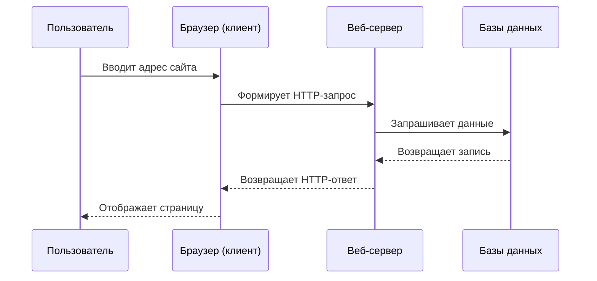

import HttpRequestAnalyzer from '@site/src/components/HttpRequestAnalyzer';

# HTTP и HTTPS

<div class="article-tags">
  <span class="tag tag-required">ОБЯЗАТЕЛЬНО</span>
  <span class="tag tag-beginner">ДЛЯ НОВИЧКОВ</span>
</div>

<span class="complexity-badge">Всем</span>

---

## HTTP и HTTPS

Вы каждый день пользуетесь интернетом - открываете сайты, смотрите видео, читаете новости, заказываете пиццу. А замечали, что в адресной строке браузера почти всегда написано либо `http://`, либо `https://`?

Эти маленькие буквы — язык, на котором ваш браузер разговаривает с сайтами.

Открывая любой сайт, допустим `https://spirzen.ru`, вы отправляете HTTPS-запрос:
```
GET / HTTP/1.1
Host: spirzen.ru
User-Agent: [Строка User-Agent вашего браузера, например: Mozilla/5.0...]
Accept: text/html,application/xhtml+xml,application/xml;q=0.9,image/avif,image/webp,*/*;q=0.8
Accept-Language: ru-RU,ru;q=0.9,en-US;q=0.8,en;q=0.7
Accept-Encoding: gzip, deflate, br
Connection: keep-alive
Upgrade-Insecure-Requests: 1
Sec-Fetch-Dest: document
Sec-Fetch-Mode: navigate
Sec-Fetch-Site: none
Sec-Fetch-User: ?1
Cache-Control: max-age=0
```

HTTP — это старый добрый способ общаться без секретов. Всё, что вы передаёте (например, текст поискового запроса), может увидеть кто-то посторонний.

HTTPS — та же самая технология, но с шифрованием. Как если бы вы положили письмо в закрытый конверт, а не отправили открытку.

---

## Что такое HTTP

**HTTP (HyperText Transfer Protocol)** — это прикладной сетевой протокол для передачи данных в сети Интернет. Этот протокол определяет правила, по которым браузер и сервер обмениваются информацией при загрузке веб-страниц.

Протокол работает на основе запросов и ответов. Клиент отправляет сообщение с требованием получить определённый ресурс. Сервер получает это сообщение и возвращает ответ с требуемыми данными или сообщением об ошибке.

Система строится вокруг простой идеи: пользователь запрашивает информацию, сервер предоставляет эту информацию. Вся коммуникация происходит через текстовые сообщения, что делает протокол универсальным и легко анализируемым.

Гипертекст означает возможность содержать ссылки. Эти ссылки связывают документы между собой. Браузер понимает формат гипертекста и может перейти от одного документа к другому без явных команд пользователя.

HTTP лежит в основе всех сайтов. Без этого протокола невозможно было бы загрузить страницу, получить изображение или отправить форму.

---

### Основные принципы работы

Работа протокола основывается на трёх фундаментальных элементах: клиенте, сервере и соединении.

| Элемент | Описание | Пример |
|---------|----------|--------|
| Клиент | Устройство или программа, которая инициирует запрос | Браузер, приложение, робот |
| Сервер | Устройство или программа, которая обрабатывает запрос | Веб-сервер, файловый сервер |
| Соединение | Канал связи между клиентом и сервером | TCP/IP соединение |

Клиент формирует запрос согласно правилам протокола. Это правило включает адрес ресурса, метод действия и дополнительную информацию. Сервер получает запрос и проверяет его корректность. При успешной проверке сервер выполняет требуемое действие. Результат возвращается клиенту вместе со статусом выполнения.

Каждый запрос обрабатывается независимо. Сервер не хранит состояние между запросами. Эта особенность упрощает масштабирование системы. Любой сервер способен обработать любой запрос.

**HTTP** (`http://`, порт 80): DNS → TCP:80 → сразу текстовый HTTP-запрос/ответ (без шифрования).

**HTTPS** (`https://`, порт 443): DNS → TCP:443 → **TLS handshake** (сертификат, согласование шифров) → внутри TLS тот же HTTP (запрос `GET` и ответ с HTML/CSS/JS уже зашифрованы).

Для `https://spirzen.ru` типичная цепочка:

1. DNS-запрос — IP сервера.
2. TCP на порт **443**.
3. TLS handshake — проверка сертификата (например, Let's Encrypt).
4. HTTP `GET /` по зашифрованному каналу.
5. HTTP-ответ 200 с телом страницы — браузер парсит HTML и подгружает ресурсы.

Если вам нужно проверить фактический запрос, который отправляется прямо сейчас, используйте вкладку `Сеть` (Сеть) в инструментах разработчика Chrome/Firefox (`F12`), выберите первый элемент в списке (обычно называемый `index.html` или `spirzen.ru`), и посмотрите раздел `Request Headers`.

---

### Модель взаимодействия

Взаимодействие клиента и сервера следует строгой последовательности операций.



Пользователь вводит адрес в строку браузера. Браузер преобразует этот адрес в корректный запрос. Сервер получает запрос и выполняет необходимые операции. Если требуется информация из базы данных, сервер обращается к хранилищу. Полученные данные упаковываются в ответ. Ответ передаётся обратно браузеру. Браузер интерпретирует ответ и показывает результат пользователю.

На каждом этапе возможна передача дополнительной информации. Метаданные включают заголовки с параметрами запроса. Статусные коды указывают на результат выполнения операции. Контент включает фактические данные страницы.

---

## Клиент и сервер

**Клиент** — это устройство или программа, которая запрашивает ресурсы. Браузер компьютера является наиболее распространённым примером клиента. Мобильные приложения, боты и программы автоматизации также выступают клиентами.

**Веб-сервер** — это программа или устройство, которое хранит веб-ресурсы и отвечает на запросы клиентов. Сервер принимает входящие соединения и обрабатывает каждый запрос согласно правилам.

Коммуникация происходит исключительно по принципу "запрос-ответ". Клиент всегда инициатор операции. Сервер ожидает поступление запросов и реагирует на них.

---

### Компоненты клиентской части

| Компонент | Функция |
|-----------|---------|
| Браузер | Отправляет запросы и отображает ответы |
| Кэш | Хранит ранее полученные данные для ускорения |
| Куки | Сохраняют состояние сеанса между запросами |
| Заголовки | Передают параметры и предпочтения клиента |

Браузер управляет всеми операциями. Он формирует URL запроса и добавляет метаданные. Кэш снижает нагрузку на сеть и ускоряет доступ. Куки позволяют сохранять информацию о пользователе. Заголовки передают дополнительные требования.

---

### Компоненты серверной части

| Компонент | Функция |
|-----------|---------|
| Веб-сервер | Принимает и обрабатывает запросы |
| Файловый сервер | Хранит статические файлы и контент |
| Приложение | Обработчики динамических страниц |
| База данных | Хранит структурированные данные |

Веб-сервер распределяет нагрузку. Файловый сервер отделяет статику от логики. Приложение генерирует содержимое на лету. База данных обеспечивает хранение информации.

---

## Структура запроса

Запрос содержит четыре обязательных компонента. Первый компонент указывает метод операции. Второй компонент содержит путь к ресурсу. Третий компонент задает версию протокола. Четвёртый компонент представляет собой набор заголовков.

Запрос выглядит следующим образом:

```
GET /index.html HTTP/1.1
Host: example.com
User-Agent: Mozilla/5.0
Accept: text/html,application/xhtml+xml
```

Первая строка определяет основные параметры. Метод задаёт тип операции. Путь указывает местоположение ресурса. Версия указывает уровень реализации протокола. Последующие строки добавляют метаданные. Каждая строка заканчивается символом переноса строки.

---

### Методы запроса

Метод определяет цель операции. Каждый метод имеет своё назначение и правила использования.

| Метод | Назначение | Безопасность | Идиэмпотентность |
|-------|------------|--------------|------------------|
| GET | Получение данных | Нет изменения состояния | Да |
| POST | Отправка данных на сервер | Изменение состояния | Нет |
| PUT | Полное обновление ресурса | Изменение состояния | Да |
| DELETE | Удаление ресурса | Изменение состояния | Да |
| HEAD | Запрос заголовков без тела | Нет изменения состояния | Да |
| PATCH | Частичное обновление ресурса | Изменение состояния | Нет |

Метод GET используется для чтения данных. Сервер не должен изменять состояние при этом методе. Метод POST передаёт новые данные на сервер. Часто используется для форм обратной связи. PUT заменяет существующий ресурс полностью. DELETE удаляет ресурс с сервера. HEAD запрашивает только метаинформацию. **PATCH** изменяет часть ресурса.

Каждый метод имеет свои характеристики. Безопасность означает отсутствие побочных эффектов. Идиэмпотентность означает многократное выполнение даёт одинаковый результат.

---

## Структура ответа

Ответ содержит статусную строку, заголовки и тело. Статусная строка сообщает код результата. Заголовки содержат информацию о формате данных. Тело содержит фактическое содержание.

Ответ выглядит следующим образом:

```
HTTP/1.1 200 OK
Content-Type: text/html; charset=UTF-8
Content-Length: 1234
Cache-Control: no-cache

<!DOCTYPE html>
<html>...</html>
```

Статусная строка указывает протокол, код и описание. Код 200 означает успешное выполнение. Заголовки определяют формат тела. Content-Type указывает MIME тип содержимого. Content-Length сообщает размер в байтах. Тело содержит сами данные.

---

### Коды состояния

| Код | Название | Описание |
|-----|----------|----------|
| 1xx | Информационные | Запрос принят, обработка продолжается |
| 2xx | Успех | Запрос выполнен успешно |
| 3xx | Перенаправление | Требуется дополнительное действие |
| 4xx | Ошибка клиента | Неверный запрос |
| 5xx | Ошибка сервера | Проблемы на стороне сервера |

Коды делятся на пять категорий. Первая категория информирует о продолжении процесса. Вторая категория подтверждает успех операции. Третья категория требует действий от клиента. Четвёртая категория указывает на ошибку ввода. Пятая категория указывает на внутренний сбой.

Код 200 OK — самый распространённый. Он означает полное выполнение запроса. Код 404 Not Found указывает на отсутствие ресурса. Код 500 Internal Server Error говорит о проблеме сервера.

---

## Анализатор запросов

<HttpRequestAnalyzer />

---

## HTTPS и безопасность

**HTTPS (HTTP Secure)** — это защищённая версия протокола HTTP. Данные передаются через зашифрованный канал. Это предотвращает перехват информации злоумышленниками.

Шифрование происходит с помощью SSL и TLS протоколов. Эти протоколы создают безопасный туннель между клиентом и сервером. Все данные внутри туннеля остаются недоступными посторонним.

HTTPS использует порт 443 по умолчанию. HTTP использует порт 80. Различие в номерах портов помогает различать защищённые и незащищённые соединения.

---

### Сравнение протоколов

| Характеристика | HTTP | HTTPS |
|----------------|------|-------|
| Шифрование | Отсутствует | Реализовано SSL/TLS |
| Порт | 80 | 443 |
| Стоимость | Бесплатно | Требуется сертификат |
| Безопасность | Низкая | Высокая |
| Доверие пользователей | Ограниченное | Полное |

HTTP передаёт все данные в открытом виде. Информация доступна любому, кто перехватывает трафик. HTTPS шифрует всё содержимое. Только владелец ключа расшифровки видит данные.

Требуется сертификат для HTTPS. Сертификат подтверждает личность владельца домена. Браузер проверяет подлинность сертификата. Если проверка не удаётся, появляется предупреждение.

---

### Что такое SSL и TLS

**SSL (Secure Sockets Layer)** — протокол шифрования первого поколения. Создавался для защиты сетевого обмена данными.

**TLS (Transport Layer Security)** — современный вариант протокола SSL. Предназначен для обеспечения безопасности при обмене данными.

Оба протокола решают одну задачу. Они создают зашифрованный туннель между двумя устройствами. Данные проходят через этот туннель в зашифрованном виде.

Процесс начинается с рукопожатия. Клиент сообщает поддерживаемые алгоритмы. Сервер выбирает подходящий алгоритм. Обе стороны обмениваются ключами шифрования. После этого начинается передача данных.

Рукопожатие гарантирует конфиденциальность. Гарантируется целостность сообщений. Гарантируется подлинность сторон.

---

### Типы сертификатов

| Тип | Описание | Применение |
|-----|----------|------------|
| Domain Validated | Проверка права на домен | Обычные сайты |
| Organization Validated | Проверка организации | Бизнес сайты |
| Extended Validation | Углублённая проверка | Крупные компании |

DV сертификаты проверяют только право собственности на домен. OV сертификаты требуют документального подтверждения организации. EV сертификаты включают юридическую проверку компании.

Браузеры отображают статус проверки. Зеленый индикатор означает полную проверку. Жёлтый знак означает базовую проверку. Красное предупреждение означает ошибку.

---

## Практический пример работы

Рассмотрим пример полной коммуникации между браузером и сервером. Этот пример демонстрирует все этапы взаимодействия.

---

### Шаг 1. Ввод адреса

Пользователь открывает браузер и вводит `yandex.ru` в адресную строку. Браузер анализирует адрес. Определяется протокол HTTP или HTTPS. Вычисляется порт подключения.

---

### Шаг 2. DNS разрешение

Браузер отправляет запрос DNS серверу. DNS сервер возвращает IP адрес домена. Компьютер узнает номер устройства в сети.

---

### Шаг 3. Установка соединения

Клиент устанавливает TCP соединение с сервером. Номер порта зависит от протокола. Порт 80 для HTTP. Порт 443 для HTTPS.

---

### Шаг 4. Отправка запроса

Формируется текст запроса. Указывается метод GET. Указан путь к ресурсу. Добавляются заголовки. Отправлено сообщение на сервер.

---

### Шаг 5. Обработка сервером

Сервер получает запрос. Проверяет корректность параметров. Ищет запрошенный ресурс на диске. Читает содержимое файла. Подготавливает ответ.

---

### Шаг 6. Ответ сервера

Подготавливается статусная строка. Статус 200 ОК. Добавляются заголовки контента. Добавляется тело с данными. Всё отправляется клиенту.

---

### Шаг 7. Отображение результата

Браузер получает ответ. Разбирает заголовки. Определяет формат данных. Преобразует HTML в визуальный вид. Показывает страницу пользователю.

Каждый шаг занимает время. Сумма времени определяет общую скорость загрузки. Медленное подключение увеличивает время ожидания. Быстрый сервер уменьшает время обработки.

---

## Основные факты о протоколе

Гипертекст объединяет тексты и ссылки. Пользователь переходит от одного документа к другому. Система поддерживает изображения и видео.

Клиент-серверная модель разделяет ответственность. Клиент запрашивает данные. Сервер отдаёт данные. Разделение упрощает архитектуру.

Безопасность обеспечивается дополнительным слоем. HTTPS добавляет шифрование поверх HTTP. Данные становятся недоступными для прослушивания.

Простота реализация обеспечивает универсальность. Текстовые сообщения легко читаются людьми. Программы быстро парсят форматы. Инструменты анализа существуют повсеместно.

HTTP лежит в основе всех сайтов. Браузер понимает правила протокола. Сервер применяет те же правила. Совместимость гарантирована по стандарту.

---

### Важные термины

| Термин | Определение |
|--------|-------------|
| URL | Универсальный идентификатор ресурса |
| MIME тип | Тип содержимого сообщения |
| Cookie | Файл состояния сессии |
| Cache | Временное хранилище данных |
| Header | Дополнительные сведения запроса |

URL определяет точное местоположение. MIME тип сообщает формат данных. Cookie хранит предпочтения пользователя. Кэш ускоряет повторные запросы. Headers передают параметры обработки.

---
