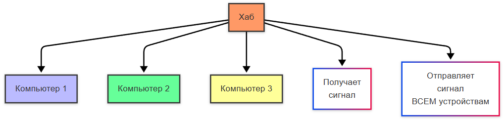

import TechHistoryPlay from '@site/src/components/TechHistoryPlay.jsx';

# История развития сетевых технологий

  ОБЯЗАТЕЛЬНО
  ДЛЯ НОВИЧКОВ

Всем

<TechHistoryPlay topic="network" />

---

## История сетевых технологий

  
Как читать эту главу

  

  Здесь много инженерных терминов (модуляция, репитеры, Ethernet). Для разработчика достаточно понять общую линию: аналог → цифра → локальные сети → TCP/IP. Детали кабельной инфраструктуры можно пролистать и вернуться позже.

  

Полезная стратегия чтения: фиксируйте, какую конкретную проблему решал каждый этап эволюции. Так история перестает быть перечислением дат и превращается в причинно-следственную цепочку.

---

### Зарождение линий

До появления телефонов люди, как мы ранее упомянули, передавали сообщения с помощью голубиной почты, и причем долгое время. Позднее появились специальные семафорные башни с флагами – оптические телеграфы, и электрический телеграф (Морзе) – первый самый быстрый способ связи, через точки и тире. Именно тогда стали передавать информацию, зашифрованную в сигналах. В 1858 году США и Великобританию связали первым трансатлантическим кабелем, передающим точки и тире Морзе. Так соединили континенты.

Сейчас азбука Морзе кажется чем-то романтическим из прошлого, но настолько важен вклад – именно это способ разбора сигналов на информацию. Но ещё более важным изобретением был **телефон** (1876, Белл). 

Но как работала телефонная линия?

- человек говорил в микрофон, мембрана устройства дрожала и меняла ток, вследствие чего **голос преображался в колебания электричества в медном проводе**, таким образом получая **аналоговый сигнал**;
- **операторы вручную соединяли абонентов**, перетыкая провода – это ручные коммутаторы;
- позднее появились **автоматические АТС**, дисковые телефоны с номерами, которые управляли электромеханическими коммутаторами (то есть, процесс переключения абонентов просто автоматизировали, а каждый абонент получал свой уникальный номер).

---

### Аналоговый сигнал и модемы

Аналоговый сигнал – голос, превращённый в колебания электричества. Именно поэтому важно отделять "цифровые сигналы" от "аналоговых". Проблема голоса в том, что к нему добавляются шумы, искажения, и требуются специальные усилители и фильтры, но к ним люди пришли позднее. Аналоговый сигнал – это непрерывный, постоянный сигнал, а цифровой – набор из "есть сигнал – нет сигнала", 0 и 1. И компьютеры как раз работают с цифровыми данными.

| Характеристика | Аналоговый сигнал | Цифровой сигнал |
| :--- | :--- | :--- |
| Форма | Непрерывный, волнообразный | Дискретный (0 и 1) |
| Помехи | Накапливаются (каждая царапина на виниле слышна) | Можно восстановить по избыточности (CD, Ethernet) |
| Пример | Голос в телефонной линии, FM-радио | Файл по FTP, пакет IP, поток HTTP |

Преобразовать аналог в цифру удалось через **модем** (**МО**дулятор-**ДЕМ**одулятор). Первые модемы превращали цифровые сигналы компьютера в звук, который мог передаваться по телефонной линии. Как это работало?
- компьютер посылал *данные* (0010101);
- модем преобразовывал их в тоны разной *частоты* (например, 0 = 1000 Гц, 1 = 2000 Гц);
- получался аналоговый *сигнал*, адаптированный под *цифру*;
- на другом конце модем *расшифровывал* эти звуки обратно в *цифру*.

И поэтому старые модемы пищали, это и был язык передачи данных. Модемы договаривались о скорости соединения (рукопожатие **Dial-up**). Но при этом, поскольку сигнал шёл по той же линии, она становилась занятой – нельзя было одновременно сидеть в интернете и звонить одновременно, да и сигнал был очень медленным (загрузка картинки могла отнять долгие минуты со скоростью 56 Кбит/с).

Позднее, в конце 1990-х, проблемы занятой линии решили при помощи технологии **DSL (Digital Subscriber Line)**, когда DSL стал использовать высокие частоты, которые не мешали голосу, благодаря чему телефон и интернет стали работать одновременно, и не нужен был "аналоговый разговор" как в Dial-Up, данные шли в чисто цифровом виде. 

---

### Кабели

Прокладывая *подводные кабели*, их сначала проектируют, выбирают маршруты, избегая разломы и рыболовные зоны. Корабли-кабелеукладчики медленно плывут, разматывая кабель с барабана. На мелководье кабель зарывают в дно, чтобы не порвать якорями и чем-то ещё. Причем каждые 50-100 км сигналы усиливают при помощи репитеры (репетиров). Самый длинный кабель – SEA-ME-WE 3 (39 тысяч километров, соединяет 33 страны). Их ремонтируют подводные роботы. Но мир не сразу пришёл к таким технологиям соединения проводами и образуя сеть. Что произошло потом, после появления цифровой связи?

Первые локальные сети использовали коаксиальный кабель (мы могли увидеть подобный в старых телевизионных антенных кабелях) – толстый, негибкий, сложный для прокладки. Но позднее технология изменилась на *витую пару* (**UTP** – Unshielded Twisted Pair) – более дешевый, удобный и тонкий, гибкий кабель, в котором пары проводов скручиваются, что позволяет эффективно гасить помехи. В итоге как раз UTP в дальнейшем стал стандартом для технологии – **Ethernet**. 

Ранний Ethernet использовал единый коаксиальный провод, который называли общим кабелем (*шиной*). Компьютер "слушал", свободен ли кабель, если свободен – отправлял данные, а если компьютеры отправляли данные одновременно – возникала коллизия, и приходилось ждать время для повторной отправки. Сеть тормозила при большом количестве устройств.

---

### Соединения устройств

Устройства требовали специальные адаптеры для связи с кабелями – это сетевые карты. Сетевая карта имеет свой **MAC-адрес** (например, `00:1A:2B:3C:4D:5E`) — физический идентификатор интерфейса; из чего он состоит (OUI, NIC, биты U/L и I/G) — в [основах сети](/encyclopedia/2-system-network/2-03-set-i-internet/1#mac-adres).

Соединяя множество компьютеров, использовали технологию "хабов" (**Hub**), который получал сигнал и отправлял его всем в сети. Позднее эту технологию заменили "свитчами" (**Switch**) – специальными "умными" коммутаторами, которые запоминали MAC-адреса и отправляли данные только нужному получателю, что позволило избавиться от коллизий и увеличить скорость. Так свитчи убили сетевые хабы.

Хабы

Свитчи

**Локальная сеть** (немного в другом виде, конечно) была еще давно, когда в одной организации научились соединять устройства и обмениваться данными, поначалу использовались "мейнфреймы" - древние огромные компьютеры, к которым подключались терминалы, и все вычисления делались на центральной машине. Мейнфрейн был своего рода прототипом сервера. Но, как мы помним, в 1980-х появились компьютеры, что позволило использовать компьютеры по специализации, превращая их в "сервер". На английском языке "сервис" (service) это услуга, а "сервер" - обслуживающий (server), к примеру, официант. 

Вот сервер это как раз и есть специальный "служащий" компьютер, у которого есть определенная цель:
- **файл-сервер** хранит общие документы;
- **почтовый сервер** обрабатывает электронную почту;
- **веб-сервер** обеспечивает работу сайтов.

Так, конечно же, компании стали использовать технологию использования своих серверов, расширяя и расширяя количество устройств, породив два важных понятия:
- **Интранет** – "частный интернет", когда существует локальная сеть компании с внутренними сайтами, почтой, базами данных, словно свой маленький закрытый клуб;
- **Интернет** – глобальное объединение сетей через TCP/IP, словно город, состоящий из клубов.

---

### Короткая хронология для запоминания

- Телеграф — передача кодов на расстояние.
- Телефон — массовая голосовая связь.
- Модемы и dial-up — цифровые данные через аналоговую линию.
- Ethernet и коммутаторы — масштабируемые LAN.
- TCP/IP и магистрали — глобальный интернет.

---

### Что изучить следом

- [Сеть и интернет — основы и принципы работы](/encyclopedia/2-system-network/2-03-set-i-internet/1)
- [Архитектура глобальной сети](/encyclopedia/2-system-network/2-03-set-i-internet/211)
- [Интернет-провайдер](/encyclopedia/2-system-network/2-03-set-i-internet/61)

---

{/* http-basics-link  */}

  
Основа по протоколу

  

  Базовый разбор HTTP и HTTPS находится в отдельной статье — [HTTP как основа веб-интеграций](/encyclopedia/2-system-network/2-09-osnovy-integratsionnogo-vzaimodeystviya/118).

  

{/* sidebar-collections */}

---

## В подборках

Статья входит в [тематические подборки](/about/collections) и блок «С чего начать?» на [главной](/). Соседние шаги того же маршрута:

**История** — [История информационных технологий — о разделе](/encyclopedia/1-basics/1-07-nemnogo-o-proshlom/intro), [История развития структур данных](/encyclopedia/3-data-markup/3-02-struktury-dannyh/11), [История развития NoSQL-систем](/encyclopedia/3-data-markup/3-06-nosql/1), [История языка JavaScript](/encyclopedia/5-languages/5-01-javascript/11), [История языка Python](/encyclopedia/5-languages/5-02-python/14), [История языка Java](/encyclopedia/5-languages/5-03-java/11).

{/* /sidebar-collections */}

---
