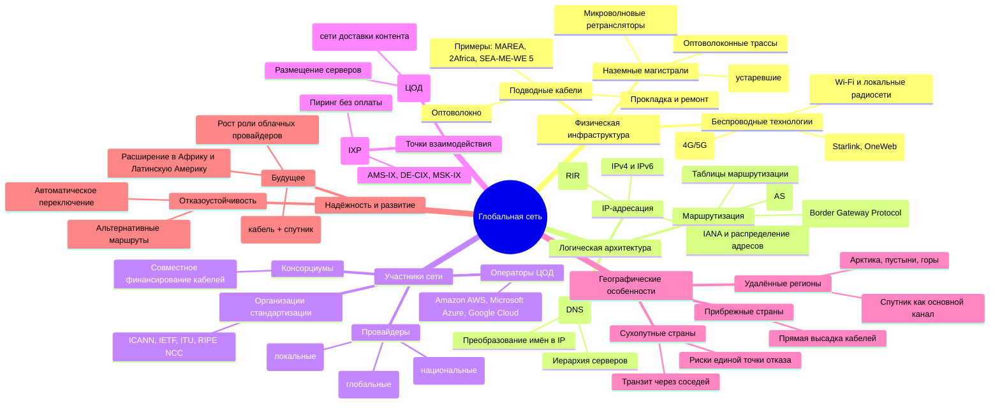
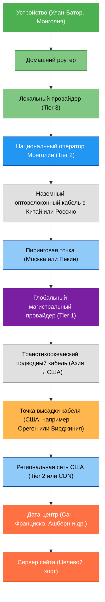

import NetworkStackExplorerPlay from '@site/src/components/NetworkStackExplorerPlay';
import CdnCacheEmulatorPlay from '@site/src/components/CdnCacheEmulatorPlay.jsx';

# Архитектура глобальной сети

  ОБЯЗАТЕЛЬНО
  ДЛЯ НОВИЧКОВ

Всем

## Как соединены устройства в глобальной сети

Глобальная сеть интернет существует как физическая инфраструктура, состоящая из миллионов устройств, кабелей, антенн, спутников и центров обработки данных. Каждое подключение к интернету — это результат сложной кооперации между технологиями, организациями и государствами, которые обеспечивают непрерывный поток данных между континентами, городами и отдельными пользователями. Чтобы понять, как именно устройства соединяются в единую сеть, необходимо рассмотреть эту систему на нескольких уровнях: физическом, логическом и организационном.

<NetworkStackExplorerPlay variant="global" />

>**Глобальная сеть** — это система взаимосвязанных компьютерных сетей, охватывающая территорию множества стран и континентов, обеспечивающая обмен данными между устройствами по единым протоколам.

>**Физическая инфраструктура** — это совокупность материальных компонентов, включая кабели, антенны, спутники, маршрутизаторы, коммутаторы и центры обработки данных, которые обеспечивают передачу и хранение информации в глобальной сети.

>**Кабель** — это проводное средство передачи данных, состоящее из одного или нескольких изолированных проводников, заключённых в защитную оболочку, предназначенное для соединения сетевых устройств на различных расстояниях.

>**Антенна** — это устройство, преобразующее электрические сигналы в радиоволны для беспроводной передачи данных и обратно, обеспечивая связь между наземными станциями, мобильными устройствами и спутниками.

>**Спутник** — это искусственный объект, размещённый на орбите Земли, оснащённый ретрансляторами и антеннами для приёма, усиления и передачи сигналов между удалёнными точками планеты, особенно в труднодоступных регионах.

>**Центр обработки данных** — это специализированное здание или комплекс, содержащий серверы, системы хранения, сетевое оборудование и средства обеспечения бесперебойной работы, предназначенный для размещения, обработки и передачи цифровой информации.

---

### Физический уровень

В основе интернета лежит физическая среда передачи данных. Основную часть трафика между странами и континентами переносят **подводные оптоволоконные кабели**. Эти кабели проложены по дну океанов и морей, соединяя береговые станции в разных частях света. Современные подводные кабели способны передавать терабиты информации в секунду, обеспечивая высокоскоростное соединение между Европой, Америкой, Азией и другими регионами.

>**Оптоволокно** — это тип кабеля, в котором данные передаются в виде световых импульсов по тонким стеклянным или пластиковым нитям, обеспечивающий высокую скорость и пропускную способность канала связи.

Подводные кабели представляют собой многослойные конструкции. Внутри находится стеклянное волокно, по которому световые импульсы несут цифровые данные. Вокруг него — защитные оболочки из пластика, стали и других материалов, предохраняющие кабель от давления воды, коррозии и повреждений. Прокладка таких кабелей — дорогостоящий и трудоемкий процесс, требующий специализированных судов и согласования с правительствами прибрежных государств.

Помимо подводных трасс, существуют **наземные оптоволоконные магистрали**, которые соединяют города внутри стран и связывают соседние государства. Эти магистрали часто проходят вдоль железных дорог, автотрасс или в специально проложенных каналах. В регионах с труднодоступной местностью — горах, пустынях, тундрах — используются микроволновые ретрансляторы или спутниковые каналы, хотя их пропускная способность и задержка обычно уступают оптоволокну.

>**Магистраль** — это высокоскоростной канал передачи данных, объединяющий крупные узлы сети, такой как межконтинентальный кабель или внутренняя магистраль интернет-провайдера, служащий основой для распределения трафика.

Для конечных пользователей интернет чаще всего приходит через **локальные сети**: медные кабели (например, витая пара), оптоволоконные линии до дома (FTTH) или беспроводные технологии, такие как Wi-Fi, мобильные сети (4G/5G) и спутниковый интернет. Все эти технологии являются последним звеном в длинной цепочке, начинающейся с межконтинентальных кабелей.

### Узлы и маршрутизация

Интернет состоит из множества взаимосвязанных сетей, каждая из которых управляется отдельной организацией — интернет-провайдером, университетом, корпорацией или государственным учреждением. Эти сети называются **автономными системами** (Autonomous Systems, AS). Каждая автономная система имеет свой уникальный номер (ASN) и набор IP-адресов, которыми она управляет.

Когда устройство отправляет данные в интернет, оно не знает полного маршрута до получателя. Вместо этого оно передает пакет своему ближайшему маршрутизатору — обычно это домашний роутер или оборудование провайдера. Этот маршрутизатор, в свою очередь, использует таблицы маршрутизации, чтобы определить, куда направить пакет дальше. Таблицы строятся на основе протоколов межсетевого взаимодействия, в первую очередь **BGP** (Border Gateway Protocol), который позволяет автономным системам обмениваться информацией о том, какие адреса они могут достичь.

Маршрутизация происходит по принципу «ближайшего шага». Пакет переходит от одного маршрутизатора к другому, каждый раз приближаясь к целевой сети. На этом пути он может пройти через десятки узлов, пересекая границы стран и сетей. Весь процесс занимает доли секунды благодаря высокой скорости передачи и эффективности современных алгоритмов.

### IP-адресация

Каждое устройство, подключенное к интернету, получает **IP-адрес** — числовой идентификатор, позволяющий другим устройствам находить его в сети. Существует два основных стандарта IP-адресации: IPv4 и IPv6. IPv4 использует 32-битные адреса, что даёт около 4 миллиардов возможных комбинаций. Из-за быстрого роста числа подключённых устройств этот запас исчерпан, и сегодня активно внедряется IPv6 с 128-битными адресами, обеспечивающими практически неограниченное пространство.

IP-адреса распределяются иерархически. На вершине этой иерархии стоят пять **региональных интернет-регистраторов** (RIR): ARIN (Северная Америка), RIPE NCC (Европа, Ближний Восток, Центральная Азия), APNIC (Азиатско-Тихоокеанский регион), LACNIC (Латинская Америка и Карибы) и AFRINIC (Африка). Они получают блоки адресов от **IANA** (Internet Assigned Numbers Authority), которая координирует глобальное распределение ресурсов интернета.

>**Интернет-регистратор** — это организация, ответственная за распределение и управление доменными именами, IP-адресами и другими ресурсами адресного пространства интернета в рамках определённой зоны или глобально.

Провайдеры и крупные организации получают свои блоки адресов от RIR, а затем выделяют их своим клиентам — домохозяйствам, компаниям, дата-центрам. Это позволяет создать чёткую структуру, в которой любой IP-адрес можно сопоставить с конкретной географической зоной и сетью.

### Как интернет попадает в страны без выхода к морю

Страны, не имеющие выхода к морю, такие как Казахстан, Монголия, Чад или Австрия, подключаются к глобальному интернету через наземные оптоволоконные линии, пересекающие границы с соседними государствами. Эти линии часто являются частью трансконтинентальных магистралей, например, связывающих Европу с Азией через Россию, Турцию или Кавказ.

В таких странах интернет-инфраструктура зависит от качества и надёжности транзитных соединений. Некоторые государства инвестируют в создание нескольких независимых маршрутов, чтобы избежать единой точки отказа. Например, Армения, будучи закрытой с двух сторон, развивает оптоволоконные связи через Грузию и Иран, обеспечивая резервирование трафика.

Часто в сухопутных странах действуют **точки обмена трафиком** (Internet Exchange Points, IXP), где местные провайдеры обмениваются данными напрямую, минуя международные каналы. Это снижает задержку, уменьшает стоимость трафика и повышает устойчивость локального сегмента интернета.

### Кто строит и поддерживает интернет

Интернет — это децентрализованная система, не принадлежащая ни одному государству или компании. Его строительством и обслуживанием занимаются сотни организаций по всему миру:

- **Телекоммуникационные компании** прокладывают и эксплуатируют магистральные кабели.
- **Консорциумы** из нескольких компаний совместно финансируют подводные кабели. Например, проект MAREA был реализован Microsoft и Facebook при участии испанского оператора Telxius.
- **Государственные агентства** иногда участвуют в финансировании национальных магистралей, особенно в развивающихся странах.
- **Международные организации**, такие как ITU (Международный союз электросвязи), вырабатывают стандарты и координируют использование радиочастот и спутниковых орбит.
- **Некоммерческие фонды**, например Internet Society, продвигают открытые стандарты и защищают принципы нейтральности сети.

Финансовая модель интернета основана на **взаиморасчётах между сетями**. Малые провайдеры платят крупным за транзит трафика. Крупные сети, имеющие примерно равный объём входящего и исходящего трафика, часто заключают соглашения о **пиринге** — бесплатном обмене данными. В точках обмена трафиком (IXP) такие соглашения оформляются технически и юридически, позволяя участникам экономить миллионы долларов ежегодно.

Конечный пользователь платит своему локальному провайдеру, который, в свою очередь, платит за подключение к более крупным сетям, пока трафик не достигнет глобального уровня. Таким образом, стоимость интернета распределяется по всей цепочке, от домашнего роутера до подводного кабеля в Атлантике.

### Резервирование и отказоустойчивость

Глобальная сеть спроектирована так, чтобы выдерживать сбои. Если один кабель повреждён — например, якорем судна или землетрясением — трафик автоматически перенаправляется по альтернативным маршрутам. Эта способность называется **отказоустойчивостью** и является одной из ключевых черт архитектуры интернета.

Однако не все регионы одинаково защищены. Некоторые островные государства или удалённые территории зависят от единственного подводного кабеля. В таких случаях обрыв может привести к полному отключению от интернета на несколько дней, пока не будет произведён ремонт. Поэтому развитие многоканальных подключений остаётся приоритетом для многих стран.

---

### Точки обмена трафиком

Когда два интернет-провайдера хотят обмениваться данными напрямую, они подключаются к **точке обмена трафиком** (Internet Exchange Point, IXP). Это физическое или виртуальное место, где маршрутизаторы множества сетей соединяются через высокоскоростной коммутатор. Участники IXP могут передавать трафик друг другу без оплаты за транзит, что снижает расходы и ускоряет доставку данных.

Крупнейшие точки обмена расположены в технологических и финансовых центрах: AMS-IX в Амстердаме, DE-CIX во Франкфурте, LINX в Лондоне, Equinix в Сингапуре и Нью-Йорке. Эти узлы объединяют сотни автономных систем — от национальных операторов до облачных гигантов вроде Google, Amazon и Microsoft. Через них проходит значительная часть мирового интернет-трафика.

В странах с развивающейся инфраструктурой создание локальных IXP особенно важно. Оно позволяет удерживать внутренний трафик внутри страны, а не отправлять его через Европу или США только для того, чтобы он вернулся обратно. Например, если пользователь в Казани заходит на сайт, размещённый в Москве, при наличии российского IXP (например, MSK-IX) этот трафик остаётся внутри России. Без IXP запрос мог бы уйти в Германию и вернуться обратно, увеличивая задержку и стоимость.

### Иерархия провайдеров

Интернет-провайдеры делятся на три условных уровня в зависимости от их роли в глобальной маршрутизации:

- **Tier 1** — глобальные магистральные операторы, владеющие обширными оптоволоконными сетями и подводными кабелями. Они охватывают несколько континентов и не платят никому за транзит, так как имеют прямые пиринговые соглашения со всеми другими Tier 1. Примеры: Lumen (США), GTT Communications, Telia (Европа), NTT (Япония).
  
- **Tier 2** — региональные или национальные провайдеры, которые покупают транзит у Tier 1, но также участвуют в пиринге с другими Tier 2 и локальными сетями. Большинство крупных провайдеров в странах относятся именно к этому уровню. Они обеспечивают связь между местными пользователями и глобальной сетью.

- **Tier 3** — локальные провайдеры, обслуживающие конечных пользователей: дома, малый бизнес, кафе. Они полностью зависят от Tier 2 или Tier 1 за выход в интернет и не участвуют в глобальной маршрутизации.

Эта иерархия не является жёсткой, но она помогает понять, как строится экономическая и техническая модель интернета. Пользователь платит Tier 3, тот платит Tier 2, а Tier 2 либо пирингуется с другими сетями, либо платит Tier 1 за доступ к остальной части мира.

### Как работает межконтинентальная маршрутизация

Представим, что пользователь в Улан-Баторе открывает сайт, размещённый в Сан-Франциско. Его запрос проходит следующий путь:

1. Домашний роутер направляет пакет локальному провайдеру (Tier 3).
2. Провайдер передаёт его национальному оператору Монголии (Tier 2).
3. Национальный оператор отправляет трафик через наземный кабель в Китай или Россию.
4. Там пакет попадает в сеть одного из Tier 1 (например, через пиринг в Москве или Пекине).
5. Tier 1 перенаправляет его по транстихоокеанскому подводному кабелю в США.
6. В США трафик поступает в дата-центр, где расположен сервер сайта.

На каждом этапе маршрутизаторы принимают решение на основе таблиц BGP, которые постоянно обновляются. Если один из маршрутов становится недоступен — например, из-за повреждения кабеля в Южно-Китайском море — система автоматически выбирает альтернативный путь, возможно, через Европу или Ближний Восток.

Такая гибкость достигается благодаря **децентрализованной природе BGP**: каждый участок сети сам решает, каким маршрутам доверять и какие анонсировать другим. Это делает интернет устойчивым, но также создаёт уязвимости — например, возможность BGP-угонов, когда злоумышленник объявляет чужие IP-адреса как свои. Поэтому крупные игроки используют механизмы фильтрации и проверки маршрутов, такие как RPKI (Resource Public Key Infrastructure).

### Роль дата-центров и CDN

<CdnCacheEmulatorPlay />

Современный интернет невозможно представить без **центров обработки данных** (ЦОД, data centers). Именно там размещаются серверы, хранящие веб-сайты, почтовые сервисы, облачные приложения и базы данных. Крупнейшие ЦОД принадлежат таким компаниям, как Amazon (AWS), Microsoft (Azure), Google Cloud, а также телекоммуникационным холдингам и независимым операторам.

Чтобы ускорить доставку контента, компании используют **сети доставки контента** (Content Delivery Networks, CDN). CDN состоит из множества серверов, распределённых по всему миру. Когда пользователь запрашивает видео, изображение или скрипт, CDN автоматически отдаёт его с ближайшего узла. Например, если вы смотрите фильм на стриминговом сервисе в Алматы, данные могут прийти не из Лос-Анджелеса, а из дата-центра в Дубае или даже в самом Казахстане.

CDN снижают нагрузку на основные серверы, уменьшают задержку и повышают отказоустойчивость. Они также играют роль в защите от DDoS-атак, фильтруя вредоносный трафик до того, как он достигнет источника.

### Кто управляет интернетом?

Интернет не имеет единого владельца, но его функционирование зависит от нескольких ключевых организаций, координирующих технические стандарты и распределение ресурсов:

- **ICANN** (Internet Corporation for Assigned Names and Numbers) отвечает за доменную систему и распределение IP-адресов через IANA.
- **IETF** (Internet Engineering Task Force) разрабатывает протоколы, такие как TCP/IP, HTTP, DNS.
- **ITU** (Международный союз электросвязи) — специализированное учреждение ООН, регулирующее использование радиочастот и спутниковых орбит.
- **Региональные регистраторы** (RIR) распределяют IP-адреса и AS-номера на своих территориях.

Эти организации работают на основе консенсуса и открытого участия. Любой инженер может предложить улучшение протокола через документ RFC (Request for Comments), а любая страна может участвовать в работе ITU. Такая модель обеспечивает стабильность и нейтральность интернета, хотя в последние годы усиливаются попытки некоторых государств установить над ним суверенный контроль.

### Зависимость от физической географии

Несмотря на кажущуюся «виртуальность», интернет сильно зависит от реального мира. Подводные кабели прокладываются вдоль безопасных морских путей, избегая зон землетрясений и активного судоходства. Наземные трассы следуют за железными дорогами и трубопроводами. Политические конфликты могут привести к отключению целых стран — как это происходило с Ираном или Сирией.

Некоторые государства инвестируют в создание **национальных сегментов интернета**, способных функционировать автономно. Другие, напротив, стремятся к максимальной интеграции в глобальную сеть. Выбор зависит от экономических, политических и стратегических приоритетов.

---

### Подводные кабели

Более 95% международного интернет-трафика передаётся по подводным оптоволоконным кабелям. Эти кабели — не просто провода, а сложные инженерные сооружения, спроектированные для работы на глубине до 8 километров и срока службы 25 лет и более.

Каждый кабель состоит из нескольких пар оптических волокон, каждая из которых способна передавать данные в обоих направлениях одновременно. Современные системы используют технологию **волнового мультиплексирования** (WDM), позволяющую отправлять сотни независимых каналов по одному волокну, каждый на своей длине волны света. Это обеспечивает общую пропускную способность в десятки терабит в секунду.

>**Волновое мультиплексирование** — это технология одновременной передачи нескольких потоков данных по одному оптоволоконному кабелю с использованием световых сигналов разных длин волн, что многократно увеличивает ёмкость канала связи.

Прокладка кабеля начинается с тщательного гидрографического обследования дна. Инженеры выбирают маршрут, избегая подводных вулканов, разломов, зон с сильными течениями и мест интенсивного судоходства. Затем специализированное судно медленно выпускает кабель с борта, одновременно закапывая его в грунт на прибрежных участках с помощью подводного плуга. В открытом океане кабель лежит свободно на дне.

Среди самых значимых магистралей:

- **MAREA** — соединяет Вирджинию (США) с Бильбао (Испания). Построен в 2018 году Microsoft и Facebook. Пропускная способность — 160 Тбит/с.
- **FLAG** (Fibre-optic Link Around the Globe) — один из первых глобальных кабелей, проложенный в 1990-х, соединяющий Великобританию с Японией через Средиземное море, Индию и Юго-Восточную Азию.
- **SEA-ME-WE 5** — связывает Сингапур с Францией через 17 стран, включая Египет, Саудовскую Аравию и Италию.
- **2Africa** — самый длинный кабель в мире (45 000 км), охватывающий 33 страны Африки, Ближнего Востока и Европы. Запущен в 2024 году консорциумом, в который входят Meta, China Mobile, Orange и другие.

Эти проекты реализуются консорциумами, где каждая компания инвестирует в строительство и получает право использовать определённую долю пропускной способности. Иногда кабели принадлежат одной компании — например, Google владеет кабелями Dunant и Grace Hopper, соединяющими США с Европой.

### Кто платит за подводные кабели?

Финансирование распределяется между участниками консорциума пропорционально их потребностям. Стоимость прокладки трансатлантического кабеля может достигать 300–500 миллионов долларов. Однако для крупных облачных провайдеров это выгоднее, чем арендовать каналы у телекоммуникационных компаний. Поэтому Amazon, Microsoft, Google и Meta активно инвестируют в собственную инфраструктуру.

Для стран, особенно малых островных государств, участие в таких проектах может быть затруднено из-за высокой стоимости. В таких случаях помощь оказывают международные организации — Всемирный банк, Азиатский банк развития или программы цифровой интеграции ЕС. Например, проект **EASSy** (Eastern Africa Submarine Cable System) был частично профинансирован Европейским инвестиционным банком и позволил десяткам африканских стран получить доступ к высокоскоростному интернету.

### Как подключаются удалённые регионы

Не все территории могут быть охвачены оптоволокном. Арктика, пустыни Сахара и Гоби, горные районы Гималаев и Анд — всё это зоны, где прокладка кабелей экономически нецелесообразна или технически невозможна. Здесь на помощь приходят альтернативные технологии:

- **Спутниковый интернет** — особенно актуален после запуска низкоорбитальных группировок, таких как **Starlink** (SpaceX), **OneWeb** и **Project Kuiper** (Amazon). Эти системы обеспечивают задержку в 20–50 мс, что сопоставимо с наземными сетями, и покрывают практически всю планету.
- **Микроволновые ретрансляторы** — используются для соединения удалённых населённых пунктов с ближайшей магистралью. Сигнал передаётся по прямой видимости между вышками на расстояние до 50 км.
- **Тропосферные радиосистемы** — позволяют передавать сигнал за пределы прямой видимости, отражая его от слоёв атмосферы. Применяются в военных и экстренных коммуникациях.

В последние годы спутниковые технологии становятся всё более доступными. Starlink, например, уже предоставляет услуги в Монголии, Казахстане, Непале и других странах с труднодоступной местностью. Это меняет баланс: ранее такие регионы зависели от дорогих и медленных геостационарных спутников, теперь они получают качественный интернет без прокладки кабелей.

### Геополитика кабелей

Маршруты подводных кабелей — не только технический, но и политический вопрос. Страны стремятся контролировать точки входа и выхода интернета на своей территории. Например, почти весь трафик между Европой и Азией проходит через Египет (Суэцкий канал) или Турцию (Босфор). Это делает эти государства стратегически важными узлами.

Некоторые страны требуют, чтобы кабели проходили через их территорию, чтобы иметь возможность мониторинга или регулирования. Другие, напротив, блокируют участие определённых компаний в строительстве. Так, США ограничили участие Huawei Marine в проектах из-за опасений по поводу безопасности.

Китай активно развивает инициативу «Цифровой шёлковый путь», прокладывая кабели через Центральную Азию, Африку и Латинскую Америку. Это создаёт альтернативные маршруты, независимые от западных операторов.

### Будущее глобальной связности

Тенденции развития интернет-инфраструктуры указывают на несколько ключевых направлений:

1. **Рост числа подводных кабелей**, особенно в Африке и Южной Америке, где спрос на интернет растёт быстрее всего.
2. **Усиление роли облачных гигантов** как владельцев инфраструктуры. Они строят не только кабели, но и дата-центры вблизи точек высадки, чтобы минимизировать задержку.
3. **Интеграция спутниковых и наземных сетей**. Уже сейчас некоторые провайдеры предлагают гибридные решения: оптоволокно в городах, спутник — в сельской местности.
4. **Повышение устойчивости** за счёт диверсификации маршрутов. Например, новый кабель **Amitié**, соединяющий США и Францию, проложен по северному маршруту, в обход перегруженных трасс через Лиссабон и Бильбао.

---

