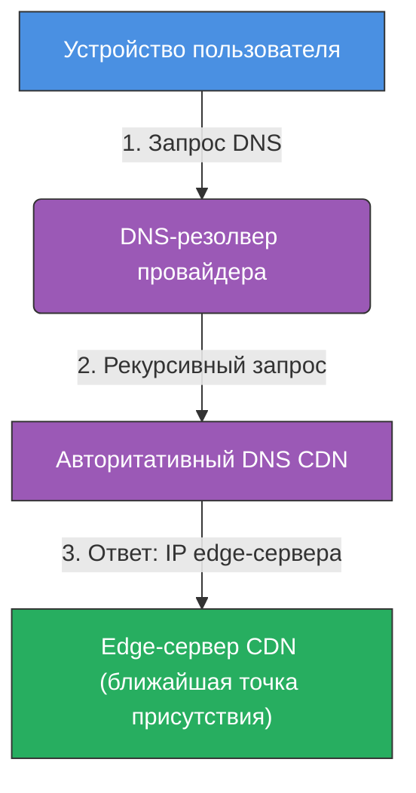
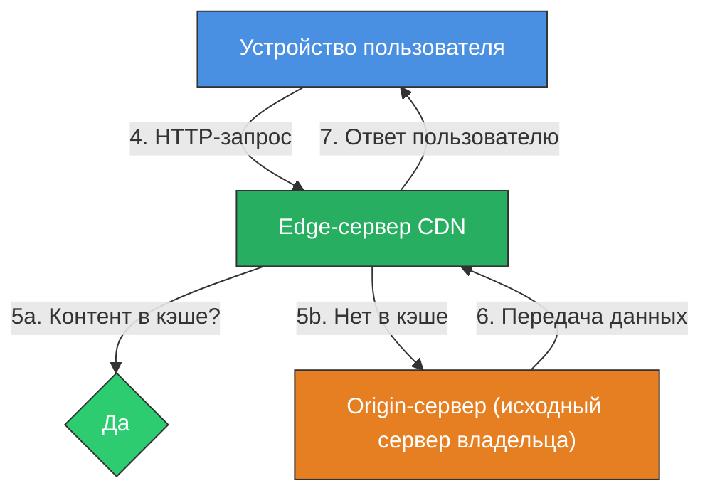

# Глобальная доставка контента - CDN и кэширование

  ОБЯЗАТЕЛЬНО
  ДЛЯ НОВИЧКОВ

Всем

---

## Глобальная доставка контента

Современный интернет — это сложная экосистема, где миллионы пользователей одновременно запрашивают видео, игры, программное обеспечение, музыку, карты, социальные ленты и другие формы цифрового контента. Каждый такой запрос требует передачи данных от сервера к устройству пользователя. Если сервер находится в другом полушарии, а пользователь — в Москве, задержка (латентность) может составлять сотни миллисекунд. Для обычного текста это почти незаметно, но для онлайн-игры, видеотрансляции или интерактивного сервиса такая задержка делает использование невозможным.

Чтобы решить эту проблему, была создана технология **Content Delivery Network**, или **CDN** — сеть доставки контента. Её задача — максимально приблизить данные к пользователю, минимизировать время загрузки и обеспечить стабильную работу даже при высокой нагрузке.

Когда пользователь вводит адрес сайта в браузере или запускает приложение, его устройство формирует **HTTP-запрос** к доменному имени (например, `example.com`). Этот запрос не может быть отправлен напрямую, потому что интернет работает с IP-адресами, а не с доменными именами. Поэтому первым шагом становится **разрешение доменного имени в IP-адрес** через систему **DNS (Domain Name System)**.

Устройство пользователя обращается к **DNS-резолверу**, который обычно предоставляется интернет-провайдером или настраивается вручную (например, Google Public DNS или Cloudflare DNS). Этот резолвер не хранит полную таблицу маршрутизации — он выполняет рекурсивный поиск: запрашивает корневые серверы, затем серверы домена верхнего уровня (.com, .ru и т.д.), затем авторитативные DNS-серверы домена `example.com`. В результате пользователь получает IP-адрес, связанный с этим доменом.

Если сайт использует CDN, владелец домена настраивает **CNAME-запись** в DNS, указывающую, что `example.com` делегирует разрешение имени CDN-провайдеру (например, `example.com.cdn.cloudflare.net`). В этом случае авторитативный DNS-сервер CDN принимает запрос и применяет технологию **GeoDNS**: он определяет географическое положение клиента по его исходящему IP-адресу и возвращает IP-адрес **ближайшей точки присутствия (PoP)** — edge-сервера CDN.

Таким образом, **DNS-сервер провайдера не содержит таблицы маршрутизации для всех сайтов**. Он лишь помогает найти правильный IP через цепочку DNS-запросов. Фактическое перенаправление на ближайший сервер происходит **на этапе DNS-разрешения**, а не на уровне маршрутизации трафика провайдером.

После получения IP-адреса устройства пользователя устанавливает TCP-соединение (и, при необходимости, TLS-сессию) с edge-сервером CDN. Этот сервер либо отдаёт закэшированный статический контент (изображения, скрипты, видео), либо, если контент отсутствует в кэше, обращается к **origin-серверу** — основному серверу владельца сайта — загружает данные и сохраняет их локально для будущих запросов.

Серверы CDN размещаются в **дата-центрах**, которые могут принадлежать как самому CDN-провайдеру (например, AWS), так и арендоваться у операторов дата-центров. Эти дата-центры строятся в стратегически важных точках: крупных городах, узлах магистральных сетей, рядом с точками обмена трафиком (IXP). Многие CDN также устанавливают **прямо в сетях провайдеров** свои кэширующие узлы через партнёрские соглашения (peering), чтобы минимизировать количество промежуточных хопов.

Итоговый путь запроса выглядит так:

1. Устройство → DNS-резолвер → авторитативный DNS CDN → IP ближайшего edge-сервера.  
2. Устройство → edge-сервер CDN → (при необходимости) origin-сервер.  
3. Ответ возвращается по тому же пути, но в обратном направлении.

Эта архитектура обеспечивает минимальную задержку, высокую скорость загрузки и устойчивость к перегрузкам.

То есть разрешается доменное имя так:

А контент доставляется так:

---

### Что такое CDN?

**Content Delivery Network (CDN)** — это географически распределённая инфраструктура серверов, предназначенная для ускорения доставки цифрового контента конечным пользователям. CDN не хранит оригинальные данные постоянно, а кэширует их — то есть временно сохраняет копии на своих серверах, расположенных в разных точках мира.

Основная цель CDN — сократить физическое расстояние между пользователем и источником данных. Вместо того чтобы каждый раз запрашивать файл с главного сервера, расположенного, например, в США, пользователь получает его с ближайшего кэширующего узла, который может находиться в том же городе или регионе.

---

### История появления CDN

В середине 1990-х годов интернет начал стремительно расти. Количество пользователей увеличивалось, а объём передаваемых данных — особенно мультимедийных — рос ещё быстрее. Серверы того времени обладали скромными вычислительными мощностями и пропускной способностью. При большом количестве одновременных запросов они просто не справлялись.

Тогда появились первые попытки оптимизировать доставку контента. Одним из ранних подходов стало **иерархическое кэширование** — идея размещать промежуточные кэширующие серверы между пользователем и источником. Эти серверы хранили часто запрашиваемые данные и отдавали их локальным пользователям, не обращаясь каждый раз к основному серверу.

Термин **"information superhighway"** (информационное шоссе), популярный в 1990-е, отражал представление о глобальной сети как о скоростной магистрали. Однако реальность показала, что без специализированной инфраструктуры эта "магистраль" быстро заторозится.

Переломный момент наступил в 1998 году, когда студент Массачусетского технологического института Дэниэл Левин и профессор Томсон Лейтон основали компанию **Akamai**. Они предложили использовать математические модели для оптимального распределения контента по сети. Akamai стала первой коммерческой CDN и до сих пор остаётся одним из крупнейших игроков на рынке.

С тех пор CDN превратились из нишевой технологии в обязательный элемент архитектуры любого масштабируемого интернет-сервиса. Сегодня такие гиганты, как **Amazon (AWS CloudFront)**, **Cloudflare**, **Microsoft Azure CDN**, **Fastly** и другие, предоставляют CDN-услуги миллионам сайтов и приложений по всему миру.

---

### Какие данные доставляет CDN?

CDN в первую очередь предназначена для работы со **статическим контентом** — данными, которые не изменяются при каждом запросе. К таким данным относятся:

- Изображения (фотографии, иконки, баннеры)
- Видео и аудиофайлы
- CSS- и JavaScript-файлы
- Шрифты
- Архивы и исполняемые файлы
- Файлы конфигураций и метаданные

Статический контент идеально подходит для кэширования, потому что его можно безопасно хранить на промежуточных серверах без риска устаревания. Например, логотип сайта или фоновая музыка к игре не меняются от запроса к запросу, поэтому их можно закэшировать один раз и отдавать тысячам пользователей.

Динамический контент — например, личная лента в социальной сети или результаты поиска — генерируется в реальном времени и зависит от конкретного пользователя. Такие данные обычно не кэшируются, но современные CDN всё чаще используют **ускорение маршрутизации** для динамических запросов: они не хранят данные, но обеспечивают более короткий и надёжный путь между пользователем и сервером.

---

### Архитектура CDN — origin, edge и PoP

Любая CDN состоит из двух ключевых компонентов:

1. **Origin-сервер (исходный сервер)** — это основной сервер владельца контента. Именно здесь хранятся оригинальные файлы. Когда CDN впервые получает запрос на файл, которого ещё нет в кэше, она обращается к origin-серверу, загружает данные и сохраняет их локально.

2. **Edge-серверы (точки присутствия, PoP — Point of Presence)** — это кэширующие серверы, размещённые в дата-центрах по всему миру. Каждый такой сервер обслуживает определённый географический регион. Когда пользователь запрашивает контент, система автоматически направляет его к ближайшему edge-серверу.

Например, если пользователь из Новосибирска открывает сайт, статические файлы которого раздаются через CDN, он получит их не с сервера в Амстердаме, а с edge-сервера в Москве или Екатеринбурге — в зависимости от того, какой из них ближе и менее загружен.

---

### Как пользователь попадает на ближайший сервер?

Для того чтобы направить запрос к ближайшему узлу, CDN использует две основные технологии: **GeoDNS** и **Anycast**.

**GeoDNS** — это расширение стандартной DNS-системы. Обычный DNS-запрос возвращает один IP-адрес для домена. GeoDNS же анализирует географическое положение клиента (по его IP-адресу) и возвращает IP-адрес edge-сервера, расположенного в том же регионе. Таким образом, один и тот же домен (например, `cdn.example.com`) может указывать на разные серверы для пользователей из разных стран.

**Anycast** — это сетевой протокол, при котором один и тот же IP-адрес объявляется сразу в нескольких точках сети. Когда пользователь отправляет запрос на этот IP, маршрутизаторы интернета автоматически выбирают кратчайший путь к ближайшей точке, где этот адрес активен. Anycast особенно эффективен для защиты от DDoS-атак и обеспечения отказоустойчивости.

Обе технологии работают совместно: GeoDNS определяет регион, Anycast — конкретный узел внутри региона.

---

### Как происходит кэширование?

Кэширование в CDN обычно работает **по первому запросу**. Когда первый пользователь в регионе запрашивает файл, которого ещё нет на локальном edge-сервере, CDN обращается к origin-серверу, получает файл и сохраняет его в кэше. Все последующие пользователи из этого региона получают уже закэшированную копию.

Срок хранения файла в кэше определяется **HTTP-заголовками**, установленными владельцем контента. Например, заголовок `Cache-Control: max-age=3600` указывает, что файл можно хранить в кэше один час. После истечения этого срока CDN автоматически проверит, обновился ли файл на origin-сервере, и при необходимости загрузит новую версию.

Некоторые CDN также поддерживают **региональное распространение кэша**: если файл востребован в Бразилии, соседние узлы в Латинской Америке могут получить его не от origin-сервера, а от бразильского edge-сервера. Это снижает нагрузку на origin и ускоряет распространение контента.

---

### Как CDN интегрируется в глобальную сетевую инфраструктуру

Когда пользователь запускает онлайн-игру, открывает сайт или смотрит стриминговое видео, его устройство проходит через несколько уровней сетевой иерархии. Сначала компьютер или смартфон подключается к домашнему роутеру. Роутер, в свою очередь, соединяется с локальной сетью интернет-провайдера — это может быть городская или региональная сеть. Далее трафик направляется в магистральные каналы, которые связывают регионы и страны. Эти магистрали принадлежат крупным телекоммуникационным компаниям и образуют так называемый **интернет-бэкбон** — основу глобальной сети.

Раньше большинство сервисов размещали свои серверы в одном или нескольких дата-центрах, часто в США или Западной Европе. Это означало, что пользователь из Азии или Южной Америки получал данные с огромной задержкой. Чтобы решить эту проблему, компании начали арендовать вычислительные мощности и сетевые ресурсы у специализированных поставщиков — **CDN-провайдеров**.

CDN-провайдеры владеют или арендуют **точки присутствия (PoP)** в десятках, а иногда и сотнях городов по всему миру. Каждая такая точка — это не просто сервер, а полноценный узел, подключённый к нескольким операторам связи одновременно. Это позволяет обеспечивать высокую пропускную способность и отказоустойчивость: если один канал перегружен или выходит из строя, трафик автоматически перенаправляется через другой.

Аренда серверов в CDN происходит по модели **Infrastructure-as-a-Service (IaaS)** или **Platform-as-a-Service (PaaS)**. Владелец контента не управляет физическими машинами напрямую. Он указывает, какой домен использовать как origin, какие файлы кэшировать, как долго их хранить и какие политики безопасности применять. Всё остальное — маршрутизация, балансировка нагрузки, обновление кэша — выполняет сама CDN.

---

### Географическое распределение и локализация

Одним из ключевых принципов работы CDN является **географическая близость**. Чем ближе сервер к пользователю, тем меньше время прохождения сигнала (latency) и тем выше скорость загрузки. Например, если пользователь из Москвы запрашивает игровой патч размером 10 ГБ, разница между загрузкой с сервера в Финляндии и с сервера в том же Москве может составлять часы.

Поэтому крупные сервисы стремятся размещать свои данные как можно ближе к конечным пользователям. Некоторые компании, такие как **Steam**, **Google**, **Microsoft**, даже создают собственные локальные кэширующие узлы внутри сетей провайдеров — это называется **peering** или **caching partnerships**. Такие узлы могут находиться прямо в дата-центрах провайдеров, что ещё больше сокращает задержку.

CDN-провайдеры также активно расширяют своё присутствие в развивающихся регионах. Например, Cloudflare и AWS открыли PoP в Индии, Бразилии, Южной Африке и других странах, где ранее инфраструктура была слабо развита. Это позволяет не только ускорить доступ, но и снизить стоимость передачи данных, так как трафик не покидает границ региона.

---

### Производительность, надёжность и пользовательский опыт

CDN оказывает прямое влияние на три ключевых параметра цифрового сервиса:

1. **Скорость загрузки** — за счёт кэширования и географической близости пользователь получает контент быстрее. Это особенно важно для мобильных устройств, где пропускная способность канала ограничена.
2. **Надёжность** — если origin-сервер выходит из строя, закэшированный контент остаётся доступным. Многие CDN также поддерживают автоматическое переключение на резервные узлы при сбоях.
3. **Масштабируемость** — во время пиковых нагрузок (например, запуск новой игры или трансляция крупного события) CDN берёт на себя основную нагрузку, предотвращая перегрузку origin-сервера.

Эти факторы напрямую влияют на **пользовательский опыт**. Исследования показывают, что каждая дополнительная секунда загрузки снижает вероятность завершения покупки на сайте на 7%. Для онлайн-игр задержка свыше 100 миллисекунд делает геймплей некомфортным. CDN помогает удерживать эти показатели в допустимых рамках.

---

### Кто использует CDN?

CDN применяется повсеместно. Среди основных пользователей:

- **Стриминговые платформы**: Netflix, YouTube, Twitch, Spotify — все они полагаются на CDN для доставки терабайтов видео и аудио ежедневно.
- **Онлайн-игры**: игровые клиенты, патчи, внутриигровые ассеты, голосовой чат — всё это часто раздаётся через CDN. Например, сервисы Xbox Live, PlayStation Network и Steam используют Amazon CloudFront и другие CDN для глобального масштабирования.
- **Социальные сети**: Facebook, Instagram, Twitter кэшируют изображения, аватары и видеофайлы через собственные и сторонние CDN.
- **Электронная коммерция**: сайты вроде Amazon, AliExpress, Wildberries используют CDN для ускорения загрузки карточек товаров и изображений.
- **Государственные и корпоративные порталы**: даже официальные сайты министерств и банков применяют CDN для защиты от DDoS-атак и обеспечения стабильности.

Фактически, любой современный веб-сервис, рассчитанный на массовую аудиторию, интегрирует CDN на ранних этапах развития.

---

### Как организуется блокировка CDN на уровне сетей

Доступ к CDN может быть ограничен на разных уровнях сетевой иерархии:

- **На уровне устройства**: пользователь может настроить файрволл или родительский контроль, который блокирует определённые домены или IP-адреса.
- **На уровне роутера**: домашний маршрутизатор может содержать правила фильтрации, запрещающие доступ к известным CDN-доменам.
- **На уровне интернет-провайдера**: провайдер может применять технические меры, предписанные регуляторами. Это может включать блокировку целых подсетей IP-адресов, принадлежащих CDN-провайдерам.
- **На уровне государственной инфраструктуры**: в некоторых странах применяются централизованные системы фильтрации, которые перехватывают DNS-запросы или анализируют трафик на магистральных узлах.

Особенность блокировки CDN заключается в том, что она редко бывает точечной. CDN-провайдеры используют **огромные пулы IP-адресов**, часто объединённые в **подсети**. Например, подсеть `45.90.0.0/16` может содержать 65 536 адресов. Если регулятор решает заблокировать CDN, он может просто занести всю подсеть в чёрный список, не проверяя, какие именно сервисы там размещены.

Такой подход приводит к **коллateral damage** — побочному ущербу: вместе с целевым сервисом становятся недоступны и другие легальные проекты, использующие ту же подсеть. Кроме того, CDN постоянно обновляют свои IP-пулы, добавляя новые адреса, что делает блокировки временно неэффективными.

---

### Подсети и их роль в DNS и маршрутизации

Подсеть — это логический сегмент IP-адресного пространства, выделенный для конкретной организации или цели. Подсети обозначаются в формате **CIDR** (Classless Inter-Domain Routing), например: `192.0.2.0/24`. Число после косой черты указывает, сколько бит фиксировано в адресе. Чем меньше это число, тем больше адресов входит в подсеть.

При маршрутизации интернет-трафика маршрутизаторы используют таблицы, в которых указано, какая подсеть куда направляется. Если CDN-провайдер анонсирует подсеть `45.90.0.0/16`, все запросы к адресам в этом диапазоне будут направляться к его шлюзам.

DNS-система, в свою очередь, отвечает за преобразование доменных имён в IP-адреса. Когда пользователь вводит `cdn.example.com`, DNS-сервер возвращает один или несколько IP-адресов, принадлежащих CDN. Если эти адреса входят в заблокированную подсеть, соединение не устанавливается.

Важно понимать, что **DNS и IP-маршрутизация — разные уровни**. DNS лишь указывает, куда идти, а реальная доставка пакетов зависит от состояния сетевых таблиц у провайдеров и глобальных маршрутизаторов.

---

### Крупнейшие CDN-провайдеры — архитектура и особенности

Сегодня рынок CDN доминируют несколько глобальных игроков, каждый из которых построил собственную уникальную инфраструктуру. Их подходы различаются по масштабу, географическому охвату, модели ценообразования и дополнительным функциям.

---

#### Amazon CloudFront (AWS)

Amazon CloudFront — это CDN-сервис от Amazon Web Services. Он интегрирован с другими сервисами AWS, такими как S3 (хранилище объектов), EC2 (виртуальные машины) и Lambda@Edge (выполнение кода на edge-серверах). CloudFront использует глобальную сеть из более чем 450 точек присутствия в 100+ странах. Его ключевая особенность — тесная связь с экосистемой AWS, что делает его удобным выбором для компаний, уже использующих облачные решения Amazon.

CloudFront активно применяется в игровой индустрии, стриминге и крупных веб-платформах. Многие онлайн-игры используют именно его благодаря высокой надёжности и автоматическому масштабированию.

---

#### Cloudflare

Cloudflare начал как сервис защиты от DDoS-атак, но быстро вырос в полноценную CDN с дополнительными возможностями: WAF (веб-брандмауэр), DNS-менеджмент, SSL/TLS-шифрование, Workers (выполнение JavaScript на edge-узлах). Cloudflare заявляет, что его сеть охватывает более 300 городов в 120 странах. Особенность Cloudflare — бесплатный базовый тариф, который сделал технологию доступной даже для небольших сайтов и личных проектов.

Cloudflare также известен своей политикой прозрачности и открытостью в вопросах безопасности. Его узлы часто размещаются прямо в дата-центрах интернет-провайдеров, что минимизирует задержку.

---

#### Akamai

Akamai остаётся одним из старейших и наиболее зрелых CDN-провайдеров. Компания управляет одной из крупнейших распределённых сетей в мире — свыше 375 000 серверов в 4 100+ локациях. Akamai специализируется на доставке мультимедийного контента, защите от кибератак и управлении API. Среди клиентов — правительственные структуры, финансовые учреждения и мировые медиакорпорации.

Архитектура Akamai отличается высокой степенью оптимизации под конкретные типы трафика: видео, программное обеспечение, игры. Компания также инвестирует в исследования сетевых протоколов и разработку собственных алгоритмов маршрутизации.

---

#### Microsoft Azure CDN

Azure CDN — часть облачной платформы Microsoft. Он предлагает три варианта backend: Verizon, Akamai и собственный Microsoft-движок. Это позволяет клиентам выбирать между разными уровнями производительности и ценами. Azure CDN особенно популярен среди корпоративных пользователей, использующих Microsoft 365, Xbox Live и другие сервисы экосистемы Microsoft.

Xbox Live, например, частично использует инфраструктуру Azure для доставки обновлений, игровых данных и авторизации. Это обеспечивает тесную интеграцию между игровой платформой и облачной сетью.

---

#### Fastly

Fastly позиционирует себя как "реал-тайм CDN". В отличие от традиционных провайдеров, где кэш обновляется по расписанию, Fastly позволяет мгновенно инвалидировать (удалять) кэш через API. Это критически важно для новостных сайтов, бирж и сервисов, где актуальность данных имеет первостепенное значение. Fastly также предоставляет мощные инструменты для кастомизации логики обработки запросов на edge-серверах.

---

### Модели ценообразования и доступность

CDN-услуги обычно тарифицируются по объёму переданного трафика (например, рубль за гигабайт) или по количеству запросов. Некоторые провайдеры предлагают фиксированные тарифы для предсказуемых нагрузок. Чем больше объём использования, тем ниже стоимость за единицу — действует принцип оптовой скидки.

Для образовательных, некоммерческих и стартап-проектов многие CDN предоставляют специальные программы поддержки. Например, Cloudflare for Teams, AWS Activate и GitHub Student Developer Pack включают бесплатные квоты на использование CDN.

Важно отметить, что стоимость CDN — это не только деньги, но и сложность интеграции. Некоторые провайдеры требуют изменения DNS-записей, настройки SSL-сертификатов, конфигурации заголовков кэширования. Другие предлагают "plug-and-play" решения, где достаточно указать origin-адрес.

---

### Роль CDN в современной цифровой экосистеме

CDN перестала быть просто инструментом ускорения. Сегодня она является **критическим элементом цифровой инфраструктуры**, обеспечивающим:

- **Масштабируемость**: миллионы пользователей могут одновременно получать один и тот же контент без перегрузки источника.
- **Безопасность**: защита от DDoS, фильтрация вредоносных запросов, шифрование трафика.
- **Надёжность**: отказоустойчивость за счёт репликации данных и автоматического переключения между узлами.
- **Инновации**: выполнение кода на edge-серверах (serverless computing), обработка видео в реальном времени, адаптивная доставка контента.

Без CDN невозможно представить себе современный интернет: ни потоковое видео, ни онлайн-игры, ни мгновенная загрузка веб-страниц. CDN делает цифровой мир быстрее, стабильнее и доступнее для каждого пользователя — независимо от его местоположения.

---
---

<!-- http-basics-link -->
:::tip Основа по протоколу
Базовый разбор HTTP и HTTPS находится в отдельной статье — [HTTP как основа веб-интеграций](/encyclopedia/2-system-network/2-09-osnovy-integratsionnogo-vzaimodeystviya/118).
:::

