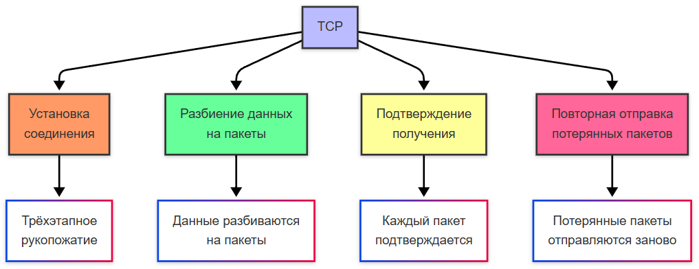

import HttpRequestAnalyzer from '@site/src/components/HttpRequestAnalyzer';

# Сетевые протоколы, порты и установка соединения

<div class="article-tags">
  <span class="tag tag-required">ОБЯЗАТЕЛЬНО</span>
  <span class="tag tag-beginner">ДЛЯ НОВИЧКОВ</span>
</div>

<span class="complexity-badge">Всем</span>

## Протоколы, порты и процесс соединения

### Протокол

Теперь мы плавно подойдём к теме портов протоколов. Понятно, как компьютеры соединяются, и что они обмениваются чередой сигналов 1 и 0. Но как они определяют, в какой последовательности кодировки расшифровывать сигналы? Вот для того, чтобы все устройства разговаривали на общем языке, и произошла стандартизация протоколов.

★ **Протокол** – это набор правил, по которым устройства обмениваются данными. Без них интернет был бы разговором на сотнях разных языков одновременно, но благодаря стандартизации мы получаем универсальность, независимость от ОС, надёжность передачи данных, и, конечно, эффективность. Иначе говоря, протокол = язык общения.

И если сеть – это «клуб» или «город», то у каждого члена клуба есть свой номер, свой адрес, свой некий идентификатор, который и делает его членом клуба. Это IP-адрес, словно почтовый адрес дома в городе. IP-адрес – это уникальный числовой идентификатор устройства в сети. Чтобы указать, куда отправить данные, нужно сообщить адрес.


IP-адрес может быть двух версий – IPv4 и IPv6. Почему появился IPv6? Потому что адреса закончились, устройств стало слишком много.

| Характеристика | IPv4 | IPv6 |
| :--- | :---: | ---: |
|Формат	|32 бита (4 числа, например, `192.168.1.1`)	|128 бит (8 групп, например `2001:0db8:85a3::8a2e:0370:7334`)
|Адреса	|Около 4,3 миллиардов	|340 секстиллионов (короче, бесконечно)

В роли «почтальонов», распределяющих данные между владельцами IP-адресов, работают маршрутизаторы – именно они решают, куда отправить пакет данных. Для эффективной работы составляются таблицы маршрутизации, содержащие кратчайший путь до устройства. То есть, вы не напрямую отправляете данные с компьютера на компьютер. 

Схема приблизительно такова:
```
Компьютер → Роутер → Провайдер → Сервер
```

Именно тут появляется такой персонаж, как **провайдер** – поставщик услуг соединения, организация, которая зарабатывает как раз на том, что осуществляет прокладку сети от серверов и распределяющих центров к целевым пользователям – абонентам. Провайдер отвечает за линию, которая подключается к роутеру, а роутер уже может быть в роли «главного» в своей локальной сети, но для того, чтобы выбраться в «глобальную сеть», придется подружиться с провайдером. Схема может быть и сложнее – провайдеров может быть несколько, и один передаёт пакет данных другому, прежде чем пакет доберётся до адресата, но суть такова.

---

## Стандартизация передачи данных

Чтобы стандартизировать и упростить понимание процессов передачи данных в сетях, была разработана модель OSI (Open Systems Interconnection) — эталонная семиуровневая модель, описывающая, как данные перемещаются между устройствами по сети. Каждый уровень отвечает за конкретную задачу и взаимодействует с уровнями выше и ниже.

### Физический уровень (Physical Layer)

Этот уровень отвечает за передачу неструктурированных битовых потоков через физическую среду. Он определяет тип кабеля (витая пара, коаксиальный, оптоволокно), тип разъёмов (RJ-45, DB-25), сигналы (электрические, оптические, радио), стандарты (EIA/TIA-232. V.35, Ethernet).

Пример физического уровня - передача единиц и нулей через медный кабель.

---

### Канальный уровень (Данные Link Layer)

Обеспечивает надежную передачу данных между двумя узлами сети на физическом уровне. Включает физическую адресацию (MAC-адреса), обнаружение ошибок, управление доступом к среде, стандарты и протоколы (IEEE 802.3 (Ethernet), IEEE 802.11 (Wi-Fi), PPP, HDLC). 

Пример канального уровня - коммутатор направляет пакеты по MAC-адресам.

---

### Сетевой уровень (Сеть Layer)

Отвечает за маршрутизацию и логическую адресацию. Определяет, как передавать данные между сетями, и включает протоколы: IPv4, IPv6, ICMP, ARP, IPsec.

Пример сетевого уровня - маршрутизатор (роутер) выбирает путь, по которому пакет дойдёт до цели.

---

### Транспортный уровень (Transport Layer)

Гарантирует надежную доставку данных между конечными точками. Может обеспечивать установку соединения (TCP), контроль потока и ошибок, сегментацию данных. Включает протоколы TCP, UDP, SPX.

К примеру, TCP как раз гарантирует, что все части файла будут получены и восстановлены в правильном порядке.

---

### Сеансовый уровень (Session Layer)

Управляет сеансами связи между приложениями, отвечает за установление, поддержание и завершение сеанса, синхронизацию обмена. Включает протоколы NetBIOS, RPC, Named Pipes.

Пример сеансового уровня - организация видеозвонка между двумя пользователями.

---

### Уровень представления (Presentation Layer)

Занимается преобразованием данных в формат, понятный приложению и выполняет шифрование/расшифровку (SSL/TLS), сжатие/распаковку, преобразование кодировок.

Пример уровня представления - браузер получает зашифрованный HTTPS-ответ и расшифровывает его.

---

### Прикладной уровень (Application Layer)

Самый верхний уровень, с которым взаимодействует пользователь напрямую. Он предоставляет сетевые сервисы приложениям. Включает протоколы HTTP, FTP, SMTP, DNS, Telnet, SNMP.

Пример прикладного уровня - открывается сайт в браузере, при этом используется HTTP или HTTPS.

---


## TCP и UDP

Есть такие протоколы, как TCP и UDP.

### TCP

★ **TCP (Transmission Control Protocol)** – надёжный протокол, который устанавливает соединение (через рукопожатие), разбивает данные на пакеты, подтверждает получение и повторно отправляет потерянные пакеты. Используется в:
	- веб-страницах (HTTP/HTTPS);
	- электронной почте (SMTP);
	- файлах (FTP).



---

### UDP


★ **UDP (User Datagram Protocol)** – более быстрый, но ненадёжный протокол, в котором данные отправляются без подтверждения, и нет повторной отправки. Такой протокол используется в видеозвонках (Zoom, Skype, VoIP), онлайн-играх и стриминге (видеотрансляциях). Именно поэтому соединение в этих примерах – нестабильное, но быстрое.


---

## HTTP

### HTTP

★ **HTTP (HyperText Transfer Protocol)** – специальный протокол, при котором данные идут открытым текстом (нет защиты), работает через порт 80 по принципу запрос-ответ. Клиент (браузер) отправляет HTTP-запрос на сервер, а сервер обрабатывает запрос и возвращает HTTP-ответ.

В процессе работы HTTP используются такие понятия, как:
	- метод запроса – определённая команда, которая определяет поведение при обработке запроса – GET, POST, PUT, DELETE и другие;
	- путь к ресурсу – к примеру, после указания URL (ссылки) сайта, можно указать `/index.html` – это будет путь к конкретному файлу, который должен к нам прийти в ответ, допустим;
	- версия протокола – к примеру, `HTTP/1.1`, определяющая версию языка;
	- статус-код (код состояния);
	- тип данных (content-type) – характеристика содержимого, допустим HTML, JSON или изображение. 
	
Но в HTTP нет шифрования, и злоумышленник может перехватить логины, пароли, банковские данные, а без проверки можно попасть на фейковый сайт.

<HttpRequestAnalyzer />

---

### HTTPS

★ **HTTPS (HTTP + SSL/TLS)** – зашифрованный протокол с защитой от перехвата, работающий через порт 443, и использующий сертификаты. Отличается наличием шифрования и аутентификации. Шифрование позволяет защитить от чтения, а аутентификация подтвердит, что сайт настоящий.

### Принцип работы HTTP

HTTPS/HTTP работает по принципу:
1. Запрашивающая сторона формирует запрос, и выполняет команду по отправке пакета данных определённому адресату по IP-адресу с использованием TCP (это и есть комбинация TCP/IP);
2. в HTTPS браузер дополнительно спрашивает сертификат сайта – специальный файл, содержащий уникальный набор сведений, проверяет подлинность этого сертификата, устанавливает шифрованное соединение, кодирует данные и только потом их отправляет. Сертификаты подписываются специальными центрами сертификации, поэтому клиент будет проверять сертификат с доверенными центрами, и только потом генерировать сеансовый ключ, который тоже будет шифровать;
3. Отправленный запрос отслеживается в процессе маршрутизации и получает определённый статус, к примеру успешно, нет такого адресата или адресат отклонил запрос, и в соответствии с общепринятым стандартом выдает код ответа (200, 404);
4. Запрашивающая сторона получает код ответа, и принимает к сведению – теперь мы знаем, что с нашим запросом, дошёл ли он до адресата. В HTTPS сервер также при приеме будет расшифровывать сеансовый ключ и только потом начинать шифрованный обмен данными; 
5. Получающая сторона получает пакет данных по протоколу TCP/IP, обрабатывает их по своей разработанной логике, формирует ответ (если вообще требуется ответ), и отправляет по адресу запрашивающей стороне.

Вот что происходит под капотом, когда вы открываете сайт – вы отправляете HTTPS-запрос к сертифицированному сайту, который лежит на сервере, обрабатывает ваш запрос и даёт вам в ответ определённый набор файлов сайта – веб-страницы, которые уже могут включать в себя логику дополнительных HTTPS-запросов, допустим, для загрузки изображений или иного контента. Именно на эту всю совокупность «запросов и ответов» у нас уходит трафик – массив действий по отправке и получению данных в сети.

И когда мы открываем страницу в интернете, то как раз таки каждый ресурс на ней подгружается через HTTP-запросы, потому если мы откроем вкладку Сеть в консоли разработчика, увидим так много запросов. Страница, стили, картинки, видео - всё получаем при помощи запросов.
В третьем томе мы ещё погрузимся в HTTP и запросы. Сейчас достаточно этого. 

Подробнее, кстати, можно прочитать здесь:
https://developer.mozilla.org/ru/docs/Web/HTTP

---

Кстати говоря, это MDN - веб-документация Mozilla Developer Сеть, обучающая платформа о веб-технологиях и ПО, на котором работает интернет. В дальнейшем мы не раз ещё будем упоминать веб-технологии, поэтому не забудьте посещать этот ресурс для получения подробностей.

---

## Порт

★ **Порт**. Что же такое порт? Как мы поняли, это числовой идентификатор для трафика программы. Как это работает:
	- программа-сервер «слушает» определённый порт (допустим, 80);
	- программа-клиент подключается к IP через порт 80;
	- ОС направляет трафик в нужную программу через порт;
	- в программе задан нужный порт, поэтому она по этому порту сигнал принимает, обрабатывает и отправляет ответ.


---

Клиент использует случайный высокий порт (например, 54321), а сервер использует фиксированный порт (например, 80 для HTTPS). Какие бывают типы портов:

| Диапазон | Назначение | Примеры |
| :--- | :---: | ---: |
|0 - 1023	|Системные (требуют прав root)	|80 (HTTP), 443 (HTTPS), 22 (SSH)
|1024 - 49151	|Пользовательские (для приложений)	|3306 (MySQL), 8080 (альтернативный HTTP)
|49152 - 65535	|Динамические (для клиентов)	|Временные порты для работы браузеров

---

TCP, основные протоколы и порты

| Порт | Протокол | Описание |
| :--- | :---: | ---: |
|20/21	|FTP	|Передача файлов
|22	|SSH	|Безопасное управление сервером
|25	|SMTP	|Отправка почты
|80	|HTTP	|Веб-трафик
|443	|HTTPS	|Зашифрованный веб-трафик
|3389	|RDP	|Удалённый рабочий стол (Windows)

---

UDP, основные протоколы и порты

| Порт | Протокол | Описание |
| :--- | :---: | ---: |
|53	|DNS	|Преобразование доменных имён
|67/68	|DHCP	|Автоназначение IP-адресов
|123	|NTP	|Синхронизация времени
|161	|SNMP	|Мониторинг сетевых устройств

---

Как проверить открытые порты?

Linux/macOS:
```
sudo netstat -tulnp
или
sudo ss -tulnp
```


Windows:
```
netstat -ano
```

---

## WebSocket

★ Другой протокол, который важно изучить, это **WebSocket**. В отличие, от HTTP, Websocket работает иначе, и используется для других целей. Представьте, что в HTTP вы отправляете курьера с посылкой, и ждёте сначала уведомления о доставке, а потом ответа. 

Вебсокет – это если бы вы позвонили адресату и поговорили с ним на прямой линии. 

В этом и разница:

- **HTTP** – запрос-ответ (отправил сообщение и ждёт ответ);

- **WebSocket** – устанавливается **постоянное соединение** для обмена данными.

WebSocket работает в следующем порядке:
	- клиент отправляет HTTP-запрос с заголовком, содержащим upgrade: websocket;
	- сервер отвечает подтверждением (это и называется рукопожатием);
	- после того как клиент и сервер «договорились», соединение «апгрейдится» до WebSocket и все данные в дальнейшем обмениваются по бинарному протоколу;
	- обмен данными идёт через «фреймы» - текст (0x1), бинарные данные (0x2), пинг-понг (0x9, 0xA) для проверки связи.
	
WebSocket, благодаря стабильности, используется в онлайн-чатах, многопользовательских играх, биржевых котировках, когда требуется синхронизация между клиентом и сервером.

Как HTTPS для HTTP, защищённым вариантом является WSS (WebSocket Secure), использующий TLS-шифрование.

---
