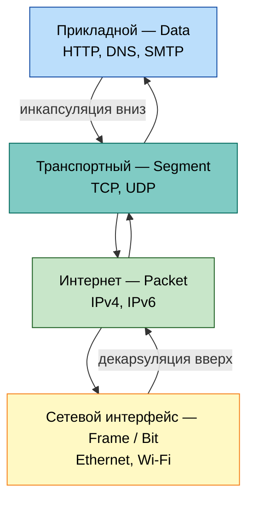
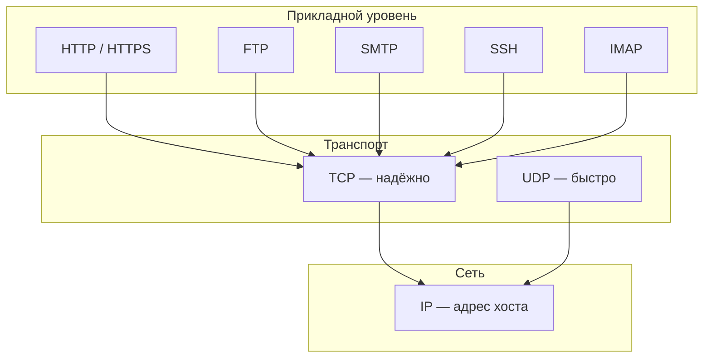

import ExternalPlayEmbed from '@site/src/components/ExternalPlayEmbed';


# Сетевые протоколы, порты и установка соединения

<div class="article-tags">
  <span class="tag tag-required">ОБЯЗАТЕЛЬНО</span>
  <span class="tag tag-beginner">ДЛЯ НОВИЧКОВ</span>
</div>

<span class="complexity-badge">Всем</span>

---

## Протоколы, порты и процесс соединения

> Обзор PAN/LAN, NAT и VPN — в [основах раздела](./1.md). Здесь — модель OSI, транспорт и прикладные протоколы.

Эту тему удобно читать от практики к теории: сначала представьте один запрос браузера к сайту, а затем раскладывайте его по уровням OSI и TCP/IP.

---

### Протокол

Теперь мы плавно подойдём к теме портов протоколов. Понятно, как компьютеры соединяются, и что они обмениваются чередой сигналов 1 и 0. Но как они определяют, в какой последовательности кодировки расшифровывать сигналы? Вот для того, чтобы все устройства разговаривали на общем языке, и произошла стандартизация протоколов.

★ **Протокол** – это набор правил, по которым устройства обмениваются данными. Без них интернет был бы разговором на сотнях разных языков одновременно, но благодаря стандартизации мы получаем универсальность, независимость от ОС, надёжность передачи данных, и, конечно, эффективность. Иначе говоря, протокол = язык общения.

И если сеть – это "клуб" или "город", то у каждого члена клуба есть свой номер, свой адрес, свой некий идентификатор, который и делает его членом клуба. Это IP-адрес, словно почтовый адрес дома в городе. IP-адрес – это уникальный числовой идентификатор устройства в сети. Чтобы указать, куда отправить данные, нужно сообщить адрес.


IP-адрес может быть двух версий – IPv4 и IPv6. Почему появился IPv6? Потому что адреса закончились, устройств стало слишком много.

| Характеристика | IPv4 | IPv6 |
| :--- | :--- | :--- |
| Формат | 32 бита (4 числа, например `192.168.1.1`) | 128 бит (8 групп, например `2001:0db8:85a3::8a2e:0370:7334`) |
| Адреса | Около 4,3 млрд | ~3,4×10³⁸ (практически неисчерпаемо) |

<div class="callout callout--tip">
  <div class="callout-title">Напоминалка по IP</div>

  <div class="callout-body">
  Частные диапазоны (`10.x`, `172.16–31.x`, `192.168.x`), маски CIDR, loopback, APIPA, публичные DNS и адреса IPv6 — [справочник IP и CIDR](./619.md).
  </div>
</div>

В роли "почтальонов", распределяющих данные между владельцами IP-адресов, работают маршрутизаторы – именно они решают, куда отправить пакет данных. Для эффективной работы составляются таблицы маршрутизации, содержащие кратчайший путь до устройства. То есть, вы не напрямую отправляете данные с компьютера на компьютер. 

Схема приблизительно такова:
```
Компьютер → Роутер → Модем → Провайдер → … → Сервер
```

**Роутер** управляет домашней сетью (частные IP, NAT, DHCP). **Модем** — мост к линии провайдера и публичному IP на границе квартиры; в одном корпусе с роутером их часто не различают. Подробнее — [модем и маршрутизатор](./21#modem-i-router).

Именно тут появляется такой персонаж, как **провайдер** – поставщик услуг соединения, организация, которая зарабатывает как раз на том, что осуществляет прокладку сети от серверов и распределяющих центров к целевым пользователям – абонентам. Провайдер отвечает за магистраль до вашего модема; роутер остаётся "главным" в локальной сети, а выход в глобальную сеть идёт через цепочку модем → сеть оператора. Схема может быть и сложнее – провайдеров может быть несколько, и один передаёт пакет данных другому, прежде чем пакет доберётся до адресата, но суть такова.

---

## Стандартизация передачи данных

Чтобы стандартизировать и упростить понимание процессов передачи данных в сетях, была разработана модель **OSI** (Open Systems Interconnection) — эталонная семиуровневая модель, описывающая, как данные перемещаются между устройствами по сети. Каждый уровень отвечает за конкретную задачу и взаимодействует только с соседними уровнями: при отправке данные спускаются вниз (добавляются заголовки), при приёме поднимаются вверх (заголовки снимаются).

Понимание OSI помогает при **диагностике** (обрыв на кабеле, MAC, IP или в приложении), при **маршрутизации** (логические адреса и таблицы путей) и при **защите** (TLS, IPsec, правила фаервола по уровням). В реальных сетях доминирует четырёхуровневый стек **TCP/IP**; OSI — общий язык для обучения и документации. Сводная таблица уровней (сверху вниз, как в большинстве схем):

| № | Уровень | Задача | Примеры протоколов и технологий |
|---|---------|--------|--------------------------------|
| 7 | Прикладной | Сетевые сервисы для программ и пользователя | HTTP, HTTPS, DNS, FTP, SMTP, POP3, IMAP, Telnet, SNMP |
| 6 | Представления | Формат данных, кодировка, сжатие | UTF-8, JSON, gzip, JPEG, MP3; TLS (в учебных схемах) |
| 5 | Сеансовый | Установка и ведение сеанса обмена | RPC, SIP, RTP; установка TCP-сессии |
| 4 | Транспортный | Доставка между хостами, порты, надёжность | TCP, UDP, SCTP, QUIC |
| 3 | Сетевой | Маршрут и логическая адресация | IPv4, IPv6, ICMP, ARP, IGMP, OSPF, IPsec |
| 2 | Канальный | Кадры внутри сегмента, MAC-адреса | Ethernet (802.3), Wi‑Fi (802.11), VLAN, PPP, HDLC |
| 1 | Физический | Среда, сигнал, передача битов | RJ-45, оптоволокно, DSL, RS-232, 100BASE-TX |

Ниже уровни разобраны **снизу вверх** — так проще связать их с "путём" сигнала от кабеля до браузера.

---

### Физический уровень (Physical Layer)

**Задача** — среда, сигнал и побитовая передача между двумя точками соединения.

Уровень задаёт тип кабеля (витая пара, коаксиал, оптоволокно), разъёмы (RJ-45, DB-25), вид сигнала (электрический, оптический, радио) и физические стандарты. Протоколы верхних уровней здесь ещё не видны — только нули и единицы в среде.

**Примеры технологий и стандартов**

- RS-232, V.34 (модемы), 100BASE-TX, SDH
- DSL, оптоволокно, радиоканал
- разъёмы и кабельные стандарты (RJ-45 и аналоги)

Часть спецификации **802.11 (Wi‑Fi)** относится и к физике, и к каналу; в учебниках уровни разделяют, в эксплуатации Wi‑Fi обычно рассматривают как единый стек.

**На практике** — обрыв патч-корда, плохой контакт в розетке, помехи на радиолинии; симптомы видны до появления IP (линк "down", нет carrier).

---

### Канальный уровень (Data Link Layer)

**Задача** — физическая (MAC) адресация и доставка **кадров** между соседними узлами в одном сегменте сети.

Уровень добавляет заголовки кадра, контроль ошибок (CRC), управление доступом к общей среде. **Коммутатор** работает здесь и пересылает кадры по MAC-адресам; **VLAN** логически делит сегмент на канальном уровне. У MAC-адреса есть префикс производителя (OUI), уникальная часть адаптера и служебные биты unicast/multicast — см. [структуру MAC](/encyclopedia/2-system-network/2-03-set-i-internet/1#mac-adres).

**Примеры протоколов и технологий**

- Ethernet (IEEE 802.3), Wi‑Fi (802.11), MAC/LLC
- VLAN, PPP, HDLC, Frame Relay, Token Ring (исторически)
- Fibre Channel, ATM (в ЦОД и legacy-сетях)

**На практике** — дублирующийся MAC, шторм broadcast, ошибки CRC в `tcpdump`.

---

### Сетевой уровень (Network Layer)

**Задача** — выбор пути и **логическая** адресация (IP) между разными сетями.

**Маршрутизатор** принимает решение, куда отправить пакет дальше, по таблицам маршрутизации. ARP связывает IP с MAC в пределах LAN; ICMP — диагностика (`ping`, "host unreachable").

**Примеры протоколов**

- IPv4, IPv6
- ICMP, IGMP
- ARP
- OSPF, BGP (динамическая маршрутизация)
- IPsec (шифрование и аутентификация на сетевом уровне, в т.ч. VPN)

**На практике** — неверная маска подсети, "нет маршрута до хоста", TTL expired в `traceroute`.

---

### Транспортный уровень (Transport Layer)

**Задача** — сквозная доставка между **процессами** на двух хостах — порты, сегментация, (при необходимости) надёжность и контроль перегрузки.

**TCP** устанавливает соединение, нумерует сегменты и восстанавливает порядок при потерях. **UDP** отдаёт датаграммы без гарантий — быстрее, подходит для VoIP, игр, DNS-запросов. Пара `IP:порт` называют **сокетом**.

**Примеры протоколов**

- TCP, UDP, SCTP
- QUIC (поверх UDP, с встроенным TLS — см. ниже)

**На практике** — "connection refused" (порт закрыт), таймаут TCP, переполнение буфера приёма.

---

### Сеансовый уровень (Session Layer)

**Задача** — установление, поддержание и завершение **сеанса** обмена между приложениями на разных хостах.

В стеке TCP/IP многие функции сеанса "встроены" в TCP (трёхстороннее рукопожатие, FIN). Отдельно выделяют протоколы, где сеанс явно управляется.

**Примеры**

- RPC, Named Pipes
- SIP (сигнализация VoIP), RTP (медиапоток)
- NetBIOS (legacy Windows-сети)

**На практике** — обрыв длительного видеозвонка, "зависший" сеанс RDP без корректного logout.

---

### Уровень представления (Presentation Layer)

**Задача** — представление данных в форме, понятной приложению — кодировки, сжатие, сериализация, при необходимости шифрование **до** прикладного протокола.

**Примеры**

- кодировки (UTF-8), сжатие (gzip, Brotli)
- сериализация (JSON, XML, Protobuf)
- форматы файлов при передаче (HTML, DOC, JPEG, MP3, AVI)
- **TLS/SSL** в учебной модели OSI часто относят сюда; в TCP/IP шифрование HTTPS выполняется **между TCP и HTTP** — см. раздел HTTP/HTTPS ниже

Сервер отдаёт JSON в gzip — клиент распаковывает и парсит: это типичные задачи представления.

---

### Прикладной уровень (Application Layer)

**Задача** — сетевые сервисы, с которыми работают программы и пользователь: "процесс сети → приложение".

**Примеры протоколов**

- HTTP, HTTPS (как схема поверх TLS)
- DNS, FTP, SMTP, POP3, IMAP
- Telnet, SNMP
- P2P-протоколы (BitTorrent и др.)

Открытие сайта в браузере — работа прикладного уровня (HTTP-запросы и ответы); пользователь видит результат, не зная деталей Wi‑Fi и IP ниже.

<span id="model-tcp-ip"></span>

## Модель TCP/IP

В **Интернете и большинстве корпоративных сетей** данные проходят не по семи уровням OSI "как в учебнике", а по четырёхуровневой **модели TCP/IP** (иногда её называют **стеком TCP/IP** или **моделью DoD**). OSI помогает разложить задачи по полочкам; TCP/IP описывает то, что реально реализуют операционные системы, маршрутизаторы и браузеры.

При **отправке** приложение передаёт полезные данные вниз по стеку — на каждом уровне добавляется свой заголовок (иногда трейлер), и единица данных получает своё имя — **PDU** (Protocol Data Unit, единица данных протокола). При **приёме** порядок обратный: заголовки снимаются слой за слоем, пока байты не вернутся в программу.

| Уровень TCP/IP | PDU (единица данных) | Что добавляет уровень | Типичные протоколы и технологии |
| :--- | :--- | :--- | :--- |
| **Прикладной** (Application) | **Data** (данные) | Смысл сообщения для программы: HTTP-запрос, письмо SMTP, DNS-запрос | HTTP, HTTPS, DNS, FTP, SFTP, SMTP, POP3, IMAP, SSH, Telnet; форматы JPEG, MPEG; сжатие ZIP; шифрование в TLS/RSA; RPC |
| **Транспортный** (Transport) | **Segment** (сегмент) | Порты источника и назначения, (для TCP) номера сегментов, подтверждения, окно | TCP, UDP, SCTP; QUIC поверх UDP |
| **Интернет** (Internet) | **Packet** (пакет) | IP-адреса источника и назначения; маршрут между сетями | IPv4, IPv6, ICMP; маршрутизация OSPF, BGP; IPsec |
| **Сетевой интерфейс** (Network Interface) | **Frame** (кадр) на канале, **Bit** (бит) на физике | MAC-адреса в LAN; сигнал по кабелю или в эфире | Ethernet, Wi‑Fi, ARP, VLAN, STP; витая пара UTP, оптоволокно |

Сверху вниз адресация выглядит так: **порт** (какой процесс на хосте) → **IP** (какой хост в сети) → **MAC** (какой сосед в сегменте Ethernet) → **биты** в среде. Коммутатор смотрит на MAC; маршрутизатор — на IP; операционная система после TCP отдаёт байты нужному сокету по порту.

### Задачи уровней на примере веб-страницы

**Прикладной** — браузер и сервер договариваются на языке HTTP — метод `GET`, путь `/`, заголовки, тело ответа. Здесь же живут сеанс (cookie, keep-alive), представление (gzip, JSON, TLS внутри HTTPS) и сами правила протокола. Почтовый клиент на этом же уровне говорит SMTP или IMAP.

**Транспортный** — доставка **между двумя IP-адресами** до конкретного процесса. **TCP** устанавливает соединение, нумерует сегменты, подтверждает приём и при необходимости повторяет потерянное — поэтому HTTP/1.1 и HTTPS почти всегда идут поверх TCP. **UDP** отдаёт датаграмму без гарантий — быстрее; подходит для DNS-запросов, VoIP, игр; **QUIC** (HTTP/3) строит надёжность поверх UDP.

**Интернет** — логическая адресация и **маршрут** через цепочку маршрутизаторов от вашего провайдера до дата-центра сервера. Пакет несёт IP источника и назначения; каждый роутер выбирает следующий hop по таблице маршрутизации.

**Сетевой интерфейс** объединяет канальный и физический уровни OSI. В домашней Wi‑Fi кадр Ethernet/Wi‑Fi доставляется от вашего ПК до точки доступа по **MAC**; по оптике провайдера биты идут дальше, пока пакет снова не окажется в Ethernet дата-центра.

### Инкапсуляция — "матрёшка" пакетов

Один и тот же HTTP-запрос на проводе выглядит как вложенные оболочки:

```text
[ HTTP-запрос ]  →  в TCP-сегменте (порты 443, seq/ack)  →  в IP-пакете  →  в Ethernet-кадре  →  биты в кабеле/эфире
     Data                 Segment                           Packet              Frame              Bit
```

На приёме сервер снимает заголовок кадра, затем IP, затем TCP, и только потом передаёт тело HTTP в nginx или другой веб-сервер.



### Сопоставление OSI и TCP/IP

| Уровни OSI (7) | Уровень TCP/IP (4) |
| :--- | :--- |
| 7 Прикладной, 6 Представления, 5 Сеансовый | **Прикладной** |
| 4 Транспортный | **Транспортный** |
| 3 Сетевой | **Интернет** |
| 2 Канальный, 1 Физический | **Сетевой интерфейс** |

Уровни 5–7 OSI в TCP/IP не выделяют отдельно: сжатие, TLS и управление сеансом чаще "сидят" рядом с прикладным протоколом или внутри TCP. Для диагностики по-прежнему удобно говорить "проблема на L3" (IP) или "на L7" (HTTP) — эти номера из OSI.

<div class="callout callout--info">
  <div class="callout-title">Диагностика по уровням</div>

  <div class="callout-body">
  Классификация сетевых ошибок по уровням — в [статье про коды и диагностику](/encyclopedia/2-system-network/2-06-sistemnoe-administrirovanie/9#4-сетевые-ошибки). Сопоставление утилит (`curl`, `traceroute`, `tcpdump`) с уровнями — в [продвинутом софте](/encyclopedia/1-basics/1-13-soft-prodvinutogo-polzovatelya/5#сравнительная-таблица-утилит). Разбор заголовков пакета по слоям — в [инкапсуляции и захвате трафика](./615.md).
  </div>
</div>

---

<span id="tcp-i-udp"></span>

## TCP и UDP

Есть такие протоколы, как TCP и UDP.

---

### TCP

★ **TCP (Transmission Control Protocol)** – надёжный протокол, который устанавливает соединение (через рукопожатие), разбивает данные на пакеты, подтверждает получение и повторно отправляет потерянные пакеты. Используется в:

- веб-страницах (HTTP/HTTPS);
- электронной почте (SMTP);
- передаче файлов (FTP, SFTP поверх SSH).


Углублённый разбор рукопожатия, окна приёма, slow start и перегрузки — в статье [TCP — соединение, окно и перегрузка](./421.md).

---

### Мультиплексирование портов

На одном IP-адресе хоста одновременно работают браузер, почтовый клиент и мессенджер. **Порт** (16 бит, 0–65535) отличает **процессы** и **соединения**. Пара "IP + порт" на каждом конце — **сокет**.

При приёме сегмента TCP ОС смотрит на порты назначения и источника и передаёт данные нужному сокету приложения. Без портов нельзя было бы открыть сотню вкладок на один и тот же `443` у CDN.

| Диапазон | Назначение |
| :--- | :--- |
| 0–1023 | Well-known — HTTP 80, HTTPS 443, DNS 53 |
| 1024–49151 | Зарегистрированные службы |
| 49152–65535 | Эфемерные порты клиента при исходящих соединениях |

Сводная таблица — [справочник портов](./618.md#18-osnovnyh-portov).

---

### UDP


★ **UDP (User Datagram Protocol)** – более быстрый, но ненадёжный протокол, в котором данные отправляются без подтверждения, и нет повторной отправки. Такой протокол используется в видеозвонках (Zoom, Skype, VoIP), онлайн-играх и стриминге (видеотрансляциях). Именно поэтому соединение в этих примерах – нестабильное, но быстрое.


На нестабильном канале растут **RTT** (время туда-обратно, как в `ping`), **потери пакетов** и у TCP — **повторные отправки**. В эмуляторе ниже задайте задержку, джиттер и процент потерь, переключите TCP и UDP и сравните журнал: надёжный протокол "дотягивает" данные ценой большего RTT, а UDP теряет датаграммы без восстановления.

<ExternalPlayEmbed example="system-network/network-emulator-play" title="Эмулятор сети" minHeight={480} />

---

### QUIC

★ **QUIC (Quick UDP Internet Connections)** — транспорт поверх **UDP**, обычно на порту **443**. В протокол встроены **TLS 1.3** и мультиплексирование потоков, поэтому **HTTP/3** не требует отдельного TCP-рукопожатия перед шифрованием. Потеря пакета в одном запросе не блокирует остальные — в отличие от HTTP/2 поверх одного TCP-сокета. Подробнее — [как работают сайты](/encyclopedia/2-system-network/2-04-kak-rabotayut-sayty-i-veb-sayty/1#http-evolution-h2-h3) и [справочник 618](./618.md).

---

<span id="key-network-protocols"></span>

## Ключевые сетевые протоколы — обзорная карта

Перед разбором HTTP полезно держать в голове **девять протоколов**, которые чаще всего встречаются в учебниках и на собеседованиях. Они работают на разных **уровнях** стека TCP/IP — адресация, надёжная доставка, прикладные сервисы.

| Протокол | Расшифровка | Уровень | Зачем нужен |
| :--- | :--- | :--- | :--- |
| **IP** | Internet Protocol | Сетевой (Internet) | Даёт **логические адреса** устройств (`192.168.1.1`, IPv6); маршрутизаторы пересылают **пакеты** по этим адресам |
| **TCP** | Transmission Control Protocol | Транспортный | **Гарантирует** доставку и порядок байтов; устанавливает соединение (SYN → SYN+ACK → ACK) |
| **UDP** | User Datagram Protocol | Транспортный | Отправляет **датаграммы** быстрее, без повторной доставки — DNS, VoIP, игры, QUIC |
| **HTTP** | Hypertext Transfer Protocol | Прикладной | Запрос и доставка **веб-страниц** и API по модели "клиент спросил — сервер ответил" (порт 80) |
| **HTTPS** | HTTP Secure | Прикладной | Тот же HTTP внутри **TLS** — шифрование и проверка сервера (порт 443) |
| **FTP** | File Transfer Protocol | Прикладной | **Передача файлов** между клиентом и сервером (порты 21/20) |
| **SMTP** | Simple Mail Transfer Protocol | Прикладной | **Отправка почты** между серверами и от клиента к провайдеру (порт 25, 587) |
| **SSH** | Secure Shell | Прикладной | **Безопасный удалённый доступ** к серверу, туннели, SFTP (порт 22) |
| **IMAP** | Internet Message Access Protocol | Прикладной | **Доступ к письмам на сервере** — папки синхронизируются, клиент читает с удалённого ящика (порт 143) |



**Как связаны уровни.** Браузер формирует **HTTP-запрос** (прикладной уровень), ОС упаковывает его в **TCP-сегмент** с портами, маршрутизаторы пересылают **IP-пакеты** до сервера. **HTTPS** добавляет TLS между TCP и HTTP. **SSH** и **FTP** — другие прикладные протоколы поверх того же TCP/IP.

<div class="callout callout--info">
  <div class="callout-title">Справочник и порты</div>

  <div class="callout-body">
  Полная таблица well-known портов, MQTT, gRPC, WebSocket и роли служб — [справочник 618](./618.md). Карта **восьми стилей API** (REST, GraphQL, gRPC, SOAP, WebSocket, webhook, MQTT, AMQP) — [стили API](/encyclopedia/2-system-network/2-09-osnovy-integratsionnogo-vzaimodeystviya/130#eight-api-styles).
  </div>
</div>

---

## HTTP

### HTTP

★ **HTTP (HyperText Transfer Protocol)** – специальный протокол, при котором данные идут открытым текстом (нет защиты), работает через порт 80 по принципу запрос-ответ. Клиент (браузер) отправляет HTTP-запрос на сервер, а сервер обрабатывает запрос и возвращает HTTP-ответ.

В процессе работы HTTP используются такие понятия, как:

- **метод запроса** — GET, POST, PUT, DELETE и др.;
- **путь к ресурсу** — например `/index.html` после домена;
- **версия протокола** — `HTTP/1.1`, `HTTP/2`;
- **статус-код** — 200, 404, 500;
- **Content-Type** — HTML, JSON, изображение.

В **HTTP** (порт 80) тело запроса и ответа идут открытым текстом: перехват в сети может раскрыть пароли и cookie. В **HTTPS** (порт 443) тот же HTTP упакован в TLS — см. ниже.

<ExternalPlayEmbed example="about/http-request-analyzer" title="Http Request Analyzer" />

---

### HTTPS

★ **HTTPS (HTTP + SSL/TLS)** – зашифрованный протокол с защитой от перехвата, работающий через порт 443, и использующий сертификаты. Отличается наличием шифрования и аутентификации. Шифрование позволяет защитить от чтения, а аутентификация подтвердит, что сайт настоящий.

★ **TLS (Transport Layer Security)** — слой, который шифрует канал между клиентом и сервером. HTTPS — это HTTP внутри TLS; тот же TLS защищает почту (IMAPS, SMTPS), LDAPS и многие API. Без TLS пароли и cookie в открытой сети читаются как обычный текст. Этапы TCP, проверки сертификата и сессионного ключа — [HTTPS и TLS / установление соединения](/encyclopedia/2-system-network/2-04-kak-rabotayut-sayty-i-veb-sayty/128#ustanovlenie-soedineniya).

<div class="callout callout--info">
  <div class="callout-title">Карта HTTP-стека</div>

  <div class="callout-body">
  Версии HTTP/1.1–3, QUIC, прокси, CDN, WAF, gRPC, WebSocket и инструменты захвата трафика собраны в ["Современная HTTP-экосистема"](/encyclopedia/2-system-network/2-09-osnovy-integratsionnogo-vzaimodeystviya/118#http-ecosystem). Коды ответа `200`, `404`, `500` и полный перечень — [шпаргалка в справочнике HTTP](./611#status-codes-cheatsheet).
  </div>
</div>

---

### Принцип работы HTTP

HTTPS/HTTP работает по принципу:
1. Запрашивающая сторона формирует запрос, и выполняет команду по отправке пакета данных определённому адресату по IP-адресу с использованием TCP (это и есть комбинация TCP/IP);
2. в HTTPS браузер дополнительно спрашивает сертификат сайта – специальный файл, содержащий уникальный набор сведений, проверяет подлинность этого сертификата, устанавливает шифрованное соединение, кодирует данные и только потом их отправляет. Сертификаты подписываются специальными центрами сертификации, поэтому клиент будет проверять сертификат с доверенными центрами, и только потом генерировать сеансовый ключ, который тоже будет шифровать;
3. Отправленный запрос отслеживается в процессе маршрутизации и получает определённый статус, к примеру успешно, нет такого адресата или адресат отклонил запрос, и в соответствии с общепринятым стандартом выдает код ответа (200, 404);
4. Запрашивающая сторона получает код ответа, и принимает к сведению – теперь мы знаем, что с нашим запросом, дошёл ли он до адресата. В HTTPS сервер также при приеме будет расшифровывать сеансовый ключ и только потом начинать шифрованный обмен данными; 
5. Получающая сторона получает пакет данных по протоколу TCP/IP, обрабатывает их по своей разработанной логике, формирует ответ (если вообще требуется ответ), и отправляет по адресу запрашивающей стороне.

Вот что происходит под капотом, когда вы открываете сайт – вы отправляете HTTPS-запрос к сертифицированному сайту, который лежит на сервере, обрабатывает ваш запрос и даёт вам в ответ определённый набор файлов сайта – веб-страницы, которые уже могут включать в себя логику дополнительных HTTPS-запросов, допустим, для загрузки изображений или иного контента. Именно на эту всю совокупность "запросов и ответов" у нас уходит трафик – массив действий по отправке и получению данных в сети.

И когда мы открываем страницу в интернете, то как раз таки каждый ресурс на ней подгружается через HTTP-запросы, потому если мы откроем вкладку Сеть в консоли разработчика, увидим так много запросов. Страница, стили, картинки, видео - всё получаем при помощи запросов.
В третьем томе мы ещё погрузимся в HTTP и запросы. Сейчас достаточно этого. 

Подробнее, кстати, можно прочитать здесь:
https://developer.mozilla.org/ru/docs/Web/HTTP

---

**MDN** (Mozilla Developer Network) — справочник по веб-технологиям: https://developer.mozilla.org/ru/docs/Web/HTTP

---

## Порт

★ **Порт** — числовой идентификатор приложения на узле (в паре с IP образует **сокет**). Как это работает:

- программа-сервер "слушает" порт (например, 443 для HTTPS);
- клиент подключается к `IP:порт` сервера со своего эфемерного порта (например, 54321);
- ОС по таблице соединений направляет пакеты нужному процессу;
- сервер обрабатывает запрос и отвечает на тот же сокет клиента.


---

Клиент использует случайный высокий порт (например, 54321), сервер — **well-known** порт службы (80 для HTTP, **443 для HTTPS**). Диапазоны:

| Диапазон | Назначение | Примеры |
| :--- | :--- | :--- |
| 0–1023 | Системные (well-known) | 80 (HTTP), 443 (HTTPS), 22 (SSH), 53 (DNS) |
| 1024–49151 | Зарегистрированные | 3306 (MySQL), 8080 (альтернативный HTTP) |
| 49152–65535 | Эфемерные (клиент) | Временные порты браузера и ОС |

---

TCP, основные протоколы и порты

| Порт | Протокол | Описание |
| :--- | :--- | :--- |
| 20/21 | FTP | Передача файлов |
| 22 | SSH | Безопасное управление сервером |
| 23 | Telnet | Удалённый вход без шифрования (устарел) |
| 25 | SMTP | Отправка почты |
| 80 | HTTP | Веб-трафик (без шифрования) |
| 110 | POP3 | Скачивание почты на клиент |
| 139 | NetBIOS | Имена Windows в LAN (legacy) |
| 143 | IMAP | Почта на сервере |
| 443 | HTTPS | Веб-трафик поверх TLS |
| 445 | SMB | Общие папки Windows |
| 1521 | Oracle | Клиенты к Oracle DB |
| 3306 | MySQL | Доступ к MySQL / MariaDB |
| 3389 | RDP | Удалённый рабочий стол (Windows) |
| 5432 | PostgreSQL | Доступ к PostgreSQL |

---

UDP, основные протоколы и порты

| Порт | Протокол | Описание |
| :--- | :--- | :--- |
| 53 | DNS | Имена → IP (UDP; TCP для больших ответов) |
| 67/68 | DHCP | Выдача IP и параметров сети |
| 123 | NTP | Синхронизация времени |
| 161 | SNMP | Мониторинг сетевых устройств |

<div class="callout callout--tip">
  <div class="callout-title">18 портов для запоминания</div>

  <div class="callout-body">
  Сводная таблица FTP, SSH, DNS, HTTP/HTTPS, почты, DHCP, БД и RDP с транспортом TCP/UDP — в [справочнике](./618.md#18-osnovnyh-portov). Там же NetBIOS (**139**) и SMB (**445**), порты СУБД и комментарии по безопасности.
  </div>
</div>

Полный список служб (почта submission, LDAP, VPN, шифрование) — в [справочнике по сетевым протоколам и портам](./618.md). Как письмо проходит от MUA отправителя до ящика получателя (SMTP, MX, IMAP, POP3, SPF/DKIM) — в ["Электронная почта"](/encyclopedia/1-basics/1-22-kommunikatsiya-i-obschenie/3#put-pisma-ot-otpravitelya-k-poluchatelyu).

---

Как проверить открытые порты?

Linux/macOS:
```
sudo netstat -tulnp
или
sudo ss -tulnp
```


Windows:
```
netstat -ano
```

---

<span id="websocket"></span>

## WebSocket

★ Другой протокол, который важно изучить, это **WebSocket**. В отличие, от HTTP, Websocket работает иначе, и используется для других целей. Представьте, что в HTTP вы отправляете курьера с посылкой, и ждёте сначала уведомления о доставке, а потом ответа. 

Вебсокет – это если бы вы позвонили адресату и поговорили с ним на прямой линии. 

В этом и разница:

- **HTTP** – запрос-ответ (отправил сообщение и ждёт ответ);

- **WebSocket** – устанавливается **постоянное соединение** для обмена данными.

WebSocket работает в следующем порядке:

1. Клиент отправляет HTTP-запрос с заголовками `Upgrade: websocket` и `Connection: Upgrade`.
2. Сервер отвечает `101 Switching Protocols` — рукопожатие завершено.
3. Канал переключается на WebSocket; дальше идут **фреймы** (текст `0x1`, бинарные `0x2`, ping/pong `0x9`/`0xA`).

Пример начала рукопожатия:

```http
GET /chat HTTP/1.1
Host: example.com
Upgrade: websocket
Connection: Upgrade
Sec-WebSocket-Key: dGhlIHNhbXBsZSBub25jZQ==
Sec-WebSocket-Version: 13
```
	
WebSocket, благодаря стабильности, используется в онлайн-чатах, многопользовательских играх, биржевых котировках, когда требуется синхронизация между клиентом и сервером.

Как HTTPS для HTTP, защищённым вариантом является WSS (WebSocket Secure), использующий TLS-шифрование.

---

## Практическая карта выбора протокола

| Задача | Протокол | Почему |
| :--- | :--- | :--- |
| Сайт или REST API | **HTTPS** (HTTP + **TLS**) | Стандарт, кэш, прокси, сертификаты |
| Надёжная передача файлов, почты, SQL | **TCP** | Подтверждения и порядок байтов |
| Игры, VoIP, быстрый DNS-запрос | **UDP** | Меньше задержка, без лишних повторов на транспорте |
| Современный веб с низким RTT | **QUIC** / **HTTP/3** | TLS и потоки в одном UDP-соединении |
| Чат, котировки, live-ленты | **WebSocket** (WSS) | Постоянный канал после HTTP Upgrade |
| Звонок в браузере | **WebRTC** | Медиа по UDP, сигнализация по HTTPS |
| Микросервисы внутри периметра | **gRPC** (HTTP/2 + Protobuf) | Строгие контракты, стриминг |
| Датчики и IoT | **MQTT** | Лёгкий pub/sub, брокер |
| Вход через Google / GitHub | **OAuth 2.0**, **OpenID Connect** | Права и личность без передачи пароля сайту |
| Shell на сервере | **SSH** | Шифрование и ключи; **SFTP** на том же порту 22 |
| Имя → IP | **DNS** (53); приватность — **DoH** / **DoT** | См. [статью про DNS](./6.md) |

Полная напоминалка с портами — [справочник 618](./618.md).

---

## Частые ошибки в этой теме

- Ожидание, что "открытый порт" автоматически означает рабочий сервис.
- Смешение уровня порта (L4) и уровня URL-маршрута (L7).
- Путаница между TCP-соединением и HTTPS-сеансом.
- Вывод "UDP плохой", хотя он решает задачи низкой задержки.

---

## Куда двигаться после этой статьи

- [URL, URI, URN](/encyclopedia/2-system-network/2-03-set-i-internet/3)
- [CORS — механизм междоменных запросов](/encyclopedia/2-system-network/2-03-set-i-internet/411)
- [Справочник по HTTP-протоколу](/encyclopedia/2-system-network/2-03-set-i-internet/611)
- [Справочник по сетевым протоколам и портам](/encyclopedia/2-system-network/2-03-set-i-internet/618)

---

{/* http-basics-link  */}
<div class="callout callout--tip">
  <div class="callout-title">Основа по протоколу</div>

  <div class="callout-body">
  Базовый разбор HTTP и HTTPS находится в отдельной статье — [HTTP как основа веб-интеграций](/encyclopedia/2-system-network/2-09-osnovy-integratsionnogo-vzaimodeystviya/118).
</div>
  </div>


