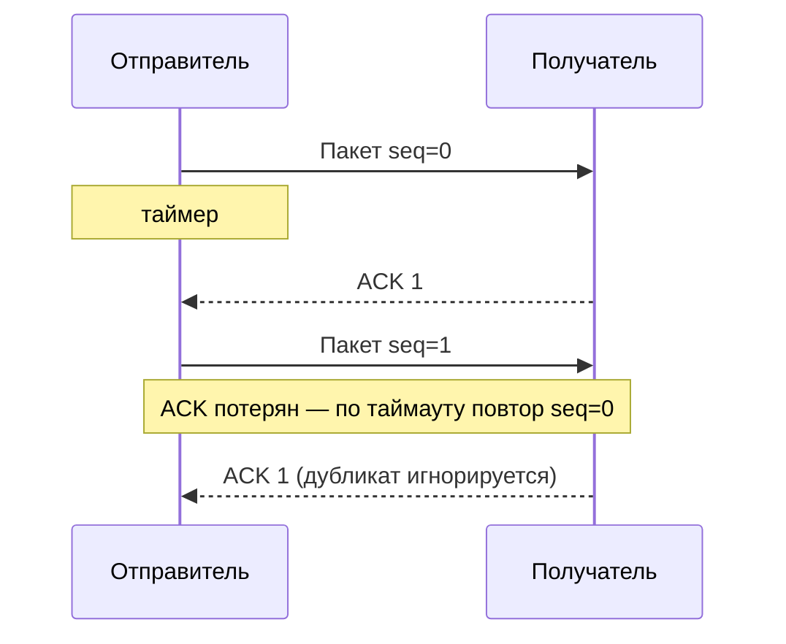

# Надёжная доставка — от идеи к TCP

  ДЛЯ НОВИЧКОВ

Разработчику

---

## Задача

**IP** и **Ethernet** доставляют пакеты «как получится»: возможны **потери**, **дубликаты**, **перестановка порядка**. Приложениям (HTTP, файлы, SSH) нужен **упорядоченный поток байтов без дыр**.

Транспортный уровень решает это протоколами вроде **TCP**. Чтобы понять TCP, полезно пройти учебную лестницу **rdt** (*reliable data transfer*) — упрощённые протоколы, где каждый шаг добавляет один механизм.

---

## rdt 1.0 — идеальный канал

Предположение: канал **никогда** не портит и не теряет биты. Отправитель шлёт, получатель читает — достаточно интерфейса «отправить / принять».

В реальном интернете так не бывает → нужны проверки и повторы.

---

## rdt 2.x — ошибки в канале

Добавляют **контрольную сумму** (checksum) в заголовок кадра. Получатель пересчитывает сумму; при несовпадении кадр **отбрасывает** и ждёт повтор.

| Версия | Обратный канал | Поведение при ошибке |
| :--- | :--- | :--- |
| **rdt 2.0** | Отдельные ACK / NAK | «Принял» / «Повтори» |
| **rdt 2.1** | То же + номера пакетов (0/1) | Дубликаты отбрасывают по номеру |
| **rdt 2.2** | Только ACK с номером ожидаемого пакета | NAK заменён на «ACK последнего верного» |

Идея **скользящего окна из одного бита** (alternating bit) живёт в TCP как нумерация байтов, только масштаб больше.

---

## rdt 3.0 — потери и таймаут

Кадр или ACK могут **пропасть**. Отправитель запускает **таймер**; по истечении — **повторная передача** того же пакета. Получатель по номеру отличает дубликат от нового.

Таймаут + ACK — ядро надёжности **TCP** (оценка RTT — в [TCP — соединение, окно и перегрузка](./421.md#rtt-i-taymaut)).

---

## Go-Back-N (GBN)

Когда задержка велика, ждать ACK на каждый пакет медленно. **Конвейеризация** — в полёте несколько пакетов сразу.

**Go-Back-N:** окно из N пакетов; при потере одного получатель **отбрасывает всё «вперёд»**, отправитель **откатывается** и шлёт заново с потерянного. Просто реализовать, но неэффективно на каналах с высокой задержкой.

---

## Selective Repeat (SR)

**Selective Repeat:** получатель **буферизует** пришедшие вне порядка сегменты и ACK-ит каждый по отдельности. Отправитель **повторяет только потерянные**, а не всё окно.

TCP ближе к SR, чем к GBN: подтверждения с номером байта, выборочные повторы при тройных дублирующих ACK (fast retransmit в реализациях Reno).

---

## Мост к TCP

| Учебный элемент | В TCP |
| :--- | :--- |
| Номер пакета 0/1 | **Sequence number** байтов в потоке |
| ACK | **Acknowledgment number** |
| Таймаут | RTO, повтор сегмента |
| Окно N | **Окно приёма** + **cwnd** (перегрузка) |
| GBN / SR | Выборочные повторы, буфер приёмника |

Практика соединения, slow start и BDP — [TCP — соединение, окно и перегрузка](./421.md). Сравнение с **UDP** без надёжности — [Сетевые протоколы, порты и установка соединения](./4.md#tcp-i-udp).

  
Зачем это в энциклопедии

  

  На собеседовании и в RFC часто ссылаются на «надёжную доставку поверх ненадёжного сервиса». Эта статья даёт словарь

  реализацией занимаются стек ОС и ядро — разработчику чаще нужны симптомы в DevTools и Wireshark, а не ручная сборка rdt.
  

