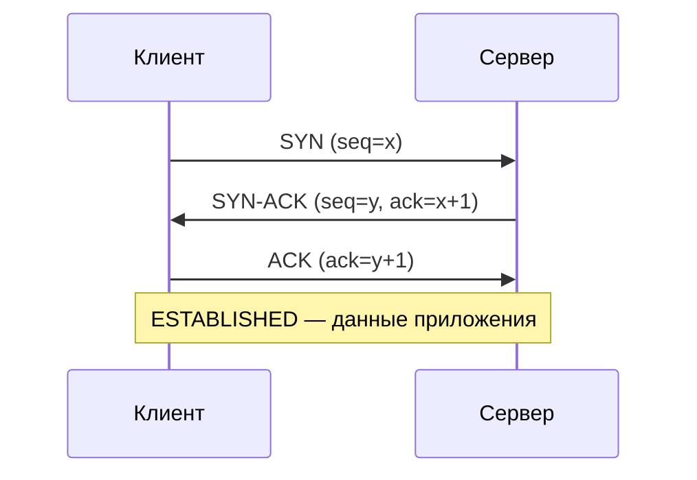

# TCP — соединение, окно и перегрузка

  ОБЯЗАТЕЛЬНО
  ДЛЯ НОВИЧКОВ

Разработчику

---

## Зачем отдельная статья про TCP

В [обзоре протоколов](./4.md#tcp-i-udp) TCP уже сравнивают с UDP. Здесь — **механизмы**, которые делают HTTP и SSH предсказуемыми: установление соединения, повтор при потерях, согласование скорости с каналом и с соседними потоками. Эти идеи повторяются в QUIC и в разборе «медленного интернета» — [612](./612.md).

---

## Соединение и сокет

TCP даёт приложению **поток байтов** между двумя конечными точками. На транспортном уровне пара **IP-адрес + порт** на каждой стороне называется **сокетом**. Полный идентификатор сессии — четвёрка (клиент IP:порт, сервер IP:порт).

Перед передачей данных стороны проходят **трёхстороннее рукопожатие** (three-way handshake):

| Шаг | Направление | Флаги | Смысл |
| :---: | :--- | :--- | :--- |
| 1 | Клиент → сервер | `SYN` | «Хочу соединение», начальный номер последовательности |
| 2 | Сервер → клиент | `SYN`, `ACK` | «Принял, вот мой номер» |
| 3 | Клиент → сервер | `ACK` | «Подтверждаю, можно слать данные» |

После шага 3 соединение в состоянии **ESTABLISHED**. Закрытие — обмен сегментами с `FIN` и `ACK` (часто четыре пакета). Подробный разбор в контексте HTTPS — [шаг 2 загрузки сайта](./5.md#shag-2-tcp-handshake).

  
Полуоткрытые соединения

  

  Сервер хранит таблицу соединений, ожидающих завершения рукопожатия.

  Массовая атака **SYN-flood** заполняет эту таблицу — см. [загрузку сайта](/encyclopedia/2-system-network/2-03-set-i-internet/5#shag-2-tcp-handshake) и [DDoS](/encyclopedia/2-system-network/2-08-osnovy-informatsionnoy-bezopasnosti/117).
  

---

## Сегмент TCP и номера последовательности

Данные приложения режутся на **сегменты**. В заголовке TCP важны:

- **Порты** источника и назначения (мультиплексирование процессов на одном IP);
- **Номер последовательности** — позиция первого байта сегмента в потоке;
- **Номер подтверждения (ACK)** — следующий ожидаемый байт от другой стороны;
- **Флаги** `SYN`, `ACK`, `FIN`, `RST`, `PSH`;
- **Размер окна приёма** — сколько байт получатель готов принять без подтверждения.

Каждый принятый сегмент обычно подтверждается ACK. При потере сегмента отправитель по таймауту или дублирующему ACK **пересылает** данные.

---

## RTT и таймаут

**RTT** (Round-Trip Time) — время туда-обратно до узла, который отвечает. TCP оценивает RTT по подтверждениям и выставляет **таймаут повторной передачи** чуть больше среднего RTT (сглаживание колебаний).

Длинный RTT (спутник, другой континент) увеличивает время до первого байта ответа и замедляет рост скорости при **slow start**. Поэтому для интерактивных сервисов важна география — [CDN](./212.md).

---

## Управление потоком (flow control)

Получатель объявляет **окно приёма** (receive window): «столько байт могу буферизовать сейчас». Отправитель не засылает больше, чем разрешено. Это защищает медленный клиент от переполнения памяти быстрым сервером.

Окно приёма — про **конечный хост**. Оно не говорит маршрутизатору в середине пути, что магистраль перегружена.

---

## Управление перегрузкой (congestion control)

**Перегрузка** — когда суммарный входящий трафик на узле или линии превышает скорость исходящего канала. Растут очереди, задержка и **потери** — см. [формулу задержки](./1.md#formula-zaderzhki).

TCP каждый отправитель ведёт **окно перегрузки** (congestion window, cwnd) — лимит данных «в полёте» без подтверждения. Алгоритм меняет cwnd, чтобы:

- быстро найти доступную полосу на новом соединении;
- отступить при признаках перегрузки (потеря, явное уведомление).

Типичная схема (TCP Reno и близкие реализации в Linux/Windows):

| Фаза | Поведение cwnd |
| :--- | :--- |
| **Slow start** | После установления соединения cwnd мал; при каждом успешном RTT cwnd **удваивается**, пока не дойдёт до порога или пока не появятся потери |
| **Предотвращение перегрузки** | Рост линейный (примерно +1 MSS на RTT) |
| **При потере** | cwnd резко уменьшают (multiplicative decrease), затем снова осторожный рост |

Именно slow start объясняет, почему **короткая загрузка** множества мелких файлов на странице не выходит на полный тариф 100 Мбит/с, а **долгая** закачка — выходит через десятки секунд — разбор в [612](./612.md).

**BDP** (bandwidth-delay product) — произведение пропускной способности на RTT: сколько байт должно «лежать в проводе», чтобы канал был заполнен. Если cwnd меньше BDP, линия недогружена.

  
TCP поверх TCP

  

  VPN в режиме TCP-туннеля поверх TCP в интернете даёт два независимых регулятора перегрузки — при потерях скорость падает сильнее.

  Предпочтительнее UDP-туннели (WireGuard, QUIC) — [VPN](/encyclopedia/2-system-network/2-03-set-i-internet/613).
  

---

## Мультиплексирование на одном IP

На одном хосте десятки вкладок браузера — это **разные порты** и отдельные TCP-соединения с одним и тем же IP сервера (часто 443). ОС по паре портов направляет сегменты нужному сокету процесса. Обзор портов — [618](./618.md#18-osnovnyh-portov).

HTTP/2 мультиплексирует **запросы** в одном TCP-соединении; HTTP/3 переносит потоки в **QUIC** поверх UDP — [дополнительные технологии](./8.md).

---

## Связь с практикой

| Симптом | Возможная причина на уровне TCP |
| :--- | :--- |
| Сайт долго «думает» до первого байта | Высокий RTT, очередь DNS, медленное рукопожатие + TLS |
| Скорость скачивания растёт по секундам | Slow start, ограничение cwnd |
| Скорость падает вечером | Потери и перегрузка у провайдера, уменьшение cwnd |
| Всё обрывается | `RST`, таймаут, фаервол режет соединение |

Диагностика: вкладка «Сеть» в DevTools, `curl -w time_connect`, `ss -ti` на Linux, захват в Wireshark — [615](./615.md).

---

## Дальше по курсу

- От идеи «надёжного канала» к TCP — [Надёжная доставка — от идеи к TCP](./42.md).
- UDP и QUIC — [4](./4.md#tcp-i-udp).
- Угрозы и шифрование поверх TCP — [HTTPS и TLS](/encyclopedia/2-system-network/2-04-kak-rabotayut-sayty-i-veb-sayty/128).
