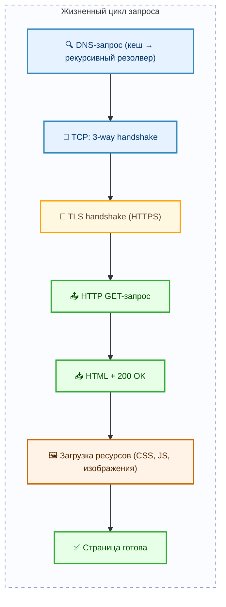

# Что происходит при загрузке сайта

<div class="article-tags">
  <span class="tag tag-required">ОБЯЗАТЕЛЬНО</span>
  <span class="tag tag-beginner">ДЛЯ НОВИЧКОВ</span>
</div>

<span class="complexity-badge">Всем</span>

---

## Что происходит при загрузке сайта?

Когда вы печатаете в адресной строке `https://google.com` и нажимаете Enter, кажется, что сайт "появляется мгновенно". На самом деле за эти доли секунды происходит десятки, а иногда и сотни отдельных действий — между вашим устройством, маршрутизаторами, серверами провайдеров, дата-центрами и самим сайтом.

Это строго организованная последовательность шагов, каждый из которых опирается на стандарты, разработанные десятилетиями: DNS, TCP/IP, TLS, HTTP, HTML. Даже если вы не собираетесь становиться сетевым инженером, понимание базового цикла загрузки сайта даёт важные преимущества:

- вы начинаете различать, где может возникнуть задержка (почему сайт "тормозит"),  
- вы понимаете, почему одни страницы грузятся быстро, а другие — нет,  
- вы замечаете, когда что-то идёт не так: например, если вместо сайта появляется ошибка 404 или 502,  
- вы увереннее работаете с инструментами разработчика, в том числе при тестировании, отладке или автоматизации.

Эта статья покажет, что происходит "под капотом" браузера, шаг за шагом — от первого символа в адресной строке до появления готовой страницы на экране.


---

### Схема загрузки сайта




Эта схема — упрощённый, но технически точный взгляд на путь одного запроса. В реальности браузер часто параллельно отправляет несколько запросов (например, к CDN для изображений, к API для данных, к аналитическим сервисам), но базовый цикл остаётся неизменным.

---

## Алгоритм загрузки сайта

### Кратко

1. Клиент вводит https://google.com → браузер проверяет кеш DNS (чтобы найти IP-адрес сайта);
2. Устанавливается TCP-соединение (тройное рукопожатие);
3. Происходит рукопожатие защищённого соединения (HTTPS);
4. Браузер отправляет HTTP-запрос с методом GET;
5. Сервер отвечает HTML-страницей и статусом 200 OK;
6. Браузер получает HTML, обрабатывает (парсит) страницу, видит ссылки на стили, скрипты и изображения – и для каждого требуемого элемента делает дополнительный HTTP-запрос;
7. Сайт загружается полностью только после получения всех ресурсов.

---

### Шаг 1. Адресная строка → имя хоста → IP-адрес  

Вы набираете `https://google.com`. Браузер разбирает это на компоненты:  
- протокол — `https`,  
- домен — `google.com`,  
- путь — `/` (по умолчанию).

Чтобы отправить данные, нужно знать **IP-адрес** сервера. Для этого браузер обращается к **DNS** (Domain Name System) — глобальной распределённой базе имён. Запрос идёт по цепочке:
1. Сначала проверяется **локальный кеш** ОС и браузера (если вы недавно заходили на этот сайт — IP уже известен);
2. Если кеш пуст — запрос уходит к **рекурсивному DNS-резолверу** (обычно это сервер вашего провайдера или публичный сервис, например `8.8.8.8`);
3. Резолвер сам проходит цепочку: от корневых серверов (`.`) → к серверам домена верхнего уровня (`.com`) → к авторитативным серверам `google.com` → получает IP.

Этот этап может занять от 1 мс (при попадании в кеш) до нескольких сотен миллисекунд.

> 📌 *Связь с другими статьями*: Подробнее о работе DNS и сетевых протоколах — в **2.03. Сеть и интернет**.

---

### Шаг 2. Установка соединения — TCP three-way handshake  

Когда IP-адрес известен, браузер пытается открыть **соединение по протоколу TCP** с портом 443 (стандартный порт для HTTPS). Для этого используется трёхэтапное "рукопожатие":
1. Клиент → сервер: `SYN` ("хочу начать диалог"),  
2. Сервер → клиент: `SYN-ACK` ("готов, давай"),  
3. Клиент → сервер: `ACK` ("отлично, начинаем").

Только после этого соединение считается установленным и надёжным. TCP гарантирует, что пакеты придут в правильном порядке и без потерь.

---

### Шаг 3. Защита соединения — TLS handshake (HTTPS)  

Если сайт использует `https://`, перед передачей данных проходит **рукопожатие TLS**. Цель — договориться о шифровании, проверить подлинность сервера и обменяться ключами.

Упрощённо:
- сервер присылает свой **SSL-сертификат**, подписанный доверенным центром сертификации (например, Let’s Encrypt);
- браузер проверяет, что сертификат валиден, не просрочен и относится именно к `google.com`;
- стороны договариваются об алгоритмах шифрования (например, AES-256-GCM);
- генерируется **сессионный ключ**, которым будут шифроваться все последующие данные.

Если сертификат недействителен — браузер покажет предупреждение. Это защита от подмены сайта (например, фишинга).

> 📌 *Связь с другими статьями*: Подробнее о шифровании и защите трафика — в **2.08. Основы информационной безопасности** и **7.07. Информационная безопасность**.

---

### Шаг 4. Отправка HTTP-запроса  

Соединение установлено и защищено. Браузер формирует **HTTP-запрос** — текстовое сообщение в строго определённом формате. Например:

```
GET / HTTP/1.1
Host: google.com
User-Agent: Mozilla/5.0 (Windows NT 10.0; Win64; x64)
Accept: text/html,application/xhtml+xml
Accept-Language: ru-RU,ru;q=0.9
Connection: keep-alive
```

Это — заголовки запроса. Тело (`body`) у `GET`-запроса обычно отсутствует (в отличие от `POST`, где могут передаваться формы или JSON).

---

### Шаг 5. Получение ответа — HTML и статус  

Сервер обрабатывает запрос и возвращает **HTTP-ответ**. Пример:

```
HTTP/1.1 200 OK
Content-Type: text/html; charset=UTF-8
Content-Length: 14235
Date: Thu, 26 Dec 2025 10:30:00 GMT
Server: gws

<!DOCTYPE html><html>... (сам HTML)
```

Первая строка содержит **код статуса** — главный индикатор результата. Он говорит, успешно ли завершился запрос, требуется ли перенаправление, или возникла ошибка.

---

### Шаг 6. Парсинг HTML и параллельная загрузка ресурсов  

Браузер получает HTML и начинает его **анализировать по мере поступления** (streaming parsing). Как только встречает тег `<link rel="stylesheet">` или `<script src="...">`, он сразу ставит в очередь загрузку этого ресурса — часто **параллельно** и даже **до завершения основного HTML**.

Это критически влияет на скорость:
- стили (`CSS`) блокируют отрисовку — пока они не загружены, страница остаётся белой (FOUC предотвращается);
- скрипты (`JS`) по умолчанию блокируют парсинг — но можно добавить атрибуты `async` или `defer`, чтобы этого избежать;
- изображения, шрифты, иконки (``, `@font-face`, `<link rel="icon">`) загружаются асинхронно, но тоже влияют на восприятие скорости.

Современные браузеры используют **приоритизацию ресурсов**: критические стили и скрипты получают высший приоритет, аналитика и реклама — низший.

---

## Практика

<div class="callout callout--tip">
  <div class="callout-title">Практическое задание</div>
Выполните нижеследующее задание (повторите действия клиента).
</div>

Попробуйте поэкспериментировать – откройте браузер, откройте консоль разработчика (F12) и нажмите на вкладку Сеть (Сеть) и перейдите на google.com. Вы увидите следующее:


Мы видим целую кучу HTTP-запросов для каждого контента, видим статус, тип, инициатора, размер, и время. Именно так и происходит загрузка сайта. Пользуясь случаем, вы можете пройтись по прочим вкладкам консоли разработчика – там будет отображаться почти всё, что происходит "под капотом".

---

### Примеры кодов HTTP

Коды статуса HTTP — это стандартные сигналы, которые сервер использует, чтобы сообщить клиенту: "всё в порядке", "попробуйте другой адрес", "вы не авторизованы" или "у нас авария". Они сгруппированы по сотням:

| Группа | Пример | Смысл |
| :--- | :--- | :--- |
| 1xx | 100 Continue | Информационные, процесс продолжается |
| 2xx | 200 OK | Успех |
| 3xx | 301 Moved Permanently | Перенаправление |
| 4xx | 404 Not Found, 403 Forbidden | Ошибка на стороне клиента (неверный URL, нет прав) |
| 5xx | 500 Internal Server Error, 502 Bad Gateway | Ошибка на стороне сервера или прокси |

Подробные коды — в [справочнике HTTP](./611.md) и на [MDN](https://developer.mozilla.org/ru/docs/Web/HTTP/Status).

---
