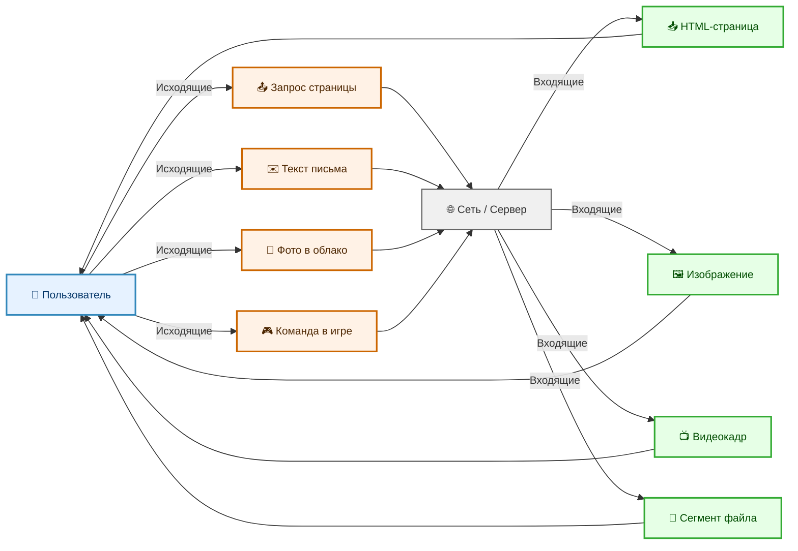
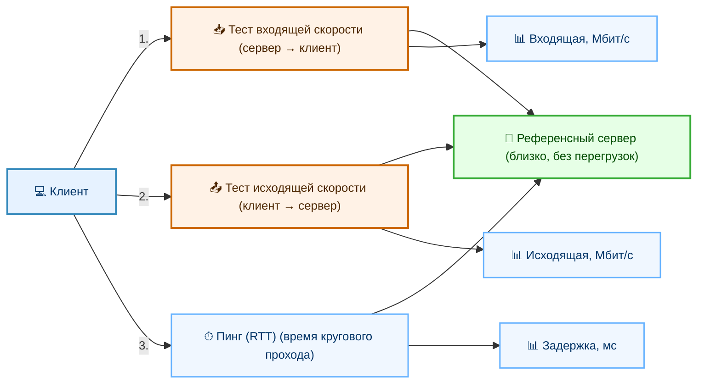
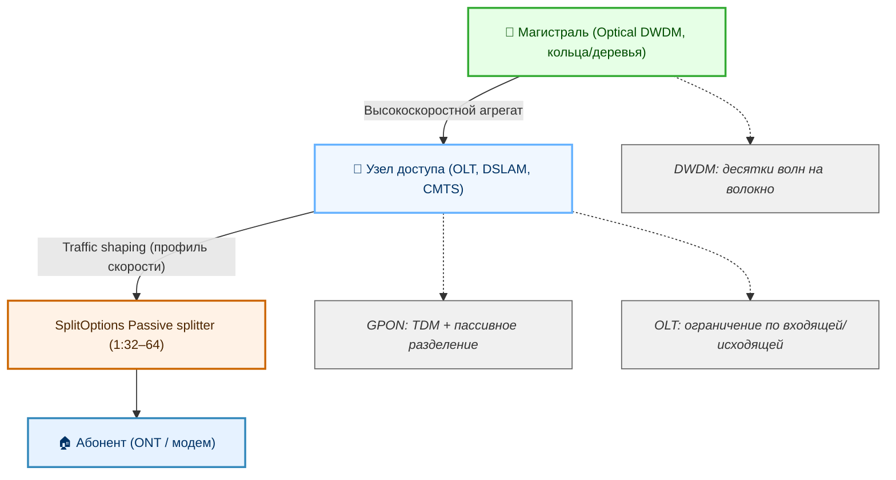
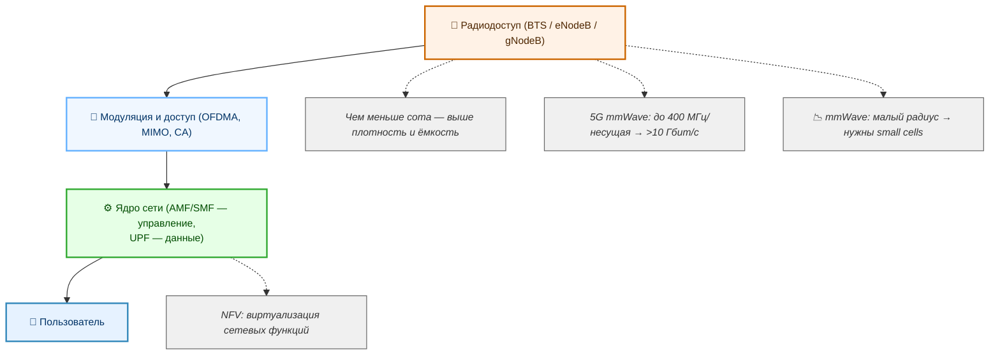
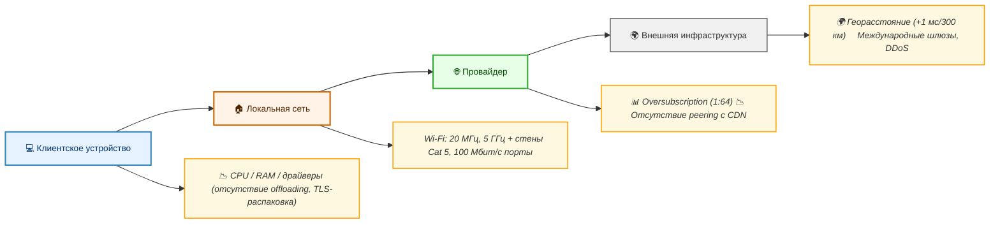

# Измерение и оптимизация скорости интернета

  ОБЯЗАТЕЛЬНО
  ДЛЯ НОВИЧКОВ

Всем

## Скорость интернета

**Скорость интернета** — количественная характеристика, отражающая объём данных, который может быть передан по каналу связи за единицу времени. Она определяет, как быстро пользователь получает информацию из сети и как оперативно отправляет собственные данные в удалённые системы. Для повседневного использования это проявляется в скорости открытия веб-страниц, загрузки файлов, загрузки видеопотоков и отправки сообщений. Однако за этим простым описанием стоит многоуровневая инфраструктурная и техническая система, в которой участвуют физические линии связи, сетевые протоколы, маршрутизаторы, серверы и программное обеспечение на стороне клиента и поставщика услуг.

Скорость интернета — зависит от множества факторов: от состояния линии связи до загруженности сервера, к которому обращается пользователь. При этом измерение скорости всегда происходит в конкретный момент времени, при конкретных условиях — и результат будет меняться, если хотя бы один параметр изменится. Поэтому корректнее говорить не о «скорости», а о *потенциальной пропускной способности канала*, а также о *фактической скорости передачи данных* как о наблюдаемой величине в условиях реального сетевого взаимодействия.

### Пропускная способность

**Пропускная способность** — максимальный объём информации, который может быть передан по каналу связи за единицу времени при отсутствии помех, задержек и перегрузок. Это теоретический предел, определяемый физическими свойствами среды передачи: материалом и длиной кабеля, частотой радиосигнала, уровнем шума, архитектурой оборудования. Например, медный витой кабель категории Cat 6 может обеспечивать пропускную способность до одного гигабита в секунду на расстоянии до 55 метров, тогда как одномодовое оптоволокно способно передавать десятки терабит в секунду на расстояния в сотни километров.

Провайдеры указывают именно пропускную способность в тарифных планах: «до 500 Мбит/с», «до 1 Гбит/с». Уточнение *«до»* означает, что это граничное значение, достижимое при идеальных условиях в локальном сегменте сети — от абонентского оборудования до точки агрегации провайдера. За пределами этой точки начинают действовать ограничения внешних сетей, транзитных провайдеров, международных шлюзов, и пользователь уже не может рассчитывать на гарантированное сохранение заявленной величины.

Пропускная способность измеряется в битах в секунду — от килобитов до гигабитов. Обычно используется десятичное представление (1 Мбит = 1 000 000 бит), хотя в некоторых программных интерфейсах может применяться двоичное (1 Мибит = 1 048 576 бит), что приводит к незначительным расхождениям при сопоставлении показателей.

### Входящее и исходящее соединение

Передача данных в сетях TCP/IP происходит в обоих направлениях, но асимметрично. 

**Входящее соединение** — это поток данных, поступающий к пользователю из сети: текст веб-страницы, изображение, видеокадр, сегмент скачиваемого файла. 

**Исходящее соединение** — поток данных, отправляемый пользователем в сеть: запрос на загрузку страницы, текст письма, фотография, загружаемая в облачное хранилище, команда в игровом клиенте.

В большинстве потребительских тарифов пропускная способность входящего канала значительно выше, чем у исходящего. Это решение основано на анализе типичных сценариев поведения пользователей — преобладает потребление контента над его генерацией. Например, тариф «500 Мбит/с» обычно предполагает 500 Мбит/с входящей пропускной способности и 50–100 Мбит/с — исходящей. Для задач, связанных с видеоконференциями, стримингом, размещением серверов или использованием peer-to-peer-технологий, важна именно исходящая пропускная способность. При её дефиците наблюдаются артефакты изображения, рассинхронизация аудио, длительные задержки при синхронизации файлов.

Стоит отметить, что даже при загрузке файла с удалённого сервера требуется исходящий трафик — для передачи управляющих сигналов (подтверждений получения пакетов, запросов на повторную передачу утерянных фрагментов). Полное отсутствие исходящей пропускной способности делает любое сетевое взаимодействие невозможным.

---

### Как измеряется скорость интернета

**Измерение скорости интернета** — процедура, при которой клиентская программа обменивается данными с сервером, находящимся в заранее известном и контролируемом окружении, и фиксирует объём переданной информации за фиксированный интервал времени.

Для получения корректного результата используется специализированный сервер близкого географического расположения, подключённый к высокоскоростной магистрали и не испытывающий перегрузок в момент теста. Такой сервер называется *тестовым* или *референсным*. Клиентская программа последовательно инициирует передачу данных в обоих направлениях: сначала — от сервера к клиенту (измеряется входящая пропускная способность), затем — от клиента к серверу (измеряется исходящая пропускная способность). В некоторых тестах дополнительно измеряется *пинг* — время, необходимое для прохождения небольшого служебного пакета от клиента до сервера и обратно. Пинг даёт представление о задержке канала, но не влияет напрямую на пропускную способность.

Наиболее распространённые инструменты — веб-сервисы вроде Speedtest от Ookla, Fast.com от Netflix, либо сервис Яндекс.Интернетометр. Они не требуют установки дополнительного программного обеспечения и работают в браузере, используя технологию WebRTC или JavaScript-реализацию сетевых операций. Мобильные приложения и десктопные утилиты обеспечивают более детализированный контроль: возможность выбора конкретного тестового сервера, многократное повторение замеров с усреднением, регистрация временных графиков.

Важно проводить измерения при минимальной фоновой активности: не должно быть загрузок, видеотрансляций, облачных синхронизаций, обновлений операционной системы. Лучше отключить все устройства от роутера, кроме того, на котором выполняется тест. При проводном подключении результат будет ближе к реальной пропускной способности, предоставленной провайдером; при беспроводном — дополнительно учитывается влияние Wi-Fi-среды.

Результат измерения — фактическая скорость передачи полезных данных. Она ниже пропускной способности канала из-за служебных заголовков протоколов (IP, TCP, Ethernet), потерь пакетов, повторных передач и алгоритмов управления перегрузкой.

---

### Как провайдер обеспечивает скорость

**Провайдер** обеспечивает скорость за счёт физической и логической организации своей сети — от магистральных каналов до оконечного оборудования у абонента.

На магистральном уровне используется оптическое волокно, объединённое в кольцевые или древовидные топологии с резервированием. Пропускная способность каждого сегмента определяется оборудованием: оптическими трансиверами, мультиплексорами, маршрутизаторами. Современные технологии мультиплексирования позволяют одновременно передавать десятки и сотни длин волн по одному волокну — это увеличивает суммарную пропускную способность без прокладки новых трасс.

К абонентам доступ предоставляется через распределительные узлы: оптические узлы (в случае GPON), узлы кабельной сети (DOCSIS), или медные DSLAM (в случае xDSL). В технологии GPON (Gigabit Passive Optical Сеть) один оптоволоконный канал разделяется пассивными разветвителями между 32–64 абонентами. Разделение происходит на уровне временных слотов — каждый пользователь получает фиксированную долю времени передачи в нисходящем и восходящем направлениях. Провайдер назначает *профиль скорости*: максимальную входящую и исходящую пропускную способность для каждого порта ONT (оптического сетевого терминала) в доме клиента. Это достигается с помощью механизма *traffic shaping* на OLT (оптической линейной терминации) — специального оборудования в узле доступа.

На уровне договора с абонентом провайдер гарантирует *минимальную* и *максимальную* пропускную способность. Максимальная — это заявленный тарифный параметр (например, 500 Мбит/с). Минимальная — значение, ниже которого скорость не опускается даже при пиковой загрузке сегмента. Такой подход обеспечивает предсказуемость сервиса.

Контроль за соблюдением параметров осуществляется на нескольких уровнях: на стороне OLT, на маршрутизаторе агрегации, на пограничных шлюзах. При превышении абонентом лимита трафик не отбрасывается, а *формируется* — пакеты помещаются в очереди с приоритетом и отправляются в следующем доступном временном интервале.

---

### Как мобильный интернет обеспечивает скорость

Мобильный интернет обеспечивает скорость за счёт радиочастотного спектра, архитектуры сотовой сети и протоколов радиодоступа.

В основе лежит сотовая структура: территория покрывается сотами — зонами действия базовых станций. Каждая базовая станция управляет несколькими секторами, направляя антенные диаграммы в разные стороны. Чем меньше радиус соты, тем выше плотность базовых станций — и тем больше суммарная пропускная способность на квадратный километр.

Скорость определяется используемым стандартом поколения: 3G (HSPA+), 4G (LTE), 5G (NR). Переход к новому поколению включает расширение полосы частот, применение более эффективных методов модуляции (например, 256-QAM вместо QPSK), использование нескольких антенн (MIMO — Multiple Input Multiple Output), агрегацию несущих (Carrier Aggregation) и уменьшение длительности временных интервалов передачи (TTI — Transmission Time Interval).

В LTE и 5G NR применяется OFDMA (Orthogonal Frequency Division Multiple Access) — ортогональное частотное разделение каналов. Это позволяет распределять поднесущие частоты между пользователями динамически, в зависимости от текущей загрузки и качества сигнала. Пользователь с хорошим уровнем сигнала получает больше поднесущих и более высокие порядки модуляции — соответственно, выше скорость.

5G дополнительно использует миллиметровый диапазон (24–100 ГГц), где доступны очень широкие полосы — до 400 МГц на несущую. Это даёт теоретическую пропускную способность свыше 10 Гбит/с. Однако такие частоты обладают низкой проникающей способностью и требуют установки малых базовых станций (small cells) через каждые 100–200 метров в городских условиях.

Мобильные сети строятся по принципу разделения функций: радиодоступ (gNodeB или eNodeB), плоскость управления (AMF, SMF) и плоскость пользовательских данных (UPF). Такая архитектура позволяет масштабировать отдельные компоненты независимо и внедрять виртуализацию сетевых функций (NFV).

Для поддержания скорости при перемещении применяется *хэндовер* — процедура передачи сессии от одной соты к другой без разрыва соединения. Современные реализации позволяют выполнять хэндовер за десятки миллисекунд, что критично для приложений реального времени.

Мобильный интернет чувствителен к внешним условиям: плотности застройки, погоде (в миллиметровом диапазоне), количеству активных пользователей в соте, уровню помех от других радиоустройств. Поэтому фактическая скорость у одного и того же абонента может варьироваться в пределах от нескольких мегабит до гигабита в секунду — в зависимости от текущей радиообстановки.

---

### Почему проводной интернет быстрее

Проводной интернет быстрее благодаря стабильности физической среды передачи и отсутствию конкуренции за общий радиоресурс.

Медные и оптические кабели обеспечивают высокую помехоустойчивость. Сигнал в витой паре защищён от внешних электромагнитных наводок скручиванием проводников и экранированием. В оптоволокне передача осуществляется световыми импульсами, полностью изолированными от электромагнитных помех. Потери сигнала в таких средах предсказуемы и корректируются с помощью активного оборудования (усилителей, ретрансляторов) и кодов коррекции ошибок.

В беспроводных сетях используется общий эфир — ограниченный радиочастотный ресурс, делящийся между всеми устройствами в зоне действия одной базовой станции или точки доступа. Даже при наличии нескольких антенн и пространственного мультиплексирования (MU-MIMO), одновременная передача ограничена количеством независимых потоков, уровнем интерференции и динамикой сигнала. Отражения, поглощение материалами зданий, движение людей и объектов вызывают замирания сигнала (fading), что требует повторной передачи пакетов и снижает эффективную пропускную способность.

Кроме того, проводные интерфейсы (Ethernet, GPON) работают в full-duplex-режиме: передача и приём происходят одновременно по разным парам проводников или разным длинам волн. Wi-Fi и сотовые технологии — в основном half-duplex: устройство либо передаёт, либо принимает, не одновременно. Это удваивает временную стоимость обмена данными.

Стандарты проводных сетей имеют более высокие технические потолки: 10 Гбит/с — обычная скорость для современного оптического абонентского подключения, 25, 40, 100 Гбит/с — для backbone-линков. В мобильных сетях 5G NR теоретически поддерживает 10 Гбит/с, но на практике пользователь редко получает более 1–2 Гбит/с, и только в условиях идеального сигнала и малой загрузки соты.

Наконец, задержки в проводных сетях ниже. Типичный пинг до шлюза провайдера по оптике — 0.5–2 мс, по Wi-Fi — 2–10 мс, по 5G — 5–20 мс (в режиме standalone — ниже, но требует новой инфраструктуры).

---

### Почему скорость падает

Скорость падает при отклонении от идеальных условий передачи данных. Основные причины — физические ограничения среды, конкуренция за ресурсы, программные или аппаратные узкие места, внешние помехи.

Физические ограничения проявляются в затухании сигнала: чем длиннее кабель или чем дальше от базовой станции, тем слабее сигнал, тем ниже допустимый порядок модуляции, тем больше вероятность потерь пакетов. В медных линиях (xDSL) скорость экспоненциально снижается с ростом расстояния от узла DSLAM — на 3 км длина линии может уменьшить максимальную скорость с 100 Мбит/с до 10–15 Мбит/с.

Конкуренция за ресурсы возникает при одновременном использовании канала несколькими устройствами или при перегрузке сегмента сети провайдера. В GPON-сетях пропускная способность нисходящего канала (2.5 Гбит/с) делится между 32–64 абонентами. Если часть из них одновременно запускает видеопотоки в 4K, остальные получат меньшую долю времени передачи.

Программные узкие места включают некорректные настройки TCP-стека (размер окна, алгоритм управления перегрузкой), блокировку трафика антивирусом или брандмауэром, фоновые процессы (обновления, облачные синхронизации, торрент-клиенты), использование устаревших протоколов (HTTP/1.1 вместо HTTP/3).

Аппаратные узкие места — медленный интерфейс сетевой карты (100 Мбит/с вместо 1 Гбит/с), устаревший Wi-Fi-адаптер (802.11n вместо 802.11ax), слабый процессор роутера, не справляющийся с шифрованием трафика (IPsec, WPA3) или NAT при высоких скоростях.

Внешние помехи — соседние Wi-Fi-сети на том же канале, Bluetooth-устройства, микроволновые печи, радиотелефоны, системы сигнализации. В сотовых сетях — плотная застройка, дождь (в миллиметровом диапазоне), солнечная активность (на высоких частотах).

Задержки от сервера и межсетевых узлов также проявляются как снижение скорости: если сервер отвечает медленно или не масштабирует соединения, клиент ждёт подтверждения перед отправкой следующих данных — TCP «замирает» до получения ACK.

---

### Если провайдер даёт 500 Мбит/с — делится ли она между устройствами?

Да — если устройства подключены к одному маршрутизатору (роутеру), и маршрутизатор работает в режиме шлюза, то пропускная способность от провайдера распределяется динамически между всеми активными сессиями передачи данных.

Провайдер выделяет 500 Мбит/с на физический порт ONT или DSL-модема. Этот порт соединён с WAN-интерфейсом роутера. Роутер, в свою очередь, распределяет получаемый трафик между LAN-портами и Wi-Fi-радиомодулями с помощью внутреннего коммутатора и NAT-движка.

Если одно устройство загружает файл с сервера на скорости 480 Мбит/с, остальным остаётся не более 20 Мбит/с. Если одновременно пять устройств запрашивают данные, каждое может получить около 100 Мбит/с — но только при условии, что суммарный запрос не превышает 500 Мбит/с и нет внутренних узких мест.

Важно: физическое подключение не гарантирует выделенной доли. Даже при отсутствии активности на других устройствах, одно устройство не получит 500 Мбит/с, если его сетевой интерфейс или Wi-Fi-модуль поддерживают меньшую пропускную способность. Например, устройство с Wi-Fi 5 (802.11ac) в двухантенном режиме и ширине канала 80 МГц теоретически достигает 866 Мбит/с — но на практике в условиях помех и half-duplex-режима реальная скорость редко превышает 300–400 Мбит/с.

Разделение происходит не на уровне «по 100 Мбит/с каждому», а динамически: устройство, активно передающее или принимающее данные, получает приоритет в очереди пакетов. Современные роутеры поддерживают QoS (Quality of Service) — возможность назначать приоритеты потокам: например, видеозвонку — выше, чем фоновой загрузке обновлений.

Таким образом, 500 Мбит/с — это суммарный лимит для всех устройств в локальной сети, подключённых через одно абонентское оконечное оборудование.

---

### Что режет скорость

Скорость снижается на каждом этапе пути от сервера до клиента и обратно. Источники ограничений можно разделить на категории: клиентские, локальные, провайдерские, внешние.

**Клиентские ограничения** — характеристики устройства пользователя: процессор, оперативная память, состояние диска (при записи принимаемых данных), драйверы сетевого адаптера, версия операционной системы. Например, слабый CPU не успевает распаковывать TLS-трафик при HTTPS-соединениях на скорости выше 300 Мбит/с на устройстве без аппаратного ускорения шифрования. Устаревший драйвер может не поддерживать offloading-функции (TSO, LRO), что приводит к высокой загрузке CPU и снижению пропускной способности.

**Локальные ограничения** — оборудование домашней сети: кабель (Cat 5 вместо Cat 6), роутер (однодиапазонный Wi-Fi 4, отсутствие гигабитных LAN-портов), настройки Wi-Fi (ширина канала 20 МГц вместо 80/160 МГц, устаревший стандарт шифрования), расстояние и преграды между устройством и точкой доступа. Металлические конструкции, зеркала, аквариумы, бетонные стены сильно ослабляют сигнал 5 ГГц.

**Провайдерские ограничения** — перегрузка агрегационного узла, узкое место на маршруте до транзитного провайдера, отсутствие peering-соглашений с крупными CDN (например, Cloudflare, Google, Akamai), использование shared-медиа (GPON, DOCSIS) с высоким коэффициентом переподписки (oversubscription). Коэффициент 1:64 означает, что на 64 абонента приходится 2.5 Гбит/с — при массовом включении стриминга возможны кратковременные падения скорости.

**Внешние ограничения** — географическое расстояние до сервера (каждые 300 км добавляют ~1 мс задержки в один конец), состояние магистральных линий (ремонтные работы, обрывы), политики транзитных операторов, DDoS-атаки на промежуточные узлы, геополитические ограничения (блокировки, фильтрация на границе сетей). Серверы, находящиеся за пределами страны, могут обслуживаться через международные шлюзы с ограниченной пропускной способностью.

Также скорость снижается при использовании промежуточных сервисов: VPN, прокси, корпоративные DPI-системы, родительский контроль. Каждый такой элемент добавляет задержку, требует шифрования/расшифровки, может применять свои политики ограничения.

---

### Как заботиться о скорости

Забота о скорости — это системный подход к поддержанию стабильной и предсказуемой производительности сетевого соединения. Она включает профилактические меры, мониторинг и своевременную коррекцию узких мест.

На уровне абонентского оборудования рекомендуется регулярно обновлять прошивку роутера — производители выпускают обновления, устраняющие уязвимости, улучшающие стабильность Wi-Fi и оптимизирующие работу NAT и QoS-движка. Использование качественных кабелей (минимум Cat 5e, предпочтительно Cat 6 и выше для гигабитных соединений) снижает уровень ошибок и перепосылок пакетов.

Для беспроводных устройств важно выбирать оптимальное расположение точки доступа: в центре обслуживаемой зоны, на высоте, вдали от крупных металлических объектов и источников помех. Смена Wi-Fi-канала вручную на менее загруженный (например, через анализ с помощью утилит вроде Wi-Fi Analyzer) может значительно повысить устойчивость соединения. Использование диапазона 5 ГГц вместо 2.4 ГГц предпочтительно при близком расположении к точке доступа — выше пропускная способность, ниже интерференция, несмотря на меньшую дальность.

На уровне операционной системы следует отключать фоновые приложения, потребляющие сетевые ресурсы без явной необходимости: облачные клиенты в режиме постоянной синхронизации, обновления ПО в рабочее время, торрент-клиенты с включённой раздачей. Антивирусы с функцией сканирования трафика в реальном времени могут добавлять задержки — при работе с большими объёмами данных целесообразно использовать решения с аппаратным ускорением или отключать глубокую проверку для доверенных доменов.

В корпоративных и учебных сетях применяется политика резервирования полосы для критически важных сервисов (видеоконференции, VoIP), исключение низкоприоритетного трафика (P2P, стриминг), сегментация сети (VLAN) для изоляции нагрузки.

Регулярное измерение скорости в одних и тех же условиях (одно устройство, проводное подключение, один и тот же тестовый сервер) позволяет выявить тренды: постепенное снижение может указывать на деградацию кабеля, старение оптического приёмника в ONT или рост загрузки сегмента провайдера. При систематическом отклонении от заявленного тарифа — обращение в техническую поддержку с результатами замеров.

---

### Время загрузки файлов

Время загрузки файла — интервал между инициацией запроса и завершением приёма всех данных. Оно зависит не только от пропускной способности канала, но и от размера файла, протокола передачи, состояния TCP-соединения и поведения сервера.

При идеальных условиях — отсутствии потерь, задержек и конкуренции — время загрузки пропорционально объёму файла и обратно пропорционально средней скорости передачи. Однако на практике влияют дополнительные факторы.

Установка TCP-соединения требует трёхэтапного рукопожатия (SYN → SYN-ACK → ACK), что добавляет задержку, равную как минимум одному времени кругового обхода (RTT). Для HTTPS добавляется этап согласования TLS-сессии (до 2 RTT в TLS 1.2, 1 RTT в TLS 1.3). Только после этого начинается передача полезных данных.

Скорость нарастает постепенно: TCP использует алгоритм *slow start*, увеличивая размер окна перегрузки экспоненциально до тех пор, пока не обнаружит признаки перегрузки (потерю пакетов или увеличение задержки). На коротких соединениях (например, загрузка множества мелких файлов для веб-страницы) соединение может завершиться, так и не достигнув максимальной скорости.

При передаче крупных файлов основное время уходит на фазу *congestion avoidance*, когда скорость стабилизируется. Но при потере пакетов TCP снижает окно вдвое и начинает медленное восстановление — это вызывает провалы скорости, видимые на графиках.

Файловые хранилища и CDN (Content Delivery Networks) применяют оптимизации: сжатие (gzip, Brotli), раздачу через HTTP/2 или HTTP/3 (мультиплексирование потоков, 0-RTT), кэширование на ближайших узлах. Это сокращает не только объём передаваемых данных, но и количество RTT.

---

### Расстояние до сайта

Расстояние до сайта — физическая и логическая протяжённость пути между клиентом и сервером. Оно влияет в первую очередь на задержку (latency), а опосредованно — на пропускную способность.

Задержка состоит из нескольких компонентов:  
— время распространения сигнала (примерно 5 мкс на километр в оптоволокне),  
— время обработки в маршрутизаторах и коммутаторах (обычно 0.1–1 мс на узел),  
— время ожидания в очередях при перегрузке (от десятков микросекунд до сотен миллисекунд).

Чем больше географическое расстояние, тем выше минимально возможная задержка. При расстоянии 10 000 км (Москва–Сан-Франциско) теоретический минимум RTT — около 67 мс (с учётом коэффициента преломления волокна и реальной трассы кабелей). На практике из-за числа промежуточных узлов и маршрутизации RTT часто превышает 120–150 мс.

Высокая задержка снижает эффективность TCP: размер окна перегрузки ограничен произведением пропускной способности на задержку (BDP — Bandwidth-Delay Product). При скорости 500 Мбит/с и RTT 150 мс BDP составляет около 9.4 мегабайт. Если буферы на маршруте меньше этого значения, канал не заполняется полностью — пропускная способность используется неэффективно.

Поэтому крупные сервисы размещают контент в распределённых точках присутствия (PoP — Points of Presence) и используют CDN: пользователь получает данные не с центрального сервера, а с узла, находящегося в той же стране или даже городе. Это сокращает RTT до 5–20 мс и позволяет достичь заявленной скорости даже на дальнем конце тарифного плана.

---

### Время реакции компьютера

Время реакции компьютера — интервал между поступлением сетевого пакета на сетевой интерфейс и его обработкой прикладной программой. Этот параметр редко измеряется напрямую, но оказывает существенное влияние на ощущаемую отзывчивость сервисов.

Пакет проходит несколько этапов: аппаратная буферизация в сетевой карте, прерывание CPU, обработка в сетевом стеке ядра (проверка контрольных сумм, маршрутизация, NAT), передача в пользовательское пространство через сокет, получение приложением.

Если CPU загружен другими задачами, обработка пакета откладывается. При высоких скоростях (> 500 Мбит/с) слабый процессор может не успевать обслуживать прерывания — пакеты теряются в аппаратных буферах до попадания в стек. Включение offloading-функций (TSO, GRO, RSS) снижает нагрузку на CPU за счёт делегирования части операций сетевой карте.

Оперативная память также влияет: при нехватке RAM активируется подкачка на диск — задержки возрастают на порядки. Особенно критично это при одновременной работе нескольких приложений, активно использующих сеть (браузер с десятками вкладок, видеоконференция, облачный клиент).

Драйверы сетевых адаптеров должны быть актуальными — устаревшие версии могут не поддерживать энергоэффективные режимы, вызывать ложные прерывания или работать в polling-режиме вместо interrupt-driven.

На мобильных устройствах важна температура: при перегреве процессор снижает частоту (thermal throttling), что замедляет обработку сетевых пакетов и приводит к временным обрывам соединения.

---

### Сервер, замедляющий скорость

Сервер — конечный узел в цепи доставки данных. Его производительность и конфигурация могут стать определяющим фактором скорости, даже если клиентский канал и магистральные линии обладают избыточной пропускной способностью.

Ограничения на стороне сервера делятся на аппаратные и программные.

Аппаратные: пропускная способность сетевого интерфейса (1 Гбит/с — уже узкое место для массового сервиса), количество ядер CPU (обработка TLS, сжатие, генерация динамического контента), объём оперативной памяти (кеширование, буферизация), скорость дисковой подсистемы (чтение файлов, логирование).

Программные: неоптимальная настройка веб-сервера (малое количество рабочих процессов/потоков, отсутствие keep-alive), устаревшие протоколы (HTTP/1.0 без pipelining), отсутствие кэширования (повторная генерация одинакового контента), синхронные вызовы к базам данных или внешним API.

Сервер может намеренно ограничивать скорость — для защиты от перегрузки (rate limiting), соблюдения fair use policy или при работе с ограниченными ресурсами (бесплатные хостинги, shared-хостинг). Такое ограничение реализуется на уровне веб-сервера (nginx, Apache), CDN или промежуточных прокси.

Также сервер может находиться в перегруженном состоянии из-за DDoS-атаки, всплеска трафика («хабраэффект»), ошибки в коде (утечка памяти, бесконечный цикл). В этом случае время ответа растёт, соединения обрываются, клиенты наблюдают «зависание».

Для диагностики влияния сервера используются инструменты: замеры времени TTFB (Time To First Byte), анализ HTTP-заголовков (Server, X-Powered-By), инструменты вроде `curl -w` или `httpstat`, а также публичные сервисы мониторинга (Pingdom, GTmetrix).

---

### Инструменты измерения: Яндекс.Интернетометр и Speedtest

Для оценки скорости интернета применяются специализированные сервисы. Два наиболее распространённых — **Яндекс.Интернетометр** (https://yandex.ru/internet/) и **Speedtest** (https://speedtest.net, Ookla).

**Яндекс.Интернетометр** — сервис, ориентированный на российских пользователей. Он автоматически выбирает ближайший из серверов Яндекса и измеряет входящую и исходящую пропускную способность, а также пинг и jitter (вариацию задержки). Интерфейс минималистичный, не требует установки, работает в любом современном браузере. Сервис отображает IP-адрес, провайдера, регион и тип подключения (определяется по ASN и данным WHOIS). Важно: данные, отображаемые на странице, предназначены исключительно для личного использования — их не следует передавать третьим лицам, в том числе при обращении в поддержку, без личной инициативы пользователя.

**Speedtest от Ookla** — глобальный стандарт измерения. Имеет более 15 000 серверов по всему миру, поддерживает ручной выбор точки тестирования, предоставляет детализированные графики (скорость во времени, jitter, потеря пакетов), историю замеров и сравнение с другими пользователями в регионе. Доступен как веб-версия, так и мобильные приложения (iOS, Android) с дополнительными функциями: тест на пропускную способность в условиях слабого сигнала, замер скорости в фоновом режиме, экспорт отчётов.

Оба сервиса используют схожую методику: передача больших блоков данных с контролируемым размером, измерение времени, расчёт скорости как отношения объёма к длительности. Однако из-за различий в серверной инфраструктуре, алгоритмах компенсации потерь и обработки TCP результаты могут отличаться на 5–15 %. Для объективной оценки рекомендуется проводить не менее трёх замеров в разное время суток и усреднять значения.

---

