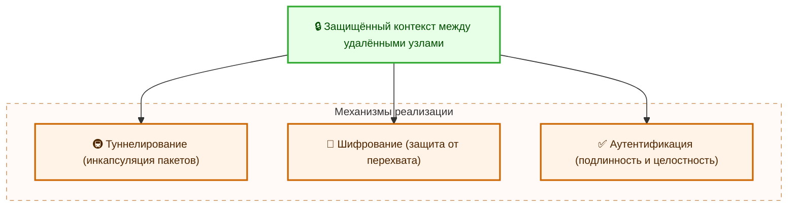
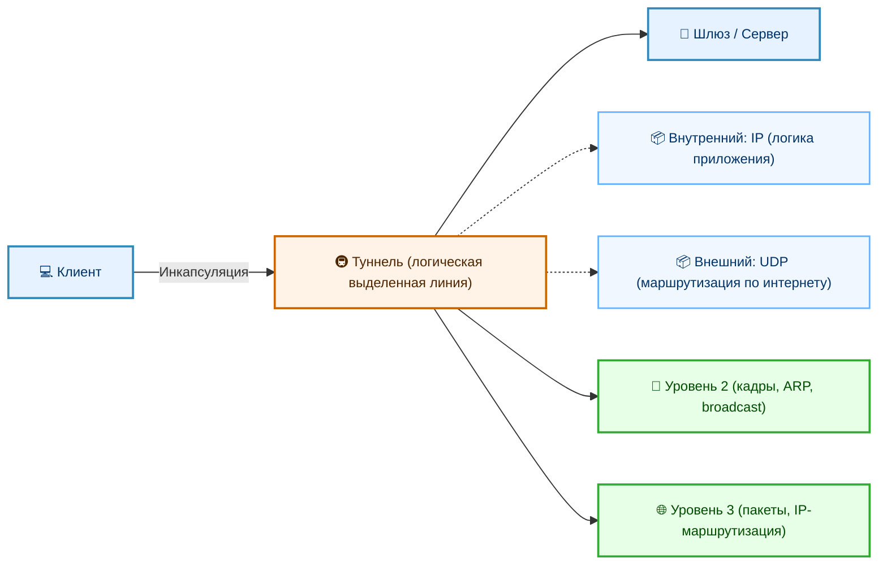
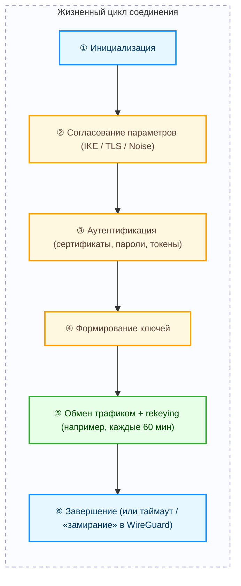

# Виртуальные частные сети (VPN)

  ОБЯЗАТЕЛЬНО
  ДЛЯ НОВИЧКОВ

Всем

## Виртуальная частная сеть

> **Правовая оговорка**  
> В Российской Федерации действует законодательство, ограничивающее использование средств обхода блокировок, включая некоторые реализации технологий виртуальных частных сетей, если такие средства применяются с целью получения доступа к информации, включённой в единый реестр запрещённых сайтов. Данная глава не содержит инструкций, призывов или рекомендаций по обходу технических или правовых ограничений. Изложение носит исключительно образовательный характер и ориентировано на понимание архитектурных, криптографических и сетевых основ технологии виртуальных частных сетей, применяемых в корпоративных, облачных и инфраструктурных средах. Описанные механизмы находят широкое применение в обеспечении конфиденциальности, целостности и контролируемого доступа в рамках законодательно разрешённых сценариев использования.

---

### Определение и суть технологии

**Виртуальная частная сеть (Virtual Private Сеть, VPN)** — это логическая сеть, построенная поверх физической транспортной инфраструктуры, в которой передача данных обеспечивается с помощью инкапсуляции и криптографической защиты. Такая сеть воспроизводяет свойства выделенной физической линии связи, несмотря на то что трафик физически проходит через общедоступные или недоверенные каналы — например, интернет.

Основная цель виртуальной частной сети — создание защищённого коммуникационного контекста между узлами, которые могут находиться в географически удалённых сегментах сети. 

Для этого применяются три ключевых механизма:

- **Туннелирование** — вложение пакетов одного протокола (внутреннего) в заголовки другого протокола (внешнего), что позволяет передавать трафик через промежуточные сети без модификации исходного содержимого;
- **Шифрование** — преобразование данных в криптографически защищённую форму, недоступную для неавторизованного чтения;
- **Аутентификация** — подтверждение подлинности участвующих сторон и целостности передаваемых данных.

Технология VPN изначально разрабатывалась как экономически эффективная альтернатива арендованным выделенным линиям (leased lines), позволяющая использовать общедоступную инфраструктуру без потери уровня безопасности и контроля над передаваемыми данными. Сегодня виртуальные частные сети являются неотъемлемой частью большинства корпоративных, государственных и облачных инфраструктур.

---

### Исторический контекст

Первые концепции виртуальных частных сетей появились в 1990-х годах на фоне массового распространения интернета и роста потребности в удалённом доступе к корпоративным ресурсам. Первоначально задача решалась с помощью протоколов, ориентированных на упрощённую инкапсуляцию без обязательного применения криптографии.

**GRE (Generic Routing Encapsulation)**, стандартизированный в RFC 1701 (1994), стал одной из первых реализаций туннелирования. Он позволял передавать пакеты различных протоколов поверх IP, но не обеспечивал ни шифрования, ни аутентификации — такие туннели требовали дополнительной защиты на других уровнях.

**PPTP (Point-to-Point Tunneling Protocol)**, представленный Microsoft в 1995 году, совместил PPP-соединение с GRE-туннелем и добавил базовую аутентификацию (MS-CHAP). Несмотря на широкое распространение благодаря встроенной поддержке в Windows, протокол имел принципиальные уязвимости в криптографической реализации и устарел к началу 2000-х.

Следующим этапом стал переход к комбинированным решениям, в которых отдельно решались задачи туннелирования и защиты. **L2TP (Layer 2 Tunneling Protocol)**, стандартизированный в RFC 2661 (1999), объединил лучшие черты PPTP и L2F (Cisco), но по-прежнему не включал шифрование. Для обеспечения конфиденциальности к L2TP стали добавлять **IPsec**, формируя гибридный стек L2TP/IPsec.

Параллельно развивалась другая ветвь — протоколы на базе IPsec в чистом виде. Стандарт **IPsec**, описанный в серии RFC (в первую очередь RFC 2401–2406, 1998), задал основы защиты IP-трафика с помощью двух режимов работы (транспортного и туннельного), двух протоколов (ESP и AH) и механизма согласования параметров безопасности (IKE). IPsec стал основой для построения site-to-site решений и до сих пор используется в аппаратных и программных реализациях.

В 2000-х годах появился **OpenVPN** — программное решение с открытым исходным кодом, построенное на библиотеке OpenSSL и использующее TLS для управления сессиями. Его гибкость, поддержка различных транспортов (UDP/TCP), возможность интеграции с PKI и двухфакторной аутентификацией сделали его стандартом для remote-access сценариев. OpenVPN описывается в RFC 7296 (IKEv2) косвенно — как один из реализаций TLS-based VPN.

В 2010-х годах рост требований к производительности, упрощению конфигурации и повышению криптографической стойкости привёл к созданию **WireGuard**, представленного Джейсоном Доненфельдом в 2015 году. WireGuard опирается на современные алгоритмы (Curve25519, ChaCha20, Poly1305), минималистичен (менее 4 000 строк ядра Linux), stateless по своей природе и лишён сложных фаз согласования. Его официальное включение в ядро Linux (начиная с версии 5.6, 2020) подтвердило статус промышленного стандарта следующего поколения.

Эволюция протоколов сопровождалась ростом требований к:
- устойчивости к атакам (в том числе на этапе установки соединения);
- эффективности при работе на мобильных устройствах и в сетях с высокой задержкой;
- простоте развёртывания и аудита.

---

### Основные принципы работы

Работа любой виртуальной частной сети строится вокруг цикла установления, поддержания и завершения защищённого соединения. В этом процессе участвуют три взаимосвязанных компонента: туннелирование, криптографическая защита и управление ключами.

#### Туннелирование

**Туннелирование** — это механизм инкапсуляции сетевого трафика одного протокола внутри пакетов другого протокола. Типичный пример: IP-пакет внутренней сети помещается в тело UDP-датаграммы, которая передаётся через публичный интернет. Внешний протокол (UDP) обеспечивает маршрутизацию по физической инфраструктуре, внутренний протокол (IP) сохраняет логическую целостность сессии конечного приложения.

Туннель имеет две конечные точки — клиент и шлюз (или два шлюза в случае site-to-site). Весь трафик между ними проходит через логический «трубопровод», визуально напоминающий выделенную линию, хотя физически он разделяет транспорт с другими потоками данных.

Инкапсуляция может происходить на разных уровнях модели OSI, что определяет поведение сети внутри туннеля: передача кадров уровня 2 (включая broadcast-трафик, ARP-запросы) или маршрутизация пакетов уровня 3 (на основе IP-адресов).

#### Криптографическая защита

Защита данных в туннеле обеспечивается тремя криптографическими свойствами:

- **Конфиденциальность** — данные преобразуются с использованием симметричных шифров (AES в режимах GCM или CBC, ChaCha20), что делает их недоступными для чтения без знания ключа;
- **Целостность** — применяются алгоритмы проверки подлинности сообщений (HMAC-SHA2, Poly1305), предотвращающие несанкционированную модификацию;
- **Аутентификация** — подтверждение того, что конечная точка туннеля — именно та, за которую она себя выдаёт. Для этого используются цифровые сертификаты (X.509), предварительно распределённые ключи (pre-shared keys), или криптографические подписи на основе эллиптических кривых.

Важно, что шифрование применяется только к полезной нагрузке туннеля (payload), а внешние заголовки (например, UDP/IP) остаются открытыми — это необходимо для маршрутизации пакетов по сети. В результате наблюдатель может видеть факт обмена между двумя хостами, но не может определить содержание передаваемых данных, их источник и назначение внутри туннеля.

#### Управление ключами и жизненный цикл соединения

Установка VPN-соединения проходит несколько этапов:

1. **Инициализация** — клиент отправляет запрос на подключение к серверу.
2. **Согласование параметров** — стороны обмениваются возможностями (алгоритмы шифрования, методы аутентификации, длительность сессии) и выбирают общий профиль безопасности. В IPsec эту роль выполняет IKE (Internet Key Exchange); в OpenVPN — TLS handshake; в WireGuard — обмен открытыми ключами по протоколу Noise.
3. **Аутентификация** — проверка подлинности сторон с применением выбранных методов (сертификаты, пароли, токены).
4. **Формирование ключей сессии** — генерация симметричных ключей на основе общего секрета, полученного в ходе обмена.
5. **Обмен трафиком** — передача инкапсулированных и зашифрованных пакетов. По истечении заданного интервала (например, каждые 60 минут) может происходить **переключение ключей** (rekeying) — генерация новых ключей без разрыва соединения, что ограничивает объём данных, зашифрованных одним ключом.
6. **Завершение** — инициированное одной из сторон или по таймауту неактивности. В WireGuard такие соединения не поддерживают явное завершение — туннель «замирает» при отсутствии трафика и возобновляется автоматически.

Такой цикл обеспечивает устойчивость к компрометации отдельных ключей и соответствует принципам forward secrecy (в случае использования ephemeral ключей в TLS или Curve25519 в WireGuard).

---

### Классификация виртуальных частных сетей

Виртуальные частные сети можно классифицировать по нескольким независимым критериям: по уровню стека протоколов, по топологии взаимодействия узлов и по способу реализации. Каждый критерий отражает определённую проектируемую характеристику — от сетевой логики до операционной гибкости.

#### По уровню модели OSI

Уровень, на котором работает VPN, определяет, какие единицы данных инкапсулируются и как организуется адресация внутри туннеля.

**VPN уровня 2 (канального уровня)** оперируют кадрами — например, Ethernet, PPP или HDLC. Такие туннели передают не только IP-трафик, но и широковещательные и многоадресные кадры, ARP-запросы, фреймы для протоколов обнаружения соседей (например, CDP, LLDP). Это позволяет создавать виртуальные сегменты, полностью имитирующие локальную сеть: клиент получает IP-адрес от DHCP-сервера внутри туннеля, участвует в доменных группах Windows через NetBIOS и т.п. К таким решениям относятся **PPTP** и **L2TP**. Они требуют, чтобы обе стороны поддерживали один и тот же канальный протокол, и не совместимы с маршрутизацией на уровне IP без дополнительной обёртки.

**VPN уровня 3 (сетевого уровня)** инкапсулируют IP-пакеты (или другие сетевые пакеты, например, IPv6 поверх IPv4). Такие туннели работают независимо от физической подложки: Ethernet, Wi-Fi, PPPoE — все они одинаково транспортируют внешний IP-заголовок. Внутри туннеля передаются только маршрутизируемые пакеты; широковещательный трафик не проходит. Это упрощает масштабирование и совместимость с межсетевыми экранами и NAT-устройствами. Примеры — **IPsec в режиме туннеля**, **WireGuard**, **OpenVPN в режиме tun** (в отличие от tap). Такие решения предпочтительны для построения site-to-site соединений и удалённого доступа в крупных инфраструктурах.

Выбор уровня зависит от требований к прозрачности сетевой среды. Если необходимо полное копирование поведения LAN — выбирают L2. Если требуется маршрутизация между подсетями с контролем трафика — выбирают L3.

#### По топологии

Топология определяет, какие сущности участвуют в соединении и как они связаны.

**Site-to-site VPN** соединяет две или более автономных IP-сети. Типичный пример — головной офис и региональный филиал, каждый из которых имеет собственную подсеть (например, 10.1.0.0/24 и 10.2.0.0/24). Туннель устанавливается между маршрутизаторами или межсетевыми экранами на границе сетей. Пользователи внутри каждой локальной сети работают так, будто все ресурсы находятся в одной сети: файловые серверы, контроллеры домена, базы данных доступны по внутренним IP-адресам. Такие соединения обычно работают постоянно, с автоматическим восстановлением после обрыва канала, и интегрируются в системы управления резервированием каналов связи.

**Remote access VPN** обеспечивает подключение отдельного хоста — ноутбука, смартфона, сервера — к закрытой сети. Клиент устанавливает соединение по инициативе пользователя или по расписанию, получает IP-адрес из пула корпоративной подсети и получает доступ к ресурсам, как если бы находился в офисе. Такие туннели динамичны: их количество и длительность зависят от активности пользователей. Для управления подключениями применяются серверы аутентификации (RADIUS, TACACS+), системы учёта сессий, политики условного доступа (например, требование наличия установленного антивируса).

Существуют гибридные топологии — например, hub-and-spoke (звезда), где все филиалы соединяются только с центральным узлом, или full mesh (полнозвёздная сеть), где каждая пара узлов имеет прямой туннель. Выбор зависит от требований к задержке, отказоустойчивости и сложности управления ключами.

#### По способу реализации

Реализация определяет, как именно создаётся и поддерживается туннель — программно или аппаратно.

**Программные VPN** строятся на базе приложений, работающих в пользовательском или ядерном пространстве ОС. К ним относятся **OpenVPN**, **SoftEther**, **strongSwan** (для IPsec), **Tailscale** (на базе WireGuard), **ZeroTier**. Такие решения обладают высокой переносимостью: один и тот же стек работает на Windows, Linux, macOS, Android, iOS. Они допускают глубокую настройку параметров, интеграцию с внешними системами (LDAP, Active Directory, OAuth), и могут развёртываться без специализированного оборудования. Недостаток — зависимость от производительности хоста и потенциальные ограничения в обработке трафика на уровне ядра (особенно при использовании пользовательских реализаций шифрования).

**Аппаратные VPN** реализуются в виде специализированных устройств — межсетевых экранов (Cisco Firepower, Palo Alto Networks), маршрутизаторов (Juniper SRX, MikroTik CCR), или выделенных шлюзов безопасности. Аппаратная реализация обеспечивает высокую пропускную способность (десятки гигабит в секунду), за счёт применения ASIC или FPGA для ускорения криптографических операций. Аппаратные решения интегрированы в системы централизованного управления (например, Cisco FMC, FortiManager), поддерживают отказоустойчивые кластеры, и проходят сертификацию по требованиям регуляторов (ФСТЭК, ФСБ, PCI DSS). Они подходят для критически важных участков инфраструктуры — например, магистральных каналов между ЦОД.

В реальных инфраструктурах часто применяется комбинированный подход: аппаратные шлюзы на границе сети и программные клиенты у пользователей.

---

### Основные протоколы и стандарты

Ниже приведено описание ключевых протоколов, получивших промышленное применение. Каждый из них определяет не только формат пакетов, но и логику взаимодействия, политику управления ключами и условия применения.

#### IPsec (Internet Protocol Безопасность)

IPsec — набор протоколов, стандартизированных IETF в серии RFC (RFC 4301, RFC 4302, RFC 4303, RFC 7296 и др.), предназначенный для защиты IP-трафика на сетевом уровне. Архитектура IPsec строится вокруг понятия **ассоциации безопасности** (Security Association, SA) — однонаправленного контекста, определяющего алгоритмы шифрования, аутентификации, срок действия ключей и другие параметры.

IPsec включает два основных протокола:

- **ESP (Encapsulating Security Payload)** — обеспечивает конфиденциальность, целостность и защиту от повторов. Он инкапсулирует полезную нагрузку пакета и добавляет заголовок и концевик для проверки подлинности.
- **AH (Authentication Header)** — обеспечивает только целостность и аутентификацию, без шифрования. Из-за несовместимости с NAT (изменяет IP-заголовок, на который вычисляется хеш) практически не используется в современных развёртываниях.

IPsec поддерживает два режима работы:

- **Транспортный режим** применяется при защите трафика между двумя хостами. Внешний IP-заголовок остаётся оригинальным, шифруется только тело пакета (TCP/UDP/ICMP). Используется редко — в основном в специализированных системах.
- **Туннельный режим** — стандарт для site-to-site и remote access. Весь исходный IP-пакет (включая заголовок) становится payload нового IP-пакета. Внешний заголовок содержит адреса шлюзов; внутренний — адреса конечных узлов. Это позволяет скрыть топологию внутренней сети и совместимо с NAT.

Согласование параметров SA и генерация ключей выполняется протоколом **IKE (Internet Key Exchange)**. Версия **IKEv1** (RFC 2409) использует двухфазное согласование и поддерживает Main Mode и Aggressive Mode (последний уязвим к offline-атакам). **IKEv2** (RFC 7291) упрощает процедуру до одного обмена (при повторном подключении — до одного пакета), добавляет поддержку MOBIKE (Mobile IP) и устойчивость к смене IP-адреса (например, при переходе с Wi-Fi на мобильную сеть).

IPsec широко интегрирован в ОС (Windows, macOS, iOS, Android) и маршрутизаторы. Однако его конфигурация требует точного совпадения параметров на обеих сторонах, что усложняет развёртывание в гетерогенных средах.

#### OpenVPN

OpenVPN — программное решение с открытым исходным кодом, разработанное Джеймсом Йонаном и впервые выпущенное в 2001 году. Он использует **TLS** (обычно на базе OpenSSL или mbed TLS) для установки защищённого канала управления и передачу данных через UDP или TCP.

Архитектура OpenVPN включает два канала:

- **Контрольный канал** — защищённый TLS-туннель, по которому проходят команды: установка сессии, обмен метаданными, переключение ключей, передача команд управления.
- **Канал данных** — поток инкапсулированных пакетов (L2 или L3), шифруемых симметричными ключами, согласованными через контрольный канал.

OpenVPN поддерживает различные схемы аутентификации:
- пароли и предварительно распределённые ключи (static key);
- сертификаты (PKI на основе X.509 и CA);
- двухфакторную аутентификацию (через RADIUS, Google Authenticator, YubiKey).

Гибкость протокола позволяет настраивать сжатие, фрагментацию, keepalive-проверки, политики маршрутизации, push-команды сервера (например, передача DNS-серверов клиенту). OpenVPN работает через большинство NAT и firewall, особенно в UDP-режиме. Его основное ограничение — зависимость от качества реализации TLS-библиотеки (например, уязвимости Heartbleed в OpenSSL 2014 года затронули и OpenVPN).

#### WireGuard

WireGuard — современный протокол, разработанный с акцентом на простоту, безопасность и производительность. Он использует минималистичный криптографический набор:

- **Curve25519** — для обмена ключами по протоколу Diffie–Hellman;
- **ChaCha20** — симметричный шифр для конфиденциальности;
- **Poly1305** — MAC для проверки целостности и аутентификации;
- **BLAKE2s** — хеш-функция для генерации ключей.

Все операции выполняются в ядре ОС (начиная с Linux 5.6), что обеспечивает минимальные накладные расходы. WireGuard не имеет фаз согласования: соединение инициируется первым пакетом, содержащим зашифрованный заголовок и идентификатор открытого ключа получателя. Если получатель распознаёт ключ, он расшифровывает содержимое и отвечает. В противном случае пакет отбрасывается — механизм stateless.

Конфигурация WireGuard описывается простым текстовым файлом с секциями `[Interface]` и `[Peer]`, где указываются закрытые и открытые ключи, адреса, пределы трафика, keepalive-интервалы. Управление ключами выполняется вручную или через внешние скрипты (например, в Tailscale — автоматически через координационный сервер).

WireGuard не поддерживает встроенную аутентификацию на основе паролей или сертификатов — это выносится в прикладной уровень. Протокол не предусматривает динамического изменения параметров в рамках сессии: для смены ключа требуется перезапуск интерфейса. Эти ограничения — следствие сознательного выбора: уменьшение поверхности атаки за счёт отказа от сложных механизмов.

#### L2TP/IPsec

L2TP/IPsec — комбинированный стек, сочетающий **L2TP** (RFC 2661) для создания канального туннеля и **IPsec** (в транспортном режиме) для его защиты. L2TP сам по себе не обеспечивает шифрование, поэтому IPsec применяется как внешняя обёртка.

Процесс установки соединения включает:
1. Согласование IPsec SA между клиентом и сервером (IKE);
2. Установка L2TP-туннеля поверх защищённого IPsec-канала;
3. Создание L2TP-сессии и передача PPP-кадров.

Такая двухслойная инкапсуляция приводит к увеличению заголовков (IP + ESP + UDP + L2TP + PPP + IP), снижению эффективной пропускной способности и проблемам с NAT (особенно при двойном NAT). Несмотря на встроенную поддержку в Windows, macOS и iOS, L2TP/IPsec считается устаревшим решением. Его сохраняют ради совместимости со старыми клиентами, но новые развёртывания предпочитают OpenVPN или WireGuard.

---

### Сценарии применения в ИТ-инфраструктуре

Виртуальные частные сети применяются не только для удалённого доступа пользователей, но и как базовый элемент архитектуры распределённых систем. Ниже описаны типовые сценарии, характерные для корпоративных и облачных сред.

#### Удалённый доступ сотрудников

Наиболее распространённый сценарий — подключение мобильных сотрудников к внутренним ресурсам. Клиент устанавливает соединение с корпоративным VPN-шлюзом и получает доступ к:
- контроллерам домена Active Directory (для аутентификации и применения политик групп);
- файловым серверам (SMB/CIFS);
- системам управления исходным кодом (GitLab, Bitbucket);
- CI/CD-платформам (Jenkins, TeamCity);
- внутренним веб-интерфейсам (мониторинг, базы знаний, ERP).

Для повышения безопасности применяются политики **split tunneling** (разделения трафика) и **full tunneling**. При split tunneling только трафик к корпоративным подсетям направляется в туннель, остальное — напрямую. Это снижает нагрузку на шлюз и ускоряет доступ к публичным ресурсам, но требует точного контроля маршрутов. При full tunneling весь трафик клиента проходит через шлюз, что позволяет применять централизованные политики фильтрации, DLP и логирования.

#### Защита трафика в ненадёжных сетях

Когда пользователь подключается к публичному Wi-Fi (аэропорт, кафе) или использует мобильную сеть, его трафик уязвим к перехвату. VPN обеспечивает end-to-end защиту от момента отправки пакета до получения на шлюзе. Это особенно важно для:
- передачи учётных данных (даже при использовании HTTPS отдельные сервисы могут использовать незащищённые протоколы);
- работы с конфиденциальными документами (внутренние отчёты, договоры);
- доступа к системам с повышенными требованиями к целостности (например, системы электронного документооборота).

В таких случаях VPN выступает как дополнительный слой безопасности поверх прикладных протоколов.

#### Интеграция гибридных облаков

При переходе на гибридную модель (on-premises + облако) возникает задача объединения сетей. Site-to-site VPN позволяет:
- размещать часть серверов в облаке (например, виртуальные машины в AWS EC2), оставляя базы данных и контроллеры домена локально;
- обеспечить прозрачный доступ к облачным ресурсам по внутренним IP-адресам;
- синхронизировать данные между локальной и облачной файловыми системами.

Облачные провайдеры предоставляют управляемые VPN-шлюзы (AWS Site-to-Site VPN, Azure VPN Gateway, Google Cloud VPN), совместимые с аппаратными и программными решениями на стороне заказчика. Такие соединения поддерживают BGP для динамической маршрутизации и автоматического переключения при отказе канала.

#### Организация отказоустойчивых каналов связи

В критически важных инфраструктурах используется резервирование каналов связи от разных провайдеров. Site-to-site VPN позволяет объединить основной и резервный каналы в единый логический тракт. При обрыве основного канала трафик автоматически перенаправляется через резервный шлюз — без изменения IP-адресов и без участия прикладных систем. Такой подход применяется в банках, медицинских учреждениях, государственных органах.

---

### Типичные угрозы и ограничения

Несмотря на высокий уровень защиты, виртуальные частные сети не являются универсальным средством обеспечения информационной безопасности. Эффективность зависит от корректной реализации, настройки и интеграции в общую архитектуру защиты. Ниже приведены наиболее значимые угрозы и технические ограничения, с которыми сталкиваются ИТ-специалисты при проектировании и эксплуатации VPN.

#### Уязвимости в реализациях протоколов

Безопасность VPN-решения зависит не только от теоретической стойкости протокола, но и от качества его реализации. Исторически зафиксировано несколько крупных инцидентов, вызванных ошибками в программном коде:

- Уязвимость **Heartbleed** (CVE-2014-0160) в библиотеке OpenSSL позволила извлекать фрагменты памяти сервера, включая закрытые ключи TLS. Поскольку OpenVPN использует OpenSSL для установки контрольного канала, компрометация сервера могла привести к подделке сессий и расшифровке трафика.
- Уязвимости в реализациях IKEv1 (например, **IKE Bleeding** и атаки через Aggressive Mode) позволяли восстанавливать PSK по перехваченному обмену.
- В 2018 году в реализации **FragmentSmack** (CVE-2018-5391) обнаружена уязвимость в ядре Linux, затрагивающая обработку фрагментированных IP-пакетов — в том числе тех, что используются в IPsec. Атака приводила к отказу в обслуживании при малом объёме входящего трафика.
- В 2020 году выявлена уязвимость в WireGuard-совместимых клиентах для Windows (CVE-2020-25270), связанная с некорректной обработкой маршрутов, что позволяло перенаправлять трафик через злонамеренный шлюз.

Эти примеры подчёркивают важность своевременного обновления ПО, аудита используемых библиотек и применения статического/динамического анализа кода в случае собственных сборок.

#### Утечки трафика при некорректной маршрутизации

Одна из наиболее распространённых ошибок — неполный захват маршрутов при настройке туннеля. Если таблица маршрутизации клиента не перекрывает все возможные пути к целевым сетям, часть трафика может уйти в обход VPN — например, через локальный шлюз по умолчанию. Такие утечки особенно опасны при использовании split tunneling без строгого контроля префиксов.

Типичные сценарии утечек:
- DNS-запросы отправляются на локальный резолвер, а не через корпоративный DNS внутри туннеля — возможен перехват имён и фишинг;
- IPv6-трафик не перехватывается, если политика маршрутизации настроена только для IPv4;
- Приложения используют прямые IP-адреса (например, для обновлений), минуя системные настройки прокси и маршрутов.

Для предотвращения применяются:
- принудительная установка маршрута по умолчанию через туннель (default route injection);
- отключение IPv6 на клиенте;
- применение firewall-правил на уровне ОС (например, через `iptables` или Windows Filtering Platform), блокирующих весь исходящий трафик, кроме туннельного;
- проверка маршрутизации с помощью внешних сервисов (например, leak tests) в процессе тестирования развёртывания.

#### Зависимость от качества транспортного канала

VPN-туннель наследует характеристики физического канала, по которому он работает. В мобильных сетях (LTE, 5G) возможны:
- высокая и переменная задержка (jitter), особенно при перемещении между сотами;
- потеря пакетов при переключении базовых станций;
- ограничение пропускной способности при превышении тарифного лимита.

Эти факторы влияют на производительность:
- TCP-туннели (например, OpenVPN/TCP) страдают от **TCP-over-TCP** — двойного регулирования окна перегрузки, что приводит к резкому падению скорости при потере пакетов;
- UDP-туннели (WireGuard, OpenVPN/UDP) более устойчивы, но чувствительны к потере пакетов при высокой загрузке;
- протоколы с тяжёлыми фазами согласования (IKEv1, TLS handshake) замедляют восстановление соединения после обрыва.

Рекомендуется использовать UDP в качестве транспорта, настраивать keepalive-пакеты для быстрого обнаружения обрывов, и применять протоколы, поддерживающие roaming (IKEv2 MOBIKE, WireGuard с `PersistentKeepalive`).

#### Недостаточность как единственного средства защиты

VPN создаёт защищённый канал между двумя точками, но не защищает от угроз внутри сети:
- компрометация конечного устройства (вредоносное ПО, keylogger) позволяет перехватывать данные до их шифрования;
- несанкционированное подключение неавторизованного клиента (например, при утечке PSK или сертификата) даёт полный доступ к ресурсам;
- отсутствие сегментации внутри корпоративной сети позволяет перемещаться латерально после входа.

Поэтому VPN интегрируется в более широкую модель защиты:
- **Zero Trust Architecture** — каждый запрос проходит аутентификацию и авторизацию независимо от местоположения;
- **Сеть Access Control (NAC)** — проверка состояния устройства (версия ОС, наличие патчей, статус антивируса) перед допуском в сеть;
- **Микросегментация** — ограничение трафика на уровне приложений (например, через service meshes или хостовые firewall-правила);
- **Мониторинг и анализ трафика** — обнаружение аномалий (например, неожиданно большой объём данных от клиента) с помощью SIEM и IDS/IPS.

VPN остаётся важным компонентом периметральной безопасности, но не заменяет контроль доступа, обнаружение вторжений и управление уязвимостями.

---

### Правовой контекст

Правовое регулирование технологий виртуальных частных сетей в Российской Федерации определяется рядом нормативных актов, в первую очередь Федеральным законом № 149-ФЗ «Об информации, информационных технологиях и о защите информации» и Федеральным законом № 276-ФЗ «О безопасности критической информационной инфраструктуры Российской Федерации».

Согласно части 2 статьи 15.1 закона № 149-ФЗ, владельцы средств распространения информации обязаны ограничивать доступ к информации, включённой в единый реестр запрещённых сайтов. Это требование распространяется и на операторов связи, и на владельцев информационных систем.

Федеральный закон № 187-ФЗ «О безопасности критической информационной инфраструктуры» предписывает применение криптографических средств защиты информации, включая средства построения защищённых каналов связи, при обработке информации, составляющей государственную тайну или относящейся к критически важным объектам.

В 2022 году в Кодекс Российской Федерации об административных правонарушениях (статья 13.41) были внесены изменения, предусматривающие ответственность за **распространение программного обеспечения или оборудования, предназначенных для обхода ограничений доступа к информации**, если такое распространение осуществляется с целью нарушения требований законодательства о реестре запрещённых сайтов.

Технические решения, описанные в настоящей главе, соответствуют требованиям ГОСТ Р 57580.2-2017 («Защита информации. VPN. Технические требования»), ГОСТ Р ИСО/МЭК 11770-3-2022 (механизмы распределения ключей) и рекомендациям ФСТЭК России по построению защищённых сетей. Они применяются в государственных информационных системах, системах межведомственного электронного взаимодействия и корпоративных инфраструктурах для обеспечения конфиденциальности, целостности и доступности информации.

---
