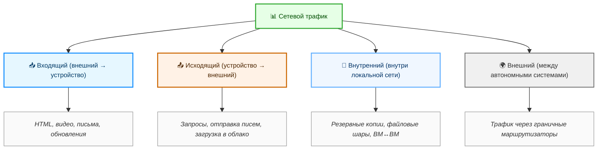
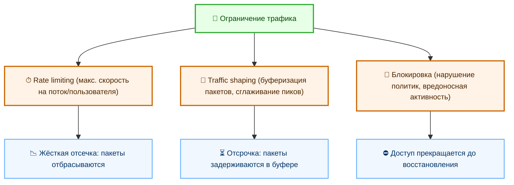

import NetworkTrafficMonitorDemo from '@site/src/components/NetworkTrafficMonitorDemo.jsx';

# Анализ и мониторинг сетевого трафика

  ОБЯЗАТЕЛЬНО
  ДЛЯ НОВИЧКОВ

Всем

## Сетевой трафик

### Что такое сетевой трафик?

**Сетевой трафик** — это совокупность данных, перемещающихся между устройствами в рамках компьютерной сети или между различными сетями. Каждое действие, совершаемое пользователем в цифровой среде, — от открытия веб-страницы до отправки сообщения в мессенджере — порождает поток информации, передаваемой по физическим или виртуальным каналам связи. Этот поток и составляет сетевой трафик. Он существует непрерывно, даже когда пользователь не ведёт активную работу: устройства обмениваются служебными сообщениями, синхронизируют время, проверяют наличие обновлений, поддерживают соединения с серверами.

Основная единица объёма сетевого трафика — бит. Бит представляет наименьшую порцию информации в двоичной системе.

<NetworkTrafficMonitorDemo /> Совокупность восьми битов образует байт — базовую единицу измерения объёма данных в большинстве систем. При оценке трафика используют производные единицы: килобайты, мегабайты, гигабайты, терабайты. В контексте скорости передачи данных, то есть интенсивности трафика, применяют биты в секунду: килобиты в секунду (Кбит/с), мегабиты в секунду (Мбит/с), гигабиты в секунду (Гбит/с). Различие между битами и байтами принципиально: передача данных по сетям измеряется в битах в секунду, тогда как хранение и объём файлов — в байтах. В одном байте восемь битов, поэтому скорость 8 Мбит/с теоретически позволяет загружать данные со скоростью 1 МБ/с.

Данные в сетях не передаются сплошным потоком. Перед отправкой они разбиваются на ограниченные по размеру логические фрагменты — пакеты. Каждый пакет содержит информационную часть — собственно данные — и служебную часть — заголовок. В заголовке указывается адрес отправителя, адрес получателя, номер пакета в последовательности, контрольная сумма и другая метаинформация, необходимая для маршрутизации и проверки целостности. Пакетная передача повышает устойчивость сетей: при потере одного пакета не требуется повторная передача всего сообщения, а лишь отдельного фрагмента. Кроме того, разные пакеты одного сообщения могут следовать по разным маршрутам и собираться в правильном порядке на стороне получателя.

---

### Виды сетевого трафика

Сетевой трафик классифицируют по направлению и локализации.  
**Входящий трафик** — это данные, поступающие в сеть или на устройство из внешнего источника. К нему относятся веб-страницы, загружаемые браузером, видео из стримингового сервиса, входящие электронные письма, обновления программного обеспечения.  
**Исходящий трафик** — данные, отправляемые из локальной сети или устройства во внешнюю среду. Примеры: запросы к веб-серверам, отправка писем, загрузка файлов на облачные хранилища, передача параметров в аналитические системы.  
**Внутренний трафик** циркулирует между устройствами в пределах одной автономной системы — чаще всего локальной сети. Это могут быть операции резервного копирования между серверами, обращения рабочих станций к локальному файловому хранилищу, взаимодействие виртуальных машин на одном хосте, синхронизация данных между узлами распределённой системы.  
**Внешний трафик** относится к обмену между различными автономными системами в глобальной сети — Интернете. Этот тип включает весь трафик, проходящий через граничные маршрутизаторы локальной сети к провайдеру и далее.

---

### Основные понятия

**Контроль и анализ сетевого трафика** — обязательный элемент эксплуатации и администрирования любой современной сети. Без мониторинга невозможно обеспечить надёжность, производительность и безопасность инфраструктуры. Целями анализа трафика выступают три основные задачи: обеспечение информационной безопасности, оптимизация производительности и эффективное управление ресурсами.

С точки зрения безопасности, сетевой трафик служит первичным источником сведений о поведении систем и пользователей. Инструменты анализа позволяют фиксировать аномальные объёмы передачи данных, нехарактерные адреса назначения, повторяющиеся короткие запросы, указывающие на сканирование портов, или резкие всплески входящего трафика — признак распределённой атаки типа «отказ в обслуживании» (DDoS). Обнаружение подозрительных шаблонов — например, передачи данных на известные IP-адреса ботнетов или использование шифрованных каналов в обход корпоративных политик — помогает своевременно локализовать угрозы. Даже при применении шифрования, как в случае TLS, анализ метаданных — размеров пакетов, временных интервалов между ними, частоты соединений — позволяет делать выводы о характере активности.

**Оптимизация сети** требует понимания, какие приложения и пользователи потребляют наибольшую долю пропускной способности. Стриминговое видео, онлайн-игры, облачные резервные копии, автоматические обновления операционных систем и программного обеспечения — типичные источники высоконагруженного трафика. Умные домашние устройства, такие как IP-камеры, голосовые помощники и системы «умного дома», также производят непрерывный фоновый трафик: отправку статусов, получение команд, синхронизацию с облачными сервисами. Выявление «пожирателей» пропускной способности позволяет скорректировать приоритеты, ограничить фоновую активность в рабочее время или выделить отдельные каналы для критически важных служб.

Управление ресурсами включает распределение пропускной способности между различными классами трафика. Механизмы приоритезации, такие как Quality of Service (QoS), обеспечивают предсказуемую задержку и минимальную потерю пакетов для чувствительных к времени приложений — например, видеоконференций или телефонии по IP. При недостатке пропускной способности трафик низкого приоритета — например, загрузка несрочных файлов — может быть временно приостановлен или замедлен, чтобы сохранить качество обслуживания для важных сервисов.

Учёт сетевого трафика осуществляется на нескольких уровнях. На уровне конечного устройства — с помощью программного обеспечения: TMeter, BWMeter, NetWorx, DU Meter, NetTraffic, NetBalancer и им подобных. Эти приложения работают в режиме мониторинга сетевых интерфейсов, фиксируют объём входящих и исходящих пакетов, строят графики, формируют отчёты по приложениям и доменам. На уровне провайдеров и корпоративных сетей учёт реализуется аппаратно — с помощью маршрутизаторов, коммутаторов и специализированных аналитических платформ, поддерживающих протоколы сбора телеметрии, такие как NetFlow, sFlow, IPFIX. Эти протоколы позволяют передавать агрегированные сведения о потоках: источник, получатель, протокол, объём, длительность — без перехвата самих данных. Провайдеры используют эти данные для биллинга (при тарификации по объёму), для обнаружения перегрузок на отдельных участках инфраструктуры, для принятия решений о расширении каналов связи.

**Ограничение трафика** — стандартная практика на всех уровнях сетевой иерархии. Механизмы ограничения реализуются с помощью политик скорости (rate limiting), формирования трафика (traffic shaping) и блокировки. Rate limiting задаёт максимальную скорость передачи для отдельного потока, пользователя или приложения. Traffic shaping удерживает трафик в заданных рамках, временно задерживая превышающие лимит пакеты в буфере, что сглаживает всплески и снижает пиковую нагрузку. Блокировка применяется в случае нарушения политик: при обнаружении вредоносной активности, при превышении лимитов или при запрете доступа к определённым ресурсам.

Центральное место в глобальной маршрутизации трафика занимают точки обмена интернет-трафиком — Internet Exchange Points (IXP). Это физическая и логическая инфраструктура, где операторы связи, провайдеры контента и крупные организации напрямую подключают свои сети для взаимного обмена данными. Такой обмен называется пирингом. Вместо того чтобы направлять трафик через промежуточных провайдеров, участники IXP соединяются напрямую, что сокращает задержки, повышает надёжность и снижает стоимость транзита. Эффективность точки обмена растёт с увеличением числа участников: каждый вновь подключённый узел расширяет множество возможных прямых соединений. В крупных мегаполисах существуют десятки IXP, включая нейтральные площадки, принадлежащие независимым операторам дата-центров. Участие в IXP — признак зрелости сетевой инфраструктуры организации.

Анализ содержимого сетевого трафика позволяет получить подробные сведения о происходящих в сети процессах. При расшифровке трафика, если он не зашифрован, можно установить тип передаваемого контента (текст, изображение, аудио), протокол прикладного уровня (HTTP, DNS, SMTP), доменные имена участвующих ресурсов, параметры запросов, заголовки сессий. Даже без расшифровки полезной нагрузки — например, при использовании TLS — возможно определить домен назначения через расширение Server Name Indication (SNI), оценить объём обмена, длительность соединения, частоту обращений. Это даёт представление о характере активности: просмотр веб-сайтов, обмен почтой, работа с облачными сервисами, использование мессенджеров.

Определение действий пользователя по анализу трафика зависит от уровня доступа, методов сбора и степени шифрования. При полном доступе к незашифрованному трафику возможно реконструировать содержание страниц, извлекаемые файлы, отправляемые формы, заголовки запросов, включая поисковые запросы. При наличии только метаданных — IP-адресов, временных меток, размеров пакетов — выводы носят косвенный характер: например, периодическое подключение к известному адресу видеостримингового сервиса с высоким объёмом входящего трафика свидетельствует о воспроизведении видео. Широкое внедрение шифрования, в первую очередь протокола HTTPS, значительно ограничивает возможности получения содержательной информации без участия конечных устройств.

**Перехват трафика** — процедура получения копии сетевых пакетов для последующего анализа. Он может быть авторизованным и неавторизованным. Авторизованный перехват применяется в рамках мониторинга сетевой инфраструктуры, диагностики ошибок, аудита безопасности и расследования инцидентов. Для этого используются зеркалирующие порты на коммутаторах (SPAN), агрегаторы трафика, программные снифферы (например, Wireshark, tcpdump), а также встроенные средства операционных систем. Неавторизованный перехват — компрометация канала связи, осуществляемая злоумышленниками. К нему приводят атаки типа «человек посередине» (MITM), использование поддельных точек доступа Wi-Fi, захват трафика в незащищённых сегментах локальной сети. Защита от несанкционированного перехвата достигается применением шифрования на всех уровнях стека протоколов, использованием сертификатов, строгой проверкой подлинности серверов и клиентов, а также сегментацией сети.

---

### Структура сетевого пакета и многоуровневая инкапсуляция

Каждый фрагмент сетевого трафика существует в виде пакета — логической единицы передачи, сформированной в соответствии со стеком протоколов. Наиболее распространённый стек — TCP/IP — состоит из четырёх уровней: прикладного, транспортного, сетевого и канального. При передаче данных каждый уровень добавляет к полезной нагрузке собственную служебную информацию — заголовок (а иногда и завершающий маркер — трейлер). Этот процесс называется инкапсуляцией.

На прикладном уровне формируется исходное сообщение: HTTP-запрос, фрагмент электронного письма, команда протокола передачи файлов. Затем управление передаётся транспортному уровню, где выбирается протокол — TCP или UDP. TCP обеспечивает надёжную доставку: нумерует пакеты, подтверждает их получение, повторно отправляет потерянные фрагменты, управляет скоростью передачи. UDP — минимальная надстройка: только порты источника и получателя, без гарантий доставки. Транспортный заголовок добавляется к прикладным данным, образуя сегмент (в случае TCP) или датаграмму (в случае UDP).

Следующий этап — сетевой уровень. Здесь данные получают IP-адреса: отправителя и получателя. Заголовок IP-пакета содержит информацию о версии протокола (IPv4 или IPv6), длине заголовка, типе сервиса, идентификаторе фрагмента, времени жизни (TTL), контрольной сумме и протоколе верхнего уровня. Получившийся блок называют IP-пакетом. TTL — ключевой элемент защиты от зацикливания: каждый маршрутизатор, через который проходит пакет, уменьшает это значение на единицу; при достижении нуля пакет отбрасывается.

На канальном уровне к IP-пакету добавляются MAC-адреса: физические идентификаторы устройств в локальном сегменте сети. Именно по этим адресам коммутаторы пересылают кадры внутри одного широковещательного домена. Кадр включает преамбулу (для синхронизации), MAC-адреса, тип протокола (указывающий на IP), полезную нагрузку и контрольную последовательность (FCS) для проверки целостности. При переходе через маршрутизатор MAC-адреса изменяются: новый заголовок формируется для следующего сегмента пути.

Таким образом, один и тот же объём данных проходит через последовательность преобразований: сообщение → сегмент/датаграмма → IP-пакет → кадр. На стороне получателя процесс повторяется в обратном порядке — деинкапсуляция: каждый уровень снимает свой заголовок и передаёт данные вышележащему уровню. Эта многослойная структура обеспечивает гибкость: замена физической среды (оптика на радиоканал) не требует изменения прикладных протоколов.

### Маршрутизация и коммутация — как пакет находит путь

Доставка пакета от источника к получателю — задача маршрутизации. Она осуществляется на основе таблиц маршрутизации, хранящихся в каждом маршрутизаторе. Запись в таблице указывает, через какой интерфейс и на какой следующий узел следует отправить пакет с указанным адресом назначения. Решение принимается локально: маршрутизатор не знает полного маршрута, он знает лишь, куда передать пакет дальше — ближайшему «соседу» по пути. Такой подход позволяет строить глобальные сети, в которых каждый узел отвечает только за свою зону ответственности.

Маршруты могут быть статическими — заданными администратором вручную — или динамическими — вычисляемыми автоматически с помощью протоколов маршрутизации. Протоколы типа OSPF (Open Shortest Path First) и IS-IS (Intermediate System to Intermediate System) применяются внутри автономной системы для построения оптимальных внутренних маршрутов. BGP (Border Gateway Protocol) — основной протокол междоменной маршрутизации: он управляет обменом маршрутной информацией между независимыми сетями, такими как провайдеры, крупные корпорации или национальные регистраторы. BGP учитывает не только геометрическое расстояние, но и политики: стоимость транзита, предпочтения оператора, технические ограничения.

Коммутация — пересылка кадров внутри одного сегмента локальной сети — выполняется на основе MAC-адресов. Коммутатор изучает, какие адреса находятся за каждым своим портом, и строит таблицу соответствий. При получении кадра он проверяет адрес получателя и пересылает кадр только на тот порт, где зарегистрирован этот адрес. Такой подход изолирует трафик, повышает безопасность и снижает нагрузку на сеть по сравнению с хабами, которые транслируют все кадры на все порты.

В современных сетях маршрутизация и коммутация всё чаще реализуются программно — в рамках архитектуры SDN (Software-Defined Networking). Контроллер SDN централизованно управляет таблицами потоков на коммутаторах, что позволяет гибко управлять трафиком: перенаправлять его в обход перегруженных участков, внедрять политики безопасности на уровне потоков, автоматически реагировать на отказы оборудования.

### Особенности трафика в беспроводных сетях

Беспроводные технологии — Wi-Fi, сотовые сети (4G/5G), Bluetooth, LPWAN — вносят специфические черты в характер сетевого трафика. Основное отличие — разделяемая среда передачи. В отличие от проводных соединений, где кабель соединяет два узла напрямую, радиоканал доступен всем устройствам в зоне покрытия. Это требует механизмов координации доступа к среде.

В Wi-Fi используется протокол CSMA/CA (Carrier Sense Multiple Access with Collision Avoidance). Устройство перед отправкой проверяет, свободен ли канал. Если канал занят, оно ожидает случайный интервал времени, затем повторяет попытку. Для уменьшения коллизий вводится механизм подтверждения (ACK): после получения кадра получатель отправляет квитанцию; при её отсутствии отправитель повторяет передачу. Эти процедуры увеличивают накладные расходы и снижают реальную пропускную способность по сравнению с заявленной.

Сотовые сети применяют жёсткое планирование ресурсов: базовая станция распределяет временные и частотные слоты между абонентами. В 5G введены концепции сетевых срезов (network slicing), позволяющие выделять виртуальные сегменты сети с заданными параметрами задержки, пропускной способности и надёжности — от ультранизкой задержки для промышленных систем до высокой ёмкости для массовых IoT-устройств.

Беспроводные сети чувствительны к внешним факторам: расстоянию до точки доступа, наличию препятствий, электромагнитным помехам, количеству одновременно активных устройств. Эти факторы вызывают изменчивость качества канала: скорость передачи может динамически адаптироваться в зависимости от условий. Адаптивная модуляция и кодирование (AMC) позволяют выбирать оптимальное сочетание скорости и устойчивости: при хорошем сигнале используются сложные схемы модуляции для роста скорости, при ухудшении — более надёжные, но медленные.

### Шифрование, инкапсуляция и туннелирование

Современный сетевой трафик всё чаще скрыт от прямого анализа. Массовое внедрение TLS (Transport Layer Security) привело к тому, что подавляющее большинство веб-трафика, почтовых соединений, API-взаимодействий передаётся в зашифрованном виде. Это защищает конфиденциальность, но затрудняет диагностику, безопасностный мониторинг и управление качеством обслуживания.

Шифрование распространяется и на нижние уровни. Протоколы типа IPsec и WireGuard обеспечивают шифрование всего IP-трафика между двумя узлами или сетями. Это применяется в виртуальных частных сетях (VPN), защищённых междатацентровых соединениях, мобильных корпоративных доступах. В результате даже сетевой уровень становится закрытым: наблюдатель видит только внешние IP-адреса туннельных шлюзов и объём зашифрованного потока.

Туннелирование — инкапсуляция одного сетевого протокола внутри другого — широко используется для изоляции, совместимости и обхода ограничений. Примеры: GRE-туннели для передачи многоадресного трафика через сети, не поддерживающие его; VXLAN для масштабируемой сегментации центров обработки данных; HTTP-туннели для прохождения через брандмауэры, разрешающие только веб-трафик. Каждый уровень инкапсуляции добавляет накладные расходы — заголовки увеличивают общий размер пакета — и усложняет анализ: приходится распаковывать несколько слоёв, чтобы добраться до исходного содержимого.

Глубокая проверка пакетов (Deep Packet Inspection, DPI) остаётся одним из инструментов анализа зашифрованного трафика, но её возможности ограничены. Без расшифровки DPI опирается на статистические признаки: размер и частота пакетов, временные шаблоны, использование специфических портов и расширений TLS (например, ALPN для указания прикладного протокола, SNI для имени домена). TLS 1.3 и развитие технологий, таких как Encrypted Client Hello (ECH), постепенно устраняют и эти утечки метаданных, делая трафик ещё более непрозрачным.

### Поведенческий анализ и машинное обучение в трафике

При невозможности прямого доступа к содержимому возрастает роль поведенческого анализа. Вместо поиска сигнатур вредоносного ПО оценивается отклонение от нормального профиля активности. Для каждого устройства или пользователя строится базовый шаблон: типичные адреса назначения, объёмы передачи, временные окна активности, используемые протоколы. Система обнаружения вторжений (IDS) фиксирует аномалии: неожиданное подключение к редко используемому порту, резкий рост исходящего трафика в ночное время, циклические запросы к неизвестным доменам.

Машинное обучение применяется для классификации трафика по приложениям даже без расшифровки. Алгоритмы обучаются на наборах признаков — последовательностях размеров пакетов, интервалов между ними, распределении направлений (вход/выход). Такие модели способны отличать видеостриминг от видеоконференции, онлайн-игру от облачного хранилища, вредоносную активность от легитимного фонового обмена. Точность зависит от качества обучающей выборки и стабильности поведения приложений.

---

### Трафик в центрах обработки данных и облачных инфраструктурах

Внутри современного дата-центра сетевой трафик приобретает иерархическую, многопоточную и высокодинамичную природу. Традиционная модель «клиент— сервер» уступает место распределённым микросервисным архитектурам, где сотни или тысячи компонентов постоянно взаимодействуют друг с другом. Это порождает преобладание внутреннего (восток–запад) трафика над внешним (север–юг). Восток–запад — обмен между серверами внутри одного дата-центра: вызовы API, синхронизация баз данных, репликация состояния, оркестрация контейнеров. Север–юг — трафик между пользователями и инфраструктурой: запросы к веб-интерфейсу, загрузка контента, API-вызовы извне.

Архитектура сети дата-центра, как правило, следует трёхуровневой или, чаще, двухуровневой (spine-leaf) модели. В модели spine-leaf все серверы подключаются к коммутаторам уровня *leaf* (лист), а все *leaf*-коммутаторы соединены со *spine* (хребет). Каждая пара leaf–spine образует равномерную матрицу соединений, обеспечивающую равномерное распределение нагрузки и отказоустойчивость. Такая топология устраняет узкие места, присущие иерархическим схемам, и масштабируется горизонтально — добавлением новых leaf- или spine-узлов.

Виртуализация и контейнеризация вносят дополнительные слои абстракции. Каждый виртуальный сервер или контейнер имеет собственный виртуальный сетевой интерфейс (vNIC), а весь трафик между ними может не покидать физического хоста. Это называется *внутрихостовым* трафиком. Его объём часто превышает трафик между серверами. Учёт и контроль такого трафика требуют интеграции средств мониторинга на уровне гипервизора (например, VMware vSphere Distributed Switch, Open vSwitch) или оркестратора (Kubernetes CNI-плагины).

Программно-определяемые сети (SDN) стали стандартом для управления трафиком в дата-центрах. Контроллер SDN (например, на базе OpenDaylight, ONOS или коммерческих решений Cisco ACI, VMware NSX) строит единую логическую карту всей сети и управляет таблицами потоков на коммутаторах через протокол OpenFlow или его аналоги. Это позволяет реализовать политики сетевой безопасности на уровне приложений (microsegmentation), динамически перераспределять нагрузку между экземплярами сервисов, автоматически изолировать скомпрометированные узлы.

Облачные платформы (AWS, Azure, Google Cloud) предоставляют собственные модели виртуальных сетей — VPC (Virtual Private Cloud), Virtual Сеть, VPC соответственно. Внутри виртуальной сети администратор определяет подсети, таблицы маршрутизации, группы безопасности и списки контроля доступа. Метрики трафика собираются автоматически: объём входящего и исходящего трафика на уровне виртуальной машины, сетевого интерфейса, балансировщика нагрузки. Эти данные поступают в системы мониторинга (CloudWatch, Azure Monitor, Stackdriver), формируя основу для оплаты, диагностики и автоматического масштабирования.

Важной особенностью облачных сред является эластичность трафика. Нагрузка может меняться на порядки в течение минут: запуск аналитического задания, всплеск пользовательской активности, автоматическое обновление. Системы масштабирования реагируют на пороговые значения сетевой активности — например, среднюю пропускную способность за 5 минут — и запускают новые экземпляры сервисов, перераспределяя трафик через балансировщики. Обратный процесс — свёртывание — активируется при снижении нагрузки, что позволяет оптимизировать затраты.

### Сетевая телеметрия нового поколения

Традиционные методы сбора данных — такие как SNMP-опрос или экспорт NetFlow — обладают существенными ограничениями. SNMP работает по принципу pull: система мониторинга периодически опрашивает устройства, что создаёт задержку и нагрузку. NetFlow предоставляет агрегированную информацию о потоках, но не даёт детализации по отдельным пакетам и плохо масштабируется при высокой скорости трафика.

Современная телеметрия строится на принципе push и потоковой передачи. Устройства сами инициируют отправку данных в реальном времени по мере возникновения событий или по фиксированным интервалам. Ключевые технологии:

- **gNMI (gRPC Network Management Interface)** — стандарт, основанный на gRPC и Protocol Buffers. Он позволяет подписываться на изменения в конфигурации или состоянии устройства, получать потоковые обновления метрик (например, загрузки CPU, объёма трафика на интерфейсе, количества ошибок CRC). gNMI поддерживает выборку по пути в иерархической модели данных (YANG), что обеспечивает точечный сбор нужной информации.

- **OpenConfig** — инициатива по созданию открытых, провайдер-независимых YANG-моделей для описания сетевого оборудования. Вместо проприетарных MIB-файлов или команд CLI используется единая структура данных, одинаково применимая к устройствам Cisco, Juniper, Arista, Nokia. Это упрощает интеграцию с системами мониторинга и автоматизации.

- **Streaming Telemetry** — обобщённый термин для потоковых интерфейсов, включая gNMI, но также MQTT, Kafka-топики, syslog over TLS. Данные поступают в централизованные системы аналитики (например, Elasticsearch, Splunk, Grafana Loki), где агрегируются, визуализируются и подвергаются корреляционному анализу.

Преимущества потоковой телеметрии — низкая задержка, высокая частота обновлений (до нескольких тысяч измерений в секунду), минимальная нагрузка на CPU устройства (передача инициируется самим устройством, без ожидания запроса), и гибкость выборки. Это критично для обнаружения кратковременных перегрузок, микровсплесков задержки (microbursts) или мимолётных потерь пакетов, которые традиционные методы могут пропустить.

### Конфиденциальность, регулирование и логирование

Сбор, хранение и анализ сетевого трафика находятся в поле зрения законодательства о защите персональных данных. Регламенты, такие как GDPR в Европе, ФЗ-152 в России, требуют обоснования необходимости обработки, минимизации объёма собираемых данных, обеспечения безопасности и предоставления субъектам права на доступ и удаление.

Метаданные трафика — IP-адреса, временные метки, объёмы — часто квалифицируются как персональные данные, поскольку позволяют идентифицировать субъекта или составить профиль его поведения. Например, последовательность посещённых доменов даже без содержимого страниц может раскрыть интересы, местоположение, социальные связи пользователя.

В соответствии с требованиями законодательства, крупные операторы и провайдеры обязаны вести журналы событий (logs) определённого типа. В России действует приказ ФСБ № 378 и приказ Минкомсвязи № 130, обязывающие операторов связи хранить сведения о фактах соединения: номер абонента (или IP-адрес), время начала и окончания сеанса, идентификатор точки доступа, объём переданных данных — в течение 12 месяцев, а содержание сообщений — до 6 месяцев при наличии технической возможности. Эти данные предоставляются уполномоченным органам по запросу и используются при расследовании преступлений.

Техническая реализация логирования включает:
- сбор событий в формате syslog, NetFlow/IPFIX, или через API провайдерского оборудования;
- нормализацию и фильтрацию (удаление избыточной служебной информации);
- хранение в защищённых, реплицированных хранилищах с контролем целостности;
- шифрование как при передаче, так и в состоянии покоя;
- строгий контроль доступа — только авторизованные лица могут инициировать запросы на выборку.

Корпоративные сети придерживаются принципа *минимизации логов*: хранятся только те сведения, которые необходимы для обеспечения безопасности и соблюдения внутренних политик. Например, журналы прокси-сервера могут фиксировать доменные имена и статусы ответов, но не содержать тела HTTP-запросов или файлов. Включение полного перехвата трафика (full packet capture) допускается только в строго ограниченных зонах — например, на границе DMZ — и на короткий срок (часы или сутки).

### Практические сценарии анализа сетевого трафика

#### Диагностика проблем производительности  

Первый шаг — определение уровня стека, на котором возникает проблема. Если пинг до шлюза проходит, а до внешнего ресурса — нет, проблема, скорее всего, на сетевом уровне (маршрутизация, блокировка). Если пинг проходит, но веб-страница не загружается — транспортный или прикладной уровень (блокировка порта 443, сбой в TLS-handshake, ошибка приложения). Инструменты: `ping`, `traceroute`, `mtr`, `nslookup`, `dig`, `curl -v`. При анализе пакетов в Wireshark обращают внимание на повторные передачи TCP (retransmissions), высокий RTT (round-trip time), флаги RST или FIN в неожиданный момент.

#### Расследование инцидентов информационной безопасности  

При подозрении на компрометацию собирают трафик с устройства-жертвы за период, предшествующий инциденту. Ищут:
- соединения с известными вредоносными IP-адресами (по базам угроз: AbuseIPDB, VirusTotal, MISP);
- использование нестандартных портов (например, SSH на 443 порту);
- регулярные короткие запросы к динамически генерируемым доменам (DGA — Domain Generation Algorithm);
- исходящий трафик в ночное время без участия пользователя;
- шифрованные соединения с самоподписанными сертификатами.

Даже при шифровании анализ DNS-запросов может выявить попытки соединения с фишинговыми доменами или командными серверами. Журналы брандмауэра и прокси дают представление о разрешённых и заблокированных попытках.

#### Планирование ёмкости и модернизации  

Основа — долгосрочный сбор метрик: объём входящего/исходящего трафика, пиковую и среднюю скорость, распределение по протоколам, количество активных соединений. Данные агрегируются по часам, суткам, неделям. С помощью методов временных рядов (например, скользящее среднее, экспоненциальное сглаживание) строится прогноз роста. Пороговое значение, при котором требуется расширение, определяется политикой: обычно 70–80 % от номинальной пропускной способности — для обеспечения запаса на всплески и техническое обслуживание.

При планировании учитывают не только пропускную способность, но и задержку, джиттер и потерю пакетов. Для чувствительных приложений (голос, видео, промышленный IoT) эти параметры важнее, чем абсолютный объём. Мониторинг качества обслуживания (QoS) ведётся с помощью активных зондов — генерации тестового трафика (например, через инструменты типа iperf3, OWAMP) — и пассивных — анализа реального трафика.

---

