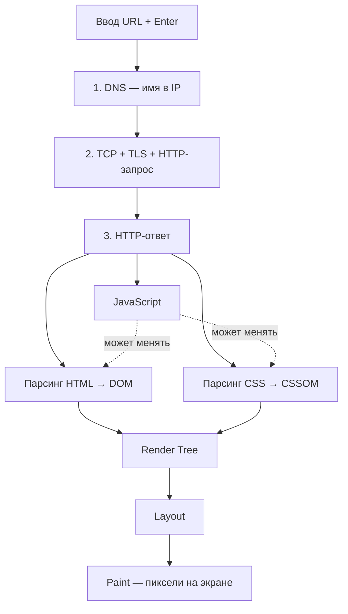
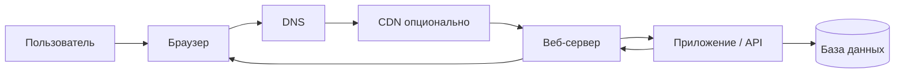

import ExternalPlayEmbed from '@site/src/components/ExternalPlayEmbed';


# Сайты и веб-сайты

<div class="article-tags">
  <span class="tag tag-required">ОБЯЗАТЕЛЬНО</span>
  <span class="tag tag-beginner">ДЛЯ НОВИЧКОВ</span>
</div>

<span class="complexity-badge">Всем</span>

---

## Сайт и веб-сайт

Вы сейчас находитесь на сайте — это место в интернете, куда заходят, чтобы что-то прочитать, посмотреть или купить. Достаточно ввести в адресной строке, например, `spirzen.ru`, и браузер откроет нужный ресурс.

Главное — понять двух участников обмена:

- **Клиент** — программа, которая запрашивает страницу. Обычно это браузер (Chrome, Firefox, Safari и др.), но клиентом может быть и мобильное приложение или поисковый робот.
- **Сервер** — удалённая машина (или кластер), на которой работает ПО, хранятся файлы и выполняется логика сайта. Сервер принимает запросы и отдаёт ответы.

Типичная цепочка при открытии `ozon.ru`:

1. Браузер через **DNS** узнаёт IP-адрес сервера по доменному имени (сначала кэш ОС и браузера, при промахе — резолвер, затем цепочка Root → TLD → авторитативный сервер; только после этого возможен HTTP). Пошаговая схема — в [DNS — пошаговый резолв](/encyclopedia/2-system-network/2-03-set-i-internet/6#dns-resolve-steps).
2. Устанавливается соединение (для HTTPS — с шифрованием **TLS**).
3. Браузер отправляет **HTTP-запрос**: "дай главную страницу".
4. Сервер обрабатывает запрос и возвращает **HTTP-ответ** с HTML и ссылками на CSS, JavaScript, изображения.
5. Браузер строит страницу на экране — DOM, CSSOM, дерево отрисовки, layout, paint и выполнение JavaScript. Подробная схема — в разделе ["От URL до пикселей"](#url-enter-to-page) ниже.


**Три технологии страницы** (плюс протокол доставки):

| Технология | Роль |
|------------|------|
| **HTML** | Структура: заголовки, меню, формы, ссылки |
| **CSS** | Оформление: цвета, шрифты, сетка, адаптивность |
| **JavaScript** | Поведение: клики, проверка форм, подгрузка данных без перезагрузки |
| **HTTP / HTTPS** | Правила запроса и ответа; **HTTPS** добавляет шифрование (TLS) |

HTML (HyperText Markup Language) описывает *содержимое*; HTTP (HyperText Transfer Protocol) — *как* оно передаётся по сети. Названия похожи, но это разные уровни. HTTP относится к **прикладному** слою стека TCP/IP; ниже идут TCP (транспорт), IP (интернет) и кадры Ethernet/Wi‑Fi — см. [модель TCP/IP](/encyclopedia/2-system-network/2-03-set-i-internet/4.md#model-tcp-ip).

В запросе браузер указывает, например:

- **метод** — `GET` (получить ресурс), `POST` (отправить данные);
- **путь** — `/catalog`, `/about` и т.д.;
- **версию протокола** — `HTTP/1.1`, `HTTP/2`, `HTTP/3`.

В ответе сервер присылает:

- тело ответа (часто HTML и связанные файлы);
- **статус-код** (`200 OK` — успех, `404` — не найдено);
- заголовки, в том числе **Set-Cookie** — инструкцию сохранить cookie на клиенте; в нём может лежать Session ID или сам токен с данными, браузер автоматически отправит cookie при следующих запросах (сравнение двух подходов — [cookies и sessions](/encyclopedia/2-system-network/2-04-kak-rabotayut-sayty-i-veb-sayty/116#cookies-and-sessions); обзор хранилищ — [хранение данных](/encyclopedia/2-system-network/2-04-kak-rabotayut-sayty-i-veb-sayty/116), [персонализация](/encyclopedia/2-system-network/2-04-kak-rabotayut-sayty-i-veb-sayty/119)).

Чтобы уверенно разбираться в вебе, полезна база — **HTML, CSS, JavaScript**, понимание **URL и DNS**, протоколов **HTTP/HTTPS**. Структуру URL разбираем в ["Адресная строка браузера"](/encyclopedia/2-system-network/2-04-kak-rabotayut-sayty-i-veb-sayty/11).

<span id="url-enter-to-page"></span>

### От URL до пикселей — три фазы под капотом

После Enter в адресной строке браузер проходит три крупные фазы. Их удобно запомнить как **резолв имени → запрос → отрисовка** (в англоязычных схемах — *Resolve Domain Name*, *Initiate Request*, *Handle Response*).



#### Фаза 1 — резолв домена (DNS)

Сначала браузер узнаёт **IP-адрес** хоста из URL. Пока IP неизвестен, HTTP-запрос на сервер не уходит.

| Уровень кэша | Где хранится ответ | При промахе |
| :--- | :--- | :--- |
| **Кэш браузера** | Внутри вкладки / профиля | Запрос к ОС или резолверу |
| **Кэш ОС** | Stub resolver Windows, macOS, Linux | Запрос дальше по цепочке |
| **Локальный кэш** | DNS на домашнем роутере, Pi-hole, корпоративный forwarder | Запрос к резолверу провайдера |
| **Кэш резолвера** | Сервер провайдера, `8.8.8.8`, `1.1.1.1`, DoH в браузере | Итеративный обход иерархии DNS |

При полном промахе **рекурсивный резолвер** спрашивает по цепочке:

1. **Root** — где серверы зоны `.com`, `.ru` и т.д.;
2. **TLD** — кто авторитативен для `example.com`;
3. **Authoritative** — запись `A` / `AAAA` с IP, например `172.67.73.33`.

Ответ кэшируется на время **TTL** и возвращается браузеру. Полная таблица шагов и диаграмма — [DNS — пошаговый резолв](/encyclopedia/2-system-network/2-03-set-i-internet/6#dns-resolve-steps).

#### Фаза 2 — запуск запроса (соединение и HTTPS)

Зная IP, браузер открывает **TCP**-канал на порт **443** (для HTTPS) или **80** (для HTTP).

| Шаг | Содержание |
| :--- | :--- |
| **TCP** | Трёхэтапное рукопожатие `SYN` → `SYN+ACK` → `ACK` |
| **TLS** (только HTTPS) | `Client Hello` / `Server Hello`; сервер присылает **сертификат** и публичный ключ; стороны согласуют **сессионный ключ**; дальше HTTP идёт в шифрованном виде |
| **HTTP-запрос** | Текстовый запрос внутри TLS, например `GET / HTTP/1.1` с заголовками `Host`, `User-Agent`, `Accept`, `Accept-Language` |

Схемы TCP и TLS — в [HTTPS и TLS — установление соединения](/encyclopedia/2-system-network/2-04-kak-rabotayut-sayty-i-veb-sayty/128#ustanovlenie-soedineniya). Разбор заголовков на примере `https://spirzen.ru` — в [HTTP как основа веб-интеграций](/encyclopedia/2-system-network/2-09-osnovy-integratsionnogo-vzaimodeystviya/118#spirzen-https).

#### Фаза 3 — ответ сервера и рендеринг в браузере

Сервер возвращает **HTTP-ответ** — статус, заголовки и тело (часто HTML). Первая цифра статус-кода задаёт класс результата:

| Класс | Смысл | Примеры |
| :--- | :--- | :--- |
| **2xx** | Успех | `200 OK` — страница отдана |
| **3xx** | Перенаправление | `301`, `302`, `304 Not Modified` |
| **4xx** | Ошибка запроса или прав клиента | `404 Not Found`, `403 Forbidden` |
| **5xx** | Сбой сервера или цепочки прокси | `500`, `502`, `503` |

Шпаргалка по кодам — [справочник HTTP](/encyclopedia/2-system-network/2-03-set-i-internet/611#status-codes-cheatsheet).

После успешного ответа с HTML браузер запускает **конвейер отрисовки** (critical rendering path):

| Ресурс | Этапы | Результат |
| :--- | :--- | :--- |
| **HTML** | разбор → токенизация → построение дерева | **DOM** — объектная модель документа (`html` → `head`, `body` → `h1`, `img` …) |
| **CSS** | разбор таблиц стилей → токенизация | **CSSOM** — дерево правил и вычисленных свойств |
| **Объединение** | сопоставление DOM и CSSOM | **Render Tree** — только видимые узлы с финальными стилями |
| **Вывод** | layout (геометрия) → paint (пиксели) | Картинка на экране |
| **JavaScript** | загрузка и выполнение скриптов | Может менять DOM и CSSOM, запускать повторный layout/paint |

Скрипт без `async` / `defer` **останавливает** построение DOM до выполнения. CSS **блокирует** первую отрисовку, пока не готов CSSOM. Семь этапов жизненного цикла веб-приложения с примерами — [Веб-приложения — инициализация](/encyclopedia/2-system-network/2-04-kak-rabotayut-sayty-i-veb-sayty/111#posledovatelnost-inicializacii). Метрики скорости (TTFB, FCP) — [Метрики производительности веб-страницы](./130.md).

<div class="callout callout--tip">
  <div class="callout-title">Проверить на практике</div>

  <div class="callout-body">
  Откройте DevTools (**F12**) → вкладка **Network** — DNS, TLS и каждый файл (HTML, CSS, JS) видны по времени. Вкладка **Elements** показывает итоговый DOM после скриптов — он может отличаться от исходного HTML.
  </div>
</div>

---

### Пример — запрос и ответ "вручную"

```http
GET / HTTP/1.1
Host: example.com
Accept: text/html

HTTP/1.1 200 OK
Content-Type: text/html; charset=utf-8

<!DOCTYPE html>
<html lang="ru">
  <head><title>Пример</title></head>
  <body><h1>Страница отдана сервером</h1></body>
</html>
```

---

### Минимальная страница

```html
<!DOCTYPE html>
<html lang="ru">
  <head>
    <meta charset="utf-8">
    <title>Демо</title>
    <style>
      body { font-family: system-ui, sans-serif; margin: 2rem; }
      button { padding: 0.5rem 1rem; }
    </style>
  </head>
  <body>
    <h1>Привет</h1>
    <button id="btn" type="button">Нажми</button>
    <p id="out"></p>
    <script>
      document.getElementById('btn').onclick = () => {
        document.getElementById('out').textContent = 'Сработал JavaScript';
      };
    </script>
  </body>
</html>
```

<ExternalPlayEmbed example="system-network/web-page-layers-play" title="Слои веб-страницы" minHeight={480} />

<ExternalPlayEmbed example="about/http-request-analyzer" title="Http Request Analyzer" />

---

### Краткий глоссарий раздела

| Термин | Смысл |
|--------|--------|
| **Сайт / веб-сайт** | Набор страниц и ресурсов под одним доменом |
| **Веб-приложение** | Сайт, где главное — интерактив и состояние; часто API + клиентский код |
| **PWA** | Веб-приложение с manifest и Service Worker (офлайн, установка на экран) |
| **Веб-сервер** | Программа (Nginx, Apache, IIS), принимающая HTTP |
| **Origin** | Схема + хост + порт; от него зависят cookies и CORS |
| **CDN** | Сеть кэширующих узлов — см. ["Веб-серверы"](/encyclopedia/2-system-network/2-04-kak-rabotayut-sayty-i-veb-sayty/112) |

---

## Сущность и принципы функционирования

### Что такое сайт?

Термин *"сайт"* (от англ. *site* — "место", "локация") впервые вошёл в русскоязычную техническую лексику в середине 1990-х годов и с тех пор закрепился как обобщённое обозначение любого ресурса, доступного в сети Интернет по уникальному адресу. В строгом смысле, **сайт** и **веб-сайт** являются синонимами — оба указывают на совокупность взаимосвязанных ресурсов — прежде всего, веб-страниц, — объединённых общей тематикой, функциональной логикой и доменным именем.  

Другие значения слова *"сайт"* (например, *строительная площадка*, *археологический участок*) в контексте информационных технологий не применяются. Для избежания неоднозначности, в технической документации и учебных материалах часто используется уточнённая форма — **веб-сайт**.  

Веб-сайт — это **логическая структура данных**, реализованная с использованием протоколов, программного обеспечения и аппаратных ресурсов. Он существует в двух проекциях одновременно:  
- как **коллекция файлов и метаданных**, хранящихся на одном или нескольких серверах;  
- как **отображаемый пользователю интерфейс**, формируемый браузером на основе полученных данных.  

Это дуализм определяет ключевой принцип веб-технологий: *разделение данных, логики и представления*.

---

### Клиент-серверная модель  

Функционирование любого веб-сайта базируется на **модели взаимодействия клиента и сервера**, стандартизированной в рамках протокола HTTP (Hypertext Transfer Protocol) и его защищённой версии HTTPS. Эта модель предполагает чёткое распределение ролей:  

- **Клиент** — программа, инициирующая запрос. В подавляющем большинстве случаев это веб-браузер (Chrome, Firefox, Safari и др.), но клиентом может быть и мобильное приложение, скрипт, поисковый робот или IoT-устройство.  
- **Сервер** — программно-аппаратная система, принимающая запросы, обрабатывающая их и возвращающая ответ. Сервер может быть физическим компьютером, виртуальной машиной или контейнером в облачной инфраструктуре; на нём запущено специализированное ПО (например, веб-сервер Nginx или Apache), а также прикладной код (бэкенд-логика).  

Процесс взаимодействия происходит по следующему сценарию:  

1. Пользователь вводит URL (например, `https://example.com/about`) или кликает по гиперссылке.  
2. Браузер разрешает доменное имя в IP-адрес через DNS (кэш → резолвер → Root → TLD → авторитативный сервер; HTTP-запрос отправляют только после получения IP). См. [пошаговый DNS-резолв](/encyclopedia/2-system-network/2-03-set-i-internet/6#dns-resolve-steps).  
3. Устанавливается TCP-соединение между клиентом и сервером (на порту 80 для HTTP, 443 для HTTPS; DNS перед этим — порт 53). При использовании HTTPS дополнительно происходит согласование TLS-сессии для шифрования трафика (в том числе SNI с именем домена для выбора сертификата). Сводка портов — [справочник](/encyclopedia/2-system-network/2-03-set-i-internet/618).  
4. Клиент отправляет HTTP-запрос: метод (GET, POST и др.), путь ресурса, заголовки (User-Agent, Accept, Cookie и др.), а при необходимости — тело запроса (например, данные формы). Пошаговый разбор на примере `https://spirzen.ru` — DNS, TLS, типичные заголовки запроса и ответа, а также что ещё можно передать в заголовках: [HTTP как основа веб-интеграций](/encyclopedia/2-system-network/2-09-osnovy-integratsionnogo-vzaimodeystviya/118#spirzen-https).  
5. Сервер обрабатывает запрос:  
   - анализирует путь и метод;  
   - проверяет авторизацию (при наличии);  
   - выполняет бизнес-логику (чтение из БД, вычисления, вызов внешних API);  
   - формирует HTTP-ответ: статус-код (200 OK, 404 Not Found и др.), заголовки (Content-Type, Set-Cookie) и тело ответа (обычно — HTML-документ или JSON-структура).  
6. Клиент получает ответ и интерпретирует его:  
   - при получении HTML — парсит разметку, загружает связанные ресурсы (CSS, JS, изображения), строит DOM и CSSOM, формирует дерево отрисовки, выполняет layout/paint и скрипты — см. [фаза 3 — рендеринг](#url-enter-to-page);  
   - при получении JSON — передаёт данные в JavaScript-логику для обновления интерфейса без полной перезагрузки (в случае SPA).  

Этот цикл может повторяться многократно за одно посещение — например, при ленивой подгрузке изображений, отправке формы, обновлении чата в реальном времени.  

Обратите внимание: **сервер не "знает" о состоянии клиента**. Каждый HTTP-запрос изначально является *stateless* (без сохранения состояния). Для поддержания сессий (например, авторизации) используются дополнительные механизмы — cookie с Session ID и данными в Session Store на сервере или cookie с токеном целиком на клиенте, а также токены в заголовках и идентификаторы в URL. Два типичных сценария с пошаговыми схемами — [cookies и sessions](./116#cookies-and-sessions). Бытовые шутки про "куки" и баннеры согласия — социальный слой; флаги `HttpOnly` / `SameSite` — в [хранении данных в браузере](./116#в-рунет-дискурсе). **HTTPS** (TLS) шифрует канал до сервера — см. [безопасность HTTP и HTTPS](/encyclopedia/2-system-network/2-09-osnovy-informatsionnogo-vzaimodeystviya/118#безопасность-http-и-https).

Упрощённый путь запроса в production (детали — в ["Веб-серверы"](/encyclopedia/2-system-network/2-04-kak-rabotayut-sayty-i-veb-sayty/112)):



---

### Сайт как информационная система  

С технической точки зрения веб-сайт — это реализация информационной системы, соответствующей общим принципам проектирования ИС:  

- **Входные данные** — пользовательские запросы (GET/POST), загружаемые файлы, события (клик, прокрутка), внешние сигналы (вебхуки, API-вызовы от сторонних сервисов).  
- **Процесс обработки** — преобразование входных данных в соответствии с заданной логикой (валидация, маршрутизация, выполнение бизнес-правил, интеграция с внешними системами).  
- **Выходные данные** — отрендеренная страница, JSON-ответ, перенаправление, файл для скачивания, событие в потоке (SSE, WebSockets).  
- **Хранилище** — базы данных (реляционные и документные), кэши (Redis, Memcached), файловые системы (локальные, облачные бакеты), индексы (Elasticsearch).  

Различия между статическими, динамическими сайтами и веб-приложениями (о которых речь пойдёт далее) обусловлены *степенью сложности* и *локализацией* этих компонентов:  
- В статическом сайте процесс обработки минимален — фактически сводится к чтению файла с диска и отправке его клиенту. Хранилище ограничено файловой системой.  
- В динамическом сайте обработка и хранилище вынесены в бэкенд: запрос трансформируется в SQL-запрос, результат шаблонизируется и возвращается как HTML.  
- В веб-приложении основная логика переносится на клиент: сервер становится поставщиком данных (API), а рендеринг и управление состоянием происходят в браузере.  

Таким образом, эволюция веб-сайтов — это смещение баланса между клиентской и серверной логикой в пользу клиента, обусловленное ростом вычислительной мощности устройств пользователей и развитием JavaScript-экосистемы.

---

## Классификация сайтов

### Статические сайты

**Определение.** Статический сайт — это набор предварительно сформированных HTML-, CSS- и JavaScript-файлов, хранящихся на сервере и возвращаемых клиенту *без изменений* при получении запроса. Никакой логики обработки запроса на стороне сервера не происходит: веб-сервер (например, Nginx) лишь читает запрошенный файл с диска и отдаёт его по HTTP.

**Архитектурные особенности.**  
- Отсутствие серверной логики — нет прикладного кода (на C#, Python, PHP и др.), выполняемого при каждом запросе.  
- Отсутствие базы данных в runtime: данные интегрируются в HTML на этапе сборки (build-time).  
- Минимальная атакуемая поверхность — нет динамической обработки входных данных → снижена уязвимость к инъекциям, XSS (если контент доверенный), DoS через тяжёлые вычисления.  
- Высокая производительность: отдача файлов — одна из самых лёгких операций для сервера; возможен эффективный кэширование на CDN.  

**Сборка и развёртывание.**  
Современные статические сайты редко создаются вручную. Используются **генераторы статических сайтов** (Static Site Generators, SSG) — Jekyll, Hugo, Eleventy, Astro, Docusaurus. Они принимают исходные материалы (Markdown, JSON, YAML, шаблоны) и на их основе компилируют готовый набор HTML-страниц. Процесс сборки — это запуск консольной утилиты (например, `hugo build`), после которого получается каталог с файлами, пригодными к размещению на любом хостинге (вплоть до [GitHub Pages](/lab/Кейсы/3)).  

**Типичные сценарии применения.**  
- Сайты-визитки компаний и частных специалистов.  
- Документация (как, например, ваш проект *"Вселенная IT"* — Docusaurus как раз генерирует статический сайт).  
- Блоги и портфолио.  
- Лендинги с фиксированным контентом и ограниченной интерактивностью (формы отправляются через сторонние сервисы — Formspree, Netlify Forms, или через API-эндпоинт на внешнем сервере).  

**Ограничения.**  
- Невозможность персонализации контента без JavaScript: один и тот же HTML возвращается всем пользователям.  
- Обновление контента требует повторной сборки и деплоя — вручную или через CI/CD.  
- Отсутствие встроенных механизмов авторизации, управления пользователями, обработки платежей.  

Примечание: "статичность" относится к *серверной части*. Клиентская логика (JavaScript) может быть весьма сложной — например, SPA, собранный как единый `index.html` со встроенным маршрутизатором, технически является статическим файлом, но ведёт себя как динамическое приложение. Это плавный переход к следующему типу.

---

### Динамические сайты

**Определение.** Динамический сайт — это система, в которой HTML-контент генерируется *на лету* (at request time) сервером в ответ на каждый запрос. Структура и наполнение страницы зависят от множества факторов — параметров URL, данных пользователя (куки, сессия), состояния базы данных, внешних API.

**Архитектурные особенности.**  
- Серверная логика обязательна — приложение (на PHP, Java, C#, Node.js, Python и др.) загружается в память сервера и обрабатывает каждый входящий HTTP-запрос.  
- Наличие базы данных — реляционной (PostgreSQL, MySQL) или документной (MongoDB), используемой как основное хранилище изменяемого контента.  
- Шаблонизация — HTML формируется путём подстановки данных в заранее заготовленные шаблоны (Jinja2, Razor, Thymeleaf, Handlebars).  
- Поддержка пользовательских сессий — аутентификация, авторизация, персональные настройки, корзина покупок.  

**Жизненный цикл запроса (типичный пример: просмотр статьи в CMS).**  
1. Пользователь переходит по ссылке `/article/123`.  
2. Веб-сервер (например, Apache с mod_php) передаёт запрос приложению.  
3. Приложение:  
   - извлекает из URL идентификатор статьи (`123`);  
   - выполняет SQL-запрос `SELECT * FROM articles WHERE id = 123`;  
   - проверяет права доступа (требуется ли авторизация);  
   - формирует объект данных (например, DTO в C# или dict в Python);  
   - рендерит HTML, подставляя данные в шаблон `article.html`;  
   - добавляет в ответ куки сессии (если пользователь вошёл).  
4. Сервер возвращает сгенерированный HTML.  
5. Браузер отображает страницу; при необходимости — загружает дополнительные ресурсы (CSS, JS, изображения).  

**Типичные сценарии применения.**  
- Новостные порталы и издания (контент постоянно обновляется).  
- Интернет-магазины (каталог, фильтрация, корзина, заказы).  
- Корпоративные порталы (внутренние документы, HR-системы).  
- Форумы и блоги с комментариями.  

**Преимущества перед статикой.**  
- Гибкость контента: изменения в БД мгновенно отражаются на сайте без пересборки.  
- Персонализация — контент адаптируется под роль, предпочтения, историю пользователя.  
- Интерактивность "из коробки" — формы, авторизация, администрирование.  

**Недостатки.**  
- Более высокая нагрузка на сервер: каждый запрос требует вычислений и обращений к БД.  
- Сложность масштабирования — при росте трафика требуется оптимизация запросов, кэширование, горизонтальное масштабирование.  
- Повышенные требования к безопасности — защита от SQL-инъекций, XSS, CSRF, неправильной обработки загрузки файлов.  

**Современные гибридные подходы.**  
Чтобы сохранить преимущества динамики, но улучшить производительность, применяются:  
- **Серверный рендеринг (SSR)**: HTML генерируется на сервере (как в классике), но после загрузки страницы передаётся управление JavaScript-фреймворку (Next.js, Nuxt.js), обеспечивая SPA-поведение.  
- **Инкрементальная статическая регенерация (ISR)** — часть страниц генерируется статически при сборке, часть — динамически по мере необходимости, с фоновым обновлением кэша (Next.js, Remix).  
- **Edge-side rendering** — рендеринг происходит не на origin-сервере, а на CDN-нодах ближе к пользователю (Vercel, Cloudflare Workers).  

Эти методы стирают грань между статикой и динамикой и формируют основу следующего типа — веб-приложений.

---

### Веб-приложения (Web Applications, SPA)

**Определение.** Веб-приложение — это программная система, использующая веб-технологии для предоставления пользователю интерфейса, функционально и по поведению приближённого к настольному или мобильному приложению. Ключевая черта — **минимизация полных перезагрузок страницы** — взаимодействие происходит через фоновые запросы (AJAX, Fetch API), а изменения интерфейса обновляются динамически в DOM.

**Архитектурные особенности.**  
- Разделение на клиент и API: сервер предоставляет только данные (в формате JSON или XML) через чётко определённые эндпоинты; рендеринг полностью на клиенте.  
- Единая точка входа: все маршруты обрабатываются одним HTML-файлом (`index.html`), внутри которого JavaScript-роутер (например, React Router) решает, какой компонент отобразить.  
- Управление состоянием — данные, полученные с сервера, хранятся в клиентском хранилище (Redux, Zustand, Vuex, MobX или встроенные хуки), что позволяет избежать повторных запросов при навигации.  
- Богатая клиентская логика — валидация форм, анимации, drag-and-drop, offline-режим (с использованием Service Workers и IndexedDB).  

**Жизненный цикл (пример: отправка сообщения в чате).**  
1. Пользователь вводит текст и нажимает "Отправить".  
2. JavaScript перехватывает событие submit, предотвращает стандартную отправку формы.  
3. Валидирует введённые данные (длина, запрещённые символы).  
4. Формирует JSON-объект: `&#123; "text" — "Привет!", "userId": 42, "timestamp": "2025-11-20T10:00:00Z" &#125;`.  
5. Отправляет POST-запрос на `/api/messages` через `fetch()`. Шаблоны POST, Bearer и проверка `res.ok` — [Fetch / axios — типовые запросы](/lab/Примеры/1145).  
6. Сервер:  
   - проверяет JWT-токен в заголовке `Authorization`;  
   - сохраняет сообщение в БД;  
   - возвращает JSON с подтверждением (`&#123; "id": 101, "status": "delivered" &#125;`).  
7. Клиент получает ответ, обновляет локальное состояние (добавляет сообщение в список), отображает его в интерфейсе — без перезагрузки страницы.  

**Технологические стеки.**  
- **Frontend** — React, Angular, Vue.js, Svelte, SolidJS.  
- **Backend (API)** — REST, GraphQL, gRPC-over-HTTP; фреймворки — Express.js (Node.js), ASP.NET Core (C#), Spring Boot (Java), FastAPI (Python).  
- **Инфраструктура**: отдельные домены для статики (`static.app.com`) и API (`api.app.com`); CORS-политики; токены аутентификации (JWT, OAuth 2.0).  

**Типичные сценарии применения.**  
- Почтовые клиенты (Gmail, Outlook Web).  
- Графические редакторы (Figma, Canva).  
- Управленческие системы (Trello, Notion, Jira).  
- Мессенджеры и конференц-зоны (Slack, Discord Web).  
- Сложные SaaS-продукты (CRM, ERP, BI-панели).  

**Преимущества.**  
- Высокая отзывчивость интерфейса: действия пользователя мгновенно отражаются в UI.  
- Гибкость дизайна: отсутствие привязки к HTML-шаблонам сервера позволяет создавать нестандартные интерфейсы.  
- Чёткое разделение ответственности: frontend и backend команда могут работать параллельно по контракту API.  

**Недостатки и вызовы.**  
- Сложность SEO: поисковые роботы могут не дождаться выполнения JavaScript; требуются SSR или prerendering.  
- Увеличенный объём начальной загрузки — нужно скачать и выполнить фреймворк, библиотеки, приложение.  
- Повышенные требования к качеству клиентского кода — утечки памяти, гонки состояний, ошибки в асинхронной логике.  
- Проблемы с доступностью (a11y): динамическое обновление контента требует явной поддержки ARIA-атрибутов и announce-уведомлений для скринридеров.  

---

### Гибридные архитектуры

На практике большинство современных проектов не вписываются в одну из трёх категорий. Вместо этого применяются **гибридные стратегии**, сочетающие подходы в зависимости от контекста:  

- **Сайт с динамическим ядром и статическими поддоменами**: основной контент — динамический (магазин), а блог и документация — статические (собираются через Hugo и деплоятся на отдельный субдомен).  
- **SPA с SSR для критических маршрутов**: главная страница и страницы товара отдаются с сервера (для SEO и скорости FCP), а после гидратации интерфейс "оживает" как SPA.  
- **Микрофронтенды** — разные разделы сайта реализованы разными командами на разных фреймворках (React для админки, Vue для публичной части, Angular для старого модуля), но интегрированы в единый shell.  
- **JAMstack с API-слоем** — статический фронтенд + сторонние API (Auth0 для аутентификации, Stripe для платежей, Algolia для поиска) + serverless-функции (на AWS Lambda, Vercel Functions) для выполнения логики, требующей приватного кода.  

Такой подход позволяет оптимизировать проект под конкретные метрики — время загрузки, конверсию, стоимость инфраструктуры, скорость разработки.

---

## Структура сайта

### Клиентская часть (Frontend)

Frontend — это совокупность всех ресурсов и логики, выполняемых в пользовательском браузере. Его задача — преобразовать технические данные (HTML, CSS, JS) в воспринимаемый человеком интерфейс и обеспечить предсказуемое, отзывчивое взаимодействие. Frontend состоит из трёх слоёв, каждый из которых решает отдельную задачу, но функционирует в тесной связке.

---

#### HTML

HTML (HyperText Markup Language) — *язык разметки*. Он определяет **структуру** и **смысл** контента.

Например:  
- `<h1>`–`<h6>` — заголовки иерархии, а не просто "большой жирный текст".  
- `<article>` — самостоятельная, логически завершённая единица контента (статья, пост).  
- `<nav>` — набор навигационных ссылок.  
- `<time datetime="2025-11-20">20 ноября 2025</time>` — машинно-читаемое и человеко-ориентированное представление даты.

Семантическая разметка критична для:  
- **Поисковой оптимизации (SEO)**: поисковые системы анализируют структуру DOM, чтобы понять тему и важность контента.  
- **Доступности (a11y)**: скринридеры используют семантику для построения логического дерева навигации.  
- **Сопровождаемости**: разработчики читают код как документ — `main > section > article > p` понятнее, чем `div > div > div > span`.

HTML — это "сырой" интерфейс. Без CSS он отображается в браузере по умолчанию (стили user agent), без JavaScript — статичен. Но именно HTML задаёт фундамент: если структура неверна, никакие стили и скрипты не исправят фундаментальные проблемы.

---

#### CSS

CSS (Cascading Style Sheets) управляет **внешним видом** и **компоновкой** элементов. Он накладывает правила отображения на уже существующую структуру.

Современный CSS решает задачи, выходящие за рамки "цветов и отступов":  
- **Адаптивный дизайн**: с помощью медиавыражений (`@media (max-width: 768px)`) интерфейс перестраивается под разные экраны — от мобильных устройств до 4K-мониторов.  
- **Гибкая компоновка** — Flexbox для одномерных макетов (строки, колонки), CSS Grid — для двумерных (сетки, сложные панели).  
- **Позиционирование** — свойство `position` (`static`, `relative`, `absolute`, `fixed`, `sticky`) выводит элемент из потока или смещает его относительно контейнера и viewport — модальные окна, липкие шапки, оверлеи; подробнее — [Основные стили CSS](/encyclopedia/3-data-markup/3-10-css/3#position).  
- **Анимации и переходы**: плавные изменения свойств (`transition`) или ключевые кадры (`@keyframes`) без JavaScript.  
- **Темизация** — кастомные CSS-свойства (переменные) позволяют динамически менять палитру, шрифты, размеры — например, для тёмного режима.  
- **Оптимизация производительности** — `will-change`, `contain`, `content-visibility` дают браузеру подсказки для эффективной перерисовки.

CSS-правила каскадируются — отсюда название. Приоритет определяется **специфичностью селектора** (inline `>` id `>` class/attribute `>` tag) и порядком в файле. Это требует дисциплины в написании стилей — BEM, CSS Modules, CSS-in-JS — попытки структурировать этот процесс.

---

#### JavaScript

**JavaScript** — основной язык интерактивности в браузере: его движок (V8, SpiderMonkey и др.) выполняет скрипты на странице. Для тяжёлых вычислений дополнительно используется **WebAssembly** (Wasm) — бинарный формат, который JS может вызывать; об этом — в разделе про перспективы веб-платформы ниже. Роль JavaScript — наделить интерфейс **динамическим поведением**. Современный фронтенд-код редко пишется "всухую" — используются фреймворки (React, Vue, Angular), которые абстрагируют от низкоуровневых операций с DOM и предоставляют декларативную модель управления состоянием.

Ключевые задачи JavaScript на клиенте:  
- Обработка событий — клики, нажатия клавиш, прокрутка, изменение размера окна.  
- Асинхронное взаимодействие — отправка форм без перезагрузки (AJAX), опрос сервера ([polling](/encyclopedia/2-system-network/2-04-kak-rabotayut-sayty-i-veb-sayty/129)), потоковое обновление (Server-Sent Events, WebSockets).  
- Манипуляция DOM — добавление/удаление элементов, изменение атрибутов, динамическая загрузка контента (ленивая подгрузка изображений, пагинация).  
- Хранение данных на клиенте — `localStorage`, `sessionStorage`, IndexedDB — для кэширования, offline-режима, персонализации.  
- Интеграция с устройством — геолокация, камера, микрофон, push-уведомления (Web Push API).  

Критически важно: **JavaScript не должен использоваться для обеспечения базовой функциональности**. Принцип *progressive enhancement* требует, чтобы сайт работал на уровне HTML/CSS даже при отключённом JS — формы отправлялись, ссылки вели к цели, контент был доступен. JS лишь *улучшает* опыт — ускоряет, добавляет анимации, делает интерфейс богаче.

---

### Серверная часть (Backend)

Backend — это "мозг" веб-сайта — он хранит данные, выполняет правила бизнес-логики, обеспечивает безопасность и масштабируемость. В отличие от frontend, backend недоступен пользователю напрямую — он взаимодействует с клиентом только через чётко определённые интерфейсы (HTTP-запросы, WebSockets).

---

#### Веб-сервер

Веб-сервер (Nginx, Apache, Caddy) — это первая точка соприкосновения с внешним миром. Его задачи:  
- Принимать TCP-соединения и разбирать HTTP-запросы.  
- Обслуживать статические файлы (изображения, CSS, JS, HTML) с максимальной эффективностью.  
- Проксировать динамические запросы к приложению (например, `location /api/ &#123; proxy_pass http://localhost:3000; &#125;` в Nginx).  
- Обеспечивать TLS-шифрование (HTTPS), сжатие (gzip, Brotli), кэширование.  
- Ограничивать нагрузку: rate limiting, защита от DDoS.  

Важно: веб-сервер **не выполняет бизнес-логику**. Он — трафик-менеджер. Само приложение (на C#, Java, Python и др.) запускается отдельно (как отдельный процесс или контейнер) и общается с веб-сервером через FastCGI, reverse proxy или напрямую (например, Kestrel в ASP.NET Core может работать standalone).

---

#### Прикладная логика

Бэкенд-приложение — это программный код, реализующий функциональность сайта. Его архитектура определяется парадигмой:  

- **Монолит** — единый процесс со всеми модулями (авторизация, каталог, оплата). Прост в разработке и деплое, но сложен в масштабировании и сопровождении при росте.  
- **Микросервисы** — набор независимых сервисов, каждый со своей БД и API. Позволяет масштабировать отдельные компоненты и выбирать свой стек (язык, СУБД, очереди), но требует оркестрации контейнеров, единой безопасности (JWT, OAuth, TLS), брокеров сообщений, CI/CD по сервисам и централизованного мониторинга. Обзор слоёв и типовых технологий — [экосистема MSA](/encyclopedia/7-project/7-06-proektirovanie-i-arhitektura/design/118#ekosistema-msa); продакшн-контур (gateway, registry, кэш, метрики) — [девять компонентов продакшн-стека](/encyclopedia/7-project/7-06-proektirovanie-i-arhitektura/design/118#prodakshn-stek).  
- **Serverless** — логика выносится в функции (AWS Lambda, Azure Functions), запускаемые по событию. Нет управления серверами, оплата за время выполнения, но возможны "холодные старты" и ограничения по времени выполнения.

Независимо от архитектуры, бэкенд решает типовые задачи:  
- **Маршрутизация**: сопоставление URL и HTTP-метода с конкретной функцией-обработчиком.  
- **Валидация входных данных** — проверка типов, форматов, диапазонов — до попадания в логику.  
- **Авторизация и аутентификация** — проверка учётных данных, выдача токенов, управление сессиями.  
- **Работа с БД** — выполнение запросов с защитой от инъекций (параметризованные запросы), транзакции, кэширование.  
- **Интеграция с внешними системами** — платежные шлюзы, SMS-провайдеры, CRM, федеральные реестры.  
- **Логирование и мониторинг** — сбор метрик, трассировка запросов, алертинг.

---

#### Базы данных

База данных — это упорядоченное хранилище, обеспечивающее целостность, надёжность и эффективный доступ к данным. Выбор СУБД определяется требованиями:  

- **Реляционные (SQL)** — PostgreSQL, MySQL, SQL Server. Обеспечивают строгую схему, ACID-транзакции, мощный язык запросов. Идеальны для финансовых операций, учёта, систем с чёткими связями ("один ко многим").  
- **Документные (NoSQL)**: MongoDB, Firebase Firestore. Хранят данные в виде JSON-подобных документов. Гибкая схема, горизонтальное масштабирование "из коробки". Подходят для контента, логов, персонализированных профилей.  
- **Ключ-значение**: Redis, Memcached. Используются в основном как кэш: хранят часто запрашиваемые данные в оперативной памяти для снижения нагрузки на основную БД.  
- **Поисковые**: Elasticsearch, Meilisearch. Оптимизированы для full-text search, агрегаций, аналитики.  

Важный принцип: **не все данные требуют БД**. Кэш — в Redis, статические файлы — в объектном хранилище (S3, Yandex Object Storage), логи — в централизованный сборщик (Loki, ELK).

---

#### API

API (Application Programming Interface) — это формализованный способ взаимодействия между компонентами. В вебе это, как правило, HTTP-интерфейс с чёткой спецификацией:  

- **REST (Representational State Transfer)** — архитектурный стиль: ресурсы по понятным URI, операции стандартными HTTP-методами; хороший контракт включает именование, пагинацию, фильтрацию и версии. Сводка — [обзор дизайна REST API](/encyclopedia/2-system-network/2-09-osnovy-integratsionnogo-vzaimodeystviya/117#rest-design-overview). Примеры методов:  
  - `GET /users` — получить список;  
  - `POST /users` — создать пользователя;  
  - `GET /users/42` — получить конкретного;  
  - `PUT /users/42` — обновить полностью;  
  - `PATCH /users/42` — обновить частично;  
  - `DELETE /users/42` — удалить.  
  Ответы стандартизированы — JSON, статус-коды, заголовки `Content-Type`, `ETag`, `Link` (для пагинации).  
  Повтор `POST` после обрыва сети или двойной клик "Оплатить" без защиты может дать два заказа или два списания — см. [идемпотентность методов и `Idempotency-Key`](/encyclopedia/7-project/7-06-proektirovanie-i-arhitektura/design/213). Чек-лист проектирования HTTP API (пути, методы, коды, версии, batch, query) — [восемь принципов RESTful API](/encyclopedia/2-system-network/2-09-osnovy-integratsionnogo-vzaimodeystviya/117#rest-api-design-principles).

- **GraphQL** — язык запросов, позволяющий клиенту самому определять структуру ответа:  
```graphql
  query {
    user(id: 42) {
      name
      email
      posts(first: 5) { title, createdAt }
    }
  }
```  
  Преимущество — минимизация over-fetching (получения лишних данных). Недостаток — сложность кэширования и защиты от тяжёлых запросов.  

API — это не просто техническая деталь. Это **юридический и организационный контракт**: его изменения требуют согласования, версионирования (`/api/v1/...`), документирования (OpenAPI/Swagger).

Мобильные и десктопные клиенты часто собирают с **SDK** платформы (Android, iOS, .NET), а к бэкенду и сторонним сервисам (карты, оплата) обращаются уже через **веб-API** — HTTP-метод, endpoint, параметры и ключ доступа. Разбор на примере доставки и карт — в [API и SDK](/encyclopedia/2-system-network/2-09-osnovy-integratsionnogo-vzaimodeystviya/117).

---

### Элементы веб-страницы

Веб-страница — система интерфейсных элементов, каждый из которых решает конкретную задачу. Удобно классифицировать их по функциональной роли:

---

#### Навигационные элементы  

- **Глобальное меню** — доступ к основным разделам из любой точки сайта.  
- **Хлебные крошки** — отображение иерархии (`Главная > Каталог > Электроника > Ноутбуки`). Помогает пользователю понять, где он находится, и вернуться на уровень выше.  
- **Поиск** — поле ввода с автодополнением, фильтрацией, подсказками. Критичен для крупных сайтов с тысячами страниц.  
- **Ссылки пагинации** — переход между страницами списков ("1 2 3 … 15" или "Пред. / След.").  

---

#### Контентные элементы  

- **Текстовые блоки** — заголовки (структурируют), абзацы (основной контент), цитаты, выделения.  
- **Медиа** — изображения (с альтернативным текстом `alt`), видео (встроенные через `<video>` или iframe), аудио.  
- **Таблицы** — для структурированных данных (не для вёрстки макета!).  
- **Списки** — нумерованные (алгоритмы, шаги), маркированные (перечисления), вложенные.  

---

#### Интерактивные элементы  

- **Формы** — поля ввода (`<input>` с атрибутом `type`, `<textarea>`, `<select>`), кнопки отправки, чекбоксы, радиокнопки. У `email`, `url`, `number` и полей даты браузер даёт базовую проверку; у `date`, `time`, `range` — нативные виджеты ([шпаргалка по `type`](/encyclopedia/3-data-markup/3-09-html/2#input-types)). Проверка на клиенте нужна для UX, на сервере — для безопасности.  
- **Кнопки действий** — "Купить", "Подписаться", "Редактировать" — триггеры бизнес-процессов.  
- **Виджеты** — автономные компоненты с логикой — калькулятор кредита, календарь (часто достаточно `<input type="date">` без отдельной библиотеки), карта (через API Яндекс.Карт или Google Maps).  
- **Модальные окна** — временные панели поверх контента для подтверждения действий, показа деталей.  

---

#### Технические элементы (невидимые, но критичные)  

- **Метатеги** — `<meta name="description">`, `<meta name="viewport">`, Open Graph-теги для соцсетей.  
- **Скрипты и стили**: подключение внешних ресурсов (`<link rel="stylesheet">`, `<script src="...">`).  
- **Структурированные данные**: JSON-LD или микроразметка (Schema.org) — помогают поисковикам понять суть контента ("это рецепт", "это организация").  
- **Атрибуты доступности** — `aria-label`, `aria-expanded`, `role="navigation"` — для скринридеров.  

---

## Этапы создания сайта и его состав как сложной системы

### Жизненный цикл сайта

Создание сайта — это проект, имеющий чётко определённые фазы, каждая из которых требует специфических компетенций, инструментов и критериев завершения. Ошибки на ранних этапах (например, неверно сформулированные требования) многократно усиливаются на последующих и могут привести к провалу даже при безупречной технической реализации.

---

#### Анализ и постановка задач

Этот этап определяет **цель** и **ограничения** проекта. Он включает:  
- Определение **целевой аудитории** — кто будет пользоваться сайтом? Какие у них устройства, уровень технической подготовки, потребности? (Например, сайт для пенсионеров требует крупного шрифта и минимума интерактивности; для разработчиков — API-документацию и примеры кода).  
- Формулирование **бизнес-целей** — информирование, привлечение клиентов, продажи, автоматизация процессов, повышение лояльности. Цели должны быть измеримы (KPI — конверсия, время на сайте, количество регистраций).  
- Анализ **конкурентов и аналогов**: какие решения уже существуют? Какие сильные и слабые стороны можно использовать или избежать?  
- Юридический аудит — какие нормативные акты применимы? (ФЗ-152 "О персональных данных", 187-ФЗ "О безопасности критической информационной инфраструктуры", ГОСТ Р 57700.11-2017 "Доступность веб-контента").  

Результат этапа — **техническое задание (ТЗ)** или **product backlog**, содержащее:  
- Описание пользовательских сценариев (user stories — "Как *покупатель*, я хочу *отфильтровать товары по цене*, чтобы *быстрее найти подходящий*");  
- Требования к функционалу, дизайну, производительности, безопасности;  
- Ограничения по бюджету, срокам, используемым технологиям.

---

#### Проектирование

На этом этапе формируется **архитектура** и **интерфейс** будущего сайта.

- **Информационная архитектура (IA)** — структура контента:  
  - Карта сайта (sitemap): иерархия страниц, их взаимосвязи.  
  - Система навигации — глобальное меню, хлебные крошки, поиск.  
  - Таксономия — правила категоризации (рубрики, теги, атрибуты).  

- **UX-дизайн (User Experience)** — проектирование пользовательских потоков:  
  - Сценарии использования: последовательность действий для достижения цели ("Выбор товара → Добавление в корзину → Оформление заказа → Оплата").  
  - Каркасные макеты (wireframes): чёрно-белые схемы расположения элементов без деталей оформления. Проверяют логику, а не эстетику.  
  - Прототипы — интерактивные макеты (в Figma, Adobe XD), позволяющие "прокликать" основные сценарии до написания кода.  

- **UI-дизайн (User Interface)** — визуальное оформление:  
  - Гайдлайн (style guide) — палитра, типографика, компоненты (кнопки, поля ввода), анимации.  
  - Адаптивные макеты: от мобильного (320px) до десктопного (1920px+) разрешения.  

- **Техническое проектирование**:  
  - Выбор архитектуры (статика, динамика, SPA, гибрид);  
  - Определение стека технологий (фронтенд, бэкенд, БД, инфраструктура);  
  - Проектирование API-контрактов (OpenAPI-спецификация);  
  - Моделирование данных (ER-диаграммы для SQL, документные схемы для NoSQL).  

Важно: проектирование — итеративный процесс. Прототипы тестируются с реальными пользователями (юзабилити-тестирование), и на основе фидбэка вносятся правки *до* начала разработки.

---

#### Разработка

Этап реализации проекта по утверждённым спецификациям. Он делится на параллельные потоки:

- **Frontend-разработка**:  
  - Верстка: превращение макетов в валидный, семантический HTML/CSS.  
  - Программирование: реализация интерактивности на JavaScript/TypeScript с использованием фреймворков.  
  - Интеграция API — подключение к бэкенду, обработка ответов, управление состоянием.  

- **Backend-разработка**:  
  - Реализация бизнес-логики — обработка запросов, валидация, транзакции.  
  - Работа с БД — создание схемы, миграции, оптимизация запросов.  
  - Настройка инфраструктуры — веб-сервер, reverse proxy, балансировщик нагрузки.  

- **Контент-наполнение**:  
  - Подготовка текстов, изображений, видео в соответствии с ТЗ.  
  - Структурирование данных (например, загрузка товаров в CSV/JSON для импорта).  
  - Оптимизация медиа — сжатие изображений (WebP, AVIF), транскодирование видео.  

Ключевые практики:  
- Версионирование кода (Git), ветвление (Git Flow, trunk-based Разработка);  
- Code review и статический анализ (SonarQube, ESLint);  
- Автоматизация сборки (Webpack, Vite, MSBuild);  
- Написание unit- и интеграционных тестов.

---

#### Тестирование

Тестирование — непрерывный процесс, интегрированный в разработку. Типы тестирования:

- **Функциональное**: проверка соответствия требованиям (ручное и автоматизированное — Selenium, Cypress).  
- **Юзабилити**: наблюдение за реальными пользователями при выполнении задач. Выявляет неочевидные проблемы ("Где кнопка "Купить"?").  
- **Кросс-браузерное и кросс-платформенное** — корректность отображения в Chrome, Firefox, Safari, Edge, на iOS, Android, Windows.  
- **Производительности (нагрузочное)**: проверка устойчивости при высокой нагрузке (JMeter, k6). Измеряются — время отклика, RPS (запросов в секунду), потребление ресурсов. Embedded JMeter из Groovy — [практикум](/encyclopedia/5-languages/5-12-groovy/27); теория — [Нагрузочное и стресс-тестирование производительности](/encyclopedia/7-project/7-05-testirovanie/122).  
- **Безопасности** — сканирование на уязвимости (OWASP ZAP, Burp Suite), проверка на XSS, SQLi, CSRF, неправильную настройку CORS.  
- **Доступности (a11y)**: проверка по стандарту WCAG 2.1 (инструменты: axe, Lighthouse).  

Результат — отчёт с дефектами, приоритезированными по критичности. Блокирующие ошибки (например, невозможность оформить заказ) должны быть исправлены до релиза.

---

#### Деплой и запуск

Развёртывание сайта в рабочей среде — ответственная операция, требующая планирования:

- **Подготовка инфраструктуры**:  
  - Выбор хостинга — shared hosting (для статики), VPS (для динамики), облачные сервисы (AWS, Yandex Cloud), serverless-платформы (Vercel, Netlify), [GitHub Pages](/lab/Кейсы/3) для статики из репозитория.  
  - Настройка DNS: привязка домена к IP-адресу сервера (записи A, CNAME).  
  - Настройка HTTPS: получение и обновление сертификатов (Let’s Encrypt через certbot или автоматически в облаке).  

- **Процесс деплоя**:  
  - CI/CD-конвейер — автоматическая сборка, тестирование, доставка на сервер (GitHub Actions, GitLab CI, Jenkins).  
  - Blue/Green deployment или canary-релизы — для минимизации рисков: новая версия запускается параллельно, трафик переключается постепенно.  
  - Откат: возможность быстрого возврата к предыдущей стабильной версии при сбое.  

- **Запуск**:  
  - Уведомление поисковых систем (sitemap.xml, Google Search Console);  
  - Настройка аналитики (Яндекс.Метрика, Google Analytics);  
  - Финальная проверка в продакшене.

---

#### Эксплуатация и поддержка

Сайт после запуска не "застывает" — он входит в фазу активного сопровождения:

- **Мониторинг**:  
  - Доступность (uptime — UptimeRobot, Pingdom);  
  - Производительность (Lighthouse CI, New Relic);  
  - Ошибки (Sentry, ELK-стек);  
  - Безопасность (регулярные сканирования, обновление зависимостей).  

- **Поддержка контента**:  
  - Обновление информации (акции, новости, цены);  
  - Модерация пользовательского контента (комментарии, отзывы);  
  - Работа с CMS (если используется): обучение редакторов.  

- **Развитие**:  
  - A/B-тестирование интерфейсов;  
  - Добавление новых функций по обратной связи;  
  - Рефакторинг устаревшего кода.  

- **Юридическое сопровождение**:  
  - Обновление политики конфиденциальности при изменении обработки ПДн;  
  - Публикация пользовательского соглашения;  
  - Реакция на запросы субъектов ПДн (доступ, удаление).  

В конце жизненного цикла — **архивация или миграция**. Сайт может быть:  
- Переведён в режим "только чтение" с редиректом на новый проект;  
- Экспортирован в статический архив (например, через HTTrack);  
- Полностью закрыт с уведомлением пользователей.

---

### Состав сайта

Сайт — это совокупность артефактов, распределённых по средам и ответственности:

| Категория | Компоненты | Ответственный | Примечание |
|---|---|---|---|
| **Исходный код** | HTML-шаблоны, CSS, JavaScript, бэкенд-логика, тесты | Разработчики | Хранится в Git, версионируется |
| **Контент** | Тексты, изображения, видео, товарные карточки | Контент-менеджеры, редакторы | Часто в CMS или headless-хранилище |
| **Конфигурация** | `.env`, `nginx.conf`, `docker-compose.yml`, CI/CD-скрипты | DevOps, архитекторы | Критична для воспроизводимости |
| **Метаданные** | `sitemap.xml`, `robots.txt`, Open Graph, JSON-LD | SEO-специалисты, разработчики | Управляют индексацией и внешним видом |
| **Документация** | ТЗ, API-спецификации, руководства администратора | Технические писатели, аналитики | Обеспечивает сопровождаемость |
| **Лицензии и юр. документы** | Пользовательское соглашение, политика конфиденциальности | Юристы | Обязательны при сборе ПДн |

Примеры `compose.yaml` для локального веб-стека (nginx, WordPress, app+db) — [Docker Compose — готовые стеки](/lab/Примеры/11111); Dockerfile для своего API или фронта — [Dockerfile — 10 типовых образов](/lab/Примеры/11113); конфиги nginx — [Nginx — конфиги под задачу](/lab/Примеры/11112).

Особо выделим **доменное имя** — это юридический актив, регистрируемый на физическое/юридическое лицо. Его стоимость, срок регистрации, настройки DNS (записи MX для почты, TXT для верификации) напрямую влияют на работоспособность сайта.

---

### Функционал

Функциональность сайта формируется иерархически — от must-have к nice-to-have.

---

#### Базовый функционал (обязателен для любого сайта)

- **Навигация**: пользователь всегда должен понимать, где он находится и как перейти в другие разделы.  
- **Доступность контента** — текст читаем, изображения имеют `alt`, интерфейс работает без JavaScript на базовом уровне.  
- **Обратная связь**: форма "Контакты" или email для связи с владельцем.  
- **Юридическая информация**: реквизиты владельца, политика конфиденциальности (при сборе данных).  

---

#### Расширенный функционал (зависит от типа сайта)

- **Для информационных ресурсов** — поиск, фильтрация, подписка на обновления, социальные кнопки.  
- **Для интернет-магазинов** — каталог с фильтрами, корзина, личный кабинет, оплата, доставка, отзывы.  
- **Для SaaS-продуктов** — авторизация, управление подпиской, интеграции (API, вебхуки), аналитика использования.  
- **Для сообществ** — профили пользователей, лента активности, чаты, уведомления, модерация.  

---

#### Технический функционал ("невидимый", но критичный)

- **Защита от ботов** — reCAPTCHA, rate limiting, анализ поведения.  
- **Кэширование** — на уровне CDN, сервера, браузера — для снижения нагрузки и ускорения загрузки.  
- **Логирование и аудит** — фиксация действий администраторов, ошибок, доступа к ПДн.  
- **Резервное копирование**: регулярное сохранение БД и файлов с проверкой восстановления.  

---

## Перспективы развития веб-технологий

<span id="http-evolution-h2-h3"></span>

### Эволюция сетевого уровня — от HTTP/1.1 к HTTP/3 и QUIC

Производительность веба ограничена клиентским кодом, серверной логикой и фундаментальными свойствами протоколов передачи данных. Исторически HTTP/1.1 страдал от:  
- **Head-of-line blocking**: при потере одного пакета TCP все последующие запросы в том же соединении блокировались до повторной передачи.  
- **Ограничения на параллелизм**: браузеры открывали не более 6 соединений на домен, что замедляло загрузку страниц с множеством ресурсов.

Решения пришли последовательно:  
- **HTTP/2** (2015) — мультиплексирование запросов в одном TCP-соединении, сжатие заголовков (HPACK), server push (предварительная отправка ресурсов). Однако проблема HOL blocking на уровне TCP осталась.  
- **HTTP/3** (2022, RFC 9114): отказ от TCP в пользу **QUIC** (Quick UDP Internet Connections) — транспортного протокола поверх UDP. QUIC реализует управление потоками, шифрование (TLS 1.3 "из коробки") и контроль перегрузок *на уровне приложения*. Это устраняет HOL blocking на уровне соединения: потеря пакета в одном потоке не влияет на другие. HTTP/3 поддерживается основными браузерами и крупными CDN; по открытой статистике провайдеров его доля в HTTPS-трафике измеряется десятками процентов и растёт.

**Как устроены потоки.** В HTTP/2 несколько запросов (потоков) упаковываются в кадры и идут через **один TCP-сокет**. TCP доставляет байты строго по порядку: потерянный пакет задерживает **все** кадры, даже от других запросов. В HTTP/3 каждый логический запрос идёт в **своём потоке QUIC** с отдельным порядком и повторной передачей — сбой в одном потоке не останавливает остальные. Развёрнутое сравнение с таблицей — в статье [HTTP как основа веб-интеграций](/encyclopedia/2-system-network/2-09-osnovy-integratsionnogo-vzaimodeystviya/118#http2-http3-streams).

Практическое значение — сайты, оптимизированные под HTTP/3, показывают на 15–30% меньшее время до интерактивности (TTI) при нестабильном соединении (мобильные сети, спутниковый интернет). Полная карта HTTP вместе с TLS, DNS, CDN и инструментами отладки — в ["Современная HTTP-экосистема"](/encyclopedia/2-system-network/2-09-osnovy-integratsionnogo-vzaimodeystviya/118#http-ecosystem).

Для разработчика это означает:  
- Отказ от "хаков" вроде domain sharding (размещения ресурсов на поддоменах для обхода лимита соединений);  
- Больший вес приобретает оптимизация *количества запросов*, а не их размера — QUIC эффективен даже для множества мелких запросов.

---

### Смещение вычислений к границе сети — Edge Computing

Традиционная модель — клиент ↔ origin-сервер — неэффективна при глобальном охвате: запрос из Владивостока к серверу в Москве проходит тысячи километров, накапливая задержку (latency). **Edge computing** переносит логику ближе к пользователю — на серверы CDN, расположенные в десятках точек присутствия (PoP) по всему миру.

Современные edge-платформы (Cloudflare Workers, Vercel Edge Functions, AWS Lambda@Edge) позволяют выполнять:  
- **Edge-side rendering**: генерация HTML на ближайшем узле CDN. Это сочетает преимущества SSR (SEO, скорость FCP) и CDN (низкая задержка).  
- **A/B-тестирование и персонализацию** — выбор варианта интерфейса на основе геолокации, устройства, cookies — без задержки на round-trip до origin.  
- **Безопасность** — WAF-правила (защита от DDoS, SQLi), rate limiting, геоблокировка — на уровне edge, до попадания трафика в приложение.  
- **API-агрегацию**: объединение данных из нескольких источников (внутренних и внешних) за один запрос к клиенту.

Ограничения — время выполнения функции ограничено (обычно 5–30 мс), объём памяти — 128–512 МБ, отсутствует долгоживущее состояние. Но для задач маршрутизации, модификации заголовков, простой обработки — этого достаточно. Тенденция ясна: *origin-сервер становится хранилищем данных и тяжёлой логики, а edge — слоем оркестрации и адаптации*.

---

### Веб как полноценная платформа приложений

Раньше веб считался "облегчённой" альтернативой нативным приложениям. Сегодня эта граница стирается благодаря трём технологиям:

---

#### Progressive Web Apps (PWA)

PWA — набор практик, позволяющих веб-приложению вести себя как нативное:  
- **Работа в оффлайне**: Service Worker перехватывает сетевые запросы и отдаёт закэшированный контент.  
- **Установка на устройство**: manifest-файл (`manifest.json`) позволяет добавить ярлык на домашний экран с собственным иконкой и splash screen.  
- **Push-уведомления**: через Web Push API и сервис-воркер, даже при закрытом браузере.  
- **Доступ к устройству** — геолокация, камера, Bluetooth (Web Bluetooth API), USB (WebUSB — для специализированных задач).

Ключевое преимущество — единый код для всех платформ, мгновенное обновление (без app store review), низкий порог входа ("посетил — установил"). Примеры — Twitter Lite, Starbucks, Pinterest — все они заменили или дополнили нативные приложения PWA с сопоставимой производительностью.

---

#### WebAssembly (Wasm)

JavaScript — высокоуровневый, динамически типизированный язык. Для вычислительно тяжёлых задач (видеокодеки, игры, CAD, ML-инференс) он неэффективен. **WebAssembly** — бинарный формат низкоуровневого кода, исполняемый в браузере со скоростью, близкой к нативной.

Как это работает:  
1. Алгоритм пишется на языке с низким уровнем контроля (C/C++, Rust).  
2. Компилируется в `.wasm`-модуль.  
3. Модуль загружается в браузер и выполняется в изолированной песочнице.  
4. JavaScript вызывает функции Wasm, передавая данные через shared memory.

Сценарии применения:  
- Фоторедакторы (Figma использует Wasm для рендеринга векторной графики);  
- Игры (Doom 3, Unity-проекты);  
- Шифрование (в клиентской части для end-to-end security);  
- Научные вычисления (биоинформатика, симуляции).

---

#### WebGPU и новые API для медиа

Для доступа к GPU ранее использовался WebGL (основан на OpenGL ES). **WebGPU** — новый стандарт, предоставляющий более низкоуровневый, эффективный и безопасный доступ к графическим и вычислительным возможностям GPU. Он поддерживает:  
- Параллельные вычисления (GPGPU) для ML, физических симуляций;  
- Современные шейдеры (WGSL — WebGPU Shading Language);  
- Эффективное управление памятью и синхронизацией.

Сочетание WebGPU + Wasm открывает путь к:  
- Браузерным CAD- и 3D-редакторам промышленного уровня;  
- Онлайн-рендерингу фильмов и игр;  
- Клиентскому ML-инференсу (например, распознавание объектов в реальном времени без отправки данных на сервер — повышает приватность).

---

### Этические и регуляторные вызовы

Технологический прогресс сопровождается ростом ответственности. Веб-разработка больше не ограничивается "сделай и запусти".

---

#### Приватность и регулирование

- **Снижение поддержки third-party cookies**: Safari и Firefox уже ограничивают их по умолчанию; в Chrome идёт поэтапный переход в рамках **Privacy Sandbox** (вместо кросс-сайтовых cookie — API вроде **Topics**). Это вынуждает пересматривать модели аналитики и таргетинга — в пользу first-party данных и контекстной рекламы.  
- **Согласие на обработку ПДн** — требования GDPR, CCPA, ФЗ-152 обязывают получать *явное, информированное* согласие перед загрузкой скриптов аналитики, чатов, карт. Это ведёт к распространению consent management platforms (CMP) и "ленивой" загрузке сторонних виджетов.  
- **Ответственность за контент**: DSA (Digital Services Act) в ЕС и аналогичные инициативы в других странах требуют от платформ (включая крупные сайты) модерации незаконного контента, прозрачности алгоритмов рекомендаций.

---

#### Доступность как норма, а не опция

WCAG 2.2 (2023) вводит новые критерии:  
- Поддержка навигации с помощью жестов (для сенсорных экранов);  
- Предотвращение неожиданных срабатываний (например, отправка формы при смене ориентации экрана);  
- Поддержка увеличения шрифта до 400% без потери функциональности.

Доступность перестаёт быть "галочкой для госзаказов" — это требование рынка: 16% населения мира имеют инвалидность, и игнорирование их — потеря аудитории и репутационные риски.

---

#### Экологичность (Green Web)

По оценкам исследователей и отраслевых отчётов, дата-центры и сетевая инфраструктура дают заметную долю мирового энергопотребления (порядка нескольких процентов — точные цифры зависят от методики). Оптимизация ради скорости всё чаще идёт в паре с оптимизацией ради эффективности:  
- **Энергоэффективный код**: минимизация перерисовок, отказ от "тяжёлых" анимаций на слабых устройствах.  
- **Адаптивная доставка**: отправка изображений в формате AVIF/WebP с учётом поддержки браузера; динамическое качество видео по скорости сети.  
- **Учёт времени суток** — в регионах с "зелёной" энергетикой (ветер, солнце) можно планировать тяжёлые задачи (рендеринг, резервное копирование) на дневные часы.

Инструменты — Website Carbon Calculator, EcoPing, Green Web Foundation API.

---

## Практический маршрут изучения раздела

Если читать материалы как цельную программу, прогресс идет быстрее. Рабочая последовательность:

1. [Адресная строка браузера](/encyclopedia/2-system-network/2-04-kak-rabotayut-sayty-i-veb-sayty/11) — понять URL, домен и базовую безопасность.
2. [Веб-серверы](/encyclopedia/2-system-network/2-04-kak-rabotayut-sayty-i-veb-sayty/112) — закрепить цепочку "браузер -> DNS -> сервер".
3. [Архитектура веб-приложений](/encyclopedia/2-system-network/2-04-kak-rabotayut-sayty-i-veb-sayty/113) и [архитектурные особенности](/encyclopedia/2-system-network/2-04-kak-rabotayut-sayty-i-veb-sayty/114) — перейти к современным моделям разработки.
4. [Хранение данных](/encyclopedia/2-system-network/2-04-kak-rabotayut-sayty-i-veb-sayty/116), [оффлайн-режим](/encyclopedia/2-system-network/2-04-kak-rabotayut-sayty-i-veb-sayty/115), [push-уведомления](/encyclopedia/2-system-network/2-04-kak-rabotayut-sayty-i-veb-sayty/117) — собрать картину клиентской части.
5. [SEO-оптимизация](/encyclopedia/2-system-network/2-04-kak-rabotayut-sayty-i-veb-sayty/118) и [рекламные технологии](/encyclopedia/2-system-network/2-04-kak-rabotayut-sayty-i-veb-sayty/3) — понять продвижение и монетизацию.

Этот порядок помогает уйти от "разрозненных фактов" и собрать единую инженерную картину веба.

{/* sidebar-collections */}

---

## В подборках

Статья входит в [тематические подборки](/about/collections) и блок "С чего начать?" на [главной](/). Соседние шаги того же маршрута:

**Сетевая грамотность** — [Сеть и интернет - основы и принципы работы](/encyclopedia/2-system-network/2-03-set-i-internet/1), [Сеть и интернет — о разделе](/encyclopedia/2-system-network/2-03-set-i-internet/intro), [Веб-браузеры](/encyclopedia/1-basics/1-11-soft-ryadovogo-polzovatelya/3), [Веб-сайты и веб-приложения — о разделе](/encyclopedia/2-system-network/2-04-kak-rabotayut-sayty-i-veb-sayty/intro), [Организация домашней сети](/encyclopedia/2-system-network/2-06-sistemnoe-administrirovanie/61), [NAT и проброс портов](/encyclopedia/2-system-network/2-06-sistemnoe-administrirovanie/7).

{/* /sidebar-collections */}

---
