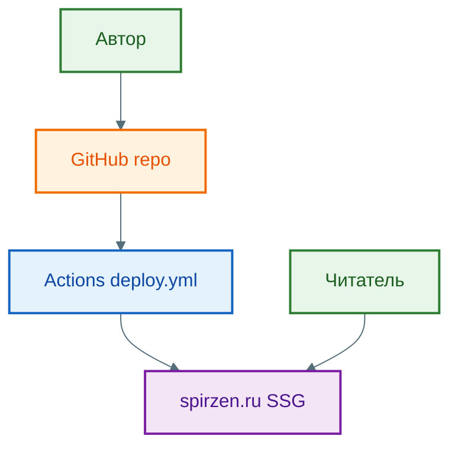

import WebAppArchitecturePlay from '@site/src/components/WebAppArchitecturePlay.jsx';

# Архитектура веб-приложений

<div class="article-tags">
  <span class="tag tag-required">ОБЯЗАТЕЛЬНО</span>
  <span class="tag tag-beginner">ДЛЯ НОВИЧКОВ</span>
</div>

<span class="complexity-badge">Всем</span>

---

## Веб-приложение

<WebAppArchitecturePlay />

Понятие *веб-приложение* часто употребляется в профессиональной среде как данность, однако его точное определение требует чёткого разграничения от смежных категорий — в первую очередь, от *веб-сайта*. Такое разграничение не является формальностью: оно отражает фундаментальные различия в архитектуре, поведении и целях использования. Чтобы понять, что именно делает программу *веб-приложением*, необходимо последовательно рассмотреть эволюцию веб-ресурсов — от статичных страниц к интерактивным системам.

Ранние сайты чаще были набором статических страниц:

- сервер отдавал готовый HTML;
- браузер показывал его;
- при переходе по ссылке загружался новый документ.

Сегодня многие крупные сервисы ведут себя как **веб-приложения** — с богатым интерфейсом, личным кабинетом, подгрузкой данных без полной перезагрузки. Но информационные сайты, документация, простые лендинги и часть корпоративных страниц по-прежнему ближе к классической модели "страница за страницей". Граница не жёсткая: у новостного портала может быть только лента с перезагрузкой, а у блога на WordPress — форма входа и AJAX-комментарии.

**Веб-приложение** похоже на программу на компьютере (редактор, почта, карты), но запускается в браузере без установки из магазина приложений — достаточно открыть URL.

В типичном SPA (single-page application) после первой загрузки сервер чаще отдаёт не новый HTML при каждом клике, а **данные** (JSON), а интерфейс обновляет JavaScript. Например, лента рекомендаций на YouTube подгружается при прокрутке; карты Google при движении запрашивают новые тайлы, не перезагружая всю страницу.

Сильные стороны такого подхода — плавная навигация, богатое взаимодействие (drag-and-drop, мгновенная обратная связь в формах). Цена — больший объём клиентского кода, сложнее разработка и тестирование. **Оффлайн** и установка "как приложение" возможны, но только если проект сознательно строят как **PWA** (Service Worker, manifest) — это не данность каждого сайта.

Частая схема в production:

- первая отдача — **готовый HTML с сервера** (SSR) для быстрого показа и SEO;
- затем подключается JavaScript и "оживляет" страницу (**гидратация**);
- дальше навигация идёт без полных перезагрузок (SPA).

Подробнее про MPA, SPA, SSR и SSG — в статье ["Архитектурные особенности современных веб-приложений"](/encyclopedia/2-system-network/2-04-kak-rabotayut-sayty-i-veb-sayty/114). Для SPA на VPS после сборки Vite/React нужен fallback `try_files … /index.html` на nginx — [готовые конфиги с разбором](/lab/Примеры/11112). Компоненты SPA (счётчик, списки, Router) — [галерея React (Lab)](/lab/Примеры/1146). Какие сетевые службы (DNS, HTTPS, БД, OAuth) участвуют в одном запросе — в [том же разделе](/encyclopedia/2-system-network/2-04-kak-rabotayut-sayty-i-veb-sayty/114#setevye-sluzhby-na-puti-zaprosa) и в [справочнике по ролям](/encyclopedia/2-system-network/2-03-set-i-internet/618#setevye-servisy-po-rolyam).

### Пример — сайт документации (SSG)

[spirzen.ru](https://spirzen.ru) и эта энциклопедия собраны как **статический сайт** (SSG на [Docusaurus](https://docusaurus.io/)): при `npm run build` из Markdown в `docs/` получают готовые HTML-страницы; в браузере подключается React-тема и отдельные интерактивные блоки, без постоянного backend API для контента. Это ближе к модели «сайт + гидратация», чем к классическому SPA вроде почты или соцсети.




Схема целиком — [О проекте → архитектура](/about/project#arhitektura-proekta).

---

### Пример — обновление списка без перезагрузки

```javascript
async function loadItems() {
  const response = await fetch('/api/items');
  if (!response.ok) throw new Error('Ошибка сети или сервера');
  const items = await response.json();
  const list = document.getElementById('item-list');
  list.replaceChildren(
    ...items.map((item) => {
      const li = document.createElement('li');
      li.textContent = item.title;
      return li;
    })
  );
}
```

Если JavaScript отключён, тот же сценарий можно реализовать обычной HTML-формой с `method="get"` и полной перезагрузкой — это принцип прогрессивного улучшения.

---

### Веб-сайт и веб-приложение

С исторической точки зрения, ранний Всемирный веб состоял из *статических веб-сайтов* — совокупностей HTML-файлов, расположенных на сервере и отдаваемых браузеру без какой-либо предварительной обработки. Пользователь открывал страницу, получал готовый контент и переходил по ссылкам, инициируя загрузку новых файлов. Такое поведение не отличалось от просмотра документов в локальной файловой системе, за исключением того, что файлы запрашивались через сеть.

Веб-сайт в широком смысле — это *информационный ресурс*, главная задача которого — представление сведений. Его содержание может изменяться, но изменения происходят *до* момента запроса со стороны пользователя: администратор или CMS-система генерирует новый HTML-файл, и только затем он становится доступен для скачивания. Примерами являются корпоративные сайты, лендинги, блоги на платформах вроде WordPress в режиме кэширования или статической генерации.

Веб-приложение же определяется *поведением*. Оно представляет собой *программную систему*, реализующую логику, принятие решений, хранение и обработку состояния — зачастую персонализированного. Пользователь не просто читает информацию, а *взаимодействует* с системой: отправляет данные, получает персональные результаты, изменяет внутреннее состояние приложения (например, создаёт запись в календаре или редактирует документ). Ключевой признак — **динамическое обновление интерфейса без полной перезагрузки страницы**, реализуемое средствами JavaScript и асинхронных сетевых запросов.

Граница между сайтом и приложением не всегда резка. Многие современные сайты содержат элементы приложений — формы авторизации, интерактивные карты, чаты. Однако системообразующим критерием остаётся *степень централизации логики*: если основная бизнес-логика, управление состоянием и обработка данных происходят на стороне клиента с постоянной синхронизацией со службами, — перед нами веб-приложение. Если же клиентская часть ограничена представлением, а вся логика сосредоточена на сервере, генерирующем HTML при каждом запросе, — это сайт, даже если он использует JavaScript для анимаций или валидации форм.

---

### Статический и динамический веб-сайт

Термины *статический* и *динамический* применяются к сайтам (и, по аналогии, к приложениям) в зависимости от того, *когда* и *кем* формируется конечный HTML, который получает браузер.

**Статический сайт** — это набор предварительно сгенерированных HTML-, CSS- и JS-файлов. Они создаются один раз (вручную или с помощью генераторов статических сайтов, таких как Gatsby, Hugo, Docusaurus), размещаются на веб-сервере (например, Nginx или CDN), и при каждом запросе отдаются "как есть", без изменения. Преимущества: высокая скорость отдачи, минимальные требования к серверу, безопасность (отсутствие исполняемой серверной логики), простота развёртывания (в том числе через [GitHub Pages](/lab/Кейсы/3)). Недостаток — невозможность персонализации и динамического содержания без привлечения внешних API.

**Динамический сайт** генерирует HTML *в момент запроса*. Сервер получает HTTP-запрос, запускает серверную программу (например, на PHP, Python, Node.js, Java), которая может:
- обратиться к базе данных;
- прочитать куки или заголовки авторизации;
- выполнить бизнес-логику;
- сформировать HTML на основе шаблонов и полученных данных;
- вернуть результат браузеру.

Такой подход позволяет отображать разный контент разным пользователям (например, личный кабинет), но требует более сложной инфраструктуры и несёт риски, связанные с производительностью и безопасностью. Параметры URL и полей форм часто попадают в SQL на сервере — при ошибке сборки запроса возможны [SQL-инъекции](/encyclopedia/8-infra-security/8-07-informatsionnaya-bezopasnost/123#sql-injection-tautology) (от `OR 1=1` до слепых boolean- и time-based атак). Динамический сайт *не обязательно* является веб-приложением: если после генерации HTML весь дальнейший контроль передаётся браузеру, а интерфейс остаётся "страничным" (переход по ссылкам = новая загрузка), — это сайт с динамическим контентом, но без интерактивной логики на стороне клиента.

---

### Клиент

В контексте веб-приложений термин **клиент** обозначает *среду выполнения*, которая инициирует запросы к серверу и обрабатывает полученные данные. В подавляющем большинстве случаев клиентом выступает **веб-браузер** — программное приложение (Chrome, Firefox, Safari и др.), реализующее стандарты HTML, CSS и JavaScript.

Браузер — это сложная платформа, объединяющая несколько независимых компонентов:
- **движок рендеринга** (например, Blink в Chrome, Gecko в Firefox), отвечающий за парсинг HTML и CSS, построение DOM- и CSSOM-деревьев, создание дерева отрисовки (render tree), компоновку (layout) и вывод пикселей на экран;
- **движок выполнения JavaScript** (например, V8 в Chrome и Node.js, SpiderMonkey в Firefox), компилирующий и исполняющий JS-код в изолированной песочнице (виртуальной машине);
- **механизмы хранения** (Cookies, LocalStorage, SessionStorage, IndexedDB), обеспечивающие сохранение состояния между сессиями;
- **сетевой стек**, управляющий HTTP(S)-запросами, кэшированием, соединениями по WebSocket и другими протоколами;
- **безопасностная модель**, реализующая политики CORS, CSP, SameSite, sandbox и др.

Важно понимать, что клиент в веб-приложении — это активный участник вычислений. Современные фронтенд-фреймворки (React, Angular, Vue) фактически превращают браузер в полноценную среду выполнения, где происходит управление состоянием приложения, маршрутизация, валидация данных, кэширование запросов и даже частичное выполнение бизнес-логики. Сервер при этом часто деградирует до роли *провайдера данных* (через API), а не генератора интерфейса.

---

### Консоль разработчика

Для разработки и диагностики веб-приложений незаменимым инструментом является **Консоль разработчика** (Developer Tools, сокращённо DevTools) — встроенная панель инструментов браузера, вызываемая нажатием клавиши `F12` или сочетанием `Ctrl+Shift+I` (`Cmd+Option+I` на macOS). Это целый набор модулей, каждый из которых отвечает за определённый аспект работы клиентской части.

DevTools — это основное окно, через которое разработчик получает доступ к внутренним структурам браузера. Её использование не ограничивается отладкой: она применяется для профилирования производительности, анализа сетевого трафика, инспекции безопасности, эмуляции устройств и даже аудита доступности. Ниже рассматривается назначение ключевых вкладок, с акцентом на их роль в понимании работы веб-приложения.

---

#### Elements  

Вкладка **Elements** отображает текущее состояние DOM-дерева — структурированное представление HTML-документа *после* выполнения всех скриптов и динамических изменений. Здесь можно:
- просматривать и временно редактировать HTML-элементы (внесённые изменения не сохраняются на сервере, но позволяют проверить гипотезы макета);
- исследовать применённые CSS-правила, отслеживать наследование и каскад, отключать стили для анализа;
- наблюдать за псевдоэлементами (`::before`, `::after`), состояниями (`:hover`, `:focus`);
- измерять размеры блоков, отступов, границ в реальном времени (Box Model);
- изменять атрибуты элементов (например, `disabled`, `checked`, `src`).

Эта вкладка демонстрирует фундаментальный принцип: DOM — это *живая модель*, отличная от исходного HTML. JS может создавать, удалять, перемещать узлы, а CSS может скрывать или визуально трансформировать их, не затрагивая разметку. Именно в Elements можно увидеть результат работы фронтенд-фреймворка — например, как React заменяет части дерева при обновлении состояния.

---

#### Console  

Вкладка **Console** выполняет три функции:
1. **Логирование ошибок и предупреждений** — браузер автоматически выводит сведения о синтаксических ошибках в JS, проблемах с CORS, ненайденных ресурсах, исключениях в коде;
2. **Интерактивное выполнение JavaScript** — любая команда, введённая в консоль, исполняется в контексте текущей вкладки. Можно вызывать функции, читать/менять переменные, исследовать глобальные объекты (`window`, `document`, `localStorage`);
3. **Просмотр логов приложения** — разработчики явно выводят информацию через `console.log()`, `console.warn()`, `console.error()` для отслеживания потока управления.

Console — первый индикатор работоспособности клиентской части. Пустая консоль без ошибок — необходимое (но не достаточное) условие корректной работы.

---

#### Sources  

Вкладка **Sources** предназначена для отладки JavaScript. Она отображает дерево загруженных скриптов (включая минифицированные и сгенерированные), позволяет:
- устанавливать точки останова (breakpoints) по строкам кода;
- исследовать стек вызовов;
- просматривать и изменять локальные и глобальные переменные во время паузы;
- выполнять шаговое выполнение (step into, step over);
- работать с source maps — отображать минифицированный JS в виде исходного кода (например, TypeScript → JS).

В среде веб-приложения, где значительная часть логики сосредоточена на клиенте, Sources становится основным инструментом для проверки корректности обработки событий, управления состоянием и работы с API.

---

#### Сеть  

Вкладка **Сеть** фиксирует *все* сетевые запросы, инициированные страницей: HTML, CSS, JS, изображения, шрифты, а также XHR/fetch-запросы к API. Для каждого запроса отображаются:
- HTTP-метод (GET, POST и др.);
- URL и параметры;
- заголовки запроса и ответа;
- тело запроса и ответа (в том числе JSON);
- статус-код (200, 404, 500 и т.д.);
- время загрузки (включая ожидание DNS, TCP-handshake, TLS, ожидание сервера, получение данных);
- инициатор (какой скрипт или элемент вызвал запрос).

Эта вкладка критически важна для понимания взаимодействия клиента и сервера. Например, при нажатии кнопки "Сохранить" в веб-приложении можно увидеть, какой именно POST-запрос отправляется, какие данные передаются, какой статус возвращает сервер — и, при необходимости, воспроизвести запрос вручную (через "Copy as cURL").

---

#### Performance и Application  
**Performance** позволяет записывать сессию взаимодействия с интерфейсом и анализировать временные затраты на этапы: синтаксический анализ (parsing), выполнение JS, перерисовку (repaint), перекомпоновку (reflow), композитинг. Это необходимо для выявления "тормозов" и оптимизации UX.

**Application** даёт доступ к клиентским механизмам хранения: Cookies, LocalStorage, SessionStorage, IndexedDB, кэш Service Worker. Здесь можно просматривать, редактировать и удалять сохранённые данные — что особенно полезно при отладке сессий, авторизации или офлайн-режимов.

---

## Архитектура и жизненный цикл веб-приложения

Понимание веб-приложения как единого целого невозможно без анализа его компонентной структуры и последовательности событий, происходящих при взаимодействии пользователя с системой. Веб-приложение — это распределённая система, где логика, данные и представление разнесены по разным средам исполнения, соединённые стандартными протоколами и интерфейсами. Его работа строится на строго упорядоченной цепи преобразований: от текста URL до отрисовки пикселей, от нажатия кнопки до сохранения записи в базе данных.

---

### Компоненты веб-приложения — фронтенд, бэкенд, база данных, API

Современное веб-приложение состоит из четырёх основных логических слоёв, каждый из которых имеет чёткую ответственность и границы взаимодействия.

**Фронтенд** (клиентская часть) — это программный код, исполняемый в браузере пользователя. Он включает:
- разметку (HTML), задающую структуру документа;
- стили (CSS), определяющие визуальное оформление и поведение при взаимодействии;
- логику (JavaScript), управляющую динамикой интерфейса, обработкой событий, валидацией, маршрутизацией и сетевыми запросами.

Фронтенд отвечает за *восприятие* приложения пользователем: от скорости первоначальной загрузки до плавности анимаций и мгновенности реакции на действия. Он не хранит основные данные и не принимает окончательных решений по безопасности — его роль сводится к представлению и промежуточной обработке. Однако именно фронтенд формирует ощущение "живости" системы: обновление списка задач без перезагрузки, мгновенная проверка доступности логина, drag-and-drop перемещение элементов — всё это реализуется на клиенте.

**Бэкенд** (серверная часть) — это программное обеспечение, размещённое на выделенном сервере или в облачной инфраструктуре, доступное по сетевому адресу. Его задачи:
- приём и аутентификация входящих запросов;
- выполнение бизнес-логики (расчёт итогов, применение правил, проверка условий);
- взаимодействие с системами хранения (базами данных, файловыми хранилищами, кэшами);
- формирование и отправка ответов в стандартизированном формате.

Бэкенд обеспечивает *консистентность* и *надёжность*: он гарантирует, что операции, необратимые или требующие контроля (платёж, удаление аккаунта, изменение прав доступа), выполняются корректно и атомарно. Архитектура бэкенда может варьироваться от монолита до микросервисов, но в любом случае он изолирован от прямого доступа клиента — взаимодействие строго опосредовано.

**База данных** — постоянное хранилище структурированной информации. В контексте веб-приложений это, как правило, реляционные (PostgreSQL, MySQL) или документо-ориентированные (MongoDB) СУБД, хотя возможны и другие варианты (графовые, временные, full-text). База данных обеспечивает:
- долговременное хранение с гарантиями целостности (ACID-транзакции);
- эффективный поиск и выборку по индексам;
- управление параллельным доступом;
- репликацию и резервное копирование.

Ключевое ограничение: база данных *никогда не доступна напрямую из браузера*. Весь доступ строго контролируется бэкендом, который выступает в роли шлюза, проверяющего права и валидирующего запросы. Прямое подключение клиента к СУБД — грубейшая архитектурная и Безопасность-ошибка.

**API** (Application Programming Interface) — это контракт между фронтендом и бэкендом. На практике это совокупность HTTP-эндпоинтов (URL-путей), каждый из которых реализует определённую операцию и ожидает данные в заданном формате (обычно JSON). API определяет:
- какие действия доступны (получить список, создать запись, обновить статус);
- какие параметры требуются (идентификатор, токен, тело запроса);
- какой формат ответа возвращается (успех/ошибка, данные, метаинформация);
- какие HTTP-коды используются для семантической индикации результата (200 OK, 201 Created, 400 Bad Request, 401 Unauthorized, 403 Forbidden, 404 Not Found, 500 Internal Error).

API — это принцип организации взаимодействия. Он позволяет фронтенду и бэкенду развиваться независимо: изменения в UI не требуют переписывания серверной логики, если контракт API сохраняется. REST (Representational State Transfer) — наиболее распространённый стиль проектирования API, однако существуют и другие (GraphQL, gRPC over HTTP/2, RPC-style).

Таким образом, веб-приложение — это *оркестровка* изолированных компонентов, каждый из которых отвечает за свою область ответственности, а их согласованная работа обеспечивается через стандартизированные интерфейсы и протоколы.

---

<span id="posledovatelnost-inicializacii"></span>

### Последовательность инициализации — от URL до интерактивного интерфейса

Чтобы проиллюстрировать взаимодействие компонентов, рассмотрим типичный сценарий — открытие веб-приложения в браузере. Возьмём в качестве примера URL `https://app.example.com/Задачи`. Сверху те же три фазы, что при любом переходе по ссылке — [резолв DNS, HTTPS-запрос, рендеринг](/encyclopedia/2-system-network/2-04-kak-rabotayut-sayty-i-veb-sayty/1#url-enter-to-page). Ниже — **семь** логических этапов с акцентом на веб-приложение.

**Этап 1. DNS-разрешение и установка соединения**  
Браузер извлекает доменное имя (`app.example.com`) из URL и обращается к DNS-серверу для получения IP-адреса сервера. После получения адреса устанавливается TCP-соединение (трёхэтапное рукопожатие), и при использовании HTTPS — дополнительно TLS-сессия (согласование шифров, проверка сертификата). Только после этого становится возможной передача HTTP-запроса.

**Этап 2. Запрос HTML-документа и его получение**  
Браузер формирует HTTP-запрос `GET /Задачи`, добавляя стандартные заголовки (`User-Agent`, `Accept`, `Accept-Language`, `Cookie`, если есть). Сервер получает запрос, маршрутизирует его (например, через веб-сервер Nginx к приложению на Node.js), которое, в свою очередь, может:
- проверить наличие сессии (по куки или заголовку `Authorization`);
- извлечь из базы данных список задач пользователя;
- применить шаблонизатор (например, Handlebars, Thymeleaf) для генерации HTML;
- вернуть ответ с кодом 200 и телом — разметкой страницы.

В случае SPA (Single-Page Application) сервер часто возвращает *один и тот же* HTML-файл (`index.html`) для всех маршрутов, а дальнейшая маршрутизация происходит на клиенте.

**Этап 3. Парсинг HTML и построение DOM-дерева**  
Браузер получает HTML и начинает его последовательную обработку. По мере чтения потока данных он строит **DOM-дерево** (Document Object Model) — объектное представление структуры документа. Каждый тег становится узлом (node), атрибуты — свойствами узлов, текстовое содержимое — текстовыми узлами. DOM — это не статическая копия HTML: это *живая структура*, которую JavaScript может изменять в любое время. API для поиска узлов, вставки элементов и подписки на события — в [Работа с HTML в JavaScript](/encyclopedia/5-languages/5-01-javascript/102.md) и [События](/encyclopedia/5-languages/5-01-javascript/23.md).

Парсинг прерывается при встрече тега `<script>`. Если скрипт не имеет атрибутов `async` или `defer`, браузер приостанавливает построение DOM, загружает и исполняет JS — это называется *блокирующим парсингом*. Современные приложения стараются минимизировать блокировки, используя асинхронную загрузку критических ресурсов.

**Этап 4. Загрузка и обработка CSS. Построение CSSOM**  
Параллельно с HTML браузер обнаруживает ссылки на таблицы стилей (`<link rel="stylesheet">`) и начинает их загрузку. CSS обрабатывается отдельно: из текстового файла строится **CSSOM** (CSS Object Model) — древовидная структура правил, где каждый узел содержит селектор, специфичность и набор деклараций. CSSOM необходим для последующего объединения с DOM.

Важно: CSS является *блокирующим ресурсом для рендеринга*. Браузер не отрисует видимый контент до тех пор, пока не построит полное CSSOM, даже если DOM уже готов. Это объясняет появление "FOUC" (Flash of Unstyled Content) при некорректной загрузке стилей.

**Этап 5. Формирование Render Tree, Layout и Paint**  
После построения DOM и CSSOM браузер объединяет их в **дерево отрисовки** (Render Tree). В него входят только видимые узлы (например, элементы со `display: none` исключаются). Для каждого узла Render Tree вычисляются окончательные CSS-свойства (с учётом наследования и каскада).

Затем запускается **Layout** (также называемый *Reflow*): браузер рассчитывает геометрию каждого элемента — координаты, размеры, позиционирование относительно родителей и окна. Это ресурсоёмкая операция, особенно при изменении размеров окна или динамическом добавлении элементов.

После Layout следует **Paint** (также *Rasterization*): браузер преобразует геометрические данные в пиксели — заполняет фоны, рисует границы, текст, тени. На этом этапе формируются "слои" (layers), которые затем передаются композитору.

**Этап 6. Выполнение JavaScript и инициализация приложения**  
Как только DOM становится доступен (событие `DOMContentLoaded`), запускается основной JavaScript-код приложения. Для SPA это означает:
- инициализацию фреймворка (React, Vue и др.);
- создание виртуального DOM или реактивных наблюдателей;
- настройку клиентской маршрутизации (например, через History API);
- выполнение первого запроса к API для получения данных (например, `GET /api/Задачи`);
- обработку ответа и рендер интерфейса на основе полученных данных.

Важно: JavaScript может *модифицировать* DOM и CSSOM в любой момент после их построения. Это приводит к повторным циклам Layout и Paint — например, при обновлении списка задач после получения данных с сервера.

**Этап 7. Установление интерактивности**  
После завершения инициализации приложение переходит в состояние *ожидания событий*. Пользовательский ввод (клик, ввод текста, прокрутка) генерирует события, которые перехватываются обработчиками (`event listeners`). Обработчики могут:
- изменять состояние приложения (например, помечать задачу как выполненную);
- инициировать асинхронные запросы к API (`fetch('/api/Задачи/123', &#123; method: 'PATCH', body: JSON.stringify(&#123; done: true &#125;) &#125;)`);
- обновлять DOM без перезагрузки страницы (например, через методы фреймворка или `element.textContent = …`).

Именно на этом этапе проявляется суть веб-приложения: *состояние сохраняется в памяти клиента*, а синхронизация с сервером происходит прозрачно для пользователя. Браузер не перезагружает страницу — он лишь отправляет данные и частично обновляет интерфейс.

---

### Роль JavaScript в трансформации сайта в приложение

Статический сайт и веб-приложение используют одни и те же технологии — HTML, CSS, HTTP. Различие вводится JavaScript качественно — через изменение *парадигмы управления состоянием*.

В традиционном сайте состояние хранится на сервере, и каждый запрос — это переход в новое состояние, выражаемое новым HTML-документом. В веб-приложении состояние *реплицируется* на клиент: браузер хранит текущий набор данных (например, список задач, фильтры, режим редактирования), и любое действие пользователя локально изменяет это состояние, после чего инициируется асинхронная синхронизация с сервером. Сервер при этом отвечает *данными* (обычно JSON), которые клиент использует для обновления своего внутреннего представления.

Такой подход позволяет добиться:
- мгновенной реакции на действия (нет ожидания загрузки страницы);
- оффлайн-работы (состояние сохраняется в IndexedDB, запросы ставятся в очередь);
- сложных интерфейсов (drag-and-drop, редакторы в реальном времени, анимации);
- повторного использования логики (один и тот же код управляет интерфейсом независимо от маршрута).

Однако он требует строгого контроля над синхронизацией, обработкой конфликтов и откатом операций — задачи, которые ранее решались автоматически за счёт перезагрузки страницы.

---

## Архитектурные модели, безопасность и эволюция веб-приложений

Определение веб-приложения как интерактивной программы, работающей в браузере, не исчерпывает его многообразия. На практике реализация может сильно различаться в зависимости от выбранной архитектурной модели, требований к безопасности, ограничений инфраструктуры и целевой аудитории. Понимание этих различий необходимо для проектирования, корректной диагностики, оценки рисков и выбора инструментов.

---

### Типы веб-приложений

Существует несколько устоявшихся моделей организации веб-приложений, каждая из которых отражает компромисс между сложностью, производительностью, SEO-дружелюбностью и UX-качеством.

**MPA (Multi-Page Application)** — классическая модель, унаследованная от статических сайтов. Каждое пользовательское действие, ведущее к изменению состояния (переход по ссылке, отправка формы), инициирует полную перезагрузку страницы. HTML генерируется на сервере, клиентская логика минимальна (валидация, анимации).  
Преимущества: простота реализации, естественная поддержка поисковой индексации, низкие требования к клиентскому устройству.  
Недостатки: задержки при навигации, дублирование общей разметки (шапка, меню), сложность поддержки сложного состояния (например, многошаговые формы с возвратом).  
MPA остаётся актуальной для контентных сайтов, корпоративных порталов, систем, где критична доступность при низкой скорости канала или устаревших браузерах.

**SPA (Single-Page Application)** — модель, в которой *вся клиентская логика и рендеринг сосредоточены в браузере*. Сервер отдаёт один HTML-файл (обычно `index.html`) и набор JS/CSS-ресурсов. После инициализации фронтенд берёт на себя маршрутизацию (через History API: `pushState`, `popstate`), управление состоянием и частичное обновление DOM. Данные запрашиваются и отправляются через API.  
Преимущества: мгновенная навигация, плавный UX, чёткое разделение зон ответственности (фронтенд — UI, бэкенд — данные), возможность offline-работы.  
Недостатки: увеличенный объём первоначальной загрузки, сложность SEO без дополнительных мер (требуется SSR/SSG), уязвимость к ошибкам в клиентском коде (ошибки JS могут полностью "сломать" приложение), зависимость от производительности устройства пользователя.  
SPA доминирует в корпоративных приложениях (CRM, ERP, таск-трекеры), редакторах, мессенджерах — там, где интерактивность и скорость реакции важнее, чем индексация контента.

**SSR (Server-Side Rendering)** — гибридный подход, при котором *HTML генерируется на сервере при каждом запросе*, как в MPA, но с использованием фронтенд-фреймворка (React, Vue, Angular). Сервер исполняет тот же JS-код, что и браузер, и возвращает полностью готовую HTML-страницу с встроенным состоянием. После загрузки клиентский JS "оживляет" страницу (процесс называется *hydration*), подключая обработчики событий и переходя в SPA-режим.  
Преимущества: быстрая отрисовка первого экрана, улучшенная SEO-индексация (поисковые роботы получают готовый HTML), доступность для пользователей с отключённым JS.  
Недостатки: повышенная нагрузка на сервер, увеличение времени TTFB (Time To First Byte), сложность синхронизации состояния между сервером и клиентом, риск несоответствия при гидратации (hydration mismatch).  
SSR применяется в медиа-ресурсах, интернет-магазинах, лендингах — там, где важны видимость в поиске и восприятие скорости.

**SSG (Static Site Generation)** — предварительная генерация HTML-файлов во время сборки. При каждом изменении контента (публикация статьи, обновление товара) запускается процесс, который запрашивает данные у API или CMS, рендерит все страницы во фронтенд-фреймворке и сохраняет результат как статические файлы. Эти файлы затем размещаются на CDN.  
Преимущества: максимальная скорость отдачи, минимальная нагрузка на сервер, высокая безопасность (нет исполняемого кода на сервере), идеальная SEO-оптимизация.  
Недостатки: невозможность персонализации без клиентского JS, задержка обновления контента (требуется повторная сборка), не подходит для данных, изменяющихся чаще, чем частота сборок.  
SSG широко используется в документации (включая Docusaurus), блогах, портфолио, landing-страницах. Практика публикации такого сайта из Git (ветка, Actions, домен) — [лабораторный кейс «Размещение своего сайта с GitHub Pages»](/lab/Кейсы/3).

**ISR (Incremental Static Regeneration)** — развитие SSG, введённое Netlify и Vercel. Позволяет *обновлять отдельные страницы в фоне*, после того как они уже отданы как статические. При первом запросе страница может отдаваться из кэша (старая версия), параллельно запускается регенерация; при следующем запросе — уже новая. Это сочетает преимущества статики (скорость, безопасность) с возможностью частичного обновления без полной пересборки.  
ISR особенно эффективен для крупных сайтов с редко меняющимся контентом (каталоги, справочники), где полная пересборка занимает значительное время.

Современные фреймворки (Next.js, Nuxt, Remix) позволяют применять разные стратегии *на уровне отдельных страниц*. Например, главная страница и статьи могут генерироваться статически (SSG), а личный кабинет — рендериться на сервере (SSR), а редактор документов — работать как SPA. Такой гибридный подход (иногда называемый **partial hydration** или **islands architecture**) становится стандартом для сложных проектов.

---

### Безопасность

Веб-приложение, по определению, размещается в открытом, ненадёжном окружении — сети Интернет. Это накладывает строгие требования на проектирование: *никакая часть клиентского кода не может быть доверенной*. Любой JavaScript, CSS или HTML, отправленный браузеру, может быть изменён пользователем. Следовательно, безопасность должна обеспечиваться на уровне сервера и протоколов.

**CORS (Cross-Origin Resource Sharing)** — механизм, регулирующий, какие внешние домены могут отправлять запросы к API. Браузер блокирует *предварительные* (preflight) запросы (`OPTIONS`), если сервер не указал в заголовках разрешение (`Access-Control-Allow-Origin`, `Access-Control-Allow-Methods`). CORS защищает *пользователя* от вредоносных сайтов, пытающихся использовать его авторизацию для доступа к другим сервисам. Он не защищает *сервер* — злоумышленник может отправить запрос напрямую, минуя браузер. Поэтому CORS должен дополняться серверной валидацией.

**CSRF (Cross-Site Request Forgery)** — атака, при которой вредоносный сайт заставляет браузер пользователя отправить *авторизованный* запрос к целевому приложению (например, перевод денег) без его ведома. Защита строится на нарушении автоматизма: сервер требует специальный токен (CSRF-token), который:
- генерируется при загрузке формы или страницы;
- передаётся в теле запроса (не в куках и не в заголовках по умолчанию);
- проверяется на соответствие сессии.

Современные SPA часто используют аутентификацию через Bearer-токены в заголовке `Authorization`, что делает CSRF менее актуальным (поскольку токен не хранится в куках и не отправляется автоматически), но не отменяет необходимости защиты для форм на SSR-страницах.

**XSS (Cross-Site Scripting)** — внедрение и исполнение произвольного JavaScript в контексте чужого сайта. Возникает при некорректной обработке пользовательского ввода: если данные, введённые пользователем А, отображаются пользователю Б без санитизации, А может внедрить вредоносный скрипт (например, ``).

По способу доставки выделяют три типа, которые важно различать при проектировании и ревью:

- **Reflected (отражённый)** — скрипт в URL или форме отражается в ответе; выполняется **сразу** у того, кто перешёл по вредоносной ссылке.
- **Stored (сохранённый)** — скрипт **лежит на сервере** (комментарий, профиль) и срабатывает у **каждого**, кто откроет страницу.
- **DOM-based** — уязвимость в клиентском коде (`innerHTML`, `location.hash`); серверный HTML может быть «чистым».

Подробная схема атак и чек-лист для ревью — в [Безопасность приложений](/encyclopedia/8-infra-security/8-07-informatsionnaya-bezopasnost/113#tri-tipa-xss).

Защита многоуровневая:
- **экранирование** (escaping) на стороне сервера при вставке данных в HTML (заменять `<` на `&lt;`);
- **Content Security Policy (CSP)** — HTTP-заголовок, ограничивающий источники выполнения скриптов, стилей, изображений (`script-src 'self'` запрещает inline-скрипты и внешние домены);
- отказ от `innerHTML` и `dangerouslySetInnerHTML` в пользу безопасных методов (`textContent`, JSX-транспиляция).

**Аутентификация и сессии** — критически важный элемент. Современные приложения избегают хранения сессий в обычных куках без флагов:
- `HttpOnly` — запрещает доступ к куке из JavaScript (защита от XSS);
- `Secure` — передача только по HTTPS;
- `SameSite=Strict` или `Lax` — предотвращение отправки куки в кросс-сайтовых запросах (частичная защита от CSRF).

Альтернативой являются JWT (JSON Web Tokens), передаваемые в заголовке `Authorization: Bearer <token>`. Они не зависят от кук, но требуют дополнительных мер: короткий срок жизни, хранение в `HttpOnly` куке всё равно (для защиты от XSS), механизм отзыва (через блэклист на сервере).

Важный принцип: *все проверки прав доступа (авторизация) должны выполняться на сервере при каждом запросе*. Даже если фронтенд "скрывает" кнопку удаления для неавторизованного пользователя, сервер обязан проверить роль при попытке вызова `DELETE /api/resource/123`.

---

<span id="proizvoditelnost"></span>

### Производительность

Производительность веб-приложения измеряется конкретными этапами жизненного цикла открытия страницы. **TTFB** показывает, как быстро сервер начинает отвечать; **FCP** — когда пользователь впервые видит контент на экране; **DOM Content Loaded** — когда готов DOM без ожидания всех картинок. Сводка из девяти базовых метрик (Load Time, число запросов, вес страницы, RTT, блокирующие ресурсы и др.) — в отдельной статье [«Метрики производительности веб-страницы»](/encyclopedia/2-system-network/2-04-kak-rabotayut-sayty-i-veb-sayty/130).

Ключевые показатели для SEO и полевых данных (Core Web Vitals) определены Google и отражают субъективное восприятие пользователя:

- **LCP (Largest Contentful Paint)** — время до отрисовки самого крупного видимого элемента (изображение, заголовок). Зависит от TTFB, размера HTML, скорости загрузки ресурсов, блокировок CSS/JS. Оптимизация: SSR/SSG, оптимизация изображений, приоритизация критических ресурсов.

- **FID (First Input Delay)** / **INP (Interaction to Next Paint)** — задержка между взаимодействием (клик, ввод) и следующей отрисовкой интерфейса. Высокое значение указывает на долгие задачи в основном потоке. Снижают объём JS на старте ([code splitting](#code-splitting), [динамические импорты](#dynamic-imports)), выносят тяжёлые вычисления в [Web Workers](/encyclopedia/2-system-network/2-03-set-i-internet/617#optimizatsiya-proizvoditelnosti), оптимизируют рендер фреймворка (`React.memo`, мемоизация колбэков).

- **CLS (Cumulative Layout Shift)** — совокупный сдвиг макета: внезапное перемещение элементов при загрузке (из-за отсутствующих размеров изображений, динамической вставки баннеров). Оптимизация: указание `width`/`height` у изображений, резервирование места под рекламу, избегание вставки контента сверху.

<span id="frontend-performance"></span>

### Оптимизация загрузки и рендеринга на клиенте

Современный фронтенд редко отдаёт один монолитный `app.js` на несколько мегабайт. Сборщики (Webpack, Vite, Rollup, esbuild) и соглашения платформы позволяют **сначала** отдать то, что нужно для первого экрана и первого клика, а остальное подтянуть позже. Это укорачивает критический путь отрисовки, уменьшает объём данных по сети и улучшает **LCP** и **INP**.

Ниже — восемь взаимосвязанных приёмов (по смыслу близки к обзорным схемам вроде *Frontend Performance Cheatsheet*). Их можно комбинировать: например, code splitting без сжатия на CDN даст меньший эффект, чем связка «меньший initial chunk + Brotli + prefetch следующей страницы».

#### Селективный рендеринг и зона первого экрана

**Above the fold** — всё, что пользователь видит без прокрутки. Имеет смысл в первую очередь отрисовать и стилизовать эту зону: критический CSS, герой-блок, навигация. Контент «ниже сгиба» можно отложить — ленивые изображения (`loading="lazy"`), виртуализация длинных списков, отложенный рендер тяжёлых виджетов до появления в viewport (`IntersectionObserver`).

В SSR/SSG сервер уже отдаёт HTML первого экрана; в SPA без SSR первый paint часто пустой, пока не выполнится весь entry-бандл — отсюда популярность гибридов (Next.js, Nuxt, Remix). Подробнее про метрику первого экрана — в [справочнике метрик](/encyclopedia/2-system-network/2-04-kak-rabotayut-sayty-i-veb-sayty/130#time-to-above-the-fold-load).

#### Порядок загрузки и критический путь

Браузер строит DOM, применяет CSS, выполняет JS. Разумная **последовательность** для классической страницы:

1. **HTML** — каркас и семантика;
2. **CSS** — чтобы не было «вспышки» нестилизованного текста;
3. **JavaScript** — поведение, желательно без блокировки парсинга (`defer`, `async` или скрипты в конце `<body>`).

**Critical Rendering Path** — минимизация ресурсов, которые задерживают первую отрисовку: инлайн критических стилей, отказ от синхронного JS в `<head>`, перенос некритичного CSS. Список блокирующих ресурсов смотрят в DevTools → Network и в статье [«Метрики производительности веб-страницы»](/encyclopedia/2-system-network/2-04-kak-rabotayut-sayty-i-veb-sayty/130#render-blocking-resources).

#### Приоритетная загрузка

Браузер и разработчик могут **поднять приоритет** нужных файлов раньше, чем очередь «сама» до них дойдёт:

| Механизм | Назначение |
|----------|------------|
| `rel="preload"` | Критичный шрифт, hero-изображение, ключевой чанк |
| `rel="modulepreload"` | ES-модуль, нужный сразу после HTML |
| `fetchpriority="high"` на `` | Крупный элемент для **LCP** |
| `rel="prefetch"` | Ресурс для *вероятного* следующего шага (низкий приоритет) |
| `rel="preconnect"` / `dns-prefetch` | Раннее соединение с CDN или API |

На HTTP/2 и HTTP/3 мультиплексирование снимает часть боли HTTP/1.1, но приоритеты всё равно влияют на то, что пользователь увидит в первые сотни миллисекунд.

<span id="code-splitting"></span>

#### Code splitting — разбиение бандла

**Code splitting** делит один большой JavaScript-бандл (условно `app.js` на 5 MB) на **чанки** по маршрутам или зонам приложения (`home.js`, `catalog.js`, `settings.js`). Пользователь при первом заходе скачивает только entry и чанк текущей страницы, а не весь продукт целиком. Типичное сокращение initial payload — **50–80 %** по сравнению с монолитом.

Сборщик создаёт чанки на этапе `build`; маршрутизатор фреймворка (React Router, Vue Router) подгружает чанк при переходе. В React то же выражается через `React.lazy` и `<Suspense>`.

<span id="dynamic-imports"></span>

#### Динамические импорты

**Dynamic import** — синтаксис `import('./module.js')`, возвращающий `Promise` с модулем. Это **механизм** отложенной загрузки; **code splitting** — **стратегия**, как разрезать приложение на чанки (часто как раз через `import()`).

Типичные сценарии:

- открыли модальное окно «выбор даты» — подгрузили `picker.js`;
- пользователь перешёл в админку — подтянули чанк маршрута;
- на лендинге нет редактора — его бандл не попадает в первую загрузку.

```javascript
// Чанк создаётся сборщиком при статическом анализе import()
const openPicker = async () => {
  const { DatePicker } = await import('./DatePicker.js');
  mount(DatePicker);
};

// React — обёртка над тем же import()
const AdminPanel = React.lazy(() => import('./AdminPanel'));
```

Справочник по `import()` в языке — [справочник JavaScript, модули](/encyclopedia/5-languages/5-01-javascript/122). На этом сайте динамический импорт используется для интерактивных демо в MDX — [ленивая загрузка демо](/encyclopedia/5-languages/5-01-javascript/27#lazy-demo-mdx).

#### Tree shaking — удаление мёртвого кода

**Tree shaking** на этапе сборки отбрасывает экспорты, которые **нигде не импортируются** (ветки «мёртвого кода» в графе зависимостей). Импорт `import &#123; format &#125; from 'huge-lib'` вместо `import hugeLib from 'huge-lib'` позволяет bundler'у выкинуть остальные функции библиотеки, если они не используются.

Работает надёжнее с **ES-модулями** (`import`/`export`) и помеченным side-effect-free в `package.json` (`"sideEffects": false`). Для CommonJS (`require`) вырезание слабее. Tree shaking уменьшает размер чанков и косвенно помогает **INP** (меньше парсинга и компиляции JS на старте).

#### Prefetch и предзагрузка страниц

**Prefetch** — браузер заранее скачивает ресурс с низким приоритетом, чтобы при реальном переходе отдать его из **HTTP-кэша** или memory cache. Пример для SPA:

```html
<link rel="prefetch" href="/assets/about-[hash].js" as="script">
```

Цепочка: предсказали следующий маршрут → сохранили чанк в кэше → при клике навигация почти без сетевой задержки. Для документов целиком используют также `rel="prerender"` (реже) и логику фреймворков (Next.js `<Link prefetch>`). Не стоит prefetch'ить всё подряд — растёт расход трафика у пользователей, которые никуда не перейдут.

#### Сжатие при передаче

Перед отправкой по сети текстовые ресурсы (HTML, CSS, JS, JSON, SVG) сжимают на сервере или CDN:

- **gzip** — повсеместная поддержка;
- **Brotli** — обычно на 15–25 % меньше gzip для JS и CSS при включении на origin.

Сжатие не заменяет уменьшение бандла, но умножает эффект code splitting и tree shaking. Проверка — заголовок `Content-Encoding: br` или `gzip` в Network. См. также [оптимизацию передачи данных](/encyclopedia/2-system-network/2-04-kak-rabotayut-sayty-i-veb-sayty/114) в контексте архитектуры веб-приложений.

<div class="callout callout--info">
  <div class="callout-title">Как приёмы бьют по метрикам</div>

  <div class="callout-body">
  <ul>
  <li><strong>LCP</strong> — меньший initial JS, приоритет hero-изображения, SSR/SSG, сжатие, быстрый TTFB.</li>
  <li><strong>INP</strong> — меньше работы в main thread на старте и после клика (чанки по требованию, Workers, лёгкая гидратация).</li>
  <li><strong>CLS</strong> — размеры медиа заранее, без вставки баннеров поверх уже отрисованного контента.</li>
  </ul>
  </div>
</div>

#### Гидратация в SSR и SSG

В SSR/SSG приложениях **гидратация** (подключение обработчиков к уже отрисованному HTML) всего дерева сразу может надолго занять основной поток. Обходят это так:

- *progressive hydration* — подключение компонентов по мере появления в viewport;
- *selective hydration* — в первую очередь кнопки, поля ввода, интерактив;
- *resumability* (Qwik) — сериализация состояния рендера, чтобы клиент продолжил без полной переинициализации.

#### Кэширование на клиенте и в HTTP

Повторные визиты ускоряют заголовки **`Cache-Control`**, **`ETag`**, **`Last-Modified`** и **Service Worker** с Cache API. Стратегия `stale-while-revalidate` отдаёт закэшированный `index.html` мгновенно и обновляет копию в фоне. Подробнее — в разделе про [сетевую загрузку и Fetch](/encyclopedia/2-system-network/2-04-kak-rabotayut-sayty-i-veb-sayty/114).

---

{/* http-basics-link  */}
<div class="callout callout--tip">
  <div class="callout-title">Основа по протоколу</div>

  <div class="callout-body">
  Базовый разбор HTTP и HTTPS находится в отдельной статье — [HTTP как основа веб-интеграций](/encyclopedia/2-system-network/2-09-osnovy-integratsionnogo-vzaimodeystviya/118).
</div>
  </div>


---

## Практика — вкладки и закладки в реальной работе

### Рабочий сценарий "исследование темы"

1. Создайте группу вкладок под тему.
2. По мере чтения сохраняйте только ценные страницы в отдельную папку закладок.
3. В конце сессии закройте "шумовые" вкладки и оставьте 5-10 ключевых.

---

### Что ускоряет работу

- Единые префиксы папок: "Учеба", "Работа", "Личное".
- Горячие клавиши: быстрое открытие новой вкладки, восстановление закрытой, переход по вкладкам.
- Регулярная чистка закладок раз в 2-4 недели.

---

### См. также

- [Метрики производительности веб-страницы](/encyclopedia/2-system-network/2-04-kak-rabotayut-sayty-i-veb-sayty/130) — TTFB, FCP, Page Size, Core Web Vitals
- [Chrome DevTools и оптимизация](/encyclopedia/2-system-network/2-03-set-i-internet/617#optimizatsiya-proizvoditelnosti) — lazy load, Workers, примеры в консоли
- [Адресная строка браузера](/encyclopedia/2-system-network/2-04-kak-rabotayut-sayty-i-veb-sayty/11)
- [Дизайн веб-интерфейсов](/encyclopedia/2-system-network/2-04-kak-rabotayut-sayty-i-veb-sayty/2)
- [SEO-оптимизация](/encyclopedia/2-system-network/2-04-kak-rabotayut-sayty-i-veb-sayty/118)

