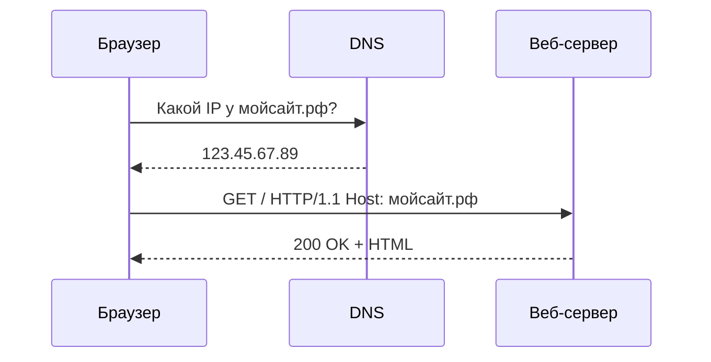

import HttpRequestAnalyzer from '@site/src/components/HttpRequestAnalyzer';
import WebAppArchitecturePlay from '@site/src/components/WebAppArchitecturePlay';
import CdnCacheEmulatorPlay from '@site/src/components/CdnCacheEmulatorPlay';

# Веб-серверы

<div class="article-tags">
  <span class="tag tag-required">ОБЯЗАТЕЛЬНО</span>
  <span class="tag tag-beginner">ДЛЯ НОВИЧКОВ</span>
</div>

<span class="complexity-badge">Всем</span>

---

## Веб-серверы

<HttpRequestAnalyzer />

<WebAppArchitecturePlay />

<CdnCacheEmulatorPlay />

Если **клиент** — это браузер пользователя, то **сервер** — удалённая машина (или группа машин) в дата-центре, доступная по сети.

**Веб-сервер** — первый пункт в [напоминалке по шести типам серверов](/encyclopedia/2-system-network/2-03-set-i-internet/1#tipy-serverov): клиент шлёт HTTP-запрос через интернет, сервер возвращает HTTP-ответ. Это *программа* на машине (Nginx, Apache, IIS, Caddy), а не сам компьютер целиком. Она принимает HTTP-запросы и отвечает на них — по аналогии с кладовщиком и диспетчером на входе:

- слушает порт (80 для HTTP, 443 для HTTPS);
- разбирает запрос: какой путь, какой метод, какой домен (`Host`);
- отдаёт файл с диска **или** передаёт запрос дальше — в PHP, Node.js, Java-приложение;
- возвращает ответ со статус-кодом и телом.

Если на IP ничего не слушает нужный порт, браузер покажет сетевую ошибку (например, "не удалось подключиться") — до HTTP-ответа дело не дойдёт. Такие случаи разбираются в ["Обработка внутренних ошибок браузера"](/encyclopedia/2-system-network/2-04-kak-rabotayut-sayty-i-veb-sayty/1112).

Есть три главных веб-сервера:
- Nginx (энджинкс) - быстрый, простой, используется Google, Netflix, Яндекс;
- Apache (апач) - старый, надёжный, во многих хостингах;
- IIS (ай-ай-эс) - только для Windows, для корпоративных .NET-сайтов, например, в банках.

> **Справочники:** конфигурация и CLI — [Nginx](/encyclopedia/8-infra-security/8-04-devops-ci-cd/3112), [Apache HTTP Server](/encyclopedia/8-infra-security/8-04-devops-ci-cd/3125).

Веб-сервер запускается на целевом сервере, и слушает порт 80 для HTTP и 443 для HTTPS.

У сервера есть конфигурация (файлы с настройками). Там написано:
- какие домены обслуживаются;
- где лежат файлы;
- что делать с разными адресами.

Один сервер может держать множество сайтов на одном IP (это виртуальные хосты). Также он может разбрасывать запросы по разным компьютерам (называется балансировка нагрузки), может принимать запрос, а внутри решать, что отдавать, может запускать другие приложения, кэшировать в память популярные страницы, и даже регулировать число запросов одновременно.

Балансировка, кэш на edge, CDN и лимиты запросов — часть одного набора приёмов масштабирования; кратко по каждому пункту — в [12 концепций распределённой архитектуры](/encyclopedia/7-project/7-06-proektirovanie-i-arhitektura/141).

Когда говорят "сервер упал", причин может быть несколько: перегрузка веб-сервера, недоступность базы данных, ошибка в прикладном коде, сбой хостинга или **DDoS-атака** — массовые запросы с [ботнета](/glossary/Б#ботнет), направленные на исчерпание ресурсов ([как устроена DDoS](/encyclopedia/2-system-network/2-08-osnovy-informatsionnoy-bezopasnosti/117)).

`localhost` - это ваш собственный компьютер. Когда запускаете веб-сервер на своём ПК и открываете `http://localhost:3000` это как стучаться к себе в карман. Для этого не нужен доступ к интернету, а сервер работает на IP-адресе `127.0.0.1`. Никто извне не залезет. Можете тестировать что угодно, хоть 100 сайтов на разных портах (3001, 3002).

Типичные порты для `localhost`:
- `localhost:3000` — React / Node.js / Vite
- `localhost:5000` — ASP.NET Core / Flask
- `localhost:8080` — старый добрый Tomcat или тестовый Nginx
- `localhost:8000` — PHP-шники через php -S

Домен вроде `google.com` — удобное имя для людей; **DNS** переводит его в IP. **Веб-сервер** принимает запрос уже по IP и порту и решает, какой сайт и файл отдать.



Вы купили, к примеру, домен `мойсайт.рф`. В настройках DNS указали, что он ведёт на IP `123.45.67.89`. Это будет адрес вашей машины, где лежит веб-сервер Nginx, в конфигурации которого написано:
```
server {
    listen 80;
    server_name мойсайт.рф www.мойсайт.рф;
    root /var/www/мойсайт;
}
```


Сайт или веб-приложение технически представляет собой совокупность файлов — HTML, CSS, JavaScript, изображений, шрифтов, а также серверного кода (на C#, Python, Java, Node.js и др.), конфигурационных файлов, метаданных и, зачастую, данных в базах. Однако наличие этих файлов само по себе не делает их доступными для пользователей. Чтобы пользовательский браузер мог отобразить страницу, необходимо **обеспечить выполнение трёх базовых условий**:

1. **Локализация** — файлы должны быть размещены в определённом месте, откуда их можно извлекать.
2. **Обслуживание** — должен существовать механизм, способный принимать входящие запросы по протоколам HTTP/HTTPS и отдавать запрашиваемый контент или запускать серверную логику.
3. **Доступность** — должен быть обеспечен сетевой маршрут от клиента (браузера) к машине, где размещены файлы и выполняется код.

Именно веб-сервер выступает в роли центрального компонента, реализующего эти три условия. Это полноценная инфраструктурная система, обеспечивающая взаимодействие между клиентом, приложением и ресурсами.

В повседневной практике термин *"веб-сервер"* употребляется в двух смыслах:

- **Программный веб-сервер** — приложение, реализующее серверную часть протокола HTTP (например, Nginx, Apache HTTP Server, IIS, Caddy).
- **Аппаратный (или виртуальный) веб-сервер** — вычислительный узел (физический сервер, виртуальная машина, контейнер), на котором выполняется программный веб-сервер и, как правило, развёрнуто приложение.

Далее мы рассматриваем оба аспекта, но основное внимание уделяем программной реализации и её функциональным возможностям.

---

### Что такое веб-сервер

Веб-сервер — это программное обеспечение, реализующее серверную сторону протокола передачи гипертекста (HTTP) и, как правило, протокола HTTPS. Его основная задача — обрабатывать входящие клиентские запросы, извлекать или генерировать соответствующий контент и возвращать его в виде HTTP-ответа.

При этом веб-сервер не является пассивным хранилищем файлов. Современные серверы обладают развитой функциональностью:

- **Статическая отдача контента**: чтение и передача файлов с диска — HTML, CSS, JS, изображения, PDF и пр.
- **Обработка динамического контента**: передача запроса внешнему приложению (через CGI, FastCGI, модули или проксирование), получение от него сгенерированного ответа и его возврат клиенту.
- **Маршрутизация запросов**: выбор обработчика в зависимости от пути URL, заголовков, метода (GET, POST и др.).
- **Управление соединениями**: поддержка keep-alive, таймаутов, ограничений на количество одновременных подключений.
- **Обеспечение безопасности**: применение TLS/SSL, контроль доступа по IP, ограничение частоты запросов, защита от базовых атак (например, через rate limiting).
- **Логирование**: запись сведений о запросах, ответах, ошибках — для анализа, аудита и отладки.
- **Кэширование**: временное хранение часто запрашиваемых ресурсов в оперативной памяти или на диске для ускорения ответа.
- **Балансировка нагрузки и проксирование**: перенаправление запросов на другие серверы или процессы, что особенно важно в распределённых системах.

Ключевая особенность архитектуры веб-серверов — **асинхронность и масштабируемость**. Сервер должен уметь одновременно обслуживать сотни, тысячи, а в случае крупных платформ — миллионы клиентов. Для этого используются модели событийного цикла (event loop), потоки (threads), процессы (fork), а также оптимизированные сетевые стеки (например, epoll в Linux). Разные серверы выбирают разные стратегии: Apache по умолчанию использует многопроцессную или гибридную модель (prefork/mworker), тогда как Nginx опирается на асинхронный неблокирующий I/O с использованием одного процесса на ядро.

---

### Виды веб-серверов

Веб-серверы можно классифицировать по нескольким критериям. Наиболее практически значимыми являются:

---

#### 1. По типу контента
- **Статические веб-серверы** — ограничиваются чтением файлов с диска и их передачей. Пример: базовая конфигурация Nginx для отдачи SPA после сборки.
- **Динамические веб-серверы** — делегируют генерацию контента внешним приложениям. При этом сам сервер может не содержать интерпретатора языка (например, Nginx не исполняет PHP сам — он проксирует запрос в PHP-FPM).
- **Встроенные серверы приложений** — сервер и приложение тесно интегрированы. Пример: Tomcat (для Java Servlet/JSP), IIS с ASP.NET Core In-Process Hosting, или встроенный сервер Kestrel (хотя Kestrel редко используется напрямую в production без обратного прокси).

---

#### 2. По архитектуре обработки запросов
- **Многопроцессные** (например, Apache в режиме `prefork`) — каждый запрос обрабатывается отдельным процессом. Преимущество: изоляция сбоев; недостаток: высокое потребление памяти.
- **Многопоточные** (Apache в режиме `worker`) — запросы распределяются между потоками внутри процессов. Более экономичны по памяти, но требуют аккуратной работы с разделяемыми ресурсами.
- **Асинхронные, событийно-ориентированные** (Nginx, Caddy, Node.js HTTP server) — один поток (или один поток на ядро) обрабатывает множество соединений через цикл событий. Очень эффективны при большом числе одновременных подключений, особенно если большая часть трафика — "лёгкие" запросы (статика, API).

---

#### 3. По уровню интеграции с ОС и экосистемой
- **Кроссплатформенные**: Nginx, Apache, Caddy — работают под Linux, Windows, BSD.
- **Платформо-специфичные**: Microsoft IIS — встроен в Windows Server (и доступен на Windows 10/11 Professional/Enterprise для разработки), тесно интегрирован с .NET, Active Directory, PowerShell.
- **Специализированные серверы приложений**: Apache Tomcat, Jetty, WildFly — не являются полноценными веб-серверами в классическом смысле: они фокусируются на исполнении Java-приложений и часто размещаются *за* обратным прокси (Nginx/Apache), который берёт на себя TLS, сжатие, кэширование.

---

#### 4. По назначению в архитектуре
- **Frontend-серверы (Edge servers)** — принимают запросы от клиентов, обеспечивают TLS termination, сжатие, кэширование, защиту от DDoS, маршрутизацию. Примеры: Nginx, HAProxy, Cloudflare Workers (логически аналогичны).
- **Backend-серверы** — непосредственно исполняют бизнес-логику приложения. Часто скрыты за frontend-слоем.
- **Локальные/разработческие серверы** — XAMPP, WAMP, `python -m http.server`, `dotnet watch`, `npm run dev`. Ориентированы на удобство, а не на безопасность или производительность. Как поднять и не закрыть терминал — [Запуск и перезапуск приложений](/encyclopedia/1-basics/1-12-sovety-dlya-novichka/13).

Каждый тип имеет свои области применения. Например, Nginx почти не используется "в одиночку" для запуска Python-приложений через CGI — это неэффективно. Вместо этого он проксирует запросы в Gunicorn или Uvicorn. IIS редко развёртывают на Linux, даже в контейнерах, поскольку лицензирование и интеграция с экосистемой Windows делают это нецелесообразным.

---

### Как работает веб-сервер

Для понимания работы веб-сервера полезно проследить путь типичного HTTP-запроса от клиента до ответа. Рассмотрим упрощённую, но технически корректную последовательность:

1. **Установка TCP-соединения**  
   Браузер разрешает доменное имя в IP-адрес (через DNS), устанавливает TCP-соединение с указанным портом (обычно 80 для HTTP, 443 для HTTPS). При использовании HTTPS сразу следует TLS handshake.

2. **Приём HTTP-заголовков**  
   Сервер получает запрос: метод (GET, POST), URI (например, `/api/users`), HTTP-версия, заголовки (Host, User-Agent, Accept, Cookie и др.). Важнейший заголовок — `Host`, который позволяет одному серверу обслуживать множество доменов (виртуальные хосты).

3. **Маршрутизация и выбор виртуального хоста**  
   Сервер сопоставляет значение заголовка `Host` и путь URI со списком настроенных сайтов (в Nginx — `server`-блоки, в Apache — `VirtualHost`, в IIS — "привязки сайта"). Если совпадение не найдено, возвращается ошибка 404 или 400.

4. **Применение конфигурации**  
   Для выбранного виртуального хоста загружаются настройки: корневая директория (`root`), правила перезаписи (rewrites), обработчики, ограничения, заголовки ответа и пр.

5. **Определение типа ответа**  
   По расширению файла (`.html`, `.jpg`) или по пути (например, `/api/` → проксирование) сервер решает:
   - отдать файл с диска;
   - запустить скрипт через FastCGI (PHP);
   - проксировать запрос в другой процесс (Node.js, .NET, Java);
   - сгенерировать ответ самостоятельно (например, 301-редирект или 403 Forbidden).

6. **Выполнение действия**  
   - При статической отдаче: файл читается (часто с использованием `sendfile()` в Linux для zero-copy), применяется сжатие (gzip/Brotli), добавляются заголовки (`Content-Type`, `Cache-Control`), и данные отправляются в сокет.
   - При динамической обработке: создаётся подключение к upstream-процессу (через Unix-сокет или TCP), передаётся запрос, ожидается ответ, который затем возвращается клиенту (возможно, с модификацией заголовков).

7. **Логирование и завершение**  
   После отправки ответа информация о запросе (статус, время, размер, IP клиента) записывается в access-лог. В случае ошибки — в error-лог. Соединение закрывается или остаётся открытым (keep-alive).

Этот процесс занимает от долей миллисекунды до сотен миллисекунд. Критически важно, что сервер не "ждёт" окончания обработки одного запроса перед приёмом следующего — даже в однопоточной модели (Nginx) за счёт неблокирующего ввода-вывода обеспечивается высокая пропускная способность.

---

### Что такое "падение веб-сервера"

Термин *"упал сервер"* в разговорной речи часто используется как универсальное объяснение недоступности сайта. Однако технически "падение" — это лишь один из возможных сценариев, и далеко не самый частый. Более корректно говорить о **нарушении доступности сервиса**, которое может возникать на разных уровнях стека.

---

#### 1. Программные сбои веб-сервера  

Веб-сервер — обычное ПО. Он может аварийно завершиться по разным причинам:
- **Ошибка в конфигурации**: синтаксическая ошибка в файле `nginx.conf`, некорректный путь к SSL-сертификату, зацикленное перенаправление. При перезагрузке конфигурации сервер может отказаться стартовать.
- **Утечка ресурсов**: например, исчерпание лимита открытых файловых дескрипторов, особенно при частом открытии/закрытии соединений без reuse.
- **Конфликт версий**: обновление библиотек (например, OpenSSL) без пересборки/перезапуска сервера может привести к несовместимости.
- **Ошибки в модулях**: сторонний модуль Nginx или расширение Apache может содержать баг, вызывающий segmentation fault.

Такие сбои обычно фиксируются в error-логах. Сервер перестаёт принимать соединения — клиенты получают `ERR_CONNECTION_REFUSED` или таймаут.

---

#### 2. Перегрузка ресурсов  

Даже при корректной работе сервер может перестать отвечать из-за нехватки ресурсов:
- **Память (RAM)**: исчерпание оперативной памяти приводит к срабатыванию OOM-killer (в Linux), который принудительно завершает процессы — в том числе веб-сервер или его воркеры.
- **Процессор**: 100 % загрузка CPU из-за бесконечного цикла в приложении или атаки (например, медленный HTTP-запрос — *Slowloris*).
- **Диск**: заполнение раздела (особенно `/var/log`) может блокировать запись логов, что в некоторых конфигурациях приводит к остановке приёма запросов.
- **Сетевые лимиты**: исчерпание лимита соединений (`net.core.somaxconn`), файловых дескрипторов (`ulimit -n`), или лимитов файрвола.

В таких случаях сервер *формально работает*, но не может обработать новый запрос — клиенты сталкиваются с `502 Bad Gateway`, `503 Service Unavailable` или таймаутами.

---

#### 3. Сбои в зависимостях  

Веб-сервер редко работает в изоляции. Часто он зависит от:
- **Базы данных**: если PostgreSQL не отвечает, приложение зависает, воркеры сервера исчерпываются, и новые запросы ставятся в очередь или отклоняются.
- **Upstream-сервисов**: в микросервисной архитектуре отказ одного сервиса может привести к каскадному падению.
- **Файловых систем**: монтирование NFS/SMB при недоступности хранилища может повесить процесс чтения.

При этом сам веб-сервер может оставаться в состоянии *running*, но возвращать `502` (если проксирует) или зависать.

---

#### 4. Проблемы инфраструктуры  
- **Сетевые сбои**: обрыв канала, неправильная маршрутизация, DDoS-атака, перегрузка маршрутизатора.
- **Аппаратные отказы**: выход из строя диска, памяти, блока питания.
- **Облачные инциденты**: сбой виртуальной машины в облаке (например, AWS EC2 instance termination), сбой в балансировщике нагрузки (ALB/NLB).

---

#### 5. Человеческий фактор  
- **Некорректное обновление**: развёртывание новой версии с критическим багом.
- **Ошибка в CI/CD-пайплайне**: деплой с неправильной конфигурацией окружения.
- **Случайное удаление**: `rm -rf /var/www` вместо `rm -rf ./build`.

> **Важно**: абсолютное большинство "падений" — результат накопления технического долга, отсутствия мониторинга и процедур аварийного реагирования. Профессиональная эксплуатация подразумевает не предотвращение *всех* сбоев (это невозможно), а минимизацию их *влияния* (через резервирование, автомасштабирование, health-checks, graceful degradation).

---

### Как обновляют приложения и сайты

Обновление веб-приложения — процесс замены текущей версии кода, конфигурации или данных на новую без (или с минимальным) нарушением доступности. Это одна из ключевых операций в жизненном цикле сайта.

---

#### Основные подходы

1. **Прямое обновление (in-place deployment)**  
   Самый простой, но рискованный способ: остановка сервера/приложения, замена файлов, запуск заново.  
   *Недостатки*: downtime, невозможность отката без резервной копии.  
   *Применяется*: в разработке, на тестовых стендах, для некритичных локальных приложений.

2. **Blue-Green Deployment**  
   Поддерживается две идентичные среды: *blue* (текущая) и *green* (новая). Трафик переключается с blue на green атомарно — через изменение DNS или настройки балансировщика.  
   *Преимущества*: нулевой downtime, мгновенный откат (просто переключить обратно).  
   *Требования*: дублирование инфраструктуры, синхронизация данных (если состояние внешнее — БД, кэш, файлы).

3. **Canary-релиз**  
   Новая версия разворачивается параллельно с текущей и получает лишь часть трафика (например, 5 %). При отсутствии ошибок доля увеличивается постепенно.  
   *Преимущества*: минимизация риска, раннее выявление проблем.  
   *Используется*: в высоконагруженных системах (Google, Netflix).

4. **Rolling Update**  
   Экземпляры приложения обновляются поочерёдно: один выключается, обновляется, включается, затем следующий. Обеспечивается непрерывность обслуживания за счёт избыточности.  
   *Применяется*: в Kubernetes, Docker Swarm, в кластерах виртуальных машин.

5. **Recreate + Health Check**  
   Балансировщик выводит экземпляр из пула, дожидается завершения активных запросов (drain), запускает новую версию, проверяет её здоровье (health check), и только затем возвращает в пул.

---

#### Роль веб-сервера в обновлении

Веб-сервер может участвовать в процессе несколькими способами:
- **Перезагрузка конфигурации без downtime** (`nginx -s reload`): запускается новый мастер-процесс, дочерние процессы старой версии завершаются после обработки текущих запросов (graceful shutdown).
- **Проксирование на разные upstream’ы**: при blue-green/canary Nginx или HAProxy могут направлять запросы на разные группы серверов в зависимости от заголовков, кук или весов.
- **Кэширование версий**: сервер может кэшировать статические ассеты (CSS/JS) по хэшу, что позволяет избежать "битых" ресурсов при частичном обновлении.

Ключевой принцип: **никакое обновление не должно требовать ручного вмешательства в продакшене в рабочее время**. Весь процесс должен быть автоматизирован через CI/CD (GitLab CI, GitHub Actions, Jenkins), с проверками перед развёртыванием (тесты, lint, vulnerability scan) и после (smoke-тесты, мониторинг метрик).

---

### Веб-сервер и хостинг

Хостинг — это услуга по размещению веб-ресурсов на инфраструктуре провайдера. В зависимости от уровня абстракции и контроля, выделяют несколько моделей.

---

#### 1. Общедоступный (shared) хостинг  

Множество сайтов размещаются на одном сервере, разделённые на уровне виртуальных хостов. Пользователь получает:
- FTP/SFTP-доступ к своей директории;
- панель управления (cPanel, Plesk);
- ограниченные ресурсы (CPU time, RAM, трафик);
- общие настройки веб-сервера (нельзя менять `nginx.conf` глобально).

**Плюсы**: низкая стоимость, простота.  
**Минусы**: "шумные соседи" могут замедлить сайт; ограничения по ПО (например, нет SSH, нельзя установить custom-модуль).

---

#### 2. Виртуальный частный сервер (VPS)  

Выделяется виртуальная машина с гарантированными ресурсами (vCPU, RAM, диск). Пользователь получает root-доступ и полный контроль:
- установка и настройка любого веб-сервера;
- настройка файрвола, мониторинга, резервных копий;
- размещение нескольких сайтов с разными стеками.

**Плюсы**: гибкость, изоляция от других клиентов.  
**Минусы**: требуется административная экспертиза; ответственность за безопасность и обновления лежит на пользователе.

---

#### 3. Выделенный сервер (dedicated server)**  

Физический сервер в распоряжении одного клиента. Используется для высоконагруженных проектов, требований к производительности (низкая задержка, SSD RAID) или специфичных лицензий (например, Windows Server + SQL Server).

---

#### 4. Облачный хостинг (IaaS/PaaS)**  
- **IaaS (Infrastructure as a Service)**: AWS EC2, Yandex Compute Cloud, Google Compute Engine. Аналог VPS, но с автомасштабированием, API, интеграцией с другими сервисами (S3, RDS).
- **PaaS (Platform as a Service)**: Heroku, Google App Engine, Azure App Service. Пользователь загружает код, платформа берёт на себя веб-сервер, балансировку, масштабирование. Нет прямого доступа к ОС.

---

#### 5. Serverless и edge-хостинг  
- **Serverless Functions (AWS Lambda, Cloudflare Workers)**: код выполняется по запросу, без управления сервером. Веб-сервер логически заменяется триггером HTTP.
- **Edge-хостинг (Vercel, Netlify)**: статические сайты и SSR-приложения размещаются в CDN-узлах по всему миру. Веб-сервер работает на границе сети провайдера.

Выбор модели определяется балансом между **контролем**, **стоимостью** и **трудозатратами**. Для образовательных и личных проектов часто достаточно shared-хостинга или недорогого VPS. Для коммерческих систем — предпочтителен облачный IaaS с автоматизацией.

---

### Веб-сервер и домен

Доменное имя (например, `example.com`) — это человекочитаемый идентификатор, который должен быть сопоставлен с IP-адресом сервера. Этот процесс включает несколько этапов.

---

#### 1. Регистрация домена  

Через регистратора (Reg.ru, GoDaddy) приобретается право на использование имени в зоне (`.ru`, `.com`). Важно: **регистрация ≠ хостинг**. Можно купить домен у одного провайдера и разместить сайт у другого.

---

#### 2. Настройка DNS  

В панели управления регистратора или DNS-хостинга (Cloudflare, Yandex DNS) задаются **записи ресурсов (RR)**:
- `A`-запись: `example.com → 93.184.216.34` (IPv4);
- `AAAA`-запись: для IPv6;
- `CNAME`: псевдоним (`www.example.com → example.com`);
- `MX`: почтовые серверы домена (куда MTA доставляет письма на `@example.com`);
- `TXT`: подтверждение прав, SPF/DKIM/DMARC для почты (подробнее — [«Электронная почта»](/encyclopedia/1-basics/1-22-kommunikatsiya-i-obschenie/3#mx-zapisi), [email-рассылка как распределённая система](/encyclopedia/7-project/7-06-proektirovanie-i-arhitektura/144#auth-dmarc), [почта в справочнике портов](/encyclopedia/2-system-network/2-03-set-i-internet/618#pochta)).

DNS-запросы кэшируются на всех уровнях (браузер, ОС, провайдер, корневые серверы), поэтому изменения вступают в силу не мгновенно — до 24–48 часов (TTL).

---

#### 3. Настройка веб-сервера

Сервер должен знать, какой сайт отдавать при запросе к `example.com`, а какой — к `another-site.com`, даже если они физически на одном IP. Для этого используются **виртуальные хосты**:
- В **Nginx**: блок `server { listen 80; server_name example.com www.example.com; ... }`
- В **Apache**: `<VirtualHost *:80> ServerName example.com ... </VirtualHost>`
- В **IIS**: "привязки сайта" — указание домена и порта.

Заголовок `Host` в HTTP-запросе позволяет серверу выбрать нужный блок конфигурации.

---

#### 4. SSL/TLS и HTTPS  

Для шифрования трафика требуется SSL-сертификат, выпущенный для домена. Современные серверы поддерживают:
- **Let’s Encrypt**: бесплатные автоматически обновляемые сертификаты (через Certbot, acme.sh).
- **Wildcard-сертификаты**: `*.example.com`.
- **SNI (Server Name Indication)**: позволяет использовать разные сертификаты на одном IP-адресе (требуется поддержка клиентом, есть у всех современных браузеров).

Конфигурация HTTPS включает:
- указание путей к `fullchain.pem` и `privkey.pem`;
- настройку шифров (рекомендуется использовать современные: `TLS_AES_256_GCM_SHA384`);
- редирект с HTTP на HTTPS (301);
- заголовки безопасности (`Strict-Transport-Security`, `Content-Security-Policy`).

Корректная настройка домена и SSL — критична для SEO и доверия пользователей.

---

### Веб-сервер локальный

Локальный веб-сервер — это экземпляр программного обеспечения, запущенный на персональном компьютере разработчика. Его основная цель — воспроизвести в контролируемой среде поведение production-инфраструктуры, чтобы проверить корректность работы кода *до* развёртывания на реальном хостинге.

Это принципиально отличается от простого открытия HTML-файла через `file://`. Протокол `file` не поддерживает:
- HTTP-методы (POST, PUT, DELETE);
- запросы к API (из-за CORS и отсутствия сервера на другой стороне);
- работу с куками, сессиями, заголовками;
- маршрутизацию на основе URL (history API в SPA требует поддержки fallback-страницы);
- выполнение серверного кода (PHP, ASP.NET, Node.js).

Поэтому даже при разработке клиентского приложения необходим локальный сервер.

---

#### Особенности локального развёртывания

- **Изоляция**: локальный сервер работает только на машине разработчика. По умолчанию он слушает `127.0.0.1` (loopback-интерфейс), что делает его недоступным извне — даже в локальной сети. Это повышает безопасность при тестировании.
- **Гибкость конфигурации**: можно экспериментировать с настройками, не боясь нарушить работу продакшена.
- **Интеграция с инструментами разработки**: сервер может автоматически перезагружаться при изменении кода (`dotnet watch`, `nodemon`, `webpack-dev-server`), предоставлять source maps, вести подробное логирование.

---

#### Распространённые решения для локальной разработки

| Решение       | Состав | Типичное применение | Особенности |
|---------------|--------|---------------------|-------------|
| **XAMPP / WAMP / MAMP** | Apache, MySQL/MariaDB, PHP, Perl | PHP/LAMP-проекты | Графическая панель управления (xampp-control), простота установки, "всё в одном". Не рекомендуется для production. |
| **IIS Express** | Упрощённая версия IIS | ASP.NET Web Forms, MVC, Web API | Интеграция с Visual Studio, поддержка всех IIS-модулей. Автоматически выделяет порт (например, `localhost:5000`). |
| **Kestrel + `dotnet run`** | Встроенный сервер .NET | ASP.NET Core | Лёгкий, кроссплатформенный. В production *обязательно* размещается за обратным прокси (Nginx/IIS). |
| **Node.js dev-server** (`vite`, `next dev`, `ng serve`) | Express/Hapi/Koa под капотом | SPA, SSR (React, Vue, Angular, Next.js, Nuxt) | Поддержка hot module replacement (HMR), proxy API-запросов на backend, мгновенная сборка. |
| **Docker-контейнеры** | Любые стеки через `docker-compose.yml` | Микросервисы, полное воспроизведение окружения | Гарантирует идентичность dev/stage/prod. Требует понимания Docker. |

Важно: локальный сервер должен по возможности **максимально приближать** production-окружение. Это включает:
- ту же ОС (например, разработка на Windows, а продакшен — на Ubuntu → используйте WSL2 или Docker);
- те же версии ПО (Node.js 20.x, Python 3.11);
- аналогичную структуру путей и права доступа;
- использование тех же переменных окружения и файлов конфигурации (с заменой секретов).

Пренебрежение этим ведёт к феномену *"работает у меня, но не на сервере"* — одного из самых частых источников задержек при сдаче проектов.

---

### `localhost` — адрес локальной машины и его техническая природа

`localhost` — это стандартное доменное имя, зарезервированное для ссылки на текущую машину. Оно разрешается в IP-адреса:
- `127.0.0.1` — IPv4 loopback-адрес;
- `::1` — IPv6 loopback-адрес.

Эти адреса не покидают хост: сетевой стек операционной системы перехватывает пакеты, адресованные на `127.0.0.0/8`, и направляет их обратно в себя — без участия сетевого адаптера. Это позволяет:
- тестировать сетевые приложения без подключения к интернету;
- изолировать трафик от внешнего мира;
- избежать задержек, связанных с физической сетью.

---

#### Порт как идентификатор приложения

Одна машина может одновременно запускать десятки веб-приложений. Чтобы избежать конфликта, каждое из них слушает **отдельный TCP-порт**:
- HTTP по умолчанию — порт `80`;
- HTTPS — `443`;
- разработка: `3000`, `5000`, `8080`, `8000` и др.

При обращении к `http://localhost:3000` браузер устанавливает TCP-соединение с процессом, слушающим `127.0.0.1:3000`. Если на этом порту ничего не слушает — ошибка `ERR_CONNECTION_REFUSED`.

---

#### Виртуальные хосты на localhost

Для тестирования нескольких сайтов на одной машине используются:
- Разные порты: `http://localhost:3000`, `http://localhost:3001`;
- Или редактирование локального `hosts`-файла (`C:\Windows\System32\drivers\etc\hosts` / `/etc/hosts`), чтобы сопоставить домены с `127.0.0.1`:
```
  127.0.0.1 site1.local
  127.0.0.1 site2.local
```
  Затем настраивается виртуальный хост в Nginx/Apache/IIS для `site1.local`, и сайт открывается по `http://site1.local`, минуя DNS.

Это особенно полезно для проверки:
- мультидоменных сценариев (например, админка на `admin.site.local`);
- корректности работы с куками (привязанными к домену);
- SSL-сертификатов (можно выпустить self-signed для `*.local`).

---

### Администратор отвечает за сервер

Веб-сервер — не автономный "чёрный ящик". Его стабильная и безопасная работа требует чёткого распределения обязанностей. В зависимости от масштаба проекта и организационной структуры, эти функции могут быть разделены или совмещены.

---

#### 1. Системный администратор (SysAdmin)
**Отвечает за хостовую инфраструктуру**:
- установку и обновление ОС (ядро, пакеты безопасности);
- настройку сетевых интерфейсов, файрвола (iptables/nftables, Windows Firewall);
- мониторинг ресурсов (CPU, RAM, диск, сеть) — через [Zabbix](/encyclopedia/2-system-network/2-06-sistemnoe-administrirovanie/zabbix-praktikum/intro), Prometheus, Grafana;
- управление пользователями и правами доступа (SSH-ключи, sudoers);
- резервное копирование и восстановление;
- физическую/виртуальную инфраструктуру (если bare metal или VPS).

**Не отвечает за**: содержимое сайтов, логику приложений, SQL-запросы.

---

#### 2. DevOps-инженер / SRE (Site Reliability Engineer)
**Отвечает за конвейер доставки и эксплуатацию приложений**:
- автоматизацию развёртывания (Ansible, Terraform, Kubernetes);
- настройку и оптимизацию веб-сервера (Nginx/Apache/IIS) под load profile;
- конфигурацию CI/CD;
- обеспечение отказоустойчивости (health checks, retry, circuit breakers);
- централизованный сбор и анализ логов (ELK, Loki);
- настройку TLS, CDN, WAF.

**Граница с SysAdmin**: DevOps управляет *конфигурацией* сервера, SysAdmin — его *состоянием*.

---

#### 3. Веб-разработчик
**Отвечает за прикладной уровень**:
- корректность HTTP-интерфейсов (REST, GraphQL);
- безопасную обработку входных данных (защита от XSS, SQLi);
- кэширование на уровне приложения (`Cache-Control`, ETag);
- генерацию корректных заголовков (`Content-Security-Policy`, `X-Content-Type-Options`);
- совместимость с веб-сервером (например, поддержка chunked transfer encoding, gzip).

**Обязан знать**, как его код взаимодействует с веб-сервером (например, как Nginx буферизует ответы, как IIS обрабатывает ошибки 5xx), но **не обязан** настраивать сам сервер — если только не работает в небольшой команде или на фрилансе.

---

#### 4. Технический писатель / документатор

В контексте проектов типа *"Вселенная IT"* — отвечает за:
- описание архитектурных решений;
- инструкции по установке и диагностике;
- выявление уязвимых мест в настройке (например, "никогда не используйте `proxy_pass http://backend;` без `resolver` в динамических upstream’ах");
- визуализацию потоков данных (диаграммы запросов, схемы развёртывания).

Эта роль особенно важна для снижения порога входа и предотвращения типовых ошибок.

> **Ключевой принцип профессиональной эксплуатации**: каждое изменение в конфигурации должно быть **идемпотентным**, **версионируемым** (хранится в Git), **тестируемым** (staging-среда) и **откатываемым**. Ручные изменения на продакшене — признак технического долга.

---

{/* http-basics-link  */}
<div class="callout callout--tip">
  <div class="callout-title">Основа по протоколу</div>

  <div class="callout-body">
  Базовый разбор HTTP и HTTPS находится в отдельной статье — [HTTP как основа веб-интеграций](/encyclopedia/2-system-network/2-09-osnovy-integratsionnogo-vzaimodeystviya/118).
</div>
  </div>


---

## Практика эксплуатации веб-серверов

### Мини-чеклист перед релизом

- Конфиг проходит проверку синтаксиса.
- Включен HTTPS и редирект с HTTP.
- Настроены `Cache-Control` для статики.
- Логи пишутся в отдельный ротационный файл.
- Есть health-check URL для мониторинга.

---

### Типичные ошибки в продакшене

- Смешение ролей: веб-сервер и приложение настраиваются как один слой.
- Изменения конфигурации вручную "на горячую", без версионирования.
- Отсутствие лимитов на запросы и таймауты.

---

### См. также

- [Обработка внутренних ошибок браузера](/encyclopedia/2-system-network/2-04-kak-rabotayut-sayty-i-veb-sayty/1112)
- [Архитектурные особенности современных веб-приложений](/encyclopedia/2-system-network/2-04-kak-rabotayut-sayty-i-veb-sayty/114)

