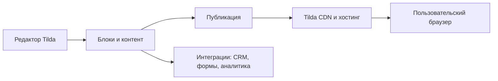

# Справочник по Tilda

СПРАВОЧНИК

---

## Назначение

Практический справочник по Tilda для запуска и сопровождения сайта без классической backend-разработки. Базовая статья про конструкторы и сравнение с WordPress находится в [Конструкторах сайтов](/encyclopedia/2-system-network/2-04-kak-rabotayut-sayty-i-veb-sayty/113).

---

## Что такое Tilda

**Tilda** — облачный конструктор сайтов (SaaS), где страница собирается из готовых блоков через визуальный редактор. Платформа закрывает инфраструктуру публикации, CDN, базовый SSL и часть маркетинговых задач.

Типовые сценарии:

- лендинги и промостраницы;
- сайты услуг и портфолио;
- простые интернет-магазины;
- контентные страницы и лонгриды;
- MVP-страницы для проверки гипотез.

---

## Официальные ресурсы

- [tilda.cc](https://tilda.cc/) — главная платформа.
- [help-ru.tilda.cc](https://help-ru.tilda.cc/) — русскоязычный справочный центр.
- [tilda.cc/ru/features](https://tilda.cc/ru/features/) — обзор функциональности.
- [tilda.cc/ru/pricing](https://tilda.cc/ru/pricing/) — тарифы и ограничения.
- [help-ru.tilda.cc/zero](https://help-ru.tilda.cc/zero) — документация по Zero Block.
- [help-ru.tilda.cc/domain](https://help-ru.tilda.cc/domain) — домены и DNS.

---

## Как устроен сайт на Tilda

Платформа хранит проект в своем облаке, генерирует публичную версию страницы и отдает ее через инфраструктуру Tilda.

---

## Основные сущности платформы

| Сущность | Роль |
|---|---|
| Проект | контейнер сайта с настройками |
| Страница | отдельный URL внутри проекта |
| Блок | модуль интерфейса: текст, форма, карточки, меню |
| Zero Block | кастомный визуальный редактор уровня дизайнерской верстки |
| Форма | сбор данных в CRM и внешние системы |
| Настройки сайта | домен, SEO, аналитика, интеграции |

---

## Блоковая модель

Tilda использует библиотеку готовых блоков. Подход ускоряет запуск и удерживает визуальную консистентность.

### Типы блоков

- обложки и hero-секции;
- текстовые и контентные блоки;
- галереи и мультимедиа;
- формы и квизы;
- товарные блоки для магазина;
- меню, footer, сервисные блоки.

### Когда переходить в Zero Block

- нужен полностью кастомный дизайн;
- требуется сложная анимация;
- стандартных отступов и сетки недостаточно;
- проект требует точной адаптации под дизайн-систему.

---

## Zero Block

Zero Block — профессиональный редактор внутри Tilda для ручного контроля композиции, анимаций и адаптивных состояний.

Ключевые особенности:

- работа по сетке и контейнерам;
- ручное позиционирование элементов;
- анимации, включая пошаговые сценарии;
- импорт макетов и тонкая настройка мобайл-версии;
- горячие клавиши для ускорения верстки.

Практическое ограничение: сложные zero-макеты повышают цену поддержки и требуют более аккуратного QA на разных экранах.

---

## Контент, формы и CRM

Tilda поддерживает формы и встроенный CRM-поток для обработки лидов.

| Компонент | Что дает |
|---|---|
| Формы | сбор заявок, подписок, анкет |
| Tilda CRM | карточки заявок, статусы, базовая воронка |
| Уведомления | отправка в почту и внешние сервисы |
| Интеграции | передача в внешние CRM и automation-платформы |

В production лучше фиксировать контракт формы: структура полей, обязательность, источник трафика, ожидаемый формат данных в приемнике.

---

## Интернет-магазин на Tilda

Tilda подходит для малого и среднего каталога, где важен быстрый запуск.

Базовые возможности:

- карточки товаров;
- корзина и оформление заказа;
- подключение платежных систем;
- уведомления и обработка заказов;
- базовые промомеханики.

Если проекту нужна сложная логистика, многостадийный checkout или глубокая ERP-интеграция, обычно подключают внешний backend или переходят на более кастомную платформу.

---

## SEO и аналитика

По документации Tilda, платформа закрывает базовую SEO-обвязку:

- title, description, заголовки;
- alt у изображений;
- sitemap и robots;
- управление индексацией;
- подключение аналитики.

Практика команды:

1. Настроить мета-данные на уровне страниц.
2. Проверить канонические URL и дубли.
3. Подключить веб-аналитику и цели до запуска рекламы.
4. Перепроверить превью и микроразметку в соцсетях.

---

## Домен, DNS и публикация

Через Tilda можно подключить внешний домен или зарегистрировать домен через сервис платформы.

Ключевые моменты из справки:

- проверяйте DNS-записи и время распространения;
- HTTPS настраивается в связке с доменом;
- при изменении NS часть записей нужно восстановить;
- для критичных проектов храните runbook по доменным настройкам.

---

## Тарифы и эксплуатационные ограничения

Tilda использует модель Free, Personal и Business (детали зависят от актуального прайсинга и региона).

Типовые различия:

- число сайтов и страниц;
- доступность экспорта кода;
- глубина интеграций;
- лимиты по проектам и бизнес-функциям.

Перед масштабированием проверяйте лимиты тарифа и стоимость владения при росте трафика и числа редакторов.

---

## Экспорт, API и переносимость

Tilda предоставляет инструменты экспорта и API в старших сценариях использования.

Что важно учитывать:

- экспорт может зависеть от тарифа;
- часть функциональности привязана к платформенным сервисам;
- миграция на другой стек требует аудита блоков, форм и интеграций;
- для снижения vendor lock-in сохраняйте контент и карту URL.

---

## Сильные стороны и ограничения

| Сторона | Что получаем |
|---|---|
| Скорость запуска | быстрый выпуск маркетинговых страниц |
| Порог входа | работа без программирования |
| Визуальная консистентность | единый дизайн через блоки |
| Ограничения кастома | потолок для сложной бизнес-логики |
| Зависимость от платформы | риски по миграции и тарифам |

---

## Tilda и WordPress

| Критерий | Tilda | WordPress |
|---|---|---|
| Модель | SaaS-конструктор | self-hosted CMS |
| Запуск | очень быстрый | быстрый, но с хостингом и настройкой |
| Кастомный backend | ограничен платформой | гибкий через плагины и код |
| Инфраструктурный контроль | ниже | выше |
| Миграция | сложнее при глубокой платформенной привязке | проще при контроле файлов и БД |

Подробный справочник по WordPress — [здесь](/encyclopedia/5-languages/5-07-php/146).

---

## Практический чек-лист запуска

1. Соберите структуру страниц и цели каждой страницы.
2. Протестируйте мобильную версию и скорость.
3. Настройте формы, CRM и обязательные поля.
4. Подключите аналитику и события конверсии.
5. Привяжите домен, проверьте HTTPS и индексацию.
6. Подготовьте процесс правок и публикаций в команде.

---

## Частые проблемы

| Симптом | Что проверить |
|---|---|
| Не видны изменения после публикации | повторная публикация, кэш браузера, доменные настройки |
| Форма не отправляет лиды | интеграция приемника, обязательные поля, лимиты сервиса |
| Падение конверсии на мобильных | адаптация блоков, перегруженная анимация, читаемость CTA |
| Ошибки после смены домена | DNS, HTTPS, редиректы, SEO-настройки |

---

## Связанные материалы

- [Конструкторы сайтов](/encyclopedia/2-system-network/2-04-kak-rabotayut-sayty-i-veb-sayty/113)
- [Итоги раздела](/encyclopedia/2-system-network/2-04-kak-rabotayut-sayty-i-veb-sayty/998)
- [Чек-лист самопроверки](/encyclopedia/2-system-network/2-04-kak-rabotayut-sayty-i-veb-sayty/999)
- [Low-code и No-code платформы](/encyclopedia/8-infra-security/8-02-low-code-no-code/1)

---
