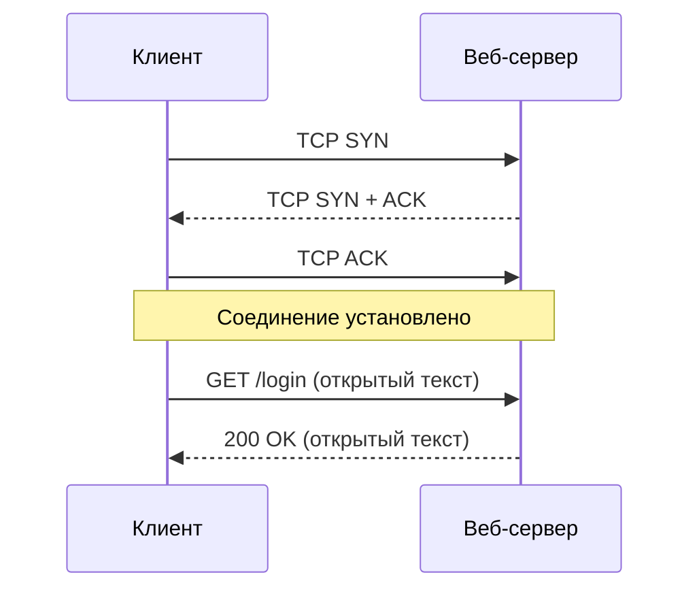
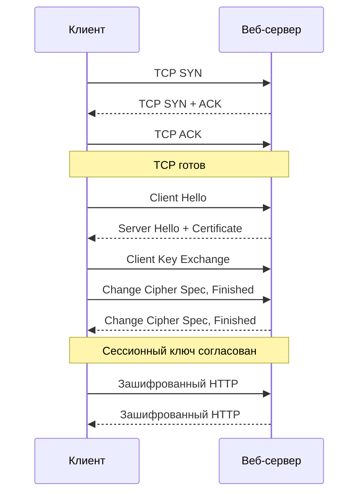

# HTTPS и TLS — шифрование веба

  ОБЯЗАТЕЛЬНО
  ДЛЯ НОВИЧКОВ

Всем

---

## HTTP и HTTPS

**HTTP** передаёт запросы и ответы в **открытом виде** на уровне приложения: кто подслушивает Wi‑Fi или магистраль, может прочитать URL, заголовки и тело (если нет дополнительного шифрования).

**HTTPS** — тот же HTTP, но внутри защищённого канала **TLS** (раньше говорили SSL). В адресной строке — `https://` и значок **замка** ([11](./11)).

Карточка — [глоссарий: HTTPS](/glossary/H#https). Культурный контекст — [Неолурк: HTTPS](https://neolurk.org/wiki/HTTPS), мост с форумами — [125](./125).

## Установление соединения

И HTTP, и HTTPS начинаются одинаково: браузер узнаёт IP по DNS и открывает **TCP**-канал. Дальше пути расходятся.

### Общий старт — TCP

Трёхэтапное рукопожатие одинаково для обоих протоколов:

| Шаг | Направление | Сообщение |
|-----|-------------|-----------|
| 1 | Клиент → сервер | `SYN` |
| 2 | Сервер → клиент | `SYN` + `ACK` |
| 3 | Клиент → сервер | `ACK` |

После третьего пакета TCP-соединение готово. Подробнее про транспортный уровень — в [Сеть и интернет / 4](/encyclopedia/2-system-network/2-03-set-i-internet/4).

### HTTP после TCP (порт 80)

Поверх готового TCP клиент сразу отправляет **текстовый** HTTP-запрос. Заголовки и тело (логин, пароль, cookie) идут **в открытом виде** — узел на пути Wi‑Fi, провайдера или корпоративного прокси может их прочитать.

До первого байта страницы меньше раундов обмена, чем у HTTPS, но канал **без шифрования**. В открытой сети пароль из формы `POST /login` читается как обычный текст.

### HTTPS после TCP (порт 443 и TLS)

HTTPS — тот же HTTP, но только **внутри** туннеля **TLS**. В разговорах часто говорят «SSL», хотя в продакшене работают **TLS 1.2** и **TLS 1.3** (SSL устарел).

После TCP идут этапы TLS. Ниже — схема, близкая к **TLS 1.2**; в TLS 1.3 часть шагов объединена, но идея та же: сначала доверие и обмен секретом, затем быстрое симметричное шифрование.

| Этап | Содержание |
|------|------------|
| **1. TCP** | трёхэтапное рукопожатие (как выше) |
| **2. Сертификат** | `Client Hello` → `Server Hello` → сервер присылает **сертификат** с публичным ключом; браузер сверяет домен и цепочку до доверенного CA |
| **3. Ключи** | клиент передаёт **pre-master secret**, зашифрованный публичным ключом сервера; стороны выводят **сессионный ключ** и сообщают `Change Cipher Spec` / `Finished` |
| **4. Данные** | HTTP-запросы и ответы (`GET`, `POST`, `200 OK`, HTML, cookie) идут уже в зашифрованном виде |

### Гибридное шифрование

TLS сочетает два механизма:

- **Асимметричное** шифрование (публичный ключ в сертификате, приватный на сервере) — на старте сессии, чтобы безопасно передать секрет и проверить сервер.
- **Симметричное** (**сессионный ключ**, AES, ChaCha20) — для основного потока: симметрия быстрее, чем шифровать каждый пакет парой RSA/ECDH.

Перехватчик на магистрали видит только зашифрованные блоки. Прочитать их без сессионного ключа нельзя.

  
Стоимость HTTPS

  

  TLS добавляет один–два RTT до первого байта HTML. При повторных визитах браузер может **возобновить** сессию (session resumption). В **HTTP/3** TLS встроен в QUIC — см. [эволюцию HTTP](./1#http-evolution-h2-h3), фазу 2 в [«От URL до пикселей»](./1#url-enter-to-page) и полный разбор цепочки в [118](/encyclopedia/2-system-network/2-09-osnovy-integratsionnogo-vzaimodeystviya/118#spirzen-https).
  

Краткое сравнение в таблице «Сеть и интернет» — [11](/encyclopedia/2-system-network/2-03-set-i-internet/11#https-и-безопасность). Криптография канала и SSH — [116](/encyclopedia/2-system-network/2-08-osnovy-informatsionnoy-bezopasnosti/116).

---

## Что гарантирует TLS

| Свойство | Смысл для пользователя |
|----------|------------------------|
| **Конфиденциальность** | содержимое страницы и форм не читается "по пути" |
| **Целостность** | данные не подменяют незаметно |
| **Аутентификация сервера** | браузер проверяет, что сертификат выдан на тот домен, к которому вы подключились |

TLS **не** означает, что сайт "честный": фишинговая страница тоже может быть на HTTPS.

---

## Сертификат и цепочка доверия

Сервер предъявляет **сертификат X.509** с именем домена. Браузер сверяет его с хранилищем **доверенных центров сертификации (CA)**.

- Самоподписанный сертификат — браузер предупредит (нормально для localhost и внутренних стендов).
- Просроченный или неверный домен — предупреждение или блокировка.

Для разработчика: Let's Encrypt и корпоративные CA — в [2.08 ИБ](/encyclopedia/2-system-network/2-08-osnovy-informatsionnoy-bezopasnosti/intro) и [118](/encyclopedia/2-system-network/2-09-osnovy-integratsionnogo-vzaimodeystviya/118).

---

## Что HTTPS не скрывает

- **Домен** (SNI) и факт подключения к серверу часто видны провайдеру.
- **Cookies** и токены после расшифровки на клиенте уязвимы при XSS ([116](./116)).
- **История браузера** остаётся локально ([124](./124)).

"Замок" защищает **канал до сервера**, а не вашу анонимность в соцсети.

---

## HSTS и смешанный контент

**HSTS** — заголовок, заставляющий браузер ходить только по HTTPS на этот домен.

**Смешанный контент** — HTTPS-страница, которая тянет скрипты или картинки по `http://`. Браузер блокирует или предупреждает, чтобы не ослабить защиту.

---

## Практика

**Пользователь:** не вводить пароли на сайтах без замка; внимательно читать предупреждения о сертификате.

**Разработчик:** редирект HTTP→HTTPS, HSTS, Secure-флаги у cookies, не передавать секреты в URL.

Глубокий разбор методов HTTP, кодов ответа и API — [2.09 / 118](/encyclopedia/2-system-network/2-09-osnovy-integratsionnogo-vzaimodeystviya/118).

---
