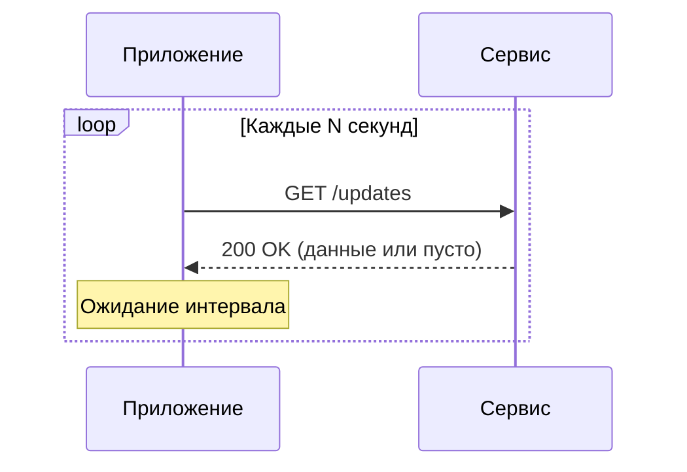
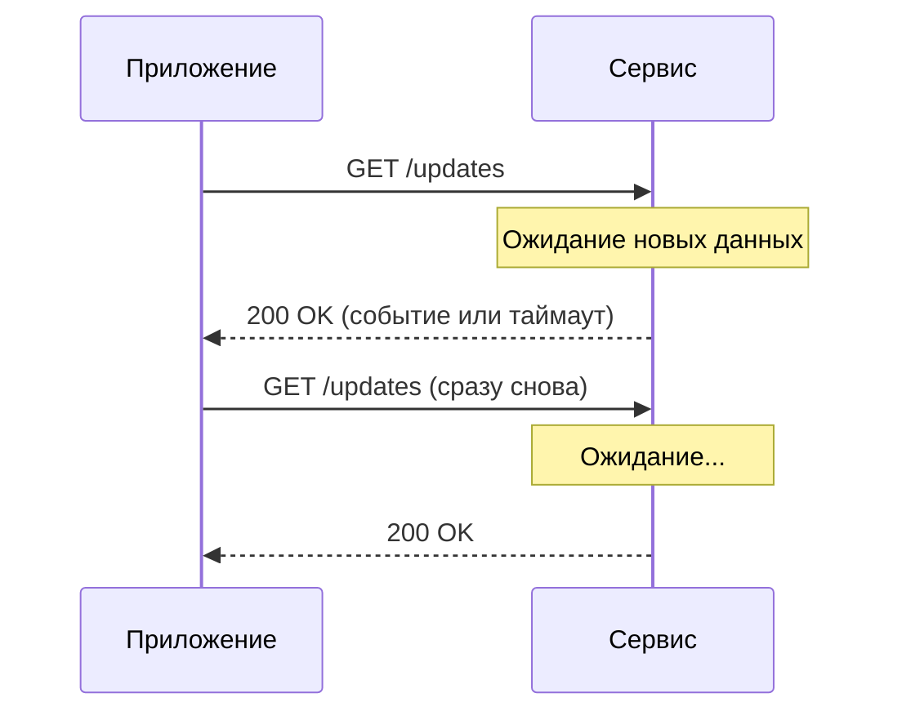
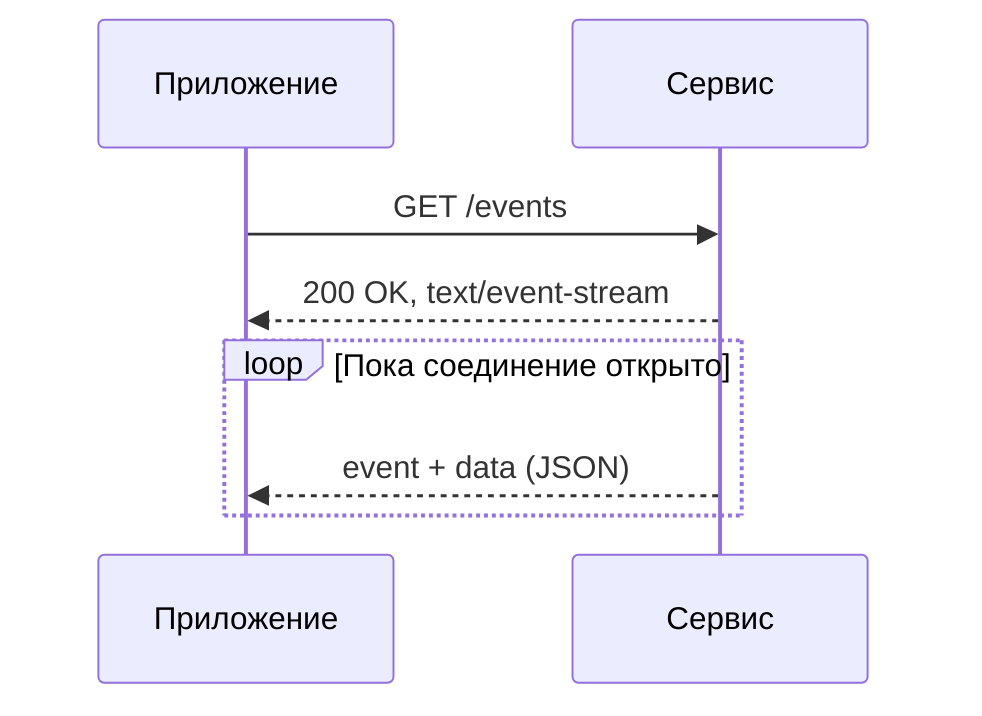
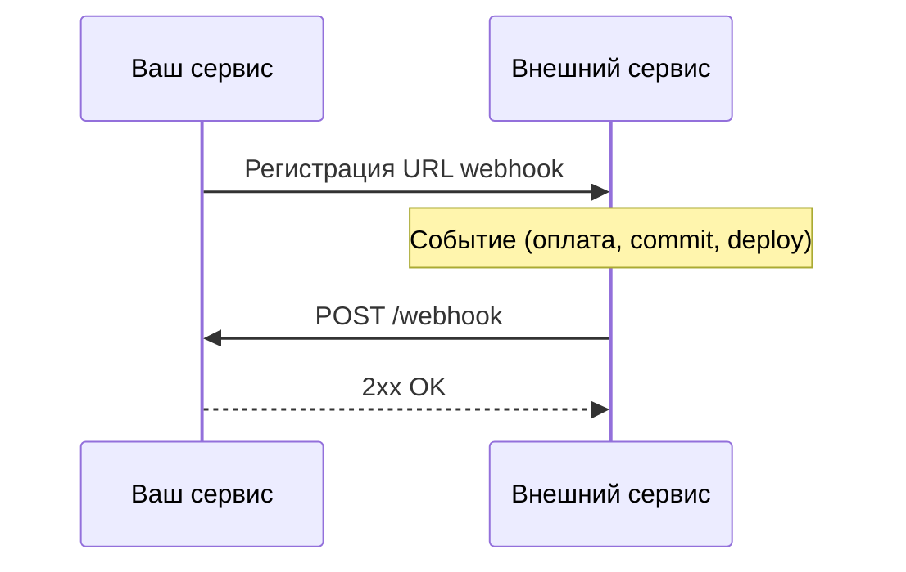

# Polling, Long Polling, SSE и Webhook

<div class="article-tags">
  <span class="tag tag-required">ОБЯЗАТЕЛЬНО</span>
  <span class="tag tag-beginner">ДЛЯ НОВИЧКОВ</span>
</div>

<span class="complexity-badge">Всем</span>

---

## Зачем нужны отдельные подходы

Классический [HTTP](/encyclopedia/2-system-network/2-09-osnovy-integratsionnogo-vzaimodeystviya/118) работает по схеме «запрос — ответ»: клиент спрашивает, сервер отвечает, соединение закрывается. Для страницы с новостями или статичной формы этого достаточно.

Современные интерфейсы ожидают другое поведение: статус заказа меняется без перезагрузки, в чат приходят сообщения сразу, ответ нейросети появляется по мере генерации. Сервер должен **доставить обновление клиенту**, хотя тот сам не отправлял новый запрос в этот момент.

Ниже — четыре базовых паттерна, которые каждый разработчик встречает на практике. Они решают одну задачу разными способами и часто сочетаются с [WebSocket](/encyclopedia/8-infra-security/8-05-mikroservisy-i-integratsiya/116), когда нужен полноценный двусторонний канал.

---

## Сравнение в одной таблице

| Подход | Кто инициирует связь | Соединение | Направление | Типичный пример |
|--------|----------------------|------------|-------------|-----------------|
| **Polling** | Клиент, по таймеру | Короткое на каждый опрос | Клиент → сервер | Проверка статуса заказа каждые 5 с |
| **Long Polling** | Клиент, но сервер держит ответ | Долгое до события или таймаута | Клиент → сервер | Новые сообщения в чате |
| **SSE** | Клиент один раз, дальше сервер шлёт поток | Одно долгоживущее | Сервер → клиент | Стрим ответа ИИ, лента уведомлений |
| **Webhook** | Сервер при событии | Короткое на каждое событие | Сервер → другой сервис | Уведомление об успешной оплате |

<div class="callout callout--info">
  <div class="callout-title">Webhook и браузер</div>

  <div class="callout-body">
  Webhook — это push между **сервисами**: платёжный шлюз вызывает ваш backend по `POST /webhook`. Браузер напрямую webhook принять не может (нет публичного URL у вкладки). Для веб-клиента ближе SSE, Long Polling или WebSocket.
  </div>
</div>

---

## Polling (краткий опрос)

**Polling** — клиент **регулярно** отправляет запрос и спрашивает, есть ли новые данные. Между запросами — пауза (интервал опроса).



**Как работает**

1. Приложение отправляет `GET /updates`.
2. Сервер сразу отвечает — с данными или пустым телом.
3. Клиент ждёт заданный интервал (например, 5 с) и повторяет цикл.

**Плюсы:** простая реализация, работает везде, где есть HTTP; легко отлаживать через `curl`.

**Минусы:** задержка до следующего интервала; много «пустых» запросов; нагрузка на сервер растёт с числом клиентов.

**Когда уместен:** редкие изменения, прототип, внутренние панели с низкой частотой обновления, среда без поддержки долгих соединений.

---

## Long Polling (длительный опрос)

**Long Polling** — клиент отправляет запрос, а сервер **не отвечает сразу**, если данных нет. Соединение остаётся открытым, пока не появится событие, не истечёт таймаут или связь не оборвётся. После ответа клиент **сразу** открывает новый запрос.



**Плюсы:** задержка близка к моменту появления данных; меньше запросов, чем при коротком polling.

**Минусы:** сервер удерживает много открытых соединений; при массовом переподключении возможны пики нагрузки (*thundering herd*); клиент по-прежнему инициирует каждый цикл.

**Когда уместен:** чаты и уведомления там, где WebSocket недоступен (строгий корпоративный прокси, старые клиенты).

---

## SSE (Server-Sent Events)

**SSE** — клиент один раз открывает `GET` с заголовком `Accept: text/event-stream`. Сервер отвечает `200 OK` и `Content-Type: text/event-stream`, после чего **стримит события** по одному HTTP-соединению. В браузере для этого есть [`EventSource`](./120.md).



**Формат события** (текст, строки разделены пустой строкой):

```
event: status
data: {"orderId": 42, "state": "shipped"}

id: 17
retry: 3000
```

- `event` — имя типа события;
- `data` — полезная нагрузка (часто JSON);
- `id` — для возобновления после обрыва;
- `retry` — пауза переподключения в миллисекундах.

**Плюсы:** нативная поддержка в браузере; автоматическое переподключение; проще WebSocket, если нужен только поток **от сервера к клиенту**.

**Минусы:** односторонний канал (ответ клиента — отдельным HTTP-запросом); лимиты прокси на время жизни соединения; бинарные данные передают через Base64 или другой транспорт.

**Когда уместен:** стриминг текста (ответ LLM по токенам), дашборды, лента активности, прогресс длительной операции.

Подробнее с примерами кода — в [Реактивной коммуникации](/encyclopedia/8-infra-security/8-05-mikroservisy-i-integratsiya/116).

---

## Webhook

**Webhook** — сервис-источник **сам вызывает** заранее зарегистрированный URL потребителя, когда происходит событие. Это push-модель поверх обычного HTTP, чаще всего `POST` с JSON-телом.



**Типичный сценарий**

1. Вы регистрируете `https://api.example.com/webhooks/payments` у Stripe, GitHub или CRM.
2. При событии провайдер шлёт `POST` с телом и подписью (HMAC в заголовке).
3. Ваш обработчик проверяет подпись, сохраняет `event_id` для идемпотентности и отвечает `2xx` быстро; тяжёлую работу выносят в очередь.

**Плюсы:** мгновенная доставка без опроса; стандартный HTTP; удобно для интеграций SaaS.

**Минусы:** нужен публичный HTTPS-эндпоинт; повторы и порядок событий нужно проектировать явно; отладка сложнее, чем у pull-API.

Интеграционный разбор, чек-лист и примеры — в [Push, Pull, Webhooks](/encyclopedia/8-infra-security/8-05-mikroservisy-i-integratsiya/120).

---

## Как выбрать подход

| Ситуация | Разумный выбор |
|----------|----------------|
| Редкие изменения, простой MVP | Polling с интервалом 10–30 с |
| Чат или уведомления без WebSocket | Long Polling |
| Поток текста или событий только **к** браузеру | SSE |
| Внешний сервис сообщает **вашему backend** о событии | Webhook |
| Дуплекс — клиент и сервер шлют в любой момент | WebSocket |

На практике часто комбинируют: webhook сигнализирует «заказ оплачен», а фронтенд по SSE или WebSocket показывает обновление без перезагрузки.

---

## Связь с Web API браузера

| Подход | API / механизм на клиенте |
|--------|---------------------------|
| Polling | `fetch`, `setInterval` |
| Long Polling | `fetch` с большим `timeout` |
| SSE | `EventSource` |
| Webhook | Серверный endpoint; браузер получает данные через свой API или WebSocket/SSE |

Обзор категорий Web API — в статье [Web API в браузере](./120.md). Практикум с WebSocket — [8.08 REST и WebSocket](/encyclopedia/8-infra-security/8-08-praktikum-rest-i-websocket/intro).

---

### См. также

- [Фоновая работа и офлайн-режим](./115) — Service Worker и отложенная синхронизация
- [Дополнительные аспекты интеграции](/encyclopedia/2-system-network/2-09-osnovy-integratsionnogo-vzaimodeystviya/124) — push и pull в интеграциях
- [Проектирование API](/encyclopedia/8-infra-security/8-05-mikroservisy-i-integratsiya/122) — callback, webhook и асинхронные операции
