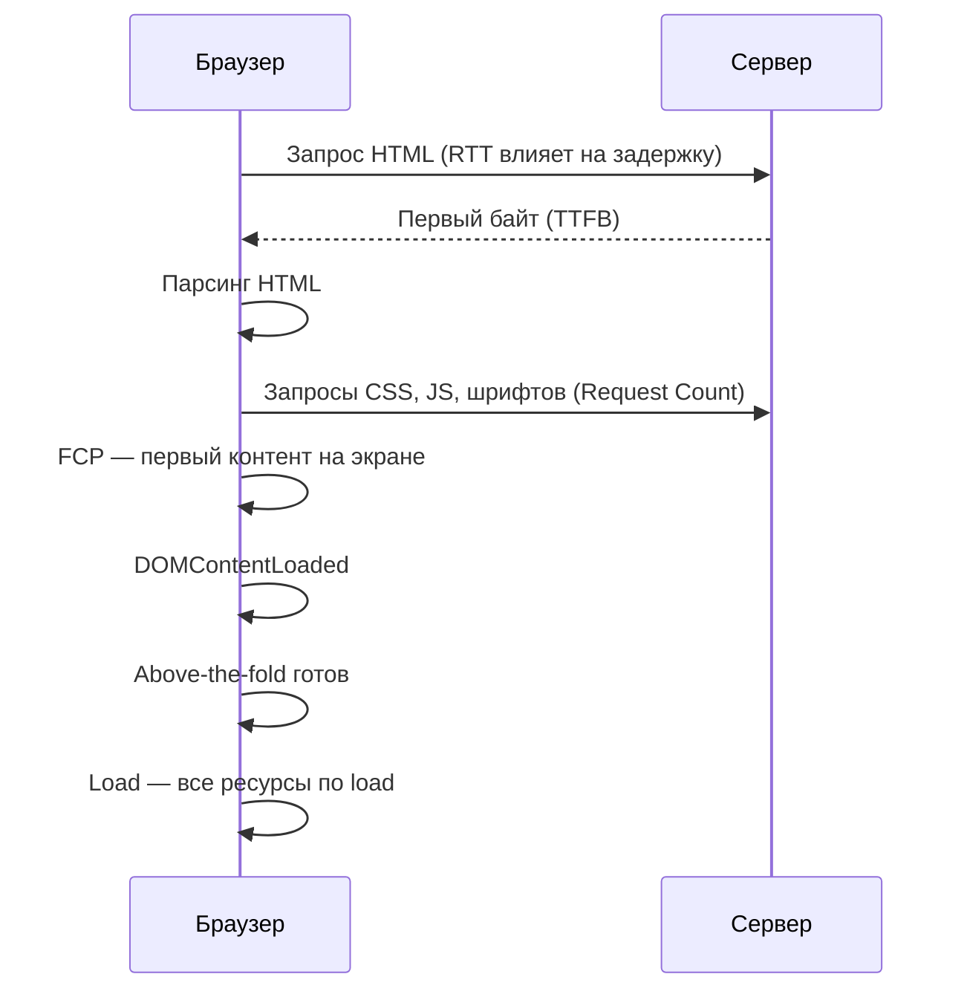

# Метрики производительности веб-страницы

  ОБЯЗАТЕЛЬНО
  ДЛЯ НОВИЧКОВ

Разработчику

---

## Зачем отдельный справочник

Жалоба "сайт тормозит" редко указывает на одну причину. Пользователь может ждать **ответ сервера**, **скачивание тяжёлых файлов**, **парсинг HTML**, **блокировку отрисовки скриптами** или **сдвиг макета** после загрузки картинок. У каждого этапа своя метрика.

Ниже — **девять показателей**, которые полезно держать под рукой при разборе загрузки страницы. Они дополняют [Core Web Vitals](/encyclopedia/2-system-network/2-04-kak-rabotayut-sayty-i-veb-sayty/118#core-web-vitals) (LCP, INP, CLS) — те ориентированы на **полевые** данные и SEO, а базовые метрики помогают **локализовать узкое место** в DevTools и в отчётах Lighthouse.

Сетевой контекст (RTT, DNS, TLS) для API — в [Сеть для диагностики бэкенда](/encyclopedia/1-basics/1-23-frontend-i-bekend/6). Цепочка рендеринга в браузере — в [архитектуре веб-приложений](/encyclopedia/2-system-network/2-04-kak-rabotayut-sayty-i-veb-sayty/111#proizvoditelnost).

---

## Девять метрик — краткая таблица

| Метрика | Что измеряет | Типичный вопрос |
|---------|--------------|-----------------|
| **Load Time** | Время до полной загрузки страницы | "Почему спиннер крутится так долго?" |
| **TTFB** | До первого байта ответа сервера | "Сервер медленный или сеть?" |
| **Request Count** | Число HTTP-запросов на страницу | "Слишком много мелких файлов?" |
| **DOM Content Loaded** | HTML разобран, DOM готов | "Когда можно запускать свой JS?" |
| **Above-the-Fold Load** | Контент в видимой области экрана | "Когда пользователь видит "шапку"?" |
| **FCP** | Первый видимый контент на экране | "Когда перестаёт быть белый экран?" |
| **Page Size** | Суммарный вес всех ресурсов | "Страница раздулась?" |
| **RTT** | Время запроса туда и обратно | "География и канал влияют?" |
| **Render-blocking resources** | CSS/JS, задерживающие отрисовку | "Что держит пустой экран?" |

---

## Как метрики укладываются во времени

Упрощённая хронология одной навигации:

Порядок на реальной странице может отличаться — **FCP** иногда наступает раньше **DOMContentLoaded**, если критический CSS уже применён, а тяжёлый JS ещё не выполнен.

---

## Сеть и сервер

### RTT (Round-Trip Time)

**RTT** — время, за которое сигнал доходит от клиента до сервера и обратно (один "круг" без учёта полной передачи тела ответа). Зависит от расстояния, маршрута, типа сети (Wi‑Fi, LTE), загрузки канала.

Высокий RTT увеличивает задержку **каждого** нового TCP-соединения и фазы TLS. Для API с коротким телом ответа RTT часто важнее, чем мегабайты JSON. Подробнее — в таблице метрик [сетевой диагностики](/encyclopedia/1-basics/1-23-frontend-i-bekend/6#ключевые-метрики).

### TTFB (Time To First Byte)

**TTFB** — интервал от отправки HTTP-запроса до получения **первого байта** ответа. Показывает, как быстро сервер (и всё на пути — DNS, CDN, балансировщик, БД) **начинает** отвечать.

| Высокий TTFB при низком времени обработки на origin | Высокий TTFB и долгий upstream |
|------------------------------------------------------|--------------------------------|
| CDN, DNS, географическая удалённость, TLS | Медленный бэкенд, тяжёлые запросы к БД |

В Chrome DevTools (вкладка **Network**) TTFB виден в колонке **Waiting (TTFB)** у документа. С сервера удобно снимать через `curl -w` — пример в [статье про сеть для бэкенда](/encyclopedia/1-basics/1-23-frontend-i-bekend/6#инструменты-разработчика).

---

## Объём и число запросов

### Request Count

**Request Count** — сколько отдельных HTTP-запросов браузер делает, чтобы отрисовать страницу (HTML, CSS, JS, изображения, шрифты, аналитика, виджеты).

Много мелких запросов на HTTP/1.1 без keep-alive давали очередь; **HTTP/2** и **HTTP/3** снимают часть проблем за счёт мультиплексирования, но каждый запрос всё равно стоит CPU и иногда отдельного TLS. Сокращение числа запросов — объединение файлов, спрайты (реже сейчас), inline критического CSS, отказ от лишних трекеров.

### Page Size

**Page Size** (вес страницы) — суммарный размер переданных ресурсов — HTML, стили, скрипты, изображения, видео, шрифты. Средний вес коммерческих лендингов за последние годы рос (много изображений, JS-бандлов, шрифтов).

Сжатие **gzip** / **Brotli**, современные форматы изображений (**WebP**, **AVIF**), [ленивая загрузка](/encyclopedia/2-system-network/2-04-kak-rabotayut-sayty-i-veb-sayty/114) и **code splitting** напрямую бьют по Page Size. В DevTools — колонка **Size** и итог внизу панели Network.

---

## Парсинг и отрисовка в браузере

### DOM Content Loaded

Событие **`DOMContentLoaded`** наступает, когда браузер **полностью разобрал HTML** и построил DOM. Он **не ждёт** окончания загрузки стилей, картинок и подфреймов.

Для разработчика это маркер: "каркас страницы на месте, можно вешать обработчики и читать узлы". Скрипты с атрибутом `defer` выполняются до `DOMContentLoaded`; с `async` — как только скачаются. Подробнее про `defer` / `async` — в [разметке HTML](/encyclopedia/3-data-markup/3-09-html/21).

### Render-blocking resources

**Ресурсы, блокирующие рендеринг** — обычно **CSS** (`<link rel="stylesheet">` без `media`, не подходящего под экран) и **синхронный JavaScript** в `<head>` без `defer`/`async`. Пока они не загружены и не обработаны, браузер откладывает отрисовку значимой части страницы.

Приёмы снижения блокировок:

- критический CSS — inline в `<head>` или отдельный маленький файл;
- `defer` / `async` для скриптов;
- `media="print"` для некритичных стилей (с осторожностью — см. таблицу в статье по HTML);
- перенос некритичного JS в конец `<body>` или динамический `import()`.

Связь с **Critical Rendering Path** и приёмами (code splitting, preload, tree shaking) — в [оптимизации загрузки и рендеринга](/encyclopedia/2-system-network/2-04-kak-rabotayut-sayty-i-veb-sayty/111#frontend-performance).

### First Contentful Paint (FCP)

**FCP** — момент, когда пользователь **впервые видит** контент — текст, фон, SVG, изображение (не только индикатор загрузки). Отвечает на вопрос "страница вообще ожила?".

FCP зависит от TTFB, блокирующих ресурсов и объёма критического пути. В Lighthouse и DevTools **Performance** FCP — одна из ключевых отметок на таймлайне. Для полевых данных смотрят [CrUX](https://developer.chrome.com/docs/crux) и отчёты Search Console.

### Time to Above-the-Fold Load

**Above-the-fold** — область экрана **без прокрутки**. Время её загрузки — субъективно важный показатель для лендингов и статей: пользователь решает "остаться или уйти" по первому экрану.

Метрика близка к **LCP** (Largest Contentful Paint) из Core Web Vitals, но above-the-fold шире по смыслу в маркетинге: сюда входят все видимые элементы, а LCP фиксирует **один** самый крупный элемент. Для SEO и ранжирования ориентируйтесь на [LCP, INP, CLS](/encyclopedia/2-system-network/2-04-kak-rabotayut-sayty-i-veb-sayty/118#core-web-vitals).

### Load Time

**Load Time** (событие `load` на `window`) — страница и все её зависимости по атрибуту `load` (изображения, iframes и т.д.) **завершили загрузку**. Это "всё скачано", но **не обязательно** "всё интерактивно" — тяжёлый JS после `load` может ещё блокировать основной поток.

Для SPA после первого `load` жизнь страницы продолжается — подгружаются чанки, данные API, гидратация React. Поэтому Load Time полезен как верхняя граница сетевой фазы, а отзывчивость смотрят через **INP** / **TTI**.

---

## Core Web Vitals — следующий уровень

| Базовая метрика | Связь с Core Web Vitals |
|-----------------|-------------------------|
| TTFB, RTT | Влияют на **LCP** (поздний первый контент) |
| Render-blocking, FCP | Подготовка к хорошему **LCP** |
| Page Size, Request Count | Косвенно **LCP** и **INP** |
| Стабильность вёрстки при загрузке медиа | **CLS** |

Google выделяет три полевые метрики — **LCP**, **INP** (раньше **FID**), **CLS**. Их пороги и влияние на SEO разобраны в [статье про SEO](/encyclopedia/2-system-network/2-04-kak-rabotayut-sayty-i-veb-sayty/118#core-web-vitals).

---

## Где смотреть на практике

| Инструмент | Что даёт |
|------------|----------|
| **DevTools → Network** | TTFB, размер, число запросов, водопад |
| **DevTools → Performance** | FCP, Main thread, long tasks |
| **Lighthouse** | Сводка Performance + рекомендации |
| **PageSpeed Insights** | Лабораторные + полевые (CrUX) данные |
| **`curl -w`** | TTFB с сервера / CI |

Разбор вкладок DevTools и Lighthouse — в [Chrome DevTools и бенчмарках](/encyclopedia/2-system-network/2-03-set-i-internet/617#инструменты-chrome-devtools).

  
Мини-чеклист при жалобе на скорость

  

  <ol>
  <li>Документ в Network — высокий <strong>TTFB</strong>?</li>
  <li>Много запросов или большой <strong>Page Size</strong>?</li>
  <li>В Performance — долгий простой до <strong>FCP</strong> (блокирующие CSS/JS)?</li>
  <li>После отрисовки — скачки вёрстки (<strong>CLS</strong>) или лаг по клику (<strong>INP</strong>)?</li>
  </ol>
  

---

## См. также

- [Оптимизация загрузки и рендеринга на клиенте](/encyclopedia/2-system-network/2-04-kak-rabotayut-sayty-i-veb-sayty/111#frontend-performance) — code splitting, dynamic import, prefetch, сжатие
- [Архитектурные особенности веб-приложений](/encyclopedia/2-system-network/2-04-kak-rabotayut-sayty-i-veb-sayty/114) — SPA, кэш, speculative loading
- [Веб-браузеры](/encyclopedia/1-basics/1-11-soft-ryadovogo-polzovatelya/3) — вкладка Network у пользователя
- [HTTP как основа веб-интеграций](/encyclopedia/2-system-network/2-09-osnovy-integratsionnogo-vzaimodeystviya/118) — keep-alive, HTTP/2, кэширование
