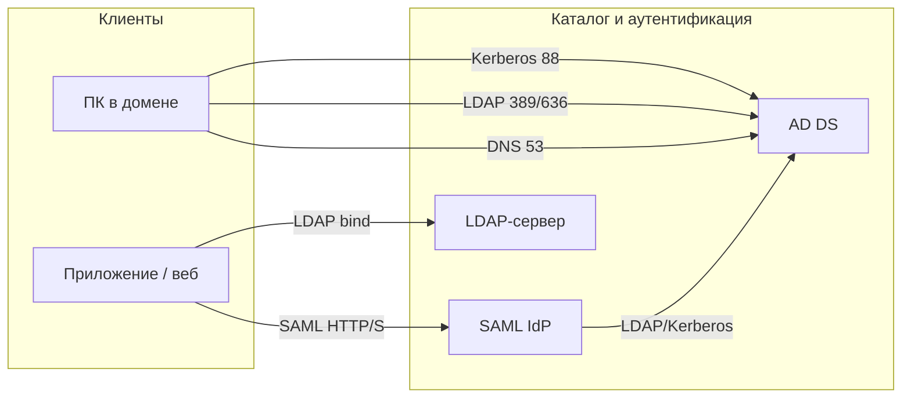
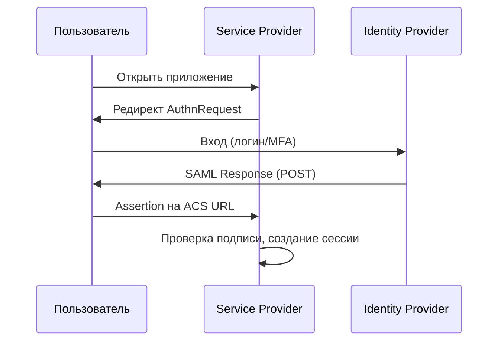
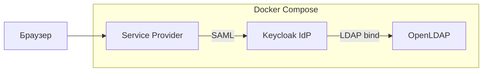

# Системы аутентификации

<div class="article-tags">
  <span class="tag tag-required">ОБЯЗАТЕЛЬНО</span>
  <span class="tag tag-beginner">ДЛЯ НОВИЧКОВ</span>
</div>

<span class="complexity-badge">Разработчику</span>
<span class="complexity-badge">Архитектору</span>
<span class="complexity-badge">Инженеру</span>

---

## Общие понятия

### Что такое служба каталогов

★ **Служба каталогов** (Directory Service) — распределённая база объектов сети — пользователи, группы, компьютеры, принтеры, политики. В отличие от обычной СУБД, каталог оптимизирован под **частое чтение** и **иерархический поиск**, а не под транзакции.

Объекты описываются **атрибутами** (логин, email, телефон, членство в группах) и располагаются в **дереве** (DIT — Directory Information Tree). Доступ к каталогу — по сетевым протоколам; клиенты не хранят полную копию, а запрашивают нужные записи у сервера.

| Тип / реализация | Платформа | Назначение |
|------------------|-----------|------------|
| **Active Directory Domain Services (AD DS)** | Windows Server | Домен Windows, Kerberos, GPO, DNS |
| **OpenLDAP, 389 Directory Server** | Linux / кроссплатформенно | Универсальный LDAP-каталог |
| **FreeIPA** | Linux | LDAP + Kerberos + DNS + CA в одном стеке |
| **Samba AD DC** | Linux | Совместимость с протоколами Windows AD |
| **Microsoft Entra ID** (облако) | Azure / M365 | Облачный каталог, SAML/OIDC; см. [Идентичность Microsoft Entra и RBAC](./62.md) |
| **Apple Open Directory** | macOS Server (legacy) | Каталог для экосистемы Apple |

Служба каталогов — это **хранилище идентичностей** и **точка проверки учётных данных**. Авторизация (что именно разрешено) часто строится поверх неё через группы и политики.

---

### Что такое домен

★ **Домен** — логическая граница доверия и администрирования в сети. Все объекты внутри домена подчиняются одним правилам: единый DNS-суффикс (`company.local`), общие учётные записи, общие политики.

| Понятие | Смысл |
|---------|--------|
| **Имя домена (DNS)** | `cabinet.local` — по нему клиенты находят контроллеры и формируют UPN (`ivanov@cabinet.local`) |
| **NetBIOS-имя** | Короткое имя (`CABINET`) — legacy, но встречается в старых сценариях |
| **Контроллер домена (DC)** | Сервер, на котором работает каталог и аутентификация |
| **Рабочая группа** | Альтернатива домену: локальные учётки на каждом ПК, без централизации |
| **Лес (Forest)** | Набор доменов с общей схемой AD; верхняя граница доверия в Windows |
| **Доверие (Trust)** | Связь между доменами или лесами для общего входа |

Компьютер **в домене** доверяет контроллерам: при входе пользователя ОС обращается к DC, а не к локальной SAM-базе. Компьютер **вне домена** — автономен; централизованное управление ограничено.

---

### Что такое тип аутентификации

★ **Аутентификация** — проверка, что субъект действительно тот, за кого себя выдаёт ("кто ты?"). **Авторизация** — что ему разрешено ("что тебе можно?"). В статьях и настройках часто смешивают; для админа важно разделять.

| Тип / механизм | Как работает | Где встречается |
|----------------|--------------|-----------------|
| **Логин + пароль** | Клиент отправляет секрет; сервер сравнивает с хешем | LDAP bind, веб-форма, RADIUS |
| **Kerberos** | Билет (ticket) от KDC после первичной проверки; без повторной передачи пароля | Домен Windows, FreeIPA |
| **NTLM** | Challenge-response по хешу пароля Windows | Legacy, файловые ресурсы, старые приложения |
| **Сертификат (TLS, smart card)** | Криптографическая пара ключей + доверенный CA | VPN, Wi‑Fi EAP-TLS, вход по карте |
| **Токен / OAuth / OIDC** | После входа у IdP выдаётся JWT или access token | Облачные API, SPA |
| **SAML Assertion** | IdP подписывает XML-утверждение о пользователе | Корпоративный SSO в браузере |
| **Многофакторная (MFA)** | Второй фактор поверх любого из перечисленного | TOTP, push, FIDO2 |

**Тип аутентификации** в настройках приложения — это выбор **протокола и хранилища** — "LDAP", "Active Directory", "SAML", "локальная база", "OAuth2". От выбора зависят порты, формат логина (`DOMAIN\user` vs `user@domain`) и требования к шифрованию.

---

### Как и где хранятся пользователи

| Место хранения | Формат | Особенности |
|----------------|--------|-------------|
| **База каталога AD** | Файл `ntds.dit` на каждом DC | Реплицируется между контроллерами; SYSVOL — политики и скрипты |
| **LDAP-база** | Файлы Berkeley DB / LMDB (`/var/lib/ldap`) | Обычно один мастер или репликация по отдельной схеме |
| **Локальная SAM** (Windows) | Реестр на конкретном ПК | Только локальные учётки; не для корпоративного масштаба |
| **`/etc/passwd`, `/etc/shadow`** (Linux) | Текстовые файлы | Локальные пользователи; доменные — через SSSD/nss |
| **База приложения** | SQL, NoSQL | Пользователи только этого сервиса; риск "зоопарка паролей" |
| **Облачный IdP** | Тенант Entra, Okta и т.д. | Синхронизация с AD или самостоятельный каталог |

Пароли **не хранятся в открытом виде**. В AD и LDAP — **хеши** (для Windows — NTLM- и Kerberos-ключи). Администратор сбрасывает пароль, но не "читает" старый.

Типичные атрибуты учётной записи:

- **Идентификатор** — `sAMAccountName`, `uid`, `cn`
- **Отображаемое имя** — `displayName`, `givenName`, `sn`
- **Почта**: `mail`, `userPrincipalName`
- **Группы**: `memberOf` (у пользователя) / `member` (у группы)
- **Состояние** — `userAccountControl` (AD), `accountStatus`, срок действия пароля

---

### Какие протоколы используются



| Протокол | Порт | Роль |
|----------|------|------|
| **LDAP** | 389 (TCP/UDP), **636** (LDAPS) | Поиск объектов, bind (проверка логина/пароля) |
| **Kerberos** | **88** (TCP/UDP) | Билеты в домене Windows / FreeIPA |
| **DNS** | **53** | SRV-записи для поиска DC (`_ldap._tcp.dc._msdcs...`) |
| **SMB** | **445** | Доступ к файлам после аутентификации |
| **Global Catalog** | **3268**, **3269** (GC SSL) | Поиск объектов по всему лесу AD |
| **SAML 2.0** | **443** (HTTPS) | Обмен XML-сообщениями через браузер |
| **NTLM** | внутри SMB/HTTP | Устаревающий механизм Windows |

Полный справочник портов — в [Справочник по сетевым протоколам и портам](/encyclopedia/2-system-network/2-03-set-i-internet/618).

---

### Единый вход (SSO) — что даёт и какие возможности

★ **Single Sign-On (SSO)** — пользователь **один раз** проходит аутентификацию у доверенного провайдера и получает доступ к нескольким сервисам без повторного ввода пароля (в пределах срока сессии и политик).

| Возможность | Польза для организации |
|-------------|------------------------|
| Один пароль / один MFA | Меньше "забытых паролей" и записок на стикерах |
| Централизованная блокировка | Увольнение → отключение одной учётки закрывает доступ везде |
| Единые группы и роли | Права в CRM, wiki, VPN наследуются из каталога |
| Аудит входов | Журналы на DC, IdP, SIEM |
| Федерация с облаком | Локальный AD + Entra + SaaS без дублирования паролей |
| Политики паролей и MFA | Один раз настроил GPO или Conditional Access — действует на всех |

SSO **не отменяет** авторизацию: факт входа в домен не означает доступ к бухгалтерской папке. Группы, GPO и ACL по-прежнему определяют границы.

Уровни SSO в типичном офисе:

1. **Домен Windows** — вход в ОС = Kerberos-билет для SMB, Exchange (on-prem), RDP.
2. **LDAP-приложения** — портал, GitLab, Jenkins проверяют bind к каталогу.
3. **SAML/OIDC** — браузерные SaaS и внутренние веб-приложения через IdP (AD FS, Entra, Keycloak).

---

## Active Directory

### Что это

★ **Active Directory Domain Services (AD DS)** — служба каталогов Microsoft для Windows Server. Реализует LDAP-совместимый каталог, **Kerberos** и **NTLM**, **групповые политики (GPO)**, интеграцию с DNS и распределённую репликацию между контроллерами домена.

AD — не только "список пользователей". Это инфраструктурный центр — время (через иерархию домена), имена машин, делегирование прав, почтовые атрибуты, сертификаты (AD CS), иногда PKI и RDS.

---

### Как разворачивать

Минимальный путь (подробно — [глава 4](./4.md), [Windows Server](./63.md)). Лабораторный домен в Docker — [ниже](#docker-razvertyvanie); для организации нужен Windows Server.

1. Установить **Windows Server**; задать статический IP и DNS на себя (`127.0.0.1`).
2. Переименовать сервер (`DC01`), **до** повышения до DC имя не менять.
3. Установить роль **AD Domain Services** и средства управления:

```powershell
Install-WindowsFeature -Name AD-Domain-Services -IncludeManagementTools
```

4. Создать **новый лес и домен** (для первого сервера в организации):

```powershell
Install-ADDSForest `
  -DomainName "cabinet.local" `
  -DomainNetbiosName "CABINET" `
  -InstallDns `
  -Force
```

5. После перезагрузки проверить службы `NTDS`, `DNS`, `Netlogon`; создать OU, пользователей, группы.
6. Для отказоустойчивости — второй DC в том же домене (`Install-ADDSDomainController`).

**Требования:** корректное время (расхождение > 5 мин ломает Kerberos), рабочий DNS, сеть до клиентов по портам 88, 389, 445, 53.

---

### Как подключать

| Сценарий | Действия |
|----------|----------|
| **Windows-клиент в домен** | Свойства системы → "Изменить" → домен `cabinet.local`; учётка с правом join. См. [глава 5](./5.md) |
| **Linux в домен** | `realm join`, SSSD + `sssd.conf`; или Samba `net ads join` |
| **Приложение по LDAP** | Base DN, bind DN сервисной учётки, фильтр пользователей |
| **Гибрид с облаком** | Azure AD Connect / Entra Connect Sync — см. [Идентичность Microsoft Entra и RBAC](./62.md) |
| **SSO в SaaS** | AD FS или Entra как SAML IdP |

Проверка доступности DC с клиента:

```powershell
nltest /dsgetdc:cabinet.local
```

```bash
ldapsearch -x -H ldap://dc01.cabinet.local -b "DC=cabinet,DC=local" "(objectClass=domain)" dn
```

---

### Стандартные порты

| Служба | Порт | Примечание |
|--------|------|------------|
| LDAP | 389 | StartTLS рекомендуется в открытых сетях |
| LDAPS | 636 | LDAP поверх TLS |
| Kerberos | 88 | TCP и UDP |
| DNS | 53 | SRV для автопоиска DC |
| SMB | 445 | Файлы, администрирование |
| Global Catalog | 3268 / 3269 | Поиск по лесу |
| RPC / репликация AD | динамические, эфемерные | Фаервол по [документации Microsoft](https://learn.microsoft.com/windows-server/identity/ad-ds/plan/active-directory-ports-and-firewalls) |

---

### Пути, группы, пользователи, параметры

#### Логическая структура (пути в каталоге)

Базовый **Base DN** для домена `cabinet.local`:

```text
DC=cabinet,DC=local
```

Типовые контейнеры и OU:

| Путь (пример) | Содержимое |
|---------------|------------|
| `CN=Users,DC=cabinet,DC=local` | Встроенные контейнеры пользователей и групп по умолчанию |
| `OU=Sales,DC=cabinet,DC=local` | Пользователи отдела продаж |
| `OU=Computers,OU=Sales,...` | Учётные записи компьютеров отдела |
| `CN=Group Policy Container,CN=...,CN=Configuration,...` | Объекты GPO |

**Distinguished Name (DN)** — полный путь объекта, например:

```text
CN=Ivanov Ivan,OU=Users,OU=Sales,DC=cabinet,DC=local
```

#### Типы групп

| Тип | Область | Пример использования |
|-----|---------|----------------------|
| **Domain Local** | В пределах домена | Права на ресурс сервера |
| **Global** | Внутри домена, в GC | Членство по отделам |
| **Universal** | Весь лес | Крупные проектные группы |
| **Builtin** | Локальные на DC | `Administrators`, `Users` |

Встроенные важные группы — **Domain Admins**, **Enterprise Admins**, **Domain Users**, **Domain Computers**.

#### Ключевые атрибуты пользователя

| Атрибут | Назначение |
|---------|------------|
| `sAMAccountName` | Логин `ivanov` |
| `userPrincipalName` | `ivanov@cabinet.local` |
| `displayName` | Имя в интерфейсе |
| `mail` | Адрес почты |
| `memberOf` | Список групп |
| `userAccountControl` | Флаги: отключён, не истекает пароль и т.д. |

#### Параметры и инструменты

| Задача | Инструмент / командлет |
|--------|-------------------------|
| Пользователи и группы (GUI) | *Active Directory Users and Computers* (`dsa.msc`) |
| GPO | *Group Policy Management* (`gpmc.msc`) — см. [Групповые политики в Windows](./411.md) |
| PowerShell | Модуль `ActiveDirectory`: `Get-ADUser`, `New-ADGroup`, `Set-ADAccountPassword` |
| Диагностика | `dcdiag`, `repadmin /showrepl`, Event Log `Directory Service` |
| Резервная копия | Windows Server Backup, `ntdsutil`, корзина AD (`Recycle Bin`) |

Пример создания пользователя:

```powershell
New-ADUser -Name "Ivanov Ivan" `
  -SamAccountName "ivanov" `
  -UserPrincipalName "ivanov@cabinet.local" `
  -Path "OU=Users,OU=Sales,DC=cabinet,DC=local" `
  -AccountPassword (ConvertTo-SecureString "TempPass123!" -AsPlainText -Force) `
  -Enabled $true
Add-ADGroupMember -Identity "FS_Sales_Read" -Members "ivanov"
```

---

## LDAP

### Что это

★ **LDAP** (Lightweight Directory Access Protocol) — протокол доступа к службе каталогов, а не сама база. **OpenLDAP**, **389 Directory Server**, **Active Directory** (в режиме LDAP) — это **серверы**, которые **отвечают на LDAP-запросы**.

Операции LDAP — **bind** (аутентификация), **search** (поиск), **add/modify/delete** (изменение), **compare**. Данные — в виде записей с DN и набором атрибутов; схема задаёт обязательные и допустимые поля (`objectClass: inetOrgPerson`, `posixAccount` и т.д.).

LDAP часто используют, когда нужен **кроссплатформенный** каталог без полного стека Windows — Linux-серверы, VPN, веб-приложения, NAS, GitLab, Jenkins.

---

### Как разворачивать

Пример: **OpenLDAP** на Linux (Debian/Ubuntu). Для стенда в контейнере — [раздел Docker](#docker-razvertyvanie).

1. Установка:

```bash
sudo apt install slapd ldap-utils
sudo dpkg-reconfigure slapd
```

2. При настройке задать **DNS-имя организации** (`company.local` → base `dc=company,dc=local`), пароль администратора каталога.

3. Загрузить **схему** и структуру OU (файл LDIF):

```ldif
dn: ou=people,dc=company,dc=local
objectClass: organizationalUnit
ou: people

dn: ou=groups,dc=company,dc=local
objectClass: organizationalUnit
ou: groups
```

```bash
ldapadd -x -D "cn=admin,dc=company,dc=local" -W -f structure.ldif
```

4. Создать пользователя и группу; включить **TLS** (`olcTLSCertificateFile` в `cn=config`) для порта 636.
5. Для репликации — отдельный consumer-сервер с `syncrepl`.

Альтернативы: **FreeIPA** (`ipa-server-install` — LDAP + Kerberos "из коробки"), **Samba AD** как совместимый с Windows DC.

---

### Как подключать

| Клиент | Настройка |
|--------|-----------|
| **Linux (nss/pam)** | SSSD или `libnss-ldap` + `pam_ldap`; URI `ldap://ldap.company.local` |
| **Приложение** | URL `ldap://host:389`, Base DN, Bind DN, Bind password, User filter |
| **AD как LDAP** | `ldap://dc01.cabinet.local`, base `DC=cabinet,DC=local`, учётка `CN=svc_ldap,...` |
| **phpLDAPadmin / Apache Directory Studio** | GUI для отладки запросов |

Типичные параметры в форме "LDAP-аутентификация" в приложении:

| Параметр | Пример |
|----------|--------|
| Server / URI | `ldap://ldap01.company.local:389` |
| Base DN | `ou=people,dc=company,dc=local` |
| Bind DN | `cn=readonly,dc=company,dc=local` |
| User search filter | `(&(objectClass=inetOrgPerson)(uid=%u))` |
| Login attribute | `uid` или `mail` |
| Group filter | `(&(objectClass=groupOfNames)(member=%dn))` |

Проверка bind:

```bash
ldapwhoami -x -H ldap://localhost -D "uid=ivanov,ou=people,dc=company,dc=local" -W
```

---

### Стандартные порты

| Порт | Назначение |
|------|------------|
| **389** | LDAP (plaintext; в продакшене — StartTLS) |
| **636** | LDAPS (TLS с самого начала соединения) |
| **3268 / 3269** | Только Global Catalog в AD |

Между дата-центрами и в интернет LDAP без TLS **не пускают** — только VPN или LDAPS.

---

### Пути, группы, пользователи, параметры

#### Пути (DN)

Для домена `company.local`:

```text
dc=company,dc=local
├── ou=people
│   └── uid=ivanov,ou=people,dc=company,dc=local
└── ou=groups
    └── cn=developers,ou=groups,dc=company,dc=local
```

В AD те же принципы, но часто стиль `CN=...,OU=...,DC=...`.

#### Группы

| objectClass | Модель |
|-------------|--------|
| `groupOfNames` | Список `member:` с полными DN |
| `posixGroup` | `gidNumber` + `memberUid` — классика Linux |
| `group` (AD) | `member` / `memberOf` в AD |

#### Атрибуты пользователя (OpenLDAP / inetOrgPerson)

| Атрибут | Смысл |
|---------|--------|
| `uid` | Логин |
| `cn` | Common Name |
| `sn`, `givenName` | Фамилия, имя |
| `mail` | Email |
| `userPassword` | Хеш пароля (часто `{SSHA}`) |
| `memberof` / `member` | Группы (зависит от схемы) |

#### Файлы и параметры сервера (OpenLDAP)

| Путь / параметр | Назначение |
|-----------------|------------|
| `/etc/ldap/slapd.d/` | Конфигурация `cn=config` |
| `/var/lib/ldap/` | База данных |
| `olcSuffix` | Корень дерева (`dc=company,dc=local`) |
| `olcRootDN` | Администратор каталога |
| `olcAccess` | ACL: кто что может читать/писать |

Пример LDIF пользователя:

```ldif
dn: uid=ivanov,ou=people,dc=company,dc=local
objectClass: inetOrgPerson
objectClass: posixAccount
uid: ivanov
cn: Ivan Ivanov
sn: Ivanov
mail: ivanov@company.local
uidNumber: 10001
gidNumber: 10001
homeDirectory: /home/ivanov
userPassword: {SSHA}...
```

---

## SAML

### Что это

★ **SAML 2.0** (Security Assertion Markup Language) — XML-стандарт **федеративной аутентификации через браузер**. Пользователь входит у **Identity Provider (IdP)**; **Service Provider (SP)** — приложение (Confluence, Grafana, Salesforce) — получает **подписанное утверждение** (assertion) о личности и атрибутах, не видя пароль.

SAML — про **веб-SSO**, не про вход в Windows на рабочем столе. Часто IdP — **AD FS**, **Microsoft Entra ID**, **Keycloak**, **Okta**; источник учёток за IdP — AD или LDAP.

Развёрнутые схемы и сравнение с OAuth/OIDC — в [статье по ИБ](/encyclopedia/2-system-network/2-08-osnovy-informatsionnoy-bezopasnosti/111#sso).



---

### Как разворачивать

Варианты IdP:

| Решение | Среда |
|---------|--------|
| **AD FS** | Windows Server, домен AD on-prem |
| **Microsoft Entra ID** | Облако M365 / Azure |
| **Keycloak** | Linux, Docker; бесплатный IdP |
| **Shibboleth** | Университеты, крупные федерации |

Минимальный запуск Keycloak в Docker — в [разделе "Развёртывание в Docker"](#docker-razvertyvanie) ниже; полный стек с PostgreSQL и связкой с LDAP — там же.

Далее в админ-консоли — создать **Realm**, пользователей или **User Federation → LDAP** к AD, создать **Client** для SP, включить SAML, выгрузить **IdP metadata**.

Для **AD FS**: роль *Active Directory Federation Services* → *Federation Service* → доверие к relying party (SP) → правила выдачи claims (email, группы AD).

---

### Как подключать

Подключение всегда **парное**: настройки и на IdP, и на SP.

| Шаг | IdP | Service Provider |
|-----|-----|------------------|
| 1 | Зарегистрировать SP (ACS URL, Entity ID) | Указать URL метаданных IdP |
| 2 | Выдать **Assertion Consumer Service (ACS)** URL | Проверка подписи сертификатом IdP |
| 3 | Настроить **NameID** (`email`, `persistent`) | Сопоставить атрибуты с локальными ролями |
| 4 | Правила claims: группы AD → атрибут `Role` | Маппинг групп на права в приложении |

Типичные параметры SP (пример Grafana):

| Параметр | Значение |
|----------|----------|
| Entity ID / Audience | `https://grafana.company.local` |
| ACS URL | `https://grafana.company.local/login/saml` |
| Single Sign-On URL IdP | из метаданных IdP |
| Certificate | X.509 IdP для проверки подписи |
| Name ID format | `urn:oasis:names:tc:SAML:1.1:nameid-format:emailAddress` |

Обмен идёт по **HTTPS (443)**; clock skew между серверами — не более нескольких минут.

---

### Стандартные порты

| Порт | Назначение |
|------|------------|
| **443** | HTTPS — редиректы, POST SAML Response, метаданные |
| **80** | Редирект на HTTPS (не для production без TLS) |

Отдельного "порта SAML" нет — это уровень приложения поверх HTTP.

---

### Пути, группы, пользователи, параметры

В SAML нет "дерева каталога" как в LDAP. Есть **утверждения (claims)** в assertion:

| Элемент SAML | Смысл |
|--------------|--------|
| **Issuer** | Кто выдал assertion (IdP) |
| **NameID** | Уникальный идентификатор субъекта |
| **AttributeStatement** | `email`, `givenName`, `groups`, `Role` |
| **Audience** | Для какого SP предназначен ответ |
| **Conditions / NotOnOrAfter** | Срок действия |
| **Signature** | Подпись IdP (обязательна) |

#### Пользователи и группы

- Пользователи живут в **каталоге за IdP** (AD, LDAP, локальная база Keycloak).
- Группы AD преобразуются в **атрибуты SAML** правилами IdP (AD FS — *Attribute Store*, Entra: *Group claims*, Keycloak: *Group mapper*).

#### Ключевые URL (логические "пути")

| URL | Назначение |
|-----|------------|
| **Entity ID / Issuer** | Идентификатор стороны в метаданных |
| **SSO URL** (`SingleSignOnService`) | Куда браузер отправляет AuthnRequest |
| **ACS URL** | Куда IdP POST-ит SAML Response |
| **SLO URL** (опционально) | Единый выход |
| **Metadata URL** | `https://idp.company.local/FederationMetadata/2007-06/FederationMetadata.xml` |

#### Параметры безопасности

- Подпись assertion и (желательно) AuthnRequest.
- Проверка `Audience`, `Recipient`, `InResponseTo`.
- Короткий срок жизни assertion (минуты).
- MFA на стороне IdP для внешних SP.

---

<span id="docker-razvertyvanie"></span>

## Развёртывание в Docker

Docker удобен для **учебных стендов**, интеграционных тестов и локальной разработки. Контейнеры быстро поднимаются и сбрасываются. Для **продакшн-домена** организации по-прежнему используют виртуальные или физические серверы: контроллер домена — критичная роль с жёсткими требованиями к времени, DNS и сохранности `ntds.dit`.

| Технология | В Docker | Комментарий |
|------------|----------|-------------|
| **LDAP** (OpenLDAP) | Да, типичный сценарий | Образы `osixia/openldap`, Bitnami |
| **Active Directory** (родной AD DS) | Нет на Linux-хосте | Только Windows Server (ВМ), не Linux-контейнер |
| **Samba AD DC** | Да, для лаборатории | Эмуляция DC; не полная замена AD в enterprise |
| **SAML IdP** (Keycloak и др.) | Да, типичный сценарий | Часто рядом с LDAP в одном `compose` |

Общие правила:

- **Тома (volumes)** — данные каталога и БД Keycloak не хранят в слое контейнера; при `docker compose down` без тома всё пропадёт.
- **Сеть** — сервисы в одном compose-файле обращаются друг к другу по **имени сервиса** (`ldap://openldap:389`), с хоста — через `localhost` и проброшенные порты.
- **Секреты** — пароли администратора в `.env`, файл в `.gitignore`; в примерах ниже пароли учебные.
- **Время** — синхронизируйте часы хоста (Kerberos и SAML чувствительны к расхождению).

Синтаксис Compose — в [статье docker-compose](/encyclopedia/8-infra-security/8-06-konteynerizatsiya-i-orkestratsiya/1111).

---

### LDAP в Docker (OpenLDAP)

Каталог **osixia/openldap** — распространённый образ для стендов: при старте создаёт базу `dc=…`, поддерживает LDAP и LDAPS.

Файл `compose.yaml` в отдельной папке проекта:

```yaml
services:
  openldap:
    image: osixia/openldap:1.5.0
    container_name: openldap
    environment:
      LDAP_ORGANISATION: "Company"
      LDAP_DOMAIN: "company.local"
      LDAP_BASE_DN: "dc=company,dc=local"
      LDAP_ADMIN_PASSWORD: "adminpass"
      LDAP_CONFIG_PASSWORD: "configpass"
      LDAP_TLS: "false"
    ports:
      - "389:389"
      - "636:636"
    volumes:
      - ldap_data:/var/lib/ldap
      - ldap_config:/etc/ldap/slapd.d
    restart: unless-stopped

  phpldapadmin:
    image: osixia/phpldapadmin:0.9.0
    environment:
      PHPLDAPADMIN_LDAP_HOSTS: "openldap"
      PHPLDAPADMIN_HTTPS: "false"
    ports:
      - "8081:80"
    depends_on:
      - openldap

volumes:
  ldap_data:
  ldap_config:
```

Запуск и проверка:

```bash
docker compose up -d
docker compose ps
ldapwhoami -x -H ldap://localhost:389 -D "cn=admin,dc=company,dc=local" -w adminpass
```

Добавление пользователя из LDIF на хосте (нужен пакет `ldap-utils`):

```bash
ldapadd -x -H ldap://localhost:389 -D "cn=admin,dc=company,dc=local" -w adminpass -f user.ldif
```

Веб-интерфейс phpLDAPadmin: `http://localhost:8081`, логин `cn=admin,dc=company,dc=local`.

**Подключение приложения** в том же compose-сети:

| Параметр | Значение |
|----------|----------|
| URI | `ldap://openldap:389` |
| Base DN | `dc=company,dc=local` |
| Bind DN | `cn=admin,dc=company,dc=local` |
| User filter | `(&(objectClass=inetOrgPerson)(uid=%u))` |

**Резервная копия:** том `ldap_data` или экспорт:

```bash
docker exec openldap slapcat -n 1 -l backup.ldif
```

**Остановка с сохранением данных:** `docker compose down` (тома остаются). Полное удаление: `docker compose down -v`.

---

### Active Directory в Docker

#### Родной Microsoft AD DS

**Active Directory Domain Services** официально работает только на **Windows Server**. В Linux-контейнере полноценный DC Microsoft не разворачивают. Для изучения GPO, RSAT и "настоящего" AD используйте:

- виртуальную машину Windows Server (Hyper-V, VMware, VirtualBox);
- облачный lab (Azure VM, учебные образы Microsoft).

Это осознанное ограничение платформы, а не Docker "в целом".

#### Samba AD DC в контейнере (лабораторный домен)

Для стенда "похоже на AD" — **Samba** в роли контроллера домена. Подходит для проверки LDAP/Kerberos, join Linux через `realm`, частично — Windows-клиентов в изолированной сети.

Пример одного контейнера (образ `nowater/samba-domain`):

```bash
docker run -it --rm --name samba-dc \
  --hostname dc01 \
  -e DOMAIN=LAB.LOCAL \
  -e DOMAINPASS='LabPass123!' \
  -e DNSFORWARDER=8.8.8.8 \
  -p 53:53/udp -p 53:53/tcp \
  -p 88:88/tcp -p 88:88/udp \
  -p 135:135 -p 139:139 -p 389:389 -p 445:445 \
  -p 464:464/tcp -p 464:464/udp -p 636:636 \
  -p 1024-1044:1024-1044 \
  nowater/samba-domain
```

После старта контейнер выводит учётные данные **Administrator**. Клиент должен использовать этот хост как **DNS** (иначе SRV-записи DC не найдутся).

| Параметр | Значение (пример) |
|----------|-------------------|
| Домен | `LAB.LOCAL` |
| Base DN | `DC=LAB,DC=LOCAL` |
| LDAP | `ldap://localhost:389` |
| Администратор | `LAB\Administrator` |

Ввод Linux-хоста (на машине с `realmd`):

```bash
sudo realm join -U Administrator LAB.LOCAL
```

**Ограничения Docker-стенда Samba AD:**

- проброс множества портов и UDP конфликтует с локальным DNS (53) на хосте;
- для Windows join надёжнее отдельная VM-сеть (macvlan / dedicated VLAN), а не `localhost`;
- GPO, Exchange, AD CS и прочий стек Microsoft в Samba **не** воспроизводятся полностью.

Для корпоративного AD см. [главу 4](./4.md) — развёртывание на Windows Server.

---

### SAML в Docker (Keycloak)

**Keycloak** — частый выбор IdP в контейнере — SAML, OIDC, федерация с LDAP/AD.

#### Быстрый старт (без сохранения БД)

Только для проверки UI:

```bash
docker run --name keycloak -p 8080:8080 \
  -e KC_BOOTSTRAP_ADMIN_USERNAME=admin \
  -e KC_BOOTSTRAP_ADMIN_PASSWORD=admin \
  quay.io/keycloak/keycloak:26.0 start-dev
```

Админ-консоль: `http://localhost:8080/admin`.

#### Стек с PostgreSQL (данные переживают перезапуск)

```yaml
services:
  postgres:
    image: postgres:16-alpine
    environment:
      POSTGRES_DB: keycloak
      POSTGRES_USER: keycloak
      POSTGRES_PASSWORD: keycloak
    volumes:
      - kc_pg:/var/lib/postgresql/data
    healthcheck:
      test: ["CMD-SHELL", "pg_isready -U keycloak"]
      interval: 5s
      timeout: 5s
      retries: 5

  keycloak:
    image: quay.io/keycloak/keycloak:26.0
    command: start-dev
    environment:
      KC_DB: postgres
      KC_DB_URL: jdbc:postgresql://postgres:5432/keycloak
      KC_DB_USERNAME: keycloak
      KC_DB_PASSWORD: keycloak
      KC_BOOTSTRAP_ADMIN_USERNAME: admin
      KC_BOOTSTRAP_ADMIN_PASSWORD: admin
      KC_HOSTNAME: localhost
    ports:
      - "8080:8080"
    depends_on:
      postgres:
        condition: service_healthy

volumes:
  kc_pg:
```

Для продакшена вместо `start-dev` используют `start` с TLS, внешним hostname и секретами из vault — см. [документацию Keycloak](https://www.keycloak.org/server/containers).

#### Настройка SAML-клиента в Keycloak (кратко)

1. Realm → **Clients** → Create client → тип **SAML**.
2. **Client ID** = Entity ID приложения (например `https://grafana.local`).
3. **Valid redirect URIs** / **ACS URL** — URL приёмника assertion на стороне SP.
4. **Client scopes** / mappers — атрибуты `email`, `groups` для маппинга ролей.
5. **Realm settings → SAML 2.0 Identity Provider metadata** — скачать XML и импортировать в SP.

Проверка метаданных IdP:

```text
http://localhost:8080/realms/master/protocol/saml/descriptor
```

(для своего realm замените `master` на имя realm).

---

### Связка LDAP + Keycloak в одном compose

Типичный учебный контур: пользователи в OpenLDAP, Keycloak — SAML/OIDC IdP с **User Federation → LDAP**.

```yaml
services:
  openldap:
    image: osixia/openldap:1.5.0
    environment:
      LDAP_ORGANISATION: "Lab"
      LDAP_DOMAIN: "lab.local"
      LDAP_ADMIN_PASSWORD: "adminpass"
    volumes:
      - ldap_data:/var/lib/ldap

  keycloak:
    image: quay.io/keycloak/keycloak:26.0
    command: start-dev
    environment:
      KC_BOOTSTRAP_ADMIN_USERNAME: admin
      KC_BOOTSTRAP_ADMIN_PASSWORD: admin
    ports:
      - "8080:8080"
    depends_on:
      - openldap

volumes:
  ldap_data:
```

В Keycloak: **User federation → Add LDAP provider**

| Поле | Значение |
|------|----------|
| Connection URL | `ldap://openldap:389` |
| Users DN | `ou=people,dc=lab,dc=local` (после создания OU) |
| Bind DN | `cn=admin,dc=lab,dc=local` |
| Bind credential | `adminpass` |
| Username LDAP attribute | `uid` |
| Sync mode | `IMPORT` или `READ_ONLY` |

Приложение (Grafana, GitLab, тестовый SP) настраивают на SAML IdP Keycloak; пароли проверяет LDAP через Keycloak.



---

### Повседневная работа с контейнерами

| Задача | Команда |
|--------|---------|
| Логи | `docker compose logs -f openldap` |
| Shell внутри | `docker exec -it openldap bash` |
| Список пользователей LDAP | `docker exec openldap ldapsearch -x -H ldap://localhost -b "dc=company,dc=local" "(objectClass=*)" dn` |
| Перезапуск одного сервиса | `docker compose restart keycloak` |
| Состояние | `docker compose ps` |
| Обновление образа | `docker compose pull && docker compose up -d` |

**Подключение с хоста:** `localhost:389`, `localhost:8080`. **Из другого контейнера в той же сети:** `openldap:389`, `keycloak:8080`.

**Типичные проблемы в Docker:**

| Симптом | Решение |
|---------|---------|
| `Connection refused` на 389 | Контейнер не поднялся — `docker compose logs`; порт занят другим LDAP |
| Keycloak не видит LDAP | URL `ldap://openldap`, не `localhost` (из контейнера Keycloak localhost — это он сам) |
| SAML redirect на неверный host | Задать `KC_HOSTNAME` / Valid redirect URIs под реальный URL |
| После `down -v` пропали пользователи | Том удалён; восстановить из `slapcat` backup |

---

## Сравнение технологий

| | Active Directory | LDAP | SAML |
|---|------------------|------|------|
| **Уровень** | Полная доменная инфраструктура | Протокол доступа к каталогу | Протокол веб-SSO |
| **Типичный клиент** | Windows ПК, серверы | Приложения, Linux, VPN | Браузер, SaaS |
| **Аутентификация** | Kerberos, NTLM, LDAP bind | LDAP bind | Assertion от IdP |
| **Где хранятся учётки** | `ntds.dit` на DC | Файлы LDAP-сервера | У IdP (часто синхрон с AD) |
| **Порты** | 88, 389, 445, 53, … | 389, 636 | 443 |
| **Группы** | AD Groups, GPO | `groupOfNames`, `posixGroup` | Claims / атрибуты в assertion |
| **Развёртывание** | Windows Server DC; Samba — [Docker](#docker-razvertyvanie) | OpenLDAP, FreeIPA; [Docker](#docker-razvertyvanie) | AD FS, Entra, Keycloak; [Docker](#docker-razvertyvanie) |

На практике три технологии **дополняют** друг друга — AD — центр в LAN, LDAP — универсальный доступ приложений к каталогу, SAML — единый вход в веб-сервисы без передачи пароля каждому SP.

---

## Типичные ошибки

| Симптом | Частая причина |
|---------|----------------|
| "Trust relationship failed" | Сбой secure channel; время; давно не было в сети |
| Kerberos "clock skew" | NTP не синхронизирован |
| LDAP "Invalid credentials" | Неверный Bind DN, пользователь в другой OU, нужен UPN |
| SAML "Audience mismatch" | Разный Entity ID в IdP и SP |
| Вход в ОС есть, в приложение нет | Приложение не в домене / не настроен SAML; нужны отдельные группы |

---

## Связанные материалы

- [Настройка первого DC и AD](./4.md) — пошаговый сценарий
- [Рабочие станции и ввод в домен](./5.md)
- [Групповые политики](./411.md)
- [Microsoft Entra и гибрид](./62.md)
- [Аутентификация, SSO, OAuth, SAML в ИБ](/encyclopedia/2-system-network/2-08-osnovy-informatsionnoy-bezopasnosti/111)
- [Справочник портов](/encyclopedia/2-system-network/2-03-set-i-internet/618)
- [docker-compose](/encyclopedia/8-infra-security/8-06-konteynerizatsiya-i-orkestratsiya/1111)
- [Чек-лист раздела](./99.md) — вопрос 15 про Active Directory
