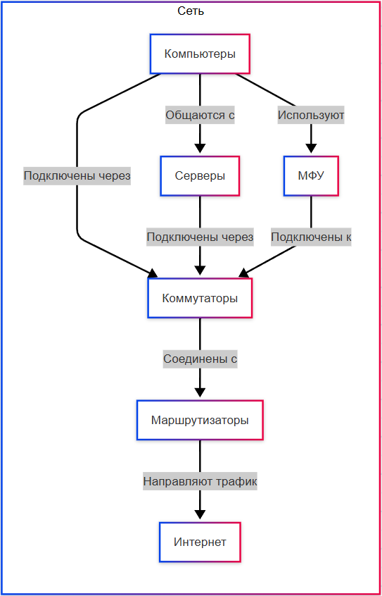

# Сетевые подключения и диагностика

<div class="article-tags">
  <span class="tag tag-required">ОБЯЗАТЕЛЬНО</span>
  <span class="tag tag-beginner">ДЛЯ НОВИЧКОВ</span>
</div>

<span class="complexity-badge">Разработчику</span>
<span class="complexity-badge">Архитектору</span>
<span class="complexity-badge">Инженеру</span>

---

## Сеть и соединения

Системный администратор отвечает за то, чтобы каждый узел сети — от настольного ПК до облачного экземпляра — мог корректно идентифицироваться, находить других участников, обмениваться данными и сохранять доступность в условиях роста нагрузки или сбоев. Это требует понимания как физического уровня (кабели, порты, Wi‑Fi), так и протокольного стека (IP, TCP/UDP, прикладные протоколы), а также умения настраивать, диагностировать и защищать сетевые соединения.



На схеме изображена типичная гетерогенная сеть:  
- **Узлы** — конечные устройства (ПК, серверы, ноутбуки), исполняющие прикладную логику.  
- **Коммутаторы (свитчи)** — устройства канального уровня, объединяющие узлы в единую локальную сеть (LAN) по MAC‑адресам; они не маршрутизируют трафик между подсетями.  
- **Маршрутизаторы (роутеры)** — устройства сетевого уровня, принимающие решения о пересылке пакетов между сетями на основе IP‑адресов; именно они связывают локальную сеть с внешним миром (например, с интернетом через провайдера).  
- **МФУ и периферийные устройства** — принтеры, сканеры, IP‑камеры, IoT‑устройства — в современных условиях почти всегда обладают собственным сетевым интерфейсом и участвуют в обмене данными как полноценные узлы.

Важно подчеркнуть: сетевой адаптер (физический или виртуальный) каждого устройства должен обладать корректно назначенным сетевым адресом. От этого зависят и возможность обнаружения устройства, и маршрутизация к нему, и безопасность взаимодействия.

---

### Основы адресации 

IP‑адрес — это числовой идентификатор узла в составе IP‑сети. В IPv4 это 32‑битное число, традиционно записываемое в виде четырёх десятичных октетов, разделённых точками (например, `192.168.1.10`). Хотя технически это единое число, удобно рассматривать его как пару *сетевой префикс + хостовая часть*.  

В частных (внутренних) сетях используются зарезервированные диапазоны, определённые в RFC 1918:  
- `10.0.0.0` — `10.255.255.255`  
- `172.16.0.0` — `172.31.255.255`  
- `192.168.0.0` — `192.168.255.255`  

Наиболее распространён в домашних и небольших офисных сетях диапазон `192.168.0.0/24` или `192.168.1.0/24`, где `/24` означает, что первые 24 бита — сетевая часть, а оставшиеся 8 бит — хостовые. Это позволяет адресовать до 254 узлов (`192.168.1.1` — `192.168.1.254`; `.0` — сеть, `.255` — широковещательный адрес).

Устройству IP‑адрес может быть назначен двумя способами:  
- **Статически**, вручную, через настройки операционной системы или сетевого оборудования.  
- **Динамически**, посредством протокола DHCP (Dynamic Host Configuration Protocol), при котором узел запрашивает адрес у сервера при подключении к сети.

Статический адрес необходим для серверов, сетевых принтеров, IP‑камер и других устройств, к которым требуется стабильное обращение по известному адресу. При динамическом назначении адрес может измениться после перезагрузки или истечения аренды — это приемлемо для конечных пользователей, но нежелательно для сервисов.

Стоит отметить: внешний (публичный) IP‑адрес, присваиваемый провайдером, зачастую динамический. Это значит, что после перезагрузки роутера или переподключения к провайдеру внешний адрес может смениться. Для сервисов, доступных из интернета (веб‑сайты, почтовые серверы), требуется **статический публичный IP**, который провайдер предоставляет за отдельную плату. При его отсутствии применяются обходные решения — динамические DNS‑сервисы (например, `noip.com`, `duckdns.org`), которые связывают доменное имя с текущим IP‑адресом и обновляют запись при его изменении.

---

### Как узнать IP‑адрес устройства  

На уровне операционной системы определение текущего IP‑адреса — базовая задача диагностики. В Linux и macOS используется утилита `ip`, входящая в пакет `iproute2`. Команда:

```bash
ip addr show
```

выводит список всех сетевых интерфейсов, их состояния и присвоенные адреса. Имена интерфейсов зависят от дистрибутива: классические `eth0` / `wlan0` или предсказуемые `enp3s0`, `wlp2s0` (смотрите столбец в выводе). Альтернативно — устаревший, но распространённый `ifconfig`, если установлен.

Фрагмент типичного вывода (адреса условные):

```text
2: enp3s0: <BROADCAST,MULTICAST,UP,LOWER_UP>
    inet 192.168.1.42/24 brd 192.168.1.255 scope global enp3s0
```

Строка `inet …/24` — IPv4-адрес и длина префикса (маска `/24`). `UP` — интерфейс включён.

В Windows информация доступна через графический интерфейс — "Сетевые подключения" → свойства адаптера → "Состояние" → "Сведения". В командной строке (cmd или PowerShell) используется:

```cmd
ipconfig
```

Для получения только IPv4‑адреса активного интерфейса подойдёт:

```cmd
ipconfig | findstr /R /C:"IPv4.*:"
```

В PowerShell можно использовать:

```powershell
(Get-NetIPAddress -AddressFamily IPv4 | Where-Object { $_.InterfaceAlias -notlike "*Loopback*" }).IPAddress
```

Обратите внимание на наличие **loopback‑адреса** `127.0.0.1`. Это виртуальный интерфейс, который всегда существует на каждом узле и означает "сам себя". Запросы к `127.0.0.1` никогда не покидают устройство — они перехватываются сетевым стеком ОС. Loopback используется для локального тестирования сервисов.

---

### Подключение к другому устройству 

Прежде чем устанавливать сложные соединения, необходимо убедиться в базовой доступности узла. Самым простым и универсальным инструментом является `ping`. Эта команда отправляет ICMP‑пакеты типа *Echo Request* и ожидает ответа *Echo Reply*. Пример:

```bash
ping 192.168.1.10
```

Если ответы приходят, это означает, что:  
- IP‑адрес целевого узла достижим;  
- на пути между узлами нет блокировки ICMP (например, firewall может запрещать `ping`, но при этом разрешать HTTP);  
- сетевой стек на целевом устройстве работает.

Отсутствие ответа не означает, что устройство выключено — возможно, оно просто не отвечает на ICMP. Поэтому `ping` — лишь первый шаг.

| Симптом в выводе `ping` | Вероятная причина | Что проверить дальше |
|-------------------------|-------------------|----------------------|
| `64 bytes from … time=1 ms` | Узел доступен на L3 | Порт и службу (`nc`, `Test-NetConnection`) |
| `Request timed out` | ICMP фильтруется или нет маршрута | Маршрут, firewall, правильный IP |
| `Destination Host Unreachable` | Нет ARP/маршрута в сегменте | Кабель, VLAN, шлюз |
| `Name or service not known` | Ошибка DNS, не ping | `nslookup`, `/etc/resolv.conf` |

Таблица полезна как "быстрая развилка": она не ставит окончательный диагноз, но помогает не тратить время на случайные проверки. В операционной работе это особенно важно, когда нужно быстро понять, проблему искать в маршрутизации, DNS или уже на уровне конкретного сервиса.

Следующий этап — проверка конкретных **портов**. Порт — это логический номер в диапазоне 0–65535, который позволяет одному IP‑адресу обслуживать множество одновременных соединений. Порты 0–1023 зарезервированы для системных служб (например, 22 — SSH, 80 — HTTP, 443 — HTTPS). Остальные — динамические или зарегистрированные.

Для проверки открытости порта вручную можно использовать:  
- `telnet <адрес> <порт>` — если соединение устанавливается и появляется пустой экран (или приветствие сервера), порт открыт; если соединение разрывается сразу или висит — порт закрыт или фильтруется.  
- `nc` (netcat) — более гибкий инструмент:  
  ```bash
  nc -zv 192.168.1.10 22
  ```
  флаг `-z` означает "только проверить", `-v` — подробный вывод.

В Windows `telnet` по умолчанию может быть отключён — его необходимо включить через "Включение или отключение компонентов Windows". Альтернативно — использовать PowerShell:

```powershell
Test-NetConnection -ComputerName 192.168.1.10 -Port 22
```

Если порт открыт, это значит, что на удалённом узле запущен сервис, слушающий этот порт, и сетевой стек позволяет установить TCP‑соединение.

---

## Создание собственной локальной сети

**Локальная сеть (LAN)** может быть организована даже без роутера — достаточно кросс‑кабеля (или современного straight‑through кабеля, так как почти все сетевые адаптеры поддерживают автоопределение MDI/MDIX) и ручной настройки адресов.

---

### На Linux  

1. Подключите два компьютера напрямую или через коммутатор.  
2. На каждом устройстве назначьте IP‑адреса из одной подсети. Например:  
   ```bash
   sudo ip addr add 192.168.10.1/24 dev eth0
   sudo ip link set eth0 up
   ```
   На втором:
   ```bash
   sudo ip addr add 192.168.10.2/24 dev eth0
   sudo ip link set eth0 up
   ```
3. Проверьте связь:  
   ```bash
   ping 192.168.10.2
   ```

Если нужен общий доступ в интернет, потребуется третий узел — шлюз с двумя интерфейсами: один в локальной сети, второй — в WAN (например, через Wi‑Fi к роутеру провайдера). На шлюзе включается IP‑форвардинг:

```bash
echo 1 | sudo tee /proc/sys/net/ipv4/ip_forward
```

и настраивается NAT с помощью `iptables` или `nftables`.

---

### На Windows  

1. Откройте "Панель управления" → "Сетевые подключения".  
2. Щёлкните правой кнопкой по активному адаптеру → "Свойства" → "IP версии 4 (TCP/IPv4)" → "Свойства".  
3. Выберите "Использовать следующий IP‑адрес" и укажите:  
   - IP-адрес: `192.168.10.1`  
   - Маска подсети: `255.255.255.0`  
   - Основной шлюз: оставить пустым (если интернет не требуется).  
4. Повторите на втором устройстве, указав `192.168.10.2`.  
5. Проверьте через `ping 192.168.10.2`.

Такая сеть будет полностью изолирована. При необходимости подключения к интернету необходимо подключить один из узлов к роутеру (через второй адаптер или Wi‑Fi) и включить функцию "Общий доступ к подключению к Интернету" (ICS — Internet Connection Sharing) в свойствах WAN‑адаптера. Windows автоматически назначит LAN‑адаптеру адрес `192.168.137.1` и запустит DHCP‑сервер для выдачи адресов `192.168.137.x`.

---

## Подключение к существующей локальной сети  

В большинстве случаев пользовательское устройство подключается к LAN автоматически:  
- При подключении по кабелю или Wi‑Fi сетевой адаптер отправляет DHCP‑запрос.  
- DHCP‑сервер (обычно встроенный в роутер) отвечает, назначая:  
  - IP‑адрес,  
  - маску подсети,  
  - адрес шлюза по умолчанию,  
  - адреса DNS‑серверов.  

Если DHCP недоступен, ОС может применить механизм **APIPA** (Automatic Private IP Addressing) и присвоить адрес из диапазона `169.254.0.0/16`. Такой адрес означает, что сеть физически подключена, но не настроена — устройство может взаимодействовать только с другими узлами, имеющими APIPA в той же подсети (редко используется на практике, в основном — для диагностики).

При ручной настройке важно, чтобы:  
- IP‑адрес не дублировался (иначе возникнет конфликт ARP);  
- маска подсети совпадала у всех узлов в LAN;  
- шлюз по умолчанию указывал на маршрутизатор;  
- DNS‑серверы были доступны (например, `8.8.8.8`, `1.1.1.1`, или внутренние серверы провайдера).

---

## Настройка доступа в Интернет  

Доступ в интернет реализуется через трёхзвенную цепочку:  
1. **Узел → шлюз (роутер)** — маршрутизация внутри LAN.  
2. **Шлюз → провайдер** — соединение по PPPoE, DHCP, статическому IP или другому протоколу (например, L2TP/IPsec для корпоративных линий).  
3. **Провайдер → глобальная сеть** — маршрутизация через BGP, MPLS и другие технологии магистрального уровня.

На уровне домашнего или офисного роутера основная задача — **NAT (Network Address Translation)**. Внутренние узлы используют частные адреса, а роутер заменяет их на один публичный IP при отправке пакетов в интернет и возвращает ответы, сохраняя соответствие соединений в таблице трансляции. Это позволяет множеству устройств работать через один внешний адрес.

Для сервера, доступного извне, требуется **проброс портов (port forwarding)**: правило в роутере, которое перенаправляет входящий трафик на определённый порт публичного IP на внутренний IP и порт сервера. Например:  
- Внешний IP: `203.0.113.5`, порт `80` → `192.168.1.50:80` (веб‑сервер).  

Без этого правила сервер останется "невидим" для внешних пользователей, даже если на нём запущен Apache.

---

## Работа с сетью

### SSH и Telnet  

**SSH (Secure Shell)** — это не просто протокол для командной строки. Это полноценная экосистема, включающая методы аутентификации, шифрования, туннелирования и управления сессиями. Разработанный в середине 1990‑х как замена небезопасному Telnet, SSH стал де-факто стандартом для администрирования серверов, маршрутизаторов, сетевых хранилищ и даже встраиваемых устройств.

SSH работает по умолчанию на TCP‑порту **22**. Клиент устанавливает зашифрованное соединение с сервером, после чего происходит согласование криптографического алгоритма (например, `chacha20-poly1305`, `aes256-gcm`), обмен ключами по алгоритму Диффи— Хеллмана и аутентификация. Последняя может быть:  
- **по паролю** — простая, но уязвимая к brute‑force и перехвату (если используется слабый пароль);  
- **по ключу** — генерируется пара: закрытый ключ (хранится на клиенте, защищён парольной фразой), открытый — размещается на сервере в `~/.ssh/authorized_keys`. Это значительно повышает безопасность: даже при прослушивании соединения атакующий не получит учётные данные, а подбор закрытого ключа вычислительно неосуществим при достаточной длине.

SSH поддерживает **портовое пробрасывание** (port forwarding):  
- **Локальное** (`-L`): клиент перенаправляет локальный порт на удалённый хост через туннель. Полезно для доступа к веб‑интерфейсу сервиса, запущенного на сервере, но не открытого наружу.  
- **Удалённое** (`-R`): сервер прослушивает порт и перенаправляет трафик к клиенту — применяется для временного открытия локального сервиса (например, разработка на ноутбуке) для внешнего доступа.  
- **Динамическое** (`-D`): создаётся SOCKS‑прокси на клиенте, через который можно направлять произвольный трафик.

Современные практики рекомендуют:  
- отключить вход по паролю (`PasswordAuthentication no` в `/etc/ssh/sshd_config`);  
- запретить вход под пользователем `root` (`PermitRootLogin no`);  
- изменить стандартный порт (необязательно, но снижает шум в логах от сканеров);  
- ограничить список разрешённых пользователей (`AllowUsers timur`);  
- использовать `fail2ban` или аналоги для блокировки после нескольких неудачных попыток.

---

**Telnet**, напротив, — протокол без шифрования. Весь обмен, включая логин и пароль, передаётся в открытом виде. Он работает на порту **23** и использует простой текстовый протокол на основе TCP. Хотя Telnet до сих пор встроен в сетевое оборудование (коммутаторы, маршрутизаторы старых поколений), его использование в публичных или даже корпоративных сетях считается неприемлемым с точки зрения информационной безопасности.

Практически во всех регуляторных стандартах (PCI DSS, ГОСТ Р, ISO/IEC 27001) прямо запрещено применение Telnet для администрирования. Если устройство поддерживает только Telnet, его необходимо изолировать в отдельную сегментированную VLAN без выхода в другие зоны, либо заменить на совместимое с SSH.

---

### Проверка портов  

Помимо `telnet` и `nc`, для проверки портов применяются более специализированные утилиты:  
- **`nmap`** — мощный сканер, способный проверить открытость портов и определить версию сервиса, ОС, скрипты расширения (NSE) для обнаружения уязвимостей. Пример базового сканирования:  
  ```bash
  nmap -p 22,80,443 192.168.1.50
  ```
  Флаг `-sV` включает определение версии, `-A` — агрессивный режим (ОС, скрипты, трассировка).

- **`ss`** (socket statistics) и **`lsof`** — для анализа *локальных* прослушиваемых сокетов.  
  ```bash
  ss -tuln
  ```
  покажет все TCP/UDP‑сокеты в состоянии `LISTEN`, с числовыми адресами и портами (флаги `-t` — TCP, `-u` — UDP, `-l` — слушающие, `-n` — без разрешения имён).

- **`tcpdump`** и **`Wireshark`** — анализ трафика на уровне пакетов. `tcpdump` работает в консоли, захватывает пакеты с интерфейса и выводит их в текстовом виде или в файл (`pcap`). Wireshark — GUI‑оболочка с мощными фильтрами и декодированием протоколов.

Частая ошибка: считать, что "порт закрыт", если `nmap` показывает `filtered`. Это означает, что пакеты блокируются брандмауэром — сам сервис может быть активен, но недоступен извне из-за политики фильтрации.

---

### Прикладные протоколы

Перечисленные протоколы — не случайный набор. Они реализуют конкретные задачи в рамках модели клиент— сервер и строятся поверх транспортных протоколов (преимущественно TCP, реже UDP). Ниже — систематическое описание без списков, с акцентом на логику взаимодействия.

**HTTP (HyperText Transfer Protocol)** — прикладной протокол передачи гипертекста. Его основная цель — обмен запросами и ответами между клиентом (браузер, скрипт) и сервером (веб‑сервер, API). HTTP версии 1.1 работает поверх TCP, устанавливает соединение на порту 80, передаёт заголовки в текстовом виде, тело — в форматах `text/html`, `application/json` и др. Ключевые концепции:  
- **Методы** (`GET`, `POST`, `PUT`, `DELETE`) определяют тип операции;  
- **Статус-коды** (`200 OK`, `404 Not Found`, `500 Internal Server Error`) — результат обработки;  
- **Заголовки** (`Host`, `User-Agent`, `Content-Type`) — метаинформация для маршрутизации и обработки.

**HTTPS** — HTTP, защищённый с помощью TLS (Transport Layer Security). TLS обеспечивает:  
- аутентификацию сервера (и, при необходимости, клиента) через X.509‑сертификаты;  
- целостность данных (защита от модификации в пути);  
- конфиденциальность (шифрование сессии).  

Порт по умолчанию — 443. Современные браузеры требуют HTTPS для многих функций (геолокация, Service Workers), а поисковые системы ранжируют HTTPS‑сайты выше.

**FTP (File Transfer Protocol)** — один из старейших протоколов передачи файлов. Работает в двух режимах:  
- **Active** — клиент открывает управляющее соединение (порт 21), сервер инициирует *Данные*-соединение с клиентом на порт `20` → часто блокируется firewall’ами.  
- **Passive** — клиент инициирует оба соединения; сервер назначает временный порт для данных → предпочтительный в современных сетях.  

FTP не шифрует данные — для безопасной передачи используется **FTPS** (FTP over SSL/TLS) или **SFTP** (SSH File Transfer Protocol), который, несмотря на похожее название, *не связан с FTP*, а является подсистемой SSH.

**DNS (Domain Name System)** — распределённая база данных имён. Её задача — преобразование человекочитаемых имён (`example.com`) в IP‑адреса (`93.184.216.34`). DNS использует:  
- **Запросы/ответы** поверх UDP (порт 53), при превышении размера — TCP;  
- **Иерархию зон**: корневые серверы → домены верхнего уровня (`.com`, `.ru`) → авторитативные серверы зоны.  
- **Типы записей**: `A` (IPv4), `AAAA` (IPv6), `CNAME` (алиас), `MX` (почтовые серверы), `TXT`, `SRV` и др.

DNS‑кэширование на клиенте, резолвере и промежуточных серверах критично для производительности. TTL (Time To Live) в записи определяет, сколько секунд результат может храниться в кэше.

**IMAP (Internet Message Access Protocol) и POP3 (Post Office Protocol v3)** — протоколы получения электронной почты.  
- **POP3** (порт 110, 995 для SSL) скачивает письма на клиент и, по умолчанию, удаляет с сервера. Подходит для одиночного устройства.  
- **IMAP** (порт 143, 993 для SSL) синхронизирует состояние папок между сервером и несколькими клиентами. Письма остаются на сервере, поддерживается работа с пометками, флагами, поисковыми папками.  

Современные почтовые сервисы преимущественно используют IMAP.

**NTP (Сеть Time Protocol)** — синхронизация системного времени. Работает на UDP‑порту 123. Точность может достигать миллисекунд в локальной сети и сотен миллисекунд через интернет. Серверы образуют иерархию *страт*: stratum 0 — атомные часы, stratum 1 — серверы, напрямую подключённые к ним, stratum 2 — клиенты stratum 1 и т.д.

**SNMP (Simple Network Management Protocol)** — протокол сбора телеметрии и управления устройствами (роутеры, свитчи, ИБП). Использует UDP (порты 161 для запросов, 162 для трэпов — асинхронных уведомлений). Версии:  
- SNMPv1/v2c — аутентификация по community‑строке (незашифрованной);  
- SNMPv3 — поддержка шифрования и аутентификации (наиболее безопасен).  

SNMP позволяет получать значения счётчиков (трафик, ошибки, температура), а также устанавливать параметры (например, VLAN).

**RTSP (Real Time Streaming Protocol)** — управление потоковым видео/аудио. Не передаёт медиаданные напрямую, а управляет сессиями (`PLAY`, `PAUSE`, `TEARDOWN`). Медиапотоки передаются по RTP/RTCP, часто поверх UDP. Используется в IP‑камерах, медиасерверах (VLC, Wowza).

**XDMCP (X Display Manager Control Protocol)** — устаревший протокол удалённого запуска графических приложений из X11. Позволяет клиенту подключиться к дисплейному менеджеру (например, `gdm`, `xdm`) и получить графический вход в систему. В современных условиях почти не применяется из‑за отсутствия шифрования и широкого распространения Wayland и SSH с X11 forwarding (`ssh -X`).

---

### Сетевая конфигурация виртуальных машин  

Виртуализация вносит дополнительный уровень абстракции сетевых интерфейсов. Гипервизор (KVM, VMware, Hyper-V, VirtualBox) создаёт виртуальные сетевые адаптеры и связывает их с физическими ресурсами хоста через различные режимы:

- **NAT (Network Address Translation)** — виртуальная машина получает IP из приватной подсети (например, `10.0.2.0/24`), трафик в интернет маршрутизируется через виртуальный роутер хоста с трансляцией адресов. Входящие соединения извне невозможны без проброса портов. Подходит для изолированного тестирования.

- **Bridge (мост)** — виртуальный адаптер подключается к физическому интерфейсу хоста на канальном уровне. ВМ получает IP из той же подсети, что и хост, и ведёт себя как полноценный узел LAN. Требуется, если виртуальная машина должна быть доступна напрямую (например, веб‑сервер в виртуалке).

- **Host-only** — сеть только между хостом и ВМ, без доступа в LAN или интернет. Используется для безопасной отладки.

В Linux при использовании KVM/libvirt типичная конфигурация bridge выглядит так: создаётся интерфейс `br0`, к которому привязан физический `eth0`, а виртуальные интерфейсы ВМ подключаются как порты моста. В Windows Hyper-V аналог — *External Virtual Switch*, связанный с физическим адаптером.

Важно: при клонировании ВМ следует менять MAC‑адреса и, при необходимости, хостовые имена, чтобы избежать конфликтов DHCP и ARP.

---

### Сетевые настройки периферийных устройств — принтеры, МФУ, IoT  

Современные сетевые принтеры и МФУ оснащаются встроенным TCP/IP‑стеком и веб‑интерфейсом для конфигурации. Типичная последовательность настройки:

1. Подключить устройство к сети (кабель или Wi‑Fi).  
2. Получить временный IP (через DHCP) или использовать кнопку "WPS" для автоматической настройки Wi‑Fi.  
3. Найти IP (через LCD‑панель, или через утилиту поиска от производителя, или через `arp -a` после печати тестовой страницы).  
4. Открыть в браузере `http://<IP>` — доступен веб‑интерфейс.  
5. Назначить статический IP (если требуется), настроить SNMP, syslog, LDAP/AD‑аутентификацию, email‑оповещения.  
6. Интегрировать в систему:  
   - В Windows — "Добавление принтера" → "Сетевой принтер" → указание IP или имени.  
   - В Linux — через CUPS (`http://localhost:631`), добавление принтера по URI `ipp://192.168.1.30/ipp/print` или `socket://192.168.1.30:9100`.

Многие МФУ поддерживают **AirPrint**, **Mopria**, **IPP Everywhere** — протоколы бездрайверной печати через стандартный HTTP/IPP. Это упрощает развёртывание в гетерогенных средах.

IoT‑устройства (умные розетки, камеры, датчики) часто используют UPnP (Universal Plug and Play) для автоматического открытия портов и обнаружения в сети. Однако UPnP считается уязвимым — его рекомендуется отключать на роутере в защищённых средах.

---

## Веб‑серверы 

Веб‑сервер — это сложный программный агент, ответственный за приём входящих TCP‑соединений, парсинг HTTP‑запросов, маршрутизацию на обработчики, взаимодействие с приложениями, управление соединениями и обеспечение производительности и отказоустойчивости. Выбор сервера определяется не предпочтениями, а требованиями к масштабируемости, интеграции с экосистемой и типом нагрузки.

---

### IIS (Internet Information Services)  

IIS — веб‑сервер и платформа приложений, интегрированная в Windows Server начиная с версии 2000. Его архитектура построена на модульной модели **HTTP.SYS** — драйвере ядра, который принимает и очередирует HTTP‑запросы *до* передачи в пользовательское пространство. Это даёт несколько ключевых преимуществ:  
- Ядерный уровень обработки обеспечивает высокую эффективность фильтрации (например, блокировка по IP или user-agent на уровне драйвера);  
- Поддержка kernel‑mode кэширования статического контента (файлов, изображений);  
- Встроенная поддержка Windows Authentication (NTLM, Kerberos), что критично для корпоративных сред на базе Active Directory.

IIS работает в тесной связке с **.NET Framework / .NET Core** через модуль **ASP.NET**. Приложение может быть развёрнуто в режиме *In-Process* (приложение загружается непосредственно в рабочий процесс `w3wp.exe`) или *Out-Of-Process* (через Kestrel и обратный прокси). Последний режим ближе к парадигме Linux‑стека и рекомендуется для .NET Core.

Конфигурация IIS происходит через:  
- GUI — *Диспетчер IIS*, удобный для разовых задач;  
- `web.config` — XML‑файл в корне сайта, наследуемый по дереву каталогов;  
- PowerShell — `WebAdministration` модуль (`Get-Website`, `New-WebBinding`, `Set-WebConfigurationProperty`).  

Важно: IIS по умолчанию отключает многие расширения (например, `.json`, `.svg`) — их нужно явно разрешать через MIME‑типы. Также включено строгое управление правами NTFS: если у пула приложений (`AppPool Identity`) нет доступа к файлу — будет ошибка 403, даже при корректных HTTP‑настройках.

---

### Apache HTTP Server  

Apache — один из старейших и наиболее гибких веб‑серверов с открытым исходным кодом. Его архитектура основана на **модульности**: ядро отвечает за приём соединений и базовый цикл обработки, а функциональность добавляется через модули (`mod_ssl`, `mod_rewrite`, `mod_proxy`, `mod_php`).  

Apache поддерживает несколько **моделей многопоточности**:  
- `prefork` — процессная модель (один процесс = один соединение), стабильна для непотокобезопасных модулей (например, `mod_php` в старых версиях);  
- `worker` и `event` — гибридные (потоки внутри процессов), эффективны при высокой concurrency.  

Конфигурация осуществляется в текстовых файлах: `httpd.conf`, `apache2.conf`, `sites-available/*.conf`. Принцип **виртуальных хостов** позволяет размещать несколько сайтов на одном IP и порту, различая их по заголовку `Host`.  

Ключевая сила Apache — **`mod_rewrite`**, мощный механизм преобразования URL с использованием регулярных выражений. Он используется для SEO‑дружественных URL, миграции путей, блокировки ботов. Однако чрезмерное использование `.htaccess` (переопределение конфигурации на уровне каталога) снижает производительность — его следует отключать в production (`AllowOverride None`) и переносить правила в центральный конфиг.

Apache хорошо подходит для динамических приложений PHP (через `mod_php` или PHP-FPM), где важна совместимость с legacy‑кодом и сложные rewrite‑правила.

---

### Nginx  

Nginx изначально проектировался как **асинхронный, событийно-ориентированный** сервер. В отличие от Apache, он не создаёт поток/процесс на соединение. Вместо этого один рабочий процесс (worker) обрабатывает тысячи соединений одновременно, используя системные вызовы `epoll` (Linux), `kqueue` (BSD) или IOCP (Windows). Это даёт исключительную эффективность при serving статики и проксировании.

Основные роли Nginx:  
1. **Веб‑сервер статики** — отдача файлов с минимальной задержкой, кэширование на уровне диска и памяти (`proxy_cache`, `fastcgi_cache`);  
2. **Обратный прокси** — приём запросов от клиентов и перенаправление на backend (Apache, Kestrel, Node.js, Java‑приложение);  
3. **Балансировщик нагрузки** — распределение трафика между несколькими серверами с поддержкой алгоритмов (`round-robin`, `least_conn`, `ip_hash`), health checks, slow start;  
4. **TLS terminator** — обработка SSL/TLS на одном узле, передача расшифрованного трафика внутрь (экономия ресурсов backend’ов);  
5. **WAF и защита** — через модули `ngx_http_limit_req_module` (ограничение запросов), `ngx_http_geo_module` (геоблокировка), или интеграция с ModSecurity.

Конфигурация Nginx декларативна: директивы группируются в контексты (`http`, `server`, `location`). Приоритет обработки определяется степенью специфичности `location` (точное совпадение `=`, префикс `^~`, регулярное выражение `~`). Это требует дисциплины при написании конфигов — неправильный порядок может привести к неожиданному маршруту.

Пример типичного стека:  
- Пользователь → Nginx (TLS, балансировка) → несколько Kestrel‑инстансов (.NET) → Redis (кеширование) → PostgreSQL (БД).  
Nginx выступает как "внешний фасад", обеспечивая отказоустойчивость, защиту и эффективную доставку.

Выбор между Apache и Nginx сегодня редко бывает антагонистическим: часто используется гибрид — Nginx как frontend (статика, SSL, load balancing), Apache как backend (сложные rewrite, legacy PHP). IIS остаётся доминирующим в Windows‑экосистеме, особенно при глубокой интеграции с AD и .NET Framework.

> **Справочники:** [Nginx](/encyclopedia/8-infra-security/8-04-devops-ci-cd/3112), [Apache HTTP Server](/encyclopedia/8-infra-security/8-04-devops-ci-cd/3125) (включая схему Nginx + Apache).

---

### DNS‑сервер 

Локальный DNS‑сервер решает две основные задачи:  
1. **Рекурсивное разрешение имён** — отвечает на запросы клиентов, выполняя полный поиск в иерархии DNS (как общедоступные резолверы 8.8.8.8);  
2. **Авторитативное обслуживание зон** — предоставляет записи для доменов, которыми управляет администратор (например, `corp.local`, `srv01.corp.local`).  

---

#### В Linux — BIND9 (Berkeley Internet Name Domain)  

BIND9 — самый распространённый DNS‑сервер с открытым исходным кодом. Основные компоненты конфигурации:  
- `named.conf` — главный файл, определяет глобальные параметры, зоны и ACL;  
- `db.<zone>` — файлы зон в текстовом формате (master‑файлы).  

Пример зоны прямого просмотра (`forward zone`) для `lab.local`:  
```bind
zone "lab.local" {
    type master;
    file "/etc/bind/db.lab.local";
};
```

Содержимое `db.lab.local`:  
```
$TTL 86400
@   IN  SOA ns1.lab.local. admin.lab.local. (
        2025111801 ; serial
        3600       ; refresh
        600        ; retry
        1209600    ; expire
        86400 )    ; minimum

    IN  NS  ns1.lab.local.
ns1 IN  A   192.168.1.10
srv1 IN A   192.168.1.20
printer IN A 192.168.1.30
```

Для обратного просмотра (по IP → имя) создаётся зона `1.168.192.in-addr.arpa`.  

BIND поддерживает динамическое обновление зон через `nsupdate` (используется DHCP‑сервером для регистрации клиентов), а также TSIG — подписанные запросы для безопасного обмена между серверами.

---

#### В Windows — DNS Server Role  

Устанавливается как роль в *Server Manager* → *Add Roles and Features*. Интегрируется с Active Directory: зоны могут храниться в AD (реплицируются между контроллерами), поддерживается безопасное динамическое обновление (только аутентифицированные клиенты могут менять записи).  

Ключевые отличия от BIND:  
- GUI‑интерфейс (DNS Manager) позволяет быстро добавлять записи, просматривать журналы;  
- Поддержка **WINS** (устаревшая, но иногда требуется для совместимости с NetBIOS);  
- Автоматическая регистрация клиентов в зоне при вступлении в домен;  
- Возможность делегирования зон через *Conditional Forwarding* — перенаправление запросов для определённых доменов на внешние серверы.

Независимо от платформы, важно настроить:  
- **Зоны прямого и обратного просмотра** для всех внутренних устройств;  
- **PTR‑записи** для корректной работы многих сервисов (например, почтовые серверы проверяют соответствие IP и имени при подключении);  
- **Резервирование** — вторичный DNS‑сервер (slave) для отказоустойчивости.

---

### Балансировщик нагрузки 

Балансировщик нагрузки (Load Balancer, LB) — это промежуточное звено между клиентами и серверами приложений. Его задача — обеспечить высокую доступность и масштабируемость, распределяя входящие запросы так, чтобы ни один сервер не перегружался, а отказ отдельного узла не приводил к простою сервиса.

---

#### Уровни балансировки  

- **L4 (Transport Layer)** — балансировка на основе IP и порта (TCP/UDP). Решение принимается до установки полного HTTP‑сессии. Используется в высоконагруженных сценариях (игровые серверы, VoIP). Пример: `haproxy` в режиме `tcp`, `nginx stream`, аппаратные LB (F5, Citrix ADC).  
- **L7 (Application Layer)** — анализ HTTP‑заголовков, URI, cookies. Позволяет маршрутизировать по пути (`/api` → API‑серверы, `/static` → CDN), по заголовку `Host`, по содержимому тела (редко). Пример: `nginx http`, `haproxy http`, AWS ALB.

---

#### Основные алгоритмы распределения  

- **Round Robin** — поочерёдное назначение серверам. Прост, но не учитывает нагрузку.  
- **Least Connections** — запрос направляется на сервер с наименьшим числом активных соединений. Эффективен при неравномерной длительности сессий.  
- **IP Hash** — хэш от клиентского IP определяет сервер. Обеспечивает *session persistence* ("липкие сессии"), когда важно, чтобы один клиент всегда попадал на один бэкенд (например, при отсутствии общего кэша).  
- **Weighted** — серверам присваиваются веса (например, более мощному — 2, менее — 1).  

---

#### Health Checks (проверка работоспособности)  

Балансировщик периодически опрашивает бэкенды:  
- **TCP check** — попытка установить соединение на порт;  
- **HTTP check** — GET‑запрос к `/health`, ожидание кода 200;  
- **Script check** — выполнение пользовательского скрипта (редко).  

Если проверка не проходит заданное число раз — сервер исключается из пула. После восстановления — возвращается (возможно, с *slow start*, постепенным наращиванием нагрузки).

---

#### Реализации  

- **Программные** (софт):  
  - `nginx` — гибкость, поддержка HTTP/2, gRPC, rate limiting;  
  - `haproxy` — высокая производительность L4/L7, продвинутые ACL, статистика в реальном времени;  
  - `traefik` — ориентирован на контейнеры (автоматическое обнаружение через Docker, Kubernetes labels).  

- **Аппаратные** — специализированные устройства с ASIC для ускорения обработки (F5 BIG-IP, Citrix ADC, A10). Обеспечивают миллионы RPS, DDoS‑защиту, SSL offload на "железе".

- **Облачные** — AWS ELB/ALB/NLB, Google Cloud Load Balancing, Yandex Application Load Balancer. Управляются через API, масштабируются автоматически, интегрированы с метриками и autoscaling.

---


На схеме изображена типичная архитектура серверного кластера:  
- **Балансировщик** принимает запросы и распределяет их между экземплярами **сервера приложений** (IIS/Nginx/Apache).  
- Сервер приложений взаимодействует с **выполняемой средой** (.NET, Java, Node.js), которая, в свою очередь, обращается к **СУБД** и **кеширующему серверу**.  
- **Прокси‑сервер** (например, Squid или Nginx в режиме forward proxy) может использоваться для контроля исходящего трафика или кэширования внешних ресурсов.  
- **Мониторинг** (Prometheus + Grafana, Zabbix, netdata) собирает метрики со всех уровней — от сетевых интерфейсов до бизнес‑логики.  
- **Контейнеры и оркестраторы** (Docker, Kubernetes) позволяют упаковать приложение и все зависимости, обеспечив единообразное развёртывание и управление жизненным циклом.

---
---

{/* http-basics-link  */}
<div class="callout callout--tip">
  <div class="callout-title">Основа по протоколу</div>
  Базовый разбор HTTP и HTTPS находится в отдельной статье — [HTTP как основа веб-интеграций](/encyclopedia/2-system-network/2-09-osnovy-integratsionnogo-vzaimodeystviya/118).
</div>

---

## Базовый runbook сетевой диагностики

Минимальный порядок действий при симптоме "сеть не работает":

1. Проверить физику: link, кабель, порт, Wi-Fi профиль.
2. Проверить IP, DNS и шлюз.
3. Проверить маршрут и доступность порта сервиса.
4. Проверить firewall и ACL на пути.

Смысл порядка именно в последовательности. Если пропустить физику и сразу идти в маршрутизацию, легко потерять время на "ложную сложность". В большинстве инцидентов причина обнаруживается на первых двух шагах: интерфейс down, неверный DNS, неправильный шлюз или конфликт адресов.

### Практический совет

Сохраняйте эталонные команды для своей ОС в одном месте и используйте единый шаблон отчёта по инциденту. Это ускоряет передачу смены и снижает число повторных проверок.

Связанные статьи: [NAT и проброс портов](./7.md), [Организация домашней сети](./61.md), [Диагностика и обработка системных ошибок](./9.md).

